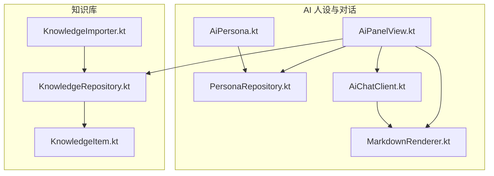
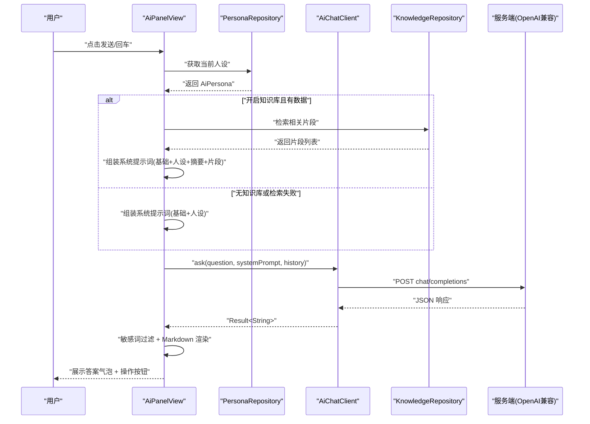
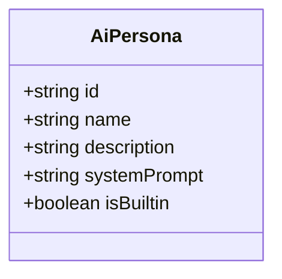
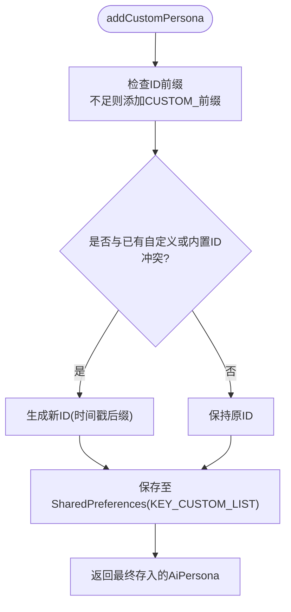
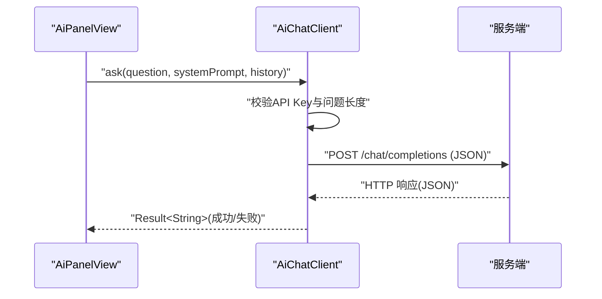
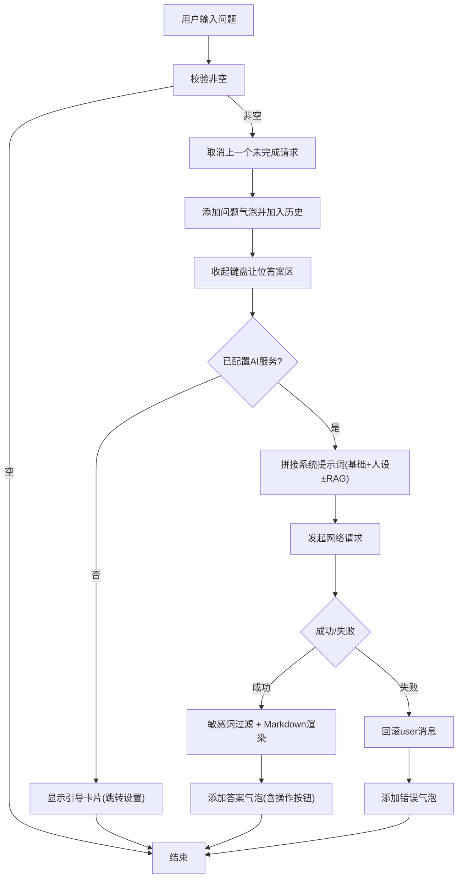
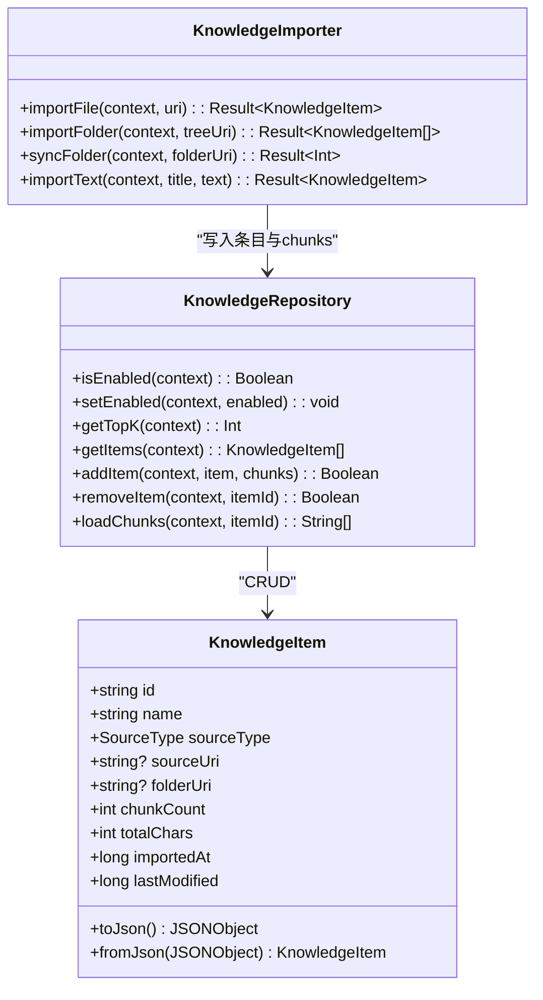
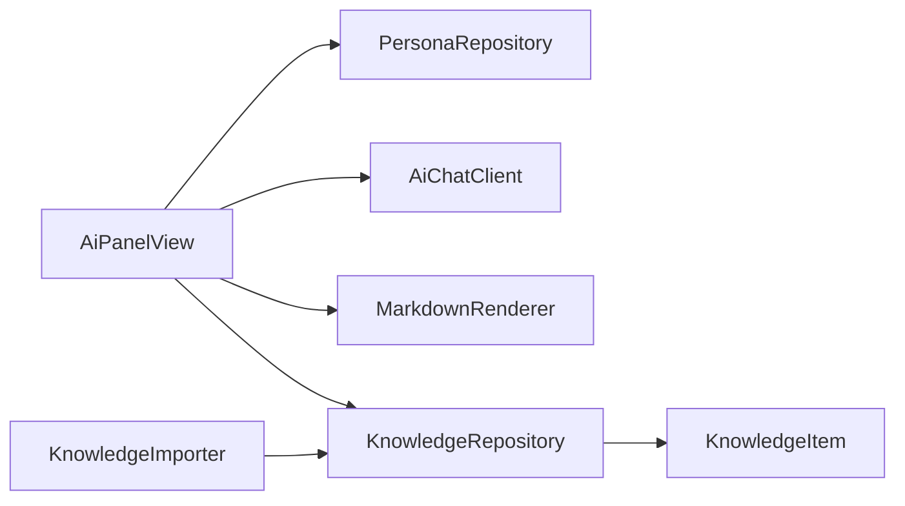

# AI 人设系统

<cite>
**本文引用的文件**   
- [AiPersona.kt](file://app/src/main/java/com/ziyou/ime/ai/AiPersona.kt)
- [PersonaRepository.kt](file://app/src/main/java/com/ziyou/ime/ai/PersonaRepository.kt)
- [AiChatClient.kt](file://app/src/main/java/com/ziyou/ime/ai/AiChatClient.kt)
- [MarkdownRenderer.kt](file://app/src/main/java/com/ziyou/ime/ai/MarkdownRenderer.kt)
- [AiPanelView.kt](file://app/src/main/java/com/ziyou/ime/ime/AiPanelView.kt)
- [KnowledgeImporter.kt](file://app/src/main/java/com/ziyou/ime/ai/knowledge/KnowledgeImporter.kt)
- [KnowledgeRepository.kt](file://app/src/main/java/com/ziyou/ime/ai/knowledge/KnowledgeRepository.kt)
- [KnowledgeItem.kt](file://app/src/main/java/com/ziyou/ime/ai/knowledge/KnowledgeItem.kt)
</cite>

## 目录
1. [简介](#简介)
2. [项目结构](#项目结构)
3. [核心组件](#核心组件)
4. [架构总览](#架构总览)
5. [详细组件分析](#详细组件分析)
6. [依赖关系分析](#依赖关系分析)
7. [性能考量](#性能考量)
8. [故障排查指南](#故障排查指南)
9. [结论](#结论)
10. [附录：配置示例与使用场景](#附录配置示例与使用场景)

## 简介
本技术文档围绕“AI 人设系统”展开，聚焦以下目标：
- 数据模型设计：AiPersona 的人设名称、描述、系统提示词与内置/自定义标识。
- 持久化存储：PersonaRepository 基于 SharedPreferences 的存储实现（含 JSON 序列化、ID 冲突处理、当前人设切换）。
- 创建与管理：预设人设加载、自定义人设增删改、动态切换与默认回退策略。
- 系统提示词组装：基础格式约束 + 人设指令注入 + RAG 检索融合（可选）。
- 导入导出：知识库导入流程与 JSON 规范（条目元数据与分块正文分离），批量操作与容量校验。
- 使用示例与开发测试指南：覆盖典型场景与验证方法。

## 项目结构
AI 人设系统位于 app 模块的 ai 包与 ime 面板中，核心文件组织如下：
- 数据模型与人设仓库：AiPersona.kt、PersonaRepository.kt
- 对话客户端与渲染：AiChatClient.kt、MarkdownRenderer.kt
- 交互面板：AiPanelView.kt（负责 UI、多轮历史、RAG 开关、人设切换）
- 知识库导入与存储：KnowledgeImporter.kt、KnowledgeRepository.kt、KnowledgeItem.kt

图表来源
- [AiPersona.kt:1-92](file://app/src/main/java/com/ziyou/ime/ai/AiPersona.kt#L1-L92)
- [PersonaRepository.kt:1-148](file://app/src/main/java/com/ziyou/ime/ai/PersonaRepository.kt#L1-L148)
- [AiChatClient.kt:1-194](file://app/src/main/java/com/ziyou/ime/ai/AiChatClient.kt#L1-L194)
- [MarkdownRenderer.kt:1-206](file://app/src/main/java/com/ziyou/ime/ai/MarkdownRenderer.kt#L1-L206)
- [AiPanelView.kt:1-765](file://app/src/main/java/com/ziyou/ime/ime/AiPanelView.kt#L1-L765)
- [KnowledgeImporter.kt:1-317](file://app/src/main/java/com/ziyou/ime/ai/knowledge/KnowledgeImporter.kt#L1-L317)
- [KnowledgeRepository.kt:1-142](file://app/src/main/java/com/ziyou/ime/ai/knowledge/KnowledgeRepository.kt#L1-L142)
- [KnowledgeItem.kt:1-77](file://app/src/main/java/com/ziyou/ime/ai/knowledge/KnowledgeItem.kt#L1-L77)

章节来源
- [AiPersona.kt:1-92](file://app/src/main/java/com/ziyou/ime/ai/AiPersona.kt#L1-L92)
- [PersonaRepository.kt:1-148](file://app/src/main/java/com/ziyou/ime/ai/PersonaRepository.kt#L1-L148)
- [AiChatClient.kt:1-194](file://app/src/main/java/com/ziyou/ime/ai/AiChatClient.kt#L1-L194)
- [MarkdownRenderer.kt:1-206](file://app/src/main/java/com/ziyou/ime/ai/MarkdownRenderer.kt#L1-L206)
- [AiPanelView.kt:1-765](file://app/src/main/java/com/ziyou/ime/ime/AiPanelView.kt#L1-L765)
- [KnowledgeImporter.kt:1-317](file://app/src/main/java/com/ziyou/ime/ai/knowledge/KnowledgeImporter.kt#L1-L317)
- [KnowledgeRepository.kt:1-142](file://app/src/main/java/com/ziyou/ime/ai/knowledge/KnowledgeRepository.kt#L1-L142)
- [KnowledgeItem.kt:1-77](file://app/src/main/java/com/ziyou/ime/ai/knowledge/KnowledgeItem.kt#L1-L77)

## 核心组件
- AiPersona：定义人设的数据结构与内置模板列表，提供默认 ID 与展示顺序。
- PersonaRepository：以 SharedPreferences 持久化自定义人设与当前选中 ID；合并内置与自定义返回完整列表。
- AiChatClient：OpenAI 兼容 chat/completions 客户端，封装请求体构建、网络 IO、错误友好提示与响应解析。
- MarkdownRenderer：轻量 Markdown 渲染器，输出 Spanned 富文本供 TextView 直接显示。
- AiPanelView：AI 问答面板，管理输入路由、多轮历史、人设切换、RAG 开关、答案渲染与操作按钮。
- KnowledgeImporter / KnowledgeRepository / KnowledgeItem：知识库导入、持久化与条目模型，支持单文件、文件夹与自定义文本导入，分块存储与容量限制。

章节来源
- [AiPersona.kt:1-92](file://app/src/main/java/com/ziyou/ime/ai/AiPersona.kt#L1-L92)
- [PersonaRepository.kt:1-148](file://app/src/main/java/com/ziyou/ime/ai/PersonaRepository.kt#L1-L148)
- [AiChatClient.kt:1-194](file://app/src/main/java/com/ziyou/ime/ai/AiChatClient.kt#L1-L194)
- [MarkdownRenderer.kt:1-206](file://app/src/main/java/com/ziyou/ime/ai/MarkdownRenderer.kt#L1-L206)
- [AiPanelView.kt:1-765](file://app/src/main/java/com/ziyou/ime/ime/AiPanelView.kt#L1-L765)
- [KnowledgeImporter.kt:1-317](file://app/src/main/java/com/ziyou/ime/ai/knowledge/KnowledgeImporter.kt#L1-L317)
- [KnowledgeRepository.kt:1-142](file://app/src/main/java/com/ziyou/ime/ai/knowledge/KnowledgeRepository.kt#L1-L142)
- [KnowledgeItem.kt:1-77](file://app/src/main/java/com/ziyou/ime/ai/knowledge/KnowledgeItem.kt#L1-L77)

## 架构总览
整体调用链从面板发起提问，拼接系统提示词（基础格式约束 + 人设指令 + 可选 RAG 上下文），调用客户端发起网络请求，解析回答并渲染为富文本，同时维护多轮历史与会话记忆。

图表来源
- [AiPanelView.kt:329-416](file://app/src/main/java/com/ziyou/ime/ime/AiPanelView.kt#L329-L416)
- [PersonaRepository.kt:38-55](file://app/src/main/java/com/ziyou/ime/ai/PersonaRepository.kt#L38-L55)
- [AiChatClient.kt:65-114](file://app/src/main/java/com/ziyou/ime/ai/AiChatClient.kt#L65-L114)
- [KnowledgeRepository.kt:56-74](file://app/src/main/java/com/ziyou/ime/ai/knowledge/KnowledgeRepository.kt#L56-L74)

## 详细组件分析

### 数据模型：AiPersona
- 字段说明
  - id：唯一标识，内置以 "builtin_" 前缀命名，自定义由仓库自动加前缀并确保唯一。
  - name：角色名称，用于列表展示与标题标签。
  - description：角色简介，设置页次行说明。
  - systemPrompt：系统提示词，作为 LLM 的 system message 注入。
  - isBuiltin：是否内置，true 不可删除。
- 内置模板
  - 智能助手、创意写手、学习导师、翻译官、娱乐伙伴，按固定顺序暴露为 BUILTINS。
- 默认值
  - DEFAULT_PERSONA_ID 指向内置助手，用于首次使用或恢复默认。

图表来源
- [AiPersona.kt:19-25](file://app/src/main/java/com/ziyou/ime/ai/AiPersona.kt#L19-L25)
- [AiPersona.kt:30-86](file://app/src/main/java/com/ziyou/ime/ai/AiPersona.kt#L30-L86)

章节来源
- [AiPersona.kt:1-92](file://app/src/main/java/com/ziyou/ime/ai/AiPersona.kt#L1-L92)

### 持久化存储：PersonaRepository
- 存储位置
  - SharedPreferences，名称 "ziyou_ai_persona"。
  - KEY_CURRENT_ID：当前选中人设 ID。
  - KEY_CUSTOM_LIST：自定义人设 JSON 数组（仅存自定义，内置不持久化）。
- 关键能力
  - getAllPersonas：合并内置与自定义，保证顺序稳定。
  - getCurrentPersona / getCurrentPersonaId：读取当前 ID，不存在时回退到默认。
  - addCustomPersona：自动补前缀与去重，冲突时追加时间戳后缀。
  - updateCustomPersona：仅允许更新 isBuiltin=false 的记录。
  - removeCustomPersona：删除后若为当前选中则回退到默认。
- 序列化
  - 自定义列表 JSON 包含 id/name/description/systemPrompt，反序列化异常时记录日志并返回空列表。

图表来源
- [PersonaRepository.kt:70-82](file://app/src/main/java/com/ziyou/ime/ai/PersonaRepository.kt#L70-L82)
- [PersonaRepository.kt:110-143](file://app/src/main/java/com/ziyou/ime/ai/PersonaRepository.kt#L110-L143)

章节来源
- [PersonaRepository.kt:1-148](file://app/src/main/java/com/ziyou/ime/ai/PersonaRepository.kt#L1-L148)

### 对话客户端：AiChatClient
- 安全基线
  - 强制 HTTPS、连接/读取超时、响应字节上限（防内存耗尽）、单次问题长度上限。
- 请求体构建
  - messages 顺序：system（BASE_SYSTEM_PROMPT + 人设提示词）→ history → user（当前问题）。
- 错误处理
  - HTTP 状态码映射为用户可读消息；IO 异常统一包装为 Result.failure。
- 响应解析
  - 提取 choices[0].message.content，为空则返回失败。

图表来源
- [AiChatClient.kt:65-114](file://app/src/main/java/com/ziyou/ime/ai/AiChatClient.kt#L65-L114)
- [AiChatClient.kt:135-153](file://app/src/main/java/com/ziyou/ime/ai/AiChatClient.kt#L135-L153)

章节来源
- [AiChatClient.kt:1-194](file://app/src/main/java/com/ziyou/ime/ai/AiChatClient.kt#L1-L194)

### 渲染器：MarkdownRenderer
- 支持语法
  - 标题、粗体/斜体/删除线、行内代码与围栏代码块、无序/有序列表、引用、分隔线、链接（仅展示）。
- 主题适配
  - 通过 Palette 传入背景/强调/次要色，适配深浅主题。
- 输出
  - 返回 Spanned 可直接交给 TextView 渲染，无需 WebView。

章节来源
- [MarkdownRenderer.kt:1-206](file://app/src/main/java/com/ziyou/ime/ai/MarkdownRenderer.kt#L1-L206)

### 面板交互：AiPanelView
- 输入路由
  - 面板打开期间接管键盘上屏，回车即发送。
- 多轮历史
  - FIFO 队列，上限固定条数，失败时回滚重复 user 消息。
- 人设切换
  - 浮层选择内置/自定义，切换后清空气泡与历史，避免风格冲突。
- RAG 开关
  - 有数据且开启时检索片段并融合 prompt；失败降级普通问答。
- 答案操作
  - “发送”上屏纯文本，“发图/存图”根据编辑器能力路由。

图表来源
- [AiPanelView.kt:329-416](file://app/src/main/java/com/ziyou/ime/ime/AiPanelView.kt#L329-L416)

章节来源
- [AiPanelView.kt:1-765](file://app/src/main/java/com/ziyou/ime/ime/AiPanelView.kt#L1-L765)

### 知识库导入与存储：KnowledgeImporter / KnowledgeRepository / KnowledgeItem
- 导入源
  - 单文件（txt/md）、文件夹（递归枚举，深度/数量限制）、自定义文本块。
- 流水线
  - 校验扩展名/大小 → 敏感词清洗 → 分块 → 容量校验 → 写入仓库（先落盘 chunk，再提交元数据）。
- 增量同步
  - 文件夹导入持久化授权，对比 lastModified 重导变更/新增，清理已删除条目。
- 存储结构
  - SP 存开关、Top-K、条目元数据 JSON；chunk 正文以 filesDir/knowledge/<itemId>.json 存储。
- 容量纪律
  - 单条目 chunk 上限、全库字符总量上限，超限拒绝导入。

图表来源
- [KnowledgeItem.kt:21-76](file://app/src/main/java/com/ziyou/ime/ai/knowledge/KnowledgeItem.kt#L21-L76)
- [KnowledgeRepository.kt:20-142](file://app/src/main/java/com/ziyou/ime/ai/knowledge/KnowledgeRepository.kt#L20-L142)
- [KnowledgeImporter.kt:29-317](file://app/src/main/java/com/ziyou/ime/ai/knowledge/KnowledgeImporter.kt#L29-L317)

章节来源
- [KnowledgeImporter.kt:1-317](file://app/src/main/java/com/ziyou/ime/ai/knowledge/KnowledgeImporter.kt#L1-L317)
- [KnowledgeRepository.kt:1-142](file://app/src/main/java/com/ziyou/ime/ai/knowledge/KnowledgeRepository.kt#L1-L142)
- [KnowledgeItem.kt:1-77](file://app/src/main/java/com/ziyou/ime/ai/knowledge/KnowledgeItem.kt#L1-L77)

## 依赖关系分析
- 面板层依赖
  - AiPanelView 依赖 PersonaRepository（获取/切换人设）、AiChatClient（发起请求）、MarkdownRenderer（渲染答案）、KnowledgeRepository（RAG 开关与检索）。
- 存储层依赖
  - PersonaRepository 与 KnowledgeRepository 均基于 SharedPreferences 与本地文件，互不耦合。
- 外部依赖
  - AiChatClient 依赖 OpenAI 兼容服务端（HTTPS、Bearer 鉴权）。

图表来源
- [AiPanelView.kt:1-765](file://app/src/main/java/com/ziyou/ime/ime/AiPanelView.kt#L1-L765)
- [PersonaRepository.kt:1-148](file://app/src/main/java/com/ziyou/ime/ai/PersonaRepository.kt#L1-L148)
- [AiChatClient.kt:1-194](file://app/src/main/java/com/ziyou/ime/ai/AiChatClient.kt#L1-L194)
- [MarkdownRenderer.kt:1-206](file://app/src/main/java/com/ziyou/ime/ai/MarkdownRenderer.kt#L1-L206)
- [KnowledgeImporter.kt:1-317](file://app/src/main/java/com/ziyou/ime/ai/knowledge/KnowledgeImporter.kt#L1-L317)
- [KnowledgeRepository.kt:1-142](file://app/src/main/java/com/ziyou/ime/ai/knowledge/KnowledgeRepository.kt#L1-L142)
- [KnowledgeItem.kt:1-77](file://app/src/main/java/com/ziyou/ime/ai/knowledge/KnowledgeItem.kt#L1-L77)

章节来源
- [AiPanelView.kt:1-765](file://app/src/main/java/com/ziyou/ime/ime/AiPanelView.kt#L1-L765)
- [PersonaRepository.kt:1-148](file://app/src/main/java/com/ziyou/ime/ai/PersonaRepository.kt#L1-L148)
- [AiChatClient.kt:1-194](file://app/src/main/java/com/ziyou/ime/ai/AiChatClient.kt#L1-L194)
- [MarkdownRenderer.kt:1-206](file://app/src/main/java/com/ziyou/ime/ai/MarkdownRenderer.kt#L1-L206)
- [KnowledgeImporter.kt:1-317](file://app/src/main/java/com/ziyou/ime/ai/knowledge/KnowledgeImporter.kt#L1-L317)
- [KnowledgeRepository.kt:1-142](file://app/src/main/java/com/ziyou/ime/ai/knowledge/KnowledgeRepository.kt#L1-L142)
- [KnowledgeItem.kt:1-77](file://app/src/main/java/com/ziyou/ime/ai/knowledge/KnowledgeItem.kt#L1-L77)

## 性能考量
- 网络 IO
  - 所有网络请求在 IO 线程执行，避免阻塞 UI；设置合理超时与响应上限。
- 渲染优化
  - MarkdownRenderer 逐行处理，避免引入重型库；Spanned 直接交由 TextView 渲染。
- 存储效率
  - 自定义人设与知识库元数据采用 JSON 字符串存储在 SharedPreferences；大文本分块落文件，避免 SP 体积限制。
- 内存保护
  - 响应体与导入文件均进行字节/字符上限控制，防止 OOM。

## 故障排查指南
- 未配置 API Key
  - 面板会提示前往设置页完成配置；检查 AiConfig 的 API Key 是否为空。
- 网络异常
  - 查看 AiChatClient 的错误日志与 HTTP 状态码映射，确认 HTTPS、鉴权与额度。
- 人设切换无效
  - 确认 PersonaRepository 的 current_persona_id 是否正确写入；切换后历史会被清空。
- 知识库导入失败
  - 检查扩展名、文件大小、分块数与总字符上限；查看导入日志与容量提示。
- 渲染异常
  - MarkdownRenderer 对不支持语法会降级为原样文本；确保内容不包含 HTML/表格等受限语法。

章节来源
- [AiChatClient.kt:169-175](file://app/src/main/java/com/ziyou/ime/ai/AiChatClient.kt#L169-L175)
- [PersonaRepository.kt:110-143](file://app/src/main/java/com/ziyou/ime/ai/PersonaRepository.kt#L110-L143)
- [KnowledgeImporter.kt:147-188](file://app/src/main/java/com/ziyou/ime/ai/knowledge/KnowledgeImporter.kt#L147-L188)

## 结论
AI 人设系统以简洁的数据模型与稳健的存储方案为核心，结合轻量渲染与安全的网络客户端，实现了可插拔的人设管理与高质量的问答体验。通过 RAG 开关与知识库导入，可在不改变主流程的前提下增强回答的相关性与准确性。

## 附录：配置示例与使用场景

### 人设配置示例（JSON 规范）
- 自定义人设列表（KEY_CUSTOM_LIST 的值）
  - 字段：id、name、description、systemPrompt
  - 示例结构（示意）：
    - [{"id":"custom_xxx","name":"xxx","description":"xxx","systemPrompt":"..."}]
- 当前人设 ID（KEY_CURRENT_ID）
  - 字符串类型，如 "builtin_assistant" 或 "custom_xxx"

章节来源
- [PersonaRepository.kt:16-23](file://app/src/main/java/com/ziyou/ime/ai/PersonaRepository.kt#L16-L23)
- [PersonaRepository.kt:110-143](file://app/src/main/java/com/ziyou/ime/ai/PersonaRepository.kt#L110-L143)

### 知识库条目模型（JSON 规范）
- 条目元数据（SP 中的 items 数组）
  - 字段：id、name、sourceType、sourceUri、folderUri、chunkCount、totalChars、importedAt、lastModified
- Chunk 正文（filesDir/knowledge/<itemId>.json）
  - JSON 数组，每个元素为一个文本片段

章节来源
- [KnowledgeItem.kt:50-76](file://app/src/main/java/com/ziyou/ime/ai/knowledge/KnowledgeItem.kt#L50-L76)
- [KnowledgeRepository.kt:118-132](file://app/src/main/java/com/ziyou/ime/ai/knowledge/KnowledgeRepository.kt#L118-L132)

### 使用场景
- 日常问答：选择“智能助手”，快速获得简明专业的回答。
- 文案创作：选择“创意写手”，激发灵感与多角度选项。
- 学习辅导：选择“学习导师”，用类比与步骤拆解复杂概念。
- 翻译任务：选择“翻译官”，中英互译并保持原文风格。
- 娱乐聊天：选择“娱乐伙伴”，轻松幽默地聊天解闷。
- 知识增强：开启知识库，导入个人文档，提升回答相关性。

章节来源
- [AiPersona.kt:30-86](file://app/src/main/java/com/ziyou/ime/ai/AiPersona.kt#L30-L86)
- [AiPanelView.kt:329-416](file://app/src/main/java/com/ziyou/ime/ime/AiPanelView.kt#L329-L416)

### 人设开发指南与测试方法
- 开发要点
  - 新建自定义人设：确保 systemPrompt 明确角色与风格，避免与内置 ID 冲突。
  - 提示词组装：遵循 BASE_SYSTEM_PROMPT 的格式约束，必要时结合 RAG 片段。
  - 导入导出：遵循 JSON 规范，注意容量限制与分块策略。
- 测试建议
  - 单元测试：覆盖 PersonaRepository 的增删改查与 ID 冲突处理。
  - 集成测试：模拟不同 HTTP 状态码与异常路径，验证错误提示。
  - 渲染测试：构造各类 Markdown 片段，验证 Spanned 输出是否符合预期。
  - 知识库测试：导入边界条件（超大文件、过多分块、容量满），验证拒绝逻辑。

章节来源
- [PersonaRepository.kt:70-106](file://app/src/main/java/com/ziyou/ime/ai/PersonaRepository.kt#L70-L106)
- [AiChatClient.kt:65-114](file://app/src/main/java/com/ziyou/ime/ai/AiChatClient.kt#L65-L114)
- [MarkdownRenderer.kt:71-104](file://app/src/main/java/com/ziyou/ime/ai/MarkdownRenderer.kt#L71-L104)
- [KnowledgeImporter.kt:147-188](file://app/src/main/java/com/ziyou/ime/ai/knowledge/KnowledgeImporter.kt#L147-L188)