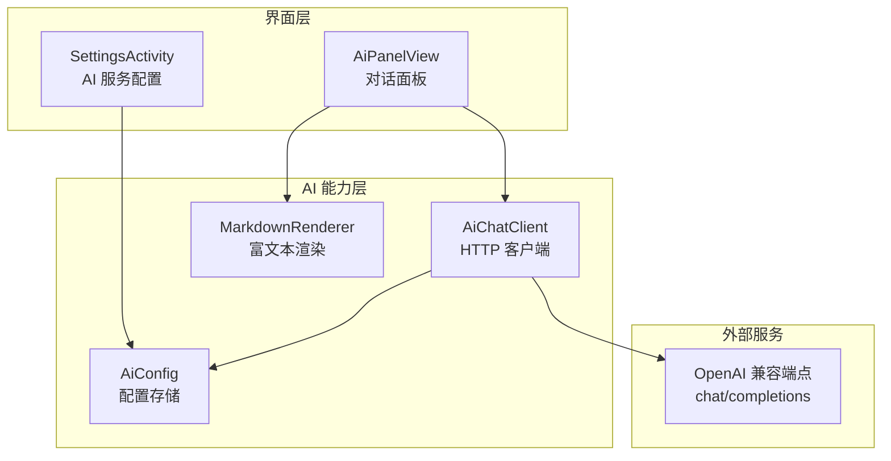
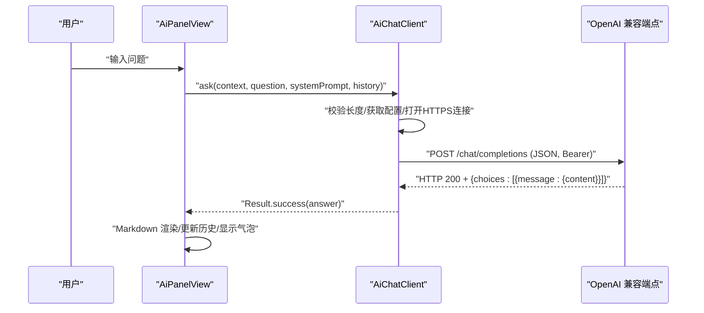
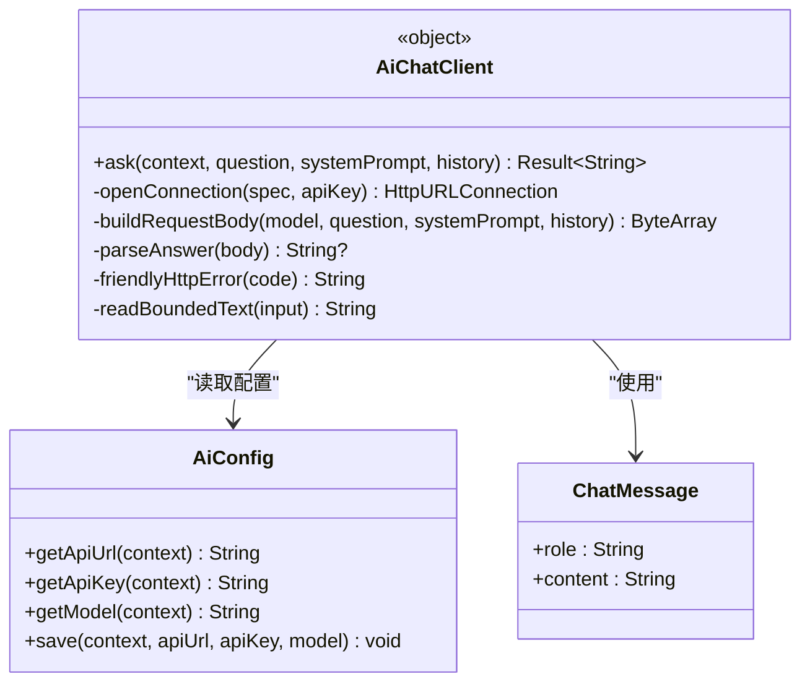
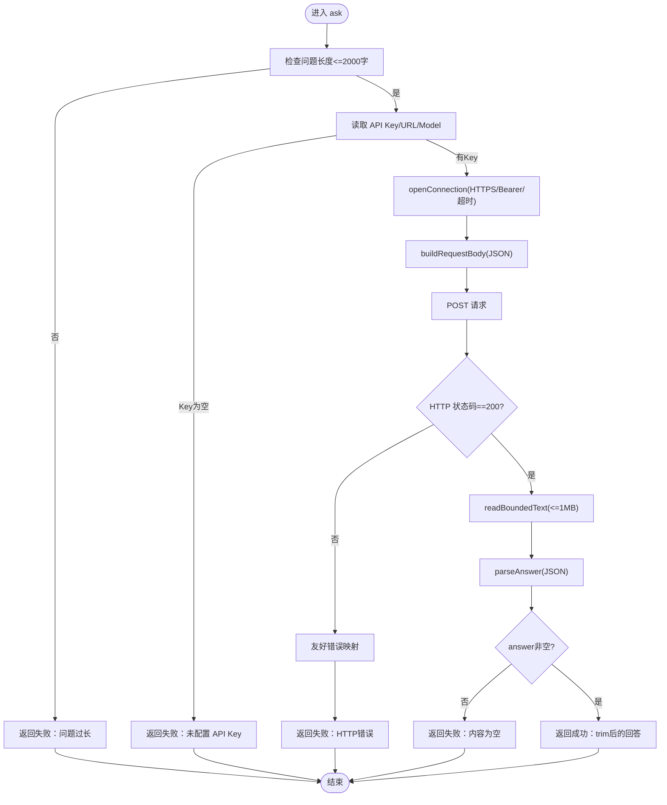
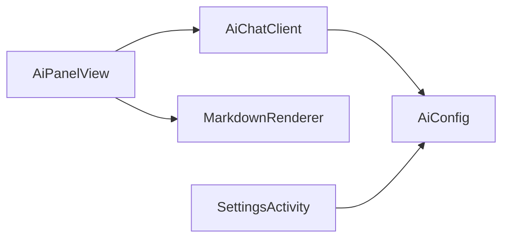

# AI 客户端集成

<cite>
**本文引用的文件**
- [AiChatClient.kt](file://app/src/main/java/com/ziyou/ime/ai/AiChatClient.kt)
- [AiConfig.kt](file://app/src/main/java/com/ziyou/ime/ai/AiConfig.kt)
- [MarkdownRenderer.kt](file://app/src/main/java/com/ziyou/ime/ai/MarkdownRenderer.kt)
- [AiPanelView.kt](file://app/src/main/java/com/ziyou/ime/ime/AiPanelView.kt)
- [SettingsActivity.kt](file://app/src/main/java/com/ziyou/ime/ui/SettingsActivity.kt)
</cite>

## 目录
1. [简介](#简介)
2. [项目结构](#项目结构)
3. [核心组件](#核心组件)
4. [架构总览](#架构总览)
5. [详细组件分析](#详细组件分析)
6. [依赖关系分析](#依赖关系分析)
7. [性能考量](#性能考量)
8. [故障排查指南](#故障排查指南)
9. [结论](#结论)
10. [附录：使用示例与最佳实践](#附录使用示例与最佳实践)

## 简介
本文件面向开发者，系统性说明输入法项目中 AI 客户端集成的实现细节。重点覆盖：
- AiChatClient 的 HTTP 请求封装（OpenAI 兼容 chat/completions、HTTPS 安全连接、Bearer Token 鉴权）
- 网络生命周期管理（连接超时 15s、读取超时 60s、响应体上限 1MB、内存保护）
- 错误处理策略（HTTP 状态码映射、用户友好提示、网络异常捕获、重试建议）
- 多轮对话历史管理（消息格式、角色 user/assistant/system、上下文传递）
- 配置与调用示例（API Key、模型名、端点设置；发起问答与处理响应）
- 性能优化建议与最佳实践

## 项目结构
AI 相关代码集中在 app 模块的 ai 包与 ime、ui 层中：
- ai/AiChatClient.kt：HTTP 客户端封装、协议组装、错误处理、内存保护
- ai/AiConfig.kt：SharedPreferences 持久化 API 地址、Key、模型名
- ai/MarkdownRenderer.kt：轻量 Markdown 渲染为 Spanned，供 TextView 展示
- ime/AiPanelView.kt：面板层组织对话历史、调用客户端、渲染答案气泡
- ui/SettingsActivity.kt：设置页维护 API 配置与人设

图表来源
- [AiPanelView.kt:380-420](file://app/src/main/java/com/ziyou/ime/ime/AiPanelView.kt#L380-L420)
- [SettingsActivity.kt:610-650](file://app/src/main/java/com/ziyou/ime/ui/SettingsActivity.kt#L610-L650)
- [AiChatClient.kt:65-114](file://app/src/main/java/com/ziyou/ime/ai/AiChatClient.kt#L65-L114)
- [AiConfig.kt:30-55](file://app/src/main/java/com/ziyou/ime/ai/AiConfig.kt#L30-L55)
- [MarkdownRenderer.kt:71-104](file://app/src/main/java/com/ziyou/ime/ai/MarkdownRenderer.kt#L71-L104)

章节来源
- [AiChatClient.kt:1-194](file://app/src/main/java/com/ziyou/ime/ai/AiChatClient.kt#L1-L194)
- [AiConfig.kt:1-56](file://app/src/main/java/com/ziyou/ime/ai/AiConfig.kt#L1-L56)
- [MarkdownRenderer.kt:1-206](file://app/src/main/java/com/ziyou/ime/ai/MarkdownRenderer.kt#L1-L206)
- [AiPanelView.kt:380-579](file://app/src/main/java/com/ziyou/ime/ime/AiPanelView.kt#L380-L579)
- [SettingsActivity.kt:610-650](file://app/src/main/java/com/ziyou/ime/ui/SettingsActivity.kt#L610-L650)

## 核心组件
- AiChatClient：封装 OpenAI 兼容的 chat/completions 非流式请求，强制 HTTPS、Bearer Token 鉴权、超时与响应体大小限制，统一 Result 返回并附带用户可读错误信息。
- AiConfig：通过 SharedPreferences 持久化 API 地址、API Key、模型名，提供默认值与保存方法。
- MarkdownRenderer：将 Markdown 解析为 Spanned 富文本，支持标题、粗斜体、删除线、行内代码、代码块、列表、引用、分隔线与链接样式。
- AiPanelView：组织对话历史、构建 systemPrompt、调用 AiChatClient.ask、渲染答案气泡与操作按钮。
- SettingsActivity：提供 UI 输入校验与保存，确保 API 地址以 https:// 开头，写入 AiConfig。

章节来源
- [AiChatClient.kt:15-114](file://app/src/main/java/com/ziyou/ime/ai/AiChatClient.kt#L15-L114)
- [AiConfig.kt:14-55](file://app/src/main/java/com/ziyou/ime/ai/AiConfig.kt#L14-L55)
- [MarkdownRenderer.kt:32-104](file://app/src/main/java/com/ziyou/ime/ai/MarkdownRenderer.kt#L32-L104)
- [AiPanelView.kt:380-420](file://app/src/main/java/com/ziyou/ime/ime/AiPanelView.kt#L380-L420)
- [SettingsActivity.kt:610-650](file://app/src/main/java/com/ziyou/ime/ui/SettingsActivity.kt#L610-L650)

## 架构总览
整体流程：用户在面板输入问题 → 面板构建 systemPrompt 与历史 → 调用 AiChatClient.ask → 客户端构造 JSON 请求体 → 发送 HTTPS POST → 服务端返回 JSON → 客户端解析 choices[0].message.content → 面板渲染 Markdown 并追加到历史。

图表来源
- [AiPanelView.kt:387-414](file://app/src/main/java/com/ziyou/ime/ime/AiPanelView.kt#L387-L414)
- [AiChatClient.kt:65-114](file://app/src/main/java/com/ziyou/ime/ai/AiChatClient.kt#L65-L114)
- [AiChatClient.kt:135-153](file://app/src/main/java/com/ziyou/ime/ai/AiChatClient.kt#L135-L153)
- [AiChatClient.kt:156-167](file://app/src/main/java/com/ziyou/ime/ai/AiChatClient.kt#L156-L167)

## 详细组件分析

### AiChatClient 组件分析
职责与要点：
- 协议：OpenAI 兼容 chat/completions 非流式接口，messages 顺序为 system → history → user。
- 安全：强制 HTTPS，Authorization: Bearer <apiKey>。
- 超时：连接超时 15s，读取超时 60s。
- 内存保护：响应体上限 1MB，超出抛出异常；单次提问字符上限 2000。
- 错误处理：HTTP 状态码映射为用户友好提示；IO 异常与通用异常统一包装；finally 断开连接。
- 数据模型：ChatMessage(role, content)，role 可为 user/assistant/system。

图表来源
- [AiChatClient.kt:21-21](file://app/src/main/java/com/ziyou/ime/ai/AiChatClient.kt#L21-L21)
- [AiChatClient.kt:65-114](file://app/src/main/java/com/ziyou/ime/ai/AiChatClient.kt#L65-L114)
- [AiChatClient.kt:117-128](file://app/src/main/java/com/ziyou/ime/ai/AiChatClient.kt#L117-L128)
- [AiChatClient.kt:135-153](file://app/src/main/java/com/ziyou/ime/ai/AiChatClient.kt#L135-L153)
- [AiChatClient.kt:156-167](file://app/src/main/java/com/ziyou/ime/ai/AiChatClient.kt#L156-L167)
- [AiChatClient.kt:170-175](file://app/src/main/java/com/ziyou/ime/ai/AiChatClient.kt#L170-L175)
- [AiChatClient.kt:178-192](file://app/src/main/java/com/ziyou/ime/ai/AiChatClient.kt#L178-L192)
- [AiConfig.kt:30-55](file://app/src/main/java/com/ziyou/ime/ai/AiConfig.kt#L30-L55)

章节来源
- [AiChatClient.kt:15-114](file://app/src/main/java/com/ziyou/ime/ai/AiChatClient.kt#L15-L114)
- [AiChatClient.kt:117-192](file://app/src/main/java/com/ziyou/ime/ai/AiChatClient.kt#L117-L192)

#### 网络请求生命周期与内存保护流程图

图表来源
- [AiChatClient.kt:65-114](file://app/src/main/java/com/ziyou/ime/ai/AiChatClient.kt#L65-L114)
- [AiChatClient.kt:117-128](file://app/src/main/java/com/ziyou/ime/ai/AiChatClient.kt#L117-L128)
- [AiChatClient.kt:135-153](file://app/src/main/java/com/ziyou/ime/ai/AiChatClient.kt#L135-L153)
- [AiChatClient.kt:156-167](file://app/src/main/java/com/ziyou/ime/ai/AiChatClient.kt#L156-L167)
- [AiChatClient.kt:170-175](file://app/src/main/java/com/ziyou/ime/ai/AiChatClient.kt#L170-L175)
- [AiChatClient.kt:178-192](file://app/src/main/java/com/ziyou/ime/ai/AiChatClient.kt#L178-L192)

### 多轮对话历史管理
- 消息格式：ChatMessage(role, content)，role 取值 user/assistant/system。
- 上下文传递：systemPrompt 包含 BASE_SYSTEM_PROMPT 与人设拼接；history 按时间顺序传入；当前问题作为 user 消息追加在末尾。
- 历史裁剪：面板层 FIFO 淘汰，保持偶数条（user/assistant 成对），避免上下文过大。
- 失败回滚：请求失败时移除刚追加的 user 消息，防止重试重复。

章节来源
- [AiChatClient.kt:21-21](file://app/src/main/java/com/ziyou/ime/ai/AiChatClient.kt#L21-L21)
- [AiChatClient.kt:135-153](file://app/src/main/java/com/ziyou/ime/ai/AiChatClient.kt#L135-L153)
- [AiPanelView.kt:387-414](file://app/src/main/java/com/ziyou/ime/ime/AiPanelView.kt#L387-L414)
- [AiPanelView.kt:418-423](file://app/src/main/java/com/ziyou/ime/ime/AiPanelView.kt#L418-L423)

### Markdown 渲染器
- 支持语法：标题、粗斜体、删除线、行内代码、代码块、无序/有序列表、引用、分隔线、链接。
- 输出：SpannableStringBuilder，直接用于 TextView，无需 WebView。
- 主题适配：Palette 由上层注入，颜色随主题变化。

章节来源
- [MarkdownRenderer.kt:32-104](file://app/src/main/java/com/ziyou/ime/ai/MarkdownRenderer.kt#L32-L104)
- [MarkdownRenderer.kt:117-163](file://app/src/main/java/com/ziyou/ime/ai/MarkdownRenderer.kt#L117-L163)
- [MarkdownRenderer.kt:166-204](file://app/src/main/java/com/ziyou/ime/ai/MarkdownRenderer.kt#L166-L204)

### 配置与设置页
- 默认端点：阿里云百炼 DashScope OpenAI 兼容 chat/completions 完整地址。
- 默认模型：qwen3.7-max-2026-05-17。
- 默认 API Key：内置默认密钥（可在设置页覆盖）。
- 设置页校验：API 地址必须以 https:// 开头，保存后即时生效。

章节来源
- [AiConfig.kt:21-28](file://app/src/main/java/com/ziyou/ime/ai/AiConfig.kt#L21-L28)
- [SettingsActivity.kt:610-650](file://app/src/main/java/com/ziyou/ime/ui/SettingsActivity.kt#L610-L650)

## 依赖关系分析
- AiPanelView 依赖 AiChatClient 发起请求，依赖 MarkdownRenderer 渲染答案。
- AiChatClient 依赖 AiConfig 读取配置，依赖标准库 HttpURLConnection 进行网络 IO。
- SettingsActivity 依赖 AiConfig 读写配置。

图表来源
- [AiPanelView.kt:387-414](file://app/src/main/java/com/ziyou/ime/ime/AiPanelView.kt#L387-L414)
- [AiChatClient.kt:65-114](file://app/src/main/java/com/ziyou/ime/ai/AiChatClient.kt#L65-L114)
- [SettingsActivity.kt:610-650](file://app/src/main/java/com/ziyou/ime/ui/SettingsActivity.kt#L610-L650)

章节来源
- [AiPanelView.kt:380-579](file://app/src/main/java/com/ziyou/ime/ime/AiPanelView.kt#L380-L579)
- [AiChatClient.kt:1-194](file://app/src/main/java/com/ziyou/ime/ai/AiChatClient.kt#L1-L194)
- [AiConfig.kt:1-56](file://app/src/main/java/com/ziyou/ime/ai/AiConfig.kt#L1-L56)
- [SettingsActivity.kt:610-650](file://app/src/main/java/com/ziyou/ime/ui/SettingsActivity.kt#L610-L650)

## 性能考量
- 线程调度：所有网络 IO 切至 Dispatchers.IO，避免阻塞 UI 线程。
- 超时控制：连接 15s、读取 60s，兼顾长回答场景。
- 内存保护：响应体上限 1MB，超大响应直接拒绝，避免 OOM。
- 请求体大小：单次提问上限 2000 字，减少无效大请求。
- 渲染优化：Markdown 渲染基于 Spanned，避免 WebView 开销。
- 历史裁剪：FIFO 淘汰，保持偶数条，降低上下文体积。

章节来源
- [AiChatClient.kt:34-43](file://app/src/main/java/com/ziyou/ime/ai/AiChatClient.kt#L34-L43)
- [AiChatClient.kt:178-192](file://app/src/main/java/com/ziyou/ime/ai/AiChatClient.kt#L178-L192)
- [MarkdownRenderer.kt:32-104](file://app/src/main/java/com/ziyou/ime/ai/MarkdownRenderer.kt#L32-L104)
- [AiPanelView.kt:418-423](file://app/src/main/java/com/ziyou/ime/ime/AiPanelView.kt#L418-L423)

## 故障排查指南
常见问题与定位：
- 未配置 API Key：检查设置页是否已保存，或默认 Key 是否被清空。
- HTTPS 校验失败：确认 API 地址以 https:// 开头。
- HTTP 401/403：API Key 错误或权限不足，重新配置。
- HTTP 429：请求频率过高或额度不足，稍后再试或限流。
- HTTP 5xx：服务端不可用，稍后重试。
- 网络异常：检查网络连接与代理设置。
- 响应为空：服务端返回无 choices 或 message.content 缺失。
- 响应超限：服务端返回超过 1MB，需调整服务端或客户端策略。

错误映射与日志：
- 客户端记录关键日志（请求失败、网络异常、解析失败），便于定位。
- 用户可见错误提示经过友好化处理。

章节来源
- [AiChatClient.kt:90-114](file://app/src/main/java/com/ziyou/ime/ai/AiChatClient.kt#L90-L114)
- [AiChatClient.kt:170-175](file://app/src/main/java/com/ziyou/ime/ai/AiChatClient.kt#L170-L175)
- [AiChatClient.kt:156-167](file://app/src/main/java/com/ziyou/ime/ai/AiChatClient.kt#L156-L167)
- [AiChatClient.kt:178-192](file://app/src/main/java/com/ziyou/ime/ai/AiChatClient.kt#L178-L192)

## 结论
AiChatClient 提供了稳定、安全的 OpenAI 兼容客户端封装，结合 AiConfig 的配置管理与 MarkdownRenderer 的轻量渲染，形成完整的 AI 问答链路。通过严格的超时、内存保护与错误映射，保障用户体验与系统稳定性。建议在业务层按需增加重试逻辑与更细粒度的错误分类，进一步提升鲁棒性。

## 附录：使用示例与最佳实践

### 配置 API Key、端点与模型
- 在设置页输入 API 地址（必须以 https:// 开头）、API Key、模型名，点击保存。
- 若未自定义，默认指向阿里云百炼 DashScope 端点与 Qwen 模型。

章节来源
- [SettingsActivity.kt:610-650](file://app/src/main/java/com/ziyou/ime/ui/SettingsActivity.kt#L610-L650)
- [AiConfig.kt:21-28](file://app/src/main/java/com/ziyou/ime/ai/AiConfig.kt#L21-L28)

### 发起问答请求与处理响应
- 在面板层构建 systemPrompt（BASE_SYSTEM_PROMPT + 人设）与 history（最近 N 条）。
- 调用 AiChatClient.ask(context, question, systemPrompt, history)。
- 使用 Result.fold 处理成功与失败分支：
  - 成功：Markdown 渲染、追加 assistant 消息、显示气泡。
  - 失败：回滚 user 消息、显示错误提示。

章节来源
- [AiPanelView.kt:387-414](file://app/src/main/java/com/ziyou/ime/ime/AiPanelView.kt#L387-L414)
- [AiChatClient.kt:65-114](file://app/src/main/java/com/ziyou/ime/ai/AiChatClient.kt#L65-L114)

### 多轮对话历史管理最佳实践
- 保持消息顺序：system → history → user。
- 控制历史长度：FIFO 淘汰，保持偶数条，避免上下文过大。
- 失败回滚：请求失败移除刚追加的 user 消息，防止重复。

章节来源
- [AiChatClient.kt:135-153](file://app/src/main/java/com/ziyou/ime/ai/AiChatClient.kt#L135-L153)
- [AiPanelView.kt:418-423](file://app/src/main/java/com/ziyou/ime/ime/AiPanelView.kt#L418-L423)

### 错误处理与重试建议
- 当前实现未内置自动重试，建议在业务层根据错误类型（如 429、5xx）实施指数退避重试。
- 区分网络异常与服务端错误，分别给出不同提示与策略。
- 记录关键日志与指标（成功率、失败原因分布），便于监控与优化。

章节来源
- [AiChatClient.kt:90-114](file://app/src/main/java/com/ziyou/ime/ai/AiChatClient.kt#L90-L114)
- [AiChatClient.kt:170-175](file://app/src/main/java/com/ziyou/ime/ai/AiChatClient.kt#L170-L175)

### 性能优化建议
- 合理设置超时与响应体上限，避免长时间阻塞与内存溢出。
- 使用轻量 Markdown 渲染，避免引入重型库。
- 控制历史长度与提问长度，减少不必要的数据传输与处理。
- 在后台线程执行网络 IO，保证 UI 流畅。

章节来源
- [AiChatClient.kt:34-43](file://app/src/main/java/com/ziyou/ime/ai/AiChatClient.kt#L34-L43)
- [MarkdownRenderer.kt:32-104](file://app/src/main/java/com/ziyou/ime/ai/MarkdownRenderer.kt#L32-L104)
- [AiPanelView.kt:418-423](file://app/src/main/java/com/ziyou/ime/ime/AiPanelView.kt#L418-L423)