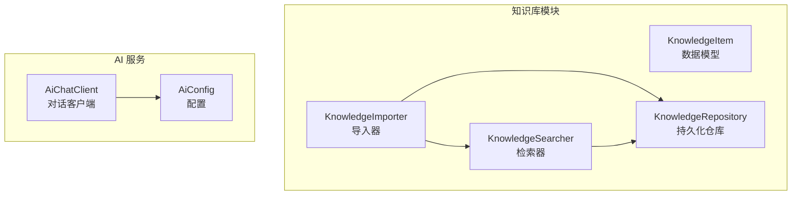
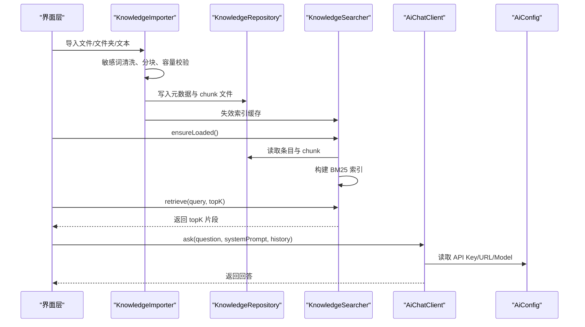
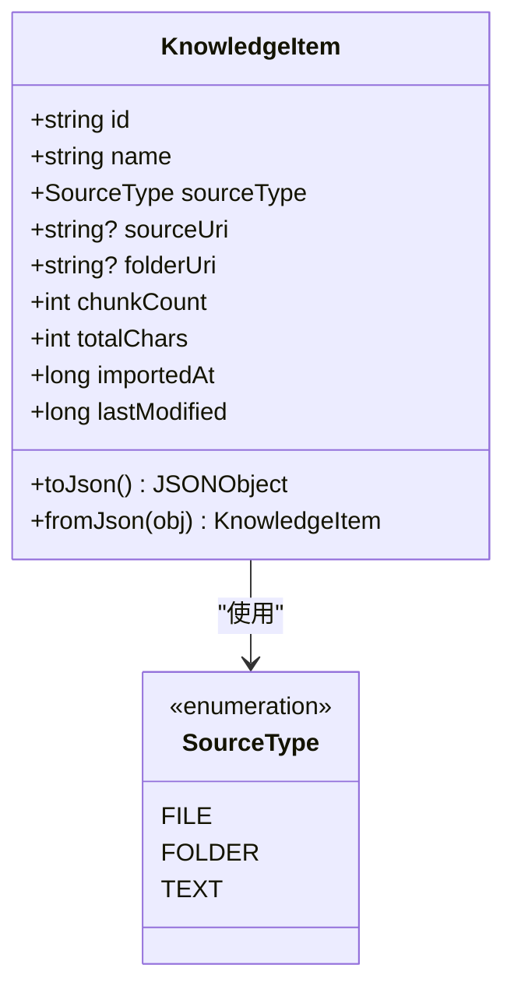
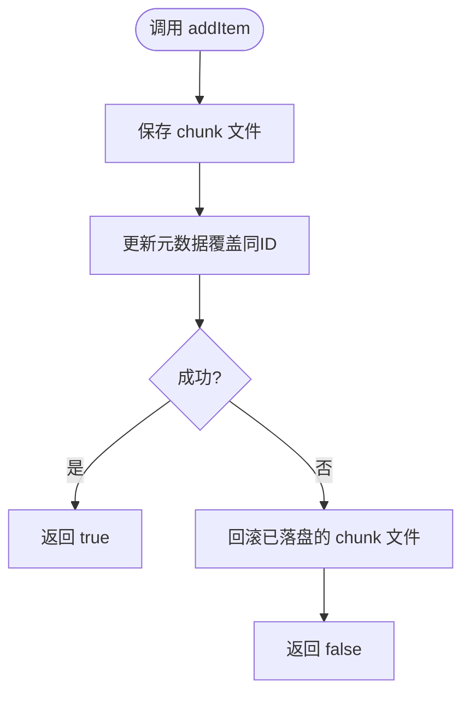
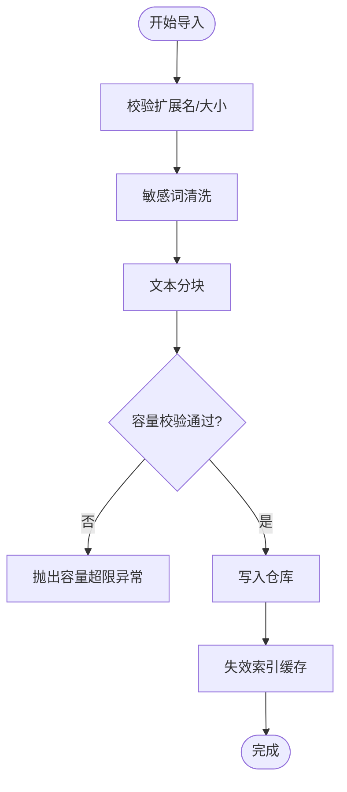
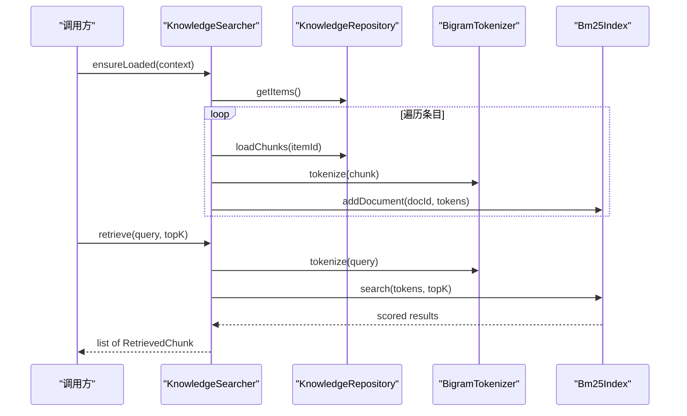
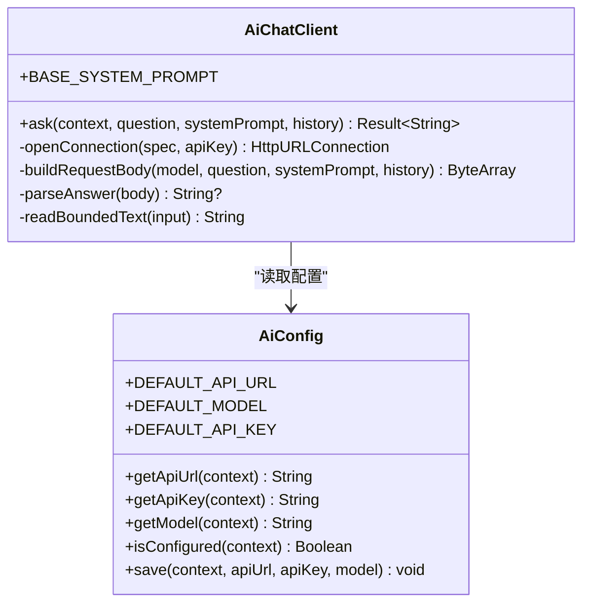
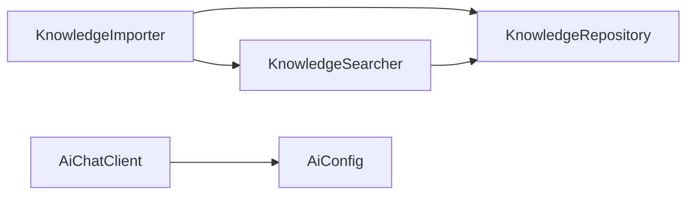

# AI 知识库系统

<cite>
**本文引用的文件**   
- [KnowledgeRepository.kt](file://app/src/main/java/com/ziyou/ime/ai/knowledge/KnowledgeRepository.kt)
- [KnowledgeSearcher.kt](file://app/src/main/java/com/ziyou/ime/ai/knowledge/KnowledgeSearcher.kt)
- [KnowledgeItem.kt](file://app/src/main/java/com/ziyou/ime/ai/knowledge/KnowledgeItem.kt)
- [KnowledgeImporter.kt](file://app/src/main/java/com/ziyou/ime/ai/knowledge/KnowledgeImporter.kt)
- [AiConfig.kt](file://app/src/main/java/com/ziyou/ime/ai/AiConfig.kt)
- [AiChatClient.kt](file://app/src/main/java/com/ziyou/ime/ai/AiChatClient.kt)
</cite>

## 目录
1. [简介](#简介)
2. [项目结构](#项目结构)
3. [核心组件](#核心组件)
4. [架构总览](#架构总览)
5. [详细组件分析](#详细组件分析)
6. [依赖关系分析](#依赖关系分析)
7. [性能考量](#性能考量)
8. [故障排查指南](#故障排查指南)
9. [结论](#结论)
10. [附录](#附录)

## 简介
本技术文档面向“AI 知识库系统”，聚焦以下目标：
- 知识条目 CRUD、分类与搜索索引管理（KnowledgeRepository）
- 检索算法实现：关键词匹配、模糊搜索、相关性排序（KnowledgeSearcher）
- 数据模型设计：标题、内容、标签、分类与元数据（KnowledgeItem）
- 导入能力：文件格式支持、批量导入、数据校验（KnowledgeImporter）
- 搜索优化策略：索引构建、缓存机制、查询性能调优
- 配置示例与搜索用例，以及维护更新最佳实践

该知识库以 Android 应用为载体，采用 SharedPreferences + 本地文件的持久化方案，结合 BM25 倒排索引进行内存检索。导入流程包含敏感词清洗、文本分块、容量控制与增量同步等关键特性。

## 项目结构
知识库相关代码集中在 app 模块的 ai/knowledge 包下，并与 ai 子模块中的对话客户端与配置协同工作。核心文件职责如下：
- KnowledgeItem：定义知识条目的数据结构与序列化方法
- KnowledgeRepository：负责条目元数据的持久化与 chunk 正文文件读写
- KnowledgeImporter：统一三类导入入口（单文件、文件夹、自定义文本），完成清洗、分块、容量校验与入库
- KnowledgeSearcher：懒加载构建 BM25 索引，提供检索接口并缓存结果
- AiConfig/AiChatClient：AI 服务配置与问答请求（用于将检索结果注入提示词后调用大模型）

**图示来源** 
- [KnowledgeItem.kt:1-77](file://app/src/main/java/com/ziyou/ime/ai/knowledge/KnowledgeItem.kt#L1-L77)
- [KnowledgeRepository.kt:1-142](file://app/src/main/java/com/ziyou/ime/ai/knowledge/KnowledgeRepository.kt#L1-L142)
- [KnowledgeImporter.kt:1-317](file://app/src/main/java/com/ziyou/ime/ai/knowledge/KnowledgeImporter.kt#L1-L317)
- [KnowledgeSearcher.kt:1-92](file://app/src/main/java/com/ziyou/ime/ai/knowledge/KnowledgeSearcher.kt#L1-L92)
- [AiConfig.kt:1-56](file://app/src/main/java/com/ziyou/ime/ai/AiConfig.kt#L1-L56)
- [AiChatClient.kt:1-194](file://app/src/main/java/com/ziyou/ime/ai/AiChatClient.kt#L1-L194)

**章节来源**
- [KnowledgeItem.kt:1-77](file://app/src/main/java/com/ziyou/ime/ai/knowledge/KnowledgeItem.kt#L1-L77)
- [KnowledgeRepository.kt:1-142](file://app/src/main/java/com/ziyou/ime/ai/knowledge/KnowledgeRepository.kt#L1-L142)
- [KnowledgeImporter.kt:1-317](file://app/src/main/java/com/ziyou/ime/ai/knowledge/KnowledgeImporter.kt#L1-L317)
- [KnowledgeSearcher.kt:1-92](file://app/src/main/java/com/ziyou/ime/ai/knowledge/KnowledgeSearcher.kt#L1-L92)
- [AiConfig.kt:1-56](file://app/src/main/java/com/ziyou/ime/ai/AiConfig.kt#L1-L56)
- [AiChatClient.kt:1-194](file://app/src/main/java/com/ziyou/ime/ai/AiChatClient.kt#L1-L194)

## 核心组件
- KnowledgeItem：描述一个知识来源（单文件/文件夹成员/自定义文本），包含 id、name、sourceType、sourceUri、folderUri、chunkCount、totalChars、importedAt、lastModified 等字段，并提供 JSON 序列化/反序列化方法。
- KnowledgeRepository：使用 SharedPreferences 存储开关、Top-K 与条目元数据 JSON；chunk 正文以 JSON 数组落盘到 filesDir/knowledge/<itemId>.json；提供 getItems、addItem、removeItem、loadChunks 等方法，并限制单条目 chunk 数与全库字符总量。
- KnowledgeImporter：统一的导入入口，支持 SAF 单文件（txt/md）、SAF 文件夹（递归枚举 txt/md，深度与数量受限）、用户自定义文本块。内部完成敏感词清洗、文本分块、容量校验、写入仓库并失效索引缓存。
- KnowledgeSearcher：BM25 检索实现，懒构建内存倒排索引（IO 线程），通过 Mutex 防并发重复构建；检索为纯内存操作，返回 topK 个最相关片段。

**章节来源**
- [KnowledgeItem.kt:1-77](file://app/src/main/java/com/ziyou/ime/ai/knowledge/KnowledgeItem.kt#L1-L77)
- [KnowledgeRepository.kt:1-142](file://app/src/main/java/com/ziyou/ime/ai/knowledge/KnowledgeRepository.kt#L1-L142)
- [KnowledgeImporter.kt:1-317](file://app/src/main/java/com/ziyou/ime/ai/knowledge/KnowledgeImporter.kt#L1-L317)
- [KnowledgeSearcher.kt:1-92](file://app/src/main/java/com/ziyou/ime/ai/knowledge/KnowledgeSearcher.kt#L1-L92)

## 架构总览
知识库系统由“导入—持久化—索引—检索”四阶段构成，配合 AI 服务配置与对话客户端形成完整问答链路。

**图示来源** 
- [KnowledgeImporter.kt:1-317](file://app/src/main/java/com/ziyou/ime/ai/knowledge/KnowledgeImporter.kt#L1-L317)
- [KnowledgeRepository.kt:1-142](file://app/src/main/java/com/ziyou/ime/ai/knowledge/KnowledgeRepository.kt#L1-L142)
- [KnowledgeSearcher.kt:1-92](file://app/src/main/java/com/ziyou/ime/ai/knowledge/KnowledgeSearcher.kt#L1-L92)
- [AiChatClient.kt:1-194](file://app/src/main/java/com/ziyou/ime/ai/AiChatClient.kt#L1-L194)
- [AiConfig.kt:1-56](file://app/src/main/java/com/ziyou/ime/ai/AiConfig.kt#L1-L56)

## 详细组件分析

### KnowledgeItem 数据模型
- 字段说明
  - id：唯一标识（kb_前缀+稳定哈希）
  - name：展示名称（文件名或自定义标题）
  - sourceType：来源类型（FILE/FOLDER/TEXT）
  - sourceUri：来源 URI（FILE 为文档 URI；FOLDER 成员为「treeUri|文档 URI」；TEXT 为 null）
  - folderUri：所属文件夹 treeUri（仅文件夹导入成员非空，用于增量同步分组）
  - chunkCount：分块数
  - totalChars：清洗后正文字符总量
  - importedAt：导入时间戳
  - lastModified：来源文件最后修改时间（文件夹增量同步比对用；TEXT 为 0）
- 序列化和反序列化
  - toJson/fromJson：JSON 互逆，缺字段按默认值兜底，保证向前兼容

**图示来源** 
- [KnowledgeItem.kt:1-77](file://app/src/main/java/com/ziyou/ime/ai/knowledge/KnowledgeItem.kt#L1-L77)

**章节来源**
- [KnowledgeItem.kt:1-77](file://app/src/main/java/com/ziyou/ime/ai/knowledge/KnowledgeItem.kt#L1-L77)

### KnowledgeRepository 持久化仓库
- 持久化模式
  - SharedPreferences：存储开关、Top-K、条目元数据 JSON 数组
  - 文件存储：每个条目的 chunk 正文以 JSON 数组保存至 filesDir/knowledge/<itemId>.json
  - 内存索引：不持久化，由 KnowledgeSearcher 从 chunk 懒构建
- 容量纪律
  - 单条目 chunk 上限：MAX_CHUNKS_PER_ITEM
  - 全库正文字符总量上限：MAX_TOTAL_CHARS
- 主要能力
  - isEnabled/setEnabled：知识库总开关
  - getTopK：检索 Top-K 配置
  - getItems：全部条目（导入时间倒序）
  - hasItems：是否存在任何条目
  - totalChars：全库正文字符总量
  - addItem：先落 chunk 文件，再提交元数据（同 ID 覆盖）
  - removeItem：删除条目（元数据与 chunk 文件一并清除）
  - loadChunks：读取 chunk 列表（缺失或损坏返回空）

**图示来源** 
- [KnowledgeRepository.kt:76-101](file://app/src/main/java/com/ziyou/ime/ai/knowledge/KnowledgeRepository.kt#L76-L101)

**章节来源**
- [KnowledgeRepository.kt:1-142](file://app/src/main/java/com/ziyou/ime/ai/knowledge/KnowledgeRepository.kt#L1-L142)

### KnowledgeImporter 导入器
- 支持的导入方式
  - importFile：SAF 单文件（txt/md），流式读入 → 敏感词清洗 → 分块 → 入库
  - importFolder：SAF 文件夹（DocumentsContract 递归枚举，深度/数量受限），逐文件复用单文件流程，持久化授权供后续增量同步
  - importText：用户自定义文本块
- 导入流水线
  - 校验扩展名与大小
  - 敏感词清洗（内置最小词表）
  - 文本分块（TextChunker）
  - 容量校验（单条目 chunk 数与全库字符总量）
  - 写入仓库（失败无残留）
  - 失效索引缓存（KnowledgeSearcher.invalidate）
- 文件夹增量同步
  - syncFolder：对比 lastModified 重导变更/新增文件，清理已删除文件的条目

**图示来源** 
- [KnowledgeImporter.kt:147-188](file://app/src/main/java/com/ziyou/ime/ai/knowledge/KnowledgeImporter.kt#L147-L188)
- [KnowledgeImporter.kt:97-122](file://app/src/main/java/com/ziyou/ime/ai/knowledge/KnowledgeImporter.kt#L97-L122)

**章节来源**
- [KnowledgeImporter.kt:1-317](file://app/src/main/java/com/ziyou/ime/ai/knowledge/KnowledgeImporter.kt#L1-L317)

### KnowledgeSearcher 检索器
- 索引构建
  - 懒构建：仅在「知识库开启且首次检索」时从 chunk 文件加载并构建 BM25 倒排索引（IO 线程，Mutex 防并发重复构建）
  - 构建后缓存直到 invalidate（仓库增删条目时调用）
- 检索算法
  - 关键词匹配：BigramTokenizer 对 query 与文档进行二元分词
  - 相关性排序：BM25Index.search 返回得分最高的 topK 片段
  - 纯内存操作：<50ms 级响应
- 接口
  - ensureLoaded(context)：确保索引已加载
  - retrieve(query, topK)：返回 RetrievedChunk 列表（text、sourceName、itemId、score）
  - invalidate()：失效缓存

**图示来源** 
- [KnowledgeSearcher.kt:43-85](file://app/src/main/java/com/ziyou/ime/ai/knowledge/KnowledgeSearcher.kt#L43-L85)

**章节来源**
- [KnowledgeSearcher.kt:1-92](file://app/src/main/java/com/ziyou/ime/ai/knowledge/KnowledgeSearcher.kt#L1-L92)

### 与 AI 服务的集成
- 配置（AiConfig）
  - 通过 SharedPreferences 持久化 OpenAI 兼容接口的连接参数（API 地址 / API Key / 模型名）
  - 默认指向阿里云百炼（DashScope）OpenAI 兼容端点
- 对话客户端（AiChatClient）
  - 以 OpenAI 兼容的 chat/completions 协议发起非流式问答请求
  - 网络安全基线：强制 HTTPS、连接/读取超时、响应字节数上限
  - 基础系统提示词约束 Markdown 格式，避免不支持的渲染元素

**图示来源** 
- [AiConfig.kt:1-56](file://app/src/main/java/com/ziyou/ime/ai/AiConfig.kt#L1-L56)
- [AiChatClient.kt:1-194](file://app/src/main/java/com/ziyou/ime/ai/AiChatClient.kt#L1-L194)

**章节来源**
- [AiConfig.kt:1-56](file://app/src/main/java/com/ziyou/ime/ai/AiConfig.kt#L1-L56)
- [AiChatClient.kt:1-194](file://app/src/main/java/com/ziyou/ime/ai/AiChatClient.kt#L1-L194)

## 依赖关系分析
- 组件耦合
  - KnowledgeImporter 依赖 KnowledgeRepository（持久化）与 KnowledgeSearcher（失效缓存）
  - KnowledgeSearcher 依赖 KnowledgeRepository（读取条目与 chunk）
  - AiChatClient 依赖 AiConfig（读取配置）
- 外部依赖
  - Android 平台：SharedPreferences、DocumentsContract、ContentResolver
  - RAG 工具：BigramTokenizer、Bm25Index、RetrievedChunk、SensitiveWordFilter、TextChunker

**图示来源** 
- [KnowledgeImporter.kt:1-317](file://app/src/main/java/com/ziyou/ime/ai/knowledge/KnowledgeImporter.kt#L1-L317)
- [KnowledgeRepository.kt:1-142](file://app/src/main/java/com/ziyou/ime/ai/knowledge/KnowledgeRepository.kt#L1-L142)
- [KnowledgeSearcher.kt:1-92](file://app/src/main/java/com/ziyou/ime/ai/knowledge/KnowledgeSearcher.kt#L1-L92)
- [AiChatClient.kt:1-194](file://app/src/main/java/com/ziyou/ime/ai/AiChatClient.kt#L1-L194)
- [AiConfig.kt:1-56](file://app/src/main/java/com/ziyou/ime/ai/AiConfig.kt#L1-L56)

**章节来源**
- [KnowledgeImporter.kt:1-317](file://app/src/main/java/com/ziyou/ime/ai/knowledge/KnowledgeImporter.kt#L1-L317)
- [KnowledgeRepository.kt:1-142](file://app/src/main/java/com/ziyou/ime/ai/knowledge/KnowledgeRepository.kt#L1-L142)
- [KnowledgeSearcher.kt:1-92](file://app/src/main/java/com/ziyou/ime/ai/knowledge/KnowledgeSearcher.kt#L1-L92)
- [AiChatClient.kt:1-194](file://app/src/main/java/com/ziyou/ime/ai/AiChatClient.kt#L1-L194)
- [AiConfig.kt:1-56](file://app/src/main/java/com/ziyou/ime/ai/AiConfig.kt#L1-L56)

## 性能考量
- 索引构建
  - 懒构建：仅在首次检索时构建，避免冷启动开销
  - IO 线程执行：withContext(Dispatchers.IO)，不阻塞 UI
  - 并发保护：Mutex 防止多协程重复构建
- 缓存机制
  - 内存快照：Snapshot 包含 Bm25Index 与 chunks 映射，原子替换
  - 失效策略：增删改后调用 invalidate，下次检索重新构建
- 查询性能
  - 纯内存检索：<50ms 级响应
  - BigramTokenizer 二元分词提升召回率
  - BM25 相关性排序提高命中率
- 容量控制
  - MAX_CHUNKS_PER_ITEM：单条目 chunk 上限
  - MAX_TOTAL_CHARS：全库字符总量上限（约 10MB 文本）
- 网络与安全
  - 强制 HTTPS、连接/读取超时、响应体上限，避免内存耗尽

[本节为通用指导，无需特定文件引用]

## 故障排查指南
- 导入失败
  - 扩展名不允许：仅支持 txt / md / markdown
  - 文件大小超限：单文件最大 2MB
  - 内容为空：清洗后无可导入文本
  - 容量不足：超过 MAX_TOTAL_CHARS，需删除部分条目
- 索引构建失败
  - 未开启知识库：ensureLoaded 会快速返回空快照
  - 并发冲突：Mutex 保证只构建一次
- 检索无结果
  - 未调用 ensureLoaded：先确保索引加载
  - 知识库为空：retrieve 返回空列表
- 网络异常
  - HTTP 错误码友好提示：鉴权失败、频率限制、服务端不可用等
  - 响应体过大：超出 MAX_RESPONSE_BYTES 抛异常

**章节来源**
- [KnowledgeImporter.kt:302-315](file://app/src/main/java/com/ziyou/ime/ai/knowledge/KnowledgeImporter.kt#L302-L315)
- [KnowledgeSearcher.kt:43-85](file://app/src/main/java/com/ziyou/ime/ai/knowledge/KnowledgeSearcher.kt#L43-L85)
- [AiChatClient.kt:169-175](file://app/src/main/java/com/ziyou/ime/ai/AiChatClient.kt#L169-L175)

## 结论
本知识库系统以简洁可靠的持久化方案与高效的 BM25 检索为核心，结合严格的导入校验与容量控制，满足 IME 场景下的低延迟、高可用需求。通过懒构建索引与内存缓存，系统在冷启动与热路径上保持零参与与毫秒级响应。与 AI 服务的良好集成使得检索结果可无缝注入提示词，提升问答质量。

[本节为总结性内容，无需特定文件引用]

## 附录

### 知识库配置示例
- 启用知识库
  - setEnabled(context, true)
- 设置 Top-K
  - getTopK(context) 获取当前值（预留配置项）
- AI 服务配置
  - AiConfig.save(context, apiUrl, apiKey, model)
  - 默认端点与模型见 AiConfig 常量

**章节来源**
- [KnowledgeRepository.kt:42-52](file://app/src/main/java/com/ziyou/ime/ai/knowledge/KnowledgeRepository.kt#L42-L52)
- [AiConfig.kt:21-40](file://app/src/main/java/com/ziyou/ime/ai/AiConfig.kt#L21-L40)

### 搜索用例
- 基本检索
  - KnowledgeSearcher.ensureLoaded(context)
  - val results = KnowledgeSearcher.retrieve("关键词", topK)
- 组合提示词
  - 将 results 中 text 拼接至 systemPrompt，调用 AiChatClient.ask(context, question, systemPrompt, history)

**章节来源**
- [KnowledgeSearcher.kt:43-85](file://app/src/main/java/com/ziyou/ime/ai/knowledge/KnowledgeSearcher.kt#L43-L85)
- [AiChatClient.kt:65-114](file://app/src/main/java/com/ziyou/ime/ai/AiChatClient.kt#L65-L114)

### 知识维护与更新最佳实践
- 定期增量同步
  - 使用 syncFolder(folderUri) 自动检测变更与删除
- 容量管理
  - 监控 totalChars(context)，接近上限时清理旧条目
- 索引一致性
  - 每次增删改后确保 KnowledgeSearcher.invalidate() 被调用
- 数据校验
  - 导入前校验扩展名、大小、内容非空，避免脏数据入库

**章节来源**
- [KnowledgeImporter.kt:97-122](file://app/src/main/java/com/ziyou/ime/ai/knowledge/KnowledgeImporter.kt#L97-L122)
- [KnowledgeRepository.kt:73-74](file://app/src/main/java/com/ziyou/ime/ai/knowledge/KnowledgeRepository.kt#L73-L74)
- [KnowledgeSearcher.kt:87-90](file://app/src/main/java/com/ziyou/ime/ai/knowledge/KnowledgeSearcher.kt#L87-L90)