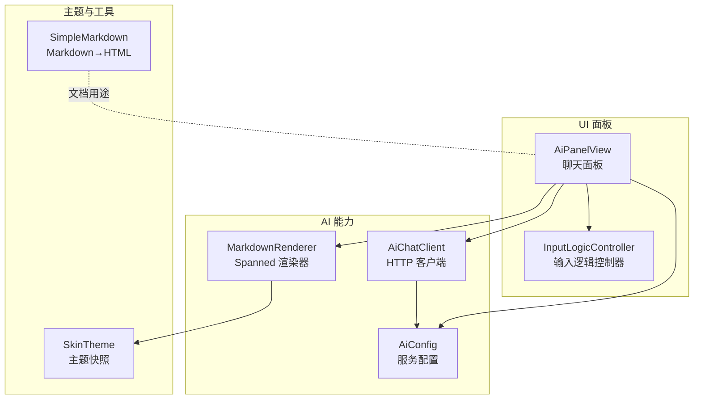
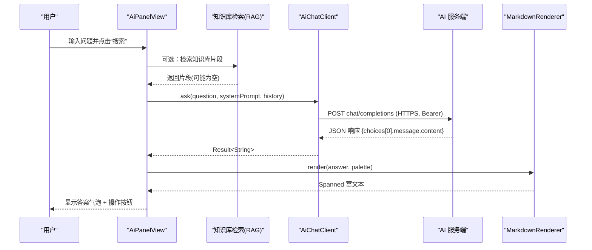
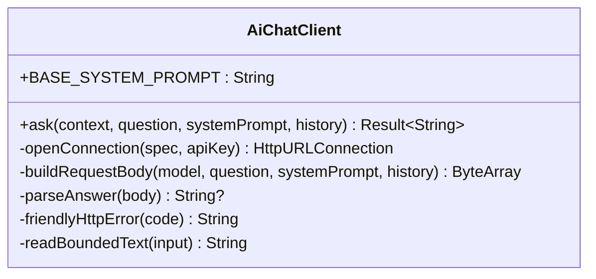
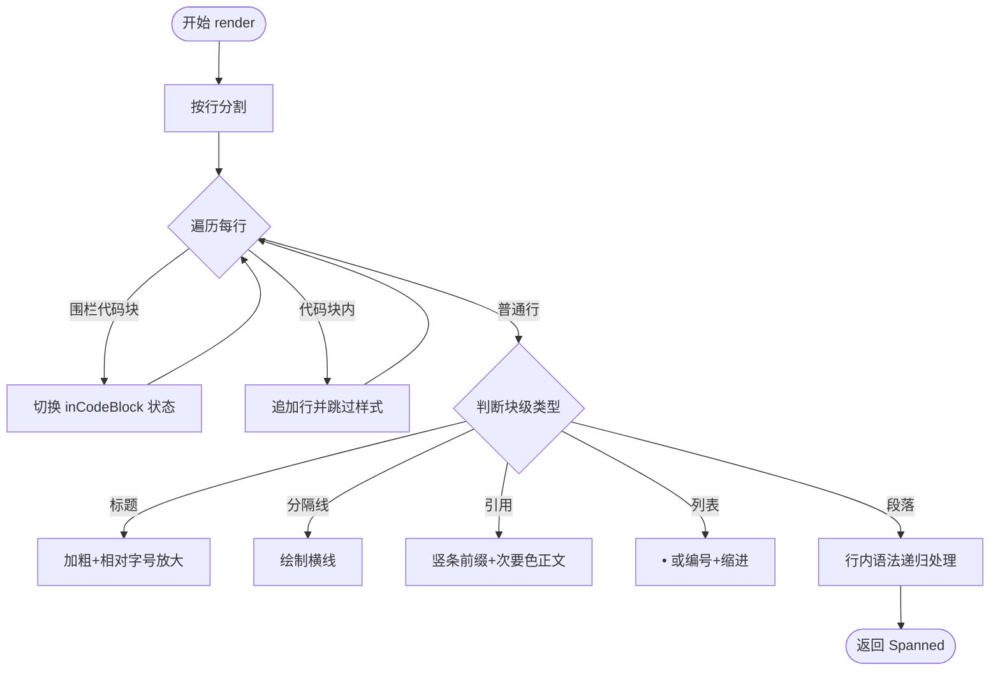
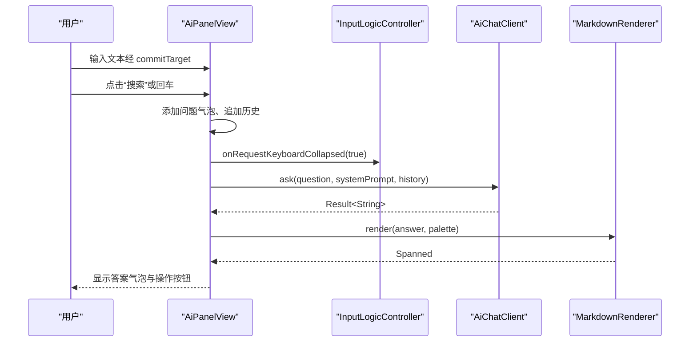
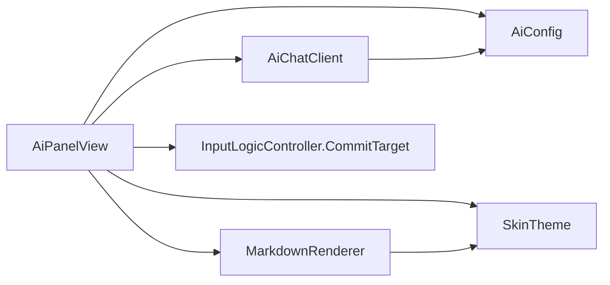

# AI 问答功能

<cite>
**本文引用的文件**   
- [AiChatClient.kt](file://app/src/main/java/com/ziyou/ime/ai/AiChatClient.kt)
- [MarkdownRenderer.kt](file://app/src/main/java/com/ziyou/ime/ai/MarkdownRenderer.kt)
- [AiPanelView.kt](file://app/src/main/java/com/ziyou/ime/ime/AiPanelView.kt)
- [AiConfig.kt](file://app/src/main/java/com/ziyou/ime/ai/AiConfig.kt)
- [InputLogicController.kt](file://app/src/main/java/com/ziyou/ime/ime/InputLogicController.kt)
- [SimpleMarkdown.kt](file://core-logic/src/main/java/com/ziyou/ime/core/markdown/SimpleMarkdown.kt)
- [SkinTheme.kt](file://app/src/main/java/com/ziyou/ime/skin/SkinTheme.kt)
</cite>

## 目录
1. [简介](#简介)
2. [项目结构](#项目结构)
3. [核心组件](#核心组件)
4. [架构总览](#架构总览)
5. [详细组件分析](#详细组件分析)
6. [依赖关系分析](#依赖关系分析)
7. [性能考量](#性能考量)
8. [故障排查指南](#故障排查指南)
9. [结论](#结论)
10. [附录：调用示例与最佳实践](#附录调用示例与最佳实践)

## 简介
本技术文档围绕输入法中的 AI 问答能力，系统性说明以下方面：
- AiChatClient 的 HTTP 客户端封装、错误处理、超时机制与请求限制（不含重试策略）。
- MarkdownRenderer 的轻量 Markdown 渲染实现，包括语法解析、主题样式适配、代码块与链接处理及性能优化。
- AiPanelView 的聊天界面设计，包括消息气泡、输入框、滚动行为与响应式布局。
- AI 面板与输入法主界面的集成方式，包括面板切换、焦点管理与输入路由。
- 提供调用 AI 服务与渲染 Markdown 的具体路径指引，以及用户交互流程与错误处理的最佳实践。

## 项目结构
AI 问答相关代码主要分布在 app 模块的 ai 与 ime 包中，并辅以 core-logic 中的 Markdown 工具与 skin 主题模型：
- ai 包：AI 客户端、配置与 Markdown 渲染器。
- ime 包：AI 面板视图与输入逻辑控制器（负责输入路由与键盘交互）。
- core-logic：通用 Markdown 转换工具（HTML 输出，用于文档场景）。
- skin：皮肤主题运行时快照，为 UI 提供颜色与字体等样式资源。

图表来源
- [AiChatClient.kt:1-194](file://app/src/main/java/com/ziyou/ime/ai/AiChatClient.kt#L1-L194)
- [MarkdownRenderer.kt:1-206](file://app/src/main/java/com/ziyou/ime/ai/MarkdownRenderer.kt#L1-L206)
- [AiPanelView.kt:1-765](file://app/src/main/java/com/ziyou/ime/ime/AiPanelView.kt#L1-L765)
- [AiConfig.kt:1-56](file://app/src/main/java/com/ziyou/ime/ai/AiConfig.kt#L1-L56)
- [InputLogicController.kt:1-200](file://app/src/main/java/com/ziyou/ime/ime/InputLogicController.kt#L1-L200)
- [SimpleMarkdown.kt:1-174](file://core-logic/src/main/java/com/ziyou/ime/core/markdown/SimpleMarkdown.kt#L1-L174)
- [SkinTheme.kt:1-126](file://app/src/main/java/com/ziyou/ime/skin/SkinTheme.kt#L1-L126)

章节来源
- [AiChatClient.kt:1-194](file://app/src/main/java/com/ziyou/ime/ai/AiChatClient.kt#L1-L194)
- [MarkdownRenderer.kt:1-206](file://app/src/main/java/com/ziyou/ime/ai/MarkdownRenderer.kt#L1-L206)
- [AiPanelView.kt:1-765](file://app/src/main/java/com/ziyou/ime/ime/AiPanelView.kt#L1-L765)
- [AiConfig.kt:1-56](file://app/src/main/java/com/ziyou/ime/ai/AiConfig.kt#L1-L56)
- [InputLogicController.kt:1-200](file://app/src/main/java/com/ziyou/ime/ime/InputLogicController.kt#L1-L200)
- [SimpleMarkdown.kt:1-174](file://core-logic/src/main/java/com/ziyou/ime/core/markdown/SimpleMarkdown.kt#L1-L174)
- [SkinTheme.kt:1-126](file://app/src/main/java/com/ziyou/ime/skin/SkinTheme.kt#L1-L126)

## 核心组件
- AiChatClient：OpenAI 兼容的非流式对话客户端，封装 HTTPS 连接、请求体组装、响应解析、错误友好化与网络 IO 隔离。
- MarkdownRenderer：轻量 Markdown 到 Spanned 的渲染器，支持标题、粗斜体、删除线、行内代码、围栏代码块、列表、引用、分隔线与链接展示。
- AiPanelView：AI 问答面板，包含标题栏、对话气泡区、输入行；管理多轮历史、加载态、RAG 检索开关、人设切换与答案操作按钮。
- AiConfig：通过 SharedPreferences 持久化 API URL、Key、模型名，并提供默认值与配置检查。
- InputLogicController：输入逻辑控制器，提供 CommitTarget 抽象，将键盘上屏文本路由到面板输入框或宿主编辑器。
- SkinTheme：皮肤主题快照，为 Markdown 渲染与面板 UI 提供颜色与字体。
- SimpleMarkdown：面向文档的 Markdown→HTML 转换器（与 IME 面板无关，供技能开发文档等使用）。

章节来源
- [AiChatClient.kt:1-194](file://app/src/main/java/com/ziyou/ime/ai/AiChatClient.kt#L1-L194)
- [MarkdownRenderer.kt:1-206](file://app/src/main/java/com/ziyou/ime/ai/MarkdownRenderer.kt#L1-L206)
- [AiPanelView.kt:1-765](file://app/src/main/java/com/ziyou/ime/ime/AiPanelView.kt#L1-L765)
- [AiConfig.kt:1-56](file://app/src/main/java/com/ziyou/ime/ai/AiConfig.kt#L1-L56)
- [InputLogicController.kt:1-200](file://app/src/main/java/com/ziyou/ime/ime/InputLogicController.kt#L1-L200)
- [SkinTheme.kt:1-126](file://app/src/main/java/com/ziyou/ime/skin/SkinTheme.kt#L1-L126)
- [SimpleMarkdown.kt:1-174](file://core-logic/src/main/java/com/ziyou/ime/core/markdown/SimpleMarkdown.kt#L1-L174)

## 架构总览
AI 面板作为上层 UI，协调输入路由、知识库检索与 AI 请求，并将结果以 Markdown 富文本渲染到 TextView。

图表来源
- [AiPanelView.kt:329-416](file://app/src/main/java/com/ziyou/ime/ime/AiPanelView.kt#L329-L416)
- [AiChatClient.kt:65-114](file://app/src/main/java/com/ziyou/ime/ai/AiChatClient.kt#L65-L114)
- [MarkdownRenderer.kt:71-104](file://app/src/main/java/com/ziyou/ime/ai/MarkdownRenderer.kt#L71-L104)

## 详细组件分析

### AiChatClient：AI 客户端集成
- 协议与端点：遵循 OpenAI 兼容的 chat/completions 非流式接口，请求体包含 model、stream=false、messages（system/history/user）。
- 安全基线：强制 HTTPS，设置连接与读取超时，响应体字节上限保护内存。
- 鉴权：Authorization: Bearer <apiKey>。
- 错误处理：HTTP 状态码友好提示（401/403/429/5xx），IO 异常捕获与日志记录，空响应体处理。
- 线程模型：所有网络 IO 在 Dispatchers.IO 执行，避免阻塞 UI。
- 重试策略：当前未实现自动重试；调用方可根据 Result 进行业务层重试。

图表来源
- [AiChatClient.kt:15-194](file://app/src/main/java/com/ziyou/ime/ai/AiChatClient.kt#L15-L194)

章节来源
- [AiChatClient.kt:15-194](file://app/src/main/java/com/ziyou/ime/ai/AiChatClient.kt#L15-L194)

### MarkdownRenderer：Markdown 渲染实现
- 支持的语法子集：标题、粗体/斜体/删除线、行内代码与围栏代码块、无序/有序列表、引用、分隔线、链接（仅展示文本+下划线）。
- 渲染目标：生成 SpannableStringBuilder，直接交给 TextView 渲染，无需 WebView。
- 主题适配：通过 Palette 注入代码背景、强调色、次要文字色，与 SkinTheme 对齐。
- 性能优化：逐行处理、正则匹配、代码块整体应用样式、尾部空行清理、未闭合代码块兜底。

图表来源
- [MarkdownRenderer.kt:71-104](file://app/src/main/java/com/ziyou/ime/ai/MarkdownRenderer.kt#L71-L104)
- [MarkdownRenderer.kt:117-163](file://app/src/main/java/com/ziyou/ime/ai/MarkdownRenderer.kt#L117-L163)
- [MarkdownRenderer.kt:165-204](file://app/src/main/java/com/ziyou/ime/ai/MarkdownRenderer.kt#L165-L204)

章节来源
- [MarkdownRenderer.kt:1-206](file://app/src/main/java/com/ziyou/ime/ai/MarkdownRenderer.kt#L1-L206)

### AiPanelView：聊天界面设计与交互
- 布局形态：
  - 提问态：输入行可见，对话区小窗预览（有历史时）或隐藏。
  - 答案态：键盘收回，对话区接管空间独立滚动。
- 消息气泡：
  - 用户问题：右对齐，强调色底。
  - AI 答案：左对齐，Markdown 富文本，右侧附“发送”“发图/存图”按钮。
- 输入路由：
  - 面板打开期间，commitTarget 接管键盘上屏，文本注入面板输入框。
  - 回车键触发发送问题。
- 多轮对话：
  - 维护 FIFO 历史（上限 MAX_HISTORY_SIZE），失败时回滚 user 消息避免重复。
- 知识库（RAG）：
  - 开启时检索片段并融合 prompt；失败降级为普通问答。
- 人设切换：
  - 浮层选择内置/自定义人设，切换后清空会话避免风格冲突。
- 生命周期：
  - release() 持久化记忆、统计刷新、取消协程与请求。

图表来源
- [AiPanelView.kt:329-416](file://app/src/main/java/com/ziyou/ime/ime/AiPanelView.kt#L329-L416)
- [InputLogicController.kt:95-111](file://app/src/main/java/com/ziyou/ime/ime/InputLogicController.kt#L95-L111)
- [MarkdownRenderer.kt:71-104](file://app/src/main/java/com/ziyou/ime/ai/MarkdownRenderer.kt#L71-L104)

章节来源
- [AiPanelView.kt:1-765](file://app/src/main/java/com/ziyou/ime/ime/AiPanelView.kt#L1-L765)
- [InputLogicController.kt:1-200](file://app/src/main/java/com/ziyou/ime/ime/InputLogicController.kt#L1-L200)

### 配置与主题
- AiConfig：
  - 默认端点与模型名、默认 API Key（可被设置页覆盖）。
  - isConfigured() 判断是否已配置。
- SkinTheme：
  - 提供 keyBackground、candidateHighlightColor、preeditTextColor 等颜色字段，供 MarkdownRenderer.Palette 与面板 UI 使用。

章节来源
- [AiConfig.kt:1-56](file://app/src/main/java/com/ziyou/ime/ai/AiConfig.kt#L1-L56)
- [SkinTheme.kt:1-126](file://app/src/main/java/com/ziyou/ime/skin/SkinTheme.kt#L1-L126)

## 依赖关系分析
- AiPanelView 依赖：
  - AiChatClient：发起 AI 请求。
  - MarkdownRenderer：渲染答案。
  - AiConfig：读取服务配置。
  - InputLogicController.CommitTarget：输入路由。
  - SkinTheme：主题颜色。
- AiChatClient 依赖：
  - AiConfig：获取 API URL、Key、模型名。
- MarkdownRenderer 依赖：
  - SkinTheme：通过 Palette 注入颜色。
- SimpleMarkdown：独立于 IME 面板，用于文档 HTML 转换。

图表来源
- [AiPanelView.kt:1-765](file://app/src/main/java/com/ziyou/ime/ime/AiPanelView.kt#L1-L765)
- [AiChatClient.kt:1-194](file://app/src/main/java/com/ziyou/ime/ai/AiChatClient.kt#L1-L194)
- [MarkdownRenderer.kt:1-206](file://app/src/main/java/com/ziyou/ime/ai/MarkdownRenderer.kt#L1-L206)
- [AiConfig.kt:1-56](file://app/src/main/java/com/ziyou/ime/ai/AiConfig.kt#L1-L56)
- [InputLogicController.kt:1-200](file://app/src/main/java/com/ziyou/ime/ime/InputLogicController.kt#L1-L200)
- [SkinTheme.kt:1-126](file://app/src/main/java/com/ziyou/ime/skin/SkinTheme.kt#L1-L126)

章节来源
- [AiPanelView.kt:1-765](file://app/src/main/java/com/ziyou/ime/ime/AiPanelView.kt#L1-L765)
- [AiChatClient.kt:1-194](file://app/src/main/java/com/ziyou/ime/ai/AiChatClient.kt#L1-L194)
- [MarkdownRenderer.kt:1-206](file://app/src/main/java/com/ziyou/ime/ai/MarkdownRenderer.kt#L1-L206)
- [AiConfig.kt:1-56](file://app/src/main/java/com/ziyou/ime/ai/AiConfig.kt#L1-L56)
- [InputLogicController.kt:1-200](file://app/src/main/java/com/ziyou/ime/ime/InputLogicController.kt#L1-L200)
- [SkinTheme.kt:1-126](file://app/src/main/java/com/ziyou/ime/skin/SkinTheme.kt#L1-L126)

## 性能考量
- 网络 IO：
  - 全部在 Dispatchers.IO 执行，避免阻塞 UI。
  - 连接/读取超时分别设置为 15s/60s，防止长时间挂起。
  - 响应体上限 1MB，避免 OOM。
- 输入长度限制：
  - 单次提问字符上限 2000，避免超长内容导致服务端压力或解析失败。
- Markdown 渲染：
  - 纯 Spanned 渲染，无 WebView 开销；逐行处理减少内存占用。
  - 代码块整体应用样式，减少多次 setSpan 调用。
- 面板交互：
  - 连续追问会取消旧请求，避免并发与资源浪费。
  - 历史消息 FIFO 上限，控制内存增长。

章节来源
- [AiChatClient.kt:31-114](file://app/src/main/java/com/ziyou/ime/ai/AiChatClient.kt#L31-L114)
- [MarkdownRenderer.kt:71-104](file://app/src/main/java/com/ziyou/ime/ai/MarkdownRenderer.kt#L71-L104)
- [AiPanelView.kt:329-416](file://app/src/main/java/com/ziyou/ime/ime/AiPanelView.kt#L329-L416)

## 故障排查指南
- 未配置 API Key：
  - 现象：面板提示去设置页完成配置。
  - 处理：进入设置页填写 API Key，确保 isConfigured() 为真。
- HTTP 错误：
  - 401/403：检查 API Key 是否正确。
  - 429：请求过于频繁或额度不足，稍后再试。
  - 5xx：服务端不可用，稍后再试。
- 网络异常：
  - 检查网络连接与代理设置，确认 HTTPS 端点可达。
- 响应为空：
  - 服务端返回空 content，建议重试或检查系统提示词与模型参数。
- Markdown 渲染异常：
  - 不支持的语法将被降级为普通文本，不会抛错；如需表格/图片，需扩展 MarkdownRenderer。

章节来源
- [AiPanelView.kt:349-416](file://app/src/main/java/com/ziyou/ime/ime/AiPanelView.kt#L349-L416)
- [AiChatClient.kt:89-114](file://app/src/main/java/com/ziyou/ime/ai/AiChatClient.kt#L89-L114)

## 结论
该 AI 问答功能以轻量、安全的 HTTP 客户端与纯代码 Markdown 渲染为核心，结合输入路由与主题适配，实现了流畅的 IME 内问答体验。通过合理的超时、限长与内存保护，保障了稳定性与性能。未来可在业务层增加重试策略与更丰富的 Markdown 语法支持，进一步提升用户体验。

## 附录：调用示例与最佳实践
- 调用 AI 服务：
  - 在面板中构建 systemPrompt（拼接 BASE_SYSTEM_PROMPT 与人设提示词），传入 ask(question, systemPrompt, history)。
  - 参考路径：[AiPanelView.sendQuestion:329-416](file://app/src/main/java/com/ziyou/ime/ime/AiPanelView.kt#L329-L416)、[AiChatClient.ask:65-114](file://app/src/main/java/com/ziyou/ime/ai/AiChatClient.kt#L65-L114)。
- 渲染 Markdown：
  - 使用 MarkdownRenderer.render(answer, palette)，palette 从 SkinTheme 取色。
  - 参考路径：[MarkdownRenderer.render:71-104](file://app/src/main/java/com/ziyou/ime/ai/MarkdownRenderer.kt#L71-L104)、[SkinTheme 颜色字段:30-40](file://app/src/main/java/com/ziyou/ime/skin/SkinTheme.kt#L30-L40)。
- 输入路由：
  - 面板打开时将 commitTarget 设为面板的 aiCommitTarget，回车键触发发送。
  - 参考路径：[InputLogicController.CommitTarget:95-111](file://app/src/main/java/com/ziyou/ime/ime/InputLogicController.kt#L95-L111)、[AiPanelView.aiCommitTarget:155-161](file://app/src/main/java/com/ziyou/ime/ime/AiPanelView.kt#L155-L161)。
- 最佳实践：
  - 统一错误提示与友好文案，避免暴露内部异常细节。
  - 对长回答与复杂 Markdown 做渐进式渲染与懒加载（如需要）。
  - 在业务层实现指数退避重试，配合用户反馈与取消机制。

章节来源
- [AiPanelView.kt:329-416](file://app/src/main/java/com/ziyou/ime/ime/AiPanelView.kt#L329-L416)
- [AiChatClient.kt:65-114](file://app/src/main/java/com/ziyou/ime/ai/AiChatClient.kt#L65-L114)
- [MarkdownRenderer.kt:71-104](file://app/src/main/java/com/ziyou/ime/ai/MarkdownRenderer.kt#L71-L104)
- [InputLogicController.kt:95-111](file://app/src/main/java/com/ziyou/ime/ime/InputLogicController.kt#L95-L111)
- [SkinTheme.kt:30-40](file://app/src/main/java/com/ziyou/ime/skin/SkinTheme.kt#L30-L40)