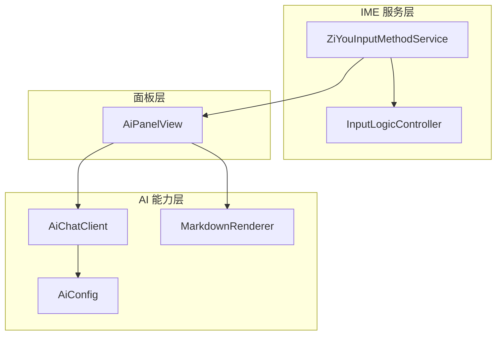
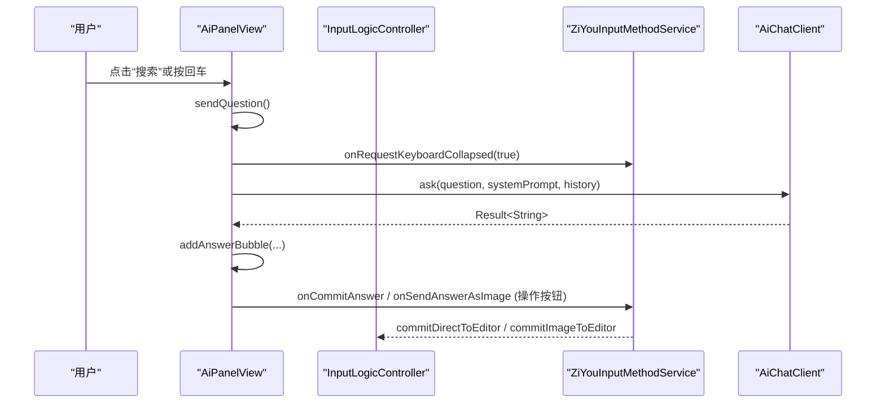
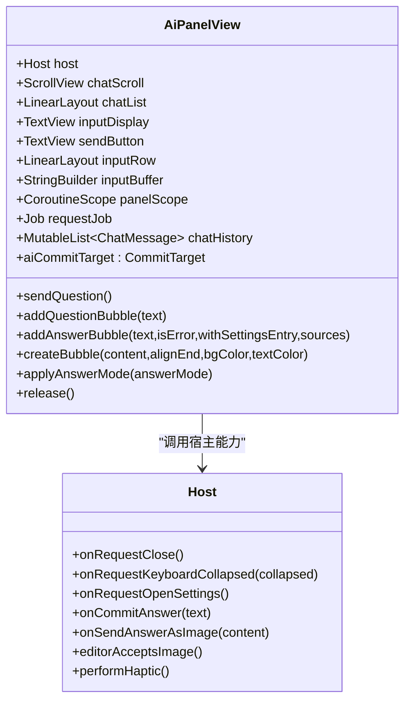
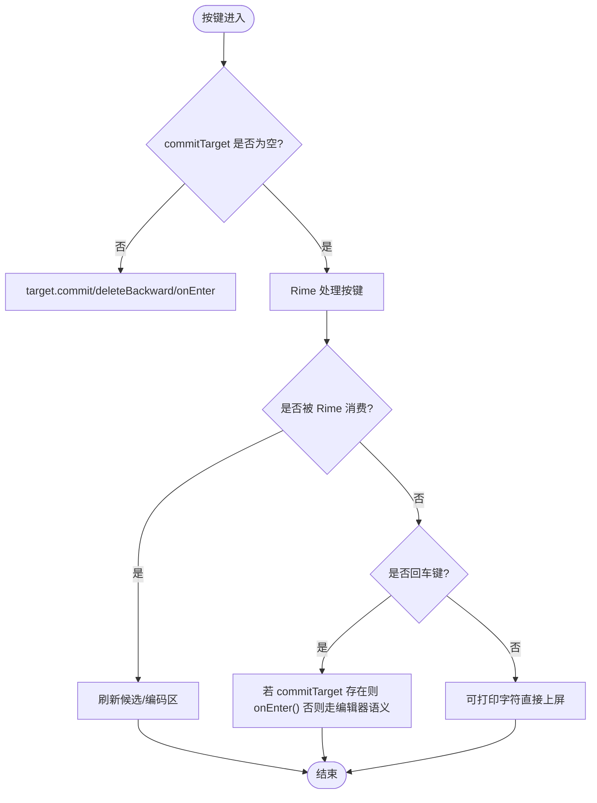
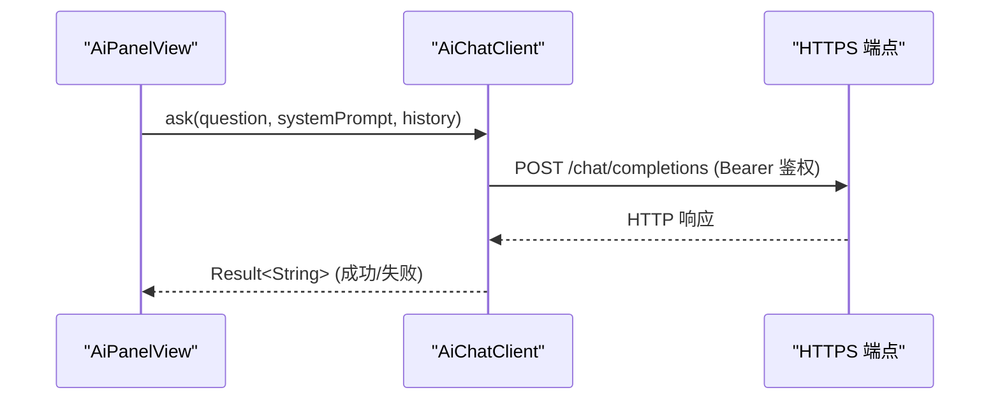
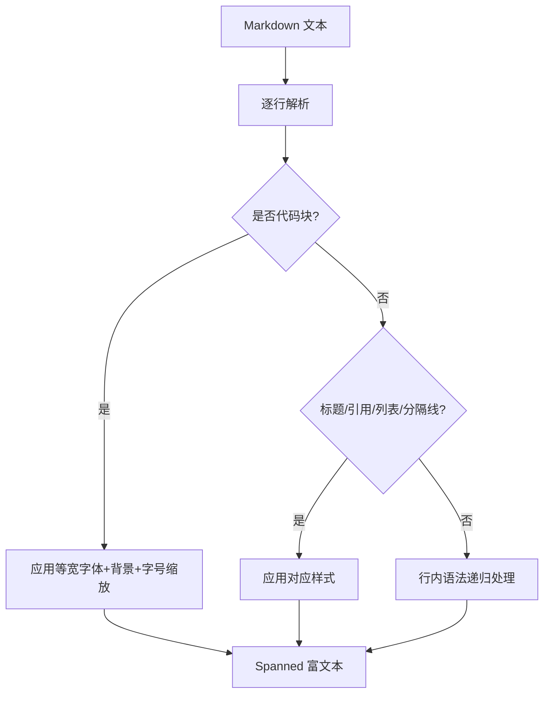
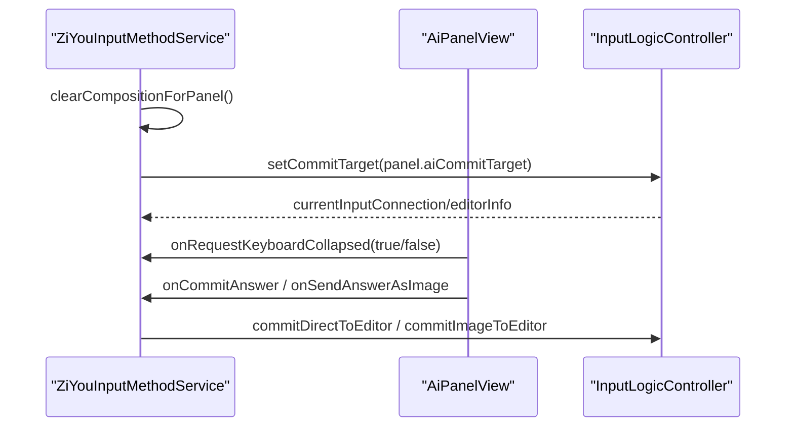
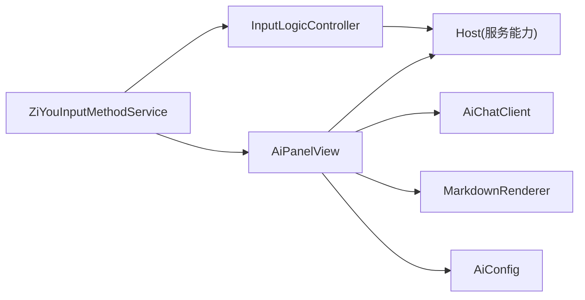
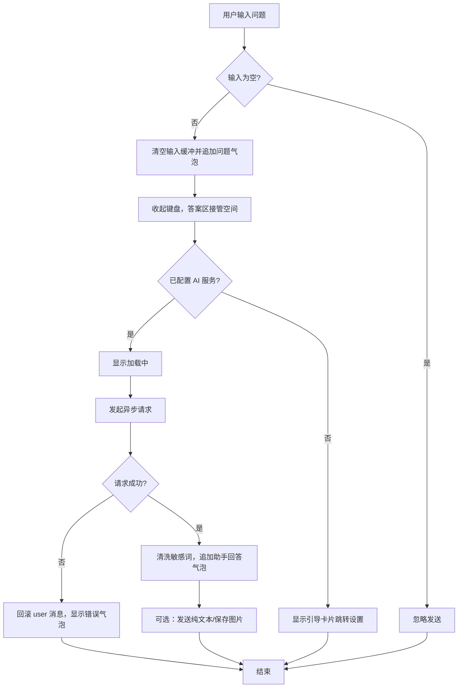

# AI 面板界面设计

<cite>
**本文引用的文件**   
- [AiPanelView.kt](file://app/src/main/java/com/ziyou/ime/ime/AiPanelView.kt)
- [InputLogicController.kt](file://app/src/main/java/com/ziyou/ime/ime/InputLogicController.kt)
- [ZiYouInputMethodService.kt](file://app/src/main/java/com/ziyou/ime/ime/ZiYouInputMethodService.kt)
- [AiChatClient.kt](file://app/src/main/java/com/ziyou/ime/ai/AiChatClient.kt)
- [MarkdownRenderer.kt](file://app/src/main/java/com/ziyou/ime/ai/MarkdownRenderer.kt)
- [AiConfig.kt](file://app/src/main/java/com/ziyou/ime/ai/AiConfig.kt)
</cite>

## 目录
1. [简介](#简介)
2. [项目结构](#项目结构)
3. [核心组件](#核心组件)
4. [架构总览](#架构总览)
5. [详细组件分析](#详细组件分析)
6. [依赖关系分析](#依赖关系分析)
7. [性能考量](#性能考量)
8. [故障排查指南](#故障排查指南)
9. [结论](#结论)
10. [附录](#附录)

## 简介
本技术文档围绕输入法中的 AI 问答面板（AiPanelView）展开，系统性说明其聊天界面布局、消息气泡与输入框交互、滚动行为与响应式适配；解释面板与输入法主界面的集成方式（面板切换动画、焦点管理、输入路由与键盘状态同步）；详述用户交互流程（发送、加载、错误提示与反馈）、数据绑定与状态管理（实时消息更新、历史保存与 UI 同步）、触摸事件处理（手势、滑动与快捷键），并提供自定义样式与主题适配方法。

## 项目结构
AI 面板相关代码主要位于 ime 包与 ai 包：
- ime/AiPanelView.kt：面板视图实现（标题栏、对话区、输入行、人设浮层、知识库开关等）
- ime/InputLogicController.kt：输入逻辑控制器（按键处理、上屏路由、回车落地、图片提交）
- ime/ZiYouInputMethodService.kt：输入法服务（协调器宿主能力注入、面板生命周期编排）
- ai/AiChatClient.kt：OpenAI 兼容客户端（网络请求、错误友好化、响应限制）
- ai/MarkdownRenderer.kt：轻量 Markdown 渲染（Spanned 富文本）
- ai/AiConfig.kt：AI 服务配置（API URL/Key/模型名持久化）

**图表来源** 
- [ZiYouInputMethodService.kt:140-172](file://app/src/main/java/com/ziyou/ime/ime/ZiYouInputMethodService.kt#L140-L172)
- [InputLogicController.kt:95-112](file://app/src/main/java/com/ziyou/ime/ime/InputLogicController.kt#L95-L112)
- [AiPanelView.kt:55-84](file://app/src/main/java/com/ziyou/ime/ime/AiPanelView.kt#L55-L84)
- [AiChatClient.kt:31-54](file://app/src/main/java/com/ziyou/ime/ai/AiChatClient.kt#L31-L54)
- [MarkdownRenderer.kt:32-42](file://app/src/main/java/com/ziyou/ime/ai/MarkdownRenderer.kt#L32-L42)
- [AiConfig.kt:14-28](file://app/src/main/java/com/ziyou/ime/ai/AiConfig.kt#L14-L28)

**章节来源**
- [AiPanelView.kt:55-84](file://app/src/main/java/com/ziyou/ime/ime/AiPanelView.kt#L55-L84)
- [InputLogicController.kt:95-112](file://app/src/main/java/com/ziyou/ime/ime/InputLogicController.kt#L95-L112)
- [ZiYouInputMethodService.kt:140-172](file://app/src/main/java/com/ziyou/ime/ime/ZiYouInputMethodService.kt#L140-L172)

## 核心组件
- AiPanelView：AI 面板视图，负责标题栏、对话气泡区、输入行、人设浮层、知识库开关、加载指示、滚动与布局形态切换。
- InputLogicController：输入逻辑控制器，提供 CommitTarget 抽象，将键盘上屏文本路由到面板或宿主编辑器，并处理回车键落地与图片提交。
- AiChatClient：OpenAI 兼容客户端，封装 HTTPS 连接、超时、鉴权、请求体构建、响应解析与错误友好化。
- MarkdownRenderer：轻量 Markdown 渲染器，输出 Spanned 富文本供 TextView 直接展示。
- AiConfig：AI 服务配置读写（URL/Key/模型名）。

**章节来源**
- [AiPanelView.kt:55-162](file://app/src/main/java/com/ziyou/ime/ime/AiPanelView.kt#L55-L162)
- [InputLogicController.kt:95-112](file://app/src/main/java/com/ziyou/ime/ime/InputLogicController.kt#L95-L112)
- [AiChatClient.kt:31-54](file://app/src/main/java/com/ziyou/ime/ai/AiChatClient.kt#L31-L54)
- [MarkdownRenderer.kt:32-42](file://app/src/main/java/com/ziyou/ime/ai/MarkdownRenderer.kt#L32-L42)
- [AiConfig.kt:14-28](file://app/src/main/java/com/ziyou/ime/ai/AiConfig.kt#L14-L28)

## 架构总览
AI 面板通过输入法服务的协调器宿主能力挂载在内容根容器顶部（编码区上方），利用 InputLogicController 的 CommitTarget 接管键盘上屏，回车键由面板消费触发发送。面板内部维护协程作用域与对话历史，发起异步请求并在成功/失败时更新 UI。

**图表来源** 
- [AiPanelView.kt:329-416](file://app/src/main/java/com/ziyou/ime/ime/AiPanelView.kt#L329-L416)
- [InputLogicController.kt:383-396](file://app/src/main/java/com/ziyou/ime/ime/InputLogicController.kt#L383-L396)
- [ZiYouInputMethodService.kt:149-172](file://app/src/main/java/com/ziyou/ime/ime/ZiYouInputMethodService.kt#L149-L172)
- [AiChatClient.kt:65-114](file://app/src/main/java/com/ziyou/ime/ai/AiChatClient.kt#L65-L114)

## 详细组件分析

### AiPanelView 组件分析
- 布局结构
  - 标题栏：人设标签、知识库开关、标题、“新对话”、关闭按钮
  - 对话区：ScrollView + LinearLayout 承载气泡列表
  - 输入行：TextView 展示输入缓冲 + “搜索”按钮
- 交互与状态
  - 输入路由：通过 aiCommitTarget 接收键盘上屏文本与退格、回车
  - 多轮历史：chatHistory FIFO 上限，trimHistory 保持偶数条
  - 加载指示：showLoading/hideLoading
  - 气泡渲染：问题右对齐强调色底；答案左对齐，Markdown 渲染，附带“发送/发图”按钮
  - 人设浮层：togglePersonaOverlay、refreshPersonaOverlay、switchToPersona
  - 知识库开关：toggleKnowledge、refreshKnowledgeLabel
  - 布局形态：applyAnswerMode 切换答案态/提问态，控制 chatScroll 权重与高度
- 资源与主题
  - 使用 SkinTheme 映射颜色（背景、高亮、预编辑色、边框等）
  - MarkdownPalette 从主题取色用于代码块背景、引用/链接强调色、次要文字色

**图表来源** 
- [AiPanelView.kt:55-84](file://app/src/main/java/com/ziyou/ime/ime/AiPanelView.kt#L55-L84)
- [AiPanelView.kt:155-162](file://app/src/main/java/com/ziyou/ime/ime/AiPanelView.kt#L155-L162)
- [AiPanelView.kt:329-416](file://app/src/main/java/com/ziyou/ime/ime/AiPanelView.kt#L329-L416)
- [AiPanelView.kt:736-754](file://app/src/main/java/com/ziyou/ime/ime/AiPanelView.kt#L736-L754)

**章节来源**
- [AiPanelView.kt:163-293](file://app/src/main/java/com/ziyou/ime/ime/AiPanelView.kt#L163-L293)
- [AiPanelView.kt:295-320](file://app/src/main/java/com/ziyou/ime/ime/AiPanelView.kt#L295-L320)
- [AiPanelView.kt:329-416](file://app/src/main/java/com/ziyou/ime/ime/AiPanelView.kt#L329-L416)
- [AiPanelView.kt:467-532](file://app/src/main/java/com/ziyou/ime/ime/AiPanelView.kt#L467-L532)
- [AiPanelView.kt:587-693](file://app/src/main/java/com/ziyou/ime/ime/AiPanelView.kt#L587-L693)
- [AiPanelView.kt:695-715](file://app/src/main/java/com/ziyou/ime/ime/AiPanelView.kt#L695-L715)
- [AiPanelView.kt:729-754](file://app/src/main/java/com/ziyou/ime/ime/AiPanelView.kt#L729-L754)

### InputLogicController 与面板集成
- CommitTarget 抽象：面板实现 aiCommitTarget，接管键盘上屏、退格与回车
- 回车落地：当 commitTarget 非空时，回车路由给 target.onEnter()，面板据此触发发送
- 图片提交：commitImageToEditor 通过 Commit Content API 提交图片至宿主编辑器
- 直接上屏：commitDirectToEditor 绕过 CommitTarget 直达宿主编辑器

**图表来源** 
- [InputLogicController.kt:126-185](file://app/src/main/java/com/ziyou/ime/ime/InputLogicController.kt#L126-L185)
- [InputLogicController.kt:383-396](file://app/src/main/java/com/ziyou/ime/ime/InputLogicController.kt#L383-L396)
- [InputLogicController.kt:462-486](file://app/src/main/java/com/ziyou/ime/ime/InputLogicController.kt#L462-L486)

**章节来源**
- [InputLogicController.kt:95-112](file://app/src/main/java/com/ziyou/ime/ime/InputLogicController.kt#L95-L112)
- [InputLogicController.kt:126-185](file://app/src/main/java/com/ziyou/ime/ime/InputLogicController.kt#L126-L185)
- [InputLogicController.kt:383-396](file://app/src/main/java/com/ziyou/ime/ime/InputLogicController.kt#L383-L396)
- [InputLogicController.kt:462-486](file://app/src/main/java/com/ziyou/ime/ime/InputLogicController.kt#L462-L486)

### AiChatClient 网络与错误处理
- 安全基线：强制 HTTPS、连接/读取超时、响应字节上限
- 请求体：OpenAI 兼容 messages（system → history → user）
- 错误友好化：HTTP 状态码转用户可读提示
- 线程模型：IO 线程执行，不阻塞 UI

**图表来源** 
- [AiChatClient.kt:65-114](file://app/src/main/java/com/ziyou/ime/ai/AiChatClient.kt#L65-L114)
- [AiChatClient.kt:135-153](file://app/src/main/java/com/ziyou/ime/ai/AiChatClient.kt#L135-L153)
- [AiChatClient.kt:169-175](file://app/src/main/java/com/ziyou/ime/ai/AiChatClient.kt#L169-L175)

**章节来源**
- [AiChatClient.kt:31-54](file://app/src/main/java/com/ziyou/ime/ai/AiChatClient.kt#L31-L54)
- [AiChatClient.kt:65-114](file://app/src/main/java/com/ziyou/ime/ai/AiChatClient.kt#L65-L114)
- [AiChatClient.kt:135-153](file://app/src/main/java/com/ziyou/ime/ai/AiChatClient.kt#L135-L153)
- [AiChatClient.kt:169-175](file://app/src/main/java/com/ziyou/ime/ai/AiChatClient.kt#L169-L175)

### MarkdownRenderer 富文本渲染
- 支持标题、粗斜体、删除线、行内代码、围栏代码块、无序/有序列表、引用、分隔线、链接
- 通过 Palette 从主题取色，保证浅色/深色/Material 主题一致
- 输出 Spanned 供 TextView 直接渲染

**图表来源** 
- [MarkdownRenderer.kt:71-104](file://app/src/main/java/com/ziyou/ime/ai/MarkdownRenderer.kt#L71-L104)
- [MarkdownRenderer.kt:117-163](file://app/src/main/java/com/ziyou/ime/ai/MarkdownRenderer.kt#L117-L163)
- [MarkdownRenderer.kt:166-204](file://app/src/main/java/com/ziyou/ime/ai/MarkdownRenderer.kt#L166-L204)

**章节来源**
- [MarkdownRenderer.kt:32-42](file://app/src/main/java/com/ziyou/ime/ai/MarkdownRenderer.kt#L32-L42)
- [MarkdownRenderer.kt:71-104](file://app/src/main/java/com/ziyou/ime/ai/MarkdownRenderer.kt#L71-L104)
- [MarkdownRenderer.kt:117-163](file://app/src/main/java/com/ziyou/ime/ai/MarkdownRenderer.kt#L117-L163)
- [MarkdownRenderer.kt:166-204](file://app/src/main/java/com/ziyou/ime/ai/MarkdownRenderer.kt#L166-L204)

### 面板与输入法服务集成
- 服务提供 Host 能力：容器访问、输入路由切换、图片提交、震动反馈
- 面板打开前统一清理编码与候选（clearCompositionForPanel）
- 面板切换时设置 commitTarget，回车路由到面板触发发送

**图表来源** 
- [ZiYouInputMethodService.kt:149-172](file://app/src/main/java/com/ziyou/ime/ime/ZiYouInputMethodService.kt#L149-L172)
- [ZiYouInputMethodService.kt:284-295](file://app/src/main/java/com/ziyou/ime/ime/ZiYouInputMethodService.kt#L284-L295)
- [InputLogicController.kt:383-396](file://app/src/main/java/com/ziyou/ime/ime/InputLogicController.kt#L383-L396)

**章节来源**
- [ZiYouInputMethodService.kt:149-172](file://app/src/main/java/com/ziyou/ime/ime/ZiYouInputMethodService.kt#L149-L172)
- [ZiYouInputMethodService.kt:284-295](file://app/src/main/java/com/ziyou/ime/ime/ZiYouInputMethodService.kt#L284-L295)

## 依赖关系分析
- AiPanelView 依赖 Host（服务提供的能力）、AiChatClient（网络）、MarkdownRenderer（富文本）、AiConfig（配置）
- InputLogicController 暴露 CommitTarget 接口，面板实现该接口以接管输入
- 服务作为协调者，装配各面板与输入逻辑，管理生命周期与布局

**图表来源** 
- [AiPanelView.kt:55-84](file://app/src/main/java/com/ziyou/ime/ime/AiPanelView.kt#L55-L84)
- [InputLogicController.kt:95-112](file://app/src/main/java/com/ziyou/ime/ime/InputLogicController.kt#L95-L112)
- [ZiYouInputMethodService.kt:149-172](file://app/src/main/java/com/ziyou/ime/ime/ZiYouInputMethodService.kt#L149-L172)

**章节来源**
- [AiPanelView.kt:55-84](file://app/src/main/java/com/ziyou/ime/ime/AiPanelView.kt#L55-L84)
- [InputLogicController.kt:95-112](file://app/src/main/java/com/ziyou/ime/ime/InputLogicController.kt#L95-L112)
- [ZiYouInputMethodService.kt:149-172](file://app/src/main/java/com/ziyou/ime/ime/ZiYouInputMethodService.kt#L149-L172)

## 性能考量
- 网络 IO 切至 IO 线程，避免阻塞 UI；响应体大小限制防止内存溢出
- 面板持有独立协程作用域，释放时取消进行中的请求与作用域，避免泄漏
- Markdown 渲染为轻量正则与 Spanned 操作，无 WebView 开销
- 输入路径串行化（Mutex）减少竞态，提升稳定性

[本节为通用指导，无需具体文件引用]

## 故障排查指南
- 未配置 AI 服务：面板会显示引导卡片，跳转设置页完成 API Key 配置
- 网络异常：客户端返回友好错误提示（鉴权失败、频率限制、服务端不可用等）
- 请求失败：面板回滚最近一次 user 消息，避免重复；错误气泡呈现
- 图片提交失败：检查编辑器是否接受图片（acceptsImageContent），必要时转为保存到相册

**章节来源**
- [AiPanelView.kt:349-354](file://app/src/main/java/com/ziyou/ime/ime/AiPanelView.kt#L349-L354)
- [AiChatClient.kt:169-175](file://app/src/main/java/com/ziyou/ime/ai/AiChatClient.kt#L169-L175)
- [InputLogicController.kt:446-447](file://app/src/main/java/com/ziyou/ime/ime/InputLogicController.kt#L446-L447)

## 结论
AiPanelView 通过清晰的布局结构与输入路由机制，实现了与输入法主界面的无缝集成；借助协程与轻量渲染，保证了流畅的用户体验与良好的主题一致性。结合服务层的协调能力，面板在键盘收放、焦点管理与状态同步方面表现稳定，适合扩展更多交互与样式定制。

[本节为总结性内容，无需具体文件引用]

## 附录

### 用户交互流程图（发送、加载、错误与反馈）

**图表来源** 
- [AiPanelView.kt:329-416](file://app/src/main/java/com/ziyou/ime/ime/AiPanelView.kt#L329-L416)

### 自定义样式与主题适配
- 颜色映射：使用 SkinTheme 的 keyBackground、candidateHighlightColor、preeditTextColor、borderColor 等
- Markdown 调色板：codeBackground、accentColor、secondaryColor 来自主题，确保代码块与引用/链接颜色一致
- 圆角与描边：roundedBg 统一风格，半径与描边色跟随主题
- 人设与知识库标签：根据启用状态调整颜色与透明度

**章节来源**
- [AiPanelView.kt:144-149](file://app/src/main/java/com/ziyou/ime/ime/AiPanelView.kt#L144-L149)
- [AiPanelView.kt:578-585](file://app/src/main/java/com/ziyou/ime/ime/AiPanelView.kt#L578-L585)
- [MarkdownRenderer.kt:32-42](file://app/src/main/java/com/ziyou/ime/ai/MarkdownRenderer.kt#L32-L42)