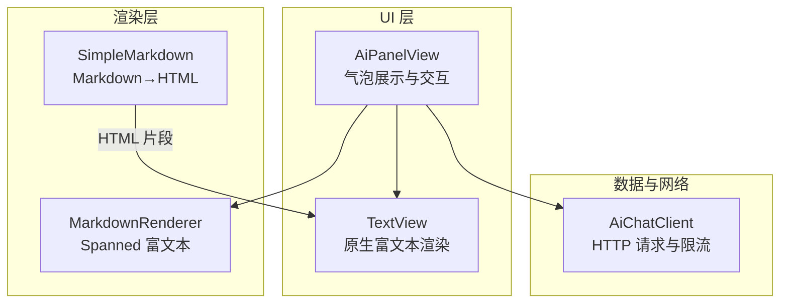
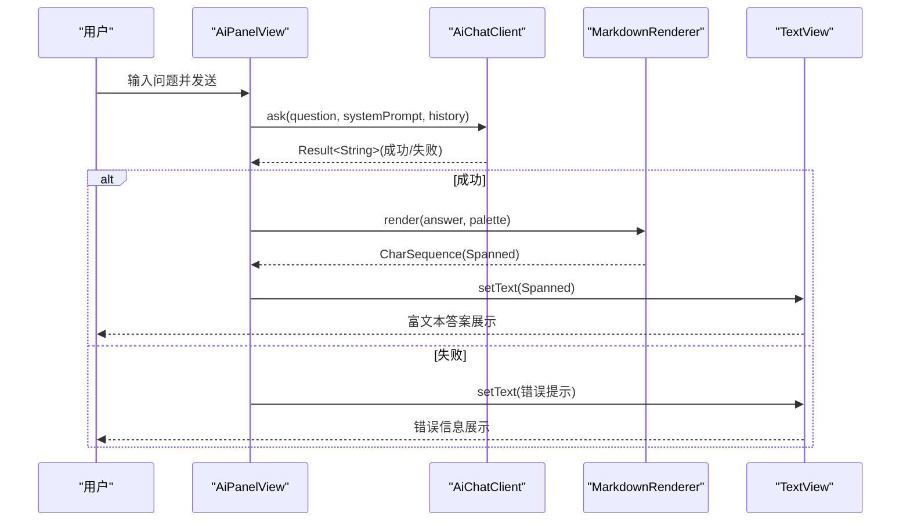
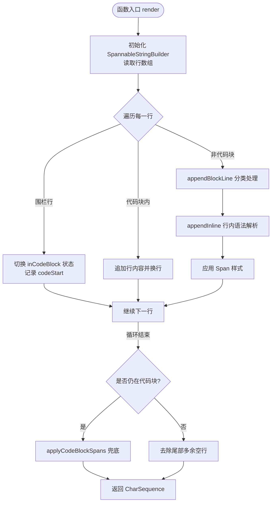
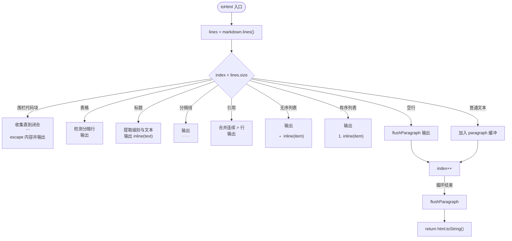
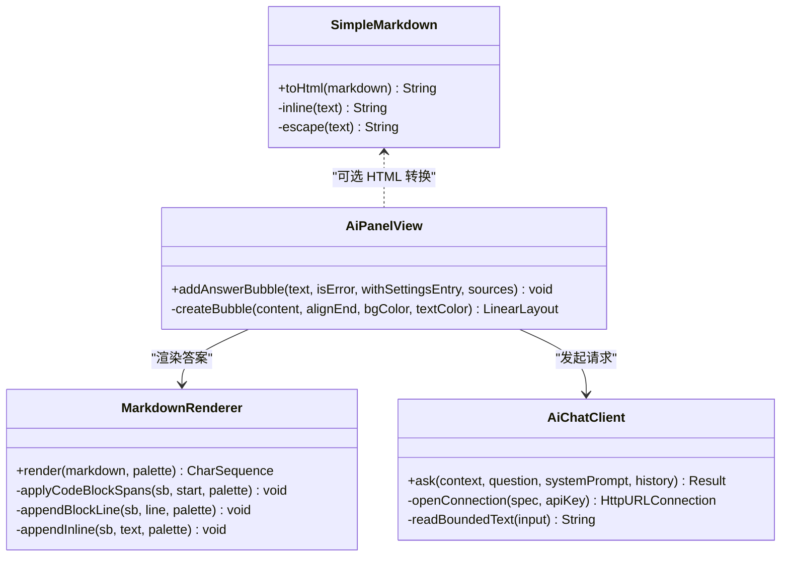

# Markdown 渲染引擎

<cite>
**本文引用的文件**
- [MarkdownRenderer.kt](file://app/src/main/java/com/ziyou/ime/ai/MarkdownRenderer.kt)
- [SimpleMarkdown.kt](file://core-logic/src/main/java/com/ziyou/ime/core/markdown/SimpleMarkdown.kt)
- [AiPanelView.kt](file://app/src/main/java/com/ziyou/ime/ime/AiPanelView.kt)
- [AiChatClient.kt](file://app/src/main/java/com/ziyou/ime/ai/AiChatClient.kt)
- [SimpleMarkdownTest.kt](file://core-logic/src/test/java/com/ziyou/ime/core/markdown/SimpleMarkdownTest.kt)
</cite>

## 目录
1. [简介](#简介)
2. [项目结构](#项目结构)
3. [核心组件](#核心组件)
4. [架构总览](#架构总览)
5. [详细组件分析](#详细组件分析)
6. [依赖关系分析](#依赖关系分析)
7. [性能考量](#性能考量)
8. [故障排查指南](#故障排查指南)
9. [结论](#结论)
10. [附录](#附录)

## 简介
本技术文档围绕输入法项目中的 Markdown 渲染能力展开，重点说明：
- MarkdownRenderer 的语法解析与 Android TextView 适配方案（SpannableString、样式应用、字体大小与颜色）。
- SimpleMarkdown 的极简 Markdown→HTML 转换与安全过滤策略。
- 图片处理机制（URL 校验、加载策略、缓存与失败回退）在面板中的集成方式。
- 性能优化策略（增量渲染、懒加载、内存管理与卡顿避免）。
- 使用示例与调试方法，帮助快速验证渲染效果与定位问题。

## 项目结构
- app 模块负责 UI 与交互，包含 AI 问答面板、网络请求与 Markdown 渲染器。
- core-logic 模块提供纯逻辑实现，包含极简 Markdown→HTML 转换器及其单元测试。
- 渲染管线：AI 回答文本 → MarkdownRenderer 生成 Spanned → TextView 直接显示；或 SimpleMarkdown 生成 HTML 片段用于文档查看场景。



图表来源
- [AiPanelView.kt:482-532](file://app/src/main/java/com/ziyou/ime/ime/AiPanelView.kt#L482-L532)
- [MarkdownRenderer.kt:71-104](file://app/src/main/java/com/ziyou/ime/ai/MarkdownRenderer.kt#L71-L104)
- [SimpleMarkdown.kt:17-136](file://core-logic/src/main/java/com/ziyou/ime/core/markdown/SimpleMarkdown.kt#L17-L136)
- [AiChatClient.kt:65-114](file://app/src/main/java/com/ziyou/ime/ai/AiChatClient.kt#L65-L114)

章节来源
- [AiPanelView.kt:482-532](file://app/src/main/java/com/ziyou/ime/ime/AiPanelView.kt#L482-L532)
- [MarkdownRenderer.kt:71-104](file://app/src/main/java/com/ziyou/ime/ai/MarkdownRenderer.kt#L71-L104)
- [SimpleMarkdown.kt:17-136](file://core-logic/src/main/java/com/ziyou/ime/core/markdown/SimpleMarkdown.kt#L17-L136)
- [AiChatClient.kt:65-114](file://app/src/main/java/com/ziyou/ime/ai/AiChatClient.kt#L65-L114)

## 核心组件
- MarkdownRenderer：轻量级 Markdown→Spanned 渲染器，面向 TextView 原生渲染，支持标题、粗体、斜体、删除线、行内代码、代码块、引用、分隔线、链接等基础语法，通过 Palette 注入主题色。
- SimpleMarkdown：零依赖 Markdown→HTML 转换器，面向文档查看场景，内置 HTML 实体转义，防止注入。
- AiPanelView：AI 问答面板，负责调用 MarkdownRenderer 渲染答案并展示于 TextView 气泡中，同时管理网络请求、历史消息与 UI 状态。
- AiChatClient：OpenAI 兼容的非流式 HTTP 客户端，限制响应大小、强制 HTTPS、超时控制与友好错误提示。

章节来源
- [MarkdownRenderer.kt:14-31](file://app/src/main/java/com/ziyou/ime/ai/MarkdownRenderer.kt#L14-L31)
- [SimpleMarkdown.kt:3-13](file://core-logic/src/main/java/com/ziyou/ime/core/markdown/SimpleMarkdown.kt#L3-L13)
- [AiPanelView.kt:482-532](file://app/src/main/java/com/ziyou/ime/ime/AiPanelView.kt#L482-L532)
- [AiChatClient.kt:26-54](file://app/src/main/java/com/ziyou/ime/ai/AiChatClient.kt#L26-L54)

## 架构总览
下图展示了从用户提问到答案渲染的完整流程，包括网络请求、安全过滤、Markdown 渲染与 TextView 展示。



图表来源
- [AiPanelView.kt:329-416](file://app/src/main/java/com/ziyou/ime/ime/AiPanelView.kt#L329-L416)
- [AiChatClient.kt:65-114](file://app/src/main/java/com/ziyou/ime/ai/AiChatClient.kt#L65-L114)
- [MarkdownRenderer.kt:71-104](file://app/src/main/java/com/ziyou/ime/ai/MarkdownRenderer.kt#L71-L104)

## 详细组件分析

### MarkdownRenderer 组件分析
- 设计目标：将 Markdown 文本解析为可直接交给 TextView 的 Spanned 富文本，不引入第三方库，保持轻量与主题一致性。
- 支持的语法子集：
  - 标题 #~######：加粗 + 相对字号放大（RelativeSizeSpan），随基准字号自适应。
  - 粗体 **x** / __x__、斜体 *x* / _x_、删除线 ~~x~~，支持嵌套。
  - 行内代码 `x` 与围栏代码块 ``` ```：等宽字体 + 主题按压色背景 + 略缩字号。
  - 无序列表 -/*/+（渲染为 •）、有序列表 1.（保留编号）、缩进保留。
  - 引用 >：主题强调色竖条前缀 + 次要文字色。
  - 分隔线 ---：次要色横线。
  - 链接 [文本](url)：仅展示文本，主题强调色 + 下划线（不可跳转）。
- 颜色映射：通过 Palette 注入代码背景、强调色、次要色，确保浅色/深色/Material 主题协调。
- 解析流程：
  - 逐行扫描，识别围栏代码块与非代码块行。
  - 非代码块行按标题/分隔线/引用/列表/段落分类处理。
  - 行内语法按优先级匹配（行内代码 > 粗体 > 删除线 > 斜体 > 链接），递归处理嵌套。
  - 未闭合代码块兜底处理，避免模型截断导致样式丢失。
  - 尾部多余空行清理，返回 SpannableStringBuilder。



图表来源
- [MarkdownRenderer.kt:71-104](file://app/src/main/java/com/ziyou/ime/ai/MarkdownRenderer.kt#L71-L104)
- [MarkdownRenderer.kt:117-163](file://app/src/main/java/com/ziyou/ime/ai/MarkdownRenderer.kt#L117-L163)
- [MarkdownRenderer.kt:165-204](file://app/src/main/java/com/ziyou/ime/ai/MarkdownRenderer.kt#L165-L204)

章节来源
- [MarkdownRenderer.kt:14-31](file://app/src/main/java/com/ziyou/ime/ai/MarkdownRenderer.kt#L14-L31)
- [MarkdownRenderer.kt:71-104](file://app/src/main/java/com/ziyou/ime/ai/MarkdownRenderer.kt#L71-L104)
- [MarkdownRenderer.kt:117-163](file://app/src/main/java/com/ziyou/ime/ai/MarkdownRenderer.kt#L117-L163)
- [MarkdownRenderer.kt:165-204](file://app/src/main/java/com/ziyou/ime/ai/MarkdownRenderer.kt#L165-L204)

### SimpleMarkdown 组件分析
- 设计目标：极简 Markdown→HTML 转换器，零依赖，面向 App 内文档查看场景。
- 支持的语法子集：标题(#~######)、围栏代码块(```)、表格、无序/有序列表、引用(>)、分隔线(---)、加粗(**)、行内代码(`)、链接（仅保留文字）。
- 安全约定：全部文本先做 HTML 实体转义再套标签，杜绝文档内容注入（如 <input>、<script> 等字面量必须按文本渲染）。
- 转换流程：
  - 逐行扫描，识别围栏代码块、表格、标题、分隔线、引用、列表、空行与普通文本。
  - 普通文本行合并为段落 <p>，硬换行以 <br> 保留。
  - 行内格式化：先整体转义，再应用加粗、行内代码、链接文字。
  - 表格检测：连续以 | 开头的行且第二行为分隔行，否则降级为普通段落。
  - 输出 HTML 片段（不含 <html>/<body> 外壳），由调用方包裹。



图表来源
- [SimpleMarkdown.kt:17-136](file://core-logic/src/main/java/com/ziyou/ime/core/markdown/SimpleMarkdown.kt#L17-L136)
- [SimpleMarkdown.kt:147-154](file://core-logic/src/main/java/com/ziyou/ime/core/markdown/SimpleMarkdown.kt#L147-L154)

章节来源
- [SimpleMarkdown.kt:3-13](file://core-logic/src/main/java/com/ziyou/ime/core/markdown/SimpleMarkdown.kt#L3-L13)
- [SimpleMarkdown.kt:17-136](file://core-logic/src/main/java/com/ziyou/ime/core/markdown/SimpleMarkdown.kt#L17-L136)
- [SimpleMarkdownTest.kt:14-87](file://core-logic/src/test/java/com/ziyou/ime/core/markdown/SimpleMarkdownTest.kt#L14-L87)

### AiPanelView 与 TextView 适配方案
- 面板职责：
  - 调用 MarkdownRenderer 将 AI 回答渲染为 Spanned 富文本。
  - 将 Spanned 设置给 TextView 气泡，无需 Canvas 手绘或 WebView。
  - 管理网络请求、历史消息、UI 状态与操作按钮（发送/发图）。
- TextView 适配要点：
  - 直接使用 SpannableStringBuilder 生成的 CharSequence，TextView 原生支持。
  - 通过 RelativeSizeSpan 调整标题与代码字号，适配不同屏幕尺寸。
  - 通过 ForegroundColorSpan、BackgroundColorSpan、TypefaceSpan 等应用主题色与字体。
  - 链接仅展示文本并添加下划线，面板内不可跳转，避免 IME 上下文权限问题。

章节来源
- [AiPanelView.kt:482-532](file://app/src/main/java/com/ziyou/ime/ime/AiPanelView.kt#L482-L532)
- [MarkdownRenderer.kt:71-104](file://app/src/main/java/com/ziyou/ime/ai/MarkdownRenderer.kt#L71-L104)

### 图片处理机制
- URL 验证：
  - AiChatClient 强制 HTTPS 协议，拒绝非安全连接。
  - 字典下载器采用域名白名单与受控重定向，确保来源可信。
- 加载策略：
  - 非流式请求，限制响应字节数上限，防止异常服务端耗尽内存。
  - 超时控制：连接超时 15s，读取超时 60s，适应长回答场景。
- 缓存管理：
  - TextImageRenderer 将渲染结果写入 cache 目录，ImeImageCache 负责过期清理。
  - 面板“发图”按钮根据编辑器能力路由到 commitContent 直发或保存到相册。
- 失败回退：
  - 网络异常或响应为空时，返回友好错误提示，面板以错误气泡展示。
  - 知识库检索失败时降级为普通问答，错误隔离不影响主流程。

章节来源
- [AiChatClient.kt:117-128](file://app/src/main/java/com/ziyou/ime/ai/AiChatClient.kt#L117-L128)
- [AiChatClient.kt:177-192](file://app/src/main/java/com/ziyou/ime/ai/AiChatClient.kt#L177-L192)
- [AiPanelView.kt:499-514](file://app/src/main/java/com/ziyou/ime/ime/AiPanelView.kt#L499-L514)

### HTML 标签的安全过滤
- SimpleMarkdown 安全策略：
  - 所有文本先进行 HTML 实体转义（&、<、>、"），再套标签。
  - 不支持的语法按普通段落降级，不会丢内容。
  - 链接仅保留文字，不输出 href，避免点击跳转。
- MarkdownRenderer 安全策略：
  - 链接仅展示文本并添加下划线，面板内不可跳转。
  - 通过 Spanned 富文本渲染，不依赖 WebView，避免 XSS 风险。

章节来源
- [SimpleMarkdown.kt:147-161](file://core-logic/src/main/java/com/ziyou/ime/core/markdown/SimpleMarkdown.kt#L147-L161)
- [MarkdownRenderer.kt:193-197](file://app/src/main/java/com/ziyou/ime/ai/MarkdownRenderer.kt#L193-L197)

## 依赖关系分析
- MarkdownRenderer 依赖 Android 文本 API（SpannableStringBuilder、各种 Span）。
- SimpleMarkdown 为纯逻辑实现，无外部依赖。
- AiPanelView 依赖 MarkdownRenderer、AiChatClient 与主题配置。
- AiChatClient 依赖网络栈与配置管理。



图表来源
- [MarkdownRenderer.kt:71-104](file://app/src/main/java/com/ziyou/ime/ai/MarkdownRenderer.kt#L71-L104)
- [SimpleMarkdown.kt:17-136](file://core-logic/src/main/java/com/ziyou/ime/core/markdown/SimpleMarkdown.kt#L17-L136)
- [AiPanelView.kt:482-532](file://app/src/main/java/com/ziyou/ime/ime/AiPanelView.kt#L482-L532)
- [AiChatClient.kt:65-114](file://app/src/main/java/com/ziyou/ime/ai/AiChatClient.kt#L65-L114)

章节来源
- [MarkdownRenderer.kt:71-104](file://app/src/main/java/com/ziyou/ime/ai/MarkdownRenderer.kt#L71-L104)
- [SimpleMarkdown.kt:17-136](file://core-logic/src/main/java/com/ziyou/ime/core/markdown/SimpleMarkdown.kt#L17-L136)
- [AiPanelView.kt:482-532](file://app/src/main/java/com/ziyou/ime/ime/AiPanelView.kt#L482-L532)
- [AiChatClient.kt:65-114](file://app/src/main/java/com/ziyou/ime/ai/AiChatClient.kt#L65-L114)

## 性能考量
- 增量渲染：
  - MarkdownRenderer 逐行处理，避免一次性构建大字符串，减少内存峰值。
  - 代码块状态切换与兜底处理，避免模型截断导致的样式丢失。
- 懒加载：
  - 面板仅在需要时渲染答案，历史记录 FIFO 淘汰，控制内存占用。
  - 图片渲染异步执行，避免阻塞 UI 线程。
- 内存管理：
  - 限制 AI 响应字节数上限，防止异常服务端耗尽内存。
  - TextImageRenderer 与 ImeImageCache 定期清理过期图片，避免存储膨胀。
- 卡顿避免：
  - 网络 IO 切到 Dispatchers.IO，不阻塞主线程。
  - TextView 直接渲染 Spanned，无需 WebView 或 Canvas 手绘，降低绘制开销。

[本节为通用指导，不直接分析具体文件]

## 故障排查指南
- 常见问题：
  - 渲染空白：检查 Markdown 语法是否被正确识别，确认 Palette 颜色配置。
  - 链接无效：面板内链接仅展示文本，不可跳转，属预期行为。
  - 图片加载失败：检查 HTTPS 配置与域名白名单，确认缓存目录权限。
  - 网络超时：调整 AiChatClient 超时参数，检查服务端响应时间。
- 调试方法：
  - 使用 SimpleMarkdownTest 验证 HTML 转换逻辑。
  - 在 AiPanelView 中添加日志，观察渲染前后文本变化。
  - 检查 ImeImageCache 清理策略，确认图片是否被及时释放。

章节来源
- [SimpleMarkdownTest.kt:14-87](file://core-logic/src/test/java/com/ziyou/ime/core/markdown/SimpleMarkdownTest.kt#L14-L87)
- [AiPanelView.kt:482-532](file://app/src/main/java/com/ziyou/ime/ime/AiPanelView.kt#L482-L532)

## 结论
本项目实现了轻量、安全、高性能的 Markdown 渲染引擎，通过 MarkdownRenderer 与 SimpleMarkdown 分别满足即时对话与文档查看场景。结合 Android TextView 原生能力，避免了 WebView 与第三方库的复杂性，确保主题一致性与安全性。性能优化策略涵盖增量渲染、懒加载、内存管理与卡顿避免，适用于 IME 场景的高频交互需求。

[本节为总结性内容，不直接分析具体文件]

## 附录
- 使用示例：
  - 渲染标题、粗体、斜体、列表、代码块、引用、分隔线、链接等基础语法。
  - 自定义样式：通过 Palette 注入主题色，适配浅色/深色/Material 主题。
- 预览与调试：
  - 使用 SimpleMarkdownTest 验证 HTML 转换逻辑。
  - 在 AiPanelView 中添加日志，观察渲染前后文本变化。
  - 检查 ImeImageCache 清理策略，确认图片是否被及时释放。

[本节为补充信息，不直接分析具体文件]