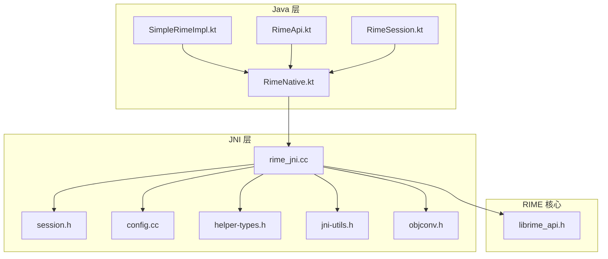
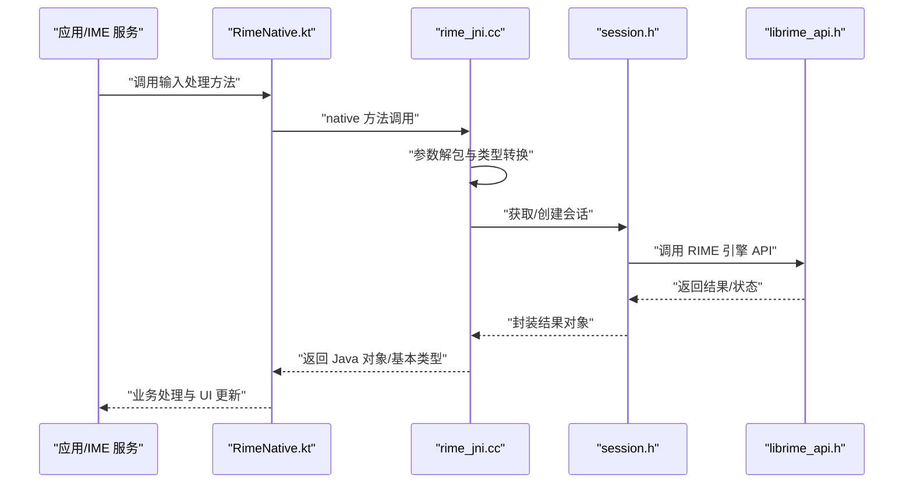
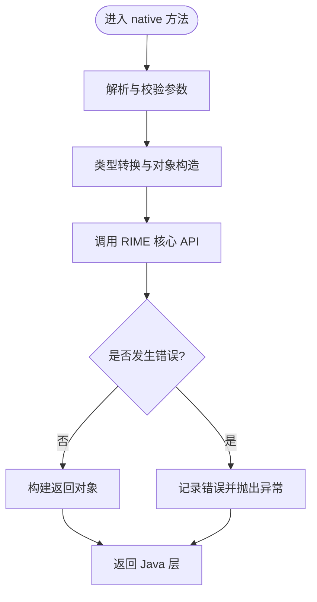
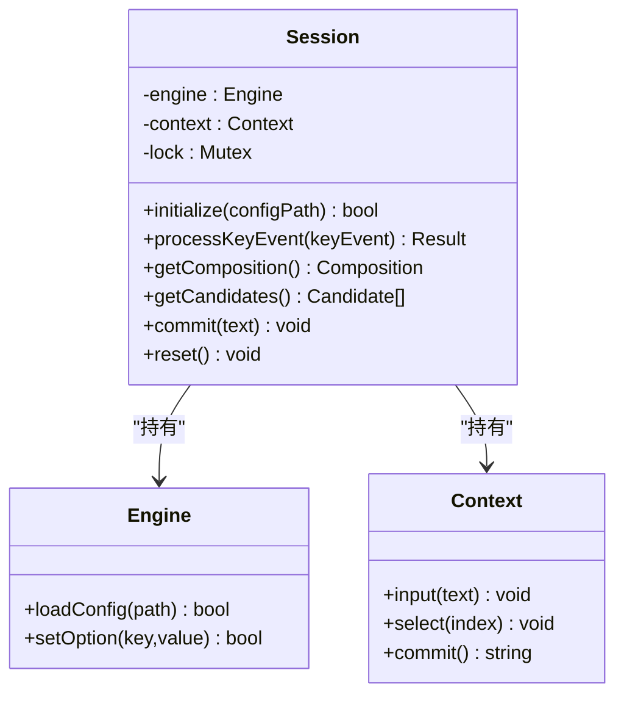
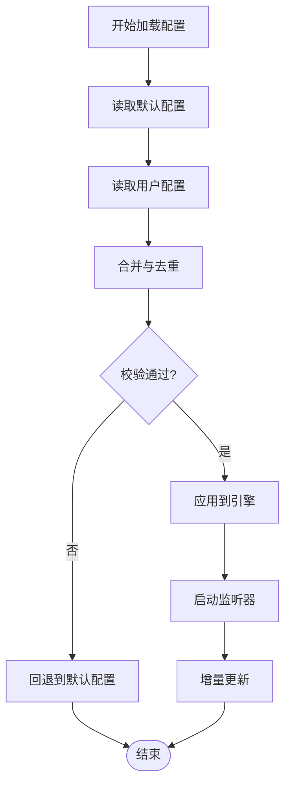
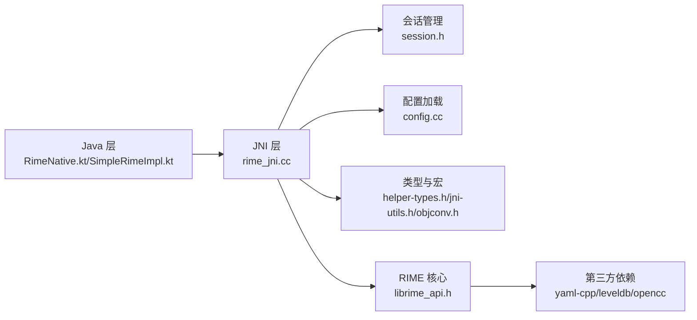

# JNI 原生代码

<cite>
**本文引用的文件**   
- [rime_jni.cc](file://app/src/main/jni/librime_jni/rime_jni.cc)
- [session.h](file://app/src/main/jni/librime_jni/session.h)
- [config.cc](file://app/src/main/jni/librime_jni/config.cc)
- [helper-types.h](file://app/src/main/jni/librime_jni/helper-types.h)
- [jni-utils.h](file://app/src/main/jni/librime_jni/jni-utils.h)
- [objconv.h](file://app/src/main/jni/librime_jni/objconv.h)
- [CMakeLists.txt](file://app/src/main/jni/librime_jni/CMakeLists.txt)
- [RimeNative.kt](file://app/src/main/java/com/ziyou/ime/core/RimeNative.kt)
- [SimpleRimeImpl.kt](file://app/src/main/java/com/ziyou/ime/core/SimpleRimeImpl.kt)
- [RimeApi.kt](file://app/src/main/java/com/ziyou/ime/core/RimeApi.kt)
- [RimeSession.kt](file://app/src/main/java/com/ziyou/ime/daemon/RimeSession.kt)
- [librime_api.h](file://librime-prebuilt/librime/src/rime_api.h)
- [CMakeLists.txt](file://librime-prebuilt/librime/CMakeLists.txt)
</cite>

## 目录
1. [简介](#简介)
2. [项目结构](#项目结构)
3. [核心组件](#核心组件)
4. [架构总览](#架构总览)
5. [详细组件分析](#详细组件分析)
6. [依赖关系分析](#依赖关系分析)
7. [性能考虑](#性能考虑)
8. [故障排查指南](#故障排查指南)
9. [结论](#结论)
10. [附录](#附录)

## 简介
本技术文档聚焦于 Android 输入法项目中与 RIME 引擎集成的 JNI 原生层，系统性解析 C++ 到 Java 的接口绑定、数据转换、会话管理、配置加载、类型定义与宏机制、构建配置与依赖管理、异常处理与错误码、性能优化与调试方法，以及与 RIME 核心库的集成方式和版本兼容性策略。读者无需深入底层即可理解整体设计，同时为进阶优化提供可操作的指导。

## 项目结构
JNI 原生代码位于 app/src/main/jni/librime_jni 目录，主要包含：
- rime_jni.cc：JNI 入口与方法绑定，负责 C++ 与 Java 之间的调用桥接与数据转换
- session.h：会话管理类，封装 RIME 引擎实例生命周期与线程安全访问
- config.cc：配置加载与解析逻辑，对接 RIME 配置系统
- helper-types.h：通用类型定义与宏展开机制，统一跨语言类型映射
- jni-utils.h / objconv.h：JNI 工具函数与对象转换辅助
- CMakeLists.txt：Android NDK 构建脚本，声明源文件、链接库与编译选项

Java 侧通过 RimeNative.kt 声明 native 方法，由 SimpleRimeImpl.kt 或 RimeApi.kt 进行封装调用；RimeSession.kt 在守护进程或后台服务中维护会话状态。

图表来源
- [rime_jni.cc](file://app/src/main/jni/librime_jni/rime_jni.cc)
- [session.h](file://app/src/main/jni/librime_jni/session.h)
- [config.cc](file://app/src/main/jni/librime_jni/config.cc)
- [helper-types.h](file://app/src/main/jni/librime_jni/helper-types.h)
- [jni-utils.h](file://app/src/main/jni/librime_jni/jni-utils.h)
- [objconv.h](file://app/src/main/jni/librime_jni/objconv.h)
- [RimeNative.kt](file://app/src/main/java/com/ziyou/ime/core/RimeNative.kt)
- [SimpleRimeImpl.kt](file://app/src/main/java/com/ziyou/ime/core/SimpleRimeImpl.kt)
- [RimeApi.kt](file://app/src/main/java/com/ziyou/ime/core/RimeApi.kt)
- [RimeSession.kt](file://app/src/main/java/com/ziyou/ime/daemon/RimeSession.kt)
- [librime_api.h](file://librime-prebuilt/librime/src/rime_api.h)

章节来源
- [rime_jni.cc](file://app/src/main/jni/librime_jni/rime_jni.cc)
- [session.h](file://app/src/main/jni/librime_jni/session.h)
- [config.cc](file://app/src/main/jni/librime_jni/config.cc)
- [helper-types.h](file://app/src/main/jni/librime_jni/helper-types.h)
- [jni-utils.h](file://app/src/main/jni/librime_jni/jni-utils.h)
- [objconv.h](file://app/src/main/jni/librime_jni/objconv.h)
- [CMakeLists.txt](file://app/src/main/jni/librime_jni/CMakeLists.txt)
- [RimeNative.kt](file://app/src/main/java/com/ziyou/ime/core/RimeNative.kt)
- [SimpleRimeImpl.kt](file://app/src/main/java/com/ziyou/ime/core/SimpleRimeImpl.kt)
- [RimeApi.kt](file://app/src/main/java/com/ziyou/ime/core/RimeApi.kt)
- [RimeSession.kt](file://app/src/main/java/com/ziyou/ime/daemon/RimeSession.kt)
- [librime_api.h](file://librime-prebuilt/librime/src/rime_api.h)

## 核心组件
- JNI 接口实现（rime_jni.cc）
  - 负责将 Java 方法签名映射到 C++ 函数，完成参数解包、类型转换、调用 RIME 核心 API、结果打包返回
  - 管理本地资源的生命周期，避免内存泄漏与悬挂指针
- 会话管理（session.h）
  - 封装 RIME Engine/Context 等对象的创建、销毁与线程安全访问
  - 提供统一的初始化、配置注入、输入处理与候选项输出接口
- 配置加载（config.cc）
  - 读取 YAML/文本配置，合并默认与用户配置，校验并应用到 RIME 引擎
  - 支持热更新与增量更新策略
- 类型与宏（helper-types.h, jni-utils.h, objconv.h）
  - 定义跨语言类型映射（如字符串、字节数组、布尔、数值）
  - 提供宏简化 JNI 调用样板代码，减少重复与出错概率
- 构建配置（CMakeLists.txt）
  - 指定源文件、头文件路径、NDK 目标 ABI、链接 librime 静态/动态库
  - 设置编译标志以启用优化与调试符号

章节来源
- [rime_jni.cc](file://app/src/main/jni/librime_jni/rime_jni.cc)
- [session.h](file://app/src/main/jni/librime_jni/session.h)
- [config.cc](file://app/src/main/jni/librime_jni/config.cc)
- [helper-types.h](file://app/src/main/jni/librime_jni/helper-types.h)
- [jni-utils.h](file://app/src/main/jni/librime_jni/jni-utils.h)
- [objconv.h](file://app/src/main/jni/librime_jni/objconv.h)
- [CMakeLists.txt](file://app/src/main/jni/librime_jni/CMakeLists.txt)

## 架构总览
下图展示从 Java 到 JNI 再到 RIME 核心的完整调用链，包括数据转换与错误传播路径。

图表来源
- [rime_jni.cc](file://app/src/main/jni/librime_jni/rime_jni.cc)
- [session.h](file://app/src/main/jni/librime_jni/session.h)
- [librime_api.h](file://librime-prebuilt/librime/src/rime_api.h)
- [RimeNative.kt](file://app/src/main/java/com/ziyou/ime/core/RimeNative.kt)

## 详细组件分析

### JNI 接口实现（rime_jni.cc）
- 方法绑定
  - 使用 JNI 注册表将 Java 方法名与 C++ 函数对应，确保签名一致
  - 对复杂对象采用局部引用与全局引用管理，避免 GC 回收导致的悬挂指针
- 数据转换
  - 字符串：UTF-8/UTF-16 双向转换，注意编码与长度边界
  - 字节数组：直接传递或拷贝，避免不必要的分配
  - 集合/列表：按需转换为 C++ 容器，批量处理减少 JNI 往返
- 错误处理
  - 捕获异常并抛出 Java 异常，保证上层可感知
  - 记录关键错误码与上下文信息，便于定位问题

图表来源
- [rime_jni.cc](file://app/src/main/jni/librime_jni/rime_jni.cc)

章节来源
- [rime_jni.cc](file://app/src/main/jni/librime_jni/rime_jni.cc)

### 会话管理（session.h）
- 设计要点
  - 单例或多实例模式：根据 IME 需求选择共享或隔离会话
  - 线程安全：读写锁或原子操作保护共享状态
  - 生命周期：显式初始化与清理，避免资源泄露
- 内存管理
  - 使用智能指针或 RAII 管理内部对象
  - 缓存热点数据（如候选项、上下文），控制大小上限
- 对外接口
  - 初始化：加载配置、插件、词典
  - 输入处理：接收键值事件，生成预编辑串与候选项
  - 提交与撤销：支持回滚与历史管理

图表来源
- [session.h](file://app/src/main/jni/librime_jni/session.h)

章节来源
- [session.h](file://app/src/main/jni/librime_jni/session.h)

### 配置加载（config.cc）
- 加载流程
  - 读取默认配置与用户覆盖配置，按优先级合并
  - 校验关键字段与依赖关系，失败时回退到默认值
  - 应用配置到 RIME 引擎，必要时触发重建
- 热更新
  - 监听配置文件变更，增量更新受影响模块
  - 异步加载与切换，避免阻塞主线程
- 错误处理
  - 记录解析错误位置与原因，提供友好提示
  - 支持降级策略与回滚机制

图表来源
- [config.cc](file://app/src/main/jni/librime_jni/config.cc)

章节来源
- [config.cc](file://app/src/main/jni/librime_jni/config.cc)

### 类型与宏（helper-types.h, jni-utils.h, objconv.h）
- 类型定义
  - 统一字符串、数值、布尔类型的跨语言表示
  - 定义枚举与结构体，确保布局一致
- 宏机制
  - 简化 JNI 方法注册与参数提取
  - 封装常见转换逻辑，减少样板代码
- 对象转换
  - 提供 C++ 到 Java 对象的双向转换工具
  - 处理集合、嵌套对象与循环引用

章节来源
- [helper-types.h](file://app/src/main/jni/librime_jni/helper-types.h)
- [jni-utils.h](file://app/src/main/jni/librime_jni/jni-utils.h)
- [objconv.h](file://app/src/main/jni/librime_jni/objconv.h)

### 构建配置与依赖管理（CMakeLists.txt）
- 源文件与头文件
  - 明确列出所有 .cc/.h 文件，确保编译完整性
  - 指定 include 路径，避免相对路径歧义
- 依赖库
  - 链接 librime 静态库或动态库，设置搜索路径
  - 引入第三方库（如 yaml-cpp、leveldb、opencc）
- 编译选项
  - 启用优化（-O2/-O3）、调试符号（-g）、警告（-Wall）
  - 针对 ARM/x86 架构设置 ABI 与特性

章节来源
- [CMakeLists.txt](file://app/src/main/jni/librime_jni/CMakeLists.txt)
- [CMakeLists.txt](file://librime-prebuilt/librime/CMakeLists.txt)

## 依赖关系分析
JNI 层依赖 RIME 核心库与若干第三方组件，Java 层通过 JNI 暴露稳定接口。

图表来源
- [rime_jni.cc](file://app/src/main/jni/librime_jni/rime_jni.cc)
- [session.h](file://app/src/main/jni/librime_jni/session.h)
- [config.cc](file://app/src/main/jni/librime_jni/config.cc)
- [helper-types.h](file://app/src/main/jni/librime_jni/helper-types.h)
- [jni-utils.h](file://app/src/main/jni/librime_jni/jni-utils.h)
- [objconv.h](file://app/src/main/jni/librime_jni/objconv.h)
- [librime_api.h](file://librime-prebuilt/librime/src/rime_api.h)

章节来源
- [rime_jni.cc](file://app/src/main/jni/librime_jni/rime_jni.cc)
- [session.h](file://app/src/main/jni/librime_jni/session.h)
- [config.cc](file://app/src/main/jni/librime_jni/config.cc)
- [helper-types.h](file://app/src/main/jni/librime_jni/helper-types.h)
- [jni-utils.h](file://app/src/main/jni/librime_jni/jni-utils.h)
- [objconv.h](file://app/src/main/jni/librime_jni/objconv.h)
- [librime_api.h](file://librime-prebuilt/librime/src/rime_api.h)

## 性能考虑
- 内存管理
  - 避免频繁分配与释放，使用对象池或缓存
  - 合理使用局部引用与全局引用，减少 GC 压力
- 数据转换
  - 批量处理字符串与字节数组，减少 JNI 往返次数
  - 使用零拷贝策略，直接访问底层缓冲区
- 并发与同步
  - 细粒度锁，避免长临界区
  - 读写分离，提升并发吞吐
- 构建优化
  - 启用 LTO 与 Link-Time Optimization
  - 针对不同 ABI 裁剪无用符号

[本节为通用性能建议，不直接分析具体文件]

## 故障排查指南
- 常见问题
  - JNI 签名不匹配：检查方法名与参数类型
  - 内存泄漏：使用 LeakCanary 或 Valgrind 检测
  - 崩溃与异常：查看日志堆栈与错误码
- 调试技巧
  - 启用调试符号，使用 ndk-stack 解析崩溃
  - 添加关键路径日志，记录输入与输出
  - 使用 perf 或 Android Studio Profiler 分析性能瓶颈
- 错误码定义
  - 统一错误码命名与范围，便于分类处理
  - 提供错误描述与修复建议

章节来源
- [rime_jni.cc](file://app/src/main/jni/librime_jni/rime_jni.cc)
- [session.h](file://app/src/main/jni/librime_jni/session.h)
- [config.cc](file://app/src/main/jni/librime_jni/config.cc)

## 结论
本技术文档系统梳理了 JNI 原生代码的设计与实现，涵盖接口绑定、会话管理、配置加载、类型定义、构建配置、异常处理与性能优化等方面。通过清晰的架构图与流程图，帮助开发者快速理解整体设计与细节实现，并为后续扩展与维护提供可靠依据。

[本节为总结性内容，不直接分析具体文件]

## 附录
- C++ 编写规范与最佳实践
  - 遵循 RAII 原则，自动管理资源
  - 使用智能指针与容器，避免裸指针
  - 统一错误处理与日志记录
- 与 RIME 核心库集成与版本兼容
  - 锁定 librime 版本，避免 API 漂移
  - 提供适配层，屏蔽版本差异
  - 定期升级与回归测试

[本节为补充说明，不直接分析具体文件]