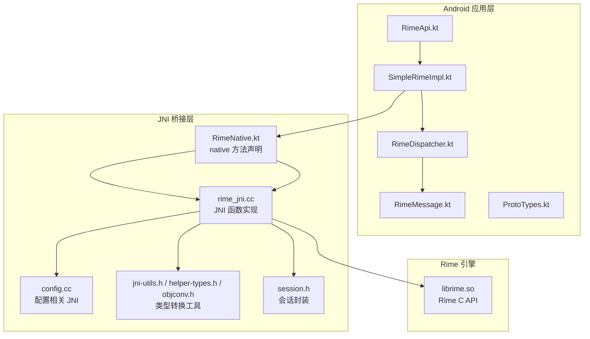
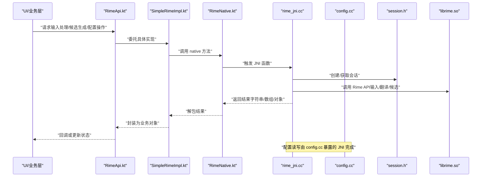
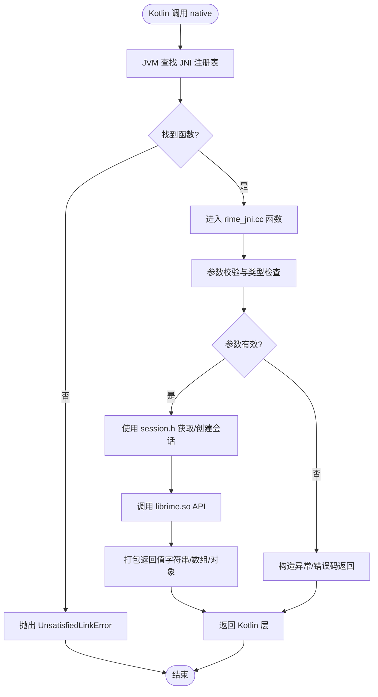
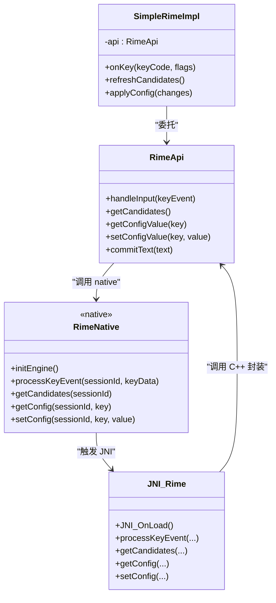
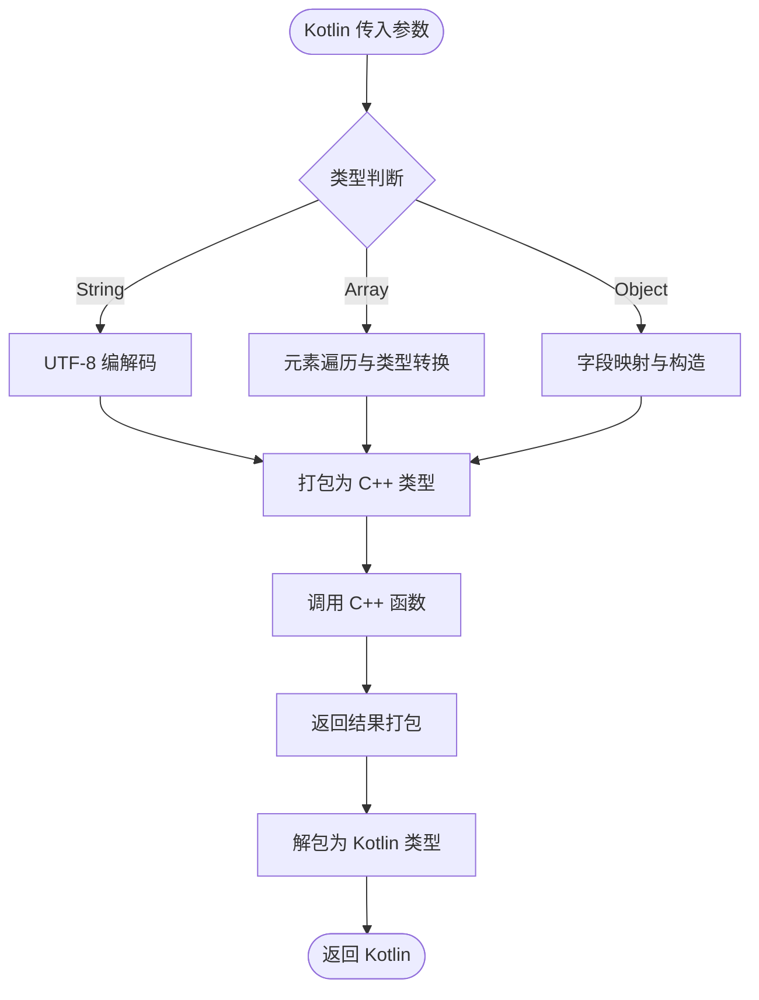
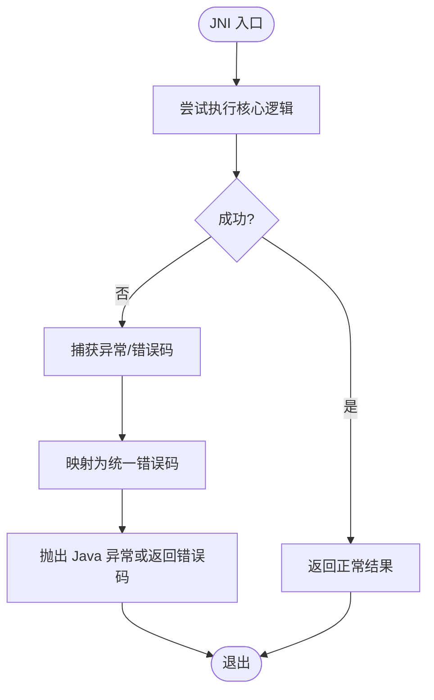
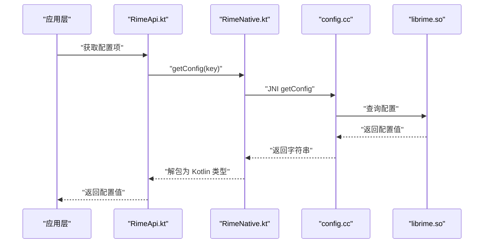
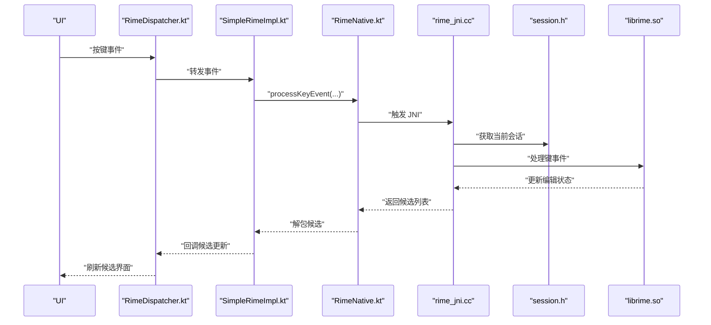
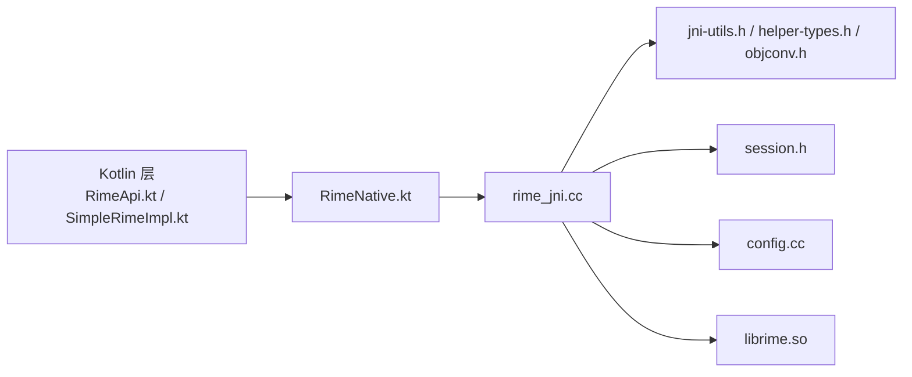

# JNI 接口实现

<cite>
**本文引用的文件**   
- [rime_jni.cc](file://app/src/main/jni/librime_jni/rime_jni.cc)
- [config.cc](file://app/src/main/jni/librime_jni/config.cc)
- [jni-utils.h](file://app/src/main/jni/librime_jni/jni-utils.h)
- [helper-types.h](file://app/src/main/jni/librime_jni/helper-types.h)
- [objconv.h](file://app/src/main/jni/librime_jni/objconv.h)
- [session.h](file://app/src/main/jni/librime_jni/session.h)
- [CMakeLists.txt](file://app/src/main/jni/librime_jni/CMakeLists.txt)
- [RimeNative.kt](file://app/src/main/java/com/ziyou/ime/core/RimeNative.kt)
- [RimeApi.kt](file://app/src/main/java/com/ziyou/ime/core/RimeApi.kt)
- [SimpleRimeImpl.kt](file://app/src/main/java/com/ziyou/ime/core/SimpleRimeImpl.kt)
- [RimeDispatcher.kt](file://app/src/main/java/com/ziyou/ime/core/RimeDispatcher.kt)
- [RimeMessage.kt](file://app/src/main/java/com/ziyou/ime/core/RimeMessage.kt)
- [ProtoTypes.kt](file://app/src/main/java/com/ziyou/ime/core/ProtoTypes.kt)
</cite>

## 目录
1. [简介](#简介)
2. [项目结构](#项目结构)
3. [核心组件](#核心组件)
4. [架构总览](#架构总览)
5. [详细组件分析](#详细组件分析)
6. [依赖关系分析](#依赖关系分析)
7. [性能考虑](#性能考虑)
8. [故障排查指南](#故障排查指南)
9. [结论](#结论)
10. [附录](#附录)

## 简介
本技术文档聚焦于 Rime 输入法在 Android 端的 JNI 接口实现，围绕 C++ 与 Java/Kotlin 之间的方法绑定、数据类型转换、异常处理策略、内存管理以及性能优化展开。重点解析 rime_jni.cc 中的 JNI 函数注册与调用流程，说明 RimeApi 的 C++ 封装如何映射到输入处理、候选词生成、配置管理等核心能力，并提供调试方法与常见问题解决方案。

## 项目结构
Android 端通过 jni 模块暴露 native 接口，Java/Kotlin 层以声明式方式定义 native 方法并调用底层 C++ 实现。关键目录与文件：
- app/src/main/jni/librime_jni：JNI 桥接代码（C++），包含 JNI 函数、类型转换工具、会话与配置封装等
- app/src/main/java/com/ziyou/ime/core：Kotlin 侧对 Rime 引擎的抽象与调度，包括原生方法声明、API 封装、消息分发等
- app/src/main/assets/rime：Rime 资源与配置文件（schema/dict/default.yaml）

图表来源
- [RimeNative.kt](file://app/src/main/java/com/ziyou/ime/core/RimeNative.kt)
- [rime_jni.cc](file://app/src/main/jni/librime_jni/rime_jni.cc)
- [config.cc](file://app/src/main/jni/librime_jni/config.cc)
- [jni-utils.h](file://app/src/main/jni/librime_jni/jni-utils.h)
- [helper-types.h](file://app/src/main/jni/librime_jni/helper-types.h)
- [objconv.h](file://app/src/main/jni/librime_jni/objconv.h)
- [session.h](file://app/src/main/jni/librime_jni/session.h)

章节来源
- [CMakeLists.txt](file://app/src/main/jni/librime_jni/CMakeLists.txt)

## 核心组件
- JNI 入口与函数注册：rime_jni.cc 负责将 C++ 函数导出为 JNI 方法，供 Kotlin 层通过 RimeNative.kt 调用
- 类型转换工具：jni-utils.h、helper-types.h、objconv.h 提供字符串、数组、对象在 C++ 与 Java 之间的双向转换
- 会话与状态：session.h 封装 Rime 会话生命周期与上下文
- 配置管理：config.cc 暴露配置读取/写入的 JNI 接口
- Kotlin 侧封装：RimeApi.kt、SimpleRimeImpl.kt、RimeDispatcher.kt、RimeMessage.kt、ProtoTypes.kt 组织输入事件、候选结果与配置操作

章节来源
- [rime_jni.cc](file://app/src/main/jni/librime_jni/rime_jni.cc)
- [jni-utils.h](file://app/src/main/jni/librime_jni/jni-utils.h)
- [helper-types.h](file://app/src/main/jni/librime_jni/helper-types.h)
- [objconv.h](file://app/src/main/jni/librime_jni/objconv.h)
- [session.h](file://app/src/main/jni/librime_jni/session.h)
- [config.cc](file://app/src/main/jni/librime_jni/config.cc)
- [RimeNative.kt](file://app/src/main/java/com/ziyou/ime/core/RimeNative.kt)
- [RimeApi.kt](file://app/src/main/java/com/ziyou/ime/core/RimeApi.kt)
- [SimpleRimeImpl.kt](file://app/src/main/java/com/ziyou/ime/core/SimpleRimeImpl.kt)
- [RimeDispatcher.kt](file://app/src/main/java/com/ziyou/ime/core/RimeDispatcher.kt)
- [RimeMessage.kt](file://app/src/main/java/com/ziyou/ime/core/RimeMessage.kt)
- [ProtoTypes.kt](file://app/src/main/java/com/ziyou/ime/core/ProtoTypes.kt)

## 架构总览
整体调用链从 Kotlin 发起，经 JNI 进入 C++，再调用 Rime 引擎 API，返回结果后逐层回传至 UI。

图表来源
- [RimeApi.kt](file://app/src/main/java/com/ziyou/ime/core/RimeApi.kt)
- [SimpleRimeImpl.kt](file://app/src/main/java/com/ziyou/ime/core/SimpleRimeImpl.kt)
- [RimeNative.kt](file://app/src/main/java/com/ziyou/ime/core/RimeNative.kt)
- [rime_jni.cc](file://app/src/main/jni/librime_jni/rime_jni.cc)
- [config.cc](file://app/src/main/jni/librime_jni/config.cc)
- [session.h](file://app/src/main/jni/librime_jni/session.h)

## 详细组件分析

### JNI 函数注册与调用流程
- 注册机制：rime_jni.cc 中集中定义 JNI 函数名与对应 C++ 实现，并通过 JNI_OnLoad 或等效机制完成方法表注册，使 Kotlin 层的 native 声明能够正确绑定到 C++ 函数
- 调用路径：Kotlin 声明 native 方法（RimeNative.kt）→ JVM 查找已注册的 JNI 函数 → 进入 rime_jni.cc 的实现 → 调用 session.h 封装的 Rime 会话 → 调用 librime.so 的 C API → 返回数据并逐层解包

图表来源
- [rime_jni.cc](file://app/src/main/jni/librime_jni/rime_jni.cc)
- [session.h](file://app/src/main/jni/librime_jni/session.h)

章节来源
- [rime_jni.cc](file://app/src/main/jni/librime_jni/rime_jni.cc)
- [RimeNative.kt](file://app/src/main/java/com/ziyou/ime/core/RimeNative.kt)

### RimeApi 的 C++ 封装与 JNI 映射
- 输入处理：通过 JNI 将按键事件转换为 Rime 可识别的键值序列，调用编辑器进行分词与拼写
- 候选词生成：调用翻译器与过滤器管线，收集候选项并格式化输出
- 配置管理：读取/修改 default.yaml 及 schema 配置，支持动态切换方案与用户自定义

图表来源
- [RimeApi.kt](file://app/src/main/java/com/ziyou/ime/core/RimeApi.kt)
- [SimpleRimeImpl.kt](file://app/src/main/java/com/ziyou/ime/core/SimpleRimeImpl.kt)
- [RimeNative.kt](file://app/src/main/java/com/ziyou/ime/core/RimeNative.kt)
- [rime_jni.cc](file://app/src/main/jni/librime_jni/rime_jni.cc)

章节来源
- [RimeApi.kt](file://app/src/main/java/com/ziyou/ime/core/RimeApi.kt)
- [SimpleRimeImpl.kt](file://app/src/main/java/com/ziyou/ime/core/SimpleRimeImpl.kt)
- [RimeNative.kt](file://app/src/main/java/com/ziyou/ime/core/RimeNative.kt)
- [rime_jni.cc](file://app/src/main/jni/librime_jni/rime_jni.cc)

### 数据类型转换机制（字符串、数组、对象）
- 字符串：UTF-8 编码的双向转换，避免重复分配；必要时使用局部引用缓存
- 数组：整型/浮点型数组直接映射，字符串数组需逐项转换；注意长度与边界检查
- 对象：通过类描述符与方法 ID 缓存减少反射开销；谨慎处理生命周期，避免悬挂引用

图表来源
- [jni-utils.h](file://app/src/main/jni/librime_jni/jni-utils.h)
- [helper-types.h](file://app/src/main/jni/librime_jni/helper-types.h)
- [objconv.h](file://app/src/main/jni/librime_jni/objconv.h)

章节来源
- [jni-utils.h](file://app/src/main/jni/librime_jni/jni-utils.h)
- [helper-types.h](file://app/src/main/jni/librime_jni/helper-types.h)
- [objconv.h](file://app/src/main/jni/librime_jni/objconv.h)

### 异常处理策略与错误码定义
- JNI 层：捕获底层异常并转换为 Java 异常或返回错误码；确保异常状态被清除后再返回
- 错误码：定义统一的错误码枚举，便于上层区分初始化失败、参数非法、引擎内部错误等
- 日志：结合 glog 或系统日志输出关键路径信息，辅助定位问题

图表来源
- [rime_jni.cc](file://app/src/main/jni/librime_jni/rime_jni.cc)

章节来源
- [rime_jni.cc](file://app/src/main/jni/librime_jni/rime_jni.cc)

### 配置管理 JNI 映射
- 读取配置：通过 config.cc 暴露的 JNI 接口读取 default.yaml 与 schema 配置
- 写入配置：支持动态修改开关项，如候选数量、字体大小等
- 热重载：在安全时机触发配置重新加载，避免阻塞主线程

图表来源
- [config.cc](file://app/src/main/jni/librime_jni/config.cc)
- [RimeNative.kt](file://app/src/main/java/com/ziyou/ime/core/RimeNative.kt)
- [RimeApi.kt](file://app/src/main/java/com/ziyou/ime/core/RimeApi.kt)

章节来源
- [config.cc](file://app/src/main/jni/librime_jni/config.cc)
- [RimeNative.kt](file://app/src/main/java/com/ziyou/ime/core/RimeNative.kt)
- [RimeApi.kt](file://app/src/main/java/com/ziyou/ime/core/RimeApi.kt)

### 输入处理与候选词生成流程
- 输入处理：将键盘事件转换为 Rime 键序列，驱动编辑器状态机
- 候选生成：经过翻译器与过滤器，生成候选列表并排序
- 提交文本：确认候选后提交到输入框

图表来源
- [RimeDispatcher.kt](file://app/src/main/java/com/ziyou/ime/core/RimeDispatcher.kt)
- [SimpleRimeImpl.kt](file://app/src/main/java/com/ziyou/ime/core/SimpleRimeImpl.kt)
- [RimeNative.kt](file://app/src/main/java/com/ziyou/ime/core/RimeNative.kt)
- [rime_jni.cc](file://app/src/main/jni/librime_jni/rime_jni.cc)
- [session.h](file://app/src/main/jni/librime_jni/session.h)

章节来源
- [RimeDispatcher.kt](file://app/src/main/java/com/ziyou/ime/core/RimeDispatcher.kt)
- [SimpleRimeImpl.kt](file://app/src/main/java/com/ziyou/ime/core/SimpleRimeImpl.kt)
- [RimeNative.kt](file://app/src/main/java/com/ziyou/ime/core/RimeNative.kt)
- [rime_jni.cc](file://app/src/main/jni/librime_jni/rime_jni.cc)
- [session.h](file://app/src/main/jni/librime_jni/session.h)

### 数据结构与复杂度分析
- 候选列表：通常为链表或向量，按权重排序；时间复杂度 O(n log n) 取决于排序算法
- 配置项：键值对结构，访问复杂度 O(1)；批量更新时注意事务性
- 字符串转换：UTF-8 编解码线性复杂度 O(n)，应避免频繁重复转换

章节来源
- [RimeMessage.kt](file://app/src/main/java/com/ziyou/ime/core/RimeMessage.kt)
- [ProtoTypes.kt](file://app/src/main/java/com/ziyou/ime/core/ProtoTypes.kt)

## 依赖关系分析
- Kotlin 层依赖 JNI 声明（RimeNative.kt）
- JNI 层依赖类型转换工具（jni-utils.h、helper-types.h、objconv.h）与会话封装（session.h）
- 配置管理由 config.cc 提供
- 最终调用 librime.so 的核心功能

图表来源
- [RimeApi.kt](file://app/src/main/java/com/ziyou/ime/core/RimeApi.kt)
- [SimpleRimeImpl.kt](file://app/src/main/java/com/ziyou/ime/core/SimpleRimeImpl.kt)
- [RimeNative.kt](file://app/src/main/java/com/ziyou/ime/core/RimeNative.kt)
- [rime_jni.cc](file://app/src/main/jni/librime_jni/rime_jni.cc)
- [jni-utils.h](file://app/src/main/jni/librime_jni/jni-utils.h)
- [helper-types.h](file://app/src/main/jni/librime_jni/helper-types.h)
- [objconv.h](file://app/src/main/jni/librime_jni/objconv.h)
- [session.h](file://app/src/main/jni/librime_jni/session.h)
- [config.cc](file://app/src/main/jni/librime_jni/config.cc)

章节来源
- [RimeApi.kt](file://app/src/main/java/com/ziyou/ime/core/RimeApi.kt)
- [SimpleRimeImpl.kt](file://app/src/main/java/com/ziyou/ime/core/SimpleRimeImpl.kt)
- [RimeNative.kt](file://app/src/main/java/com/ziyou/ime/core/RimeNative.kt)
- [rime_jni.cc](file://app/src/main/jni/librime_jni/rime_jni.cc)
- [jni-utils.h](file://app/src/main/jni/librime_jni/jni-utils.h)
- [helper-types.h](file://app/src/main/jni/librime_jni/helper-types.h)
- [objconv.h](file://app/src/main/jni/librime_jni/objconv.h)
- [session.h](file://app/src/main/jni/librime_jni/session.h)
- [config.cc](file://app/src/main/jni/librime_jni/config.cc)

## 性能考虑
- 减少 JNI 往返：批量处理输入事件，合并多次调用
- 缓存方法 ID 与类描述符：避免重复反射开销
- 控制字符串分配：复用缓冲区，避免频繁 GC
- 异步化耗时操作：配置重载、候选计算放在后台线程
- 合理选择数据结构：优先使用连续内存结构提升缓存命中率

[本节为通用指导，不直接分析具体文件]

## 故障排查指南
- 常见问题
  - UnsatisfiedLinkError：检查 so 库是否加载成功，ABI 是否匹配
  - 崩溃或空指针：检查 JNI 参数校验与返回值有效性
  - 候选不显示：确认 schema 与字典资源部署正确
  - 配置未生效：验证配置路径与权限，确保热重载触发
- 调试方法
  - 启用 glog 日志，定位 JNI 调用路径
  - 使用 adb logcat 过滤关键字段
  - 在 JNI 层打印关键变量与状态
  - 逐步缩小范围，隔离问题模块

章节来源
- [rime_jni.cc](file://app/src/main/jni/librime_jni/rime_jni.cc)
- [config.cc](file://app/src/main/jni/librime_jni/config.cc)

## 结论
本实现通过清晰的 JNI 分层与类型转换工具，将 Rime 引擎能力稳定地暴露给 Android 应用层。合理的异常处理、错误码设计与内存管理策略保障了稳定性与性能。建议在生产环境中持续监控日志与性能指标，结合用户反馈迭代优化。

[本节为总结，不直接分析具体文件]

## 附录
- 示例调用路径参考
  - 输入处理：[RimeDispatcher.kt](file://app/src/main/java/com/ziyou/ime/core/RimeDispatcher.kt) → [SimpleRimeImpl.kt](file://app/src/main/java/com/ziyou/ime/core/SimpleRimeImpl.kt) → [RimeNative.kt](file://app/src/main/java/com/ziyou/ime/core/RimeNative.kt) → [rime_jni.cc](file://app/src/main/jni/librime_jni/rime_jni.cc)
  - 候选生成：同上路径，关注候选列表返回与解包
  - 配置管理：[RimeApi.kt](file://app/src/main/java/com/ziyou/ime/core/RimeApi.kt) → [RimeNative.kt](file://app/src/main/java/com/ziyou/ime/core/RimeNative.kt) → [config.cc](file://app/src/main/jni/librime_jni/config.cc)

[本节为附录，不直接分析具体文件]