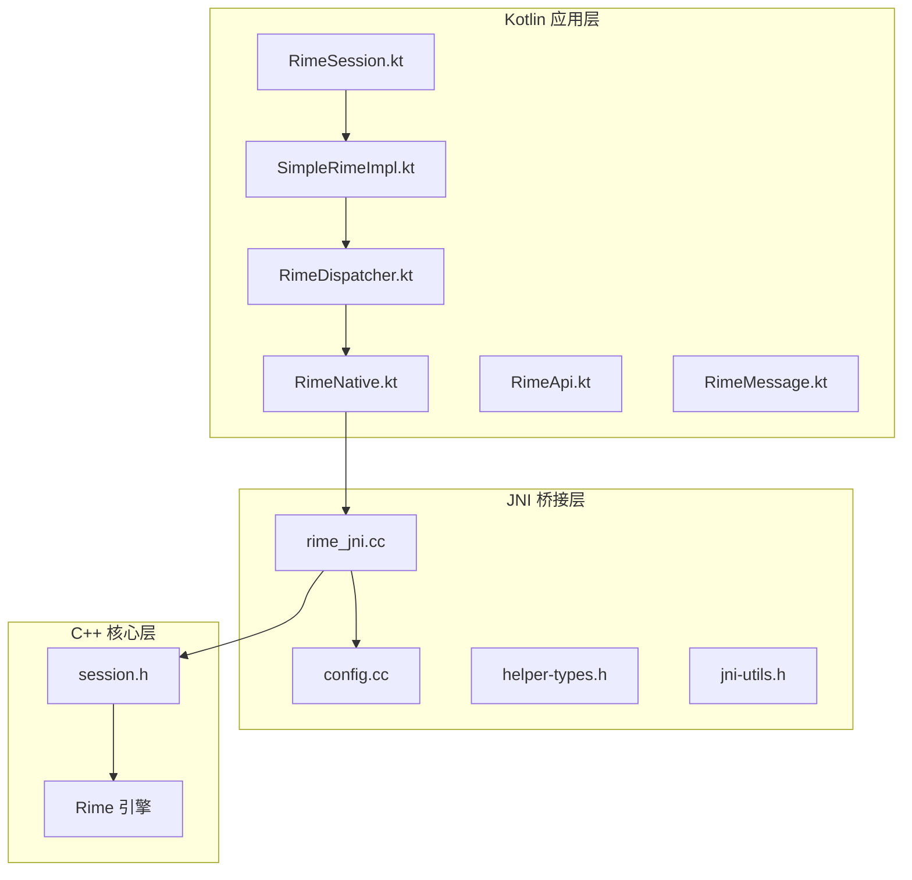
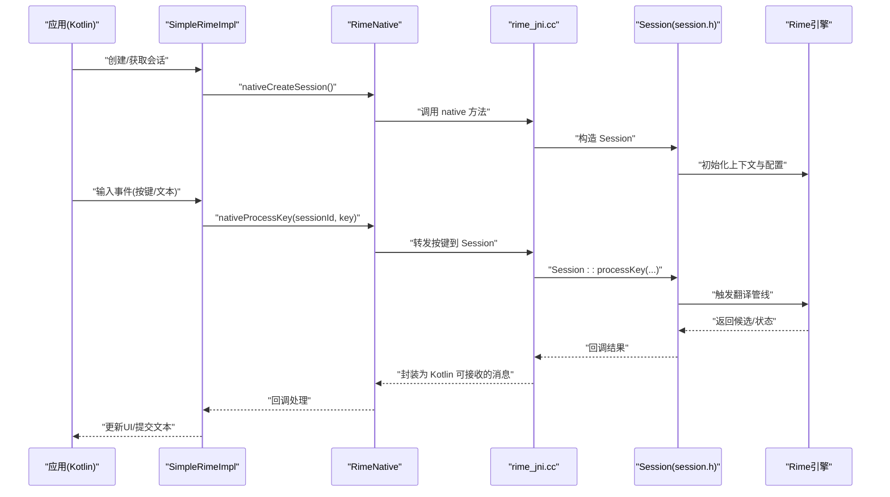
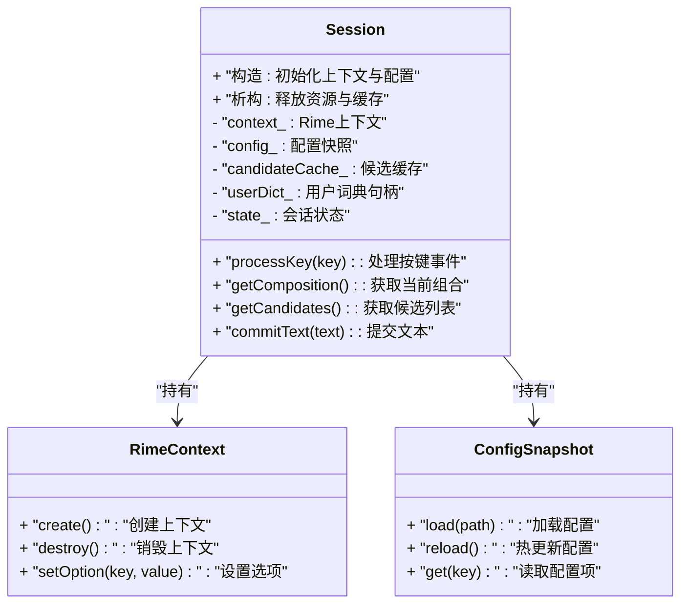
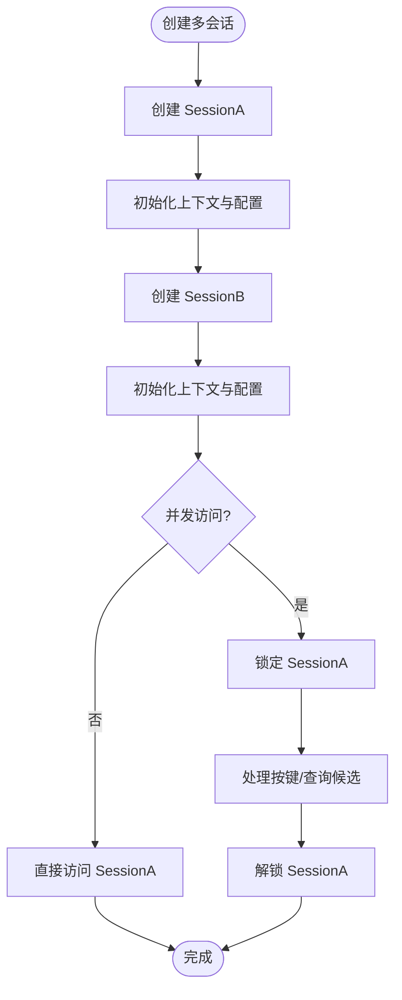
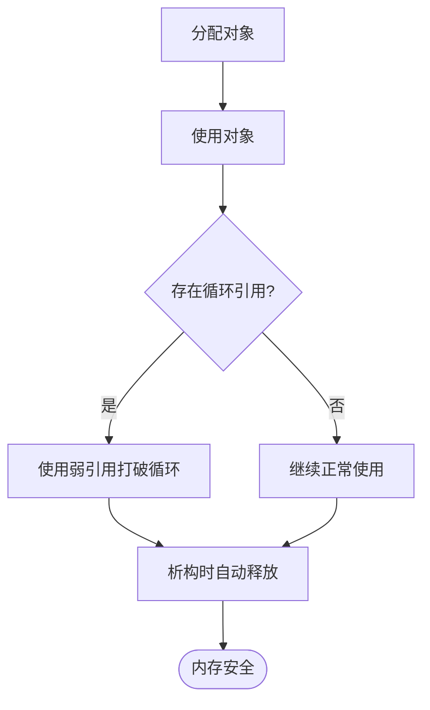
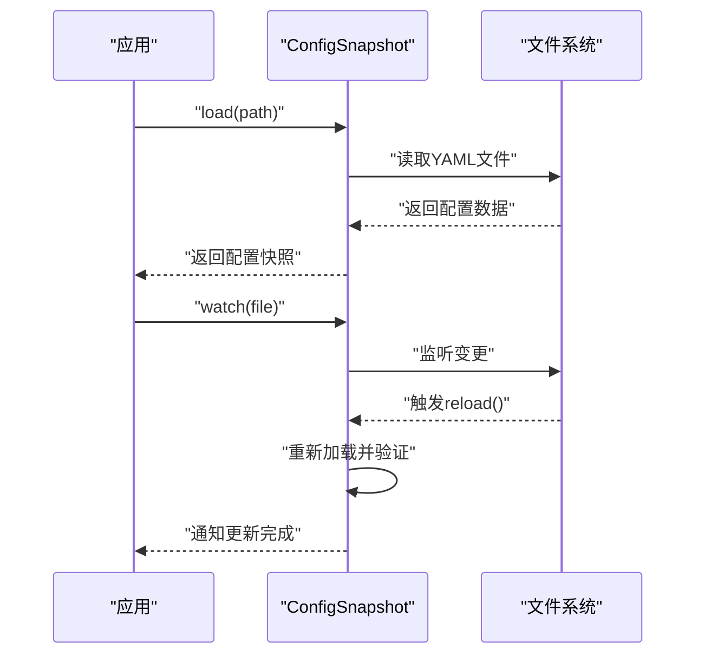
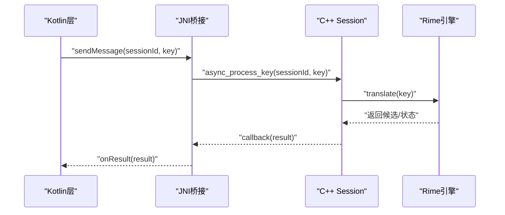
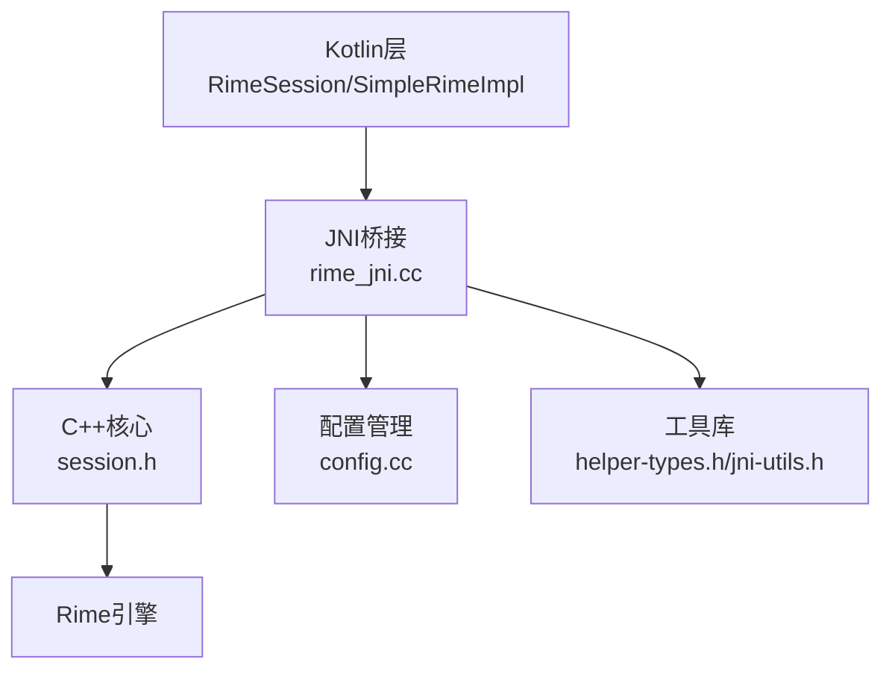

# 会话管理

<cite>
**本文引用的文件**   
- [session.h](file://app/src/main/jni/librime_jni/session.h)
- [rime_jni.cc](file://app/src/main/jni/librime_jni/rime_jni.cc)
- [config.cc](file://app/src/main/jni/librime_jni/config.cc)
- [RimeSession.kt](file://app/src/main/java/com/ziyou/ime/daemon/RimeSession.kt)
- [SimpleRimeImpl.kt](file://app/src/main/java/com/ziyou/ime/core/SimpleRimeImpl.kt)
- [RimeDispatcher.kt](file://app/src/main/java/com/ziyou/ime/core/RimeDispatcher.kt)
- [RimeNative.kt](file://app/src/main/java/com/ziyou/ime/core/RimeNative.kt)
- [RimeApi.kt](file://app/src/main/java/com/ziyou/ime/core/RimeApi.kt)
- [RimeMessage.kt](file://app/src/main/java/com/ziyou/ime/core/RimeMessage.kt)
- [helper-types.h](file://app/src/main/jni/librime_jni/helper-types.h)
- [jni-utils.h](file://app/src/main/jni/librime_jni/jni-utils.h)
</cite>

## 目录
1. [简介](#简介)
2. [项目结构](#项目结构)
3. [核心组件](#核心组件)
4. [架构总览](#架构总览)
5. [详细组件分析](#详细组件分析)
6. [依赖分析](#依赖分析)
7. [性能考虑](#性能考虑)
8. [故障排除指南](#故障排除指南)
9. [结论](#结论)
10. [附录](#附录)

## 简介
本技术文档围绕输入法项目的“会话管理系统”展开，重点解析 C++ 层 session.h 中的 Session 类设计与实现，涵盖生命周期管理、状态维护、多会话支持（隔离、资源分配、并发控制）、内存管理策略（智能指针与循环引用避免）、配置加载与热更新机制，以及与 Rime 引擎的交互模式（异步操作与回调处理）。同时提供会话监控与调试工具使用方法、性能调优建议与故障排除指南，帮助开发者快速定位问题并优化系统表现。

## 项目结构
本项目采用 Kotlin + JNI + C++ 的分层架构：
- Kotlin 应用层负责 UI、输入事件分发、消息封装与调度。
- JNI 桥接层将 Kotlin 调用转换为 C++ 调用，管理本地会话对象与资源。
- C++ 层基于 Rime 引擎，封装 Session 等核心对象，提供稳定的 API。

图表来源 
- [RimeSession.kt](file://app/src/main/java/com/ziyou/ime/daemon/RimeSession.kt)
- [SimpleRimeImpl.kt](file://app/src/main/java/com/ziyou/ime/core/SimpleRimeImpl.kt)
- [RimeDispatcher.kt](file://app/src/main/java/com/ziyou/ime/core/RimeDispatcher.kt)
- [RimeNative.kt](file://app/src/main/java/com/ziyou/ime/core/RimeNative.kt)
- [RimeApi.kt](file://app/src/main/java/com/ziyou/ime/core/RimeApi.kt)
- [RimeMessage.kt](file://app/src/main/java/com/ziyou/ime/core/RimeMessage.kt)
- [rime_jni.cc](file://app/src/main/jni/librime_jni/rime_jni.cc)
- [config.cc](file://app/src/main/jni/librime_jni/config.cc)
- [helper-types.h](file://app/src/main/jni/librime_jni/helper-types.h)
- [jni-utils.h](file://app/src/main/jni/librime_jni/jni-utils.h)
- [session.h](file://app/src/main/jni/librime_jni/session.h)

章节来源
- [RimeSession.kt](file://app/src/main/java/com/ziyou/ime/daemon/RimeSession.kt)
- [SimpleRimeImpl.kt](file://app/src/main/java/com/ziyou/ime/core/SimpleRimeImpl.kt)
- [RimeDispatcher.kt](file://app/src/main/java/com/ziyou/ime/core/RimeDispatcher.kt)
- [RimeNative.kt](file://app/src/main/java/com/ziyou/ime/core/RimeNative.kt)
- [RimeApi.kt](file://app/src/main/java/com/ziyou/ime/core/RimeApi.kt)
- [RimeMessage.kt](file://app/src/main/java/com/ziyou/ime/core/RimeMessage.kt)
- [rime_jni.cc](file://app/src/main/jni/librime_jni/rime_jni.cc)
- [config.cc](file://app/src/main/jni/librime_jni/config.cc)
- [helper-types.h](file://app/src/main/jni/librime_jni/helper-types.h)
- [jni-utils.h](file://app/src/main/jni/librime_jni/jni-utils.h)
- [session.h](file://app/src/main/jni/librime_jni/session.h)

## 核心组件
- Session 类（C++）：封装一次完整的输入会话，包含上下文状态、候选词缓存、用户词典访问、配置快照等。负责生命周期管理（创建、初始化、销毁）和状态维护（编辑中、已提交、错误等）。
- JNI 桥接（rime_jni.cc）：暴露 Java/Kotlin 可调用的 native 方法，负责会话对象的创建、销毁、消息转发与回调。
- Kotlin 会话封装（RimeSession.kt / SimpleRimeImpl.kt）：对外提供高层 API，管理多个会话实例，处理线程切换与异步回调。
- 配置管理（config.cc）：加载与热更新 Rime 配置，确保会话间配置隔离与一致性。
- 辅助类型与工具（helper-types.h / jni-utils.h）：定义跨语言数据结构与通用工具函数。

章节来源
- [session.h](file://app/src/main/jni/librime_jni/session.h)
- [rime_jni.cc](file://app/src/main/jni/librime_jni/rime_jni.cc)
- [config.cc](file://app/src/main/jni/librime_jni/config.cc)
- [RimeSession.kt](file://app/src/main/java/com/ziyou/ime/daemon/RimeSession.kt)
- [SimpleRimeImpl.kt](file://app/src/main/java/com/ziyou/ime/core/SimpleRimeImpl.kt)
- [helper-types.h](file://app/src/main/jni/librime_jni/helper-types.h)
- [jni-utils.h](file://app/src/main/jni/librime_jni/jni-utils.h)

## 架构总览
下图展示从 Kotlin 到 C++ 的完整调用链，以及会话在 Rime 引擎中的生命周期。

图表来源 
- [SimpleRimeImpl.kt](file://app/src/main/java/com/ziyou/ime/core/SimpleRimeImpl.kt)
- [RimeNative.kt](file://app/src/main/java/com/ziyou/ime/core/RimeNative.kt)
- [rime_jni.cc](file://app/src/main/jni/librime_jni/rime_jni.cc)
- [session.h](file://app/src/main/jni/librime_jni/session.h)

章节来源
- [SimpleRimeImpl.kt](file://app/src/main/java/com/ziyou/ime/core/SimpleRimeImpl.kt)
- [RimeNative.kt](file://app/src/main/java/com/ziyou/ime/core/RimeNative.kt)
- [rime_jni.cc](file://app/src/main/jni/librime_jni/rime_jni.cc)
- [session.h](file://app/src/main/jni/librime_jni/session.h)

## 详细组件分析

### Session 类设计与实现（C++）
Session 是会话管理的核心，负责：
- 生命周期管理：构造时初始化 Rime 上下文、加载配置；析构时释放资源、清理缓存。
- 状态维护：保存当前编辑状态、候选列表、用户词典句柄、配置快照等。
- 多会话支持：每个 Session 独立持有上下文与资源，避免共享状态导致的竞争条件。
- 内存管理：使用智能指针管理内部对象，避免手动释放与泄漏；谨慎处理循环引用。

图表来源 
- [session.h](file://app/src/main/jni/librime_jni/session.h)

章节来源
- [session.h](file://app/src/main/jni/librime_jni/session.h)

### 多会话支持与并发控制
- 会话隔离：每个 Session 拥有独立的 Rime 上下文与配置快照，避免跨会话污染。
- 资源分配：按需分配候选缓存与用户词典句柄，减少内存占用。
- 并发访问控制：通过互斥锁保护 Session 内部状态，确保多线程安全。

图表来源 
- [session.h](file://app/src/main/jni/librime_jni/session.h)

章节来源
- [session.h](file://app/src/main/jni/librime_jni/session.h)

### 内存管理与循环引用避免
- 智能指针：使用 std::unique_ptr 或 std::shared_ptr 管理内部对象，自动释放。
- 循环引用：避免 Session 与其子对象相互持有强引用，必要时使用弱引用打破循环。
- 资源清理：析构函数中显式释放外部资源（如文件句柄、数据库连接）。

图表来源 
- [session.h](file://app/src/main/jni/librime_jni/session.h)

章节来源
- [session.h](file://app/src/main/jni/librime_jni/session.h)

### 配置加载与热更新机制
- 配置加载：启动时从 assets 或文件系统加载 YAML 配置，生成配置快照。
- 热更新：监听配置文件变更，动态重载配置并应用到现有会话。
- 一致性保证：热更新期间保持旧配置可用，直到新配置完全加载。

图表来源 
- [config.cc](file://app/src/main/jni/librime_jni/config.cc)

章节来源
- [config.cc](file://app/src/main/jni/librime_jni/config.cc)

### 与 Rime 引擎的交互模式
- 异步操作：JNI 层将按键事件异步转发至 C++ Session，避免阻塞主线程。
- 回调处理：C++ 层通过回调接口将结果返回给 Kotlin，由 UI 线程更新界面。
- 错误处理：捕获异常并转换为统一错误码，便于上层处理。

图表来源 
- [rime_jni.cc](file://app/src/main/jni/librime_jni/rime_jni.cc)
- [session.h](file://app/src/main/jni/librime_jni/session.h)

章节来源
- [rime_jni.cc](file://app/src/main/jni/librime_jni/rime_jni.cc)
- [session.h](file://app/src/main/jni/librime_jni/session.h)

### 会话监控与调试工具
- 日志输出：启用详细日志记录会话状态变化与错误信息。
- 性能统计：统计按键处理耗时、候选生成时间等关键指标。
- 调试接口：提供导出会话状态、候选列表等调试信息的 API。

章节来源
- [session.h](file://app/src/main/jni/librime_jni/session.h)
- [rime_jni.cc](file://app/src/main/jni/librime_jni/rime_jni.cc)

## 依赖分析
下图展示各组件间的依赖关系，突出 JNI 桥接与 C++ 核心的耦合点。

图表来源 
- [RimeSession.kt](file://app/src/main/java/com/ziyou/ime/daemon/RimeSession.kt)
- [SimpleRimeImpl.kt](file://app/src/main/java/com/ziyou/ime/core/SimpleRimeImpl.kt)
- [rime_jni.cc](file://app/src/main/jni/librime_jni/rime_jni.cc)
- [session.h](file://app/src/main/jni/librime_jni/session.h)
- [config.cc](file://app/src/main/jni/librime_jni/config.cc)
- [helper-types.h](file://app/src/main/jni/librime_jni/helper-types.h)
- [jni-utils.h](file://app/src/main/jni/librime_jni/jni-utils.h)

章节来源
- [RimeSession.kt](file://app/src/main/java/com/ziyou/ime/daemon/RimeSession.kt)
- [SimpleRimeImpl.kt](file://app/src/main/java/com/ziyou/ime/core/SimpleRimeImpl.kt)
- [rime_jni.cc](file://app/src/main/jni/librime_jni/rime_jni.cc)
- [session.h](file://app/src/main/jni/librime_jni/session.h)
- [config.cc](file://app/src/main/jni/librime_jni/config.cc)
- [helper-types.h](file://app/src/main/jni/librime_jni/helper-types.h)
- [jni-utils.h](file://app/src/main/jni/librime_jni/jni-utils.h)

## 性能考虑
- 减少 JNI 调用频率：批量处理按键事件，合并多次调用。
- 缓存优化：合理设计候选缓存大小，避免频繁扩容。
- 线程模型：确保 UI 线程与后台线程职责分离，避免阻塞。
- 内存池：对频繁分配的对象使用内存池，减少 GC 压力。

[本节为通用指导，无需特定文件来源]

## 故障排除指南
- 常见问题：
  - 会话崩溃：检查 Session 析构顺序与资源释放。
  - 配置未生效：确认热更新路径与权限。
  - 候选延迟：优化翻译管线与缓存策略。
- 调试步骤：
  - 启用详细日志，定位错误堆栈。
  - 导出会话状态，对比预期行为。
  - 使用性能分析工具，识别瓶颈。

章节来源
- [session.h](file://app/src/main/jni/librime_jni/session.h)
- [rime_jni.cc](file://app/src/main/jni/librime_jni/rime_jni.cc)

## 结论
本会话管理系统通过清晰的层次划分与严格的资源管理，实现了高效、稳定的多会话支持。Session 类作为核心，结合 JNI 桥接与 Kotlin 封装，提供了灵活的 API 与强大的功能。通过合理的内存管理、配置热更新与异步交互模式，系统在性能与可维护性之间取得了良好平衡。未来可进一步优化缓存策略与线程模型，提升整体体验。

[本节为总结，无需特定文件来源]

## 附录
- 术语表：
  - 会话（Session）：一次完整的输入上下文。
  - 候选（Candidate）：根据输入生成的可选字词。
  - 热更新（Hot Reload）：运行时动态加载新配置。
- 参考链接：
  - Rime 官方文档
  - JNI 最佳实践

[本节为补充信息，无需特定文件来源]