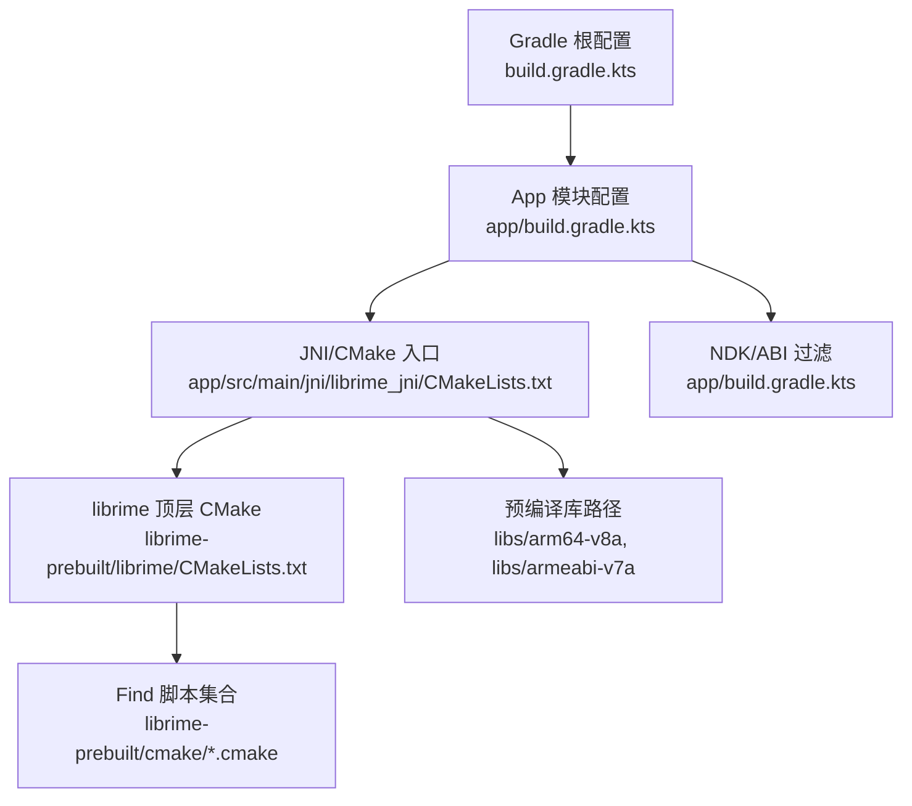
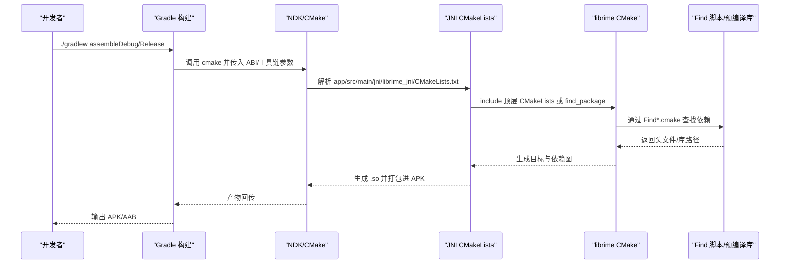
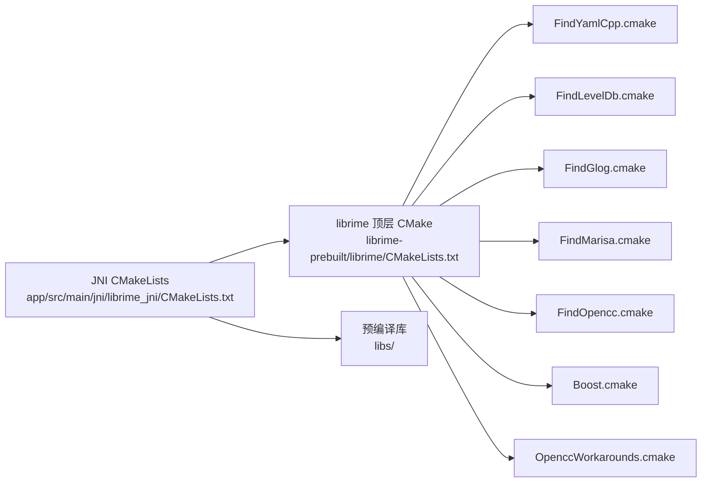

# 构建配置

<cite>
**本文引用的文件**   
- [app/build.gradle.kts](file://app/build.gradle.kts)
- [build.gradle.kts](file://build.gradle.kts)
- [settings.gradle.kts](file://settings.gradle.kts)
- [gradle.properties](file://gradle.properties)
- [app/src/main/jni/librime_jni/CMakeLists.txt](file://app/src/main/jni/librime_jni/CMakeLists.txt)
- [librime-prebuilt/cmake/FindYamlCpp.cmake](file://librime-prebuilt/cmake/FindYamlCpp.cmake)
- [librime-prebuilt/cmake/FindLevelDb.cmake](file://librime-prebuilt/cmake/FindLevelDb.cmake)
- [librime-prebuilt/cmake/FindGlog.cmake](file://librime-prebuilt/cmake/FindGlog.cmake)
- [librime-prebuilt/cmake/FindMarisa.cmake](file://librime-prebuilt/cmake/FindMarisa.cmake)
- [librime-prebuilt/cmake/FindOpencc.cmake](file://librime-prebuilt/cmake/FindOpencc.cmake)
- [librime-prebuilt/cmake/Boost.cmake](file://librime-prebuilt/cmake/Boost.cmake)
- [librime-prebuilt/cmake/OpenccWorkarounds.cmake](file://librime-prebuilt/cmake/OpenccWorkarounds.cmake)
- [librime-prebuilt/librime/CMakeLists.txt](file://librime-prebuilt/librime/CMakeLists.txt)
- [librime-prebuilt/librime/cmake/RimeConfig.cmake](file://librime-prebuilt/librime/cmake/RimeConfig.cmake)
- [librime-prebuilt/librime/cmake/c_flag_overrides.cmake](file://librime-prebuilt/librime/cmake/c_flag_overrides.cmake)
- [librime-prebuilt/librime/cmake/cxx_flag_overrides.cmake](file://librime-prebuilt/librime/cmake/cxx_flag_overrides.cmake)
- [librime-prebuilt/build.sh](file://librime-prebuilt/build.sh)
</cite>

## 目录
1. [简介](#简介)
2. [项目结构](#项目结构)
3. [核心组件](#核心组件)
4. [架构总览](#架构总览)
5. [详细组件分析](#详细组件分析)
6. [依赖分析](#依赖分析)
7. [性能考虑](#性能考虑)
8. [故障排查指南](#故障排查指南)
9. [结论](#结论)
10. [附录](#附录)

## 简介
本文件面向 Android + CMake/Native 的输入法工程，聚焦构建系统的技术细节与最佳实践。内容涵盖：
- Gradle 与 CMake 的协作方式
- 源文件组织与 JNI 模块集成
- 多架构（arm64-v8a、armeabi-v7a）支持策略
- 第三方库发现与链接（YAML-CPP、LevelDB、glog、Marisa、OpenCC、Boost）
- 交叉编译环境搭建与关键变量
- 调试符号生成与优化级别设置
- 构建缓存管理与增量编译优化
- 常见构建问题的诊断与解决

## 项目结构
本项目采用“Android App + Native(JNI) + 预编译 librime”的分层结构：
- app 模块：Android 应用代码与资源，包含 JNI 桥接与 CMake 脚本
- core-logic 模块：纯 Java/Kotlin 逻辑（当前为空骨架）
- librime-prebuilt：第三方 librime 源码及 CMake 工具链，提供 FindXxx.cmake 与构建脚本
- libs：NDK 预编译库输出目录（按 ABI 分目录）

图表来源
- [build.gradle.kts:1-200](file://build.gradle.kts#L1-L200)
- [app/build.gradle.kts:1-200](file://app/build.gradle.kts#L1-L200)
- [app/src/main/jni/librime_jni/CMakeLists.txt:1-200](file://app/src/main/jni/librime_jni/CMakeLists.txt#L1-L200)
- [librime-prebuilt/librime/CMakeLists.txt:1-200](file://librime-prebuilt/librime/CMakeLists.txt#L1-L200)

章节来源
- [build.gradle.kts:1-200](file://build.gradle.kts#L1-L200)
- [settings.gradle.kts:1-100](file://settings.gradle.kts#L1-L100)
- [app/build.gradle.kts:1-200](file://app/build.gradle.kts#L1-L200)

## 核心组件
- Gradle 根与模块配置：定义 Android 插件、NDK 版本、ABI 过滤、CMake 集成点
- CMakeLists（JNI）：声明 native 目标、包含路径、链接库、ABI 过滤、工具链传递
- librime 顶层 CMake：启用/禁用可选组件、设置编译选项、导出配置
- Find 脚本：定位系统或预编译依赖（YAML-CPP、LevelDB、glog、Marisa、OpenCC、Boost）

章节来源
- [app/build.gradle.kts:1-200](file://app/build.gradle.kts#L1-L200)
- [app/src/main/jni/librime_jni/CMakeLists.txt:1-200](file://app/src/main/jni/librime_jni/CMakeLists.txt#L1-L200)
- [librime-prebuilt/librime/CMakeLists.txt:1-200](file://librime-prebuilt/librime/CMakeLists.txt#L1-L200)

## 架构总览
下图展示从 Gradle 到 CMake 再到第三方库的调用链与数据流。

图表来源
- [app/build.gradle.kts:1-200](file://app/build.gradle.kts#L1-L200)
- [app/src/main/jni/librime_jni/CMakeLists.txt:1-200](file://app/src/main/jni/librime_jni/CMakeLists.txt#L1-L200)
- [librime-prebuilt/librime/CMakeLists.txt:1-200](file://librime-prebuilt/librime/CMakeLists.txt#L1-L200)

## 详细组件分析

### Gradle 与 NDK/CMake 集成
- 在 app/build.gradle.kts 中启用 CMake 并指定 CMake 脚本路径
- 通过 android.ndk.abiFilters 限定 arm64-v8a、armeabi-v7a
- 可配置 CMake 变量以控制编译行为（如优化、调试符号、特性开关）
- 将预编译库放置于 libs/<ABI>/ 并通过 CMake 链接

章节来源
- [app/build.gradle.kts:1-200](file://app/build.gradle.kts#L1-L200)

### JNI 模块 CMakeLists（app/src/main/jni/librime_jni/CMakeLists.txt）
职责要点：
- 定义 native 目标（共享库），添加 JNI 源文件
- 设置 include_directories 指向本地头文件与第三方库头文件
- 使用 target_link_libraries 链接预编译库或 Find 脚本发现的库
- 通过 set_target_properties 设置 ABI、调试符号、优化等级
- 通过 add_definitions 或 set(CMAKE_CXX_FLAGS ...) 注入编译宏与标志

建议检查项：
- 是否正确为每个 ABI 指定了库路径或使用了 ANDROID_ABI 条件分支
- 是否设置了 -fPIC、-std=c++17（或所需标准）、-O2/-O3 等
- 是否启用了调试符号（-g3）并在 Release 中按需剥离

章节来源
- [app/src/main/jni/librime_jni/CMakeLists.txt:1-200](file://app/src/main/jni/librime_jni/CMakeLists.txt#L1-L200)

### librime 顶层 CMake（librime-prebuilt/librime/CMakeLists.txt）
职责要点：
- 定义 librime 核心库与可选组件（字典、翻译器、插件等）
- 通过选项开关控制功能（如 OpenCC、LevelDB、glog、yaml-cpp）
- 导出 RimeConfig.cmake，供上层 find_package(rime) 使用
- 设置平台相关编译标志（Android 下需适配）

建议检查项：
- 是否开启必要的组件（如 YAML、LevelDB、OpenCC）
- 是否与 Android 工具链兼容（位置无关代码、API 级别）
- 是否导出正确的安装/配置包以便上层引用

章节来源
- [librime-prebuilt/librime/CMakeLists.txt:1-200](file://librime-prebuilt/librime/CMakeLists.txt#L1-L200)
- [librime-prebuilt/librime/cmake/RimeConfig.cmake:1-200](file://librime-prebuilt/librime/cmake/RimeConfig.cmake#L1-L200)

### 第三方库发现与链接（Find 脚本）
- FindYamlCpp.cmake：定位 yaml-cpp 的头文件与库
- FindLevelDb.cmake：定位 LevelDB 的头文件与库
- FindGlog.cmake：定位 glog 的头文件与库
- FindMarisa.cmake：定位 Marisa 的头文件与库
- FindOpencc.cmake：定位 OpenCC 的头文件与库
- Boost.cmake / OpenccWorkarounds.cmake：辅助处理 Boost 与 OpenCC 的兼容问题

使用模式：
- 在 CMake 中通过 find_package(YAML_CPP REQUIRED) 等方式调用
- 若未找到，可在 CMAKE_PREFIX_PATH 或 CMAKE_FIND_ROOT_PATH 中指定预编译库路径
- 对于 Android，通常将预编译库放入 $ANDROID_NDK/toolchains 或自定义路径，并通过 -DCMAKE_TOOLCHAIN_FILE 指定

章节来源
- [librime-prebuilt/cmake/FindYamlCpp.cmake:1-200](file://librime-prebuilt/cmake/FindYamlCpp.cmake#L1-L200)
- [librime-prebuilt/cmake/FindLevelDb.cmake:1-200](file://librime-prebuilt/cmake/FindLevelDb.cmake#L1-L200)
- [librime-prebuilt/cmake/FindGlog.cmake:1-200](file://librime-prebuilt/cmake/FindGlog.cmake#L1-L200)
- [librime-prebuilt/cmake/FindMarisa.cmake:1-200](file://librime-prebuilt/cmake/FindMarisa.cmake#L1-L200)
- [librime-prebuilt/cmake/FindOpencc.cmake:1-200](file://librime-prebuilt/cmake/FindOpencc.cmake#L1-L200)
- [librime-prebuilt/cmake/Boost.cmake:1-200](file://librime-prebuilt/cmake/Boost.cmake#L1-L200)
- [librime-prebuilt/cmake/OpenccWorkarounds.cmake:1-200](file://librime-prebuilt/cmake/OpenccWorkarounds.cmake#L1-L200)

### 多架构支持（arm64-v8a、armeabi-v7a）
- 在 Gradle 中通过 abiFilters 限制目标 ABI
- 在 CMake 中根据 ANDROID_ABI 选择不同库路径或编译选项
- 确保预编译库与头文件按 ABI 正确放置（libs/arm64-v8a、libs/armeabi-v7a）
- 必要时为 armeabi-v7a 指定 -march=armv7-a 或 NEON 相关标志

章节来源
- [app/build.gradle.kts:1-200](file://app/build.gradle.kts#L1-L200)
- [app/src/main/jni/librime_jni/CMakeLists.txt:1-200](file://app/src/main/jni/librime_jni/CMakeLists.txt#L1-L200)

### 交叉编译环境搭建与配置
- 使用 Android NDK 提供的 toolchain 文件（CMAKE_TOOLCHAIN_FILE）
- 设置 ANDROID_PLATFORM、ANDROID_ABI、ANDROID_STL、ANDROID_ARM_NEON 等环境变量
- 通过 gradle.properties 或命令行 -P 参数传递 CMake 变量
- 预编译第三方库时，必须与目标 ABI 和 API 级别一致

章节来源
- [librime-prebuilt/build.sh:1-200](file://librime-prebuilt/build.sh#L1-L200)
- [gradle.properties:1-200](file://gradle.properties#L1-L200)

### 调试符号与优化级别
- Debug 构建：启用 -g3 保留完整调试信息；关闭优化或 -Og
- Release 构建：启用 -O2 或 -O3；可选择 -DNDEBUG；按需剥离符号（strip）
- 在 CMake 中通过 CMAKE_BUILD_TYPE 或 target_compile_options 设置
- 在 Gradle 中通过 buildTypes 区分 debug/release 并传递 CMake 变量

章节来源
- [app/build.gradle.kts:1-200](file://app/build.gradle.kts#L1-L200)
- [app/src/main/jni/librime_jni/CMakeLists.txt:1-200](file://app/src/main/jni/librime_jni/CMakeLists.txt#L1-L200)

### 构建缓存与增量编译
- Gradle 构建缓存：启用 --build-cache、--parallel、--configure-on-demand
- CMake 缓存：复用 build 目录，避免重复配置；清理时使用 clean 而非删除整个目录
- NDK 缓存：合理设置 ANDROID_HOME/NDK 路径，避免重复下载
- 针对大型依赖（如 librime）使用预编译二进制加速

章节来源
- [build.gradle.kts:1-200](file://build.gradle.kts#L1-L200)
- [app/build.gradle.kts:1-200](file://app/build.gradle.kts#L1-L200)

## 依赖分析
下图展示 CMake 层面的依赖关系与 Find 脚本的作用域。

图表来源
- [app/src/main/jni/librime_jni/CMakeLists.txt:1-200](file://app/src/main/jni/librime_jni/CMakeLists.txt#L1-L200)
- [librime-prebuilt/librime/CMakeLists.txt:1-200](file://librime-prebuilt/librime/CMakeLists.txt#L1-L200)
- [librime-prebuilt/cmake/FindYamlCpp.cmake:1-200](file://librime-prebuilt/cmake/FindYamlCpp.cmake#L1-L200)
- [librime-prebuilt/cmake/FindLevelDb.cmake:1-200](file://librime-prebuilt/cmake/FindLevelDb.cmake#L1-L200)
- [librime-prebuilt/cmake/FindGlog.cmake:1-200](file://librime-prebuilt/cmake/FindGlog.cmake#L1-L200)
- [librime-prebuilt/cmake/FindMarisa.cmake:1-200](file://librime-prebuilt/cmake/FindMarisa.cmake#L1-L200)
- [librime-prebuilt/cmake/FindOpencc.cmake:1-200](file://librime-prebuilt/cmake/FindOpencc.cmake#L1-L200)
- [librime-prebuilt/cmake/Boost.cmake:1-200](file://librime-prebuilt/cmake/Boost.cmake#L1-L200)
- [librime-prebuilt/cmake/OpenccWorkarounds.cmake:1-200](file://librime-prebuilt/cmake/OpenccWorkarounds.cmake#L1-L200)

章节来源
- [librime-prebuilt/librime/CMakeLists.txt:1-200](file://librime-prebuilt/librime/CMakeLists.txt#L1-L200)
- [app/src/main/jni/librime_jni/CMakeLists.txt:1-200](file://app/src/main/jni/librime_jni/CMakeLists.txt#L1-L200)

## 性能考虑
- 优先使用预编译的 librime 二进制，减少首次构建时间
- 合理设置 C++ 标准与优化等级（-O2 平衡速度与体积）
- 仅启用必要组件（如不需要 OpenCC 则关闭以减少依赖）
- 使用并行构建与构建缓存，缩短 CI/CD 流水线时间
- 对热点路径启用内联与函数展开（谨慎评估二进制大小）

## 故障排查指南
常见问题与定位步骤：
- 找不到第三方库头文件或库文件
  - 检查 CMAKE_PREFIX_PATH、CMAKE_FIND_ROOT_PATH 是否指向预编译库目录
  - 确认 Find*.cmake 中的搜索路径与 ABI 匹配
  - 验证 ANDROID_ABI 与预编译库 ABI 一致
- 链接错误（undefined reference）
  - 检查 target_link_libraries 顺序与依赖完整性
  - 确认静态库是否需要 -Wl,--whole-archive
  - 核对 STL 版本（c++_static/c++_shared）一致性
- 运行时崩溃（符号缺失）
  - 检查是否剥离了调试符号导致无法定位
  - 确认动态库加载路径（LD_LIBRARY_PATH 或系统库路径）
- 多 ABI 构建失败
  - 确认 abiFilters 与预编译库目录结构一致
  - 检查 CMake 中是否针对不同 ABI 设置了不同标志

章节来源
- [app/src/main/jni/librime_jni/CMakeLists.txt:1-200](file://app/src/main/jni/librime_jni/CMakeLists.txt#L1-L200)
- [librime-prebuilt/cmake/FindYamlCpp.cmake:1-200](file://librime-prebuilt/cmake/FindYamlCpp.cmake#L1-L200)
- [librime-prebuilt/cmake/FindLevelDb.cmake:1-200](file://librime-prebuilt/cmake/FindLevelDb.cmake#L1-L200)
- [librime-prebuilt/cmake/FindGlog.cmake:1-200](file://librime-prebuilt/cmake/FindGlog.cmake#L1-L200)
- [librime-prebuilt/cmake/FindMarisa.cmake:1-200](file://librime-prebuilt/cmake/FindMarisa.cmake#L1-L200)
- [librime-prebuilt/cmake/FindOpencc.cmake:1-200](file://librime-prebuilt/cmake/FindOpencc.cmake#L1-L200)

## 结论
本项目的构建体系以 Gradle 为入口，CMake 为核心，结合预编译的 librime 与 Find 脚本实现跨 ABI 的 Native 集成。通过合理的依赖管理、编译选项与缓存策略，可在保证功能完整性的同时显著提升构建效率与稳定性。建议在团队内统一 NDK/工具链版本，固化 ABI 与依赖路径，形成可复现的构建流程。

## 附录
- 常用命令参考
  - 清理构建缓存：./gradlew clean
  - 并行构建：./gradlew assembleDebug --parallel --build-cache
  - 指定 ABI：在 app/build.gradle.kts 中设置 abiFilters
  - 传递 CMake 变量：./gradlew assembleDebug -PcmakeVar=value
- 关键配置文件清单
  - Gradle：build.gradle.kts、app/build.gradle.kts、settings.gradle.kts、gradle.properties
  - CMake：app/src/main/jni/librime_jni/CMakeLists.txt、librime-prebuilt/librime/CMakeLists.txt
  - Find 脚本：librime-prebuilt/cmake/*.cmake
  - 构建脚本：librime-prebuilt/build.sh