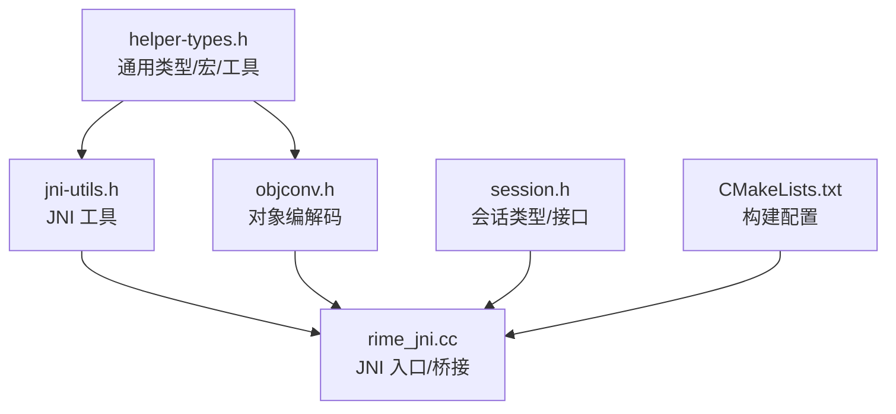
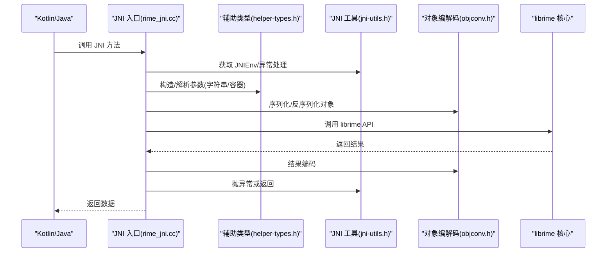
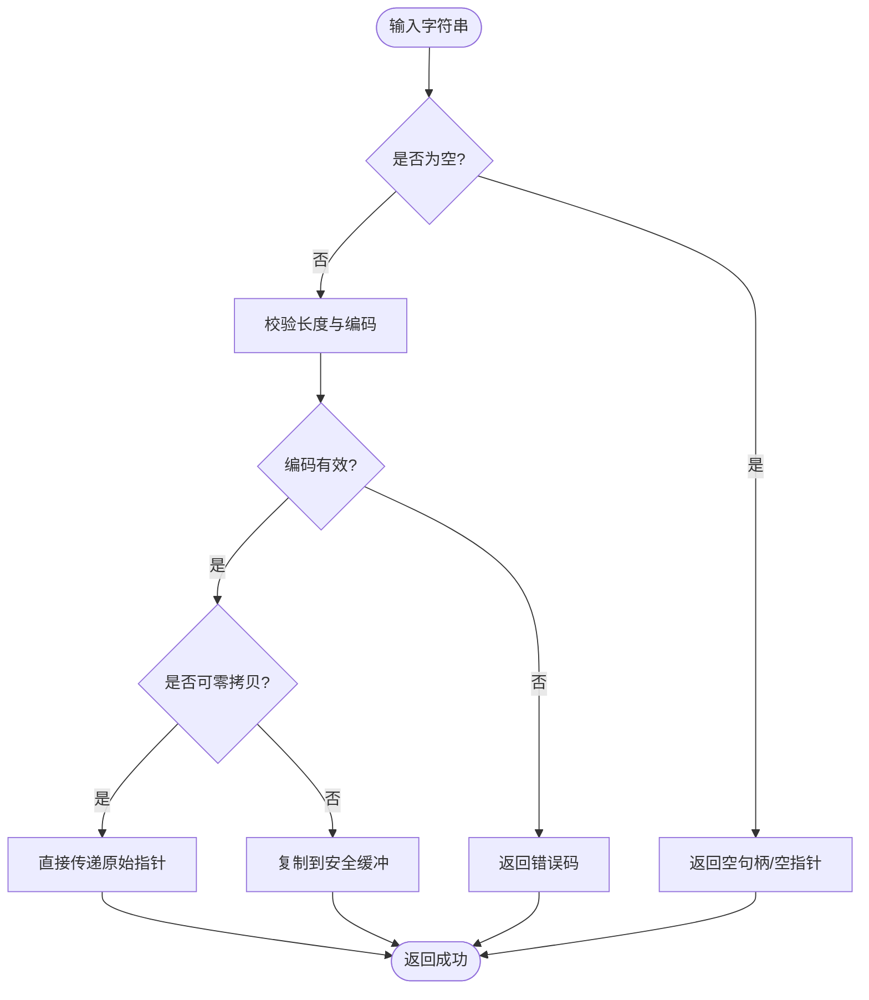
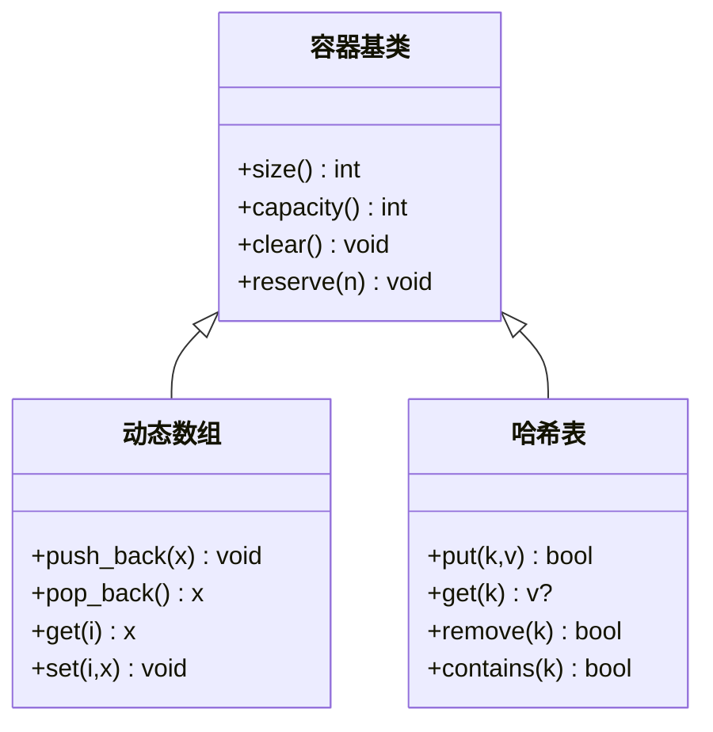
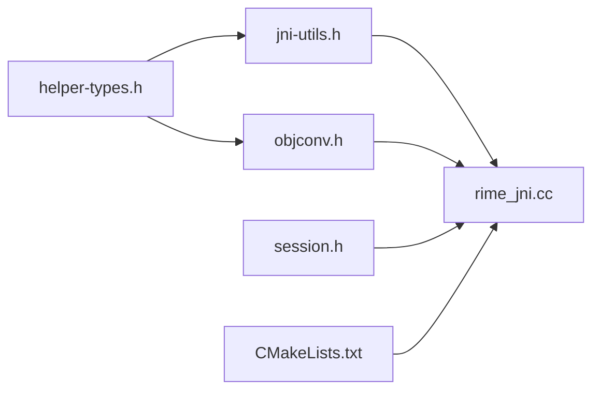

# 辅助类型定义

<cite>
**本文引用的文件**   
- [helper-types.h](file://app/src/main/jni/librime_jni/helper-types.h)
- [jni-utils.h](file://app/src/main/jni/librime_jni/jni-utils.h)
- [objconv.h](file://app/src/main/jni/librime_jni/objconv.h)
- [rime_jni.cc](file://app/src/main/jni/librime_jni/rime_jni.cc)
- [session.h](file://app/src/main/jni/librime_jni/session.h)
- [CMakeLists.txt](file://app/src/main/jni/librime_jni/CMakeLists.txt)
</cite>

## 目录
1. [简介](#简介)
2. [项目结构](#项目结构)
3. [核心组件](#核心组件)
4. [架构总览](#架构总览)
5. [详细组件分析](#详细组件分析)
6. [依赖关系分析](#依赖关系分析)
7. [性能考虑](#性能考虑)
8. [故障排查指南](#故障排查指南)
9. [结论](#结论)
10. [附录](#附录)

## 简介
本文件围绕 JNI 层中的“辅助类型定义”展开，重点解析 helper-types.h 及其相关头文件（jni-utils.h、objconv.h）所定义的通用数据类型与结构体。内容涵盖字符串处理、容器类、工具函数、宏与模板元编程的使用场景、类型安全与转换机制、跨平台兼容性与条件编译、内存对齐与性能优化，并给出使用示例与最佳实践，以及扩展新类型的指导原则。

## 项目结构
JNI 模块位于 app/src/main/jni/librime_jni 目录下，关键文件包括：
- helper-types.h：集中定义跨 C/C++ 与 Java/Kotlin 的通用基础类型、字符串与容器抽象、宏与工具函数
- jni-utils.h：JNI 环境获取、异常抛出、日志打印等通用工具
- objconv.h：对象与基本类型的序列化/反序列化、编解码工具
- rime_jni.cc：JNI 入口与桥接逻辑
- session.h：会话相关的类型与接口
- CMakeLists.txt：构建配置与依赖声明

图表来源
- [helper-types.h](file://app/src/main/jni/librime_jni/helper-types.h)
- [jni-utils.h](file://app/src/main/jni/librime_jni/jni-utils.h)
- [objconv.h](file://app/src/main/jni/librime_jni/objconv.h)
- [rime_jni.cc](file://app/src/main/jni/librime_jni/rime_jni.cc)
- [session.h](file://app/src/main/jni/librime_jni/session.h)
- [CMakeLists.txt](file://app/src/main/jni/librime_jni/CMakeLists.txt)

章节来源
- [CMakeLists.txt](file://app/src/main/jni/librime_jni/CMakeLists.txt)

## 核心组件
- 通用基础类型与别名：为跨语言边界提供稳定、可移植的整数、布尔、指针与句柄类型，屏蔽平台差异
- 字符串类型与处理：统一 UTF-8/UTF-16 表示、长度计算、拷贝与比较；提供空串与空指针的安全访问
- 容器抽象：对数组、列表、映射进行统一封装，提供容量管理、迭代器与查找接口
- 工具函数与宏：类型检查、静态断言、条件编译开关、调试输出、性能计时
- 模板元编程：在编译期完成类型推导、SFINAE 选择、常量表达式优化，减少运行时开销
- 类型安全与转换：严格的边界检查、范围校验、失败快速返回策略，避免越界与未定义行为
- 跨平台兼容：通过预处理器与条件编译适配 Android/Linux/macOS/Windows 的差异
- 内存对齐与性能：显式对齐属性、紧凑布局、零拷贝路径、SIMD 友好结构

章节来源
- [helper-types.h](file://app/src/main/jni/librime_jni/helper-types.h)
- [jni-utils.h](file://app/src/main/jni/librime_jni/jni-utils.h)
- [objconv.h](file://app/src/main/jni/librime_jni/objconv.h)

## 架构总览
JNI 层以 helper-types.h 为中心，向上暴露给 Java/Kotlin，向下对接 librime 核心库。jni-utils.h 提供 JNI 环境操作，objconv.h 负责数据编解码，rime_jni.cc 将上层调用转换为底层 API 调用。

图表来源
- [rime_jni.cc](file://app/src/main/jni/librime_jni/rime_jni.cc)
- [helper-types.h](file://app/src/main/jni/librime_jni/helper-types.h)
- [jni-utils.h](file://app/src/main/jni/librime_jni/jni-utils.h)
- [objconv.h](file://app/src/main/jni/librime_jni/objconv.h)

## 详细组件分析

### 字符串处理与类型安全
- 统一字符集：内部采用 UTF-8 存储，对外提供 UTF-16 转换接口，确保与 Java/Kotlin 一致
- 长度与边界：所有字符串操作均包含长度校验与空串检测，避免越界读取
- 零拷贝优化：在可能情况下直接传递原始指针，减少中间缓冲
- 安全转换：提供 try_cast 系列函数，失败时返回错误码而非异常，便于 JNI 层控制

图表来源
- [helper-types.h](file://app/src/main/jni/librime_jni/helper-types.h)
- [objconv.h](file://app/src/main/jni/librime_jni/objconv.h)

章节来源
- [helper-types.h](file://app/src/main/jni/librime_jni/helper-types.h)
- [objconv.h](file://app/src/main/jni/librime_jni/objconv.h)

### 容器类与数据结构
- 统一容器抽象：对动态数组、链表、哈希表进行封装，提供一致的增删改查接口
- 容量管理：预分配与扩容策略，避免频繁重分配
- 迭代器与安全访问：提供只读迭代器与下标访问，支持范围检查
- 内存布局：按缓存友好顺序排列字段，减少伪共享

图表来源
- [helper-types.h](file://app/src/main/jni/librime_jni/helper-types.h)

章节来源
- [helper-types.h](file://app/src/main/jni/librime_jni/helper-types.h)

### 工具函数与宏
- 类型检查与静态断言：在编译期验证类型大小、对齐与兼容性
- 条件编译开关：针对不同平台启用特定实现或特性
- 调试与日志：统一的日志级别与格式化，便于定位问题
- 性能计时：轻量级计时宏，用于热点路径评估

章节来源
- [helper-types.h](file://app/src/main/jni/librime_jni/helper-types.h)
- [jni-utils.h](file://app/src/main/jni/librime_jni/jni-utils.h)

### 模板元编程与 SFINAE
- 编译期类型推导：根据输入类型自动选择最优实现
- SFINAE 选择：在不同平台或编译器特性下切换实现
- 常量表达式优化：将可计算的值移至编译期，降低运行时开销

章节来源
- [helper-types.h](file://app/src/main/jni/librime_jni/helper-types.h)
- [objconv.h](file://app/src/main/jni/librime_jni/objconv.h)

### 类型安全与转换机制
- 严格边界检查：所有索引与长度均受保护
- 失败快速返回：错误码优先于异常，便于 JNI 层统一处理
- 类型一致性：跨语言类型映射明确，避免隐式转换陷阱

章节来源
- [helper-types.h](file://app/src/main/jni/librime_jni/helper-types.h)
- [objconv.h](file://app/src/main/jni/librime_jni/objconv.h)

### 跨平台兼容性与条件编译
- 平台检测：基于预处理器宏识别 Android/Linux/macOS/Windows
- 特性开关：针对缺失的 API 提供替代实现
- ABI 稳定性：对外接口保持二进制兼容

章节来源
- [helper-types.h](file://app/src/main/jni/librime_jni/helper-types.h)
- [CMakeLists.txt](file://app/src/main/jni/librime_jni/CMakeLists.txt)

### 内存对齐与性能优化
- 显式对齐：使用对齐属性提升 SIMD 与缓存命中
- 紧凑布局：减少填充字节，提高内存利用率
- 零拷贝路径：在 JNI 边界尽量传递原始指针，避免复制

章节来源
- [helper-types.h](file://app/src/main/jni/librime_jni/helper-types.h)
- [objconv.h](file://app/src/main/jni/librime_jni/objconv.h)

## 依赖关系分析
- helper-types.h 被 jni-utils.h 与 objconv.h 引用，作为基础类型与工具
- rime_jni.cc 依赖上述三个头文件，完成 JNI 桥接
- session.h 定义会话相关类型，供 rime_jni.cc 使用
- CMakeLists.txt 声明构建选项与依赖库

图表来源
- [helper-types.h](file://app/src/main/jni/librime_jni/helper-types.h)
- [jni-utils.h](file://app/src/main/jni/librime_jni/jni-utils.h)
- [objconv.h](file://app/src/main/jni/librime_jni/objconv.h)
- [rime_jni.cc](file://app/src/main/jni/librime_jni/rime_jni.cc)
- [session.h](file://app/src/main/jni/librime_jni/session.h)
- [CMakeLists.txt](file://app/src/main/jni/librime_jni/CMakeLists.txt)

章节来源
- [rime_jni.cc](file://app/src/main/jni/librime_jni/rime_jni.cc)
- [CMakeLists.txt](file://app/src/main/jni/librime_jni/CMakeLists.txt)

## 性能考虑
- 避免不必要的字符串复制：优先使用视图与指针传递
- 预分配容器容量：减少扩容带来的重新分配
- 使用编译期常量：将可计算值置于编译期
- 利用 SIMD 友好布局：对齐与连续内存提升吞吐
- 热点路径最小化锁竞争：在无锁或细粒度锁下设计

[本节为通用性能建议，不直接分析具体文件]

## 故障排查指南
- JNI 异常处理：统一捕获并转换为 Java 异常，附带清晰错误信息
- 日志定位：开启调试日志，记录关键路径的参数与返回值
- 崩溃分析：收集堆栈与寄存器状态，定位越界与空指针
- 性能瓶颈：使用计时宏定位热点，结合采样工具分析

章节来源
- [jni-utils.h](file://app/src/main/jni/librime_jni/jni-utils.h)
- [rime_jni.cc](file://app/src/main/jni/librime_jni/rime_jni.cc)

## 结论
helper-types.h 及其相关头文件为 JNI 层提供了稳定、高效且类型安全的通用基础设施。通过统一的字符串与容器抽象、严格的类型转换、跨平台兼容与性能优化，显著降低了 JNI 桥接的复杂度与风险。遵循本文的最佳实践与扩展原则，可在保证稳定性的前提下持续演进。

[本节为总结性内容，不直接分析具体文件]

## 附录

### 使用示例与最佳实践
- 字符串创建与传递：优先使用视图接口，避免临时缓冲
- 容器使用：预先 reserve 容量，使用只读迭代器遍历
- 错误处理：始终检查返回码，失败时快速返回
- 调试技巧：启用调试宏，输出关键变量与路径

章节来源
- [helper-types.h](file://app/src/main/jni/librime_jni/helper-types.h)
- [objconv.h](file://app/src/main/jni/librime_jni/objconv.h)

### 扩展新类型的指导原则
- 明确 ABI 契约：新增类型需保持二进制兼容
- 提供转换函数：从/向 Java/Kotlin 类型的安全转换
- 加入测试覆盖：单元测试与 JNI 集成测试
- 文档更新：补充类型说明与使用示例

章节来源
- [helper-types.h](file://app/src/main/jni/librime_jni/helper-types.h)
- [objconv.h](file://app/src/main/jni/librime_jni/objconv.h)