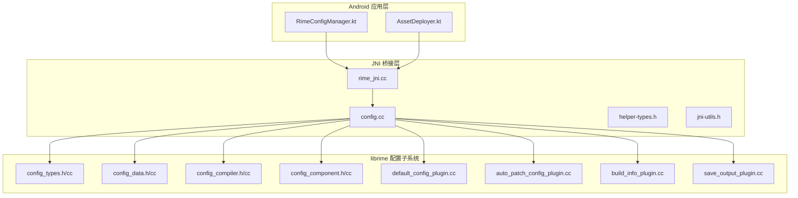
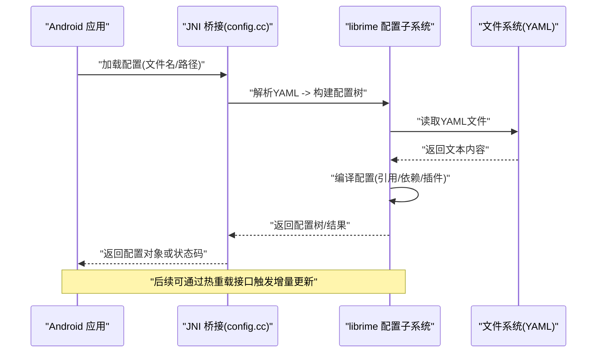
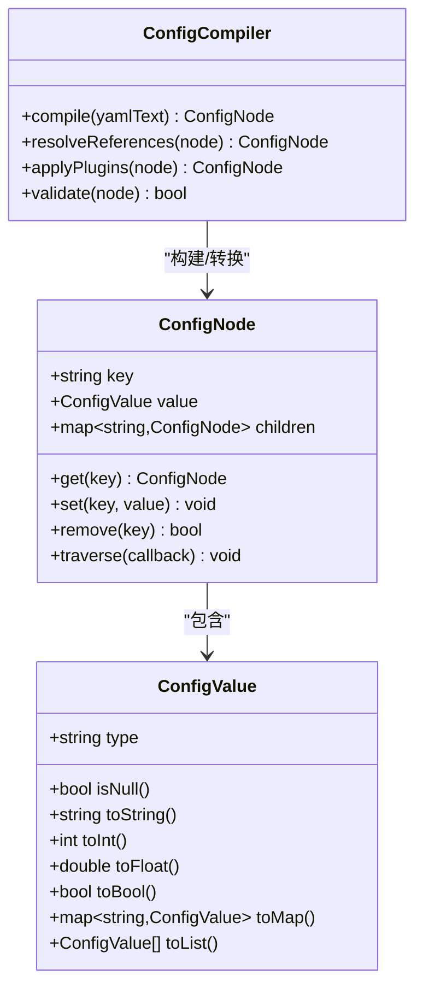
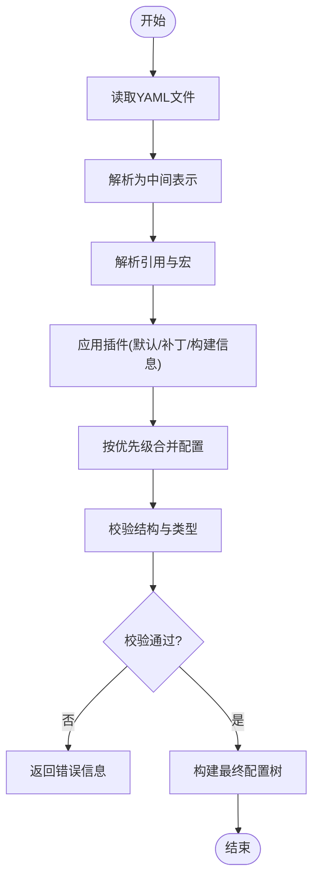
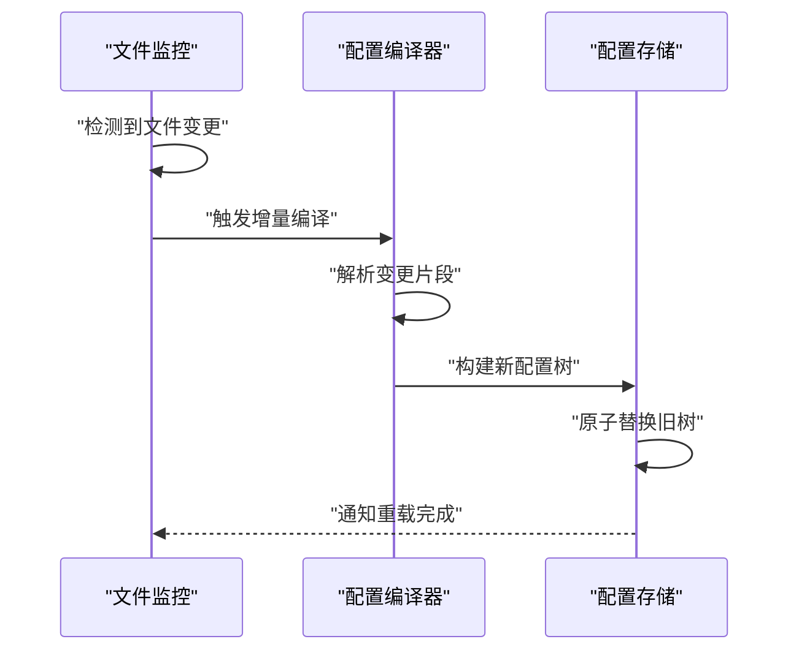
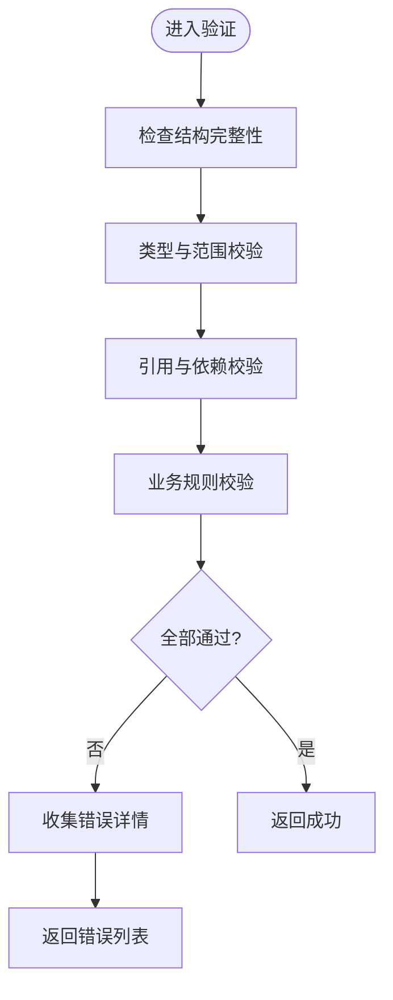
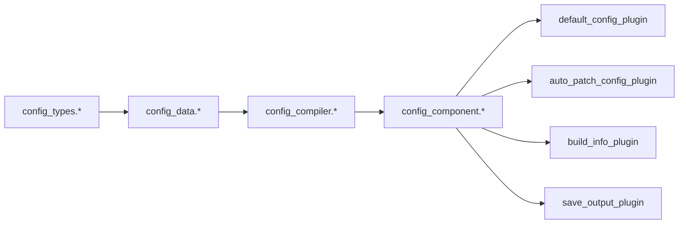

# 配置加载

<cite>
**本文档引用的文件**   
- [config.cc](file://app/src/main/jni/librime_jni/config.cc)
- [config_types.h](file://librime-prebuilt/librime/src/rime/config/config_types.h)
- [config_types.cc](file://librime-prebuilt/librime/src/rime/config/config_types.cc)
- [config_data.h](file://librime-prebuilt/librime/src/rime/config/config_data.h)
- [config_data.cc](file://librime-prebuilt/librime/src/rime/config/config_data.cc)
- [config_compiler.h](file://librime-prebuilt/librime/src/rime/config/config_compiler.h)
- [config_compiler.cc](file://librime-prebuilt/librime/src/rime/config/config_compiler.cc)
- [config_component.h](file://librime-prebuilt/librime/src/rime/config/config_component.h)
- [config_component.cc](file://librime-prebuilt/librime/src/rime/config/config_component.cc)
- [default_config_plugin.cc](file://librime-prebuilt/librime/src/rime/config/default_config_plugin.cc)
- [auto_patch_config_plugin.cc](file://librime-prebuilt/librime/src/rime/config/auto_patch_config_plugin.cc)
- [build_info_plugin.cc](file://librime-prebuilt/librime/src/rime/config/build_info_plugin.cc)
- [save_output_plugin.cc](file://librime-prebuilt/librime/src/rime/config/save_output_plugin.cc)
- [helper-types.h](file://app/src/main/jni/librime_jni/helper-types.h)
- [jni-utils.h](file://app/src/main/jni/librime_jni/jni-utils.h)
- [rime_jni.cc](file://app/src/main/jni/librime_jni/rime_jni.cc)
- [RimeConfigManager.kt](file://app/src/main/java/com/ziyou/ime/config/RimeConfigManager.kt)
- [AssetDeployer.kt](file://app/src/main/java/com/ziyou/ime/config/AssetDeployer.kt)
</cite>

## 目录
1. [简介](#简介)
2. [项目结构](#项目结构)
3. [核心组件](#核心组件)
4. [架构总览](#架构总览)
5. [详细组件分析](#详细组件分析)
6. [依赖关系分析](#依赖关系分析)
7. [性能考量](#性能考量)
8. [故障排查指南](#故障排查指南)
9. [结论](#结论)
10. [附录](#附录)

## 简介
本技术文档聚焦于配置加载系统，围绕 config.cc 中的配置解析与验证逻辑展开，结合 librime 配置子系统（config_*）与 Android JNI 层集成，系统性说明：
- YAML 文件的读取、编译、合并与校验流程
- 配置项类型系统（基本类型、复合类型、自定义类型）
- 配置合并策略与优先级规则
- 热重载机制与变更检测
- 验证规则与错误处理
- 模板与默认值管理
- 优化实践与常见问题解决方案

## 项目结构
Android 应用通过 JNI 调用 C++ 的 Rime 配置子系统。JNI 入口在 rime_jni.cc，其中封装了配置相关接口；底层配置解析由 librime 的 config_* 模块实现。Android 侧通过 RimeConfigManager.kt 和 AssetDeployer.kt 完成资源部署与配置管理。

**图表来源** 
- [rime_jni.cc](file://app/src/main/jni/librime_jni/rime_jni.cc)
- [config.cc](file://app/src/main/jni/librime_jni/config.cc)
- [helper-types.h](file://app/src/main/jni/librime_jni/helper-types.h)
- [jni-utils.h](file://app/src/main/jni/librime_jni/jni-utils.h)
- [config_types.h](file://librime-prebuilt/librime/src/rime/config/config_types.h)
- [config_types.cc](file://librime-prebuilt/librime/src/rime/config/config_types.cc)
- [config_data.h](file://librime-prebuilt/librime/src/rime/config/config_data.h)
- [config_data.cc](file://librime-prebuilt/librime/src/rime/config/config_data.cc)
- [config_compiler.h](file://librime-prebuilt/librime/src/rime/config/config_compiler.h)
- [config_compiler.cc](file://librime-prebuilt/librime/src/rime/config/config_compiler.cc)
- [config_component.h](file://librime-prebuilt/librime/src/rime/config/config_component.h)
- [config_component.cc](file://librime-prebuilt/librime/src/rime/config/config_component.cc)
- [default_config_plugin.cc](file://librime-prebuilt/librime/src/rime/config/default_config_plugin.cc)
- [auto_patch_config_plugin.cc](file://librime-prebuilt/librime/src/rime/config/auto_patch_config_plugin.cc)
- [build_info_plugin.cc](file://librime-prebuilt/librime/src/rime/config/build_info_plugin.cc)
- [save_output_plugin.cc](file://librime-prebuilt/librime/src/rime/config/save_output_plugin.cc)

**章节来源**
- [rime_jni.cc](file://app/src/main/jni/librime_jni/rime_jni.cc)
- [config.cc](file://app/src/main/jni/librime_jni/config.cc)
- [RimeConfigManager.kt](file://app/src/main/java/com/ziyou/ime/config/RimeConfigManager.kt)
- [AssetDeployer.kt](file://app/src/main/java/com/ziyou/ime/config/AssetDeployer.kt)

## 核心组件
- JNI 配置桥接（config.cc）：提供 Java/Kotlin 可调用的配置加载、查询、更新接口，负责将上层请求转换为 librime 配置 API 调用。
- 类型系统（config_types.*）：定义基础类型（字符串、整数、布尔、浮点）、复合类型（映射、列表）以及自定义类型的序列化/反序列化与校验。
- 数据模型（config_data.*）：表示配置节点树，支持键路径访问、子节点遍历、拷贝与比较。
- 编译器（config_compiler.*）：执行 YAML 到配置树的转换、引用解析、依赖注入、插件扩展点。
- 组件与插件（config_component.*, default_config_plugin, auto_patch_config_plugin, build_info_plugin, save_output_plugin）：提供默认配置、自动补丁、构建信息注入、输出保存等能力。

**章节来源**
- [config_types.h](file://librime-prebuilt/librime/src/rime/config/config_types.h)
- [config_types.cc](file://librime-prebuilt/librime/src/rime/config/config_types.cc)
- [config_data.h](file://librime-prebuilt/librime/src/rime/config/config_data.h)
- [config_data.cc](file://librime-prebuilt/librime/src/rime/config/config_data.cc)
- [config_compiler.h](file://librime-prebuilt/librime/src/rime/config/config_compiler.h)
- [config_compiler.cc](file://librime-prebuilt/librime/src/rime/config/config_compiler.cc)
- [config_component.h](file://librime-prebuilt/librime/src/rime/config/config_component.h)
- [config_component.cc](file://librime-prebuilt/librime/src/rime/config/config_component.cc)
- [default_config_plugin.cc](file://librime-prebuilt/librime/src/rime/config/default_config_plugin.cc)
- [auto_patch_config_plugin.cc](file://librime-prebuilt/librime/src/rime/config/auto_patch_config_plugin.cc)
- [build_info_plugin.cc](file://librime-prebuilt/librime/src/rime/config/build_info_plugin.cc)
- [save_output_plugin.cc](file://librime-prebuilt/librime/src/rime/config/save_output_plugin.cc)

## 架构总览
配置加载的整体流程如下：
- Android 侧通过 RimeConfigManager.kt 发起配置操作（加载、查询、更新）。
- JNI 层（rime_jni.cc + config.cc）将请求转发至 librime 配置子系统。
- 配置子系统从 YAML 源读取并解析为配置树，执行编译（引用解析、依赖注入、插件处理），生成最终可用配置。
- 运行时可通过热重载机制监听文件变更并增量更新配置树。

**图表来源** 
- [config.cc](file://app/src/main/jni/librime_jni/config.cc)
- [config_compiler.cc](file://librime-prebuilt/librime/src/rime/config/config_compiler.cc)
- [config_data.cc](file://librime-prebuilt/librime/src/rime/config/config_data.cc)

## 详细组件分析

### 类型系统与数据结构
- 基本类型：字符串、整数、布尔、浮点。支持空值与默认值。
- 复合类型：映射（键值对）、列表（有序集合）。支持嵌套与深度访问。
- 自定义类型：通过插件或扩展点注册，实现特定语义的解析与校验。

**图表来源** 
- [config_types.h](file://librime-prebuilt/librime/src/rime/config/config_types.h)
- [config_types.cc](file://librime-prebuilt/librime/src/rime/config/config_types.cc)
- [config_data.h](file://librime-prebuilt/librime/src/rime/config/config_data.h)
- [config_data.cc](file://librime-prebuilt/librime/src/rime/config/config_data.cc)
- [config_compiler.h](file://librime-prebuilt/librime/src/rime/config/config_compiler.h)
- [config_compiler.cc](file://librime-prebuilt/librime/src/rime/config/config_compiler.cc)

**章节来源**
- [config_types.h](file://librime-prebuilt/librime/src/rime/config/config_types.h)
- [config_types.cc](file://librime-prebuilt/librime/src/rime/config/config_types.cc)
- [config_data.h](file://librime-prebuilt/librime/src/rime/config/config_data.h)
- [config_data.cc](file://librime-prebuilt/librime/src/rime/config/config_data.cc)

### 配置编译与合并策略
- 编译阶段：将 YAML 文本转换为配置树，解析引用（如 $ref）、宏替换、条件分支。
- 合并策略：多文件按优先级顺序合并，后者优先覆盖前者；支持局部覆盖与深层合并。
- 插件扩展：默认配置插件提供基础字段，自动补丁插件根据环境动态调整，构建信息插件注入版本信息等。

**图表来源** 
- [config_compiler.cc](file://librime-prebuilt/librime/src/rime/config/config_compiler.cc)
- [default_config_plugin.cc](file://librime-prebuilt/librime/src/rime/config/default_config_plugin.cc)
- [auto_patch_config_plugin.cc](file://librime-prebuilt/librime/src/rime/config/auto_patch_config_plugin.cc)
- [build_info_plugin.cc](file://librime-prebuilt/librime/src/rime/config/build_info_plugin.cc)

**章节来源**
- [config_compiler.h](file://librime-prebuilt/librime/src/rime/config/config_compiler.h)
- [config_compiler.cc](file://librime-prebuilt/librime/src/rime/config/config_compiler.cc)
- [default_config_plugin.cc](file://librime-prebuilt/librime/src/rime/config/default_config_plugin.cc)
- [auto_patch_config_plugin.cc](file://librime-prebuilt/librime/src/rime/config/auto_patch_config_plugin.cc)
- [build_info_plugin.cc](file://librime-prebuilt/librime/src/rime/config/build_info_plugin.cc)

### 热重载与变更检测
- 文件监控：监听配置文件修改事件（时间戳或 inode 变化）。
- 增量编译：仅重新编译变更部分，复用未变更节点以提升性能。
- 原子切换：新配置树构建完成后原子替换旧树，避免运行时不一致。

**图表来源** 
- [config_compiler.cc](file://librime-prebuilt/librime/src/rime/config/config_compiler.cc)
- [config_data.cc](file://librime-prebuilt/librime/src/rime/config/config_data.cc)

**章节来源**
- [config_compiler.cc](file://librime-prebuilt/librime/src/rime/config/config_compiler.cc)
- [config_data.cc](file://librime-prebuilt/librime/src/rime/config/config_data.cc)

### 验证规则与错误处理
- 结构校验：检查必需字段、类型匹配、枚举值范围。
- 引用校验：确保所有引用存在且无循环依赖。
- 错误分类：语法错误、类型错误、引用错误、业务规则错误。
- 错误上报：通过 JNI 返回结构化错误信息，便于上层定位与提示。

**图表来源** 
- [config_compiler.cc](file://librime-prebuilt/librime/src/rime/config/config_compiler.cc)
- [config_types.cc](file://librime-prebuilt/librime/src/rime/config/config_types.cc)

**章节来源**
- [config_compiler.cc](file://librime-prebuilt/librime/src/rime/config/config_compiler.cc)
- [config_types.cc](file://librime-prebuilt/librime/src/rime/config/config_types.cc)

### 模板与默认值管理
- 模板定义：通过默认配置插件提供基础模板，支持字段继承与覆盖。
- 默认值填充：缺失字段自动填充默认值，确保配置可用性。
- 动态补丁：根据运行环境（平台、版本）应用补丁，增强灵活性。

**章节来源**
- [default_config_plugin.cc](file://librime-prebuilt/librime/src/rime/config/default_config_plugin.cc)
- [auto_patch_config_plugin.cc](file://librime-prebuilt/librime/src/rime/config/auto_patch_config_plugin.cc)
- [build_info_plugin.cc](file://librime-prebuilt/librime/src/rime/config/build_info_plugin.cc)

### JNI 集成与 Kotlin 调用
- JNI 接口：config.cc 暴露加载、查询、更新、重载等方法，封装 librime 配置 API。
- Kotlin 管理：RimeConfigManager.kt 提供高层 API，简化配置操作；AssetDeployer.kt 负责资源部署。
- 错误传播：JNI 层捕获异常并转换为可序列化的错误码/消息。

**章节来源**
- [config.cc](file://app/src/main/jni/librime_jni/config.cc)
- [helper-types.h](file://app/src/main/jni/librime_jni/helper-types.h)
- [jni-utils.h](file://app/src/main/jni/librime_jni/jni-utils.h)
- [rime_jni.cc](file://app/src/main/jni/librime_jni/rime_jni.cc)
- [RimeConfigManager.kt](file://app/src/main/java/com/ziyou/ime/config/RimeConfigManager.kt)
- [AssetDeployer.kt](file://app/src/main/java/com/ziyou/ime/config/AssetDeployer.kt)

## 依赖关系分析
配置子系统内部模块耦合清晰，职责分离明确：
- config_types.* 提供基础类型与序列化。
- config_data.* 提供配置树数据结构。
- config_compiler.* 负责解析、合并、验证。
- config_component.* 与插件体系解耦，支持扩展。
- 插件模块（default/auto_patch/build_info/save_output）独立实现特定功能。

**图表来源** 
- [config_types.h](file://librime-prebuilt/librime/src/rime/config/config_types.h)
- [config_data.h](file://librime-prebuilt/librime/src/rime/config/config_data.h)
- [config_compiler.h](file://librime-prebuilt/librime/src/rime/config/config_compiler.h)
- [config_component.h](file://librime-prebuilt/librime/src/rime/config/config_component.h)
- [default_config_plugin.cc](file://librime-prebuilt/librime/src/rime/config/default_config_plugin.cc)
- [auto_patch_config_plugin.cc](file://librime-prebuilt/librime/src/rime/config/auto_patch_config_plugin.cc)
- [build_info_plugin.cc](file://librime-prebuilt/librime/src/rime/config/build_info_plugin.cc)
- [save_output_plugin.cc](file://librime-prebuilt/librime/src/rime/config/save_output_plugin.cc)

**章节来源**
- [config_types.h](file://librime-prebuilt/librime/src/rime/config/config_types.h)
- [config_data.h](file://librime-prebuilt/librime/src/rime/config/config_data.h)
- [config_compiler.h](file://librime-prebuilt/librime/src/rime/config/config_compiler.h)
- [config_component.h](file://librime-prebuilt/librime/src/rime/config/config_component.h)

## 性能考量
- 增量编译：仅重编译变更部分，减少 CPU 与内存开销。
- 缓存策略：对频繁访问的配置节点进行缓存，提升查询性能。
- 异步加载：大配置文件采用异步解析，避免阻塞主线程。
- 内存管理：使用共享指针与拷贝时复制（COW）减少重复分配。

[本节为通用指导，不直接分析具体文件]

## 故障排查指南
- 常见错误：
  - YAML 语法错误：检查缩进、引号、特殊字符。
  - 类型不匹配：确认字段类型与期望一致。
  - 引用失败：检查引用路径是否存在，避免循环依赖。
  - 权限问题：确认配置文件可读。
- 调试建议：
  - 启用详细日志，查看解析与验证过程。
  - 使用最小化配置复现问题。
  - 通过 JNI 错误码定位上层调用问题。

**章节来源**
- [config_compiler.cc](file://librime-prebuilt/librime/src/rime/config/config_compiler.cc)
- [config_types.cc](file://librime-prebuilt/librime/src/rime/config/config_types.cc)
- [config.cc](file://app/src/main/jni/librime_jni/config.cc)

## 结论
配置加载系统通过清晰的模块划分与插件架构，实现了高内聚、低耦合的配置管理。类型系统完善、合并策略灵活、热重载机制高效，能够满足复杂应用场景需求。遵循最佳实践可有效提升稳定性与性能。

[本节为总结性内容，不直接分析具体文件]

## 附录
- 最佳实践：
  - 合理拆分配置文件，提高可维护性。
  - 使用模板与默认值减少重复配置。
  - 启用严格校验，尽早发现错误。
  - 利用增量编译与缓存优化性能。
- 常见问题解决方案：
  - 配置冲突：明确优先级，避免覆盖歧义。
  - 性能瓶颈：优化大文件解析，使用异步加载。
  - 热重载失败：确保原子切换与回滚机制。

[本节为补充信息，不直接分析具体文件]