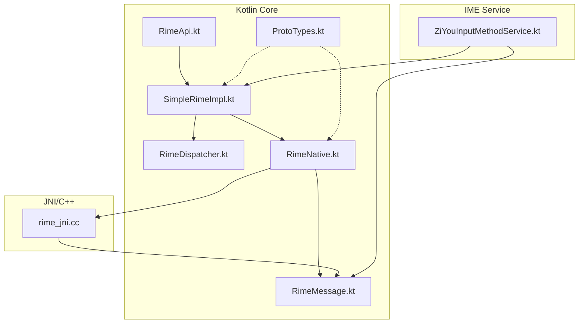
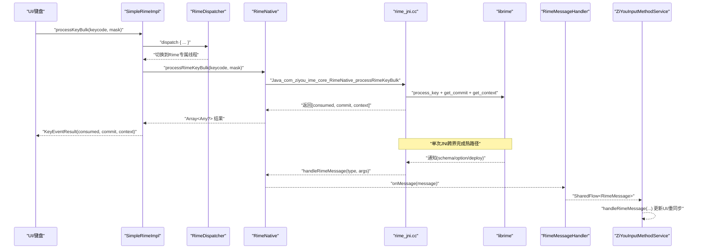
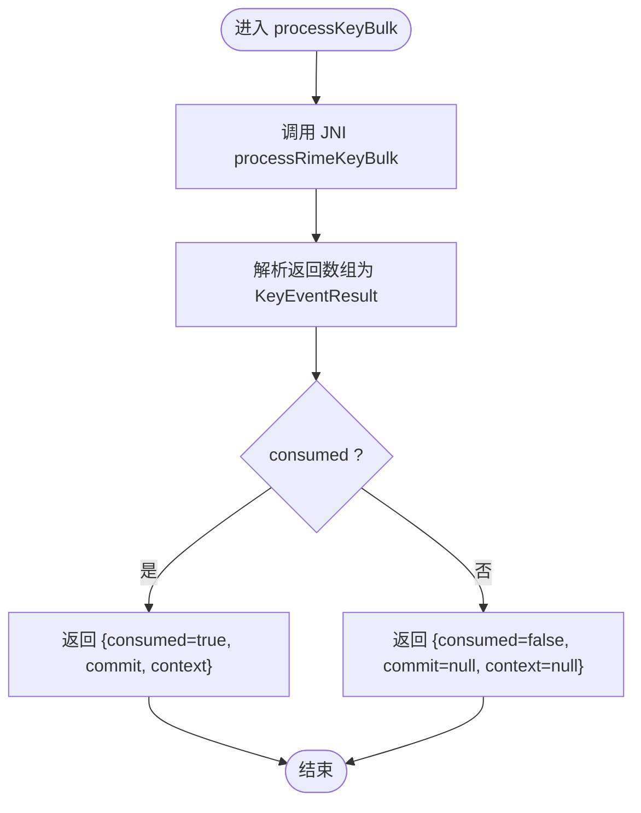
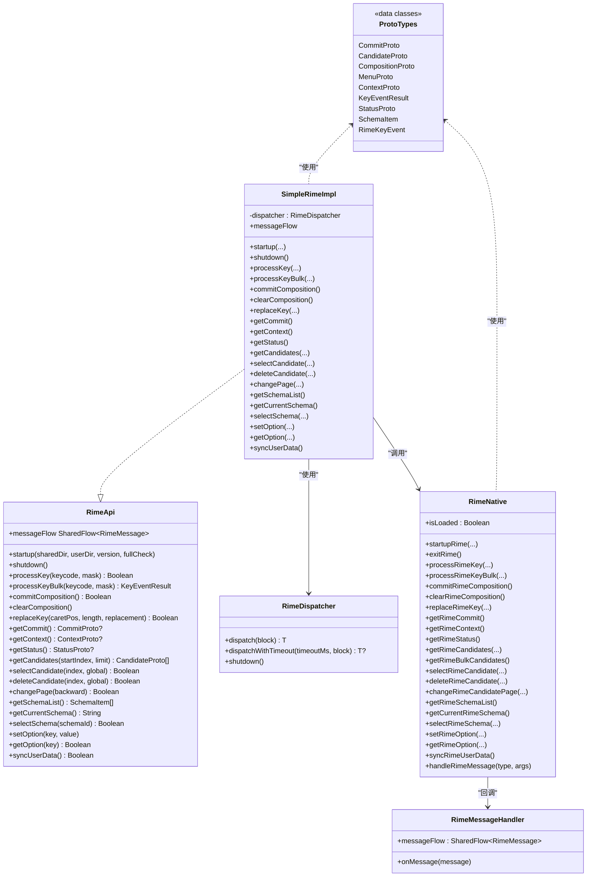
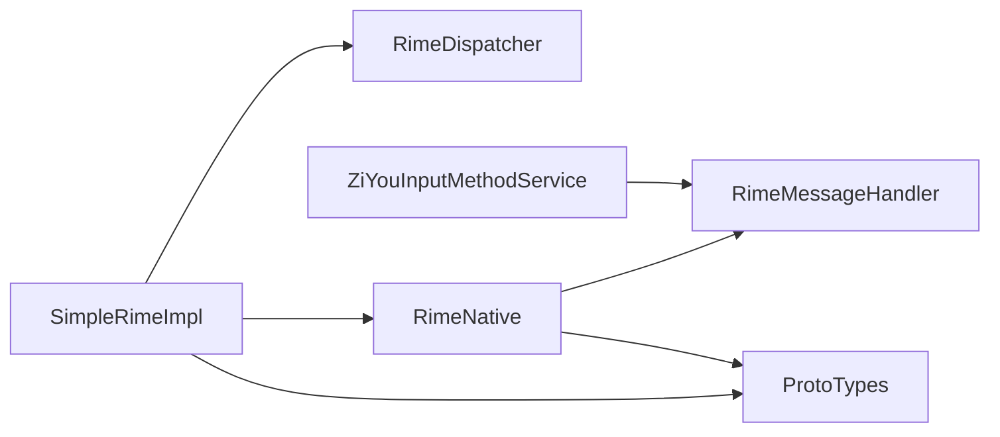

# Core API 接口设计

<cite>
**本文引用的文件**   
- [RimeApi.kt](file://app/src/main/java/com/ziyou/ime/core/RimeApi.kt)
- [SimpleRimeImpl.kt](file://app/src/main/java/com/ziyou/ime/core/SimpleRimeImpl.kt)
- [ProtoTypes.kt](file://app/src/main/java/com/ziyou/ime/core/ProtoTypes.kt)
- [RimeDispatcher.kt](file://app/src/main/java/com/ziyou/ime/core/RimeDispatcher.kt)
- [RimeNative.kt](file://app/src/main/java/com/ziyou/ime/core/RimeNative.kt)
- [RimeMessage.kt](file://app/src/main/java/com/ziyou/ime/core/RimeMessage.kt)
- [rime_jni.cc](file://app/src/main/jni/librime_jni/rime_jni.cc)
- [ZiYouInputMethodService.kt](file://app/src/main/java/com/ziyou/ime/ime/ZiYouInputMethodService.kt)
- [SimpleRimeImplTest.kt](file://app/src/test/java/com/ziyou/ime/core/SimpleRimeImplTest.kt)
</cite>

## 目录
1. [简介](#简介)
2. [项目结构](#项目结构)
3. [核心组件](#核心组件)
4. [架构总览](#架构总览)
5. [详细组件分析](#详细组件分析)
6. [依赖关系分析](#依赖关系分析)
7. [性能考量](#性能考量)
8. [故障排查指南](#故障排查指南)
9. [结论](#结论)
10. [附录：使用示例与最佳实践](#附录使用示例与最佳实践)

## 简介
本文件面向字由输入法 Core API 的设计与实现，聚焦以下目标：
- 解释 RimeApi 接口的设计原则与 suspend 异步模式、协程集成方式。
- 详解 SimpleRimeImpl 的具体实现、业务逻辑与错误处理策略。
- 梳理 ProtoTypes 数据模型（CommitProto、ContextProto、CandidateProto 等）的结构与用途。
- 说明批量 API processKeyBulk 的优化策略，如何通过单次引擎调度减少 JNI 跨界开销。
- 描述消息流 SharedFlow 的实现机制，用于处理 librime 通知回调。
- 提供完整的使用示例，展示输入处理、状态查询、候选操作等典型用法。

## 项目结构
Core API 位于 app 模块的 core 包中，围绕 Rime 引擎封装了 Kotlin 层接口、线程调度、JNI 桥接与消息分发；JNI 层在 C++ 中实现 librime 调用与对象转换；输入法服务通过 SharedFlow 订阅引擎消息并驱动 UI。

图表来源
- [RimeApi.kt:1-105](file://app/src/main/java/com/ziyou/ime/core/RimeApi.kt#L1-L105)
- [SimpleRimeImpl.kt:1-177](file://app/src/main/java/com/ziyou/ime/core/SimpleRimeImpl.kt#L1-L177)
- [RimeDispatcher.kt:1-91](file://app/src/main/java/com/ziyou/ime/core/RimeDispatcher.kt#L1-L91)
- [RimeNative.kt:1-170](file://app/src/main/java/com/ziyou/ime/core/RimeNative.kt#L1-L170)
- [RimeMessage.kt:1-42](file://app/src/main/java/com/ziyou/ime/core/RimeMessage.kt#L1-L42)
- [ProtoTypes.kt:1-108](file://app/src/main/java/com/ziyou/ime/core/ProtoTypes.kt#L1-L108)
- [rime_jni.cc:280-384](file://app/src/main/jni/librime_jni/rime_jni.cc#L280-L384)
- [ZiYouInputMethodService.kt:400-406](file://app/src/main/java/com/ziyou/ime/ime/ZiYouInputMethodService.kt#L400-L406)

章节来源
- [RimeApi.kt:1-105](file://app/src/main/java/com/ziyou/ime/core/RimeApi.kt#L1-L105)
- [SimpleRimeImpl.kt:1-177](file://app/src/main/java/com/ziyou/ime/core/SimpleRimeImpl.kt#L1-L177)
- [RimeDispatcher.kt:1-91](file://app/src/main/java/com/ziyou/ime/core/RimeDispatcher.kt#L1-L91)
- [RimeNative.kt:1-170](file://app/src/main/java/com/ziyou/ime/core/RimeNative.kt#L1-L170)
- [RimeMessage.kt:1-42](file://app/src/main/java/com/ziyou/ime/core/RimeMessage.kt#L1-L42)
- [ProtoTypes.kt:1-108](file://app/src/main/java/com/ziyou/ime/core/ProtoTypes.kt#L1-L108)
- [rime_jni.cc:280-384](file://app/src/main/jni/librime_jni/rime_jni.cc#L280-L384)
- [ZiYouInputMethodService.kt:400-406](file://app/src/main/java/com/ziyou/ime/ime/ZiYouInputMethodService.kt#L400-L406)

## 核心组件
- RimeApi：定义所有 suspend 函数式 API，涵盖生命周期、输入处理、状态查询、候选操作、方案管理、运行时选项、同步与消息流。默认实现将 processKeyBulk 组合为三次调用，生产实现通过 JNI 单次跨界返回三元组。
- SimpleRimeImpl：RimeApi 的具体实现，所有方法通过 RimeDispatcher 调度到单一线程执行，确保 librime 非线程安全的约束得到满足。
- RimeDispatcher：基于单线程 Executor 的协程调度器，保证所有 native 调用顺序执行，并提供超时与关闭保护。
- RimeNative：JNI 声明与消息入口，负责加载库、调用 native 方法、解析消息类型并广播到 SharedFlow。
- RimeMessage：消息模型与分发器，封装 schema/option/deploy 等通知，暴露 SharedFlow 供 UI 订阅。
- ProtoTypes：与 JNI 层 C++ Proto 一一对应的 Kotlin 数据结构，包括 CommitProto、ContextProto、CompositionProto、MenuProto、CandidateProto、StatusProto、SchemaItem、KeyEventResult、RimeKeyEvent。

章节来源
- [RimeApi.kt:1-105](file://app/src/main/java/com/ziyou/ime/core/RimeApi.kt#L1-L105)
- [SimpleRimeImpl.kt:1-177](file://app/src/main/java/com/ziyou/ime/core/SimpleRimeImpl.kt#L1-L177)
- [RimeDispatcher.kt:1-91](file://app/src/main/java/com/ziyou/ime/core/RimeDispatcher.kt#L1-L91)
- [RimeNative.kt:1-170](file://app/src/main/java/com/ziyou/ime/core/RimeNative.kt#L1-L170)
- [RimeMessage.kt:1-42](file://app/src/main/java/com/ziyou/ime/core/RimeMessage.kt#L1-L42)
- [ProtoTypes.kt:1-108](file://app/src/main/java/com/ziyou/ime/core/ProtoTypes.kt#L1-L108)

## 架构总览
下图展示了从上层输入事件到 librime 引擎，再到 UI 消息回传的完整链路，以及批量按键处理的优化路径。

图表来源
- [SimpleRimeImpl.kt:59-64](file://app/src/main/java/com/ziyou/ime/core/SimpleRimeImpl.kt#L59-L64)
- [RimeNative.kt:66-71](file://app/src/main/java/com/ziyou/ime/core/RimeNative.kt#L66-L71)
- [rime_jni.cc:363-384](file://app/src/main/jni/librime_jni/rime_jni.cc#L363-L384)
- [rime_jni.cc:288-315](file://app/src/main/jni/librime_jni/rime_jni.cc#L288-L315)
- [RimeMessage.kt:29-41](file://app/src/main/java/com/ziyou/ime/core/RimeMessage.kt#L29-L41)
- [ZiYouInputMethodService.kt:400-406](file://app/src/main/java/com/ziyou/ime/ime/ZiYouInputMethodService.kt#L400-L406)

## 详细组件分析

### RimeApi 接口设计原则
- 全 suspend 化：所有对外 API 均为挂起函数，调用方无需关心线程切换与阻塞。
- 职责清晰：按生命周期、输入处理、状态查询、候选操作、方案管理、运行时选项、同步、消息流分组。
- 默认实现可组合：processKeyBulk 默认以三次调用组合，便于测试与 Fake 实现；生产实现走 JNI 单次跨界。
- 消息流：messageFlow 暴露 SharedFlow，统一接收引擎通知。

章节来源
- [RimeApi.kt:10-104](file://app/src/main/java/com/ziyou/ime/core/RimeApi.kt#L10-L104)

### SimpleRimeImpl 实现要点
- 线程安全：所有方法通过 dispatcher.dispatch 委托到单线程执行，避免 librime 并发问题。
- 启动校验：startup 前检查 native 库是否加载，未加载抛出 IllegalStateException。
- 批量处理：processKeyBulk 调用 JNI 的 processRimeKeyBulk，并将原始数组解析为 KeyEventResult。
- 状态与候选：getCommit/getContext/getStatus/getCandidates/selectCandidate/deleteCandidate/changePage 等均经调度器转发。
- 方案与选项：getSchemaList/getCurrentSchema/selectSchema/setOption/getOption 均经调度器转发。
- 同步：syncUserData 经调度器转发。
- 消息流：messageFlow 直接返回 RimeMessageHandler.messageFlow。

章节来源
- [SimpleRimeImpl.kt:10-176](file://app/src/main/java/com/ziyou/ime/core/SimpleRimeImpl.kt#L10-L176)

### RimeDispatcher 调度器
- 单线程 Executor：创建守护线程“RimeDispatcher-Thread”，绑定 CoroutineDispatcher。
- dispatch：在专属线程执行 block，捕获异常并记录日志。
- dispatchWithTimeout：带超时的调度，超时返回 null。
- shutdown：释放线程资源，拒绝新任务。

章节来源
- [RimeDispatcher.kt:22-90](file://app/src/main/java/com/ziyou/ime/core/RimeDispatcher.kt#L22-L90)

### RimeNative JNI 桥接
- 库加载：init 块尝试 System.loadLibrary("rime_jni")，设置 isLoaded。
- 输入处理：processRimeKey/processRimeKeyBulk/commitRimeComposition/clearRimeComposition/replaceRimeKey。
- 状态获取：getRimeCommit/getRimeContext/getRimeStatus/getRimeCandidates/getRimeBulkCandidates。
- 候选操作：selectRimeCandidate/deleteRimeCandidate/changeRimeCandidatePage。
- 方案管理：getRimeSchemaList/getCurrentRimeSchema/selectRimeSchema。
- 运行时选项：setRimeOption/getRimeOption。
- 同步：syncRimeUserData。
- 消息回调：handleRimeMessage 解析 type 并构造 RimeMessage，交由 RimeMessageHandler 广播。

章节来源
- [RimeNative.kt:10-169](file://app/src/main/java/com/ziyou/ime/core/RimeNative.kt#L10-L169)

### rime_jni.cc 关键实现
- 引擎初始化：startup 设置环境变量、配置 traits、注册通知处理器、启动维护。
- 批量按键：processRimeKeyBulk 合并 process_key + get_commit + get_context，返回 Java 数组 [consumed, commit, context]。
- 通知回调：JNI_OnLoad 注册 notificationHandler，根据 message_type 映射 type(1/2/3)，调用 handleRimeMessage。
- 内存回收：trimNativeHeap 调用 mallopt(M_PURGE) 归还空闲页，降低部署后常驻占用。

章节来源
- [rime_jni.cc:280-315](file://app/src/main/jni/librime_jni/rime_jni.cc#L280-L315)
- [rime_jni.cc:363-384](file://app/src/main/jni/librime_jni/rime_jni.cc#L363-L384)
- [rime_jni.cc:334-343](file://app/src/main/jni/librime_jni/rime_jni.cc#L334-L343)

### ProtoTypes 数据模型
- CommitProto：已提交文本，包含 text 字段，提供无参构造函数供 JNI 创建。
- CandidateProto：候选词条目，包含 text/comment/label，重写 toString 便于调试。
- CompositionProto：编码区信息，包含长度、光标位置、选择区间、预编辑与预览文本。
- MenuProto：菜单（候选词列表），包含分页、高亮索引、候选数组、选择键与标签。
- ContextProto：输入上下文，包含 composition/menu/input/caretPos。
- KeyEventResult：一次按键的批量处理结果，包含 consumed/commit/context。
- StatusProto：输入法状态，包含 schemaId/schemaName/isDisabled/isComposing/isAsciiMode/isFullShape/isSimplified/isTraditional/isAsciiPunct。
- SchemaItem：方案列表项，包含 schemaId/name。
- RimeKeyEvent：备用按键事件，对应 JNI 层的 RimeKeyEvent。

章节来源
- [ProtoTypes.kt:10-108](file://app/src/main/java/com/ziyou/ime/core/ProtoTypes.kt#L10-L108)

### 消息流 SharedFlow 实现
- RimeMessage：密封类，包含 SchemaMessage/OptionMessage/DeployMessage/UnknownMessage。
- RimeMessageHandler：内部 MutableSharedFlow，replay=1，extraBufferCapacity=16，对外暴露不可变 SharedFlow。
- 回调路径：JNI 通知 -> RimeNative.handleRimeMessage -> RimeMessageHandler.onMessage -> SharedFlow 广播 -> UI 订阅消费。

章节来源
- [RimeMessage.kt:11-41](file://app/src/main/java/com/ziyou/ime/core/RimeMessage.kt#L11-L41)
- [RimeNative.kt:158-168](file://app/src/main/java/com/ziyou/ime/core/RimeNative.kt#L158-L168)
- [ZiYouInputMethodService.kt:400-406](file://app/src/main/java/com/ziyou/ime/ime/ZiYouInputMethodService.kt#L400-L406)

### 批量 API processKeyBulk 优化策略
- 目标：减少 JNI 跨界次数与线程往返，提升热路径吞吐。
- 实现：C++ 层一次性调用 librime 的 process_key、get_commit、get_context，组装为 Java 数组返回。
- Kotlin 层：SimpleRimeImpl.parseBulkResult 将原始数组解析为 KeyEventResult，未消费时 commit/context 为 null。
- 默认实现：RimeApi 默认实现以 processKey + getCommit + getContext 组合，便于测试与 Fake；生产实现走 JNI 单次跨界。

图表来源
- [SimpleRimeImpl.kt:59-64](file://app/src/main/java/com/ziyou/ime/core/SimpleRimeImpl.kt#L59-L64)
- [SimpleRimeImpl.kt:23-27](file://app/src/main/java/com/ziyou/ime/core/SimpleRimeImpl.kt#L23-L27)
- [RimeApi.kt:36-40](file://app/src/main/java/com/ziyou/ime/core/RimeApi.kt#L36-L40)
- [rime_jni.cc:363-384](file://app/src/main/jni/librime_jni/rime_jni.cc#L363-L384)

章节来源
- [RimeApi.kt:36-40](file://app/src/main/java/com/ziyou/ime/core/RimeApi.kt#L36-L40)
- [SimpleRimeImpl.kt:23-27](file://app/src/main/java/com/ziyou/ime/core/SimpleRimeImpl.kt#L23-L27)
- [SimpleRimeImpl.kt:59-64](file://app/src/main/java/com/ziyou/ime/core/SimpleRimeImpl.kt#L59-L64)
- [rime_jni.cc:363-384](file://app/src/main/jni/librime_jni/rime_jni.cc#L363-L384)

### 类图（代码级关系）

图表来源
- [RimeApi.kt:10-104](file://app/src/main/java/com/ziyou/ime/core/RimeApi.kt#L10-L104)
- [SimpleRimeImpl.kt:10-176](file://app/src/main/java/com/ziyou/ime/core/SimpleRimeImpl.kt#L10-L176)
- [RimeDispatcher.kt:22-90](file://app/src/main/java/com/ziyou/ime/core/RimeDispatcher.kt#L22-L90)
- [RimeNative.kt:10-169](file://app/src/main/java/com/ziyou/ime/core/RimeNative.kt#L10-L169)
- [RimeMessage.kt:29-41](file://app/src/main/java/com/ziyou/ime/core/RimeMessage.kt#L29-L41)
- [ProtoTypes.kt:10-108](file://app/src/main/java/com/ziyou/ime/core/ProtoTypes.kt#L10-L108)

## 依赖关系分析
- SimpleRimeImpl 依赖 RimeDispatcher 与 RimeNative。
- RimeNative 依赖 JNI 层（rime_jni.cc）与 RimeMessageHandler。
- ZiYouInputMethodService 订阅 RimeMessageHandler 的 SharedFlow，并根据消息类型更新 UI 或触发重同步。
- ProtoTypes 被 SimpleRimeImpl 与 RimeNative 共同使用，作为 Kotlin 与 C++ 之间的数据契约。

图表来源
- [SimpleRimeImpl.kt:10-176](file://app/src/main/java/com/ziyou/ime/core/SimpleRimeImpl.kt#L10-L176)
- [RimeNative.kt:10-169](file://app/src/main/java/com/ziyou/ime/core/RimeNative.kt#L10-L169)
- [RimeMessage.kt:29-41](file://app/src/main/java/com/ziyou/ime/core/RimeMessage.kt#L29-L41)
- [ProtoTypes.kt:10-108](file://app/src/main/java/com/ziyou/ime/core/ProtoTypes.kt#L10-L108)

章节来源
- [SimpleRimeImpl.kt:10-176](file://app/src/main/java/com/ziyou/ime/core/SimpleRimeImpl.kt#L10-L176)
- [RimeNative.kt:10-169](file://app/src/main/java/com/ziyou/ime/core/RimeNative.kt#L10-L169)
- [RimeMessage.kt:29-41](file://app/src/main/java/com/ziyou/ime/core/RimeMessage.kt#L29-L41)
- [ProtoTypes.kt:10-108](file://app/src/main/java/com/ziyou/ime/core/ProtoTypes.kt#L10-L108)

## 性能考量
- 批量按键：processKeyBulk 将 process_key + get_commit + get_context 合并为单次 JNI 跨界，显著减少跨进程/线程开销。
- 单线程调度：RimeDispatcher 保证 librime 调用顺序执行，避免锁竞争与数据竞争。
- 内存回收：部署完成后调用 trimNativeHeap 归还空闲页，降低常驻内存与 zRAM 换出。
- 流式消息：SharedFlow replay=1 且额外缓冲容量适中，避免重复消费与背压问题。

章节来源
- [rime_jni.cc:363-384](file://app/src/main/jni/librime_jni/rime_jni.cc#L363-L384)
- [RimeDispatcher.kt:22-90](file://app/src/main/java/com/ziyou/ime/core/RimeDispatcher.kt#L22-L90)
- [rime_jni.cc:334-343](file://app/src/main/jni/librime_jni/rime_jni.cc#L334-L343)
- [RimeMessage.kt:30-36](file://app/src/main/java/com/ziyou/ime/core/RimeMessage.kt#L30-L36)

## 故障排查指南
- Native 库未加载：startup 会抛出 IllegalStateException，检查 ABI 匹配与 .so 文件是否存在。
- UnsatisfiedLinkError：单元测试中常见，确认调用路径确实经过 RimeDispatcher 线程。
- 消息未到达 UI：检查 RimeMessageHandler 的 onMessage 是否被调用，确认 SharedFlow 订阅是否在正确作用域内。
- 候选/状态为空：确认 processKey 是否被引擎消费；未被消费时 commit/context 为 null 属正常。
- 部署后状态不一致：收到 DeployMessage 后应触发重同步，确保方案与选项一致。

章节来源
- [SimpleRimeImpl.kt:32-42](file://app/src/main/java/com/ziyou/ime/core/SimpleRimeImpl.kt#L32-L42)
- [SimpleRimeImplTest.kt:130-144](file://app/src/test/java/com/ziyou/ime/core/SimpleRimeImplTest.kt#L130-L144)
- [ZiYouInputMethodService.kt:1474-1516](file://app/src/main/java/com/ziyou/ime/ime/ZiYouInputMethodService.kt#L1474-L1516)

## 结论
Core API 通过清晰的接口设计、严格的线程调度与高效的 JNI 批量化，实现了高性能、易用的 Rime 引擎封装。消息流机制使 UI 能够实时响应引擎状态变化，整体架构兼顾稳定性与扩展性。

## 附录：使用示例与最佳实践
以下为典型使用流程（以步骤形式呈现，不粘贴具体代码）：
- 启动引擎
  - 调用 startup(sharedDir, userDir, version, fullCheck)。
  - 若 native 库未加载，将抛出异常，需先确保库加载成功。
- 输入处理（推荐批量）
  - 调用 processKeyBulk(keycode, mask) 获取 KeyEventResult。
  - 若 consumed 为 true，则使用 commit 上屏；否则使用 context 更新编码区与候选。
- 状态查询
  - 使用 getCommit()/getContext()/getStatus() 获取当前状态。
  - 使用 getCandidates(startIndex, limit) 获取候选列表。
- 候选操作
  - selectCandidate(index, global) 选择候选词。
  - deleteCandidate(index, global) 删除候选词。
  - changePage(backward) 翻页。
- 方案与选项
  - getSchemaList()/getCurrentSchema()/selectSchema(schemaId) 管理方案。
  - setOption(key, value)/getOption(key) 控制运行时选项。
- 同步用户数据
  - syncUserData() 同步用户词典与配置。
- 订阅消息流
  - 订阅 messageFlow，处理 OptionMessage/SchemaMessage/DeployMessage，更新 UI 或触发重同步。

章节来源
- [RimeApi.kt:21-104](file://app/src/main/java/com/ziyou/ime/core/RimeApi.kt#L21-L104)
- [SimpleRimeImpl.kt:32-176](file://app/src/main/java/com/ziyou/ime/core/SimpleRimeImpl.kt#L32-L176)
- [ZiYouInputMethodService.kt:400-406](file://app/src/main/java/com/ziyou/ime/ime/ZiYouInputMethodService.kt#L400-L406)
- [ZiYouInputMethodService.kt:1474-1516](file://app/src/main/java/com/ziyou/ime/ime/ZiYouInputMethodService.kt#L1474-L1516)