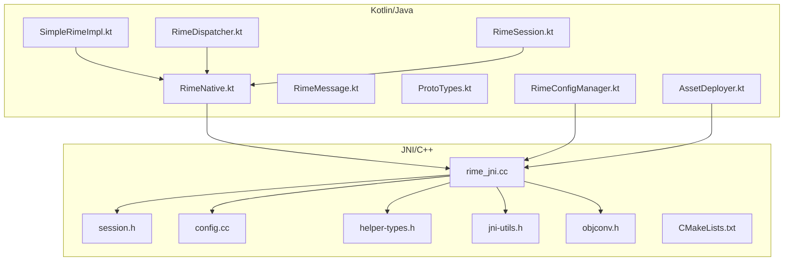
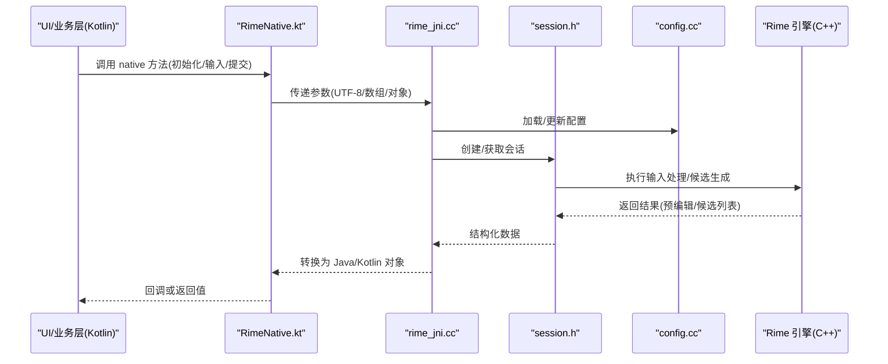
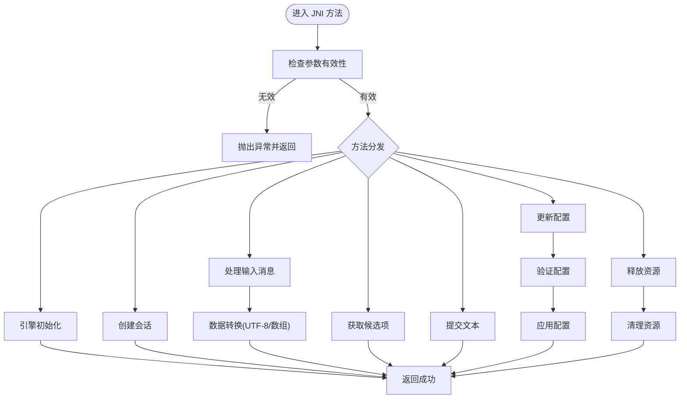
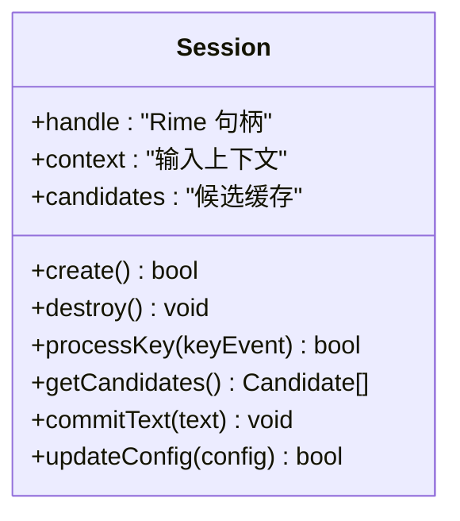
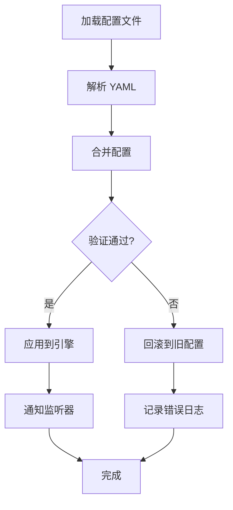
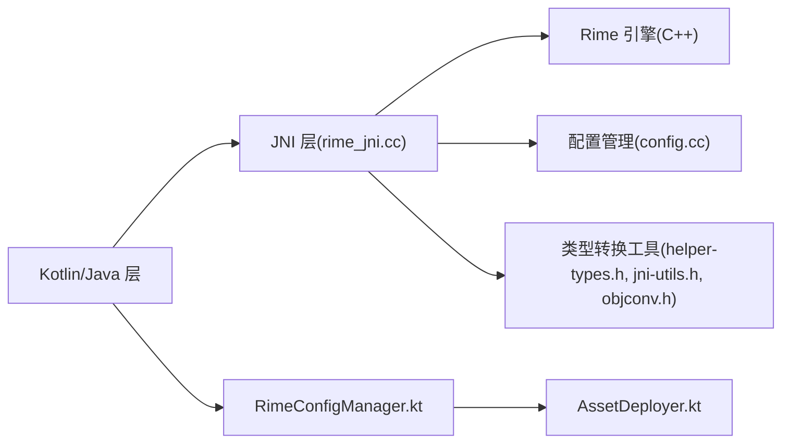

# JNI 接口层

<cite>
**本文引用的文件**   
- [rime_jni.cc](file://app/src/main/jni/librime_jni/rime_jni.cc)
- [session.h](file://app/src/main/jni/librime_jni/session.h)
- [config.cc](file://app/src/main/jni/librime_jni/config.cc)
- [helper-types.h](file://app/src/main/jni/librime_jni/helper-types.h)
- [jni-utils.h](file://app/src/main/jni/librime_jni/jni-utils.h)
- [objconv.h](file://app/src/main/jni/librime_jni/objconv.h)
- [CMakeLists.txt](file://app/src/main/jni/librime_jni/CMakeLists.txt)
- [RimeNative.kt](file://app/src/main/java/com/ziyou/ime/core/RimeNative.kt)
- [SimpleRimeImpl.kt](file://app/src/main/java/com/ziyou/ime/core/SimpleRimeImpl.kt)
- [RimeDispatcher.kt](file://app/src/main/java/com/ziyou/ime/core/RimeDispatcher.kt)
- [RimeMessage.kt](file://app/src/main/java/com/ziyou/ime/core/RimeMessage.kt)
- [ProtoTypes.kt](file://app/src/main/java/com/ziyou/ime/core/ProtoTypes.kt)
- [RimeSession.kt](file://app/src/main/java/com/ziyou/ime/daemon/RimeSession.kt)
- [RimeConfigManager.kt](file://app/src/main/java/com/ziyou/ime/config/RimeConfigManager.kt)
- [AssetDeployer.kt](file://app/src/main/java/com/ziyou/ime/config/AssetDeployer.kt)
</cite>

## 目录
1. [简介](#简介)
2. [项目结构](#项目结构)
3. [核心组件](#核心组件)
4. [架构总览](#架构总览)
5. [详细组件分析](#详细组件分析)
6. [依赖关系分析](#依赖关系分析)
7. [性能考虑](#性能考虑)
8. [故障排查指南](#故障排查指南)
9. [结论](#结论)
10. [附录](#附录)

## 简介
本技术文档聚焦于输入法项目的 JNI 接口层，系统性阐述 C++ 与 Java/Kotlin 之间的数据绑定机制、原生方法声明与实现、数据类型转换（字符串、数组、对象等）、内存管理策略与异常处理。重点解析 rime_jni.cc 中的核心函数实现（引擎初始化、会话创建、消息处理、资源释放），说明 session.h 的会话封装设计，以及 config.cc 的配置加载与管理机制。同时提供 JNI 调用的性能优化技巧与常见问题排查方法，并给出调试指南与代码示例路径。

## 项目结构
JNI 相关源码位于 app/src/main/jni/librime_jni 目录，包含 C++ 实现与构建脚本；Java/Kotlin 侧通过 RimeNative.kt 暴露 native 方法，并由 SimpleRimeImpl.kt、RimeDispatcher.kt、RimeSession.kt 等模块协同完成调用编排与状态管理。配置与资源部署由 RimeConfigManager.kt 与 AssetDeployer.kt 负责。

**图表来源** 
- [rime_jni.cc](file://app/src/main/jni/librime_jni/rime_jni.cc)
- [session.h](file://app/src/main/jni/librime_jni/session.h)
- [config.cc](file://app/src/main/jni/librime_jni/config.cc)
- [helper-types.h](file://app/src/main/jni/librime_jni/helper-types.h)
- [jni-utils.h](file://app/src/main/jni/librime_jni/jni-utils.h)
- [objconv.h](file://app/src/main/jni/librime_jni/objconv.h)
- [CMakeLists.txt](file://app/src/main/jni/librime_jni/CMakeLists.txt)
- [RimeNative.kt](file://app/src/main/java/com/ziyou/ime/core/RimeNative.kt)
- [SimpleRimeImpl.kt](file://app/src/main/java/com/ziyou/ime/core/SimpleRimeImpl.kt)
- [RimeDispatcher.kt](file://app/src/main/java/com/ziyou/ime/core/RimeDispatcher.kt)
- [RimeSession.kt](file://app/src/main/java/com/ziyou/ime/daemon/RimeSession.kt)
- [RimeMessage.kt](file://app/src/main/java/com/ziyou/ime/core/RimeMessage.kt)
- [ProtoTypes.kt](file://app/src/main/java/com/ziyou/ime/core/ProtoTypes.kt)
- [RimeConfigManager.kt](file://app/src/main/java/com/ziyou/ime/config/RimeConfigManager.kt)
- [AssetDeployer.kt](file://app/src/main/java/com/ziyou/ime/config/AssetDeployer.kt)

**章节来源**
- [rime_jni.cc](file://app/src/main/jni/librime_jni/rime_jni.cc)
- [session.h](file://app/src/main/jni/librime_jni/session.h)
- [config.cc](file://app/src/main/jni/librime_jni/config.cc)
- [helper-types.h](file://app/src/main/jni/librime_jni/helper-types.h)
- [jni-utils.h](file://app/src/main/jni/librime_jni/jni-utils.h)
- [objconv.h](file://app/src/main/jni/librime_jni/objconv.h)
- [CMakeLists.txt](file://app/src/main/jni/librime_jni/CMakeLists.txt)
- [RimeNative.kt](file://app/src/main/java/com/ziyou/ime/core/RimeNative.kt)
- [SimpleRimeImpl.kt](file://app/src/main/java/com/ziyou/ime/core/SimpleRimeImpl.kt)
- [RimeDispatcher.kt](file://app/src/main/java/com/ziyou/ime/core/RimeDispatcher.kt)
- [RimeSession.kt](file://app/src/main/java/com/ziyou/ime/daemon/RimeSession.kt)
- [RimeMessage.kt](file://app/src/main/java/com/ziyou/ime/core/RimeMessage.kt)
- [ProtoTypes.kt](file://app/src/main/java/com/ziyou/ime/core/ProtoTypes.kt)
- [RimeConfigManager.kt](file://app/src/main/java/com/ziyou/ime/config/RimeConfigManager.kt)
- [AssetDeployer.kt](file://app/src/main/java/com/ziyou/ime/config/AssetDeployer.kt)

## 核心组件
- JNI 入口与桥接：rime_jni.cc 暴露 native 方法，负责 Rime 引擎生命周期管理、会话创建与销毁、输入消息处理、候选项与预编辑文本返回、配置读写等。
- 会话封装：session.h 定义会话对象的 C++ 封装，持有 Rime 句柄与上下文，提供统一 API 供 JNI 层调用。
- 配置管理：config.cc 负责配置文件加载、校验、合并与持久化，为引擎运行提供必要参数。
- 类型转换与工具：helper-types.h、jni-utils.h、objconv.h 提供 JNI 类型转换、UTF-8 编解码、对象映射与错误传播工具。
- Kotlin/Java 侧：RimeNative.kt 声明 native 方法；SimpleRimeImpl.kt 实现具体调用逻辑；RimeDispatcher.kt 负责事件分发；RimeSession.kt 维护会话状态；RimeMessage.kt 与 ProtoTypes.kt 定义消息与数据结构。

**章节来源**
- [rime_jni.cc](file://app/src/main/jni/librime_jni/rime_jni.cc)
- [session.h](file://app/src/main/jni/librime_jni/session.h)
- [config.cc](file://app/src/main/jni/librime_jni/config.cc)
- [helper-types.h](file://app/src/main/jni/librime_jni/helper-types.h)
- [jni-utils.h](file://app/src/main/jni/librime_jni/jni-utils.h)
- [objconv.h](file://app/src/main/jni/librime_jni/objconv.h)
- [RimeNative.kt](file://app/src/main/java/com/ziyou/ime/core/RimeNative.kt)
- [SimpleRimeImpl.kt](file://app/src/main/java/com/ziyou/ime/core/SimpleRimeImpl.kt)
- [RimeDispatcher.kt](file://app/src/main/java/com/ziyou/ime/core/RimeDispatcher.kt)
- [RimeSession.kt](file://app/src/main/java/com/ziyou/ime/daemon/RimeSession.kt)
- [RimeMessage.kt](file://app/src/main/java/com/ziyou/ime/core/RimeMessage.kt)
- [ProtoTypes.kt](file://app/src/main/java/com/ziyou/ime/core/ProtoTypes.kt)

## 架构总览
整体架构采用“Kotlin/Java 控制层 + JNI 桥接 + C++ Rime 引擎”的分层模式。Kotlin 层负责 UI 交互与业务编排，JNI 层负责与 Rime 引擎交互，C++ 层提供高性能输入处理与候选生成。

**图表来源** 
- [RimeNative.kt](file://app/src/main/java/com/ziyou/ime/core/RimeNative.kt)
- [rime_jni.cc](file://app/src/main/jni/librime_jni/rime_jni.cc)
- [session.h](file://app/src/main/jni/librime_jni/session.h)
- [config.cc](file://app/src/main/jni/librime_jni/config.cc)

## 详细组件分析

### rime_jni.cc：JNI 入口与核心流程
- 引擎初始化：负责设置 Rime 工作目录、加载插件、初始化全局状态。
- 会话管理：创建/销毁会话，维护会话 ID 与句柄映射。
- 消息处理：接收键值事件，调用 Rime API 进行分词、翻译、过滤，返回预编辑文本与候选项。
- 配置读写：读取/写入 YAML 配置，支持热更新与回滚。
- 资源释放：确保所有动态分配内存与句柄正确释放，避免泄漏。

**图表来源** 
- [rime_jni.cc](file://app/src/main/jni/librime_jni/rime_jni.cc)

**章节来源**
- [rime_jni.cc](file://app/src/main/jni/librime_jni/rime_jni.cc)

### session.h：会话对象封装设计
- 会话生命周期：构造时初始化 Rime 上下文，析构时释放资源。
- 状态隔离：每个会话独立维护输入状态、候选缓存、历史上下文。
- 线程安全：提供同步访问接口，避免多线程竞争。
- 错误处理：内部捕获异常并转换为可传播的错误码。

**图表来源** 
- [session.h](file://app/src/main/jni/librime_jni/session.h)

**章节来源**
- [session.h](file://app/src/main/jni/librime_jni/session.h)

### config.cc：配置文件加载与管理
- 配置加载：从 assets 或文件系统读取 YAML 配置，解析为内部结构。
- 配置合并：支持多配置文件合并与优先级覆盖。
- 校验与回滚：验证配置合法性，失败时回滚到上一版本。
- 热更新：运行时更新配置并通知引擎重新加载。

**图表来源** 
- [config.cc](file://app/src/main/jni/librime_jni/config.cc)

**章节来源**
- [config.cc](file://app/src/main/jni/librime_jni/config.cc)

### 类型转换与工具：helper-types.h、jni-utils.h、objconv.h
- UTF-8 编解码：在 JNI 边界安全转换 Java String 与 C++ std::string。
- 数组映射：将 Java 数组与 C++ 容器互转，支持基本类型与对象引用。
- 对象映射：将 C++ 结构体映射为 Java/Kotlin 对象，避免频繁 GC。
- 错误传播：将 C++ 异常转换为 Java 异常，便于上层捕获。

**章节来源**
- [helper-types.h](file://app/src/main/jni/librime_jni/helper-types.h)
- [jni-utils.h](file://app/src/main/jni/librime_jni/jni-utils.h)
- [objconv.h](file://app/src/main/jni/librime_jni/objconv.h)

### Kotlin/Java 侧：RimeNative.kt、SimpleRimeImpl.kt、RimeDispatcher.kt、RimeSession.kt
- RimeNative.kt：声明 native 方法，定义 JNI 接口契约。
- SimpleRimeImpl.kt：实现具体调用逻辑，处理参数序列化与结果反序列化。
- RimeDispatcher.kt：分发输入事件，协调多个会话与线程。
- RimeSession.kt：维护会话状态，提供高层 API 给 UI 层使用。
- RimeMessage.kt 与 ProtoTypes.kt：定义消息结构与数据协议。

**章节来源**
- [RimeNative.kt](file://app/src/main/java/com/ziyou/ime/core/RimeNative.kt)
- [SimpleRimeImpl.kt](file://app/src/main/java/com/ziyou/ime/core/SimpleRimeImpl.kt)
- [RimeDispatcher.kt](file://app/src/main/java/com/ziyou/ime/core/RimeDispatcher.kt)
- [RimeSession.kt](file://app/src/main/java/com/ziyou/ime/daemon/RimeSession.kt)
- [RimeMessage.kt](file://app/src/main/java/com/ziyou/ime/core/RimeMessage.kt)
- [ProtoTypes.kt](file://app/src/main/java/com/ziyou/ime/core/ProtoTypes.kt)

## 依赖关系分析
JNI 层依赖 Rime 引擎库与系统 JNI 接口；Kotlin 层依赖 JNI 暴露的方法；配置与资源部署由独立模块管理。构建脚本 CMakeLists.txt 定义编译选项与链接依赖。

**图表来源** 
- [rime_jni.cc](file://app/src/main/jni/librime_jni/rime_jni.cc)
- [config.cc](file://app/src/main/jni/librime_jni/config.cc)
- [helper-types.h](file://app/src/main/jni/librime_jni/helper-types.h)
- [jni-utils.h](file://app/src/main/jni/librime_jni/jni-utils.h)
- [objconv.h](file://app/src/main/jni/librime_jni/objconv.h)
- [RimeConfigManager.kt](file://app/src/main/java/com/ziyou/ime/config/RimeConfigManager.kt)
- [AssetDeployer.kt](file://app/src/main/java/com/ziyou/ime/config/AssetDeployer.kt)

**章节来源**
- [CMakeLists.txt](file://app/src/main/jni/librime_jni/CMakeLists.txt)
- [rime_jni.cc](file://app/src/main/jni/librime_jni/rime_jni.cc)
- [config.cc](file://app/src/main/jni/librime_jni/config.cc)

## 性能考虑
- 减少 JNI 调用次数：批量处理输入事件，合并多次调用为单次 native 调用。
- 避免频繁对象创建：复用缓冲区与对象，减少 GC 压力。
- 使用直接内存：对于大数组传输，使用 DirectByteBuffer 避免拷贝。
- 异步处理：将耗时操作放入后台线程，避免阻塞 UI。
- 配置缓存：缓存已解析的配置，避免重复加载。
- 线程安全：确保会话对象线程安全，避免锁竞争。

[本节为通用指导，无需特定文件来源]

## 故障排查指南
- 崩溃定位：使用 ndk-stack 分析崩溃堆栈，结合日志定位问题。
- 内存泄漏：使用 LeakCanary 或 Valgrind 检测内存泄漏。
- 配置错误：检查 YAML 语法与路径，启用详细日志输出。
- 类型转换异常：验证 UTF-8 编码与数组边界，添加断言检查。
- 线程问题：确保 JNI 调用在主线程或指定线程执行，避免竞态条件。

**章节来源**
- [rime_jni.cc](file://app/src/main/jni/librime_jni/rime_jni.cc)
- [config.cc](file://app/src/main/jni/librime_jni/config.cc)

## 结论
JNI 接口层作为 Kotlin/Java 与 Rime 引擎的桥梁，承担了数据转换、生命周期管理与性能优化的关键职责。通过合理的架构设计与实现细节，可实现高效稳定的输入法功能。建议持续关注内存管理、线程安全与错误处理，以提升系统可靠性与用户体验。

[本节为总结性内容，无需特定文件来源]

## 附录
- 调试技巧：启用 JNI 日志，使用 Android Studio 的 Native Debugging。
- 性能分析：使用 Perfetto 或 Systrace 分析 JNI 调用开销。
- 最佳实践：遵循命名规范，保持接口稳定，避免破坏性变更。

[本节为补充信息，无需特定文件来源]