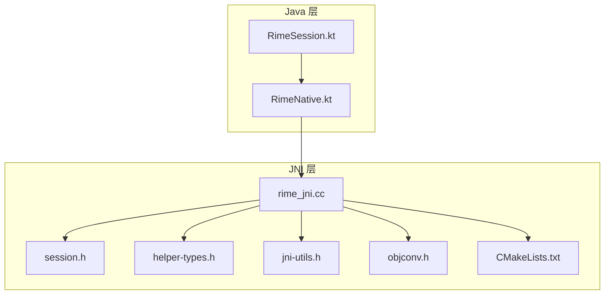
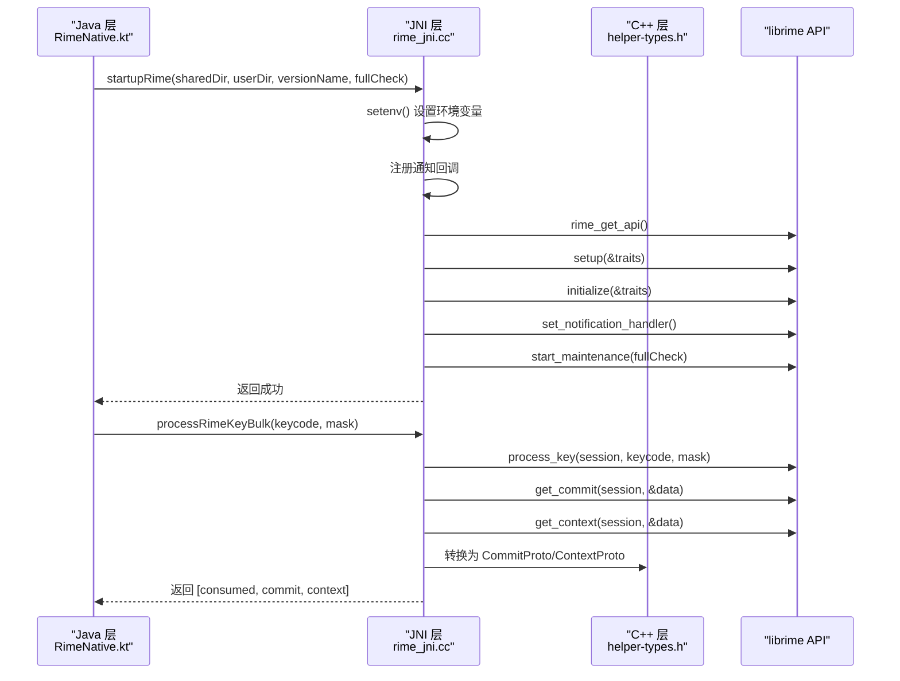
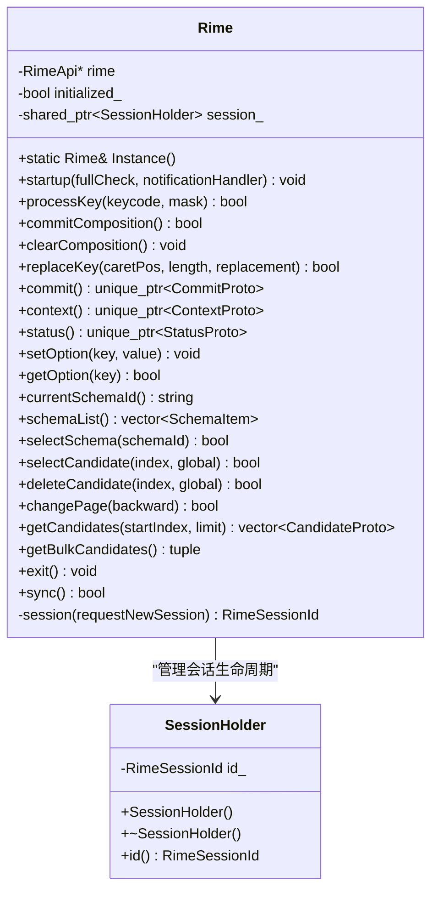
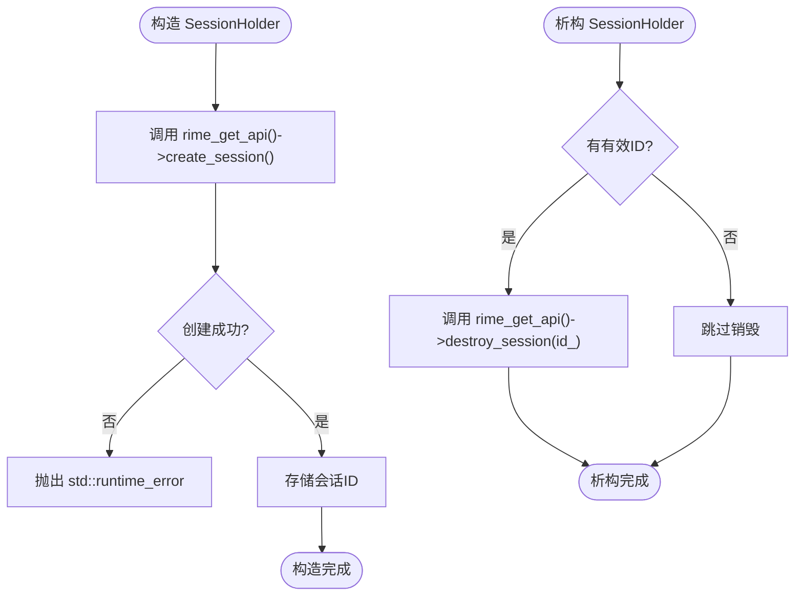
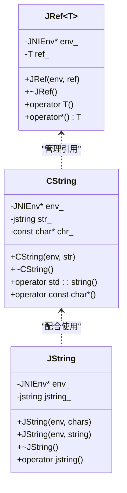
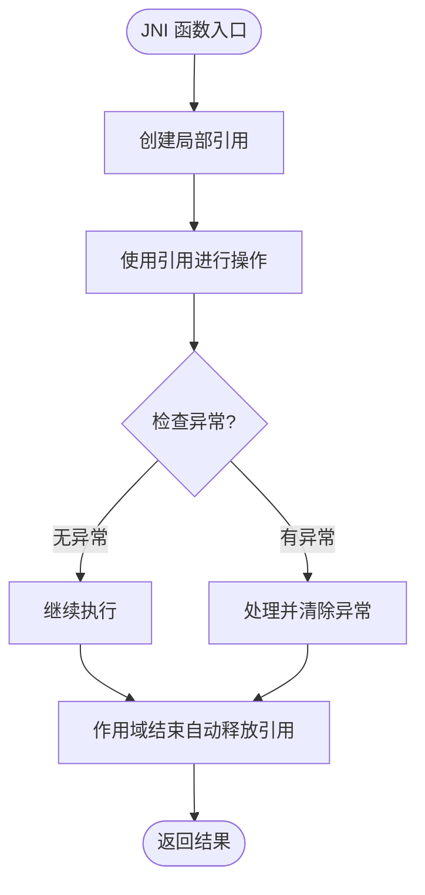
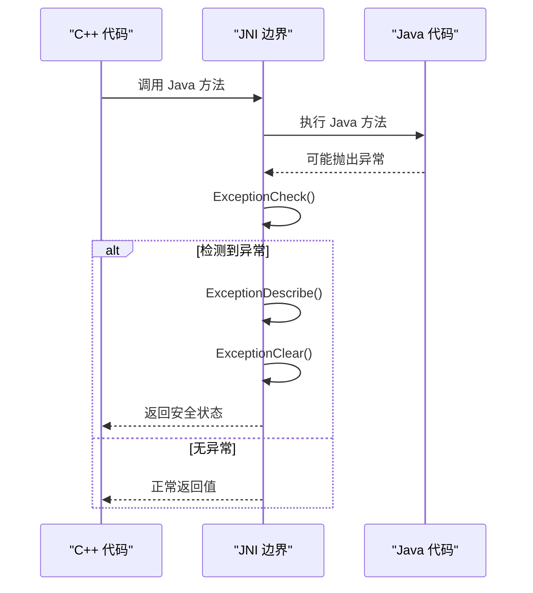
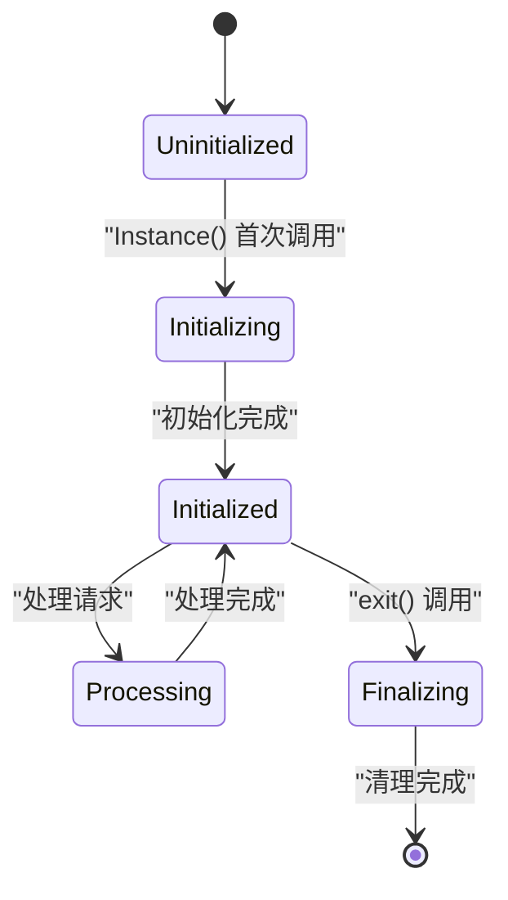
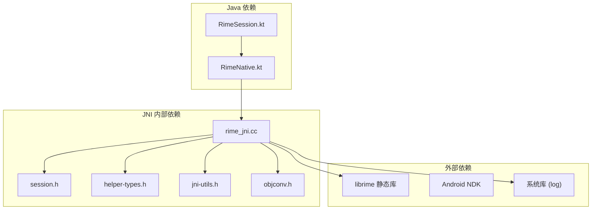

# JNI 桥接层实现

<cite>
**本文引用的文件**   
- [rime_jni.cc](file://app/src/main/jni/librime_jni/rime_jni.cc)
- [session.h](file://app/src/main/jni/librime_jni/session.h)
- [helper-types.h](file://app/src/main/jni/librime_jni/helper-types.h)
- [jni-utils.h](file://app/src/main/jni/librime_jni/jni-utils.h)
- [objconv.h](file://app/src/main/jni/librime_jni/objconv.h)
- [CMakeLists.txt](file://app/src/main/jni/librime_jni/CMakeLists.txt)
- [RimeNative.kt](file://app/src/main/java/com/ziyou/ime/core/RimeNative.kt)
- [RimeSession.kt](file://app/src/main/java/com/ziyou/ime/daemon/RimeSession.kt)
</cite>

## 目录
1. [简介](#简介)
2. [项目结构](#项目结构)
3. [核心组件](#核心组件)
4. [架构总览](#架构总览)
5. [详细组件分析](#详细组件分析)
6. [依赖关系分析](#依赖关系分析)
7. [性能考量](#性能考量)
8. [故障排查指南](#故障排查指南)
9. [结论](#结论)
10. [附录](#附录)

## 简介
本技术文档聚焦于 Android 输入法项目中 JNI 桥接层的实现，重点解析 rime_jni.cc 中的 C++ 单例模式、RAII 资源管理、Java 与 C++ 数据类型映射、内存管理策略（局部引用与全局引用）、JNI 异常处理机制、线程安全考虑，以及调用 librime API 的最佳实践。读者无需深入底层即可理解整体设计思想与关键实现细节。

## 项目结构
JNI 桥接层位于 app/src/main/jni/librime_jni 目录，包含：
- rime_jni.cc：JNI 导出函数、Rime 引擎单例封装、输入处理与输出获取等核心逻辑
- session.h：基于 RAII 的 Rime 会话生命周期管理
- helper-types.h：C++ 侧数据模型（CommitProto、ContextProto、StatusProto、CandidateProto 等）
- jni-utils.h：JNI 工具类（CString、JRef、JString、JEnv、GlobalRefSingleton）
- objconv.h：C++ 数据结构到 Java 对象的转换函数
- CMakeLists.txt：构建配置与可选模块开关

Java 侧对应接口在 com.ziyou.ime.core.RimeNative.kt，会话生命周期由 com.ziyou.ime.daemon.RimeSession.kt 统一管理。

**图表来源** 
- [rime_jni.cc:1-528](file://app/src/main/jni/librime_jni/rime_jni.cc#L1-L528)
- [session.h:1-36](file://app/src/main/jni/librime_jni/session.h#L1-L36)
- [helper-types.h:1-165](file://app/src/main/jni/librime_jni/helper-types.h#L1-L165)
- [jni-utils.h:1-209](file://app/src/main/jni/librime_jni/jni-utils.h#L1-L209)
- [objconv.h:1-126](file://app/src/main/jni/librime_jni/objconv.h#L1-L126)
- [CMakeLists.txt:1-78](file://app/src/main/jni/librime_jni/CMakeLists.txt#L1-L78)
- [RimeNative.kt:1-170](file://app/src/main/java/com/ziyou/ime/core/RimeNative.kt#L1-L170)
- [RimeSession.kt:1-226](file://app/src/main/java/com/ziyou/ime/daemon/RimeSession.kt#L1-L226)

**章节来源**
- [rime_jni.cc:1-528](file://app/src/main/jni/librime_jni/rime_jni.cc#L1-L528)
- [CMakeLists.txt:1-78](file://app/src/main/jni/librime_jni/CMakeLists.txt#L1-L78)

## 核心组件
- Rime 引擎单例：封装 librime API 初始化、启动、退出、选项设置、候选词操作等
- SessionHolder：RAII 会话管理，自动创建和销毁 Rime 会话
- JNI 工具集：字符串转换、局部引用管理、全局引用缓存、线程环境附加
- 数据模型转换：C++ Proto 对象与 Java 对象之间的双向转换
- 构建配置：条件编译与链接优化

**章节来源**
- [rime_jni.cc:46-265](file://app/src/main/jni/librime_jni/rime_jni.cc#L46-L265)
- [session.h:12-35](file://app/src/main/jni/librime_jni/session.h#L12-L35)
- [jni-utils.h:18-209](file://app/src/main/jni/librime_jni/jni-utils.h#L18-L209)
- [helper-types.h:16-165](file://app/src/main/jni/librime_jni/helper-types.h#L16-L165)
- [objconv.h:14-126](file://app/src/main/jni/librime_jni/objconv.h#L14-L126)

## 架构总览
JNI 桥接层采用分层设计：
- Java 层通过 RimeNative.kt 声明 native 方法
- JNI 层通过 rime_jni.cc 实现具体逻辑
- C++ 层使用 helper-types.h 定义数据模型
- 工具层提供 jni-utils.h 和 objconv.h 支持
- 构建层通过 CMakeLists.txt 管理依赖和编译选项

**图表来源** 
- [rime_jni.cc:280-315](file://app/src/main/jni/librime_jni/rime_jni.cc#L280-L315)
- [rime_jni.cc:366-384](file://app/src/main/jni/librime_jni/rime_jni.cc#L366-L384)
- [helper-types.h:35-165](file://app/src/main/jni/librime_jni/helper-types.h#L35-L165)

## 详细组件分析

### C++ 单例模式实现
Rime 类采用静态局部变量的单例模式，确保线程安全的延迟初始化：

**图表来源** 
- [rime_jni.cc:46-265](file://app/src/main/jni/librime_jni/rime_jni.cc#L46-L265)
- [session.h:12-35](file://app/src/main/jni/librime_jni/session.h#L12-L35)

**章节来源**
- [rime_jni.cc:52-55](file://app/src/main/jni/librime_jni/rime_jni.cc#L52-L55)
- [rime_jni.cc:245-264](file://app/src/main/jni/librime_jni/rime_jni.cc#L245-L264)

### RAII 资源管理机制
SessionHolder 类实现了完整的 RAII 模式：

**图表来源** 
- [session.h:14-29](file://app/src/main/jni/librime_jni/session.h#L14-L29)

**章节来源**
- [session.h:12-35](file://app/src/main/jni/librime_jni/session.h#L12-L35)

### Java 与 C++ 数据类型映射
JNI 层实现了完整的数据类型映射系统：

#### 基础类型映射
- jstring ↔ const char* (通过 CString 和 JString)
- jint ↔ int
- jboolean ↔ bool
- jobjectArray ↔ std::vector<std::string>

#### 复杂对象映射
- CommitProto ↔ Java CommitProto
- ContextProto ↔ Java ContextProto  
- StatusProto ↔ Java StatusProto
- CandidateProto ↔ Java CandidateProto

**图表来源** 
- [jni-utils.h:18-72](file://app/src/main/jni/librime_jni/jni-utils.h#L18-L72)

**章节来源**
- [jni-utils.h:18-72](file://app/src/main/jni/librime_jni/jni-utils.h#L18-L72)
- [objconv.h:14-126](file://app/src/main/jni/librime_jni/objconv.h#L14-L126)

### 内存管理策略
JNI 层采用严格的内存管理策略：

#### 局部引用管理
- 所有 JNI 局部引用通过 JRef<T> 模板类自动管理
- 构造函数时创建引用，析构时自动释放
- 避免手动调用 DeleteLocalRef

#### 全局引用缓存
- GlobalRefSingleton 缓存常用的 Java 类和 MethodID
- 减少重复查找开销，提高性能
- 在 JNI_OnLoad 中初始化

#### 字符串转换
- CString 类自动管理 GetStringUTFChars/ReleaseStringUTFChars
- JString 类自动管理 NewStringUTF/DeleteLocalRef

**图表来源** 
- [jni-utils.h:38-52](file://app/src/main/jni/librime_jni/jni-utils.h#L38-L52)
- [jni-utils.h:93-209](file://app/src/main/jni/librime_jni/jni-utils.h#L93-L209)

**章节来源**
- [jni-utils.h:38-52](file://app/src/main/jni/librime_jni/jni-utils.h#L38-L52)
- [jni-utils.h:93-209](file://app/src/main/jni/librime_jni/jni-utils.h#L93-L209)

### JNI 异常处理机制
JNI 层实现了完善的异常处理机制：

#### C++ 异常保护
- 会话创建时使用 try-catch 捕获异常
- 记录错误日志并设置安全状态

#### Java 异常检查
- 每次调用 Java 方法后检查异常状态
- 发现异常时描述并清除，防止崩溃

#### 错误传播
- C++ 异常不会跨越 JNI 边界
- 通过返回值和日志传递错误信息

**图表来源** 
- [rime_jni.cc:307-312](file://app/src/main/jni/librime_jni/rime_jni.cc#L307-L312)
- [rime_jni.cc:247-258](file://app/src/main/jni/librime_jni/rime_jni.cc#L247-L258)

**章节来源**
- [rime_jni.cc:307-312](file://app/src/main/jni/librime_jni/rime_jni.cc#L307-L312)
- [rime_jni.cc:247-258](file://app/src/main/jni/librime_jni/rime_jni.cc#L247-L258)

### 线程安全考虑
JNI 层实现了多线程安全机制：

#### 单例线程安全
- 使用静态局部变量确保线程安全的延迟初始化
- C++11 标准保证静态局部变量的线程安全

#### 线程环境管理
- JEnv 类自动附加当前线程到 JVM
- 避免跨线程访问导致的崩溃

#### 调度器隔离
- Java 层通过 RimeDispatcher 确保单线程调用
- 防止并发访问 librime 非线程安全 API

**图表来源** 
- [rime_jni.cc:52-55](file://app/src/main/jni/librime_jni/rime_jni.cc#L52-L55)
- [jni-utils.h:75-90](file://app/src/main/jni/librime_jni/jni-utils.h#L75-L90)

**章节来源**
- [rime_jni.cc:52-55](file://app/src/main/jni/librime_jni/rime_jni.cc#L52-L55)
- [jni-utils.h:75-90](file://app/src/main/jni/librime_jni/jni-utils.h#L75-L90)

### librime API 调用最佳实践
JNI 层展示了正确的 librime API 调用模式：

#### 初始化流程
1. 设置环境变量（共享目录、用户目录、版本信息）
2. 配置 RimeTraits
3. 调用 setup() 和 initialize()
4. 设置通知处理器
5. 启动维护任务

#### 输入处理流程
1. 调用 process_key() 处理按键
2. 根据返回值决定是否获取提交文本
3. 获取上下文信息用于 UI 更新
4. 正确处理内存释放

#### 错误检查模式
- 所有 API 调用后检查返回值
- 使用 RAII 对象管理临时内存
- 记录详细的错误日志

**章节来源**
- [rime_jni.cc:59-88](file://app/src/main/jni/librime_jni/rime_jni.cc#L59-L88)
- [rime_jni.cc:366-384](file://app/src/main/jni/librime_jni/rime_jni.cc#L366-L384)

## 依赖关系分析
JNI 层依赖关系清晰明确：

**图表来源** 
- [CMakeLists.txt:53-77](file://app/src/main/jni/librime_jni/CMakeLists.txt#L53-L77)
- [rime_jni.cc:7-17](file://app/src/main/jni/librime_jni/rime_jni.cc#L7-L17)

**章节来源**
- [CMakeLists.txt:1-78](file://app/src/main/jni/librime_jni/CMakeLists.txt#L1-L78)

## 性能考量
JNI 层实现了多项性能优化：

### 批量操作优化
- processRimeKeyBulk() 将多个 JNI 调用合并为单次跨界
- 减少 JNI 调用的开销，提升热路径性能

### 引用缓存
- GlobalRefSingleton 缓存常用类和 MethodID
- 避免重复查找带来的性能损耗

### 内存优化
- 预分配向量容量避免频繁重分配
- 使用移动语义减少拷贝开销
- mallopt M_PURGE 归还空闲页给系统

### 构建优化
- 启用死代码消除 (--gc-sections)
- 排除未使用的库 (--exclude-libs,ALL)
- 16KB 页面对齐满足 Android 15+ 要求

**章节来源**
- [rime_jni.cc:366-384](file://app/src/main/jni/librime_jni/rime_jni.cc#L366-L384)
- [rime_jni.cc:337-343](file://app/src/main/jni/librime_jni/rime_jni.cc#L337-L343)
- [CMakeLists.txt:55-60](file://app/src/main/jni/librime_jni/CMakeLists.txt#L55-L60)

## 故障排查指南

### 常见问题诊断
1. **JNI 库加载失败**
   - 检查 ABI 匹配性（仅支持 arm64-v8a）
   - 确认 .so 文件存在且可加载

2. **内存泄漏**
   - 检查是否正确使用 JRef 管理局部引用
   - 验证 CString 和 JString 是否正确释放

3. **线程安全问题**
   - 确保通过 RimeDispatcher 单线程调用
   - 避免跨线程访问 JNI 对象

4. **异常处理**
   - 检查 Java 层异常是否被正确捕获
   - 验证 C++ 异常不会跨越 JNI 边界

### 调试技巧
- 使用 __android_log_print 记录详细日志
- 启用 ASAN 检测内存问题
- 使用 Thread Profiler 分析线程行为

**章节来源**
- [RimeNative.kt:18-27](file://app/src/main/java/com/ziyou/ime/core/RimeNative.kt#L18-L27)
- [jni-utils.h:11-15](file://app/src/main/jni/librime_jni/jni-utils.h#L11-L15)

## 结论
JNI 桥接层实现了高质量的 C++/Java 互操作，具有以下特点：

1. **健壮的资源管理**：通过 RAII 和智能指针确保资源正确释放
2. **完善的异常处理**：C++ 异常不会跨越 JNI 边界，Java 异常被正确捕获
3. **高效的性能优化**：批量操作、引用缓存、内存优化等技术应用
4. **线程安全保障**：单例模式、线程环境管理、调度器隔离
5. **清晰的架构设计**：分层明确，职责单一，易于维护和扩展

该实现为输入法引擎提供了稳定可靠的 JNI 桥接层，确保了 Android 平台上的高性能输入体验。

## 附录

### 关键 API 参考
- **Rime 引擎生命周期**：startupRime(), exitRime(), syncRimeUserData()
- **输入处理**：processRimeKey(), processRimeKeyBulk(), commitRimeComposition()
- **状态获取**：getRimeCommit(), getRimeContext(), getRimeStatus()
- **候选词操作**：selectRimeCandidate(), deleteRimeCandidate(), changeRimeCandidatePage()
- **方案管理**：getRimeSchemaList(), selectRimeSchema(), getCurrentRimeSchema()

### 内存管理最佳实践
1. 始终使用 JRef<T> 管理 JNI 局部引用
2. 使用 CString 和 JString 进行字符串转换
3. 避免在 JNI 层持有长时间有效的 Java 引用
4. 定期检查内存使用情况，及时释放资源

**章节来源**
- [RimeNative.kt:44-149](file://app/src/main/java/com/ziyou/ime/core/RimeNative.kt#L44-L149)
- [jni-utils.h:18-72](file://app/src/main/jni/librime_jni/jni-utils.h#L18-L72)