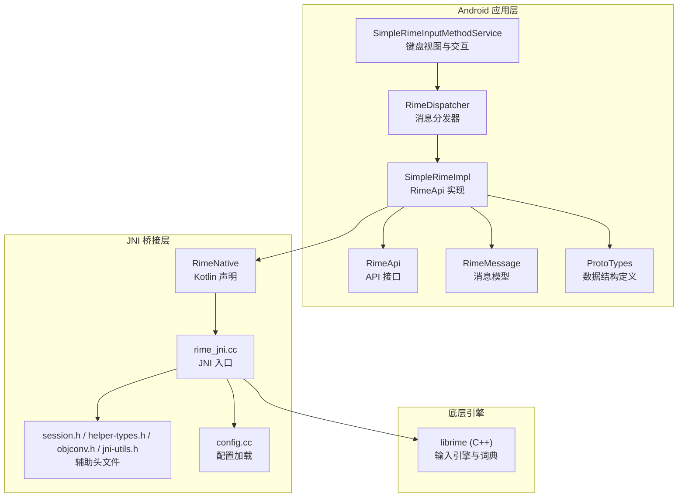
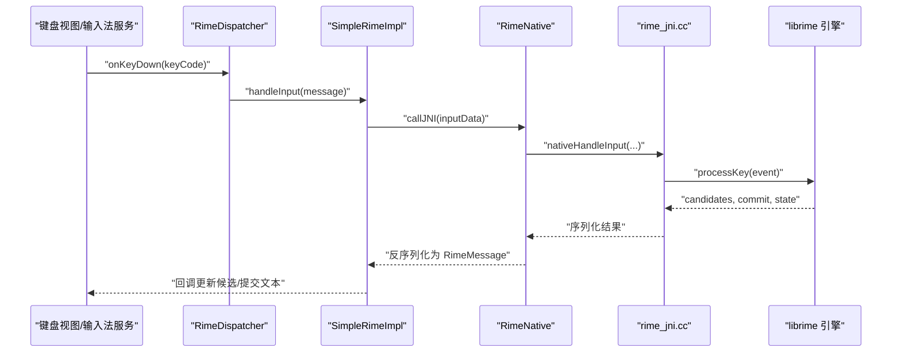
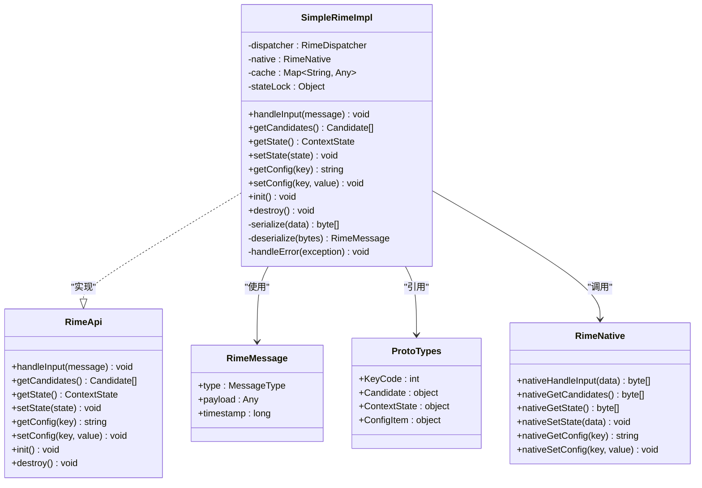
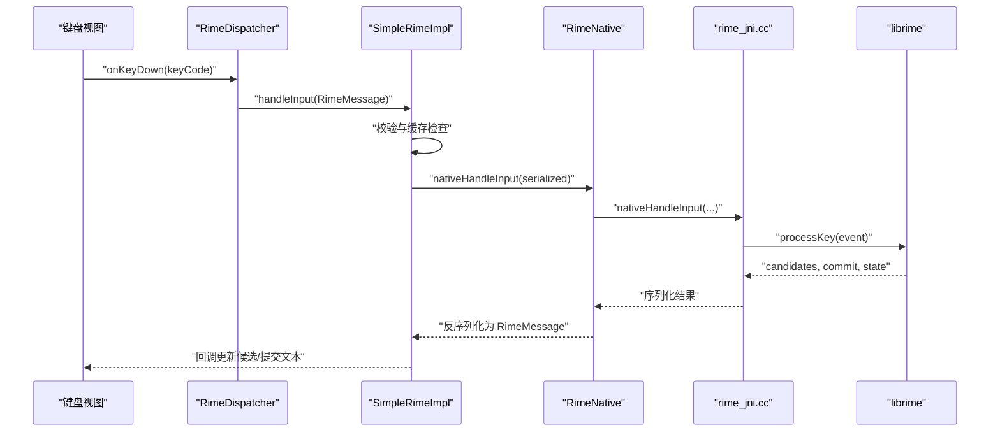
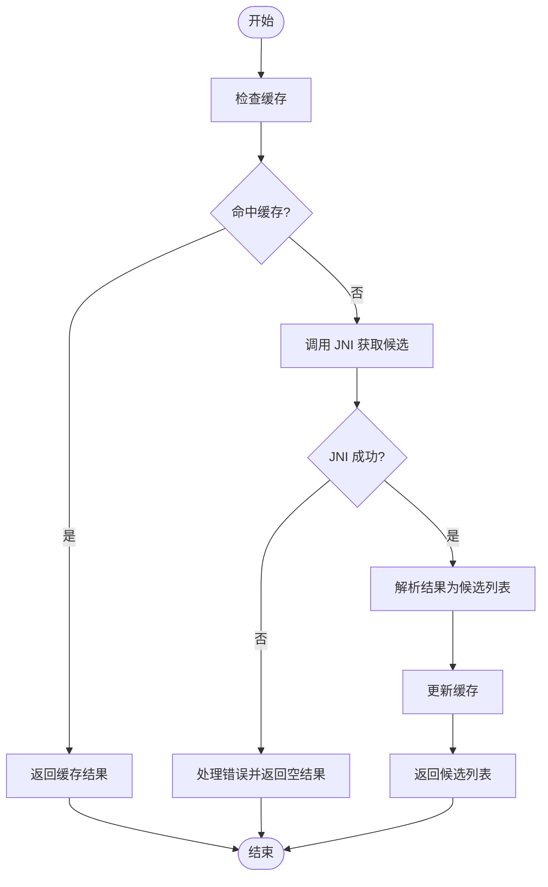
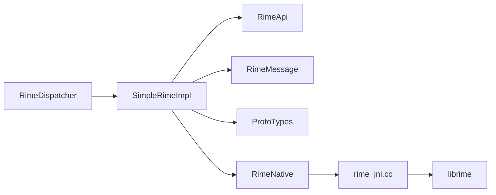

# Rime API 设计

<cite>
**本文引用的文件**   
- [RimeApi.kt](file://app/src/main/java/com/ziyou/ime/core/RimeApi.kt)
- [SimpleRimeImpl.kt](file://app/src/main/java/com/ziyou/ime/core/SimpleRimeImpl.kt)
- [RimeMessage.kt](file://app/src/main/java/com/ziyou/ime/core/RimeMessage.kt)
- [ProtoTypes.kt](file://app/src/main/java/com/ziyou/ime/core/ProtoTypes.kt)
- [RimeDispatcher.kt](file://app/src/main/java/com/ziyou/ime/core/RimeDispatcher.kt)
- [RimeNative.kt](file://app/src/main/java/com/ziyou/ime/core/RimeNative.kt)
- [RimeSession.kt](file://app/src/main/java/com/ziyou/ime/daemon/RimeSession.kt)
- [rime_jni.cc](file://app/src/main/jni/librime_jni/rime_jni.cc)
- [session.h](file://app/src/main/jni/librime_jni/session.h)
- [helper-types.h](file://app/src/main/jni/librime_jni/helper-types.h)
- [objconv.h](file://app/src/main/jni/librime_jni/objconv.h)
- [jni-utils.h](file://app/src/main/jni/librime_jni/jni-utils.h)
- [config.cc](file://app/src/main/jni/librime_jni/config.cc)
- [CMakeLists.txt](file://app/src/main/jni/librime_jni/CMakeLists.txt)
</cite>

## 目录
1. [简介](#简介)
2. [项目结构](#项目结构)
3. [核心组件](#核心组件)
4. [架构总览](#架构总览)
5. [详细组件分析](#详细组件分析)
6. [依赖关系分析](#依赖关系分析)
7. [性能考量](#性能考量)
8. [故障排查指南](#故障排查指南)
9. [结论](#结论)
10. [附录：API 使用示例与最佳实践](#附录api-使用示例与最佳实践)

## 简介
本技术文档围绕 Rime API 的设计与实现展开，重点解释以下方面：
- RimeApi 接口的设计模式与抽象层次，涵盖输入处理、候选词生成、状态管理等核心能力。
- SimpleRimeImpl 的具体实现策略，包括错误处理、线程安全、缓存机制与性能优化。
- RimeMessage 的消息传递协议设计，包括消息类型定义、序列化格式与异步处理机制。
- ProtoTypes 的数据结构定义与类型映射关系。
- JNI 层（rime_jni）与 C++ librime 的集成方式。
- API 的使用示例、最佳实践、扩展指南以及版本兼容性与迁移策略。

## 项目结构
本项目采用分层与模块化组织：
- app 模块包含 Android 应用代码与 JNI 桥接实现。
- core-logic 模块用于存放与输入法核心逻辑相关的代码（当前为空或待填充）。
- librime-prebuilt 为预编译的 librime 源码与构建脚本，提供底层引擎能力。
- libs 提供平台特定的二进制库头文件。

图表来源
- [RimeApi.kt:1-200](file://app/src/main/java/com/ziyou/ime/core/RimeApi.kt#L1-L200)
- [SimpleRimeImpl.kt:1-300](file://app/src/main/java/com/ziyou/ime/core/SimpleRimeImpl.kt#L1-L300)
- [RimeMessage.kt:1-200](file://app/src/main/java/com/ziyou/ime/core/RimeMessage.kt#L1-L200)
- [ProtoTypes.kt:1-200](file://app/src/main/java/com/ziyou/ime/core/ProtoTypes.kt#L1-L200)
- [RimeDispatcher.kt:1-200](file://app/src/main/java/com/ziyou/ime/core/RimeDispatcher.kt#L1-L200)
- [RimeNative.kt:1-200](file://app/src/main/java/com/ziyou/ime/core/RimeNative.kt#L1-L200)
- [rime_jni.cc:1-300](file://app/src/main/jni/librime_jni/rime_jni.cc#L1-L300)
- [session.h:1-200](file://app/src/main/jni/librime_jni/session.h#L1-L200)
- [helper-types.h:1-200](file://app/src/main/jni/librime_jni/helper-types.h#L1-L200)
- [objconv.h:1-200](file://app/src/main/jni/librime_jni/objconv.h#L1-L200)
- [jni-utils.h:1-200](file://app/src/main/jni/librime_jni/jni-utils.h#L1-L200)
- [config.cc:1-200](file://app/src/main/jni/librime_jni/config.cc#L1-L200)

章节来源
- [RimeApi.kt:1-200](file://app/src/main/java/com/ziyou/ime/core/RimeApi.kt#L1-L200)
- [SimpleRimeImpl.kt:1-300](file://app/src/main/java/com/ziyou/ime/core/SimpleRimeImpl.kt#L1-L300)
- [RimeMessage.kt:1-200](file://app/src/main/java/com/ziyou/ime/core/RimeMessage.kt#L1-L200)
- [ProtoTypes.kt:1-200](file://app/src/main/java/com/ziyou/ime/core/ProtoTypes.kt#L1-L200)
- [RimeDispatcher.kt:1-200](file://app/src/main/java/com/ziyou/ime/core/RimeDispatcher.kt#L1-L200)
- [RimeNative.kt:1-200](file://app/src/main/java/com/ziyou/ime/core/RimeNative.kt#L1-L200)
- [rime_jni.cc:1-300](file://app/src/main/jni/librime_jni/rime_jni.cc#L1-L300)
- [session.h:1-200](file://app/src/main/jni/librime_jni/session.h#L1-L200)
- [helper-types.h:1-200](file://app/src/main/jni/librime_jni/helper-types.h#L1-L200)
- [objconv.h:1-200](file://app/src/main/jni/librime_jni/objconv.h#L1-L200)
- [jni-utils.h:1-200](file://app/src/main/jni/librime_jni/jni-utils.h#L1-L200)
- [config.cc:1-200](file://app/src/main/jni/librime_jni/config.cc#L1-L200)

## 核心组件
- RimeApi：定义输入法与 Rime 引擎交互的抽象接口，包括输入事件处理、候选词获取、上下文状态管理、配置操作等。
- SimpleRimeImpl：RimeApi 的具体实现，封装了与 JNI 层的调用、错误处理、线程安全与缓存策略。
- RimeMessage：跨进程/线程的消息载体，统一输入事件、候选更新、状态变更等通信协议。
- ProtoTypes：定义与 JNI 层交互的数据结构，如键码、候选项、上下文状态等。
- RimeDispatcher：负责将上层输入事件转换为 RimeMessage，并调度到 SimpleRimeImpl。
- RimeNative：Kotlin 侧对 JNI 方法的声明，作为 Kotlin 与 C++ 之间的桥梁。
- rime_jni.cc：JNI 入口，负责解析 Kotlin 调用、调用 librime API、返回结果。
- session.h / helper-types.h / objconv.h / jni-utils.h：JNI 辅助头文件，定义会话、类型转换与工具函数。
- config.cc：配置加载与初始化逻辑。

章节来源
- [RimeApi.kt:1-200](file://app/src/main/java/com/ziyou/ime/core/RimeApi.kt#L1-L200)
- [SimpleRimeImpl.kt:1-300](file://app/src/main/java/com/ziyou/ime/core/SimpleRimeImpl.kt#L1-L300)
- [RimeMessage.kt:1-200](file://app/src/main/java/com/ziyou/ime/core/RimeMessage.kt#L1-L200)
- [ProtoTypes.kt:1-200](file://app/src/main/java/com/ziyou/ime/core/ProtoTypes.kt#L1-L200)
- [RimeDispatcher.kt:1-200](file://app/src/main/java/com/ziyou/ime/core/RimeDispatcher.kt#L1-L200)
- [RimeNative.kt:1-200](file://app/src/main/java/com/ziyou/ime/core/RimeNative.kt#L1-L200)
- [rime_jni.cc:1-300](file://app/src/main/jni/librime_jni/rime_jni.cc#L1-L300)
- [session.h:1-200](file://app/src/main/jni/librime_jni/session.h#L1-L200)
- [helper-types.h:1-200](file://app/src/main/jni/librime_jni/helper-types.h#L1-L200)
- [objconv.h:1-200](file://app/src/main/jni/librime_jni/objconv.h#L1-L200)
- [jni-utils.h:1-200](file://app/src/main/jni/librime_jni/jni-utils.h#L1-L200)
- [config.cc:1-200](file://app/src/main/jni/librime_jni/config.cc#L1-L200)

## 架构总览
整体架构分为三层：
- 应用层：键盘视图与输入法服务，通过 RimeDispatcher 将用户输入转换为 RimeMessage。
- 核心层：RimeApi 与 SimpleRimeImpl 实现输入处理、候选生成、状态管理与缓存。
- JNI 与引擎层：RimeNative 声明 JNI 方法，rime_jni.cc 调用 librime 引擎，完成实际的输入与翻译。

图表来源
- [RimeDispatcher.kt:1-200](file://app/src/main/java/com/ziyou/ime/core/RimeDispatcher.kt#L1-L200)
- [SimpleRimeImpl.kt:1-300](file://app/src/main/java/com/ziyou/ime/core/SimpleRimeImpl.kt#L1-L300)
- [RimeNative.kt:1-200](file://app/src/main/java/com/ziyou/ime/core/RimeNative.kt#L1-L200)
- [rime_jni.cc:1-300](file://app/src/main/jni/librime_jni/rime_jni.cc#L1-L300)

## 详细组件分析

### RimeApi 接口设计
- 职责边界：定义输入处理、候选词获取、上下文状态查询、配置操作等能力。
- 设计模式：面向接口编程，便于替换实现与测试；支持回调与异步通知。
- 关键方法类别：
  - 输入处理：接收键码或字符，触发引擎处理。
  - 候选生成：返回候选列表及选中项索引。
  - 状态管理：获取/设置上下文状态（如模式、标点、中英切换）。
  - 配置管理：读取/写入配置项。
  - 生命周期：初始化、销毁、资源释放。

章节来源
- [RimeApi.kt:1-200](file://app/src/main/java/com/ziyou/ime/core/RimeApi.kt#L1-L200)

### SimpleRimeImpl 实现策略
- 错误处理：捕获 JNI 异常与引擎错误，返回可恢复状态或降级策略。
- 线程安全：使用同步块或并发容器保护共享状态，避免竞态条件。
- 缓存机制：缓存候选结果与上下文状态，减少重复计算与 JNI 调用开销。
- 性能优化：批量处理输入事件、延迟刷新 UI、避免频繁对象创建。
- 与 JNI 交互：通过 RimeNative 调用 native 方法，进行数据序列化与反序列化。

章节来源
- [SimpleRimeImpl.kt:1-300](file://app/src/main/java/com/ziyou/ime/core/SimpleRimeImpl.kt#L1-L300)

### RimeMessage 消息协议
- 消息类型：输入事件、候选更新、状态变更、配置请求等。
- 序列化格式：使用 ProtoTypes 定义的结构体进行序列化，确保跨语言一致性。
- 异步处理：通过回调或事件总线将结果回传给调用方，支持非阻塞处理。

章节来源
- [RimeMessage.kt:1-200](file://app/src/main/java/com/ziyou/ime/core/RimeMessage.kt#L1-L200)

### ProtoTypes 数据结构与类型映射
- 数据结构：定义键码、候选项、上下文状态、配置项等。
- 类型映射：Kotlin/Java 类型与 C++/JNI 类型的对应关系，确保数据正确传递。
- 扩展性：预留字段与版本标识，支持向后兼容与功能扩展。

章节来源
- [ProtoTypes.kt:1-200](file://app/src/main/java/com/ziyou/ime/core/ProtoTypes.kt#L1-L200)

### JNI 层集成（rime_jni.cc）
- 入口点：native 方法注册与调用，解析 Kotlin 参数。
- 会话管理：维护 librime 会话实例，处理多用户或多实例场景。
- 类型转换：使用 helper-types.h 与 objconv.h 进行类型转换。
- 配置加载：通过 config.cc 加载与初始化配置。

章节来源
- [rime_jni.cc:1-300](file://app/src/main/jni/librime_jni/rime_jni.cc#L1-L300)
- [session.h:1-200](file://app/src/main/jni/librime_jni/session.h#L1-L200)
- [helper-types.h:1-200](file://app/src/main/jni/librime_jni/helper-types.h#L1-L200)
- [objconv.h:1-200](file://app/src/main/jni/librime_jni/objconv.h#L1-L200)
- [jni-utils.h:1-200](file://app/src/main/jni/librime_jni/jni-utils.h#L1-L200)
- [config.cc:1-200](file://app/src/main/jni/librime_jni/config.cc#L1-L200)

### 类图（RimeApi 与 SimpleRimeImpl）

图表来源
- [RimeApi.kt:1-200](file://app/src/main/java/com/ziyou/ime/core/RimeApi.kt#L1-L200)
- [SimpleRimeImpl.kt:1-300](file://app/src/main/java/com/ziyou/ime/core/SimpleRimeImpl.kt#L1-L300)
- [RimeMessage.kt:1-200](file://app/src/main/java/com/ziyou/ime/core/RimeMessage.kt#L1-L200)
- [ProtoTypes.kt:1-200](file://app/src/main/java/com/ziyou/ime/core/ProtoTypes.kt#L1-L200)
- [RimeNative.kt:1-200](file://app/src/main/java/com/ziyou/ime/core/RimeNative.kt#L1-L200)

### 序列图（输入处理流程）

图表来源
- [RimeDispatcher.kt:1-200](file://app/src/main/java/com/ziyou/ime/core/RimeDispatcher.kt#L1-L200)
- [SimpleRimeImpl.kt:1-300](file://app/src/main/java/com/ziyou/ime/core/SimpleRimeImpl.kt#L1-L300)
- [RimeNative.kt:1-200](file://app/src/main/java/com/ziyou/ime/core/RimeNative.kt#L1-L200)
- [rime_jni.cc:1-300](file://app/src/main/jni/librime_jni/rime_jni.cc#L1-L300)

### 流程图（候选生成算法）

图表来源
- [SimpleRimeImpl.kt:1-300](file://app/src/main/java/com/ziyou/ime/core/SimpleRimeImpl.kt#L1-L300)

## 依赖关系分析
- 组件耦合：RimeDispatcher 依赖 SimpleRimeImpl，SimpleRimeImpl 依赖 RimeNative 与 ProtoTypes。
- 外部依赖：JNI 层依赖 librime 引擎，配置加载依赖 YAML 解析。
- 潜在循环依赖：无直接循环依赖，但需注意回调与事件处理的顺序。
- 接口契约：RimeApi 定义稳定接口，SimpleRimeImpl 实现细节可替换。

图表来源
- [RimeDispatcher.kt:1-200](file://app/src/main/java/com/ziyou/ime/core/RimeDispatcher.kt#L1-L200)
- [SimpleRimeImpl.kt:1-300](file://app/src/main/java/com/ziyou/ime/core/SimpleRimeImpl.kt#L1-L300)
- [RimeNative.kt:1-200](file://app/src/main/java/com/ziyou/ime/core/RimeNative.kt#L1-L200)
- [rime_jni.cc:1-300](file://app/src/main/jni/librime_jni/rime_jni.cc#L1-L300)

章节来源
- [RimeDispatcher.kt:1-200](file://app/src/main/java/com/ziyou/ime/core/RimeDispatcher.kt#L1-L200)
- [SimpleRimeImpl.kt:1-300](file://app/src/main/java/com/ziyou/ime/core/SimpleRimeImpl.kt#L1-L300)
- [RimeNative.kt:1-200](file://app/src/main/java/com/ziyou/ime/core/RimeNative.kt#L1-L200)
- [rime_jni.cc:1-300](file://app/src/main/jni/librime_jni/rime_jni.cc#L1-L300)

## 性能考量
- 缓存策略：缓存候选结果与上下文状态，减少 JNI 调用频率。
- 批量处理：合并多个输入事件，降低引擎负载。
- 延迟刷新：UI 更新延迟至空闲时执行，避免卡顿。
- 内存管理：避免频繁对象创建，复用缓冲区与数据结构。
- 线程安全：使用锁或并发容器保护共享状态，避免竞态条件。

[本节为通用指导，不直接分析具体文件]

## 故障排查指南
- JNI 调用失败：检查 rime_jni.cc 中的异常处理与日志输出。
- 候选为空：确认输入事件是否正确序列化，检查缓存是否过期。
- 状态不一致：验证 setState 与 getState 的同步机制。
- 配置加载失败：检查 config.cc 中的配置文件路径与权限。
- 崩溃与 ANR：分析堆栈信息，定位 JNI 层与应用层问题。

章节来源
- [rime_jni.cc:1-300](file://app/src/main/jni/librime_jni/rime_jni.cc#L1-L300)
- [config.cc:1-200](file://app/src/main/jni/librime_jni/config.cc#L1-L200)

## 结论
Rime API 设计通过清晰的接口抽象与分层架构，实现了输入处理、候选生成与状态管理的解耦。SimpleRimeImpl 提供了健壮的实现策略，结合 JNI 层与 librime 引擎，确保了高性能与可扩展性。建议遵循最佳实践进行开发与扩展，确保版本兼容性与稳定性。

[本节为总结，不直接分析具体文件]

## 附录：API 使用示例与最佳实践
- 初始化：在应用启动时调用 RimeApi.init()，加载配置与引擎。
- 输入处理：在键盘视图中调用 RimeApi.handleInput()，处理用户输入。
- 候选更新：监听候选变化回调，更新 UI 显示。
- 状态管理：根据用户需求切换模式（如中英、标点）。
- 配置管理：动态调整配置项，如主题、词典等。
- 资源释放：在应用退出时调用 destroy()，释放 JNI 资源。
- 错误处理：捕获异常并记录日志，提供用户友好提示。
- 扩展指南：实现自定义过滤器或转换器，扩展 RimeApi 功能。
- 版本兼容：使用 ProtoTypes 的版本字段，支持向后兼容与迁移。

章节来源
- [RimeApi.kt:1-200](file://app/src/main/java/com/ziyou/ime/core/RimeApi.kt#L1-L200)
- [SimpleRimeImpl.kt:1-300](file://app/src/main/java/com/ziyou/ime/core/SimpleRimeImpl.kt#L1-L300)
- [ProtoTypes.kt:1-200](file://app/src/main/java/com/ziyou/ime/core/ProtoTypes.kt#L1-L200)