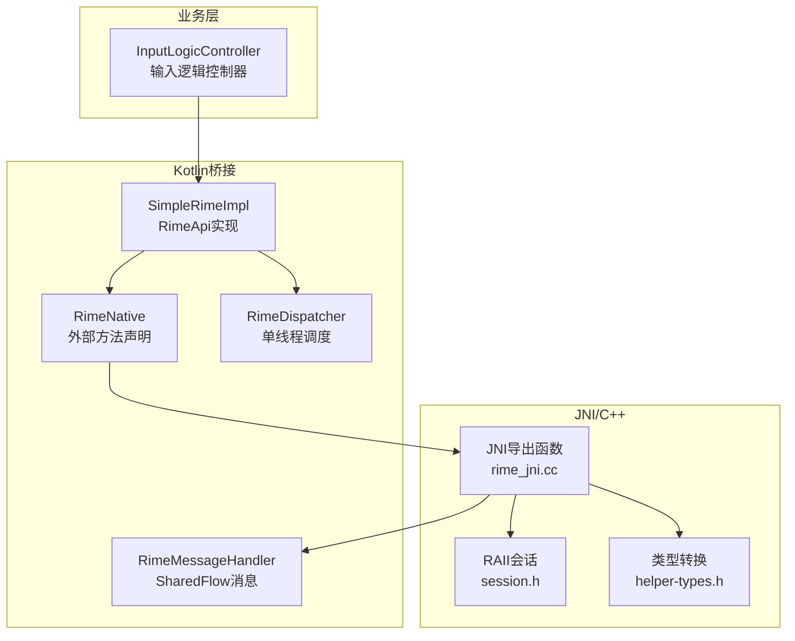
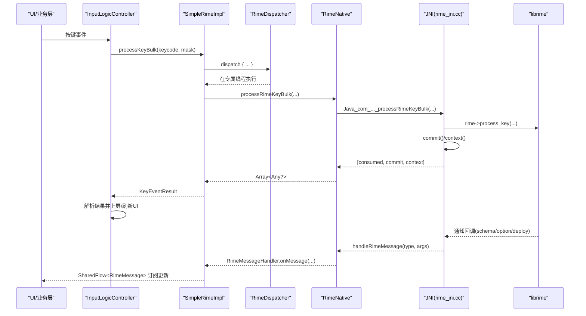
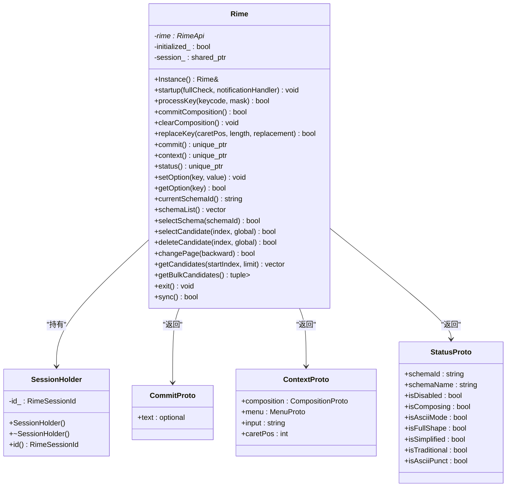
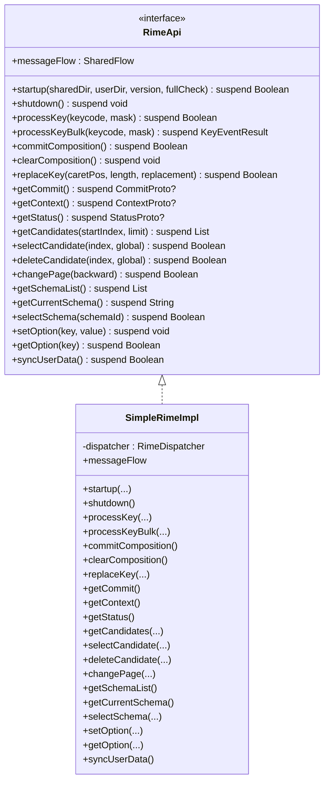
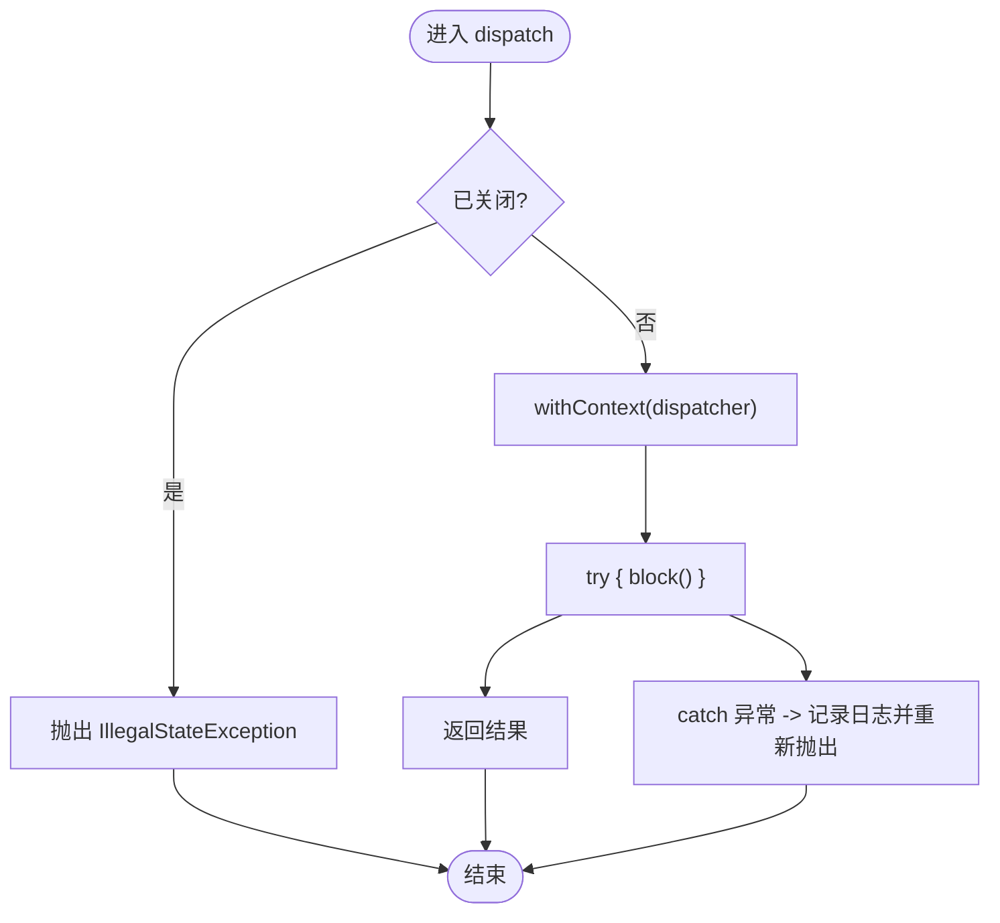
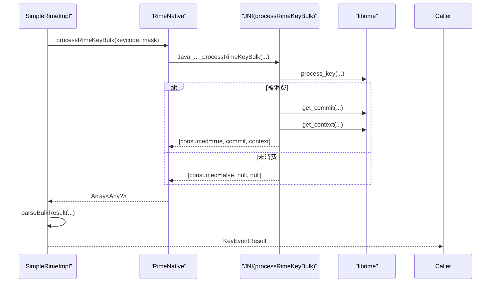
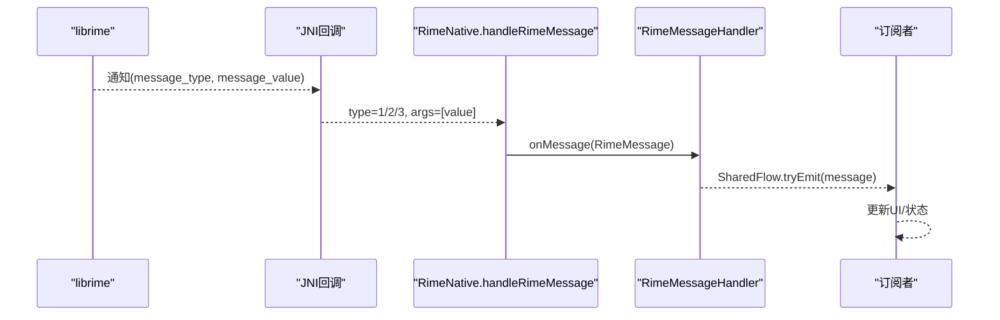
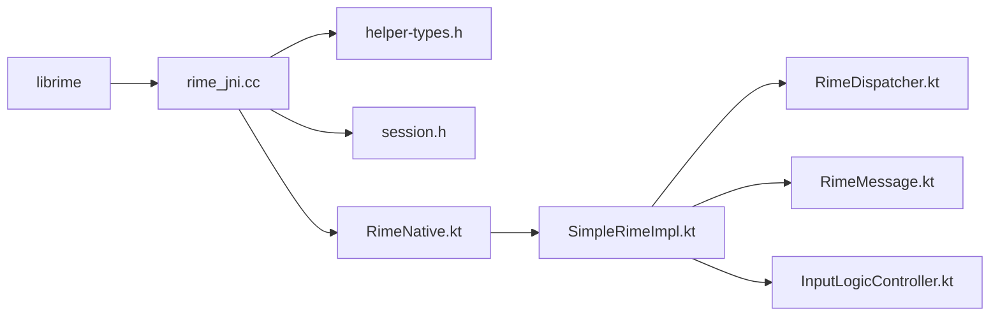

# Rime 引擎集成

<cite>
**本文引用的文件**   
- [rime_jni.cc](file://app/src/main/jni/librime_jni/rime_jni.cc)
- [session.h](file://app/src/main/jni/librime_jni/session.h)
- [helper-types.h](file://app/src/main/jni/librime_jni/helper-types.h)
- [RimeApi.kt](file://app/src/main/java/com/ziyou/ime/core/RimeApi.kt)
- [SimpleRimeImpl.kt](file://app/src/main/java/com/ziyou/ime/core/SimpleRimeImpl.kt)
- [RimeDispatcher.kt](file://app/src/main/java/com/ziyou/ime/core/RimeDispatcher.kt)
- [RimeNative.kt](file://app/src/main/java/com/ziyou/ime/core/RimeNative.kt)
- [ProtoTypes.kt](file://app/src/main/java/com/ziyou/ime/core/ProtoTypes.kt)
- [RimeMessage.kt](file://app/src/main/java/com/ziyou/ime/core/RimeMessage.kt)
- [InputLogicController.kt](file://app/src/main/java/com/ziyou/ime/ime/InputLogicController.kt)
</cite>

## 目录
1. [简介](#简介)
2. [项目结构](#项目结构)
3. [核心组件](#核心组件)
4. [架构总览](#架构总览)
5. [详细组件分析](#详细组件分析)
6. [依赖关系分析](#依赖关系分析)
7. [性能考量](#性能考量)
8. [故障排查指南](#故障排查指南)
9. [结论](#结论)
10. [附录：使用示例与最佳实践](#附录使用示例与最佳实践)

## 简介
本技术文档围绕 Android 输入法项目中对 Rime 引擎的集成实现，系统性阐述 JNI 桥接层、C++ 单例与 RAII 资源管理、RimeApi 接口设计、SimpleRimeImpl 实现、RimeDispatcher 单线程调度器保证 librime 线程安全、批量 API 优化策略（processKeyBulk 单次跨界返回 consumed/commit/context），以及基于 SharedFlow 的消息流处理 librime 通知回调。文档同时提供具体代码路径与调用序列图，帮助读者快速理解并正确使用引擎接口进行输入处理与状态查询。

## 项目结构
本项目将 Rime 引擎集成分为三层：
- C++ JNI 层：封装 librime 调用，提供进程内单例与 RAII 会话管理，暴露 JNI 方法供 Kotlin 调用。
- Kotlin 桥接层：定义 RimeApi 接口与 SimpleRimeImpl 实现，通过 RimeDispatcher 确保所有 native 调用在专属单线程执行；RimeNative 声明外部方法；消息通过 RimeMessageHandler + SharedFlow 分发。
- 业务层：InputLogicController 等消费 RimeApi，采用 processKeyBulk 热路径优化，结合 Mutex 串行化按键事务。

**图表来源** 
- [rime_jni.cc:270-315](file://app/src/main/jni/librime_jni/rime_jni.cc#L270-L315)
- [session.h:12-35](file://app/src/main/jni/librime_jni/session.h#L12-L35)
- [helper-types.h:16-165](file://app/src/main/jni/librime_jni/helper-types.h#L16-L165)
- [RimeNative.kt:10-170](file://app/src/main/java/com/ziyou/ime/core/RimeNative.kt#L10-L170)
- [SimpleRimeImpl.kt:10-177](file://app/src/main/java/com/ziyou/ime/core/SimpleRimeImpl.kt#L10-L177)
- [RimeDispatcher.kt:22-91](file://app/src/main/java/com/ziyou/ime/core/RimeDispatcher.kt#L22-L91)
- [RimeMessage.kt:29-42](file://app/src/main/java/com/ziyou/ime/core/RimeMessage.kt#L29-L42)
- [InputLogicController.kt:126-185](file://app/src/main/java/com/ziyou/ime/ime/InputLogicController.kt#L126-L185)

**章节来源**
- [rime_jni.cc:46-265](file://app/src/main/jni/librime_jni/rime_jni.cc#L46-L265)
- [RimeApi.kt:10-105](file://app/src/main/java/com/ziyou/ime/core/RimeApi.kt#L10-L105)
- [SimpleRimeImpl.kt:10-177](file://app/src/main/java/com/ziyou/ime/core/SimpleRimeImpl.kt#L10-L177)
- [RimeDispatcher.kt:22-91](file://app/src/main/java/com/ziyou/ime/core/RimeDispatcher.kt#L22-L91)
- [RimeNative.kt:10-170](file://app/src/main/java/com/ziyou/ime/core/RimeNative.kt#L10-L170)
- [RimeMessage.kt:29-42](file://app/src/main/java/com/ziyou/ime/core/RimeMessage.kt#L29-L42)
- [InputLogicController.kt:126-185](file://app/src/main/java/com/ziyou/ime/ime/InputLogicController.kt#L126-L185)

## 核心组件
- JNI 层 C++ 单例与 RAII
  - Rime 单例：负责 librime 初始化、通知回调注册、会话生命周期管理、选项与方案操作、候选词获取与批量获取。
  - SessionHolder：RAII 包装 RimeSessionId，构造时创建、析构时销毁，避免泄漏。
  - helper-types.h：定义 CommitProto、ContextProto、StatusProto、CandidateProto、SchemaItem 等数据模型，完成 C 结构与 Kotlin 对象之间的转换。
- Kotlin 桥接层
  - RimeApi：定义所有 suspend 函数接口，统一异步与线程模型。
  - SimpleRimeImpl：实现 RimeApi，所有方法通过 RimeDispatcher.dispatch 在专属线程执行；processKeyBulk 默认三次调用组合，生产实现走 JNI 单次跨界。
  - RimeDispatcher：单线程 Executor + CoroutineDispatcher，确保 librime 线程安全。
  - RimeNative：声明 external 方法，维护库加载状态，并提供 handleRimeMessage 回调入口。
  - RimeMessageHandler：MutableSharedFlow 广播 librime 通知（schema/option/deploy）。
- 业务层
  - InputLogicController：以 processKeyBulk 为热路径，结合 Mutex 串行化按键事务，减少竞态与错配。

**章节来源**
- [rime_jni.cc:46-265](file://app/src/main/jni/librime_jni/rime_jni.cc#L46-L265)
- [session.h:12-35](file://app/src/main/jni/librime_jni/session.h#L12-L35)
- [helper-types.h:16-165](file://app/src/main/jni/librime_jni/helper-types.h#L16-L165)
- [RimeApi.kt:10-105](file://app/src/main/java/com/ziyou/ime/core/RimeApi.kt#L10-L105)
- [SimpleRimeImpl.kt:10-177](file://app/src/main/java/com/ziyou/ime/core/SimpleRimeImpl.kt#L10-L177)
- [RimeDispatcher.kt:22-91](file://app/src/main/java/com/ziyou/ime/core/RimeDispatcher.kt#L22-L91)
- [RimeNative.kt:10-170](file://app/src/main/java/com/ziyou/ime/core/RimeNative.kt#L10-L170)
- [RimeMessage.kt:29-42](file://app/src/main/java/com/ziyou/ime/core/RimeMessage.kt#L29-L42)
- [InputLogicController.kt:126-185](file://app/src/main/java/com/ziyou/ime/ime/InputLogicController.kt#L126-L185)

## 架构总览
下图展示从 UI 到 librime 的完整调用链，包括 JNI 回调消息流。

**图表来源** 
- [rime_jni.cc:366-384](file://app/src/main/jni/librime_jni/rime_jni.cc#L366-L384)
- [rime_jni.cc:289-315](file://app/src/main/jni/librime_jni/rime_jni.cc#L289-L315)
- [RimeNative.kt:158-169](file://app/src/main/java/com/ziyou/ime/core/RimeNative.kt#L158-L169)
- [RimeMessage.kt:29-42](file://app/src/main/java/com/ziyou/ime/core/RimeMessage.kt#L29-L42)
- [SimpleRimeImpl.kt:59-64](file://app/src/main/java/com/ziyou/ime/core/SimpleRimeImpl.kt#L59-L64)
- [InputLogicController.kt:126-185](file://app/src/main/java/com/ziyou/ime/ime/InputLogicController.kt#L126-L185)

## 详细组件分析

### JNI 层：C++ 单例与 RAII 资源管理
- Rime 单例
  - 启动流程：设置环境变量（共享/用户目录、版本名），配置 traits，调用 setup/initialize，注册通知回调，启动维护任务。
  - 会话管理：内部持有 shared_ptr<SessionHolder>，按需创建与复用；exit/sync 重置会话并释放资源。
  - 输入与输出：processKey、commitComposition、clearComposition、replaceKey；commit/context/status 获取并转换为 Proto 对象。
  - 方案与候选：schemaList/selectSchema、selectCandidate/deleteCandidate/changePage、getCandidates/getBulkCandidates。
- SessionHolder（RAII）
  - 构造时 create_session，析构时 destroy_session，异常安全且无泄漏。
- 类型转换（helper-types.h）
  - CommitProto/ContextProto/StatusProto/CandidateProto/SchemaItem：从 C 结构体拷贝字段，处理可选字符串与 UTF-8 距离计算。

**图表来源** 
- [rime_jni.cc:46-265](file://app/src/main/jni/librime_jni/rime_jni.cc#L46-L265)
- [session.h:12-35](file://app/src/main/jni/librime_jni/session.h#L12-L35)
- [helper-types.h:35-165](file://app/src/main/jni/librime_jni/helper-types.h#L35-L165)

**章节来源**
- [rime_jni.cc:46-265](file://app/src/main/jni/librime_jni/rime_jni.cc#L46-L265)
- [session.h:12-35](file://app/src/main/jni/librime_jni/session.h#L12-L35)
- [helper-types.h:16-165](file://app/src/main/jni/librime_jni/helper-types.h#L16-L165)

### RimeApi 接口设计与 SimpleRimeImpl 实现
- RimeApi 接口
  - 生命周期：startup/shutdown
  - 输入处理：processKey/processKeyBulk/commitComposition/clearComposition/replaceKey
  - 状态查询：getCommit/getContext/getStatus/getCandidates
  - 候选操作：selectCandidate/deleteCandidate/changePage
  - 方案管理：getSchemaList/getCurrentSchema/selectSchema
  - 运行时选项：setOption/getOption
  - 同步：syncUserData
  - 消息流：messageFlow（SharedFlow<RimeMessage>）
- SimpleRimeImpl 实现
  - 所有 suspend 方法通过 dispatcher.dispatch 在专属线程执行。
  - processKeyBulk 默认实现为三次调用组合（便于测试/Fake），生产实现由 JNI 单次跨界返回三元组。
  - messageFlow 直接转发至 RimeMessageHandler.messageFlow。

**图表来源** 
- [RimeApi.kt:10-105](file://app/src/main/java/com/ziyou/ime/core/RimeApi.kt#L10-L105)
- [SimpleRimeImpl.kt:10-177](file://app/src/main/java/com/ziyou/ime/core/SimpleRimeImpl.kt#L10-L177)

**章节来源**
- [RimeApi.kt:10-105](file://app/src/main/java/com/ziyou/ime/core/RimeApi.kt#L10-L105)
- [SimpleRimeImpl.kt:10-177](file://app/src/main/java/com/ziyou/ime/core/SimpleRimeImpl.kt#L10-L177)

### RimeDispatcher 单线程调度器设计
- 目标：确保所有 librime API 在同一线程顺序执行，避免数据竞争。
- 实现要点：
  - Executors.newSingleThreadExecutor 绑定协程调度器。
  - dispatch 使用 withContext(dispatcher) 执行块，捕获异常并记录日志。
  - dispatchWithTimeout 支持超时保护，避免阻塞。
  - shutdown 幂等关闭，防止重复释放。

**图表来源** 
- [RimeDispatcher.kt:48-60](file://app/src/main/java/com/ziyou/ime/core/RimeDispatcher.kt#L48-L60)

**章节来源**
- [RimeDispatcher.kt:22-91](file://app/src/main/java/com/ziyou/ime/core/RimeDispatcher.kt#L22-L91)

### 批量 API 优化：processKeyBulk 单次跨界
- 设计动机：减少主线程↔Rime 线程往返与 JNI 跨界次数，提升热路径性能。
- 实现细节：
  - JNI 层 processRimeKeyBulk：一次调用 processKey，若被消费则立即 commit+context，返回三元组数组。
  - Kotlin 层 SimpleRimeImpl.parseBulkResult：将原生数组解析为 KeyEventResult。
  - 默认接口实现（fallback）：三次调用组合，便于 Fake/测试覆盖。

**图表来源** 
- [rime_jni.cc:366-384](file://app/src/main/jni/librime_jni/rime_jni.cc#L366-L384)
- [SimpleRimeImpl.kt:23-28](file://app/src/main/java/com/ziyou/ime/core/SimpleRimeImpl.kt#L23-L28)
- [SimpleRimeImpl.kt:59-64](file://app/src/main/java/com/ziyou/ime/core/SimpleRimeImpl.kt#L59-L64)

**章节来源**
- [rime_jni.cc:366-384](file://app/src/main/jni/librime_jni/rime_jni.cc#L366-L384)
- [SimpleRimeImpl.kt:23-28](file://app/src/main/java/com/ziyou/ime/core/SimpleRimeImpl.kt#L23-L28)
- [SimpleRimeImpl.kt:59-64](file://app/src/main/java/com/ziyou/ime/core/SimpleRimeImpl.kt#L59-L64)

### 消息流 SharedFlow：处理 librime 通知回调
- 触发点：JNI 层 set_notification_handler 注册回调，收到 schema/option/deploy 消息后调用 Java 层 handleRimeMessage。
- 分发机制：RimeNative.handleRimeMessage 将消息映射为 RimeMessage 子类，并通过 RimeMessageHandler.onMessage 推入 MutableSharedFlow。
- 消费方式：UI 订阅 RimeApi.messageFlow（即 RimeMessageHandler.messageFlow），接收状态变更通知。

**图表来源** 
- [rime_jni.cc:289-315](file://app/src/main/jni/librime_jni/rime_jni.cc#L289-L315)
- [RimeNative.kt:158-169](file://app/src/main/java/com/ziyou/ime/core/RimeNative.kt#L158-L169)
- [RimeMessage.kt:29-42](file://app/src/main/java/com/ziyou/ime/core/RimeMessage.kt#L29-L42)

**章节来源**
- [rime_jni.cc:289-315](file://app/src/main/jni/librime_jni/rime_jni.cc#L289-L315)
- [RimeNative.kt:158-169](file://app/src/main/java/com/ziyou/ime/core/RimeNative.kt#L158-L169)
- [RimeMessage.kt:29-42](file://app/src/main/java/com/ziyou/ime/core/RimeMessage.kt#L29-L42)

## 依赖关系分析
- JNI 层依赖 librime API，通过 rime_get_api 获取接口指针；依赖 utf8 工具进行字符距离计算。
- Kotlin 层依赖 kotlinx.coroutines 的 SharedFlow 与协程调度；依赖 Android Log 与 System.loadLibrary。
- 业务层依赖 RimeApi 抽象，解耦具体实现；通过 InputLogicController 协调输入逻辑与 UI 渲染。

**图表来源** 
- [rime_jni.cc:7-17](file://app/src/main/jni/librime_jni/rime_jni.cc#L7-L17)
- [helper-types.h:1-15](file://app/src/main/jni/librime_jni/helper-types.h#L1-L15)
- [session.h:1-11](file://app/src/main/jni/librime_jni/session.h#L1-L11)
- [RimeNative.kt:10-27](file://app/src/main/java/com/ziyou/ime/core/RimeNative.kt#L10-L27)
- [SimpleRimeImpl.kt:10-177](file://app/src/main/java/com/ziyou/ime/core/SimpleRimeImpl.kt#L10-L177)
- [RimeDispatcher.kt:22-91](file://app/src/main/java/com/ziyou/ime/core/RimeDispatcher.kt#L22-L91)
- [RimeMessage.kt:29-42](file://app/src/main/java/com/ziyou/ime/core/RimeMessage.kt#L29-L42)
- [InputLogicController.kt:126-185](file://app/src/main/java/com/ziyou/ime/ime/InputLogicController.kt#L126-L185)

**章节来源**
- [rime_jni.cc:7-17](file://app/src/main/jni/librime_jni/rime_jni.cc#L7-L17)
- [helper-types.h:1-15](file://app/src/main/jni/librime_jni/helper-types.h#L1-L15)
- [session.h:1-11](file://app/src/main/jni/librime_jni/session.h#L1-L11)
- [RimeNative.kt:10-27](file://app/src/main/java/com/ziyou/ime/core/RimeNative.kt#L10-L27)
- [SimpleRimeImpl.kt:10-177](file://app/src/main/java/com/ziyou/ime/core/SimpleRimeImpl.kt#L10-L177)
- [RimeDispatcher.kt:22-91](file://app/src/main/java/com/ziyou/ime/core/RimeDispatcher.kt#L22-L91)
- [RimeMessage.kt:29-42](file://app/src/main/java/com/ziyou/ime/core/RimeMessage.kt#L29-L42)
- [InputLogicController.kt:126-185](file://app/src/main/java/com/ziyou/ime/ime/InputLogicController.kt#L126-L185)

## 性能考量
- 热路径优化：processKeyBulk 单次跨界返回 consumed/commit/context，减少线程切换与 JNI 调用开销。
- 内存回收：JNI 层在部署完成后调用 mallopt(M_PURGE) 归还空闲页，降低常驻内存占用。
- 超时保护：dispatchWithTimeout 避免长时间阻塞导致按键积压。
- 编码长度上限：InputLogicController 限制 MAX_INPUT_LENGTH，防止超长编码导致搜索爆炸。

[本节为通用指导，不直接分析具体文件]

## 故障排查指南
- 常见错误
  - UnsatisfiedLinkError：native 库未加载或 ABI 不匹配。检查 RimeNative.isLoaded 与 .so 文件。
  - IllegalStateException：RimeDispatcher 已关闭或 native 库未加载时调用 startup。
  - 线程错乱：确认所有 RimeNative 调用均通过 RimeDispatcher.dispatch。
- 调试建议
  - 启用慢按键告警（SLOW_KEY_WARN_MS）定位耗时瓶颈。
  - 观察 SharedFlow 消息，确认 schema/option/deploy 状态变更是否到达 UI。
  - 使用单元测试覆盖 parseBulkResult 与 dispatcher 调度路径。

**章节来源**
- [RimeNative.kt:18-27](file://app/src/main/java/com/ziyou/ime/core/RimeNative.kt#L18-L27)
- [RimeDispatcher.kt:84-90](file://app/src/main/java/com/ziyou/ime/core/RimeDispatcher.kt#L84-L90)
- [InputLogicController.kt:54-64](file://app/src/main/java/com/ziyou/ime/ime/InputLogicController.kt#L54-L64)

## 结论
本集成通过 C++ 单例与 RAII 保障 librime 资源安全，Kotlin 层以 RimeApi 抽象与 SimpleRimeImpl 实现统一异步与线程模型，RimeDispatcher 确保 librime 线程安全，processKeyBulk 显著优化热路径性能，SharedFlow 消息流实现 librime 通知的可靠分发。整体架构清晰、可测试性强，适合大规模输入法场景。

[本节为总结性内容，不直接分析具体文件]

## 附录：使用示例与最佳实践
- 启动与关闭
  - 调用 RimeApi.startup 传入共享/用户目录与版本信息，fullCheck 首次启动设为 true。
  - 应用退出时调用 shutdown 释放资源。
- 输入处理
  - 优先使用 processKeyBulk 获取 KeyEventResult，根据 consumed 分支处理 commit 与 UI 刷新。
  - 未消费键按编辑器语义处理（退格/回车/可打印字符）。
- 状态查询
  - getContext 获取编码区与候选菜单；getStatus 获取当前模式与方案信息。
- 方案与选项
  - getSchemaList/selectSchema 动态切换方案；setOption/getOption 控制 ascii_mode/simplification 等。
- 消息订阅
  - 订阅 RimeApi.messageFlow，响应 schema/option/deploy 变更，更新 UI 状态。

**章节来源**
- [RimeApi.kt:10-105](file://app/src/main/java/com/ziyou/ime/core/RimeApi.kt#L10-L105)
- [SimpleRimeImpl.kt:32-49](file://app/src/main/java/com/ziyou/ime/core/SimpleRimeImpl.kt#L32-L49)
- [InputLogicController.kt:126-185](file://app/src/main/java/com/ziyou/ime/ime/InputLogicController.kt#L126-L185)
- [RimeMessage.kt:29-42](file://app/src/main/java/com/ziyou/ime/core/RimeMessage.kt#L29-L42)