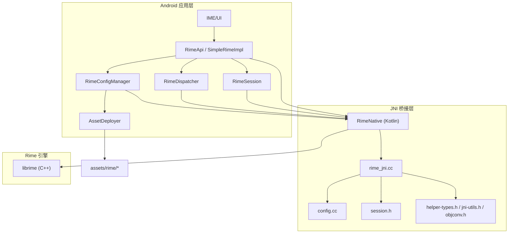
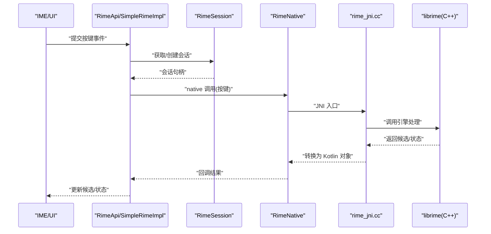
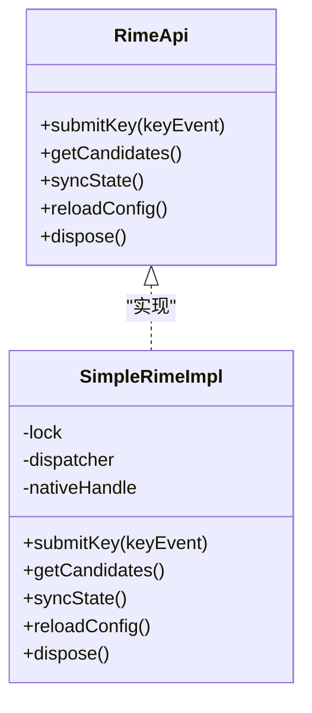
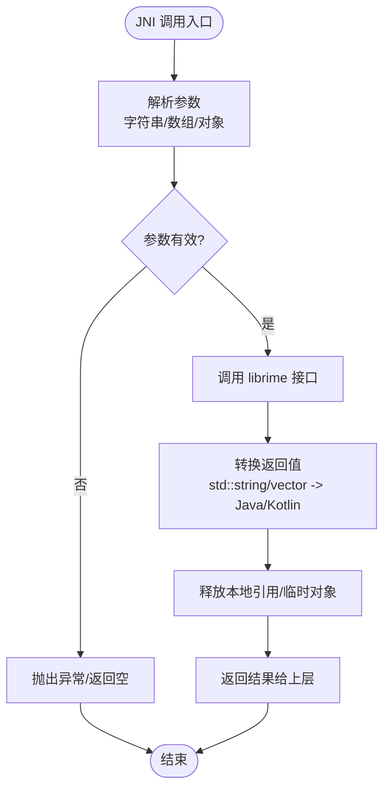
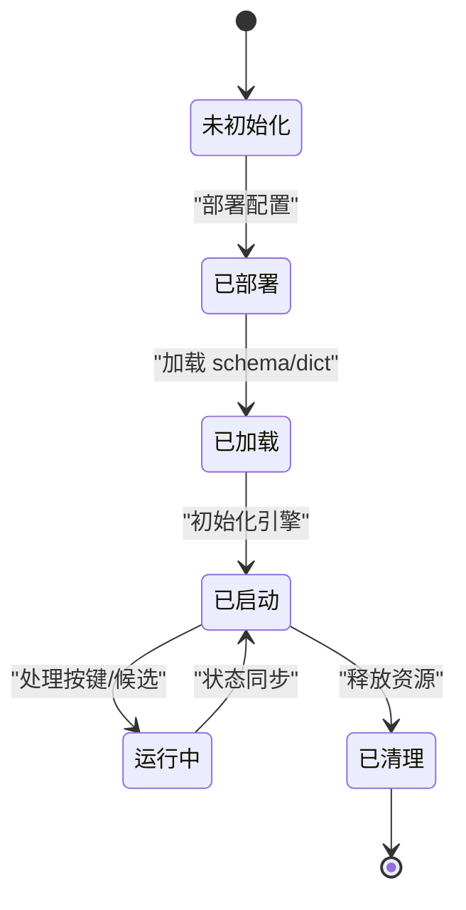
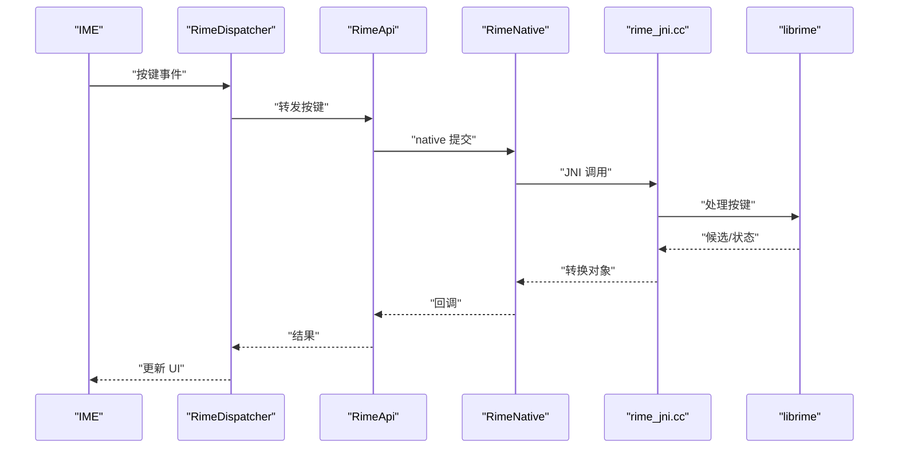
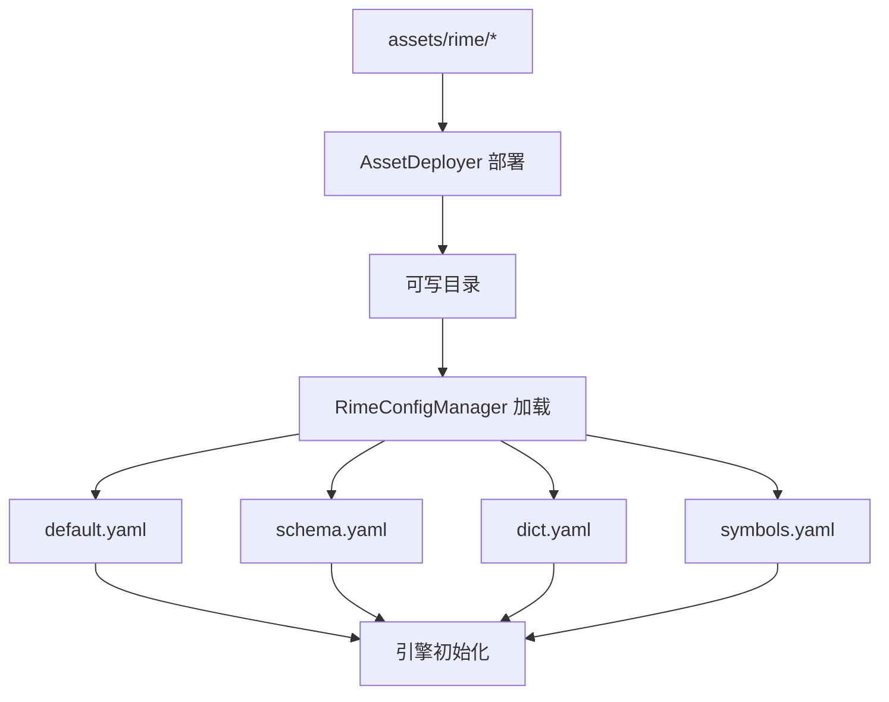
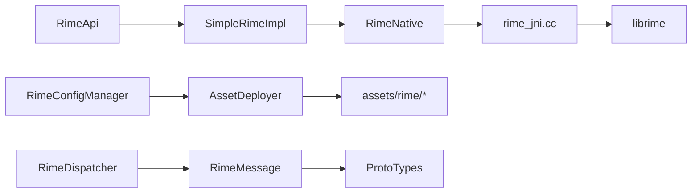

# Rime 引擎集成

<cite>
**本文引用的文件**   
- [app/src/main/java/com/ziyou/ime/core/RimeApi.kt](file://app/src/main/java/com/ziyou/ime/core/RimeApi.kt)
- [app/src/main/java/com/ziyou/ime/core/SimpleRimeImpl.kt](file://app/src/main/java/com/ziyou/ime/core/SimpleRimeImpl.kt)
- [app/src/main/java/com/ziyou/ime/core/RimeNative.kt](file://app/src/main/java/com/ziyou/ime/core/RimeNative.kt)
- [app/src/main/java/com/ziyou/ime/core/RimeDispatcher.kt](file://app/src/main/java/com/ziyou/ime/core/RimeDispatcher.kt)
- [app/src/main/java/com/ziyou/ime/core/RimeMessage.kt](file://app/src/main/java/com/ziyou/ime/core/RimeMessage.kt)
- [app/src/main/java/com/ziyou/ime/core/ProtoTypes.kt](file://app/src/main/java/com/ziyou/ime/core/ProtoTypes.kt)
- [app/src/main/java/com/ziyou/ime/daemon/RimeSession.kt](file://app/src/main/java/com/ziyou/ime/daemon/RimeSession.kt)
- [app/src/main/java/com/ziyou/ime/config/RimeConfigManager.kt](file://app/src/main/java/com/ziyou/ime/config/RimeConfigManager.kt)
- [app/src/main/java/com/ziyou/ime/config/AssetDeployer.kt](file://app/src/main/java/com/ziyou/ime/config/AssetDeployer.kt)
- [app/src/main/jni/librime_jni/rime_jni.cc](file://app/src/main/jni/librime_jni/rime_jni.cc)
- [app/src/main/jni/librime_jni/config.cc](file://app/src/main/jni/librime_jni/config.cc)
- [app/src/main/jni/librime_jni/session.h](file://app/src/main/jni/librime_jni/session.h)
- [app/src/main/jni/librime_jni/helper-types.h](file://app/src/main/jni/librime_jni/helper-types.h)
- [app/src/main/jni/librime_jni/jni-utils.h](file://app/src/main/jni/librime_jni/jni-utils.h)
- [app/src/main/jni/librime_jni/objconv.h](file://app/src/main/jni/librime_jni/objconv.h)
- [app/src/main/jni/librime_jni/CMakeLists.txt](file://app/src/main/jni/librime_jni/CMakeLists.txt)
- [app/src/main/assets/rime/default.yaml](file://app/src/main/assets/rime/default.yaml)
- [app/src/main/assets/rime/luna_pinyin.schema.yaml](file://app/src/main/assets/rime/luna_pinyin.schema.yaml)
- [app/src/main/assets/rime/luna_pinyin.dict.yaml](file://app/src/main/assets/rime/luna_pinyin.dict.yaml)
- [app/src/main/assets/rime/cangjie5.schema.yaml](file://app/src/main/assets/rime/cangjie5.schema.yaml)
- [app/src/main/assets/rime/cangjie5.dict.yaml](file://app/src/main/assets/rime/cangjie5.dict.yaml)
- [app/src/main/assets/rime/symbols.yaml](file://app/src/main/assets/rime/symbols.yaml)
</cite>

## 目录
1. [简介](#简介)
2. [项目结构](#项目结构)
3. [核心组件](#核心组件)
4. [架构总览](#架构总览)
5. [详细组件分析](#详细组件分析)
6. [依赖关系分析](#依赖关系分析)
7. [性能考虑](#性能考虑)
8. [故障排查指南](#故障排查指南)
9. [结论](#结论)
10. [附录](#附录)

## 简介
本技术文档围绕 Android 端集成的 Rime 输入法引擎，系统性阐述 JNI 接口实现、C++ 与 Java/Kotlin 的数据转换、内存管理与错误处理机制；深入解析 RimeApi 接口设计与 SimpleRimeImpl 的具体实现；说明 RimeSession 生命周期管理（初始化、配置加载、引擎启动、资源清理）；详解消息传递机制（按键事件、候选词生成、状态同步等）；并给出配置文件加载与管理策略（schema、词典、插件）、性能优化建议与常见问题排查方法。

## 项目结构
本项目采用分层组织：
- app 层：Android 应用与 IME 服务、UI、配置管理、JNI 桥接与核心逻辑封装
- core-logic：纯 Java/Kotlin 的关联算法模块（与本主题关联度较低）
- librime-prebuilt：Rime 引擎源码与构建脚本（用于理解底层能力）
- libs：预编译库头文件与平台二进制

关键目录与职责：
- app/src/main/java/com/ziyou/ime/core：Rime 引擎 API 抽象、JNI 绑定、消息模型与分发器
- app/src/main/java/com/ziyou/ime/daemon：会话生命周期管理
- app/src/main/java/com/ziyou/ime/config：配置部署与主题管理
- app/src/main/jni/librime_jni：C++ JNI 实现，负责 C++ Rime 对象与 Java 对象的互操作
- app/src/main/assets/rime：Rime 配置文件与词典

图表来源
- [app/src/main/java/com/ziyou/ime/core/RimeApi.kt](file://app/src/main/java/com/ziyou/ime/core/RimeApi.kt)
- [app/src/main/java/com/ziyou/ime/core/SimpleRimeImpl.kt](file://app/src/main/java/com/ziyou/ime/core/SimpleRimeImpl.kt)
- [app/src/main/java/com/ziyou/ime/core/RimeNative.kt](file://app/src/main/java/com/ziyou/ime/core/RimeNative.kt)
- [app/src/main/java/com/ziyou/ime/core/RimeDispatcher.kt](file://app/src/main/java/com/ziyou/ime/core/RimeDispatcher.kt)
- [app/src/main/java/com/ziyou/ime/daemon/RimeSession.kt](file://app/src/main/java/com/ziyou/ime/daemon/RimeSession.kt)
- [app/src/main/java/com/ziyou/ime/config/RimeConfigManager.kt](file://app/src/main/java/com/ziyou/ime/config/RimeConfigManager.kt)
- [app/src/main/java/com/ziyou/ime/config/AssetDeployer.kt](file://app/src/main/java/com/ziyou/ime/config/AssetDeployer.kt)
- [app/src/main/jni/librime_jni/rime_jni.cc](file://app/src/main/jni/librime_jni/rime_jni.cc)
- [app/src/main/jni/librime_jni/config.cc](file://app/src/main/jni/librime_jni/config.cc)
- [app/src/main/jni/librime_jni/session.h](file://app/src/main/jni/librime_jni/session.h)
- [app/src/main/jni/librime_jni/helper-types.h](file://app/src/main/jni/librime_jni/helper-types.h)
- [app/src/main/jni/librime_jni/jni-utils.h](file://app/src/main/jni/librime_jni/jni-utils.h)
- [app/src/main/jni/librime_jni/objconv.h](file://app/src/main/jni/librime_jni/objconv.h)

章节来源
- [app/src/main/java/com/ziyou/ime/core/RimeApi.kt](file://app/src/main/java/com/ziyou/ime/core/RimeApi.kt)
- [app/src/main/java/com/ziyou/ime/core/SimpleRimeImpl.kt](file://app/src/main/java/com/ziyou/ime/core/SimpleRimeImpl.kt)
- [app/src/main/java/com/ziyou/ime/core/RimeNative.kt](file://app/src/main/java/com/ziyou/ime/core/RimeNative.kt)
- [app/src/main/java/com/ziyou/ime/core/RimeDispatcher.kt](file://app/src/main/java/com/ziyou/ime/core/RimeDispatcher.kt)
- [app/src/main/java/com/ziyou/ime/daemon/RimeSession.kt](file://app/src/main/java/com/ziyou/ime/daemon/RimeSession.kt)
- [app/src/main/java/com/ziyou/ime/config/RimeConfigManager.kt](file://app/src/main/java/com/ziyou/ime/config/RimeConfigManager.kt)
- [app/src/main/java/com/ziyou/ime/config/AssetDeployer.kt](file://app/src/main/java/com/ziyou/ime/config/AssetDeployer.kt)
- [app/src/main/jni/librime_jni/rime_jni.cc](file://app/src/main/jni/librime_jni/rime_jni.cc)
- [app/src/main/jni/librime_jni/config.cc](file://app/src/main/jni/librime_jni/config.cc)
- [app/src/main/jni/librime_jni/session.h](file://app/src/main/jni/librime_jni/session.h)
- [app/src/main/jni/librime_jni/helper-types.h](file://app/src/main/jni/librime_jni/helper-types.h)
- [app/src/main/jni/librime_jni/jni-utils.h](file://app/src/main/jni/librime_jni/jni-utils.h)
- [app/src/main/jni/librime_jni/objconv.h](file://app/src/main/jni/librime_jni/objconv.h)

## 核心组件
- RimeApi：定义上层对 Rime 引擎的统一接口，屏蔽 JNI 细节，提供输入、查询、状态同步等方法。
- SimpleRimeImpl：RimeApi 的默认实现，封装线程安全、参数校验、异常捕获与回调派发。
- RimeNative：声明 native 方法，作为 Kotlin 到 C++ JNI 的入口。
- RimeDispatcher：将原生侧的事件或结果分发给 UI/业务层，统一消息格式。
- RimeMessage：跨进程/线程的消息载体，包含按键、候选、状态等结构化数据。
- ProtoTypes：定义与原生交互的协议类型（如键码、候选项、上下文等）。
- RimeSession：管理 Rime 实例的生命周期，包括初始化、配置部署、引擎启动、销毁。
- RimeConfigManager：集中管理 schema、词典、插件等配置项的加载与更新。
- AssetDeployer：从 assets 部署 Rime 配置文件到可读写路径，确保运行时可用。

章节来源
- [app/src/main/java/com/ziyou/ime/core/RimeApi.kt](file://app/src/main/java/com/ziyou/ime/core/RimeApi.kt)
- [app/src/main/java/com/ziyou/ime/core/SimpleRimeImpl.kt](file://app/src/main/java/com/ziyou/ime/core/SimpleRimeImpl.kt)
- [app/src/main/java/com/ziyou/ime/core/RimeNative.kt](file://app/src/main/java/com/ziyou/ime/core/RimeNative.kt)
- [app/src/main/java/com/ziyou/ime/core/RimeDispatcher.kt](file://app/src/main/java/com/ziyou/ime/core/RimeDispatcher.kt)
- [app/src/main/java/com/ziyou/ime/core/RimeMessage.kt](file://app/src/main/java/com/ziyou/ime/core/RimeMessage.kt)
- [app/src/main/java/com/ziyou/ime/core/ProtoTypes.kt](file://app/src/main/java/com/ziyou/ime/core/ProtoTypes.kt)
- [app/src/main/java/com/ziyou/ime/daemon/RimeSession.kt](file://app/src/main/java/com/ziyou/ime/daemon/RimeSession.kt)
- [app/src/main/java/com/ziyou/ime/config/RimeConfigManager.kt](file://app/src/main/java/com/ziyou/ime/config/RimeConfigManager.kt)
- [app/src/main/java/com/ziyou/ime/config/AssetDeployer.kt](file://app/src/main/java/com/ziyou/ime/config/AssetDeployer.kt)

## 架构总览
整体架构遵循“上层 API -> 会话管理 -> JNI 桥接 -> 原生引擎”的分层设计。上层通过 RimeApi 暴露稳定接口，SimpleRimeImpl 保证线程安全与错误隔离；RimeSession 负责生命周期；RimeNative + rime_jni.cc 完成类型转换与内存管理；最终调用 librime 引擎进行分词、翻译与候选生成。

图表来源
- [app/src/main/java/com/ziyou/ime/core/RimeApi.kt](file://app/src/main/java/com/ziyou/ime/core/RimeApi.kt)
- [app/src/main/java/com/ziyou/ime/core/SimpleRimeImpl.kt](file://app/src/main/java/com/ziyou/ime/core/SimpleRimeImpl.kt)
- [app/src/main/java/com/ziyou/ime/core/RimeNative.kt](file://app/src/main/java/com/ziyou/ime/core/RimeNative.kt)
- [app/src/main/jni/librime_jni/rime_jni.cc](file://app/src/main/jni/librime_jni/rime_jni.cc)

## 详细组件分析

### RimeApi 与 SimpleRimeImpl
- RimeApi：定义统一的输入、查询、状态同步、配置重载等接口，屏蔽底层差异。
- SimpleRimeImpl：
  - 线程安全：内部使用锁或单线程调度器，避免并发访问 JNI 导致的崩溃。
  - 参数校验：对按键、文本、索引等进行边界检查，防止越界。
  - 错误处理：捕获 JNI 异常并转换为上层友好错误码/异常。
  - 回调派发：通过 RimeDispatcher 将结果异步回传给 UI。

图表来源
- [app/src/main/java/com/ziyou/ime/core/RimeApi.kt](file://app/src/main/java/com/ziyou/ime/core/RimeApi.kt)
- [app/src/main/java/com/ziyou/ime/core/SimpleRimeImpl.kt](file://app/src/main/java/com/ziyou/ime/core/SimpleRimeImpl.kt)

章节来源
- [app/src/main/java/com/ziyou/ime/core/RimeApi.kt](file://app/src/main/java/com/ziyou/ime/core/RimeApi.kt)
- [app/src/main/java/com/ziyou/ime/core/SimpleRimeImpl.kt](file://app/src/main/java/com/ziyou/ime/core/SimpleRimeImpl.kt)

### JNI 接口与数据转换
- RimeNative：声明 native 方法，作为 Kotlin 到 C++ 的桥接点。
- rime_jni.cc：实现 JNI 函数，负责：
  - 类型转换：将 Kotlin/Java 字符串、数组、对象转换为 std::string、std::vector、自定义结构体。
  - 内存管理：使用局部引用/全局引用、释放本地指针，避免泄漏。
  - 错误处理：捕获 C++ 异常，设置 Java 异常并返回安全值。
- helper-types.h、jni-utils.h、objconv.h：提供通用类型转换工具与辅助宏。

图表来源
- [app/src/main/jni/librime_jni/rime_jni.cc](file://app/src/main/jni/librime_jni/rime_jni.cc)
- [app/src/main/jni/librime_jni/helper-types.h](file://app/src/main/jni/librime_jni/helper-types.h)
- [app/src/main/jni/librime_jni/jni-utils.h](file://app/src/main/jni/librime_jni/jni-utils.h)
- [app/src/main/jni/librime_jni/objconv.h](file://app/src/main/jni/librime_jni/objconv.h)

章节来源
- [app/src/main/java/com/ziyou/ime/core/RimeNative.kt](file://app/src/main/java/com/ziyou/ime/core/RimeNative.kt)
- [app/src/main/jni/librime_jni/rime_jni.cc](file://app/src/main/jni/librime_jni/rime_jni.cc)
- [app/src/main/jni/librime_jni/helper-types.h](file://app/src/main/jni/librime_jni/helper-types.h)
- [app/src/main/jni/librime_jni/jni-utils.h](file://app/src/main/jni/librime_jni/jni-utils.h)
- [app/src/main/jni/librime_jni/objconv.h](file://app/src/main/jni/librime_jni/objconv.h)

### RimeSession 生命周期管理
- 初始化：加载配置、部署 assets、创建引擎上下文。
- 配置加载：读取 default.yaml、schema 与 dict，必要时合并用户配置。
- 引擎启动：根据 schema 初始化翻译器、分词器、过滤器等组件。
- 运行期：处理按键、生成候选、维护上下文状态。
- 资源清理：释放引擎句柄、关闭数据库连接、清空缓存。

图表来源
- [app/src/main/java/com/ziyou/ime/daemon/RimeSession.kt](file://app/src/main/java/com/ziyou/ime/daemon/RimeSession.kt)
- [app/src/main/java/com/ziyou/ime/config/RimeConfigManager.kt](file://app/src/main/java/com/ziyou/ime/config/RimeConfigManager.kt)
- [app/src/main/java/com/ziyou/ime/config/AssetDeployer.kt](file://app/src/main/java/com/ziyou/ime/config/AssetDeployer.kt)

章节来源
- [app/src/main/java/com/ziyou/ime/daemon/RimeSession.kt](file://app/src/main/java/com/ziyou/ime/daemon/RimeSession.kt)
- [app/src/main/java/com/ziyou/ime/config/RimeConfigManager.kt](file://app/src/main/java/com/ziyou/ime/config/RimeConfigManager.kt)
- [app/src/main/java/com/ziyou/ime/config/AssetDeployer.kt](file://app/src/main/java/com/ziyou/ime/config/AssetDeployer.kt)

### 消息传递机制
- 按键事件：IME 捕获按键 -> RimeDispatcher -> RimeApi -> RimeNative -> rime_jni.cc -> librime。
- 候选词生成：引擎返回候选列表 -> JNI 转换为 Kotlin 对象 -> RimeDispatcher -> UI 渲染。
- 状态同步：编辑状态、选区、标点模式等通过消息同步，保持 UI 与引擎一致。

图表来源
- [app/src/main/java/com/ziyou/ime/core/RimeDispatcher.kt](file://app/src/main/java/com/ziyou/ime/core/RimeDispatcher.kt)
- [app/src/main/java/com/ziyou/ime/core/RimeMessage.kt](file://app/src/main/java/com/ziyou/ime/core/RimeMessage.kt)
- [app/src/main/java/com/ziyou/ime/core/ProtoTypes.kt](file://app/src/main/java/com/ziyou/ime/core/ProtoTypes.kt)
- [app/src/main/jni/librime_jni/rime_jni.cc](file://app/src/main/jni/librime_jni/rime_jni.cc)

章节来源
- [app/src/main/java/com/ziyou/ime/core/RimeDispatcher.kt](file://app/src/main/java/com/ziyou/ime/core/RimeDispatcher.kt)
- [app/src/main/java/com/ziyou/ime/core/RimeMessage.kt](file://app/src/main/java/com/ziyou/ime/core/RimeMessage.kt)
- [app/src/main/java/com/ziyou/ime/core/ProtoTypes.kt](file://app/src/main/java/com/ziyou/ime/core/ProtoTypes.kt)

### 配置文件加载与管理策略
- default.yaml：全局默认配置，控制行为开关、字体、布局等。
- schema.yaml：定义输入方案（如拼音、仓颉），指定使用的词典与处理器。
- dict.yaml：词典数据，支持 LevelDB、TSV 等格式。
- symbols.yaml：符号表，用于快速插入标点与特殊字符。
- AssetDeployer：将 assets 中的配置文件复制到可写目录，确保运行时可修改。
- RimeConfigManager：集中管理配置项，支持热重载与增量更新。

图表来源
- [app/src/main/java/com/ziyou/ime/config/AssetDeployer.kt](file://app/src/main/java/com/ziyou/ime/config/AssetDeployer.kt)
- [app/src/main/java/com/ziyou/ime/config/RimeConfigManager.kt](file://app/src/main/java/com/ziyou/ime/config/RimeConfigManager.kt)
- [app/src/main/assets/rime/default.yaml](file://app/src/main/assets/rime/default.yaml)
- [app/src/main/assets/rime/luna_pinyin.schema.yaml](file://app/src/main/assets/rime/luna_pinyin.schema.yaml)
- [app/src/main/assets/rime/luna_pinyin.dict.yaml](file://app/src/main/assets/rime/luna_pinyin.dict.yaml)
- [app/src/main/assets/rime/cangjie5.schema.yaml](file://app/src/main/assets/rime/cangjie5.schema.yaml)
- [app/src/main/assets/rime/cangjie5.dict.yaml](file://app/src/main/assets/rime/cangjie5.dict.yaml)
- [app/src/main/assets/rime/symbols.yaml](file://app/src/main/assets/rime/symbols.yaml)

章节来源
- [app/src/main/java/com/ziyou/ime/config/AssetDeployer.kt](file://app/src/main/java/com/ziyou/ime/config/AssetDeployer.kt)
- [app/src/main/java/com/ziyou/ime/config/RimeConfigManager.kt](file://app/src/main/java/com/ziyou/ime/config/RimeConfigManager.kt)
- [app/src/main/assets/rime/default.yaml](file://app/src/main/assets/rime/default.yaml)
- [app/src/main/assets/rime/luna_pinyin.schema.yaml](file://app/src/main/assets/rime/luna_pinyin.schema.yaml)
- [app/src/main/assets/rime/luna_pinyin.dict.yaml](file://app/src/main/assets/rime/luna_pinyin.dict.yaml)
- [app/src/main/assets/rime/cangjie5.schema.yaml](file://app/src/main/assets/rime/cangjie5.schema.yaml)
- [app/src/main/assets/rime/cangjie5.dict.yaml](file://app/src/main/assets/rime/cangjie5.dict.yaml)
- [app/src/main/assets/rime/symbols.yaml](file://app/src/main/assets/rime/symbols.yaml)

### 插件机制
- Rime 支持动态插件（如预测、简化字转换、历史翻译等），通过配置文件启用。
- 插件以共享库形式加载，需在 build 时链接或在运行时动态加载。
- 在 Android 上，可通过 prebuilt 库或自行编译插件模块集成。

章节来源
- [app/src/main/jni/librime_jni/CMakeLists.txt](file://app/src/main/jni/librime_jni/CMakeLists.txt)
- [app/src/main/assets/rime/default.yaml](file://app/src/main/assets/rime/default.yaml)

## 依赖关系分析
- 上层依赖：RimeApi -> SimpleRimeImpl -> RimeNative -> rime_jni.cc -> librime
- 配置依赖：RimeConfigManager -> AssetDeployer -> assets/rime/*
- 消息依赖：RimeDispatcher -> RimeMessage -> ProtoTypes

图表来源
- [app/src/main/java/com/ziyou/ime/core/RimeApi.kt](file://app/src/main/java/com/ziyou/ime/core/RimeApi.kt)
- [app/src/main/java/com/ziyou/ime/core/SimpleRimeImpl.kt](file://app/src/main/java/com/ziyou/ime/core/SimpleRimeImpl.kt)
- [app/src/main/java/com/ziyou/ime/core/RimeNative.kt](file://app/src/main/java/com/ziyou/ime/core/RimeNative.kt)
- [app/src/main/jni/librime_jni/rime_jni.cc](file://app/src/main/jni/librime_jni/rime_jni.cc)
- [app/src/main/java/com/ziyou/ime/config/RimeConfigManager.kt](file://app/src/main/java/com/ziyou/ime/config/RimeConfigManager.kt)
- [app/src/main/java/com/ziyou/ime/config/AssetDeployer.kt](file://app/src/main/java/com/ziyou/ime/config/AssetDeployer.kt)
- [app/src/main/java/com/ziyou/ime/core/RimeDispatcher.kt](file://app/src/main/java/com/ziyou/ime/core/RimeDispatcher.kt)
- [app/src/main/java/com/ziyou/ime/core/RimeMessage.kt](file://app/src/main/java/com/ziyou/ime/core/RimeMessage.kt)
- [app/src/main/java/com/ziyou/ime/core/ProtoTypes.kt](file://app/src/main/java/com/ziyou/ime/core/ProtoTypes.kt)

章节来源
- [app/src/main/java/com/ziyou/ime/core/RimeApi.kt](file://app/src/main/java/com/ziyou/ime/core/RimeApi.kt)
- [app/src/main/java/com/ziyou/ime/core/SimpleRimeImpl.kt](file://app/src/main/java/com/ziyou/ime/core/SimpleRimeImpl.kt)
- [app/src/main/java/com/ziyou/ime/core/RimeNative.kt](file://app/src/main/java/com/ziyou/ime/core/RimeNative.kt)
- [app/src/main/jni/librime_jni/rime_jni.cc](file://app/src/main/jni/librime_jni/rime_jni.cc)
- [app/src/main/java/com/ziyou/ime/config/RimeConfigManager.kt](file://app/src/main/java/com/ziyou/ime/config/RimeConfigManager.kt)
- [app/src/main/java/com/ziyou/ime/config/AssetDeployer.kt](file://app/src/main/java/com/ziyou/ime/config/AssetDeployer.kt)
- [app/src/main/java/com/ziyou/ime/core/RimeDispatcher.kt](file://app/src/main/java/com/ziyou/ime/core/RimeDispatcher.kt)
- [app/src/main/java/com/ziyou/ime/core/RimeMessage.kt](file://app/src/main/java/com/ziyou/ime/core/RimeMessage.kt)
- [app/src/main/java/com/ziyou/ime/core/ProtoTypes.kt](file://app/src/main/java/com/ziyou/ime/core/ProtoTypes.kt)

## 性能考虑
- 减少 JNI 调用频率：批量处理按键与候选，避免频繁跨进程切换。
- 对象复用：重用消息对象与缓冲区，降低 GC 压力。
- 线程隔离：将耗时操作（配置加载、词典编译）放入后台线程。
- 缓存策略：缓存常用候选与状态，减少重复计算。
- 内存管理：及时释放本地引用，避免 JNI 内存泄漏。
- 配置热重载：增量更新而非全量重建，缩短重启时间。

[本节为通用指导，不直接分析具体文件]

## 故障排查指南
- 常见错误：
  - JNI 崩溃：检查参数有效性、字符串编码、数组边界。
  - 配置加载失败：确认 assets 部署成功、路径正确、YAML 语法无误。
  - 候选为空：检查 schema 与 dict 是否匹配、过滤条件是否过严。
  - 内存泄漏：监控本地引用计数、释放临时对象。
- 调试技巧：
  - 打印关键路径日志（配置加载、JNI 调用、候选生成）。
  - 使用 Android Studio 的 Native Debug 定位崩溃点。
  - 验证 YAML 配置与词典完整性。
  - 模拟按键序列复现问题。

章节来源
- [app/src/main/jni/librime_jni/rime_jni.cc](file://app/src/main/jni/librime_jni/rime_jni.cc)
- [app/src/main/java/com/ziyou/ime/config/RimeConfigManager.kt](file://app/src/main/java/com/ziyou/ime/config/RimeConfigManager.kt)
- [app/src/main/java/com/ziyou/ime/config/AssetDeployer.kt](file://app/src/main/java/com/ziyou/ime/config/AssetDeployer.kt)

## 结论
本项目通过清晰的分层架构与稳健的 JNI 桥接，实现了 Rime 引擎在 Android 上的高效集成。RimeApi 与 SimpleRimeImpl 提供了稳定的上层接口，RimeSession 管理生命周期，RimeDispatcher 与 RimeMessage 保障消息一致性。配置文件与词典的动态加载使得系统具备高度可扩展性。通过合理的性能优化与完善的故障排查手段，可在复杂场景下保持输入体验的流畅与稳定。

[本节为总结，不直接分析具体文件]

## 附录
- 代码示例路径：
  - JNI 调用示例：[rime_jni.cc](file://app/src/main/jni/librime_jni/rime_jni.cc)
  - 配置加载示例：[RimeConfigManager.kt](file://app/src/main/java/com/ziyou/ime/config/RimeConfigManager.kt)
  - 消息定义示例：[RimeMessage.kt](file://app/src/main/java/com/ziyou/ime/core/RimeMessage.kt)
  - 协议类型示例：[ProtoTypes.kt](file://app/src/main/java/com/ziyou/ime/core/ProtoTypes.kt)
- 调试命令：
  - 查看日志：logcat | grep -i rime
  - 崩溃分析：ndk-stack -sym <符号路径> -stack <崩溃堆栈>

[本节为附录，不直接分析具体文件]