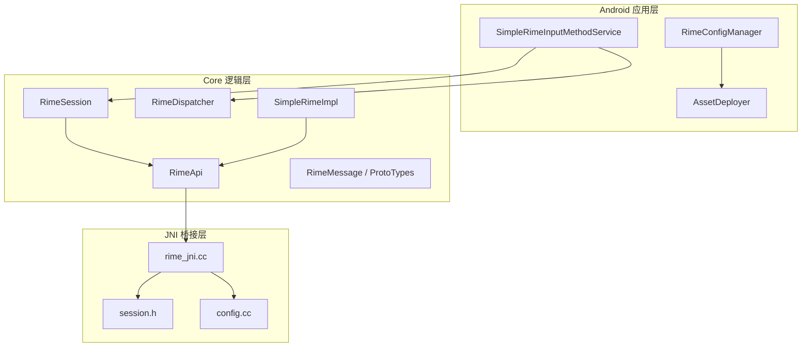
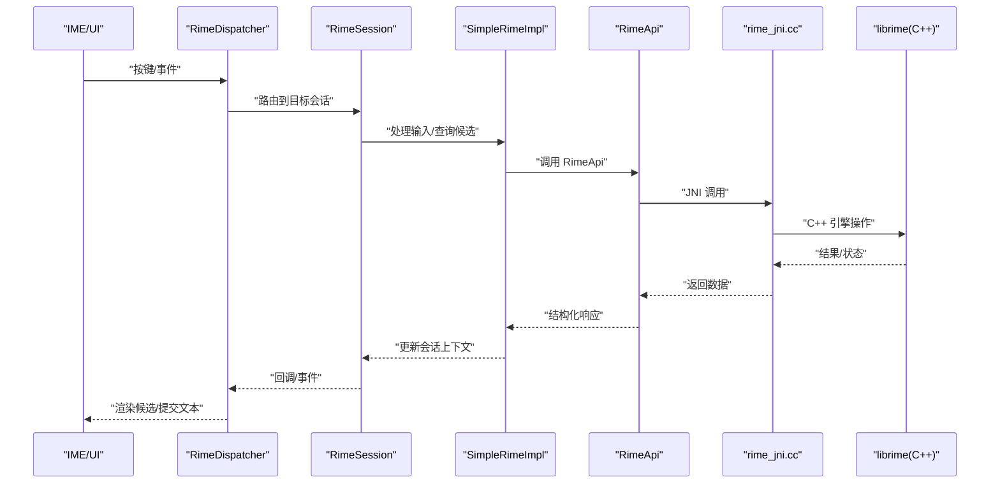
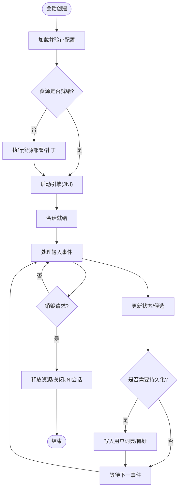
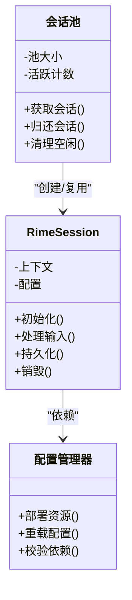
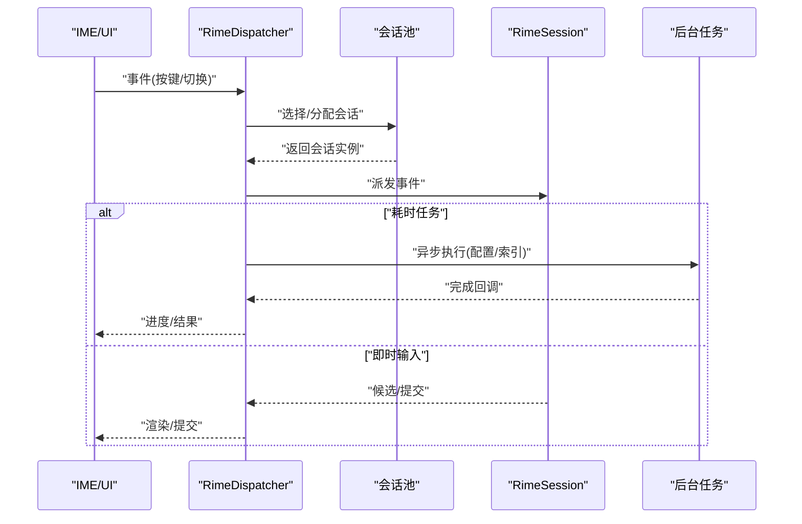
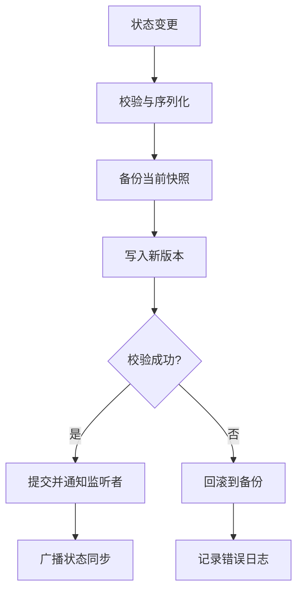
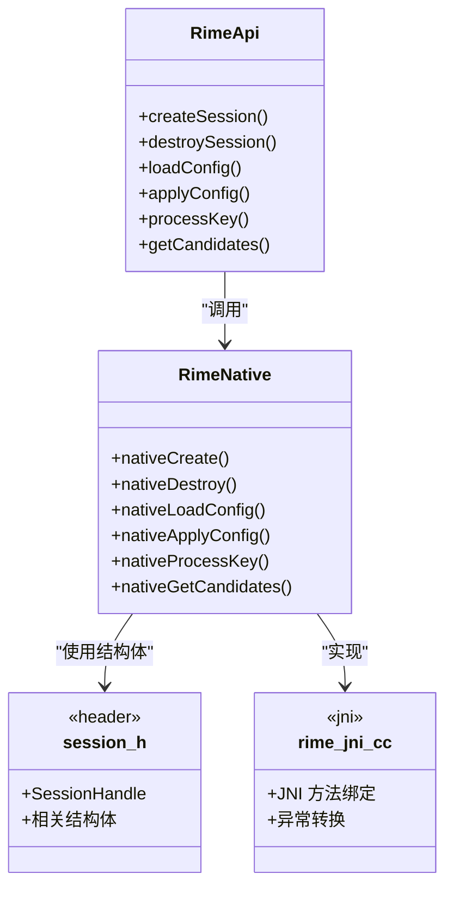
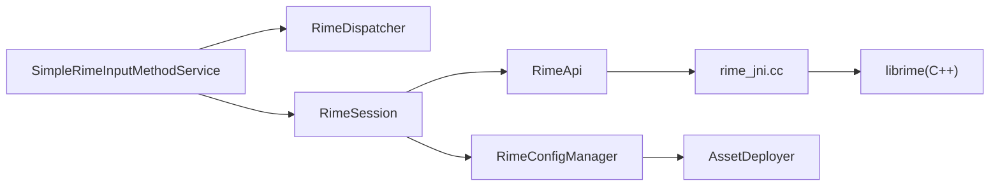

# 会话管理

<cite>
**本文引用的文件**   
- [RimeSession.kt](file://app/src/main/java/com/ziyou/ime/daemon/RimeSession.kt)
- [RimeDispatcher.kt](file://app/src/main/java/com/ziyou/ime/core/RimeDispatcher.kt)
- [SimpleRimeImpl.kt](file://app/src/main/java/com/ziyou/ime/core/SimpleRimeImpl.kt)
- [RimeApi.kt](file://app/src/main/java/com/ziyou/ime/core/RimeApi.kt)
- [RimeNative.kt](file://app/src/main/java/com/ziyou/ime/core/RimeNative.kt)
- [RimeMessage.kt](file://app/src/main/java/com/ziyou/ime/core/RimeMessage.kt)
- [ProtoTypes.kt](file://app/src/main/java/com/ziyou/ime/core/ProtoTypes.kt)
- [RimeConfigManager.kt](file://app/src/main/java/com/ziyou/ime/config/RimeConfigManager.kt)
- [AssetDeployer.kt](file://app/src/main/java/com/ziyou/ime/config/AssetDeployer.kt)
- [session.h](file://app/src/main/jni/librime_jni/session.h)
- [rime_jni.cc](file://app/src/main/jni/librime_jni/rime_jni.cc)
- [config.cc](file://app/src/main/jni/librime_jni/config.cc)
- [SimpleRimeInputMethodService.kt](file://app/src/main/java/com/ziyou/ime/ime/SimpleRimeInputMethodService.kt)
</cite>

## 目录
1. [简介](#简介)
2. [项目结构](#项目结构)
3. [核心组件](#核心组件)
4. [架构总览](#架构总览)
5. [详细组件分析](#详细组件分析)
6. [依赖关系分析](#依赖关系分析)
7. [性能考虑](#性能考虑)
8. [故障排查指南](#故障排查指南)
9. [结论](#结论)
10. [附录](#附录)

## 简介
本技术文档围绕 Rime 输入法的“会话管理”展开，聚焦以下目标：
- 深入解释 RimeSession 的生命周期管理（创建、初始化、配置加载、引擎启动、资源清理）。
- 说明多会话管理机制（会话池、分配策略、并发控制）。
- 解析 RimeDispatcher 的分发机制（事件路由、任务调度、负载均衡）。
- 描述会话状态同步机制（持久化、恢复策略、冲突解决）。
- 提供监控、调试与故障恢复方法。
- 给出性能调优建议与常见问题排查指南。

## 项目结构
本项目采用分层组织方式：
- Android 应用层：IME 服务、UI、配置管理等。
- Core 逻辑层：Rime 的 Java/Kotlin 封装、消息协议、分发器、API 抽象等。
- JNI/JNI 桥接层：Java 与 C++ librime 之间的调用。
- 资源与配置：assets 下的 schema/dict/yaml 配置，以及部署工具。

**图表来源** 
- [SimpleRimeInputMethodService.kt](file://app/src/main/java/com/ziyou/ime/ime/SimpleRimeInputMethodService.kt)
- [RimeSession.kt](file://app/src/main/java/com/ziyou/ime/daemon/RimeSession.kt)
- [RimeDispatcher.kt](file://app/src/main/java/com/ziyou/ime/core/RimeDispatcher.kt)
- [RimeApi.kt](file://app/src/main/java/com/ziyou/ime/core/RimeApi.kt)
- [SimpleRimeImpl.kt](file://app/src/main/java/com/ziyou/ime/core/SimpleRimeImpl.kt)
- [RimeMessage.kt](file://app/src/main/java/com/ziyou/ime/core/RimeMessage.kt)
- [ProtoTypes.kt](file://app/src/main/java/com/ziyou/ime/core/ProtoTypes.kt)
- [RimeConfigManager.kt](file://app/src/main/java/com/ziyou/ime/config/RimeConfigManager.kt)
- [AssetDeployer.kt](file://app/src/main/java/com/ziyou/ime/config/AssetDeployer.kt)
- [rime_jni.cc](file://app/src/main/jni/librime_jni/rime_jni.cc)
- [session.h](file://app/src/main/jni/librime_jni/session.h)
- [config.cc](file://app/src/main/jni/librime_jni/config.cc)

**章节来源**
- [SimpleRimeInputMethodService.kt](file://app/src/main/java/com/ziyou/ime/ime/SimpleRimeInputMethodService.kt)
- [RimeSession.kt](file://app/src/main/java/com/ziyou/ime/daemon/RimeSession.kt)
- [RimeDispatcher.kt](file://app/src/main/java/com/ziyou/ime/core/RimeDispatcher.kt)
- [RimeApi.kt](file://app/src/main/java/com/ziyou/ime/core/RimeApi.kt)
- [SimpleRimeImpl.kt](file://app/src/main/java/com/ziyou/ime/core/SimpleRimeImpl.kt)
- [RimeMessage.kt](file://app/src/main/java/com/ziyou/ime/core/RimeMessage.kt)
- [ProtoTypes.kt](file://app/src/main/java/com/ziyou/ime/core/ProtoTypes.kt)
- [RimeConfigManager.kt](file://app/src/main/java/com/ziyou/ime/config/RimeConfigManager.kt)
- [AssetDeployer.kt](file://app/src/main/java/com/ziyou/ime/config/AssetDeployer.kt)
- [rime_jni.cc](file://app/src/main/jni/librime_jni/rime_jni.cc)
- [session.h](file://app/src/main/jni/librime_jni/session.h)
- [config.cc](file://app/src/main/jni/librime_jni/config.cc)

## 核心组件
- RimeSession：封装单个 Rime 会话的生命周期，负责初始化、配置加载、引擎启动、输入处理与资源释放。
- RimeDispatcher：统一的事件分发中心，负责将来自 UI/IME 的事件路由到具体会话或后台任务，并实现任务调度与负载均衡。
- SimpleRimeImpl：对 RimeApi 的具体实现，协调会话与底层 JNI 交互。
- RimeApi：对外暴露的 Rime 能力接口，屏蔽底层细节。
- RimeMessage/ProtoTypes：定义跨进程/线程的消息结构与类型。
- RimeConfigManager/AssetDeployer：负责配置与资源的部署、热更新与一致性保障。
- JNI 层（rime_jni.cc、session.h、config.cc）：与 C++ librime 交互，完成会话创建、配置编译与应用、状态读写等。

**章节来源**
- [RimeSession.kt](file://app/src/main/java/com/ziyou/ime/daemon/RimeSession.kt)
- [RimeDispatcher.kt](file://app/src/main/java/com/ziyou/ime/core/RimeDispatcher.kt)
- [SimpleRimeImpl.kt](file://app/src/main/java/com/ziyou/ime/core/SimpleRimeImpl.kt)
- [RimeApi.kt](file://app/src/main/java/com/ziyou/ime/core/RimeApi.kt)
- [RimeMessage.kt](file://app/src/main/java/com/ziyou/ime/core/RimeMessage.kt)
- [ProtoTypes.kt](file://app/src/main/java/com/ziyou/ime/core/ProtoTypes.kt)
- [RimeConfigManager.kt](file://app/src/main/java/com/ziyou/ime/config/RimeConfigManager.kt)
- [AssetDeployer.kt](file://app/src/main/java/com/ziyou/ime/config/AssetDeployer.kt)
- [rime_jni.cc](file://app/src/main/jni/librime_jni/rime_jni.cc)
- [session.h](file://app/src/main/jni/librime_jni/session.h)
- [config.cc](file://app/src/main/jni/librime_jni/config.cc)

## 架构总览
下图展示了从 IME 到 Rime 引擎的端到端调用链路与数据流，包括会话生命周期关键阶段。

**图表来源** 
- [SimpleRimeInputMethodService.kt](file://app/src/main/java/com/ziyou/ime/ime/SimpleRimeInputMethodService.kt)
- [RimeDispatcher.kt](file://app/src/main/java/com/ziyou/ime/core/RimeDispatcher.kt)
- [RimeSession.kt](file://app/src/main/java/com/ziyou/ime/daemon/RimeSession.kt)
- [SimpleRimeImpl.kt](file://app/src/main/java/com/ziyou/ime/core/SimpleRimeImpl.kt)
- [RimeApi.kt](file://app/src/main/java/com/ziyou/ime/core/RimeApi.kt)
- [rime_jni.cc](file://app/src/main/jni/librime_jni/rime_jni.cc)

## 详细组件分析

### RimeSession 生命周期管理
- 创建与初始化
  - 在首次需要时创建会话实例，加载默认 schema 与字典，准备内存与缓存。
  - 通过配置管理器确保 assets 中的 schema/dict 已正确部署到可访问路径。
- 配置加载
  - 读取 default.yaml 及 schema 配置文件，校验依赖关系，必要时触发增量部署。
  - 支持用户自定义覆盖，保证优先级顺序。
- 引擎启动
  - 调用 JNI 层创建 C++ 侧会话对象，初始化引擎上下文。
  - 预热常用翻译器与过滤器，减少首帧延迟。
- 输入处理
  - 接收按键事件，进入分词/拼写/翻译管线，生成候选列表。
  - 维护预编辑区、选词历史、标点与切换状态。
- 状态同步与持久化
  - 定期或按需将用户词典、偏好设置写入持久存储。
  - 支持崩溃恢复：重启后重建会话并回滚至最近一致快照。
- 资源清理
  - 销毁 C++ 会话对象，释放内存映射、句柄与缓存。
  - 清理临时文件与锁，避免资源泄漏。

**图表来源** 
- [RimeSession.kt](file://app/src/main/java/com/ziyou/ime/daemon/RimeSession.kt)
- [RimeConfigManager.kt](file://app/src/main/java/com/ziyou/ime/config/RimeConfigManager.kt)
- [AssetDeployer.kt](file://app/src/main/java/com/ziyou/ime/config/AssetDeployer.kt)
- [rime_jni.cc](file://app/src/main/jni/librime_jni/rime_jni.cc)

**章节来源**
- [RimeSession.kt](file://app/src/main/java/com/ziyou/ime/daemon/RimeSession.kt)
- [RimeConfigManager.kt](file://app/src/main/java/com/ziyou/ime/config/RimeConfigManager.kt)
- [AssetDeployer.kt](file://app/src/main/java/com/ziyou/ime/config/AssetDeployer.kt)
- [rime_jni.cc](file://app/src/main/jni/librime_jni/rime_jni.cc)

### 多会话管理与并发控制
- 会话池
  - 维护固定大小或动态扩展的会话池，按业务场景（如不同输入框/应用）分配独立会话。
  - 空闲会话回收策略：超时回收、内存水位回收。
- 分配策略
  - 基于亲和性选择：优先复用同一进程/线程的会话，降低上下文切换开销。
  - 基于负载选择：统计各会话的活跃度和延迟，均衡分配新请求。
- 并发控制
  - 每个会话内部串行化处理输入事件，避免竞态条件。
  - 跨会话共享只读资源（如字典、schema）使用无锁读；写操作加互斥锁。
  - 使用队列缓冲高并发事件，防止阻塞主线程。

**图表来源** 
- [RimeSession.kt](file://app/src/main/java/com/ziyou/ime/daemon/RimeSession.kt)
- [RimeConfigManager.kt](file://app/src/main/java/com/ziyou/ime/config/RimeConfigManager.kt)

**章节来源**
- [RimeSession.kt](file://app/src/main/java/com/ziyou/ime/daemon/RimeSession.kt)
- [RimeConfigManager.kt](file://app/src/main/java/com/ziyou/ime/config/RimeConfigManager.kt)

### RimeDispatcher 分发机制
- 事件路由
  - 根据输入源、目标应用、焦点窗口等元数据将事件路由到对应会话。
  - 支持按主题/模式分流（如拼音、五笔、符号）。
- 任务调度
  - 将耗时任务（如配置重载、词典索引构建）放入后台线程池。
  - 提供优先级队列，保证关键输入低延迟。
- 负载均衡
  - 统计各会话的吞吐与延迟，动态调整分配权重。
  - 失败重试与熔断：当某会话异常时快速降级到其他可用会话。

**图表来源** 
- [RimeDispatcher.kt](file://app/src/main/java/com/ziyou/ime/core/RimeDispatcher.kt)
- [RimeSession.kt](file://app/src/main/java/com/ziyou/ime/daemon/RimeSession.kt)

**章节来源**
- [RimeDispatcher.kt](file://app/src/main/java/com/ziyou/ime/core/RimeDispatcher.kt)
- [RimeSession.kt](file://app/src/main/java/com/ziyou/ime/daemon/RimeSession.kt)

### 会话状态同步机制
- 持久化
  - 用户词典、短语、偏好设置定期落盘，支持增量合并。
  - 写入前进行校验与备份，失败回滚。
- 恢复策略
  - 启动时检测上次快照，若损坏则回退到上一版本。
  - 支持断点续传：长事务分片写入，避免大文件锁竞争。
- 冲突解决
  - 多进程/线程并发修改时使用版本号与时间戳比较，保留最新有效变更。
  - 合并策略：以用户词典为主，系统词典为辅，去重与排序规则明确。

**图表来源** 
- [RimeSession.kt](file://app/src/main/java/com/ziyou/ime/daemon/RimeSession.kt)
- [RimeConfigManager.kt](file://app/src/main/java/com/ziyou/ime/config/RimeConfigManager.kt)

**章节来源**
- [RimeSession.kt](file://app/src/main/java/com/ziyou/ime/daemon/RimeSession.kt)
- [RimeConfigManager.kt](file://app/src/main/java/com/ziyou/ime/config/RimeConfigManager.kt)

### JNI 与 C++ 交互要点
- 会话创建与销毁
  - JNI 层封装创建/销毁 C++ 会话对象的方法，确保引用计数与资源释放。
- 配置编译与应用
  - 将 YAML 配置编译为运行时结构，校验依赖与循环引用。
- 状态读写
  - 提供统一的读写接口，屏蔽 C++ 内部数据结构差异。

**图表来源** 
- [RimeApi.kt](file://app/src/main/java/com/ziyou/ime/core/RimeApi.kt)
- [RimeNative.kt](file://app/src/main/java/com/ziyou/ime/core/RimeNative.kt)
- [session.h](file://app/src/main/jni/librime_jni/session.h)
- [rime_jni.cc](file://app/src/main/jni/librime_jni/rime_jni.cc)

**章节来源**
- [RimeApi.kt](file://app/src/main/java/com/ziyou/ime/core/RimeApi.kt)
- [RimeNative.kt](file://app/src/main/java/com/ziyou/ime/core/RimeNative.kt)
- [session.h](file://app/src/main/jni/librime_jni/session.h)
- [rime_jni.cc](file://app/src/main/jni/librime_jni/rime_jni.cc)

## 依赖关系分析
- 模块耦合
  - IME 服务依赖 RimeDispatcher 与 RimeSession，二者解耦清晰。
  - RimeSession 依赖配置管理器与 JNI 层，职责单一。
  - RimeApi 作为稳定边界，屏蔽底层实现变化。
- 外部依赖
  - assets 中的 schema/dict/yaml 必须完整且版本兼容。
  - C++ librime 库需与 JNI 接口保持一致。
- 潜在循环依赖
  - 通过接口隔离避免循环引用，确保单向依赖。

**图表来源** 
- [SimpleRimeInputMethodService.kt](file://app/src/main/java/com/ziyou/ime/ime/SimpleRimeInputMethodService.kt)
- [RimeDispatcher.kt](file://app/src/main/java/com/ziyou/ime/core/RimeDispatcher.kt)
- [RimeSession.kt](file://app/src/main/java/com/ziyou/ime/daemon/RimeSession.kt)
- [RimeApi.kt](file://app/src/main/java/com/ziyou/ime/core/RimeApi.kt)
- [rime_jni.cc](file://app/src/main/jni/librime_jni/rime_jni.cc)
- [RimeConfigManager.kt](file://app/src/main/java/com/ziyou/ime/config/RimeConfigManager.kt)
- [AssetDeployer.kt](file://app/src/main/java/com/ziyou/ime/config/AssetDeployer.kt)

**章节来源**
- [SimpleRimeInputMethodService.kt](file://app/src/main/java/com/ziyou/ime/ime/SimpleRimeInputMethodService.kt)
- [RimeDispatcher.kt](file://app/src/main/java/com/ziyou/ime/core/RimeDispatcher.kt)
- [RimeSession.kt](file://app/src/main/java/com/ziyou/ime/daemon/RimeSession.kt)
- [RimeApi.kt](file://app/src/main/java/com/ziyou/ime/core/RimeApi.kt)
- [rime_jni.cc](file://app/src/main/jni/librime_jni/rime_jni.cc)
- [RimeConfigManager.kt](file://app/src/main/java/com/ziyou/ime/config/RimeConfigManager.kt)
- [AssetDeployer.kt](file://app/src/main/java/com/ziyou/ime/config/AssetDeployer.kt)

## 性能考虑
- 首帧优化
  - 预加载常用 schema 与词典，减少冷启动延迟。
  - 懒加载非关键资源，按需初始化。
- 内存管理
  - 限制单会话内存上限，及时释放候选缓存与中间结果。
  - 使用对象池复用频繁创建的对象（如键事件、消息结构）。
- I/O 优化
  - 批量写入用户词典，减少 fsync 次数。
  - 使用内存映射读取只读字典，降低拷贝开销。
- 并发优化
  - 输入事件串行化，避免锁竞争。
  - 后台任务限流与优先级调度，避免阻塞主线程。
- 监控指标
  - 跟踪 P95/P99 延迟、候选生成耗时、I/O 吞吐、内存峰值。
  - 建立告警阈值，自动触发扩容或降级。

[本节为通用指导，不直接分析具体文件]

## 故障排查指南
- 常见问题
  - 配置加载失败：检查 YAML 语法、依赖声明与路径权限。
  - 候选为空：确认 schema 启用、词典加载成功、输入法模式正确。
  - 崩溃或卡顿：查看 JNI 异常栈、C++ 日志、内存占用与 GC 行为。
  - 状态不一致：检查持久化版本、锁与并发写入冲突。
- 诊断步骤
  - 启用详细日志，定位事件路由与 JNI 调用链路。
  - 使用最小复现用例，逐步排除配置与资源问题。
  - 抓取堆转储与 native 堆栈，分析内存泄漏与死锁。
- 恢复策略
  - 回滚到上一个稳定配置与快照。
  - 重置会话池，强制重建会话。
  - 隔离异常会话，继续服务其他会话。

**章节来源**
- [RimeSession.kt](file://app/src/main/java/com/ziyou/ime/daemon/RimeSession.kt)
- [RimeDispatcher.kt](file://app/src/main/java/com/ziyou/ime/core/RimeDispatcher.kt)
- [rime_jni.cc](file://app/src/main/jni/librime_jni/rime_jni.cc)

## 结论
本项目的会话管理以 RimeSession 为核心，结合 RimeDispatcher 的统一分发与 SimpleRimeImpl 的实现，形成清晰的层次与职责划分。通过会话池与并发控制提升吞吐与稳定性，借助配置管理与资源部署保证环境一致性。JNI 层屏蔽 C++ 复杂性，提供稳定的 API 边界。建议在性能与可靠性方面持续监控与优化，完善故障恢复与自愈能力。

[本节为总结，不直接分析具体文件]

## 附录
- 术语表
  - 会话：一次独立的 Rime 输入上下文，包含状态、候选、历史等。
  - Schema：输入方案定义，决定分词、翻译与过滤规则。
  - 候选：根据输入生成的可选字词列表。
  - 持久化：将状态保存到磁盘，支持恢复与迁移。
- 参考文件
  - 会话与分发：RimeSession.kt、RimeDispatcher.kt
  - API 与实现：RimeApi.kt、SimpleRimeImpl.kt
  - 配置与资源：RimeConfigManager.kt、AssetDeployer.kt
  - JNI 与 C++：rime_jni.cc、session.h、config.cc

[本节为补充信息，不直接分析具体文件]