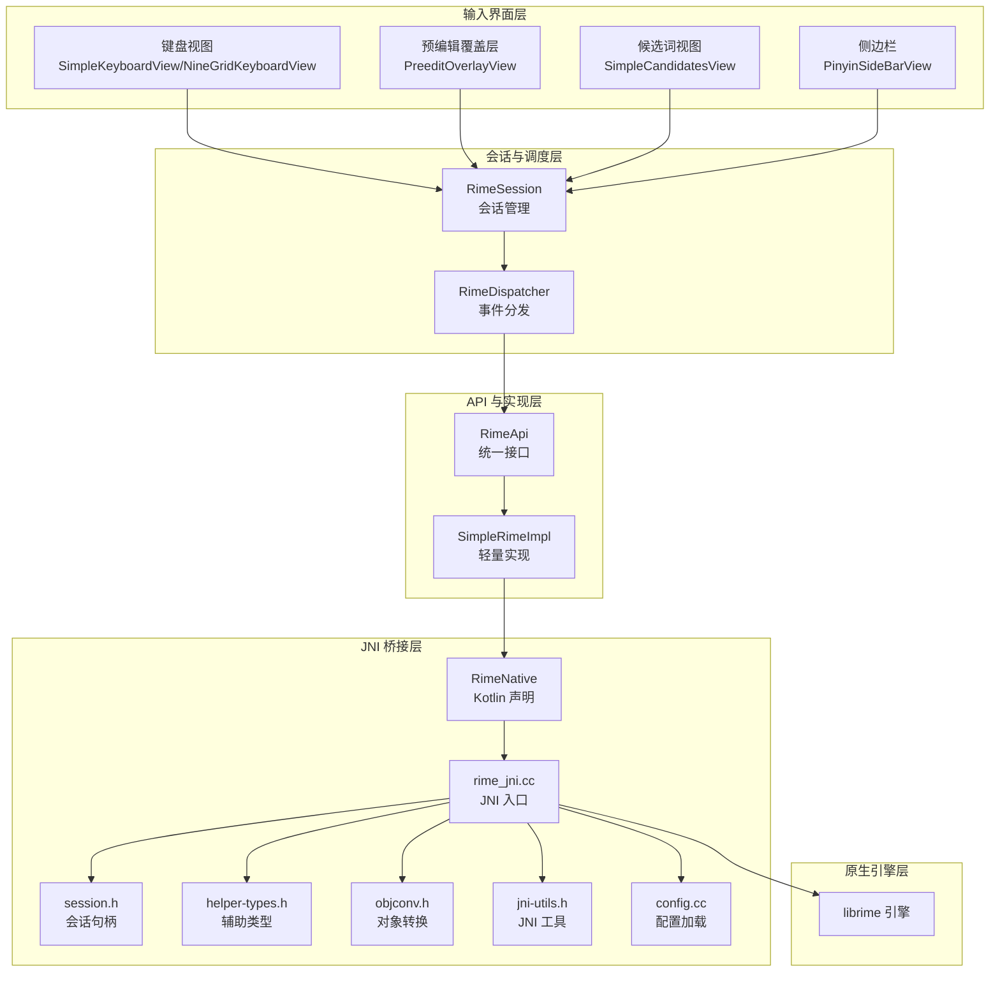
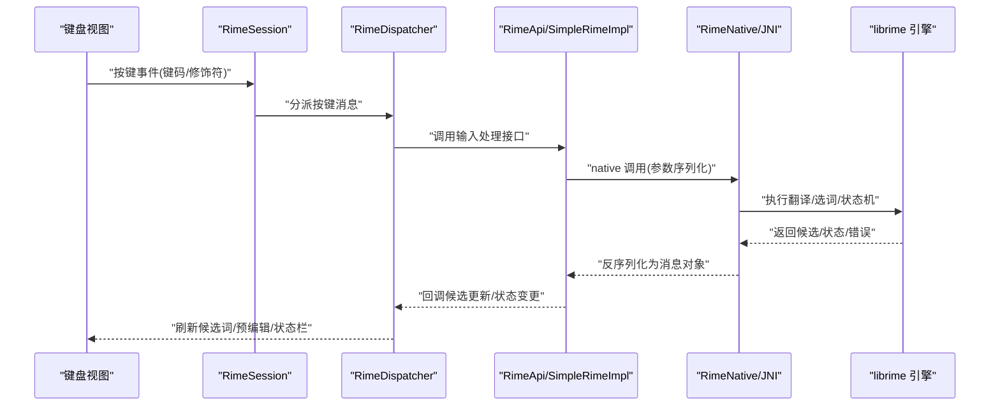
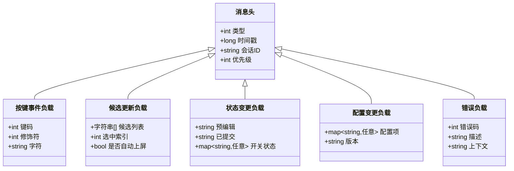
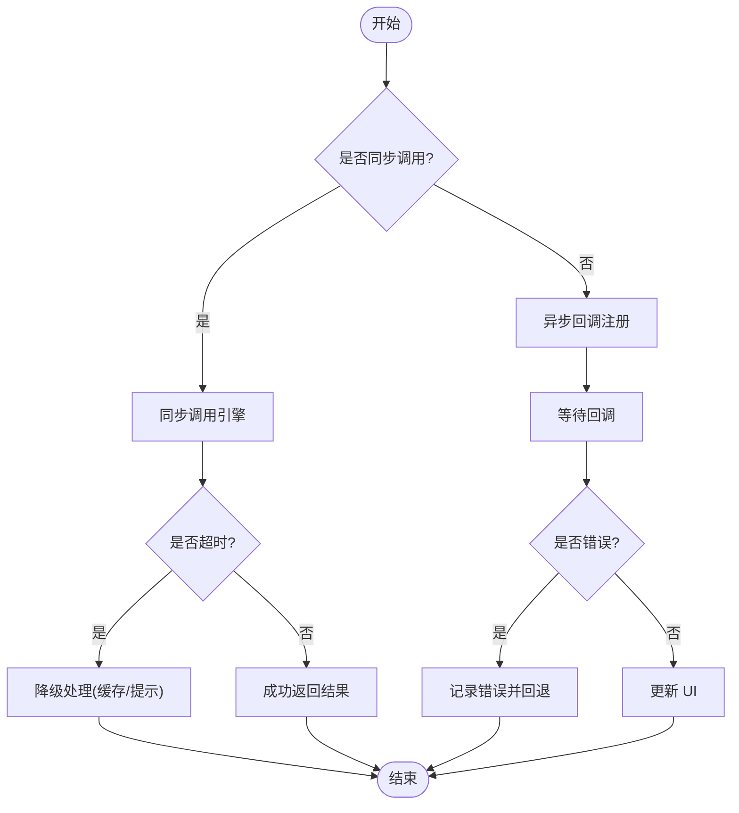
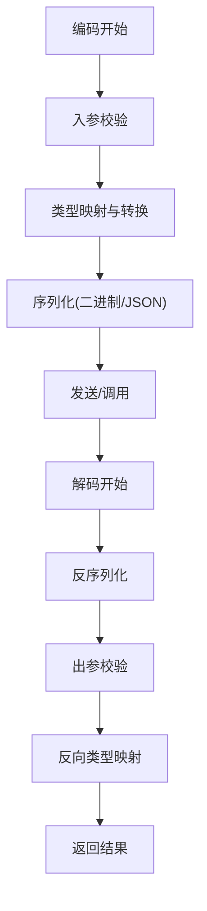
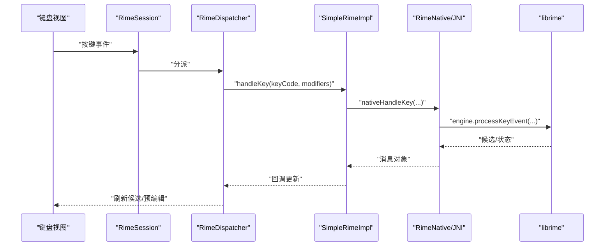
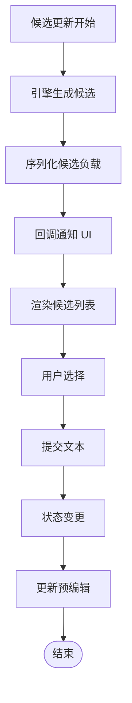
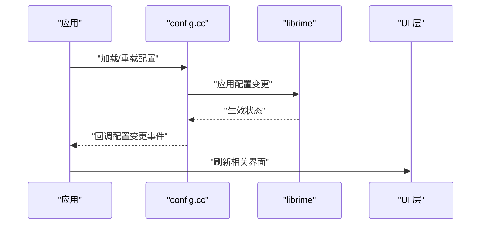
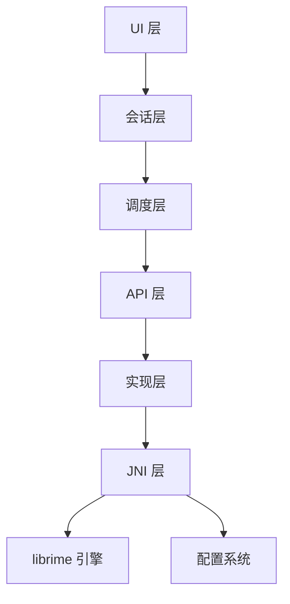

# 消息协议

<cite>
**本文引用的文件**   
- [RimeMessage.kt](file://app/src/main/java/com/ziyou/ime/core/RimeMessage.kt)
- [RimeDispatcher.kt](file://app/src/main/java/com/ziyou/ime/core/RimeDispatcher.kt)
- [RimeApi.kt](file://app/src/main/java/com/ziyou/ime/core/RimeApi.kt)
- [SimpleRimeImpl.kt](file://app/src/main/java/com/ziyou/ime/core/SimpleRimeImpl.kt)
- [ProtoTypes.kt](file://app/src/main/java/com/ziyou/ime/core/ProtoTypes.kt)
- [RimeNative.kt](file://app/src/main/java/com/ziyou/ime/core/RimeNative.kt)
- [rime_jni.cc](file://app/src/main/jni/librime_jni/rime_jni.cc)
- [session.h](file://app/src/main/jni/librime_jni/session.h)
- [helper-types.h](file://app/src/main/jni/librime_jni/helper-types.h)
- [objconv.h](file://app/src/main/jni/librime_jni/objconv.h)
- [jni-utils.h](file://app/src/main/jni/librime_jni/jni-utils.h)
- [config.cc](file://app/src/main/jni/librime_jni/config.cc)
- [CMakeLists.txt](file://app/src/main/jni/librime_jni/CMakeLists.txt)
- [RimeSession.kt](file://app/src/main/java/com/ziyou/ime/daemon/RimeSession.kt)
- [SimpleKeyboardView.kt](file://app/src/main/java/com/ziyou/ime/ime/SimpleKeyboardView.kt)
- [NineGridKeyboardView.kt](file://app/src/main/java/com/ziyou/ime/ime/NineGridKeyboardView.kt)
- [PreeditOverlayView.kt](file://app/src/main/java/com/ziyou/ime/ime/PreeditOverlayView.kt)
- [SimpleCandidatesView.kt](file://app/src/main/java/com/ziyou/ime/ime/SimpleCandidatesView.kt)
- [PinyinSideBarView.kt](file://app/src/main/java/com/ziyou/ime/ime/PinyinSideBarView.kt)
- [KeyCode.kt](file://app/src/main/java/com/ziyou/ime/ime/KeyCode.kt)
- [KeyboardType.kt](file://app/src/main/java/com/ziyou/ime/ime/KeyboardType.kt)
- [BaseKeyboardView.kt](file://app/src/main/java/com/ziyou/ime/ime/BaseKeyboardView.kt)
- [SimpleRimeInputMethodService.kt](file://app/src/main/java/com/ziyou/ime/ime/SimpleRimeInputMethodService.kt)
</cite>

## 目录
1. [简介](#简介)
2. [项目结构](#项目结构)
3. [核心组件](#核心组件)
4. [架构总览](#架构总览)
5. [详细组件分析](#详细组件分析)
6. [依赖关系分析](#依赖关系分析)
7. [性能考量](#性能考量)
8. [故障排查指南](#故障排查指南)
9. [结论](#结论)
10. [附录](#附录)

## 简介
本技术文档聚焦于 Rime 输入法在 Android 端的“消息协议”设计，围绕消息类型定义、数据结构与序列化机制、传输协议（同步/异步、错误码、超时）、编解码流程（类型转换、数据校验、兼容性处理）、调试工具与性能优化、以及协议版本演进与向后兼容策略进行系统化说明。文档面向开发者与集成者，既提供高层架构概览，也深入到关键源码路径与调用序列，帮助读者快速理解并扩展该消息系统。

## 项目结构
本项目采用分层与职责分离的组织方式：
- 应用层（IME UI）：键盘视图与候选词展示等界面组件负责用户交互与渲染。
- 会话与调度层：封装 Rime 会话生命周期、事件分发与回调路由。
- API 与实现层：对外暴露统一 API，内部通过简单实现桥接 JNI。
- JNI 桥接层：将 Kotlin/Java 调用映射到 C++ librime 引擎，完成编解码与状态管理。
- 原生库层：librime 核心引擎与插件体系。

图表来源
- [SimpleKeyboardView.kt](file://app/src/main/java/com/ziyou/ime/ime/SimpleKeyboardView.kt)
- [NineGridKeyboardView.kt](file://app/src/main/java/com/ziyou/ime/ime/NineGridKeyboardView.kt)
- [PreeditOverlayView.kt](file://app/src/main/java/com/ziyou/ime/ime/PreeditOverlayView.kt)
- [SimpleCandidatesView.kt](file://app/src/main/java/com/ziyou/ime/ime/SimpleCandidatesView.kt)
- [PinyinSideBarView.kt](file://app/src/main/java/com/ziyou/ime/ime/PinyinSideBarView.kt)
- [RimeSession.kt](file://app/src/main/java/com/ziyou/ime/daemon/RimeSession.kt)
- [RimeDispatcher.kt](file://app/src/main/java/com/ziyou/ime/core/RimeDispatcher.kt)
- [RimeApi.kt](file://app/src/main/java/com/ziyou/ime/core/RimeApi.kt)
- [SimpleRimeImpl.kt](file://app/src/main/java/com/ziyou/ime/core/SimpleRimeImpl.kt)
- [RimeNative.kt](file://app/src/main/java/com/ziyou/ime/core/RimeNative.kt)
- [rime_jni.cc](file://app/src/main/jni/librime_jni/rime_jni.cc)
- [session.h](file://app/src/main/jni/librime_jni/session.h)
- [helper-types.h](file://app/src/main/jni/librime_jni/helper-types.h)
- [objconv.h](file://app/src/main/jni/librime_jni/objconv.h)
- [jni-utils.h](file://app/src/main/jni/librime_jni/jni-utils.h)
- [config.cc](file://app/src/main/jni/librime_jni/config.cc)

章节来源
- [SimpleKeyboardView.kt](file://app/src/main/java/com/ziyou/ime/ime/SimpleKeyboardView.kt)
- [RimeSession.kt](file://app/src/main/java/com/ziyou/ime/daemon/RimeSession.kt)
- [RimeDispatcher.kt](file://app/src/main/java/com/ziyou/ime/core/RimeDispatcher.kt)
- [RimeApi.kt](file://app/src/main/java/com/ziyou/ime/core/RimeApi.kt)
- [SimpleRimeImpl.kt](file://app/src/main/java/com/ziyou/ime/core/SimpleRimeImpl.kt)
- [RimeNative.kt](file://app/src/main/java/com/ziyou/ime/core/RimeNative.kt)
- [rime_jni.cc](file://app/src/main/jni/librime_jni/rime_jni.cc)
- [session.h](file://app/src/main/jni/librime_jni/session.h)
- [helper-types.h](file://app/src/main/jni/librime_jni/helper-types.h)
- [objconv.h](file://app/src/main/jni/librime_jni/objconv.h)
- [jni-utils.h](file://app/src/main/jni/librime_jni/jni-utils.h)
- [config.cc](file://app/src/main/jni/librime_jni/config.cc)

## 核心组件
- 消息模型与类型
  - 按键事件、候选词更新、状态变更、配置变更、错误通知等消息类型由统一的协议结构承载，确保跨语言边界一致。
  - 关键字段包括：消息类型标识、时间戳、会话标识、负载数据、错误码与描述。
- 会话与调度
  - RimeSession 管理会话生命周期、上下文与订阅关系；RimeDispatcher 负责事件路由与回调派发。
- API 与实现
  - RimeApi 定义对外方法契约；SimpleRimeImpl 提供轻量实现，屏蔽底层细节。
- JNI 桥接
  - RimeNative 声明 native 方法；rime_jni.cc 实现 JNI 入口，使用 session.h、helper-types.h、objconv.h、jni-utils.h 完成类型转换与对象映射；config.cc 负责配置加载与热更新。

章节来源
- [RimeMessage.kt](file://app/src/main/java/com/ziyou/ime/core/RimeMessage.kt)
- [RimeDispatcher.kt](file://app/src/main/java/com/ziyou/ime/core/RimeDispatcher.kt)
- [RimeApi.kt](file://app/src/main/java/com/ziyou/ime/core/RimeApi.kt)
- [SimpleRimeImpl.kt](file://app/src/main/java/com/ziyou/ime/core/SimpleRimeImpl.kt)
- [RimeNative.kt](file://app/src/main/java/com/ziyou/ime/core/RimeNative.kt)
- [rime_jni.cc](file://app/src/main/jni/librime_jni/rime_jni.cc)
- [session.h](file://app/src/main/jni/librime_jni/session.h)
- [helper-types.h](file://app/src/main/jni/librime_jni/helper-types.h)
- [objconv.h](file://app/src/main/jni/librime_jni/objconv.h)
- [jni-utils.h](file://app/src/main/jni/librime_jni/jni-utils.h)
- [config.cc](file://app/src/main/jni/librime_jni/config.cc)

## 架构总览
下图展示了从 UI 到原生引擎的消息流转路径，涵盖按键输入、候选词更新与状态变更的端到端流程。

图表来源
- [SimpleKeyboardView.kt](file://app/src/main/java/com/ziyou/ime/ime/SimpleKeyboardView.kt)
- [RimeSession.kt](file://app/src/main/java/com/ziyou/ime/daemon/RimeSession.kt)
- [RimeDispatcher.kt](file://app/src/main/java/com/ziyou/ime/core/RimeDispatcher.kt)
- [RimeApi.kt](file://app/src/main/java/com/ziyou/ime/core/RimeApi.kt)
- [SimpleRimeImpl.kt](file://app/src/main/java/com/ziyou/ime/core/SimpleRimeImpl.kt)
- [RimeNative.kt](file://app/src/main/java/com/ziyou/ime/core/RimeNative.kt)
- [rime_jni.cc](file://app/src/main/jni/librime_jni/rime_jni.cc)

## 详细组件分析

### 消息模型与数据结构
- 消息类型定义
  - 按键事件：包含键码、修饰符、时间戳、会话 ID。
  - 候选词更新：包含候选列表、索引、选中项、排序信息。
  - 状态变更：包含预编辑文本、提交文本、模式切换标志。
  - 配置变更：包含配置键值对、生效范围、版本号。
  - 错误通知：包含错误码、错误描述、上下文快照。
- 数据结构设计
  - 统一消息头：类型、时间戳、会话 ID、优先级。
  - 负载体：按类型区分字段，支持可选字段与默认值。
  - 校验规则：非空检查、长度限制、枚举合法性、UTF-8 有效性。
- 序列化机制
  - 二进制或 JSON 格式，优先选择紧凑且可扩展的编码。
  - 字段顺序稳定，新增字段保持向后兼容。
  - 大对象（如候选列表）采用流式或分页传输。

图表来源
- [RimeMessage.kt](file://app/src/main/java/com/ziyou/ime/core/RimeMessage.kt)
- [ProtoTypes.kt](file://app/src/main/java/com/ziyou/ime/core/ProtoTypes.kt)

章节来源
- [RimeMessage.kt](file://app/src/main/java/com/ziyou/ime/core/RimeMessage.kt)
- [ProtoTypes.kt](file://app/src/main/java/com/ziyou/ime/core/ProtoTypes.kt)

### 传输协议与调用语义
- 同步/异步调用
  - 按键处理为同步调用，保证输入时序一致性。
  - 候选更新与状态变更为异步回调，避免阻塞 UI。
- 错误码定义
  - 通用错误码：参数无效、会话不存在、引擎不可用、超时、内存不足。
  - 业务错误码：拼写失败、词典未加载、配置解析错误。
- 超时处理
  - 设置合理超时阈值（例如 200ms），超过则降级回退（显示本地缓存或提示重试）。
  - 超时后触发告警日志与指标上报。

图表来源
- [RimeDispatcher.kt](file://app/src/main/java/com/ziyou/ime/core/RimeDispatcher.kt)
- [RimeApi.kt](file://app/src/main/java/com/ziyou/ime/core/RimeApi.kt)
- [SimpleRimeImpl.kt](file://app/src/main/java/com/ziyou/ime/core/SimpleRimeImpl.kt)

章节来源
- [RimeDispatcher.kt](file://app/src/main/java/com/ziyou/ime/core/RimeDispatcher.kt)
- [RimeApi.kt](file://app/src/main/java/com/ziyou/ime/core/RimeApi.kt)
- [SimpleRimeImpl.kt](file://app/src/main/java/com/ziyou/ime/core/SimpleRimeImpl.kt)

### 编解码过程与兼容性
- 类型转换
  - Java/Kotlin 类型到 C++ 类型的映射表，确保数值、字符串、布尔与集合的正确转换。
  - 使用 objconv.h 提供的转换函数，减少手工转换错误。
- 数据验证
  - 入参校验：类型、范围、必填字段。
  - 出参校验：完整性、格式、编码。
- 兼容性处理
  - 版本协商：客户端与服务端（JNI）版本比对，不兼容时回退到安全模式。
  - 字段可选：新增字段默认值，旧客户端忽略未知字段。
  - 灰度发布：通过配置开关控制新功能启用。

图表来源
- [RimeNative.kt](file://app/src/main/java/com/ziyou/ime/core/RimeNative.kt)
- [rime_jni.cc](file://app/src/main/jni/librime_jni/rime_jni.cc)
- [objconv.h](file://app/src/main/jni/librime_jni/objconv.h)
- [helper-types.h](file://app/src/main/jni/librime_jni/helper-types.h)

章节来源
- [RimeNative.kt](file://app/src/main/java/com/ziyou/ime/core/RimeNative.kt)
- [rime_jni.cc](file://app/src/main/jni/librime_jni/rime_jni.cc)
- [objconv.h](file://app/src/main/jni/librime_jni/objconv.h)
- [helper-types.h](file://app/src/main/jni/librime_jni/helper-types.h)

### 按键事件处理流程
- 键盘视图捕获按键，构造按键事件负载。
- RimeSession 维护当前上下文，RimeDispatcher 路由到 RimeApi。
- SimpleRimeImpl 调用 RimeNative 进入 JNI，最终交由 librime 引擎处理。
- 引擎返回候选与状态，JNI 层反序列化为消息，回调上层更新 UI。

图表来源
- [SimpleKeyboardView.kt](file://app/src/main/java/com/ziyou/ime/ime/SimpleKeyboardView.kt)
- [RimeSession.kt](file://app/src/main/java/com/ziyou/ime/daemon/RimeSession.kt)
- [RimeDispatcher.kt](file://app/src/main/java/com/ziyou/ime/core/RimeDispatcher.kt)
- [SimpleRimeImpl.kt](file://app/src/main/java/com/ziyou/ime/core/SimpleRimeImpl.kt)
- [RimeNative.kt](file://app/src/main/java/com/ziyou/ime/core/RimeNative.kt)
- [rime_jni.cc](file://app/src/main/jni/librime_jni/rime_jni.cc)

章节来源
- [SimpleKeyboardView.kt](file://app/src/main/java/com/ziyou/ime/ime/SimpleKeyboardView.kt)
- [RimeSession.kt](file://app/src/main/java/com/ziyou/ime/daemon/RimeSession.kt)
- [RimeDispatcher.kt](file://app/src/main/java/com/ziyou/ime/core/RimeDispatcher.kt)
- [SimpleRimeImpl.kt](file://app/src/main/java/com/ziyou/ime/core/SimpleRimeImpl.kt)
- [RimeNative.kt](file://app/src/main/java/com/ziyou/ime/core/RimeNative.kt)
- [rime_jni.cc](file://app/src/main/jni/librime_jni/rime_jni.cc)

### 候选词更新与状态变更
- 候选词更新
  - 引擎生成候选列表，JNI 层转换为消息负载，上层按需分页渲染。
  - 支持排序、过滤、高亮选中项。
- 状态变更
  - 预编辑文本变化、已提交文本、模式切换（如中英文、符号模式）。
  - 状态变更触发 UI 重绘与焦点管理。

图表来源
- [SimpleCandidatesView.kt](file://app/src/main/java/com/ziyou/ime/ime/SimpleCandidatesView.kt)
- [PreeditOverlayView.kt](file://app/src/main/java/com/ziyou/ime/ime/PreeditOverlayView.kt)
- [RimeMessage.kt](file://app/src/main/java/com/ziyou/ime/core/RimeMessage.kt)

章节来源
- [SimpleCandidatesView.kt](file://app/src/main/java/com/ziyou/ime/ime/SimpleCandidatesView.kt)
- [PreeditOverlayView.kt](file://app/src/main/java/com/ziyou/ime/ime/PreeditOverlayView.kt)
- [RimeMessage.kt](file://app/src/main/java/com/ziyou/ime/core/RimeMessage.kt)

### 配置管理与热更新
- 配置加载
  - config.cc 负责读取 YAML/配置文件，编译与合并配置。
- 热更新
  - 监听配置变更事件，动态生效，无需重启进程。
- 兼容性
  - 版本检测与回退策略，确保旧版本配置可用。

图表来源
- [config.cc](file://app/src/main/jni/librime_jni/config.cc)
- [RimeSession.kt](file://app/src/main/java/com/ziyou/ime/daemon/RimeSession.kt)

章节来源
- [config.cc](file://app/src/main/jni/librime_jni/config.cc)
- [RimeSession.kt](file://app/src/main/java/com/ziyou/ime/daemon/RimeSession.kt)

### 协议版本演进与向后兼容
- 版本协商
  - 客户端与 JNI 层交换版本号，不匹配时进入兼容模式。
- 字段演进
  - 新增字段默认值，旧客户端忽略未知字段。
  - 废弃字段标记，逐步移除。
- 灰度与回滚
  - 通过配置开关控制功能启用，出现问题快速回滚。

章节来源
- [RimeMessage.kt](file://app/src/main/java/com/ziyou/ime/core/RimeMessage.kt)
- [ProtoTypes.kt](file://app/src/main/java/com/ziyou/ime/core/ProtoTypes.kt)
- [config.cc](file://app/src/main/jni/librime_jni/config.cc)

## 依赖关系分析
- 组件耦合
  - UI 层依赖会话与调度层，低耦合通过消息解耦。
  - API 与实现层隔离 JNI 细节，便于替换实现。
  - JNI 层依赖原生引擎，但通过抽象接口降低直接耦合。
- 外部依赖
  - librime 引擎提供核心能力，插件体系扩展功能。
  - 配置系统依赖 YAML 解析与合并。

图表来源
- [SimpleKeyboardView.kt](file://app/src/main/java/com/ziyou/ime/ime/SimpleKeyboardView.kt)
- [RimeSession.kt](file://app/src/main/java/com/ziyou/ime/daemon/RimeSession.kt)
- [RimeDispatcher.kt](file://app/src/main/java/com/ziyou/ime/core/RimeDispatcher.kt)
- [RimeApi.kt](file://app/src/main/java/com/ziyou/ime/core/RimeApi.kt)
- [SimpleRimeImpl.kt](file://app/src/main/java/com/ziyou/ime/core/SimpleRimeImpl.kt)
- [RimeNative.kt](file://app/src/main/java/com/ziyou/ime/core/RimeNative.kt)
- [rime_jni.cc](file://app/src/main/jni/librime_jni/rime_jni.cc)
- [config.cc](file://app/src/main/jni/librime_jni/config.cc)

章节来源
- [SimpleKeyboardView.kt](file://app/src/main/java/com/ziyou/ime/ime/SimpleKeyboardView.kt)
- [RimeSession.kt](file://app/src/main/java/com/ziyou/ime/daemon/RimeSession.kt)
- [RimeDispatcher.kt](file://app/src/main/java/com/ziyou/ime/core/RimeDispatcher.kt)
- [RimeApi.kt](file://app/src/main/java/com/ziyou/ime/core/RimeApi.kt)
- [SimpleRimeImpl.kt](file://app/src/main/java/com/ziyou/ime/core/SimpleRimeImpl.kt)
- [RimeNative.kt](file://app/src/main/java/com/ziyou/ime/core/RimeNative.kt)
- [rime_jni.cc](file://app/src/main/jni/librime_jni/rime_jni.cc)
- [config.cc](file://app/src/main/jni/librime_jni/config.cc)

## 性能考量
- 输入延迟优化
  - 按键处理尽量同步，避免额外线程切换。
  - 候选列表分页与懒加载，减少首帧渲染时间。
- 内存与 CPU
  - 大对象序列化采用流式处理，避免一次性分配。
  - 缓存热点数据（如常用候选、最近配置）。
- 并发与线程
  - 异步回调在主线程更新 UI，后台线程处理耗时任务。
  - 锁粒度最小化，避免死锁与竞争。
- 监控与指标
  - 记录关键路径耗时、错误率、超时次数。
  - 定期采样与上报，定位瓶颈。

[本节为通用指导，不直接分析具体文件]

## 故障排查指南
- 常见问题
  - 按键无响应：检查会话初始化、JNI 加载、权限与焦点。
  - 候选为空：确认词典加载、配置正确、网络依赖（如有）。
  - 崩溃或卡顿：查看 JNI 异常、内存泄漏、主线程阻塞。
- 调试工具
  - 启用详细日志，输出消息序列与耗时。
  - 使用模拟器与断点，逐步跟踪编解码过程。
  - 配置开关控制功能灰度，快速定位问题。
- 恢复策略
  - 超时重试与降级，保证用户体验。
  - 配置回滚与热更新，快速修复。

章节来源
- [RimeSession.kt](file://app/src/main/java/com/ziyou/ime/daemon/RimeSession.kt)
- [RimeDispatcher.kt](file://app/src/main/java/com/ziyou/ime/core/RimeDispatcher.kt)
- [config.cc](file://app/src/main/jni/librime_jni/config.cc)

## 结论
本消息协议以统一的消息模型与清晰的传输语义为核心，结合 JNI 桥接与 librime 引擎，实现了高效、可扩展的输入法消息系统。通过严格的编解码与兼容性策略，保障了跨版本与跨平台的稳定性。建议在生产环境中加强监控与测试，持续优化性能与用户体验。

[本节为总结性内容，不直接分析具体文件]

## 附录
- 相关文件清单
  - 消息模型与类型：RimeMessage.kt、ProtoTypes.kt
  - 会话与调度：RimeSession.kt、RimeDispatcher.kt
  - API 与实现：RimeApi.kt、SimpleRimeImpl.kt
  - JNI 桥接：RimeNative.kt、rime_jni.cc、session.h、helper-types.h、objconv.h、jni-utils.h、config.cc
  - UI 组件：SimpleKeyboardView.kt、NineGridKeyboardView.kt、PreeditOverlayView.kt、SimpleCandidatesView.kt、PinyinSideBarView.kt、BaseKeyboardView.kt、SimpleRimeInputMethodService.kt、KeyCode.kt、KeyboardType.kt
  - 构建配置：CMakeLists.txt

[本节为附录，不直接分析具体文件]