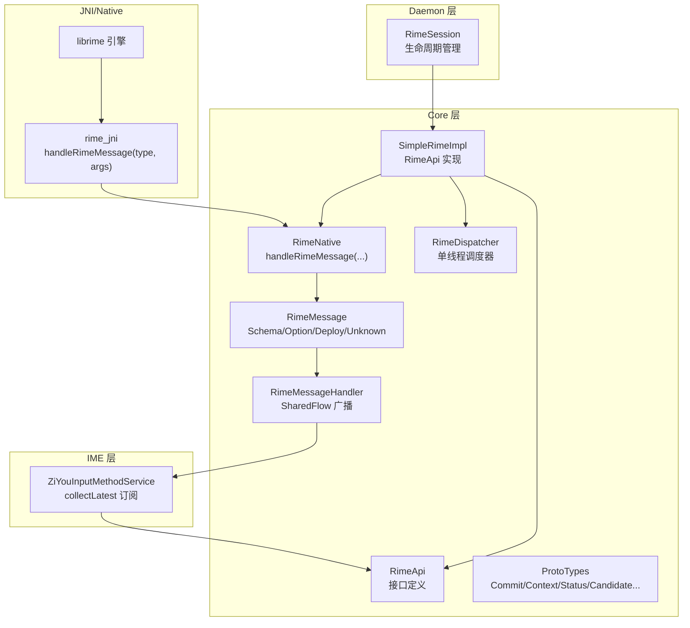
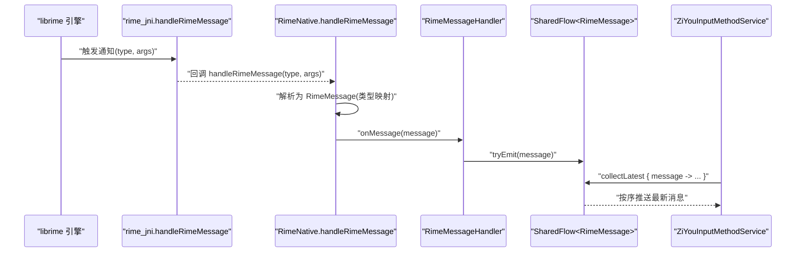
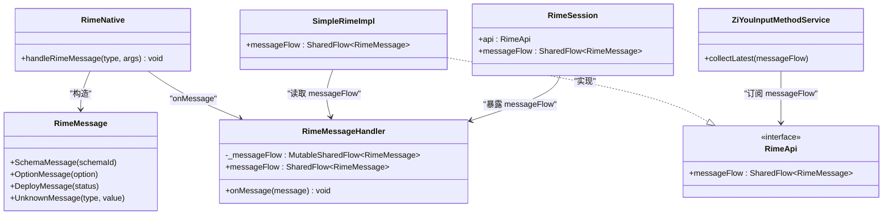
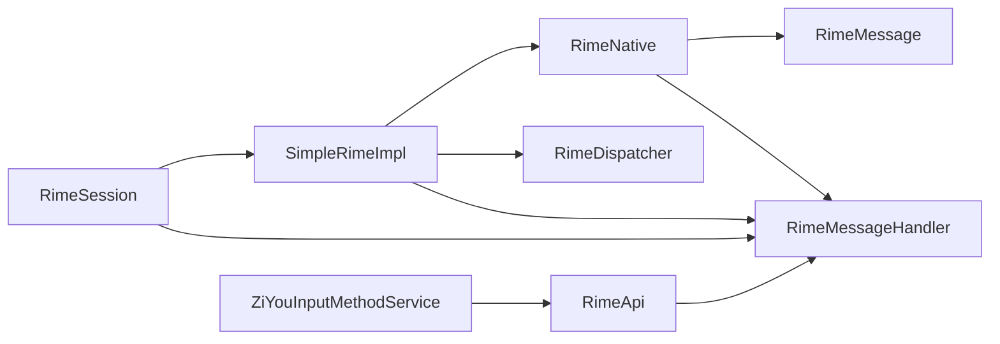

# 消息流系统

<cite>
**本文引用的文件**   
- [RimeMessage.kt](file://app/src/main/java/com/ziyou/ime/core/RimeMessage.kt)
- [RimeDispatcher.kt](file://app/src/main/java/com/ziyou/ime/core/RimeDispatcher.kt)
- [SimpleRimeImpl.kt](file://app/src/main/java/com/ziyou/ime/core/SimpleRimeImpl.kt)
- [RimeApi.kt](file://app/src/main/java/com/ziyou/ime/core/RimeApi.kt)
- [RimeNative.kt](file://app/src/main/java/com/ziyou/ime/core/RimeNative.kt)
- [ProtoTypes.kt](file://app/src/main/java/com/ziyou/ime/core/ProtoTypes.kt)
- [RimeSession.kt](file://app/src/main/java/com/ziyou/ime/daemon/RimeSession.kt)
- [ZiYouInputMethodService.kt](file://app/src/main/java/com/ziyou/ime/ime/ZiYouInputMethodService.kt)
</cite>

## 目录
1. [简介](#简介)
2. [项目结构](#项目结构)
3. [核心组件](#核心组件)
4. [架构总览](#架构总览)
5. [详细组件分析](#详细组件分析)
6. [依赖关系分析](#依赖关系分析)
7. [性能考量](#性能考量)
8. [故障排查指南](#故障排查指南)
9. [结论](#结论)
10. [附录](#附录)

## 简介
本文件面向输入法项目的“消息流系统”，聚焦于 librime 引擎通知到 UI 层的异步事件通道设计。内容涵盖：
- RimeMessage 数据模型与消息类型（schema 切换、option 变更、deploy 状态）
- SharedFlow 实现机制与背压策略
- librime 引擎通知回调的接入点与分发流程
- 订阅/发布模式、过滤与转换策略
- 错误处理与重试建议
- 性能优化与内存管理要点
- 使用示例路径，便于快速上手

## 项目结构
消息流系统位于 core 层与 ime 层之间，通过 JNI 桥接 librime，由 RimeDispatcher 保证线程安全，RimeMessageHandler 提供 SharedFlow 广播，UI 层通过 collectLatest 订阅并处理。

图表来源
- [RimeNative.kt:152-168](file://app/src/main/java/com/ziyou/ime/core/RimeNative.kt#L152-L168)
- [RimeMessage.kt:11-23](file://app/src/main/java/com/ziyou/ime/core/RimeMessage.kt#L11-L23)
- [RimeMessage.kt:29-41](file://app/src/main/java/com/ziyou/ime/core/RimeMessage.kt#L29-L41)
- [RimeDispatcher.kt:22-38](file://app/src/main/java/com/ziyou/ime/core/RimeDispatcher.kt#L22-L38)
- [SimpleRimeImpl.kt:172-176](file://app/src/main/java/com/ziyou/ime/core/SimpleRimeImpl.kt#L172-L176)
- [RimeApi.kt:100-104](file://app/src/main/java/com/ziyou/ime/core/RimeApi.kt#L100-L104)
- [RimeSession.kt:72-78](file://app/src/main/java/com/ziyou/ime/daemon/RimeSession.kt#L72-L78)
- [ZiYouInputMethodService.kt:400-406](file://app/src/main/java/com/ziyou/ime/ime/ZiYouInputMethodService.kt#L400-L406)

章节来源
- [RimeMessage.kt:1-42](file://app/src/main/java/com/ziyou/ime/core/RimeMessage.kt#L1-L42)
- [RimeDispatcher.kt:1-91](file://app/src/main/java/com/ziyou/ime/core/RimeDispatcher.kt#L1-L91)
- [SimpleRimeImpl.kt:1-177](file://app/src/main/java/com/ziyou/ime/core/SimpleRimeImpl.kt#L1-L177)
- [RimeApi.kt:1-105](file://app/src/main/java/com/ziyou/ime/core/RimeApi.kt#L1-L105)
- [RimeNative.kt:1-170](file://app/src/main/java/com/ziyou/ime/core/RimeNative.kt#L1-L170)
- [ProtoTypes.kt:1-108](file://app/src/main/java/com/ziyou/ime/core/ProtoTypes.kt#L1-L108)
- [RimeSession.kt:1-226](file://app/src/main/java/com/ziyou/ime/daemon/RimeSession.kt#L1-L226)
- [ZiYouInputMethodService.kt:400-406](file://app/src/main/java/com/ziyou/ime/ime/ZiYouInputMethodService.kt#L400-L406)

## 核心组件
- RimeMessage：密封类，定义四类消息 SchemaMessage、OptionMessage、DeployMessage、UnknownMessage，承载 librime 引擎通知。
- RimeMessageHandler：持有 MutableSharedFlow<RimeMessage>，对外暴露 asSharedFlow()；onMessage 用于接收 JNI 回调并 tryEmit。
- RimeDispatcher：单线程协程调度器，确保所有 librime API 调用顺序执行，避免非线程安全问题。
- SimpleRimeImpl：RimeApi 的实现，封装所有 suspend 方法，统一经 dispatcher.dispatch 执行，并提供 messageFlow 访问。
- RimeNative：JNI 桥接层，包含 handleRimeMessage(type, args)，将原生通知转换为 RimeMessage 并投递给 RimeMessageHandler。
- RimeSession：会话管理器，负责初始化、销毁、重新部署，并暴露 messageFlow。
- ZiYouInputMethodService：IME 服务，collectLatest 订阅 messageFlow，进行 UI 更新与业务处理。

章节来源
- [RimeMessage.kt:11-41](file://app/src/main/java/com/ziyou/ime/core/RimeMessage.kt#L11-L41)
- [RimeDispatcher.kt:22-60](file://app/src/main/java/com/ziyou/ime/core/RimeDispatcher.kt#L22-L60)
- [SimpleRimeImpl.kt:10-176](file://app/src/main/java/com/ziyou/ime/core/SimpleRimeImpl.kt#L10-L176)
- [RimeNative.kt:152-168](file://app/src/main/java/com/ziyou/ime/core/RimeNative.kt#L152-L168)
- [RimeSession.kt:72-78](file://app/src/main/java/com/ziyou/ime/daemon/RimeSession.kt#L72-L78)
- [ZiYouInputMethodService.kt:400-406](file://app/src/main/java/com/ziyou/ime/ime/ZiYouInputMethodService.kt#L400-L406)

## 架构总览
下图展示从 librime 引擎通知到 UI 订阅的完整链路，包括线程边界与关键对象职责。

图表来源
- [RimeNative.kt:152-168](file://app/src/main/java/com/ziyou/ime/core/RimeNative.kt#L152-L168)
- [RimeMessage.kt:29-41](file://app/src/main/java/com/ziyou/ime/core/RimeMessage.kt#L29-L41)
- [ZiYouInputMethodService.kt:400-406](file://app/src/main/java/com/ziyou/ime/ime/ZiYouInputMethodService.kt#L400-L406)

## 详细组件分析

### RimeMessage 数据模型与用途
- SchemaMessage(schemaId)：表示当前输入方案切换完成，携带新方案 ID。
- OptionMessage(option)：表示运行时选项变更（如中英文、简繁等），携带选项键名。
- DeployMessage(status)：表示部署状态变化（如词库部署阶段或结果）。
- UnknownMessage(type, value)：兜底未知类型，便于调试与扩展。

该模型在 RimeNative.handleRimeMessage 中根据 type 映射构造，随后通过 RimeMessageHandler.onMessage 进入 SharedFlow。

章节来源
- [RimeMessage.kt:11-23](file://app/src/main/java/com/ziyou/ime/core/RimeMessage.kt#L11-L23)
- [RimeNative.kt:152-168](file://app/src/main/java/com/ziyou/ime/core/RimeNative.kt#L152-L168)

### SharedFlow 实现与背压
- 使用 MutableSharedFlow<RimeMessage>(replay=1, extraBufferCapacity=16) 作为内部流，对外暴露 asSharedFlow()。
- replay=1 保证新订阅者能收到最近一条消息，适合 UI 重建后同步状态。
- extraBufferCapacity=16 提供额外缓冲，缓解短时突发峰值；默认背压策略为 BufferOverflow.SUSPEND，当缓冲区满时挂起生产者，避免 OOM。
- onMessage 使用 tryEmit，若下游未准备好会返回 false，不会阻塞上游；如需强一致可改用 emit（但可能阻塞 JNI 回调线程）。

章节来源
- [RimeMessage.kt:29-41](file://app/src/main/java/com/ziyou/ime/core/RimeMessage.kt#L29-L41)

### librime 引擎通知回调处理
- JNI 层通过 handleRimeMessage(type, args) 回调，将 type 映射为具体 RimeMessage 子类。
- 映射规则：1→SchemaMessage，2→OptionMessage，3→DeployMessage，其他→UnknownMessage。
- 构造完成后调用 RimeMessageHandler.onMessage，进入 SharedFlow 分发。

章节来源
- [RimeNative.kt:152-168](file://app/src/main/java/com/ziyou/ime/core/RimeNative.kt#L152-L168)

### 订阅与发布模式
- 发布者：RimeMessageHandler 持有 MutableSharedFlow，外部通过 RimeNative.handleRimeMessage 注入消息。
- 订阅者：ZiYouInputMethodService 使用 collectLatest 订阅 Rime.messageFlow，确保只处理最新消息，避免 UI 卡顿。
- 暴露点：RimeApi.messageFlow、RimeSession.messageFlow 均指向 RimeMessageHandler.messageFlow，方便多入口订阅。

章节来源
- [SimpleRimeImpl.kt:172-176](file://app/src/main/java/com/ziyou/ime/core/SimpleRimeImpl.kt#L172-L176)
- [RimeApi.kt:100-104](file://app/src/main/java/com/ziyou/ime/core/RimeApi.kt#L100-L104)
- [RimeSession.kt:72-78](file://app/src/main/java/com/ziyou/ime/daemon/RimeSession.kt#L72-L78)
- [ZiYouInputMethodService.kt:400-406](file://app/src/main/java/com/ziyou/ime/ime/ZiYouInputMethodService.kt#L400-L406)

### 消息过滤与转换策略
- 在 UI 层对 messageFlow 进行 map/filter 转换，例如仅处理 SchemaMessage 或 OptionMessage。
- 可使用 distinctUntilChanged 去重，避免重复 UI 刷新。
- 对于高频消息，可在收集端使用 buffer/mapping 合并处理，减少主线程开销。

章节来源
- [ZiYouInputMethodService.kt:400-406](file://app/src/main/java/com/ziyou/ime/ime/ZiYouInputMethodService.kt#L400-L406)

### 错误处理与重试机制
- RimeDispatcher 捕获异常并记录日志，抛出上层以便调用方处理。
- dispatchWithTimeout 支持超时保护，避免长时间阻塞。
- 对于消息传递失败（tryEmit=false），建议在 UI 侧做幂等处理与降级逻辑；必要时结合本地状态缓存恢复。
- 引擎启动采用 withTimeoutOrNull 保护，避免 ANR。

章节来源
- [RimeDispatcher.kt:48-78](file://app/src/main/java/com/ziyou/ime/core/RimeDispatcher.kt#L48-L78)
- [RimeSession.kt:135-152](file://app/src/main/java/com/ziyou/ime/daemon/RimeSession.kt#L135-L152)

### 代码级类图（消息相关）

图表来源
- [RimeMessage.kt:11-23](file://app/src/main/java/com/ziyou/ime/core/RimeMessage.kt#L11-L23)
- [RimeMessage.kt:29-41](file://app/src/main/java/com/ziyou/ime/core/RimeMessage.kt#L29-L41)
- [RimeNative.kt:152-168](file://app/src/main/java/com/ziyou/ime/core/RimeNative.kt#L152-L168)
- [SimpleRimeImpl.kt:172-176](file://app/src/main/java/com/ziyou/ime/core/SimpleRimeImpl.kt#L172-L176)
- [RimeApi.kt:100-104](file://app/src/main/java/com/ziyou/ime/core/RimeApi.kt#L100-L104)
- [RimeSession.kt:72-78](file://app/src/main/java/com/ziyou/ime/daemon/RimeSession.kt#L72-L78)
- [ZiYouInputMethodService.kt:400-406](file://app/src/main/java/com/ziyou/ime/ime/ZiYouInputMethodService.kt#L400-L406)

### 典型使用示例（以路径代替代码）
- 订阅 Schema 切换消息并更新 UI：参考 [ZiYouInputMethodService.kt:400-406](file://app/src/main/java/com/ziyou/ime/ime/ZiYouInputMethodService.kt#L400-L406)
- 订阅 Option 变更并刷新显示模式：同上位置，在 handleRimeMessage 分支处理 OptionMessage
- 监听 Deploy 状态并提示用户：同上位置，在 handleRimeMessage 分支处理 DeployMessage
- 获取当前方案列表与切换方案：参考 [SimpleRimeImpl.kt:132-148](file://app/src/main/java/com/ziyou/ime/core/SimpleRimeImpl.kt#L132-L148)

## 依赖关系分析
- RimeNative 依赖 RimeMessage 与 RimeMessageHandler，承担 JNI 回调到 Kotlin 对象的转换。
- RimeMessageHandler 被多处引用（RimeSession、SimpleRimeImpl），作为单一消息源。
- SimpleRimeImpl 依赖 RimeDispatcher 与 RimeNative，统一线程与 JNI 调用。
- RimeSession 组合 SimpleRimeImpl 与 RimeDispatcher，管理生命周期。
- ZiYouInputMethodService 通过 RimeApi.messageFlow 订阅消息，解耦 UI 与引擎。

图表来源
- [RimeNative.kt:152-168](file://app/src/main/java/com/ziyou/ime/core/RimeNative.kt#L152-L168)
- [RimeMessage.kt:29-41](file://app/src/main/java/com/ziyou/ime/core/RimeMessage.kt#L29-L41)
- [SimpleRimeImpl.kt:10-176](file://app/src/main/java/com/ziyou/ime/core/SimpleRimeImpl.kt#L10-L176)
- [RimeSession.kt:72-78](file://app/src/main/java/com/ziyou/ime/daemon/RimeSession.kt#L72-L78)
- [RimeApi.kt:100-104](file://app/src/main/java/com/ziyou/ime/core/RimeApi.kt#L100-L104)

章节来源
- [RimeNative.kt:1-170](file://app/src/main/java/com/ziyou/ime/core/RimeNative.kt#L1-L170)
- [RimeMessage.kt:1-42](file://app/src/main/java/com/ziyou/ime/core/RimeMessage.kt#L1-L42)
- [SimpleRimeImpl.kt:1-177](file://app/src/main/java/com/ziyou/ime/core/SimpleRimeImpl.kt#L1-L177)
- [RimeSession.kt:1-226](file://app/src/main/java/com/ziyou/ime/daemon/RimeSession.kt#L1-L226)
- [RimeApi.kt:1-105](file://app/src/main/java/com/ziyou/ime/core/RimeApi.kt#L1-L105)

## 性能考量
- 热路径优化：processKeyBulk 一次 JNI 跨界返回 consumed/commit/context，减少线程往返与跨层调用次数。
- 背压控制：SharedFlow 使用 extraBufferCapacity=16，默认 SUSPEND 背压，避免 OOM；UI 侧使用 collectLatest 丢弃中间帧，降低渲染压力。
- 线程隔离：RimeDispatcher 单线程执行 librime API，避免锁竞争与数据竞争。
- 资源回收：部署完成后调用 trimNativeHeap 归还 native 堆空闲页，降低常驻内存占用。
- 启动保护：withTimeoutOrNull 限制启动耗时，防止 ANR。

章节来源
- [RimeApi.kt:31-40](file://app/src/main/java/com/ziyou/ime/core/RimeApi.kt#L31-L40)
- [RimeNative.kt:52-58](file://app/src/main/java/com/ziyou/ime/core/RimeNative.kt#L52-L58)
- [RimeSession.kt:135-152](file://app/src/main/java/com/ziyou/ime/daemon/RimeSession.kt#L135-L152)
- [RimeMessage.kt:30-33](file://app/src/main/java/com/ziyou/ime/core/RimeMessage.kt#L30-L33)

## 故障排查指南
- 引擎未加载：检查 rime_jni 是否成功加载，确认 ABI 匹配与 .so 存在。
- 消息丢失：确认 collectLatest 是否在合适的生命周期启动；检查 SharedFlow 背压策略与缓冲区大小。
- 线程异常：确保所有 librime 调用经 RimeDispatcher.dispatch；查看日志定位异常栈。
- 启动超时：调整 fullCheck 或检查词典文件完整性；关注 withTimeoutOrNull 返回值。
- 内存占用高：部署完成后调用 trimNativeHeap；监控 SharedFlow 缓冲区堆积情况。

章节来源
- [RimeNative.kt:18-27](file://app/src/main/java/com/ziyou/ime/core/RimeNative.kt#L18-L27)
- [RimeDispatcher.kt:48-78](file://app/src/main/java/com/ziyou/ime/core/RimeDispatcher.kt#L48-L78)
- [RimeSession.kt:135-152](file://app/src/main/java/com/ziyou/ime/daemon/RimeSession.kt#L135-L152)
- [RimeMessage.kt:30-33](file://app/src/main/java/com/ziyou/ime/core/RimeMessage.kt#L30-L33)

## 结论
消息流系统通过 RimeMessage 抽象 librime 通知，借助 RimeMessageHandler 的 SharedFlow 实现高效、线程安全的广播分发。RimeDispatcher 保障 librime 调用的串行化与稳定性，UI 层通过 collectLatest 消费最新状态，配合背压与超时保护，兼顾性能与可靠性。建议在业务层按需过滤与转换消息，避免不必要的处理开销，并在部署完成后释放 native 内存，提升整体体验。

## 附录
- 数据模型参考：CommitProto、ContextProto、StatusProto、CandidateProto 等定义见 [ProtoTypes.kt:1-108](file://app/src/main/java/com/ziyou/ime/core/ProtoTypes.kt#L1-L108)
- 订阅入口参考：[ZiYouInputMethodService.kt:400-406](file://app/src/main/java/com/ziyou/ime/ime/ZiYouInputMethodService.kt#L400-L406)
- 消息处理入口参考：[RimeNative.kt:152-168](file://app/src/main/java/com/ziyou/ime/core/RimeNative.kt#L152-L168)