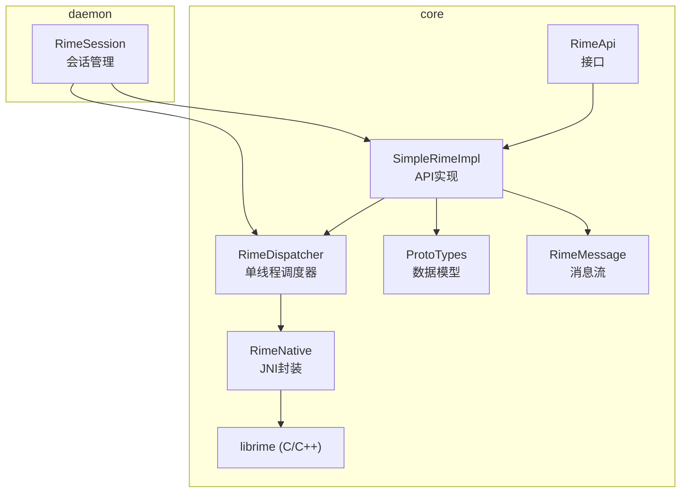
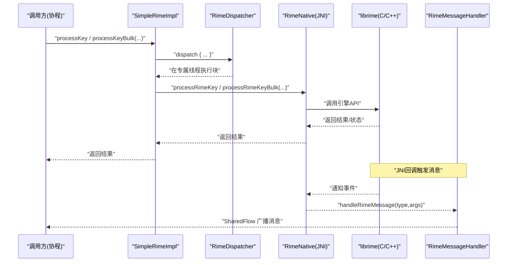
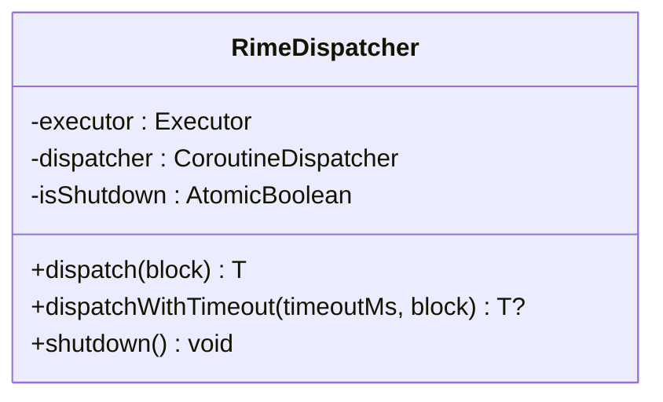
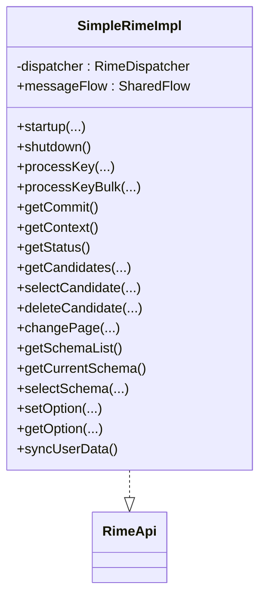
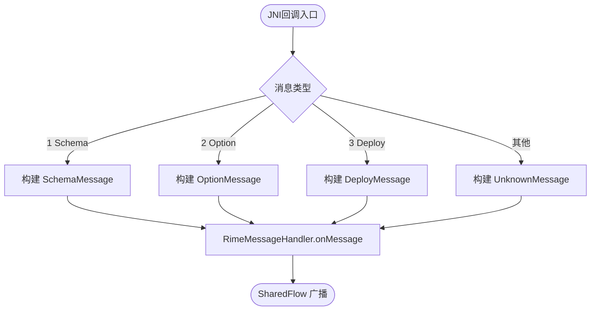
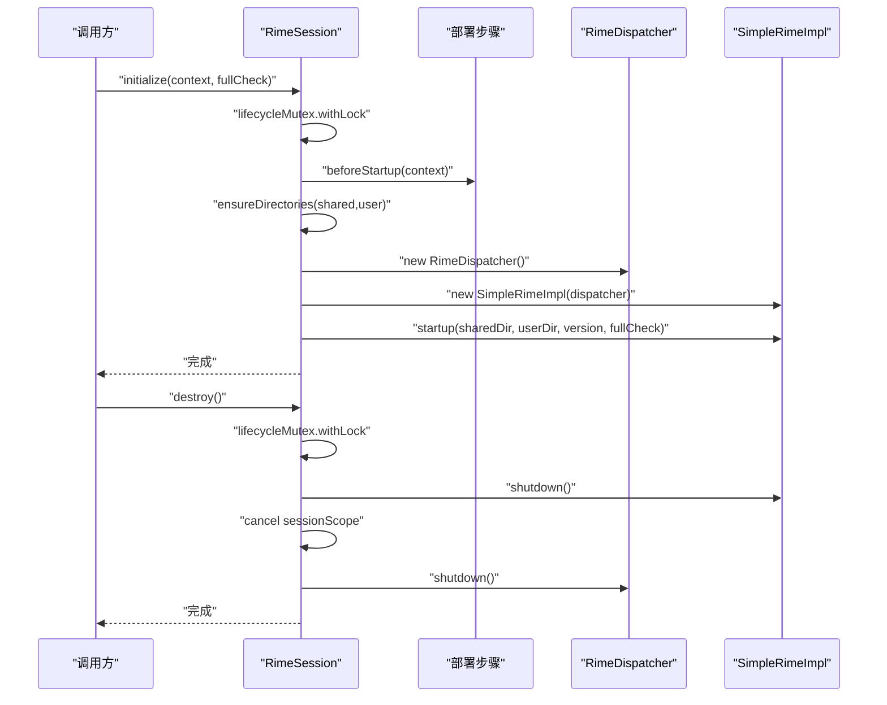
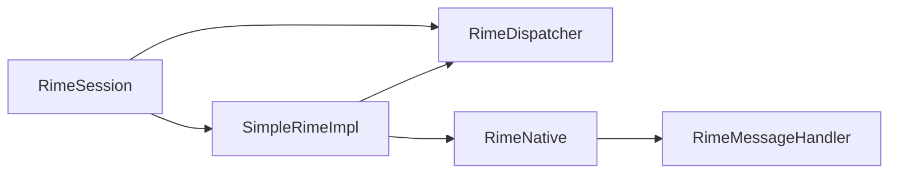

# 线程模型与调度器

<cite>
**本文引用的文件**   
- [RimeDispatcher.kt](file://app/src/main/java/com/ziyou/ime/core/RimeDispatcher.kt)
- [SimpleRimeImpl.kt](file://app/src/main/java/com/ziyou/ime/core/SimpleRimeImpl.kt)
- [RimeApi.kt](file://app/src/main/java/com/ziyou/ime/core/RimeApi.kt)
- [RimeNative.kt](file://app/src/main/java/com/ziyou/ime/core/RimeNative.kt)
- [ProtoTypes.kt](file://app/src/main/java/com/ziyou/ime/core/ProtoTypes.kt)
- [RimeMessage.kt](file://app/src/main/java/com/ziyou/ime/core/RimeMessage.kt)
- [RimeSession.kt](file://app/src/main/java/com/ziyou/ime/daemon/RimeSession.kt)
- [RimeDispatcherTest.kt](file://app/src/test/java/com/ziyou/ime/core/RimeDispatcherTest.kt)
- [SimpleRimeImplTest.kt](file://app/src/test/java/com/ziyou/ime/core/SimpleRimeImplTest.kt)
</cite>

## 目录
1. [简介](#简介)
2. [项目结构](#项目结构)
3. [核心组件](#核心组件)
4. [架构总览](#架构总览)
5. [详细组件分析](#详细组件分析)
6. [依赖关系分析](#依赖关系分析)
7. [性能考量](#性能考量)
8. [故障排查指南](#故障排查指南)
9. [结论](#结论)
10. [附录](#附录)

## 简介
本文件围绕输入法引擎 librime 的线程安全约束，系统化阐述本项目的线程模型与调度器设计。重点包括：
- RimeDispatcher 的单线程调度器设计，确保所有 librime API 调用在同一线程顺序执行，避免数据竞争。
- 协程上下文切换机制：将 suspend 函数调用路由到专用线程执行，屏蔽底层线程细节。
- 线程池配置与任务队列管理：单线程 Executor + 协程调度器，保证串行化执行；提供超时控制与关闭语义。
- 并发控制策略：通过互斥锁、状态守卫与有序调度避免竞态条件与死锁。
- 批量操作与热路径优化：processKeyBulk 合并多次 JNI 跨界，减少线程往返与跨层开销。
- 调试与监控：日志、异常传播、测试覆盖与消息流（SharedFlow）用于问题定位与运行时观测。

## 项目结构
与线程模型和调度器相关的核心代码集中在 core 与 daemon 模块：
- core: 定义 RimeApi 接口、RimeDispatcher 调度器、SimpleRimeImpl 实现、RimeNative JNI 封装、消息与数据结构。
- daemon: 提供 RimeSession 会话管理器，负责生命周期、部署步骤、线程范围与资源清理。

图表来源 
- [RimeApi.kt](file://app/src/main/java/com/ziyou/ime/core/RimeApi.kt)
- [SimpleRimeImpl.kt](file://app/src/main/java/com/ziyou/ime/core/SimpleRimeImpl.kt)
- [RimeDispatcher.kt](file://app/src/main/java/com/ziyou/ime/core/RimeDispatcher.kt)
- [RimeNative.kt](file://app/src/main/java/com/ziyou/ime/core/RimeNative.kt)
- [ProtoTypes.kt](file://app/src/main/java/com/ziyou/ime/core/ProtoTypes.kt)
- [RimeMessage.kt](file://app/src/main/java/com/ziyou/ime/core/RimeMessage.kt)
- [RimeSession.kt](file://app/src/main/java/com/ziyou/ime/daemon/RimeSession.kt)

章节来源
- [RimeApi.kt](file://app/src/main/java/com/ziyou/ime/core/RimeApi.kt)
- [SimpleRimeImpl.kt](file://app/src/main/java/com/ziyou/ime/core/SimpleRimeImpl.kt)
- [RimeDispatcher.kt](file://app/src/main/java/com/ziyou/ime/core/RimeDispatcher.kt)
- [RimeNative.kt](file://app/src/main/java/com/ziyou/ime/core/RimeNative.kt)
- [ProtoTypes.kt](file://app/src/main/java/com/ziyou/ime/core/ProtoTypes.kt)
- [RimeMessage.kt](file://app/src/main/java/com/ziyou/ime/core/RimeMessage.kt)
- [RimeSession.kt](file://app/src/main/java/com/ziyou/ime/daemon/RimeSession.kt)

## 核心组件
- RimeDispatcher：单线程调度器，基于 Executors.newSingleThreadExecutor 创建专属线程，并通过 asCoroutineDispatcher 暴露给协程使用。提供 dispatch 与带超时的 dispatchWithTimeout，以及 shutdown 幂等关闭。
- SimpleRimeImpl：RimeApi 的具体实现，将所有 suspend 方法通过 dispatcher.dispatch 路由到单线程执行，保证 librime 调用的线程安全。
- RimeNative：JNI 封装，声明所有 native 方法并标记非线程安全，必须在 RimeDispatcher 单线程上调用。
- ProtoTypes：与 JNI 层对应的数据模型（CommitProto、ContextProto、CandidateProto、StatusProto 等）。
- RimeMessage：由 JNI 回调触发的通知消息，通过 SharedFlow 广播给 UI 层。
- RimeSession：会话管理器，负责初始化、部署、启动、销毁与重新部署，内部持有 RimeDispatcher 与 SimpleRimeImpl，并使用互斥锁保护生命周期操作。

章节来源
- [RimeDispatcher.kt](file://app/src/main/java/com/ziyou/ime/core/RimeDispatcher.kt)
- [SimpleRimeImpl.kt](file://app/src/main/java/com/ziyou/ime/core/SimpleRimeImpl.kt)
- [RimeNative.kt](file://app/src/main/java/com/ziyou/ime/core/RimeNative.kt)
- [ProtoTypes.kt](file://app/src/main/java/com/ziyou/ime/core/ProtoTypes.kt)
- [RimeMessage.kt](file://app/src/main/java/com/ziyou/ime/core/RimeMessage.kt)
- [RimeSession.kt](file://app/src/main/java/com/ziyou/ime/daemon/RimeSession.kt)

## 架构总览
下图展示从上层调用到 librime 的完整调用链，以及消息回传路径。

图表来源 
- [SimpleRimeImpl.kt](file://app/src/main/java/com/ziyou/ime/core/SimpleRimeImpl.kt)
- [RimeDispatcher.kt](file://app/src/main/java/com/ziyou/ime/core/RimeDispatcher.kt)
- [RimeNative.kt](file://app/src/main/java/com/ziyou/ime/core/RimeNative.kt)
- [RimeMessage.kt](file://app/src/main/java/com/ziyou/ime/core/RimeMessage.kt)

## 详细组件分析

### RimeDispatcher：单线程调度器
- 设计要点
  - 使用 Executors.newSingleThreadExecutor 创建唯一工作线程，命名为“RimeDispatcher-Thread”，作为守护线程。
  - 通过 executor.asCoroutineDispatcher() 暴露为 CoroutineDispatcher，供 withContext 切换执行上下文。
  - 提供 dispatch(block) 与 dispatchWithTimeout(timeoutMs, block)，支持超时返回 null。
  - shutdown() 使用 AtomicBoolean 保证幂等关闭，防止重复释放资源。
- 线程安全与错误处理
  - 所有 librime 调用均在同一线程顺序执行，避免竞态条件。
  - 捕获并记录异常，再向上抛出，便于上层统一处理。
- 复杂度与性能
  - 任务入队 O(1)，出队与执行 O(1)。由于单线程，无锁竞争，延迟稳定。
  - 超时通过协程 withTimeout 实现，不阻塞其他任务。

图表来源 
- [RimeDispatcher.kt](file://app/src/main/java/com/ziyou/ime/core/RimeDispatcher.kt)

章节来源
- [RimeDispatcher.kt](file://app/src/main/java/com/ziyou/ime/core/RimeDispatcher.kt)
- [RimeDispatcherTest.kt](file://app/src/test/java/com/ziyou/ime/core/RimeDispatcherTest.kt)

### SimpleRimeImpl：API 实现与调度桥接
- 设计要点
  - 所有 suspend 方法均通过 dispatcher.dispatch 委托到单线程执行，屏蔽线程细节。
  - processKeyBulk 默认实现组合三次调用（便于测试），生产实现通过 JNI 单次跨界返回三元组。
  - parseBulkResult 解析 JNI 返回数组为 KeyEventResult，包含 consumed、commit、context。
- 数据模型
  - 使用 CommitProto、ContextProto、CandidateProto、StatusProto、SchemaItem 等与 JNI 一一对应。
- 性能优化
  - 热路径 processKeyBulk 减少线程往返与 JNI 跨界次数，提升输入响应性。

图表来源 
- [SimpleRimeImpl.kt](file://app/src/main/java/com/ziyou/ime/core/SimpleRimeImpl.kt)
- [RimeApi.kt](file://app/src/main/java/com/ziyou/ime/core/RimeApi.kt)

章节来源
- [SimpleRimeImpl.kt](file://app/src/main/java/com/ziyou/ime/core/SimpleRimeImpl.kt)
- [RimeApi.kt](file://app/src/main/java/com/ziyou/ime/core/RimeApi.kt)
- [ProtoTypes.kt](file://app/src/main/java/com/ziyou/ime/core/ProtoTypes.kt)
- [SimpleRimeImplTest.kt](file://app/src/test/java/com/ziyou/ime/core/SimpleRimeImplTest.kt)

### RimeNative：JNI 封装与消息回调
- 设计要点
  - 所有 external 方法对应 C++ 层的 JNI 导出函数，明确标注非线程安全，必须经 RimeDispatcher 调用。
  - trimNativeHeap 为线程安全的内存回收方法，无需经调度器。
  - handleRimeMessage 接收 JNI 回调，构造 RimeMessage 并通过 RimeMessageHandler 广播。
- 错误处理
  - isLoaded 标志位与 ensureLoaded 检查，避免在未加载时调用 native 方法。

图表来源 
- [RimeNative.kt](file://app/src/main/java/com/ziyou/ime/core/RimeNative.kt)
- [RimeMessage.kt](file://app/src/main/java/com/ziyou/ime/core/RimeMessage.kt)

章节来源
- [RimeNative.kt](file://app/src/main/java/com/ziyou/ime/core/RimeNative.kt)
- [RimeMessage.kt](file://app/src/main/java/com/ziyou/ime/core/RimeMessage.kt)

### RimeSession：会话管理与生命周期控制
- 设计要点
  - 单例对象，维护 dispatcher、api、sessionScope，并提供 initialize、destroy、redeploy。
  - lifecycleMutex 互斥锁保护生命周期操作，避免并发导致的重复初始化或资源泄漏。
  - doInitialize 在 IO 线程执行部署步骤，避免主线程阻塞；启动引擎带超时保护。
  - destroy 中按序关闭 api、取消 scope、关闭 dispatcher，并重置状态。
- 并发控制
  - 使用 Mutex.withLock 串行化 initialize/destroy/redeploy，确保线程安全。
  - isInitialized 守卫配合锁，防止双重初始化。

图表来源 
- [RimeSession.kt](file://app/src/main/java/com/ziyou/ime/daemon/RimeSession.kt)
- [RimeDispatcher.kt](file://app/src/main/java/com/ziyou/ime/core/RimeDispatcher.kt)
- [SimpleRimeImpl.kt](file://app/src/main/java/com/ziyou/ime/core/SimpleRimeImpl.kt)

章节来源
- [RimeSession.kt](file://app/src/main/java/com/ziyou/ime/daemon/RimeSession.kt)

## 依赖关系分析
- 组件耦合
  - SimpleRimeImpl 依赖 RimeDispatcher 与 RimeNative，解耦了线程与 JNI 细节。
  - RimeSession 依赖 RimeDispatcher 与 SimpleRimeImpl，集中管理生命周期。
  - RimeMessageHandler 独立于调度器，仅负责消息分发。
- 外部依赖
  - kotlinx.coroutines：协程调度、Flow、超时控制。
  - java.util.concurrent：单线程 Executor。
  - Android：Log、Context、PackageInfo。
- 循环依赖
  - 无直接循环依赖；消息流单向从 JNI 到 UI。

图表来源 
- [RimeSession.kt](file://app/src/main/java/com/ziyou/ime/daemon/RimeSession.kt)
- [SimpleRimeImpl.kt](file://app/src/main/java/com/ziyou/ime/core/SimpleRimeImpl.kt)
- [RimeDispatcher.kt](file://app/src/main/java/com/ziyou/ime/core/RimeDispatcher.kt)
- [RimeNative.kt](file://app/src/main/java/com/ziyou/ime/core/RimeNative.kt)
- [RimeMessage.kt](file://app/src/main/java/com/ziyou/ime/core/RimeMessage.kt)

章节来源
- [RimeSession.kt](file://app/src/main/java/com/ziyou/ime/daemon/RimeSession.kt)
- [SimpleRimeImpl.kt](file://app/src/main/java/com/ziyou/ime/core/SimpleRimeImpl.kt)
- [RimeDispatcher.kt](file://app/src/main/java/com/ziyou/ime/core/RimeDispatcher.kt)
- [RimeNative.kt](file://app/src/main/java/com/ziyou/ime/core/RimeNative.kt)
- [RimeMessage.kt](file://app/src/main/java/com/ziyou/ime/core/RimeMessage.kt)

## 性能考量
- 单线程串行化
  - 优点：避免锁竞争与复杂同步，简化推理；适合 librime 非线程安全场景。
  - 风险：长耗时任务会阻塞后续任务；需通过超时与异步策略规避。
- 批量操作
  - processKeyBulk 合并 processKey + getCommit + getContext，减少线程往返与 JNI 跨界次数，显著提升热路径性能。
- 超时与降级
  - dispatchWithTimeout 对长耗时操作进行保护，返回 null 供上层降级处理。
  - 启动超时保护避免长时间阻塞。
- 内存回收
  - trimNativeHeap 可在部署完成后或内存吃紧时调用，降低常驻占用。
- 缓存策略
  - 对于频繁读取的状态（如 StatusProto、MenuProto），可在 UI 层做轻量缓存，减少重复查询。
- 批处理建议
  - 将多个小操作合并为一次 dispatch 块内执行，减少调度开销。
  - 对候选词列表分页获取，限制 limit 避免大对象传输。

[本节为通用指导，不直接分析具体文件]

## 故障排查指南
- 常见问题
  - 未加载 native 库：startup 前检查 RimeNative.isLoaded，否则抛出 IllegalStateException。
  - 线程切换失败：确认调用方处于协程上下文，且使用了 dispatcher.dispatch。
  - 超时导致空结果：检查 dispatchWithTimeout 的 timeoutMs 是否过小，或任务是否阻塞。
  - 重复初始化：确保 lifecycleMutex 生效，避免并发调用 initialize。
- 日志与监控
  - 关键路径打印日志：启动、关闭、异常、超时。
  - 使用 RimeMessageHandler.messageFlow 订阅状态变更，观察 schema/option/deploy 事件。
- 测试验证
  - RimeDispatcherTest：验证线程名、异常传播、超时行为、shutdown 幂等。
  - SimpleRimeImplTest：验证 parseBulkResult 边界情况与调度路径。
- 调试技巧
  - 在 dispatch 块内记录当前线程名，确认执行线程。
  - 使用 withTimeoutOrNull 包裹可能阻塞的操作，避免 ANR。
  - 针对 JNI 异常（UnsatisfiedLinkError）进行捕获与提示。

章节来源
- [RimeDispatcherTest.kt](file://app/src/test/java/com/ziyou/ime/core/RimeDispatcherTest.kt)
- [SimpleRimeImplTest.kt](file://app/src/test/java/com/ziyou/ime/core/SimpleRimeImplTest.kt)
- [RimeNative.kt](file://app/src/main/java/com/ziyou/ime/core/RimeNative.kt)
- [RimeMessage.kt](file://app/src/main/java/com/ziyou/ime/core/RimeMessage.kt)

## 结论
本项目通过 RimeDispatcher 的单线程调度器设计，确保了 librime 引擎的线程安全性与调用顺序一致性。结合协程上下文切换、超时控制与互斥锁，实现了高可靠、低复杂度的并发模型。热路径的批量操作与消息流机制进一步提升了性能与可观测性。建议在扩展新功能时遵循现有模式：所有 librime 相关调用必须经 RimeDispatcher，保持串行化与线程安全。

[本节为总结，不直接分析具体文件]

## 附录
- 使用示例（路径引用）
  - 在协程中调用 API：参考 [SimpleRimeImpl.kt](file://app/src/main/java/com/ziyou/ime/core/SimpleRimeImpl.kt) 中的各 suspend 方法实现。
  - 批量按键处理：参考 [RimeApi.kt](file://app/src/main/java/com/ziyou/ime/core/RimeApi.kt) 的 processKeyBulk 默认实现与 [SimpleRimeImpl.kt](file://app/src/main/java/com/ziyou/ime/core/SimpleRimeImpl.kt) 的生产实现。
  - 消息订阅：参考 [RimeMessage.kt](file://app/src/main/java/com/ziyou/ime/core/RimeMessage.kt) 的 messageFlow。
  - 生命周期管理：参考 [RimeSession.kt](file://app/src/main/java/com/ziyou/ime/daemon/RimeSession.kt) 的 initialize/destroy/redeploy。

[本节为补充说明，不直接分析具体文件]