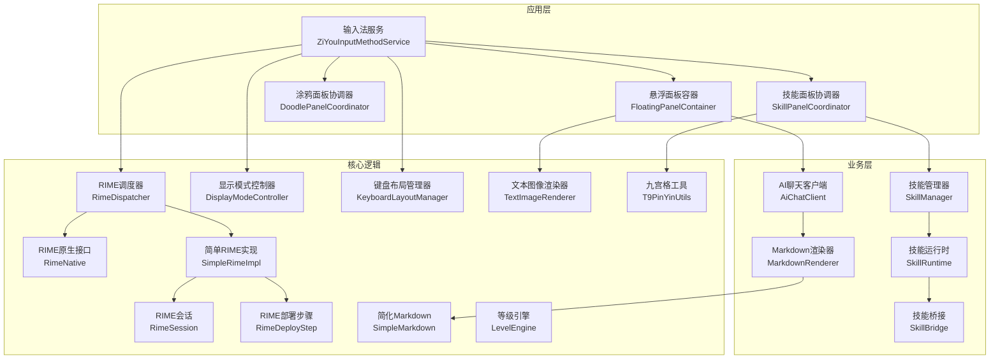
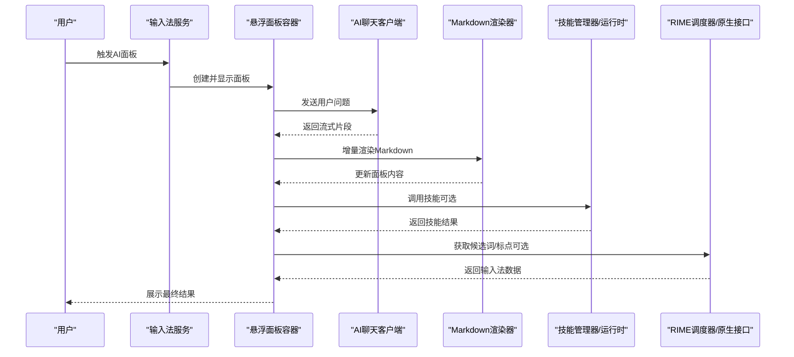
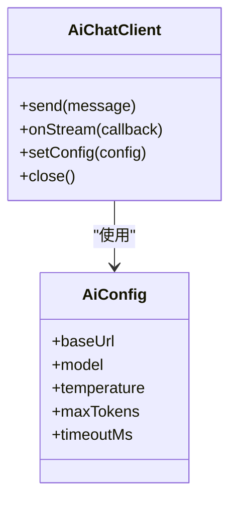
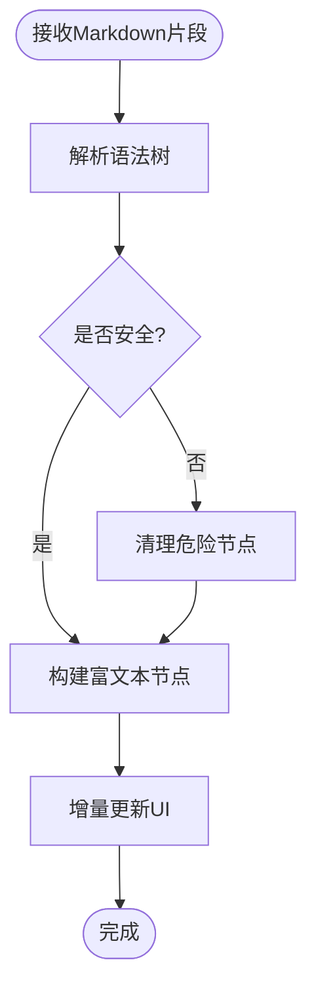
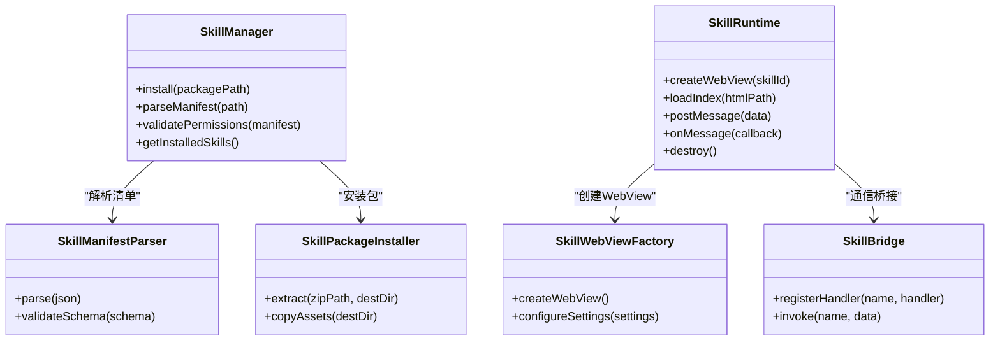
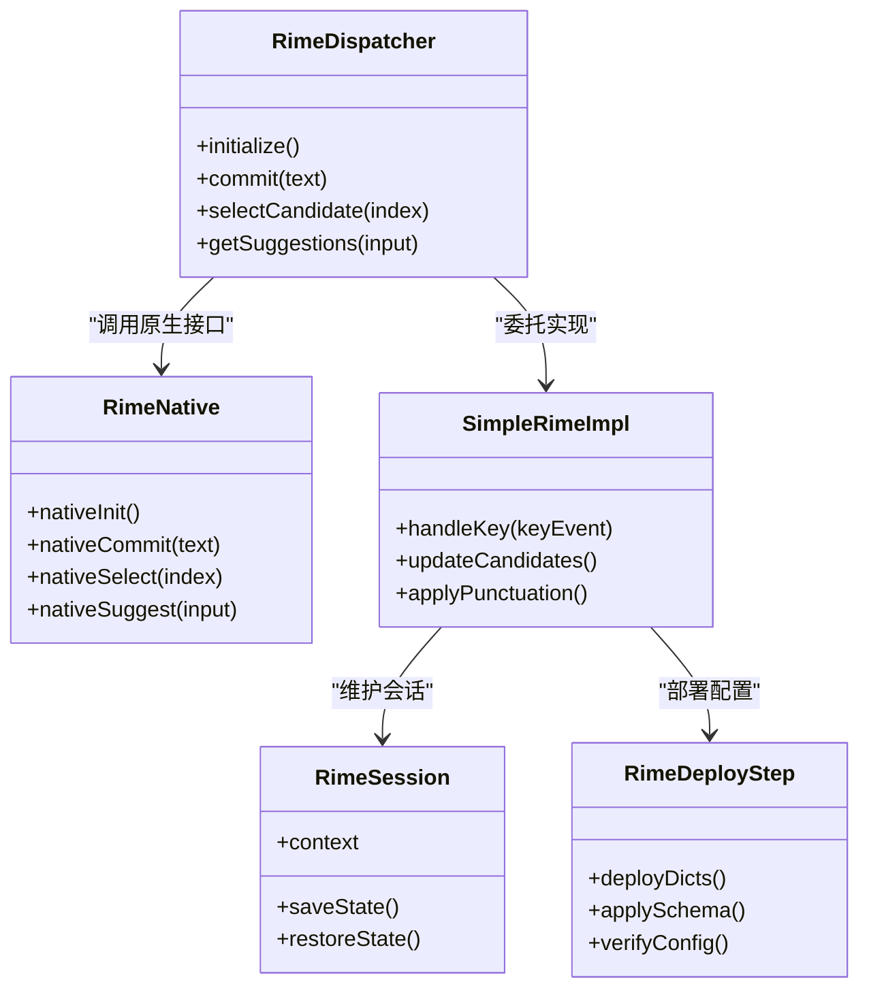
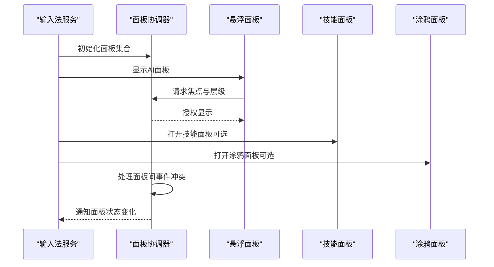
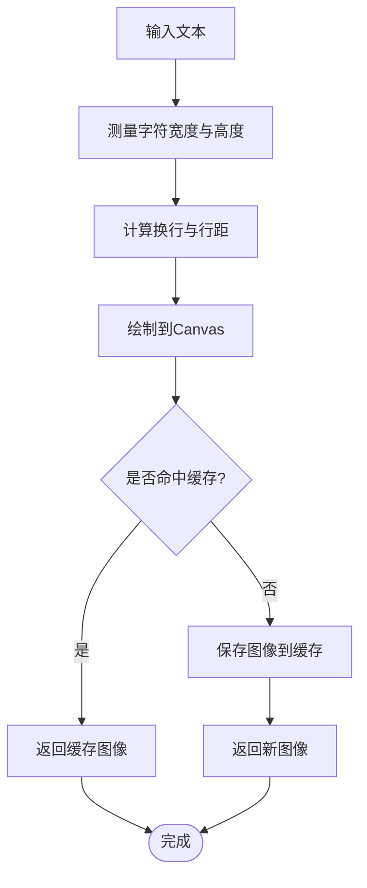
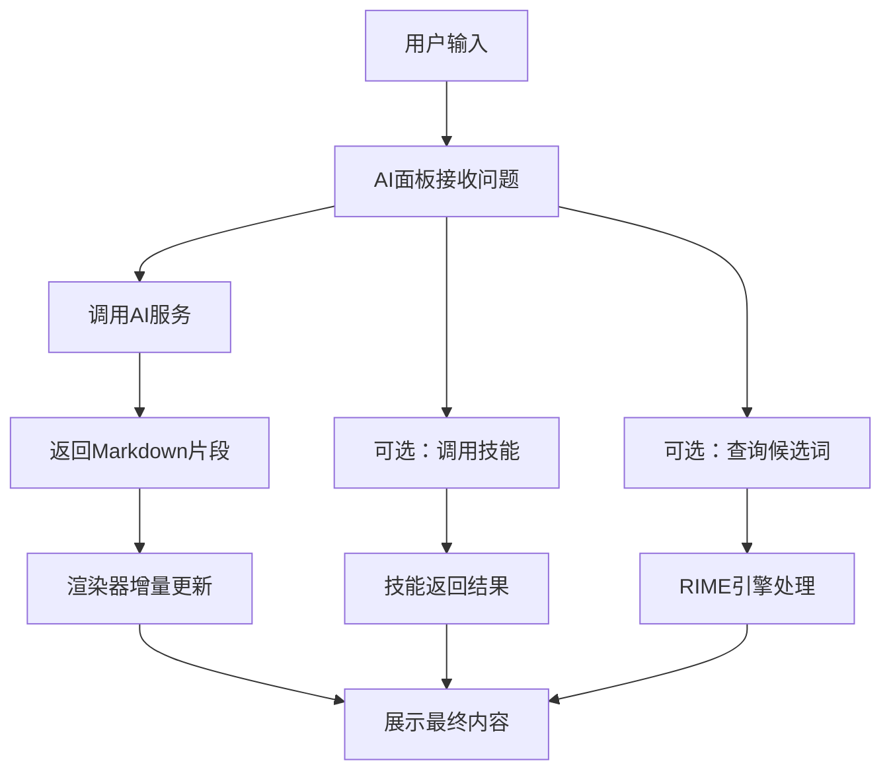
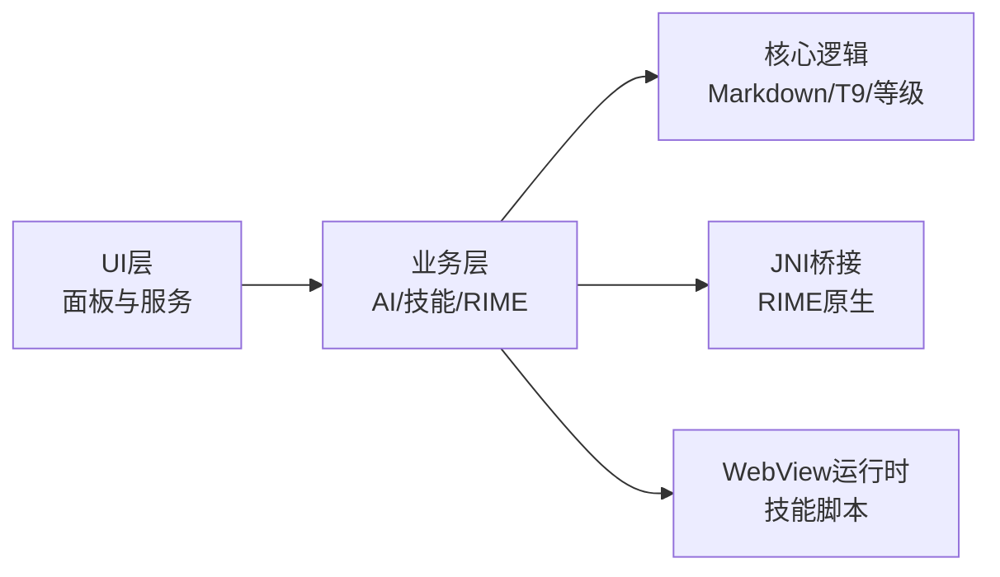

# AI智能问答面板系统

<cite>
**本文引用的文件**   
- [AiChatClient.kt](file://app/src/main/java/com/ziyou/ime/ai/AiChatClient.kt)
- [AiConfig.kt](file://app/src/main/java/com/ziyou/ime/ai/AiConfig.kt)
- [MarkdownRenderer.kt](file://app/src/main/java/com/ziyou/ime/ai/MarkdownRenderer.kt)
- [ZiYouInputMethodService.kt](file://app/src/main/java/com/ziyou/ime/ZiYouInputMethodService.kt)
- [FloatingPanelContainer.kt](file://app/src/main/java/com/ziyou/ime/ime/FloatingPanelContainer.kt)
- [SkillPanelCoordinator.kt](file://app/src/main/java/com/ziyou/ime/ime/SkillPanelCoordinator.kt)
- [SkillManager.kt](file://core-logic/src/main/java/com/ziyou/ime/core/skill/SkillManager.kt)
- [SkillRuntime.kt](file://app/src/main/java/com/ziyou/ime/skill/SkillRuntime.kt)
- [SkillBridge.kt](file://app/src/main/java/com/ziyou/ime/skill/SkillBridge.kt)
- [RimeDispatcher.kt](file://app/src/main/java/com/ziyou/ime/core/RimeDispatcher.kt)
- [RimeNative.kt](file://app/src/main/java/com/ziyou/ime/core/RimeNative.kt)
- [SimpleRimeImpl.kt](file://app/src/main/java/com/ziyou/ime/core/SimpleRimeImpl.kt)
- [RimeSession.kt](file://app/src/main/java/com/ziyou/ime/daemon/RimeSession.kt)
- [RimeDeployStep.kt](file://app/src/main/java/com/ziyou/ime/daemon/RimeDeployStep.kt)
- [DisplayModeController.kt](file://app/src/main/java/com/ziyou/ime/ime/DisplayModeController.kt)
- [KeyboardLayoutManager.kt](file://app/src/main/java/com/ziyou/ime/ime/KeyboardLayoutManager.kt)
- [TextImageRenderer.kt](file://app/src/main/java/com/ziyou/ime/ime/TextImageRenderer.kt)
- [DoodlePanelCoordinator.kt](file://app/src/main/java/com/ziyou/ime/ime/DoodlePanelCoordinator.kt)
- [SkillWebViewFactory.kt](file://app/src/main/java/com/ziyou/ime/skill/SkillWebViewFactory.kt)
- [SkillManifestParser.kt](file://app/src/main/java/com/ziyou/ime/skill/SkillManifestParser.kt)
- [SkillPackageInstaller.kt](file://app/src/main/java/com/ziyou/ime/skill/SkillPackageInstaller.kt)
- [LevelEngine.kt](file://core-logic/src/main/java/com/ziyou/ime/core/level/LevelEngine.kt)
- [SimpleMarkdown.kt](file://core-logic/src/main/java/com/ziyou/ime/core/markdown/SimpleMarkdown.kt)
- [T9PinYinUtils.kt](file://core-logic/src/main/java/com/ziyou/ime/util/T9PinYinUtils.kt)
</cite>

## 目录
1. [简介](#简介)
2. [项目结构](#项目结构)
3. [核心组件](#核心组件)
4. [架构总览](#架构总览)
5. [详细组件分析](#详细组件分析)
6. [依赖关系分析](#依赖关系分析)
7. [性能考量](#性能考量)
8. [故障排查指南](#故障排查指南)
9. [结论](#结论)
10. [附录](#附录)

## 简介
本系统为输入法中的“AI智能问答面板”，在用户输入过程中提供悬浮式对话面板，支持Markdown渲染、技能插件（如计算器、天气、引用）与RIME引擎协同工作。整体采用分层架构：UI层负责面板展示与交互；业务层协调AI客户端、技能运行时与输入法状态；底层通过JNI桥接RIME引擎，完成候选词与文本处理。

## 项目结构
- app模块：Android应用主体，包含输入法服务、面板视图、AI能力、技能运行环境等。
- core-logic模块：与平台无关的核心逻辑，包括技能清单校验、Markdown简化实现、九宫格拼音工具、等级引擎等。
- librime-prebuilt：RIME引擎的预构建资源与CMake配置，供JNI调用。
- skills-dev：技能开发示例包，便于调试与演示。

**图表来源** 
- [ZiYouInputMethodService.kt](file://app/src/main/java/com/ziyou/ime/ZiYouInputMethodService.kt)
- [FloatingPanelContainer.kt](file://app/src/main/java/com/ziyou/ime/ime/FloatingPanelContainer.kt)
- [SkillPanelCoordinator.kt](file://app/src/main/java/com/ziyou/ime/ime/SkillPanelCoordinator.kt)
- [DoodlePanelCoordinator.kt](file://app/src/main/java/com/ziyou/ime/ime/DoodlePanelCoordinator.kt)
- [AiChatClient.kt](file://app/src/main/java/com/ziyou/ime/ai/AiChatClient.kt)
- [MarkdownRenderer.kt](file://app/src/main/java/com/ziyou/ime/ai/MarkdownRenderer.kt)
- [SkillManager.kt](file://core-logic/src/main/java/com/ziyou/ime/core/skill/SkillManager.kt)
- [SkillRuntime.kt](file://app/src/main/java/com/ziyou/ime/skill/SkillRuntime.kt)
- [SkillBridge.kt](file://app/src/main/java/com/ziyou/ime/skill/SkillBridge.kt)
- [RimeDispatcher.kt](file://app/src/main/java/com/ziyou/ime/core/RimeDispatcher.kt)
- [RimeNative.kt](file://app/src/main/java/com/ziyou/ime/core/RimeNative.kt)
- [SimpleRimeImpl.kt](file://app/src/main/java/com/ziyou/ime/core/SimpleRimeImpl.kt)
- [RimeSession.kt](file://app/src/main/java/com/ziyou/ime/daemon/RimeSession.kt)
- [RimeDeployStep.kt](file://app/src/main/java/com/ziyou/ime/daemon/RimeDeployStep.kt)
- [DisplayModeController.kt](file://app/src/main/java/com/ziyou/ime/ime/DisplayModeController.kt)
- [KeyboardLayoutManager.kt](file://app/src/main/java/com/ziyou/ime/ime/KeyboardLayoutManager.kt)
- [TextImageRenderer.kt](file://app/src/main/java/com/ziyou/ime/ime/TextImageRenderer.kt)
- [T9PinYinUtils.kt](file://core-logic/src/main/java/com/ziyou/ime/util/T9PinYinUtils.kt)
- [SimpleMarkdown.kt](file://core-logic/src/main/java/com/ziyou/ime/core/markdown/SimpleMarkdown.kt)
- [LevelEngine.kt](file://core-logic/src/main/java/com/ziyou/ime/core/level/LevelEngine.kt)

**章节来源**
- [ZiYouInputMethodService.kt](file://app/src/main/java/com/ziyou/ime/ZiYouInputMethodService.kt)
- [FloatingPanelContainer.kt](file://app/src/main/java/com/ziyou/ime/ime/FloatingPanelContainer.kt)
- [SkillPanelCoordinator.kt](file://app/src/main/java/com/ziyou/ime/ime/SkillPanelCoordinator.kt)
- [DoodlePanelCoordinator.kt](file://app/src/main/java/com/ziyou/ime/ime/DoodlePanelCoordinator.kt)
- [AiChatClient.kt](file://app/src/main/java/com/ziyou/ime/ai/AiChatClient.kt)
- [MarkdownRenderer.kt](file://app/src/main/java/com/ziyou/ime/ai/MarkdownRenderer.kt)
- [SkillManager.kt](file://core-logic/src/main/java/com/ziyou/ime/core/skill/SkillManager.kt)
- [SkillRuntime.kt](file://app/src/main/java/com/ziyou/ime/skill/SkillRuntime.kt)
- [SkillBridge.kt](file://app/src/main/java/com/ziyou/ime/skill/SkillBridge.kt)
- [RimeDispatcher.kt](file://app/src/main/java/com/ziyou/ime/core/RimeDispatcher.kt)
- [RimeNative.kt](file://app/src/main/java/com/ziyou/ime/core/RimeNative.kt)
- [SimpleRimeImpl.kt](file://app/src/main/java/com/ziyou/ime/core/SimpleRimeImpl.kt)
- [RimeSession.kt](file://app/src/main/java/com/ziyou/ime/daemon/RimeSession.kt)
- [RimeDeployStep.kt](file://app/src/main/java/com/ziyou/ime/daemon/RimeDeployStep.kt)
- [DisplayModeController.kt](file://app/src/main/java/com/ziyou/ime/ime/DisplayModeController.kt)
- [KeyboardLayoutManager.kt](file://app/src/main/java/com/ziyou/ime/ime/KeyboardLayoutManager.kt)
- [TextImageRenderer.kt](file://app/src/main/java/com/ziyou/ime/ime/TextImageRenderer.kt)
- [T9PinYinUtils.kt](file://core-logic/src/main/java/com/ziyou/ime/util/T9PinYinUtils.kt)
- [SimpleMarkdown.kt](file://core-logic/src/main/java/com/ziyou/ime/core/markdown/SimpleMarkdown.kt)
- [LevelEngine.kt](file://core-logic/src/main/java/com/ziyou/ime/core/level/LevelEngine.kt)

## 核心组件
- AI聊天客户端：封装网络请求、消息协议与流式响应处理，负责将后端返回内容交给渲染器进行展示。
- Markdown渲染器：对AI返回内容进行轻量级Markdown解析与富文本渲染，适配面板显示。
- 技能管理器与运行时：管理技能包的安装、清单解析、权限校验与版本比较，驱动WebView执行技能脚本。
- RIME集成：通过调度器与原生接口桥接RIME引擎，提供候选词、分词、标点等输入法核心能力。
- 面板协调器：统一控制悬浮面板、技能面板与涂鸦面板的生命周期与交互。

**章节来源**
- [AiChatClient.kt](file://app/src/main/java/com/ziyou/ime/ai/AiChatClient.kt)
- [MarkdownRenderer.kt](file://app/src/main/java/com/ziyou/ime/ai/MarkdownRenderer.kt)
- [SkillManager.kt](file://core-logic/src/main/java/com/ziyou/ime/core/skill/SkillManager.kt)
- [SkillRuntime.kt](file://app/src/main/java/com/ziyou/ime/skill/SkillRuntime.kt)
- [SkillBridge.kt](file://app/src/main/java/com/ziyou/ime/skill/SkillBridge.kt)
- [RimeDispatcher.kt](file://app/src/main/java/com/ziyou/ime/core/RimeDispatcher.kt)
- [RimeNative.kt](file://app/src/main/java/com/ziyou/ime/core/RimeNative.kt)
- [SimpleRimeImpl.kt](file://app/src/main/java/com/ziyou/ime/core/SimpleRimeImpl.kt)
- [RimeSession.kt](file://app/src/main/java/com/ziyou/ime/daemon/RimeSession.kt)
- [RimeDeployStep.kt](file://app/src/main/java/com/ziyou/ime/daemon/RimeDeployStep.kt)
- [FloatingPanelContainer.kt](file://app/src/main/java/com/ziyou/ime/ime/FloatingPanelContainer.kt)
- [SkillPanelCoordinator.kt](file://app/src/main/java/com/ziyou/ime/ime/SkillPanelCoordinator.kt)
- [DoodlePanelCoordinator.kt](file://app/src/main/java/com/ziyou/ime/ime/DoodlePanelCoordinator.kt)

## 架构总览
系统以输入法服务为入口，向上暴露面板与技能能力，向下通过RIME引擎提供文本处理能力。AI问答面板作为悬浮层，与技能面板并列存在，二者由协调器统一管理。渲染层负责Markdown与文本图像输出，确保在不同显示模式下保持一致体验。

**图表来源** 
- [ZiYouInputMethodService.kt](file://app/src/main/java/com/ziyou/ime/ZiYouInputMethodService.kt)
- [FloatingPanelContainer.kt](file://app/src/main/java/com/ziyou/ime/ime/FloatingPanelContainer.kt)
- [AiChatClient.kt](file://app/src/main/java/com/ziyou/ime/ai/AiChatClient.kt)
- [MarkdownRenderer.kt](file://app/src/main/java/com/ziyou/ime/ai/MarkdownRenderer.kt)
- [SkillManager.kt](file://core-logic/src/main/java/com/ziyou/ime/core/skill/SkillManager.kt)
- [SkillRuntime.kt](file://app/src/main/java/com/ziyou/ime/skill/SkillRuntime.kt)
- [RimeDispatcher.kt](file://app/src/main/java/com/ziyou/ime/core/RimeDispatcher.kt)
- [RimeNative.kt](file://app/src/main/java/com/ziyou/ime/core/RimeNative.kt)

## 详细组件分析

### AI聊天客户端与配置
- 职责：发起网络请求、处理流式响应、错误重试与超时控制；维护连接与会话参数。
- 关键设计：
  - 使用异步回调或协程推送增量内容，避免阻塞UI线程。
  - 配置项集中管理，支持动态切换模型、温度、最大长度等参数。
  - 与渲染器解耦，仅输出结构化片段，渲染策略由渲染器决定。

**图表来源** 
- [AiChatClient.kt](file://app/src/main/java/com/ziyou/ime/ai/AiChatClient.kt)
- [AiConfig.kt](file://app/src/main/java/com/ziyou/ime/ai/AiConfig.kt)

**章节来源**
- [AiChatClient.kt](file://app/src/main/java/com/ziyou/ime/ai/AiChatClient.kt)
- [AiConfig.kt](file://app/src/main/java/com/ziyou/ime/ai/AiConfig.kt)

### Markdown渲染器
- 职责：将AI返回的Markdown片段转换为可展示的富文本，支持标题、列表、代码块、链接等基础语法。
- 关键设计：
  - 增量渲染：按片段拼接并局部刷新，减少重绘开销。
  - 安全过滤：对HTML与脚本注入进行白名单限制。
  - 主题适配：根据显示模式调整字体、行高与颜色。

**图表来源** 
- [MarkdownRenderer.kt](file://app/src/main/java/com/ziyou/ime/ai/MarkdownRenderer.kt)
- [SimpleMarkdown.kt](file://core-logic/src/main/java/com/ziyou/ime/core/markdown/SimpleMarkdown.kt)

**章节来源**
- [MarkdownRenderer.kt](file://app/src/main/java/com/ziyou/ime/ai/MarkdownRenderer.kt)
- [SimpleMarkdown.kt](file://core-logic/src/main/java/com/ziyou/ime/core/markdown/SimpleMarkdown.kt)

### 技能面板与运行时
- 职责：安装与加载技能包，解析清单与权限，启动WebView执行技能脚本，提供与输入法的数据桥接。
- 关键设计：
  - 清单校验：版本号、权限、入口文件完整性检查。
  - 运行时隔离：每个技能独立WebView实例，防止相互干扰。
  - 桥接通信：通过JS Bridge与Kotlin侧交换数据，如候选词、输入上下文。

**图表来源** 
- [SkillManager.kt](file://core-logic/src/main/java/com/ziyou/ime/core/skill/SkillManager.kt)
- [SkillRuntime.kt](file://app/src/main/java/com/ziyou/ime/skill/SkillRuntime.kt)
- [SkillBridge.kt](file://app/src/main/java/com/ziyou/ime/skill/SkillBridge.kt)
- [SkillWebViewFactory.kt](file://app/src/main/java/com/ziyou/ime/skill/SkillWebViewFactory.kt)
- [SkillManifestParser.kt](file://app/src/main/java/com/ziyou/ime/skill/SkillManifestParser.kt)
- [SkillPackageInstaller.kt](file://app/src/main/java/com/ziyou/ime/skill/SkillPackageInstaller.kt)

**章节来源**
- [SkillManager.kt](file://core-logic/src/main/java/com/ziyou/ime/core/skill/SkillManager.kt)
- [SkillRuntime.kt](file://app/src/main/java/com/ziyou/ime/skill/SkillRuntime.kt)
- [SkillBridge.kt](file://app/src/main/java/com/ziyou/ime/skill/SkillBridge.kt)
- [SkillWebViewFactory.kt](file://app/src/main/java/com/ziyou/ime/skill/SkillWebViewFactory.kt)
- [SkillManifestParser.kt](file://app/src/main/java/com/ziyou/ime/skill/SkillManifestParser.kt)
- [SkillPackageInstaller.kt](file://app/src/main/java/com/ziyou/ime/skill/SkillPackageInstaller.kt)

### RIME引擎集成
- 职责：通过调度器与原生接口调用RIME，提供候选词、分词、标点、历史记忆等功能。
- 关键设计：
  - 调度器抽象：屏蔽不同实现细节，支持简单实现与完整实现切换。
  - 会话管理：保持上下文状态，避免频繁重建带来的性能损耗。
  - 部署步骤：按需加载字典与配置，提升冷启动速度。

**图表来源** 
- [RimeDispatcher.kt](file://app/src/main/java/com/ziyou/ime/core/RimeDispatcher.kt)
- [RimeNative.kt](file://app/src/main/java/com/ziyou/ime/core/RimeNative.kt)
- [SimpleRimeImpl.kt](file://app/src/main/java/com/ziyou/ime/core/SimpleRimeImpl.kt)
- [RimeSession.kt](file://app/src/main/java/com/ziyou/ime/daemon/RimeSession.kt)
- [RimeDeployStep.kt](file://app/src/main/java/com/ziyou/ime/daemon/RimeDeployStep.kt)

**章节来源**
- [RimeDispatcher.kt](file://app/src/main/java/com/ziyou/ime/core/RimeDispatcher.kt)
- [RimeNative.kt](file://app/src/main/java/com/ziyou/ime/core/RimeNative.kt)
- [SimpleRimeImpl.kt](file://app/src/main/java/com/ziyou/ime/core/SimpleRimeImpl.kt)
- [RimeSession.kt](file://app/src/main/java/com/ziyou/ime/daemon/RimeSession.kt)
- [RimeDeployStep.kt](file://app/src/main/java/com/ziyou/ime/daemon/RimeDeployStep.kt)

### 面板协调器与显示模式
- 职责：统一管理悬浮面板、技能面板与涂鸦面板的显示、隐藏与层级关系；根据显示模式调整布局与行为。
- 关键设计：
  - 生命周期管理：面板创建、销毁与内存回收。
  - 事件分发：点击、滑动、键盘事件路由到对应面板。
  - 显示模式：支持全屏、半屏、迷你模式，适配不同场景。

**图表来源** 
- [ZiYouInputMethodService.kt](file://app/src/main/java/com/ziyou/ime/ZiYouInputMethodService.kt)
- [FloatingPanelContainer.kt](file://app/src/main/java/com/ziyou/ime/ime/FloatingPanelContainer.kt)
- [SkillPanelCoordinator.kt](file://app/src/main/java/com/ziyou/ime/ime/SkillPanelCoordinator.kt)
- [DoodlePanelCoordinator.kt](file://app/src/main/java/com/ziyou/ime/ime/DoodlePanelCoordinator.kt)
- [DisplayModeController.kt](file://app/src/main/java/com/ziyou/ime/ime/DisplayModeController.kt)
- [KeyboardLayoutManager.kt](file://app/src/main/java/com/ziyou/ime/ime/KeyboardLayoutManager.kt)

**章节来源**
- [FloatingPanelContainer.kt](file://app/src/main/java/com/ziyou/ime/ime/FloatingPanelContainer.kt)
- [SkillPanelCoordinator.kt](file://app/src/main/java/com/ziyou/ime/ime/SkillPanelCoordinator.kt)
- [DoodlePanelCoordinator.kt](file://app/src/main/java/com/ziyou/ime/ime/DoodlePanelCoordinator.kt)
- [DisplayModeController.kt](file://app/src/main/java/com/ziyou/ime/ime/DisplayModeController.kt)
- [KeyboardLayoutManager.kt](file://app/src/main/java/com/ziyou/ime/ime/KeyboardLayoutManager.kt)

### 文本图像渲染与九宫格工具
- 职责：将文本转换为图像用于预览或分享；提供九宫格拼音辅助算法。
- 关键设计：
  - 渲染管线：字体测量、行距计算、抗锯齿优化。
  - 缓存策略：相同内容复用图像，减少重复生成。
  - 工具函数：快速转换按键序列为拼音音节，提升输入效率。

**图表来源** 
- [TextImageRenderer.kt](file://app/src/main/java/com/ziyou/ime/ime/TextImageRenderer.kt)
- [T9PinYinUtils.kt](file://core-logic/src/main/java/com/ziyou/ime/util/T9PinYinUtils.kt)

**章节来源**
- [TextImageRenderer.kt](file://app/src/main/java/com/ziyou/ime/ime/TextImageRenderer.kt)
- [T9PinYinUtils.kt](file://core-logic/src/main/java/com/ziyou/ime/util/T9PinYinUtils.kt)

### 概念总览
以下流程图展示了AI问答面板与技能、RIME引擎的整体协作关系，不直接映射具体文件，用于帮助理解系统工作方式。

[此图为概念性流程，无需图表来源]

## 依赖关系分析
- UI层依赖业务层提供的能力（AI、技能、RIME），并通过协调器统一管理。
- 业务层依赖核心逻辑模块，保证跨平台一致性与可测试性。
- 外部依赖：RIME引擎通过JNI调用，技能运行时依赖WebView与JavaScript桥接。

**图表来源** 
- [ZiYouInputMethodService.kt](file://app/src/main/java/com/ziyou/ime/ZiYouInputMethodService.kt)
- [AiChatClient.kt](file://app/src/main/java/com/ziyou/ime/ai/AiChatClient.kt)
- [SkillRuntime.kt](file://app/src/main/java/com/ziyou/ime/skill/SkillRuntime.kt)
- [RimeDispatcher.kt](file://app/src/main/java/com/ziyou/ime/core/RimeDispatcher.kt)
- [SimpleMarkdown.kt](file://core-logic/src/main/java/com/ziyou/ime/core/markdown/SimpleMarkdown.kt)
- [T9PinYinUtils.kt](file://core-logic/src/main/java/com/ziyou/ime/util/T9PinYinUtils.kt)
- [LevelEngine.kt](file://core-logic/src/main/java/com/ziyou/ime/core/level/LevelEngine.kt)

**章节来源**
- [ZiYouInputMethodService.kt](file://app/src/main/java/com/ziyou/ime/ZiYouInputMethodService.kt)
- [AiChatClient.kt](file://app/src/main/java/com/ziyou/ime/ai/AiChatClient.kt)
- [SkillRuntime.kt](file://app/src/main/java/com/ziyou/ime/skill/SkillRuntime.kt)
- [RimeDispatcher.kt](file://app/src/main/java/com/ziyou/ime/core/RimeDispatcher.kt)
- [SimpleMarkdown.kt](file://core-logic/src/main/java/com/ziyou/ime/core/markdown/SimpleMarkdown.kt)
- [T9PinYinUtils.kt](file://core-logic/src/main/java/com/ziyou/ime/util/T9PinYinUtils.kt)
- [LevelEngine.kt](file://core-logic/src/main/java/com/ziyou/ime/core/level/LevelEngine.kt)

## 性能考量
- 流式渲染：AI回复采用增量更新，避免一次性大文本导致的卡顿。
- 缓存策略：Markdown渲染结果与文本图像缓存，减少重复计算。
- 资源加载：RIME按需部署，技能懒加载，降低冷启动时间。
- 线程模型：网络请求与渲染分离，确保主线程流畅度。
- 内存管理：面板与WebView及时释放，防止内存泄漏。

[本节为通用指导，无需章节来源]

## 故障排查指南
- AI连接失败：检查网络权限、代理设置与超时配置；查看客户端日志定位错误码。
- Markdown渲染异常：确认输入片段是否包含非法标签；启用安全过滤并记录警告。
- 技能加载失败：验证清单格式与权限声明；检查ZIP包完整性与入口文件路径。
- RIME候选词缺失：确认字典已正确部署；检查会话状态与配置合并顺序。
- 面板重叠或遮挡：调整层级与焦点分配；监听窗口尺寸变化重新布局。

**章节来源**
- [AiChatClient.kt](file://app/src/main/java/com/ziyou/ime/ai/AiChatClient.kt)
- [MarkdownRenderer.kt](file://app/src/main/java/com/ziyou/ime/ai/MarkdownRenderer.kt)
- [SkillManifestParser.kt](file://app/src/main/java/com/ziyou/ime/skill/SkillManifestParser.kt)
- [SkillPackageInstaller.kt](file://app/src/main/java/com/ziyou/ime/skill/SkillPackageInstaller.kt)
- [RimeDeployStep.kt](file://app/src/main/java/com/ziyou/ime/daemon/RimeDeployStep.kt)
- [FloatingPanelContainer.kt](file://app/src/main/java/com/ziyou/ime/ime/FloatingPanelContainer.kt)

## 结论
本系统通过分层架构与模块化设计，实现了输入法内嵌的AI智能问答面板，结合技能插件与RIME引擎，提供了丰富的输入增强能力。未来可进一步扩展多模态输入、更复杂的技能生态与更高效的渲染管线，以提升用户体验与系统可扩展性。

[本节为总结性内容，无需章节来源]

## 附录
- 技能开发指南：参考skills-dev目录下的示例包，了解清单结构与脚本接口。
- 配置说明：查看assets/rime目录下的配置文件，了解字典与模式设置。
- 测试用例：core-logic模块包含单元测试，可用于验证核心逻辑的正确性。

[本节为补充信息，无需章节来源]