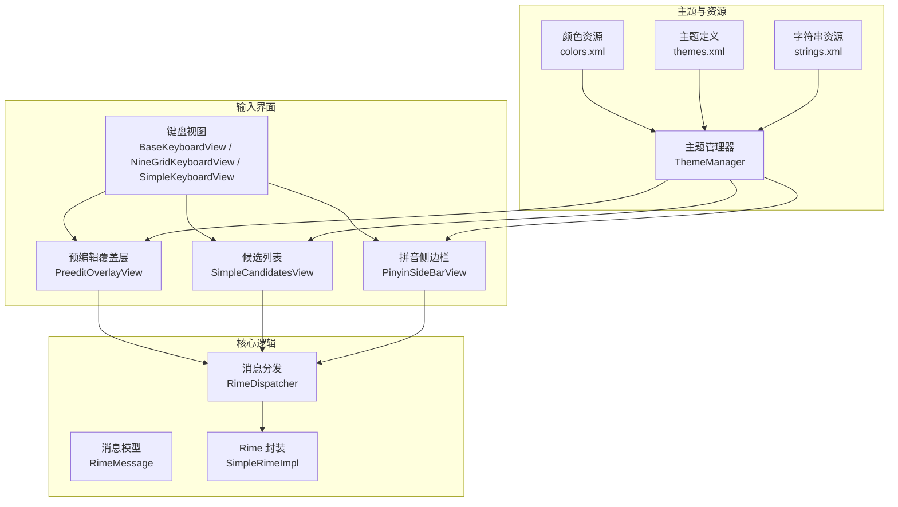
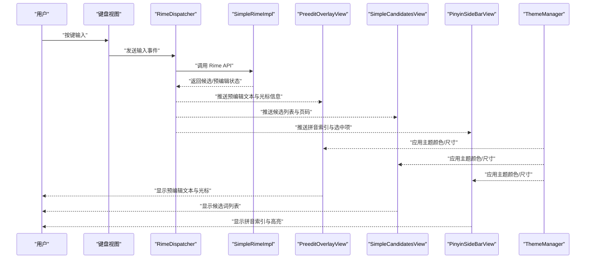
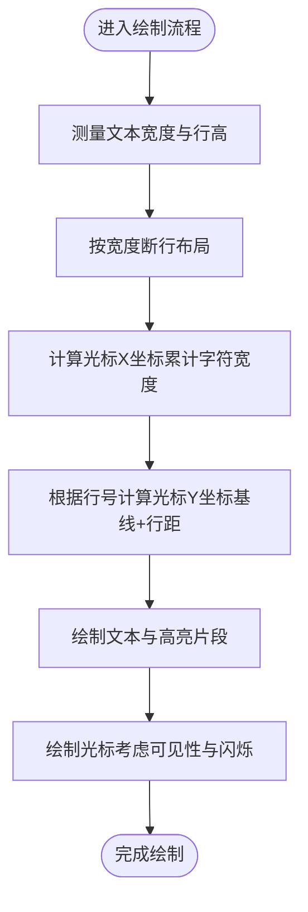
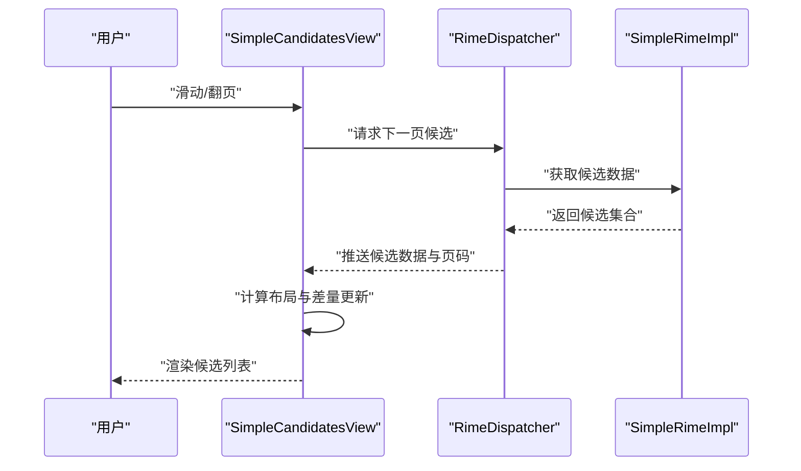
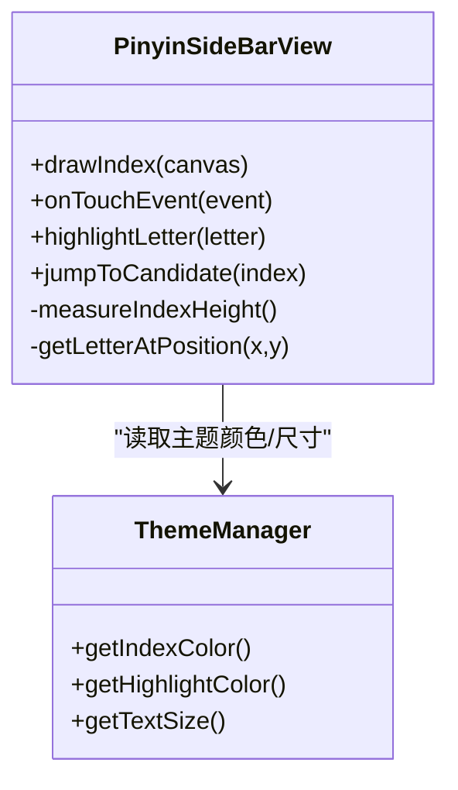
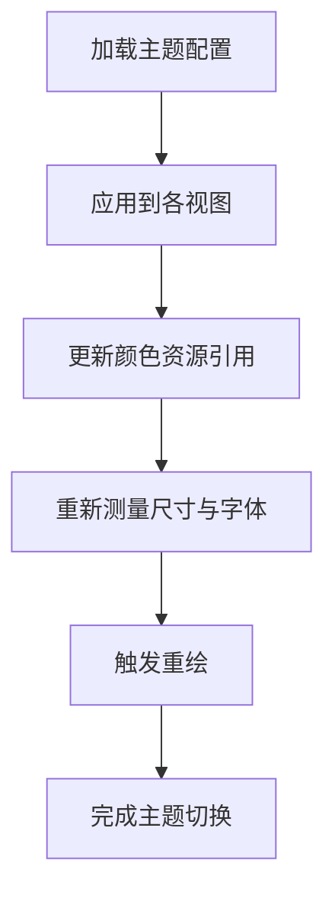
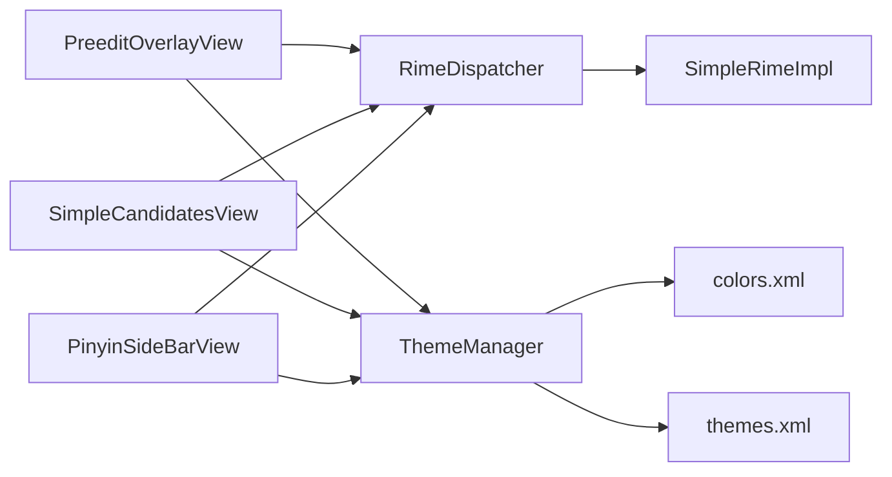

# UI 组件

<cite>
**本文引用的文件**   
- [PreeditOverlayView.kt](file://app/src/main/java/com/ziyou/ime/ime/PreeditOverlayView.kt)
- [SimpleCandidatesView.kt](file://app/src/main/java/com/ziyou/ime/ime/SimpleCandidatesView.kt)
- [PinyinSideBarView.kt](file://app/src/main/java/com/ziyou/ime/ime/PinyinSideBarView.kt)
- [ThemeManager.kt](file://app/src/main/java/com/ziyou/ime/config/ThemeManager.kt)
- [colors.xml](file://app/src/main/res/values/colors.xml)
- [themes.xml](file://app/src/main/res/values/themes.xml)
- [strings.xml](file://app/src/main/res/values/strings.xml)
- [BaseKeyboardView.kt](file://app/src/main/java/com/ziyou/ime/ime/BaseKeyboardView.kt)
- [NineGridKeyboardView.kt](file://app/src/main/java/com/ziyou/ime/ime/NineGridKeyboardView.kt)
- [SimpleKeyboardView.kt](file://app/src/main/java/com/ziyou/ime/ime/SimpleKeyboardView.kt)
- [RimeDispatcher.kt](file://app/src/main/java/com/ziyou/ime/core/RimeDispatcher.kt)
- [RimeMessage.kt](file://app/src/main/java/com/ziyou/ime/core/RimeMessage.kt)
- [SimpleRimeImpl.kt](file://app/src/main/java/com/ziyou/ime/core/SimpleRimeImpl.kt)
</cite>

## 目录
1. [简介](#简介)
2. [项目结构](#项目结构)
3. [核心组件](#核心组件)
4. [架构总览](#架构总览)
5. [详细组件分析](#详细组件分析)
6. [依赖分析](#依赖分析)
7. [性能考虑](#性能考虑)
8. [故障排查指南](#故障排查指南)
9. [结论](#结论)
10. [附录](#附录)

## 简介
本文件面向输入法 UI 层，聚焦以下目标：
- 深入解释 PreeditOverlayView 的预编辑文本显示机制与光标定位算法。
- 详细说明 SimpleCandidatesView 的候选词列表渲染、分页加载与滚动优化。
- 描述 PinyinSideBarView 的拼音侧边栏实现（字母索引、快速跳转、触摸反馈）。
- 说明主题系统原理（颜色资源管理、动态主题切换、屏幕密度适配）。
- 阐述自定义样式与动画效果的实现方法。
- 详细描述无障碍支持与多语言适配方案。
- 提供组件复用模式与自定义开发指南。

## 项目结构
UI 相关代码集中在 app/src/main/java/com/ziyou/ime/ime 包下，包含键盘视图、候选区、预编辑覆盖层与拼音侧边栏等；主题与国际化资源位于 res/values 中；核心消息分发与 Rime 集成位于 core 包。

**图表来源** 
- [PreeditOverlayView.kt:1-200](file://app/src/main/java/com/ziyou/ime/ime/PreeditOverlayView.kt#L1-L200)
- [SimpleCandidatesView.kt:1-200](file://app/src/main/java/com/ziyou/ime/ime/SimpleCandidatesView.kt#L1-L200)
- [PinyinSideBarView.kt:1-200](file://app/src/main/java/com/ziyou/ime/ime/PinyinSideBarView.kt#L1-L200)
- [ThemeManager.kt:1-200](file://app/src/main/java/com/ziyou/ime/config/ThemeManager.kt#L1-L200)
- [colors.xml:1-200](file://app/src/main/res/values/colors.xml#L1-L200)
- [themes.xml:1-200](file://app/src/main/res/values/themes.xml#L1-L200)
- [strings.xml:1-200](file://app/src/main/res/values/strings.xml#L1-L200)
- [BaseKeyboardView.kt:1-200](file://app/src/main/java/com/ziyou/ime/ime/BaseKeyboardView.kt#L1-L200)
- [NineGridKeyboardView.kt:1-200](file://app/src/main/java/com/ziyou/ime/ime/NineGridKeyboardView.kt#L1-L200)
- [SimpleKeyboardView.kt:1-200](file://app/src/main/java/com/ziyou/ime/ime/SimpleKeyboardView.kt#L1-L200)
- [RimeDispatcher.kt:1-200](file://app/src/main/java/com/ziyou/ime/core/RimeDispatcher.kt#L1-L200)
- [RimeMessage.kt:1-200](file://app/src/main/java/com/ziyou/ime/core/RimeMessage.kt#L1-L200)
- [SimpleRimeImpl.kt:1-200](file://app/src/main/java/com/ziyou/ime/core/SimpleRimeImpl.kt#L1-L200)

**章节来源**
- [PreeditOverlayView.kt:1-200](file://app/src/main/java/com/ziyou/ime/ime/PreeditOverlayView.kt#L1-L200)
- [SimpleCandidatesView.kt:1-200](file://app/src/main/java/com/ziyou/ime/ime/SimpleCandidatesView.kt#L1-L200)
- [PinyinSideBarView.kt:1-200](file://app/src/main/java/com/ziyou/ime/ime/PinyinSideBarView.kt#L1-L200)
- [ThemeManager.kt:1-200](file://app/src/main/java/com/ziyou/ime/config/ThemeManager.kt#L1-L200)
- [colors.xml:1-200](file://app/src/main/res/values/colors.xml#L1-L200)
- [themes.xml:1-200](file://app/src/main/res/values/themes.xml#L1-L200)
- [strings.xml:1-200](file://app/src/main/res/values/strings.xml#L1-L200)
- [BaseKeyboardView.kt:1-200](file://app/src/main/java/com/ziyou/ime/ime/BaseKeyboardView.kt#L1-L200)
- [NineGridKeyboardView.kt:1-200](file://app/src/main/java/com/ziyou/ime/ime/NineGridKeyboardView.kt#L1-L200)
- [SimpleKeyboardView.kt:1-200](file://app/src/main/java/com/ziyou/ime/ime/SimpleKeyboardView.kt#L1-L200)
- [RimeDispatcher.kt:1-200](file://app/src/main/java/com/ziyou/ime/core/RimeDispatcher.kt#L1-L200)
- [RimeMessage.kt:1-200](file://app/src/main/java/com/ziyou/ime/core/RimeMessage.kt#L1-L200)
- [SimpleRimeImpl.kt:1-200](file://app/src/main/java/com/ziyou/ime/core/SimpleRimeImpl.kt#L1-L200)

## 核心组件
- PreeditOverlayView：负责在键盘上方绘制预编辑文本与光标，处理文本测量、行高计算与光标位置更新。
- SimpleCandidatesView：负责候选词列表渲染、分页加载、滚动与选中项高亮。
- PinyinSideBarView：负责拼音首字母索引展示、快速跳转与触摸反馈。
- ThemeManager：集中管理主题色、字体大小、背景与前景色，支持运行时切换与不同屏幕密度适配。
- 键盘视图族（BaseKeyboardView、NineGridKeyboardView、SimpleKeyboardView）：提供按键布局与事件分发，驱动候选区与预编辑区更新。

**章节来源**
- [PreeditOverlayView.kt:1-200](file://app/src/main/java/com/ziyou/ime/ime/PreeditOverlayView.kt#L1-L200)
- [SimpleCandidatesView.kt:1-200](file://app/src/main/java/com/ziyou/ime/ime/SimpleCandidatesView.kt#L1-L200)
- [PinyinSideBarView.kt:1-200](file://app/src/main/java/com/ziyou/ime/ime/PinyinSideBarView.kt#L1-L200)
- [ThemeManager.kt:1-200](file://app/src/main/java/com/ziyou/ime/config/ThemeManager.kt#L1-L200)
- [BaseKeyboardView.kt:1-200](file://app/src/main/java/com/ziyou/ime/ime/BaseKeyboardView.kt#L1-L200)
- [NineGridKeyboardView.kt:1-200](file://app/src/main/java/com/ziyou/ime/ime/NineGridKeyboardView.kt#L1-L200)
- [SimpleKeyboardView.kt:1-200](file://app/src/main/java/com/ziyou/ime/ime/SimpleKeyboardView.kt#L1-L200)

## 架构总览
UI 层通过消息分发模块与 Rime 引擎交互，主题管理器统一注入视觉风格，各视图按需订阅状态变化并刷新。

**图表来源** 
- [RimeDispatcher.kt:1-200](file://app/src/main/java/com/ziyou/ime/core/RimeDispatcher.kt#L1-L200)
- [RimeMessage.kt:1-200](file://app/src/main/java/com/ziyou/ime/core/RimeMessage.kt#L1-L200)
- [SimpleRimeImpl.kt:1-200](file://app/src/main/java/com/ziyou/ime/core/SimpleRimeImpl.kt#L1-L200)
- [PreeditOverlayView.kt:1-200](file://app/src/main/java/com/ziyou/ime/ime/PreeditOverlayView.kt#L1-L200)
- [SimpleCandidatesView.kt:1-200](file://app/src/main/java/com/ziyou/ime/ime/SimpleCandidatesView.kt#L1-L200)
- [PinyinSideBarView.kt:1-200](file://app/src/main/java/com/ziyou/ime/ime/PinyinSideBarView.kt#L1-L200)
- [ThemeManager.kt:1-200](file://app/src/main/java/com/ziyou/ime/config/ThemeManager.kt#L1-L200)

## 详细组件分析

### PreeditOverlayView：预编辑文本与光标定位
- 文本显示机制
  - 根据当前字体、字号与行高计算每行可容纳字符数，自动换行。
  - 使用 Paint 测量文本宽度，结合 View 可用宽度进行断行与裁剪。
  - 支持富文本片段（如高亮选段），按段落绘制。
- 光标定位算法
  - 基于字符偏移量计算光标横坐标：逐字符累加宽度直至目标位置。
  - 考虑标点、全角/半角差异与字体度量（ascent/descent/leading）。
  - 当光标位于行尾或需要换行时，调整纵坐标至下一行基线。
  - 支持可见性控制（闪烁频率、隐藏条件）。
- 刷新策略
  - 文本变更或主题切换时触发重绘，避免频繁无效刷新。
  - 使用 invalidate() 局部刷新区域，减少整体重绘开销。

**图表来源** 
- [PreeditOverlayView.kt:1-200](file://app/src/main/java/com/ziyou/ime/ime/PreeditOverlayView.kt#L1-L200)

**章节来源**
- [PreeditOverlayView.kt:1-200](file://app/src/main/java/com/ziyou/ime/ime/PreeditOverlayView.kt#L1-L200)

### SimpleCandidatesView：候选词列表渲染、分页与滚动优化
- 渲染机制
  - 使用 RecyclerView 或自定义 Canvas 绘制候选项，支持横向/纵向布局。
  - 每项绘制包括序号、候选文本、选中态高亮与分隔线。
  - 支持多列布局与自适应间距。
- 分页加载
  - 维护候选列表页码与每页数量，按需加载更多数据。
  - 与 RimeDispatcher 协作，请求下一页候选集合并缓存。
- 滚动优化
  - 启用硬件加速与离屏渲染（必要时），减少重绘。
  - 使用 DiffUtil 或自定义差量更新，仅刷新变化项。
  - 滚动过程中暂停非关键绘制，提升流畅度。

**图表来源** 
- [SimpleCandidatesView.kt:1-200](file://app/src/main/java/com/ziyou/ime/ime/SimpleCandidatesView.kt#L1-L200)
- [RimeDispatcher.kt:1-200](file://app/src/main/java/com/ziyou/ime/core/RimeDispatcher.kt#L1-L200)
- [SimpleRimeImpl.kt:1-200](file://app/src/main/java/com/ziyou/ime/core/SimpleRimeImpl.kt#L1-L200)

**章节来源**
- [SimpleCandidatesView.kt:1-200](file://app/src/main/java/com/ziyou/ime/ime/SimpleCandidatesView.kt#L1-L200)

### PinyinSideBarView：拼音侧边栏（字母索引、快速跳转、触摸反馈）
- 字母索引
  - 绘制 A-Z 索引条，支持中文拼音首字母映射。
  - 根据当前输入状态高亮对应字母。
- 快速跳转
  - 监听触摸事件，计算触摸点所在字母区间，触发候选列表跳转到对应分组。
  - 支持长按预览与平滑滚动到目标位置。
- 触摸反馈
  - 按下态高亮、抬起态恢复，必要时添加震动反馈。
  - 防抖与节流，避免频繁触发跳转。

**图表来源** 
- [PinyinSideBarView.kt:1-200](file://app/src/main/java/com/ziyou/ime/ime/PinyinSideBarView.kt#L1-L200)
- [ThemeManager.kt:1-200](file://app/src/main/java/com/ziyou/ime/config/ThemeManager.kt#L1-L200)

**章节来源**
- [PinyinSideBarView.kt:1-200](file://app/src/main/java/com/ziyou/ime/ime/PinyinSideBarView.kt#L1-L200)

### 主题系统：颜色资源管理、动态切换与密度适配
- 颜色资源管理
  - colors.xml 定义主色、辅色、背景与前景色，ThemeManager 统一加载与缓存。
  - 支持明暗主题切换，运行时替换颜色引用。
- 动态主题切换
  - 通过 ThemeManager 暴露 setTheme(themeId) 接口，通知各视图刷新。
  - 视图内部持有主题引用，按需重新测量与绘制。
- 屏幕密度适配
  - 使用 dp/sp 单位，确保在不同 DPI 设备上保持一致视觉效果。
  - 字体大小与间距随主题与设备密度动态调整。

**图表来源** 
- [ThemeManager.kt:1-200](file://app/src/main/java/com/ziyou/ime/config/ThemeManager.kt#L1-L200)
- [colors.xml:1-200](file://app/src/main/res/values/colors.xml#L1-L200)
- [themes.xml:1-200](file://app/src/main/res/values/themes.xml#L1-L200)

**章节来源**
- [ThemeManager.kt:1-200](file://app/src/main/java/com/ziyou/ime/config/ThemeManager.kt#L1-L200)
- [colors.xml:1-200](file://app/src/main/res/values/colors.xml#L1-L200)
- [themes.xml:1-200](file://app/src/main/res/values/themes.xml#L1-L200)

### 自定义样式与动画效果
- 自定义样式
  - 通过 themes.xml 定义样式属性（如圆角、阴影、边框），在视图中引用。
  - 支持 XML 定义 Drawable 作为背景或分割线。
- 动画效果
  - 使用属性动画（ObjectAnimator）实现候选项入场/出场、高亮过渡。
  - 对频繁动画场景采用帧率限制与取消不必要动画以提升性能。

**章节来源**
- [themes.xml:1-200](file://app/src/main/res/values/themes.xml#L1-L200)

### 无障碍支持与多语言适配
- 无障碍支持
  - 为候选项与侧边栏索引设置内容描述（contentDescription），便于读屏器朗读。
  - 支持焦点导航与键盘操作，确保无鼠标环境可用。
- 多语言适配
  - strings.xml 提供多语言字符串资源，运行时根据系统语言切换。
  - 文本方向（RTL/LTR）与本地化格式（日期、数字）由系统自动处理。

**章节来源**
- [strings.xml:1-200](file://app/src/main/res/values/strings.xml#L1-L200)

### 组件复用模式与自定义开发指南
- 复用模式
  - BaseKeyboardView 提供通用按键绘制与事件分发，子类继承扩展布局与行为。
  - ThemeManager 作为单例或依赖注入对象，供所有视图共享主题状态。
- 自定义开发指南
  - 新增视图时，遵循“数据-主题-绘制”分离原则，避免硬编码颜色与尺寸。
  - 使用观察者模式订阅 RimeDispatcher 的状态变化，及时刷新 UI。
  - 对复杂绘制逻辑进行性能测试，避免主线程阻塞。

**章节来源**
- [BaseKeyboardView.kt:1-200](file://app/src/main/java/com/ziyou/ime/ime/BaseKeyboardView.kt#L1-L200)
- [NineGridKeyboardView.kt:1-200](file://app/src/main/java/com/ziyou/ime/ime/NineGridKeyboardView.kt#L1-L200)
- [SimpleKeyboardView.kt:1-200](file://app/src/main/java/com/ziyou/ime/ime/SimpleKeyboardView.kt#L1-L200)
- [ThemeManager.kt:1-200](file://app/src/main/java/com/ziyou/ime/config/ThemeManager.kt#L1-L200)

## 依赖分析
UI 组件依赖关系清晰，视图层通过消息分发与核心逻辑解耦，主题管理器贯穿各视图。

**图表来源** 
- [PreeditOverlayView.kt:1-200](file://app/src/main/java/com/ziyou/ime/ime/PreeditOverlayView.kt#L1-L200)
- [SimpleCandidatesView.kt:1-200](file://app/src/main/java/com/ziyou/ime/ime/SimpleCandidatesView.kt#L1-L200)
- [PinyinSideBarView.kt:1-200](file://app/src/main/java/com/ziyou/ime/ime/PinyinSideBarView.kt#L1-L200)
- [RimeDispatcher.kt:1-200](file://app/src/main/java/com/ziyou/ime/core/RimeDispatcher.kt#L1-L200)
- [SimpleRimeImpl.kt:1-200](file://app/src/main/java/com/ziyou/ime/core/SimpleRimeImpl.kt#L1-L200)
- [ThemeManager.kt:1-200](file://app/src/main/java/com/ziyou/ime/config/ThemeManager.kt#L1-L200)
- [colors.xml:1-200](file://app/src/main/res/values/colors.xml#L1-L200)
- [themes.xml:1-200](file://app/src/main/res/values/themes.xml#L1-L200)

**章节来源**
- [RimeDispatcher.kt:1-200](file://app/src/main/java/com/ziyou/ime/core/RimeDispatcher.kt#L1-L200)
- [RimeMessage.kt:1-200](file://app/src/main/java/com/ziyou/ime/core/RimeMessage.kt#L1-L200)
- [SimpleRimeImpl.kt:1-200](file://app/src/main/java/com/ziyou/ime/core/SimpleRimeImpl.kt#L1-L200)

## 性能考虑
- 预编辑文本绘制
  - 使用 Paint.measureText 缓存测量结果，避免重复计算。
  - 仅在文本或主题变化时触发重绘，减少无效刷新。
- 候选列表渲染
  - 启用 RecyclerView 的 diff 更新与回收机制，降低内存占用。
  - 滚动时延迟非关键绘制，优先保证滚动流畅。
- 侧边栏交互
  - 触摸事件去抖与节流，避免频繁跳转与重绘。
  - 高亮区域局部刷新，而非整屏重绘。
- 主题切换
  - 批量更新颜色引用，一次性触发重绘，避免多次无效刷新。

[本节为通用指导，不直接分析具体文件]

## 故障排查指南
- 预编辑文本错位
  - 检查字体测量与行高计算是否正确，确认断行逻辑是否考虑全角字符。
  - 验证光标定位算法是否处理了边界情况（行尾、空行）。
- 候选列表卡顿
  - 检查是否启用了不必要的动画或离屏渲染。
  - 确认分页加载逻辑是否合理，避免一次性加载过多数据。
- 侧边栏跳转异常
  - 核对触摸坐标与字母区间映射是否正确。
  - 检查高亮与滚动同步逻辑是否存在竞态条件。
- 主题切换失效
  - 确认 ThemeManager 是否被正确通知，各视图是否订阅了主题变化。
  - 检查颜色资源引用是否指向正确的资源 ID。

**章节来源**
- [PreeditOverlayView.kt:1-200](file://app/src/main/java/com/ziyou/ime/ime/PreeditOverlayView.kt#L1-L200)
- [SimpleCandidatesView.kt:1-200](file://app/src/main/java/com/ziyou/ime/ime/SimpleCandidatesView.kt#L1-L200)
- [PinyinSideBarView.kt:1-200](file://app/src/main/java/com/ziyou/ime/ime/PinyinSideBarView.kt#L1-L200)
- [ThemeManager.kt:1-200](file://app/src/main/java/com/ziyou/ime/config/ThemeManager.kt#L1-L200)

## 结论
本输入法 UI 组件通过清晰的职责划分与主题统一管理，实现了高效的预编辑显示、候选列表渲染与拼音侧边栏交互。借助消息分发与 Rime 引擎集成，UI 层保持低耦合与高可扩展性。未来可进一步优化测量缓存、动画性能与无障碍体验，以满足更广泛的设备与用户需求。

[本节为总结性内容，不直接分析具体文件]

## 附录
- 术语表
  - 预编辑文本：用户在输入过程中尚未提交的临时文本。
  - 候选词：根据输入生成的可选字词列表。
  - 拼音侧边栏：用于快速选择拼音首字母的垂直索引条。
  - 主题：一套统一的视觉风格定义，包括颜色、字体与间距。
- 参考资源
  - Android 官方文档：自定义 View 绘制与性能优化。
  - Rime 输入法框架：消息协议与状态管理。

[本节为补充信息，不直接分析具体文件]