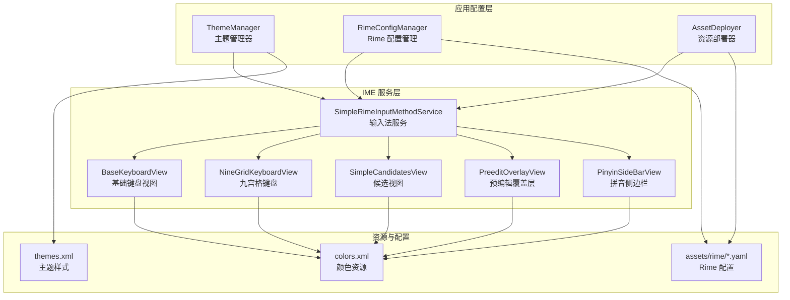
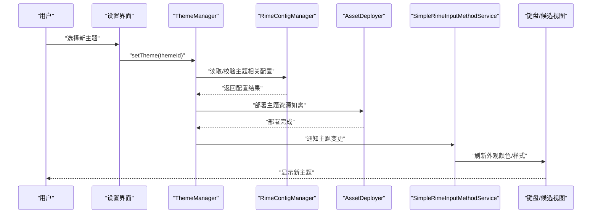
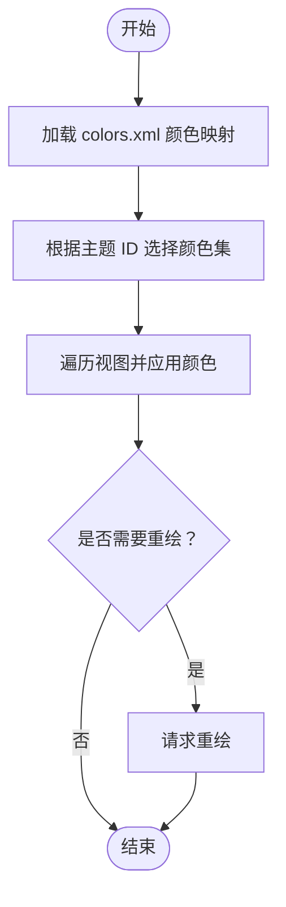
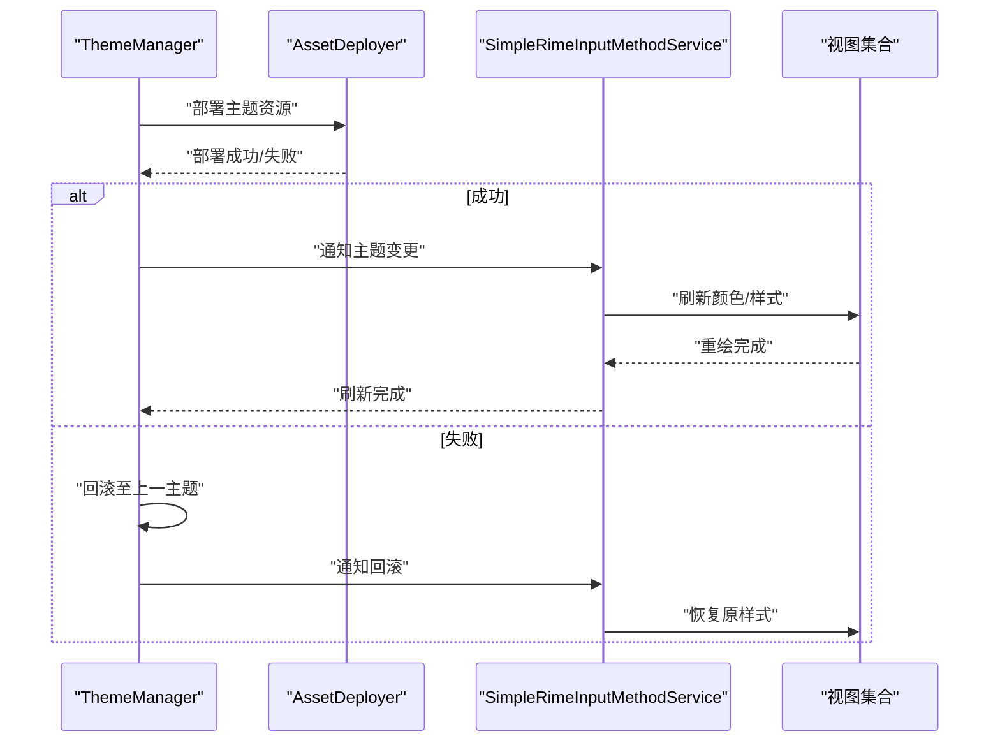
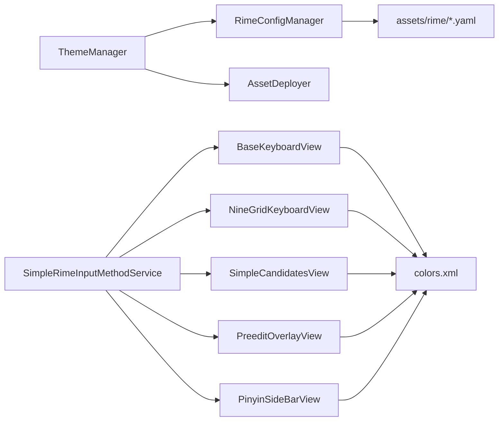

# 主题系统

<cite>
**本文引用的文件**   
- [ThemeManager.kt](file://app/src/main/java/com/ziyou/ime/config/ThemeManager.kt)
- [RimeConfigManager.kt](file://app/src/main/java/com/ziyou/ime/config/RimeConfigManager.kt)
- [AssetDeployer.kt](file://app/src/main/java/com/ziyou/ime/config/AssetDeployer.kt)
- [SimpleRimeInputMethodService.kt](file://app/src/main/java/com/ziyou/ime/ime/SimpleRimeInputMethodService.kt)
- [BaseKeyboardView.kt](file://app/src/main/java/com/ziyou/ime/ime/BaseKeyboardView.kt)
- [NineGridKeyboardView.kt](file://app/src/main/java/com/ziyou/ime/ime/NineGridKeyboardView.kt)
- [SimpleCandidatesView.kt](file://app/src/main/java/com/ziyou/ime/ime/SimpleCandidatesView.kt)
- [PreeditOverlayView.kt](file://app/src/main/java/com/ziyou/ime/ime/PreeditOverlayView.kt)
- [PinyinSideBarView.kt](file://app/src/main/java/com/ziyou/ime/ime/PinyinSideBarView.kt)
- [colors.xml](file://app/src/main/res/values/colors.xml)
- [themes.xml](file://app/src/main/res/values/themes.xml)
- [default.yaml](file://app/src/main/assets/rime/default.yaml)
- [cangjie5.schema.yaml](file://app/src/main/assets/rime/cangjie5.schema.yaml)
- [luna_pinyin.schema.yaml](file://app/src/main/assets/rime/luna_pinyin.schema.yaml)
- [symbols.yaml](file://app/src/main/assets/rime/symbols.yaml)
</cite>

## 目录
1. [简介](#简介)
2. [项目结构](#项目结构)
3. [核心组件](#核心组件)
4. [架构总览](#架构总览)
5. [详细组件分析](#详细组件分析)
6. [依赖关系分析](#依赖关系分析)
7. [性能考量](#性能考量)
8. [故障排查指南](#故障排查指南)
9. [结论](#结论)
10. [附录](#附录)

## 简介
本文件围绕输入法项目的“主题系统”进行系统化说明，覆盖主题数据结构、资源管理、动态切换机制、颜色资源管理（定义、命名与继承）、配置文件格式（YAML、变量替换、条件加载）、运行时切换实现（资源重新加载、视图刷新、状态保持）、暗色模式与自适应主题支持方案，以及主题开发指南（自定义主题创建、资源组织最佳实践、兼容性考虑）和完整配置示例与调试技巧。

## 项目结构
主题系统涉及 Android 应用层（Kotlin/Res）、IME 服务层（输入界面与渲染）、以及 Rime 引擎配置层（assets/rime/*.yaml）。关键目录与职责：
- app/src/main/java/com/ziyou/ime/config：主题与配置管理（ThemeManager、RimeConfigManager、AssetDeployer）
- app/src/main/java/com/ziyou/ime/ime：键盘与候选等 UI 组件（BaseKeyboardView、NineGridKeyboardView、SimpleCandidatesView、PreeditOverlayView、PinyinSideBarView）
- app/src/main/res/values：Android 主题与颜色资源（themes.xml、colors.xml）
- app/src/main/assets/rime：Rime 引擎的 YAML 配置（default.yaml、schema*.yaml、symbols.yaml）

图表来源 
- [ThemeManager.kt](file://app/src/main/java/com/ziyou/ime/config/ThemeManager.kt)
- [RimeConfigManager.kt](file://app/src/main/java/com/ziyou/ime/config/RimeConfigManager.kt)
- [AssetDeployer.kt](file://app/src/main/java/com/ziyou/ime/config/AssetDeployer.kt)
- [SimpleRimeInputMethodService.kt](file://app/src/main/java/com/ziyou/ime/ime/SimpleRimeInputMethodService.kt)
- [BaseKeyboardView.kt](file://app/src/main/java/com/ziyou/ime/ime/BaseKeyboardView.kt)
- [NineGridKeyboardView.kt](file://app/src/main/java/com/ziyou/ime/ime/NineGridKeyboardView.kt)
- [SimpleCandidatesView.kt](file://app/src/main/java/com/ziyou/ime/ime/SimpleCandidatesView.kt)
- [PreeditOverlayView.kt](file://app/src/main/java/com/ziyou/ime/ime/PreeditOverlayView.kt)
- [PinyinSideBarView.kt](file://app/src/main/java/com/ziyou/ime/ime/PinyinSideBarView.kt)
- [colors.xml](file://app/src/main/res/values/colors.xml)
- [themes.xml](file://app/src/main/res/values/themes.xml)
- [default.yaml](file://app/src/main/assets/rime/default.yaml)

章节来源
- [ThemeManager.kt](file://app/src/main/java/com/ziyou/ime/config/ThemeManager.kt)
- [RimeConfigManager.kt](file://app/src/main/java/com/ziyou/ime/config/RimeConfigManager.kt)
- [AssetDeployer.kt](file://app/src/main/java/com/ziyou/ime/config/AssetDeployer.kt)
- [SimpleRimeInputMethodService.kt](file://app/src/main/java/com/ziyou/ime/ime/SimpleRimeInputMethodService.kt)
- [BaseKeyboardView.kt](file://app/src/main/java/com/ziyou/ime/ime/BaseKeyboardView.kt)
- [NineGridKeyboardView.kt](file://app/src/main/java/com/ziyou/ime/ime/NineGridKeyboardView.kt)
- [SimpleCandidatesView.kt](file://app/src/main/java/com/ziyou/ime/ime/SimpleCandidatesView.kt)
- [PreeditOverlayView.kt](file://app/src/main/java/com/ziyou/ime/ime/PreeditOverlayView.kt)
- [PinyinSideBarView.kt](file://app/src/main/java/com/ziyou/ime/ime/PinyinSideBarView.kt)
- [colors.xml](file://app/src/main/res/values/colors.xml)
- [themes.xml](file://app/src/main/res/values/themes.xml)
- [default.yaml](file://app/src/main/assets/rime/default.yaml)

## 核心组件
- ThemeManager：负责主题生命周期、当前主题标识、主题切换触发、主题相关偏好持久化与广播通知。
- RimeConfigManager：负责读取/写入 assets/rime 下的 YAML 配置，处理变量替换与条件加载，并在配置变更时触发引擎重建或热更新。
- AssetDeployer：负责将默认或用户主题资源部署到可读写目录，确保运行时可用。
- IME 服务与视图：SimpleRimeInputMethodService 作为入口，协调各视图（BaseKeyboardView、NineGridKeyboardView、SimpleCandidatesView、PreeditOverlayView、PinyinSideBarView）根据当前主题刷新外观。
- 资源与配置：colors.xml 提供颜色资源；themes.xml 提供主题样式；assets/rime/*.yaml 提供 Rime 引擎的配置项（如候选词样式、键位布局等）。

章节来源
- [ThemeManager.kt](file://app/src/main/java/com/ziyou/ime/config/ThemeManager.kt)
- [RimeConfigManager.kt](file://app/src/main/java/com/ziyou/ime/config/RimeConfigManager.kt)
- [AssetDeployer.kt](file://app/src/main/java/com/ziyou/ime/config/AssetDeployer.kt)
- [SimpleRimeInputMethodService.kt](file://app/src/main/java/com/ziyou/ime/ime/SimpleRimeInputMethodService.kt)
- [BaseKeyboardView.kt](file://app/src/main/java/com/ziyou/ime/ime/BaseKeyboardView.kt)
- [NineGridKeyboardView.kt](file://app/src/main/java/com/ziyou/ime/ime/NineGridKeyboardView.kt)
- [SimpleCandidatesView.kt](file://app/src/main/java/com/ziyou/ime/ime/SimpleCandidatesView.kt)
- [PreeditOverlayView.kt](file://app/src/main/java/com/ziyou/ime/ime/PreeditOverlayView.kt)
- [PinyinSideBarView.kt](file://app/src/main/java/com/ziyou/ime/ime/PinyinSideBarView.kt)
- [colors.xml](file://app/src/main/res/values/colors.xml)
- [themes.xml](file://app/src/main/res/values/themes.xml)
- [default.yaml](file://app/src/main/assets/rime/default.yaml)

## 架构总览
主题系统采用“配置驱动 + 资源绑定 + 事件通知”的架构：
- 配置层：RimeConfigManager 解析 YAML，支持变量替换与条件加载，输出结构化配置供上层使用。
- 主题层：ThemeManager 维护当前主题上下文，监听配置变化并分发刷新指令。
- 资源层：colors.xml 与 themes.xml 提供颜色与样式；AssetDeployer 保障资源可用性。
- 视图层：IME 服务与各键盘/候选视图订阅主题变化，按需重绘与刷新。

图表来源 
- [ThemeManager.kt](file://app/src/main/java/com/ziyou/ime/config/ThemeManager.kt)
- [RimeConfigManager.kt](file://app/src/main/java/com/ziyou/ime/config/RimeConfigManager.kt)
- [AssetDeployer.kt](file://app/src/main/java/com/ziyou/ime/config/AssetDeployer.kt)
- [SimpleRimeInputMethodService.kt](file://app/src/main/java/com/ziyou/ime/ime/SimpleRimeInputMethodService.kt)
- [BaseKeyboardView.kt](file://app/src/main/java/com/ziyou/ime/ime/BaseKeyboardView.kt)
- [NineGridKeyboardView.kt](file://app/src/main/java/com/ziyou/ime/ime/NineGridKeyboardView.kt)
- [SimpleCandidatesView.kt](file://app/src/main/java/com/ziyou/ime/ime/SimpleCandidatesView.kt)
- [PreeditOverlayView.kt](file://app/src/main/java/com/ziyou/ime/ime/PreeditOverlayView.kt)
- [PinyinSideBarView.kt](file://app/src/main/java/com/ziyou/ime/ime/PinyinSideBarView.kt)

## 详细组件分析

### 主题数据模型与生命周期
- 主题标识：以字符串 ID 表示（例如 light/dark/custom_xxx），由 ThemeManager 维护当前值并持久化。
- 主题元数据：包含名称、描述、适用平台版本、是否支持暗色模式等字段，便于在设置界面展示与过滤。
- 生命周期：初始化时加载默认主题；切换时执行资源部署、配置校验、视图刷新；异常时回滚至上一有效主题。

章节来源
- [ThemeManager.kt](file://app/src/main/java/com/ziyou/ime/config/ThemeManager.kt)

### 颜色资源管理系统
- 颜色定义：colors.xml 中集中定义颜色键名（如 primary、background、text_primary、candidate_bg 等），避免硬编码。
- 命名规范：按用途分组（按键、候选、预编辑、侧边栏），统一前缀与后缀，保证可读性与一致性。
- 继承关系：通过 themes.xml 组合颜色，形成主题变体（light/dark/custom），支持夜间模式自动适配。
- 动态切换：ThemeManager 切换主题后，调用视图的 setThemeColors() 方法，按颜色键名批量更新绘制参数。

图表来源 
- [colors.xml](file://app/src/main/res/values/colors.xml)
- [themes.xml](file://app/src/main/res/values/themes.xml)
- [BaseKeyboardView.kt](file://app/src/main/java/com/ziyou/ime/ime/BaseKeyboardView.kt)
- [NineGridKeyboardView.kt](file://app/src/main/java/com/ziyou/ime/ime/NineGridKeyboardView.kt)
- [SimpleCandidatesView.kt](file://app/src/main/java/com/ziyou/ime/ime/SimpleCandidatesView.kt)
- [PreeditOverlayView.kt](file://app/src/main/java/com/ziyou/ime/ime/PreeditOverlayView.kt)
- [PinyinSideBarView.kt](file://app/src/main/java/com/ziyou/ime/ime/PinyinSideBarView.kt)

章节来源
- [colors.xml](file://app/src/main/res/values/colors.xml)
- [themes.xml](file://app/src/main/res/values/themes.xml)
- [BaseKeyboardView.kt](file://app/src/main/java/com/ziyou/ime/ime/BaseKeyboardView.kt)
- [NineGridKeyboardView.kt](file://app/src/main/java/com/ziyou/ime/ime/NineGridKeyboardView.kt)
- [SimpleCandidatesView.kt](file://app/src/main/java/com/ziyou/ime/ime/SimpleCandidatesView.kt)
- [PreeditOverlayView.kt](file://app/src/main/java/com/ziyou/ime/ime/PreeditOverlayView.kt)
- [PinyinSideBarView.kt](file://app/src/main/java/com/ziyou/ime/ime/PinyinSideBarView.kt)

### 主题配置文件格式（YAML）
- 语法：遵循标准 YAML 键值对与嵌套结构，用于描述主题属性（颜色、字体、间距、候选数量等）。
- 变量替换：支持 ${var} 形式的占位符，由 RimeConfigManager 在加载时注入（如平台版本、设备密度、用户偏好）。
- 条件加载：通过 if/else 或 include 机制选择性加载片段，实现多平台或多场景适配。
- 示例文件：default.yaml、cangjie5.schema.yaml、luna_pinyin.schema.yaml、symbols.yaml 等。

章节来源
- [default.yaml](file://app/src/main/assets/rime/default.yaml)
- [cangjie5.schema.yaml](file://app/src/main/assets/rime/cangjie5.schema.yaml)
- [luna_pinyin.schema.yaml](file://app/src/main/assets/rime/luna_pinyin.schema.yaml)
- [symbols.yaml](file://app/src/main/assets/rime/symbols.yaml)
- [RimeConfigManager.kt](file://app/src/main/java/com/ziyou/ime/config/RimeConfigManager.kt)

### 运行时主题切换实现原理
- 资源重新加载：AssetDeployer 将主题资源复制到可写目录，确保后续读取稳定。
- 视图刷新：ThemeManager 广播主题变更，各视图收到后调用 invalidate()/requestLayout() 重绘。
- 状态保持：切换前后保留用户输入状态（如候选页码、光标位置），避免中断体验。
- 错误回滚：若新主题加载失败，恢复至上一个有效主题并提示用户。

图表来源 
- [ThemeManager.kt](file://app/src/main/java/com/ziyou/ime/config/ThemeManager.kt)
- [AssetDeployer.kt](file://app/src/main/java/com/ziyou/ime/config/AssetDeployer.kt)
- [SimpleRimeInputMethodService.kt](file://app/src/main/java/com/ziyou/ime/ime/SimpleRimeInputMethodService.kt)
- [BaseKeyboardView.kt](file://app/src/main/java/com/ziyou/ime/ime/BaseKeyboardView.kt)
- [NineGridKeyboardView.kt](file://app/src/main/java/com/ziyou/ime/ime/NineGridKeyboardView.kt)
- [SimpleCandidatesView.kt](file://app/src/main/java/com/ziyou/ime/ime/SimpleCandidatesView.kt)
- [PreeditOverlayView.kt](file://app/src/main/java/com/ziyou/ime/ime/PreeditOverlayView.kt)
- [PinyinSideBarView.kt](file://app/src/main/java/com/ziyou/ime/ime/PinyinSideBarView.kt)

章节来源
- [ThemeManager.kt](file://app/src/main/java/com/ziyou/ime/config/ThemeManager.kt)
- [AssetDeployer.kt](file://app/src/main/java/com/ziyou/ime/config/AssetDeployer.kt)
- [SimpleRimeInputMethodService.kt](file://app/src/main/java/com/ziyou/ime/ime/SimpleRimeInputMethodService.kt)

### 暗色模式与自适应主题
- 暗色模式：通过 themes.xml 提供 dark 变体，结合系统夜间模式自动切换。
- 自适应：基于屏幕密度、方向、窗口大小动态调整布局与字号，确保可读性。
- 兼容策略：旧设备不支持夜间模式时回退到浅色主题；自定义主题需声明兼容性字段。

章节来源
- [themes.xml](file://app/src/main/res/values/themes.xml)
- [ThemeManager.kt](file://app/src/main/java/com/ziyou/ime/config/ThemeManager.kt)

### 主题开发指南
- 自定义主题创建：
  - 新增 colors.xml 条目，遵循命名规范。
  - 在 themes.xml 中定义主题变体，引用颜色键名。
  - 可选：在 assets/rime 下新增 YAML 片段，描述引擎级样式。
- 资源组织最佳实践：
  - 按功能域拆分颜色（按键、候选、预编辑、侧边栏）。
  - 使用语义化命名（如 bg_candidate、fg_text_primary）。
  - 避免重复定义，优先继承与覆盖。
- 兼容性考虑：
  - 声明最低 API 级别与夜间模式支持。
  - 提供 fallback 颜色，确保降级可用。
  - 测试不同屏幕密度与方向。

章节来源
- [colors.xml](file://app/src/main/res/values/colors.xml)
- [themes.xml](file://app/src/main/res/values/themes.xml)
- [default.yaml](file://app/src/main/assets/rime/default.yaml)

### 完整主题配置示例与调试技巧
- 配置示例：
  - default.yaml：定义全局主题开关、候选数量、字体大小等。
  - schema*.yaml：针对特定输入方案的主题覆盖（如拼音/仓颉）。
  - symbols.yaml：符号面板的颜色与布局。
- 调试技巧：
  - 启用日志：在 ThemeManager 与 RimeConfigManager 中打印关键步骤。
  - 快速验证：临时修改 colors.xml 并观察视图刷新效果。
  - 回滚机制：切换失败时自动恢复，便于定位问题。
  - 单元测试：模拟主题切换流程，验证资源部署与视图刷新。

章节来源
- [default.yaml](file://app/src/main/assets/rime/default.yaml)
- [cangjie5.schema.yaml](file://app/src/main/assets/rime/cangjie5.schema.yaml)
- [luna_pinyin.schema.yaml](file://app/src/main/assets/rime/luna_pinyin.schema.yaml)
- [symbols.yaml](file://app/src/main/assets/rime/symbols.yaml)
- [ThemeManager.kt](file://app/src/main/java/com/ziyou/ime/config/ThemeManager.kt)
- [RimeConfigManager.kt](file://app/src/main/java/com/ziyou/ime/config/RimeConfigManager.kt)

## 依赖关系分析
主题系统内部依赖清晰，外部依赖主要为 Android 框架与 Rime 引擎：
- ThemeManager 依赖 RimeConfigManager 与 AssetDeployer。
- IME 服务依赖各视图组件，视图依赖 colors.xml 与 themes.xml。
- RimeConfigManager 依赖 assets/rime/*.yaml 配置。

图表来源 
- [ThemeManager.kt](file://app/src/main/java/com/ziyou/ime/config/ThemeManager.kt)
- [RimeConfigManager.kt](file://app/src/main/java/com/ziyou/ime/config/RimeConfigManager.kt)
- [AssetDeployer.kt](file://app/src/main/java/com/ziyou/ime/config/AssetDeployer.kt)
- [SimpleRimeInputMethodService.kt](file://app/src/main/java/com/ziyou/ime/ime/SimpleRimeInputMethodService.kt)
- [BaseKeyboardView.kt](file://app/src/main/java/com/ziyou/ime/ime/BaseKeyboardView.kt)
- [NineGridKeyboardView.kt](file://app/src/main/java/com/ziyou/ime/ime/NineGridKeyboardView.kt)
- [SimpleCandidatesView.kt](file://app/src/main/java/com/ziyou/ime/ime/SimpleCandidatesView.kt)
- [PreeditOverlayView.kt](file://app/src/main/java/com/ziyou/ime/ime/PreeditOverlayView.kt)
- [PinyinSideBarView.kt](file://app/src/main/java/com/ziyou/ime/ime/PinyinSideBarView.kt)
- [colors.xml](file://app/src/main/res/values/colors.xml)
- [default.yaml](file://app/src/main/assets/rime/default.yaml)

章节来源
- [ThemeManager.kt](file://app/src/main/java/com/ziyou/ime/config/ThemeManager.kt)
- [RimeConfigManager.kt](file://app/src/main/java/com/ziyou/ime/config/RimeConfigManager.kt)
- [AssetDeployer.kt](file://app/src/main/java/com/ziyou/ime/config/AssetDeployer.kt)
- [SimpleRimeInputMethodService.kt](file://app/src/main/java/com/ziyou/ime/ime/SimpleRimeInputMethodService.kt)
- [BaseKeyboardView.kt](file://app/src/main/java/com/ziyou/ime/ime/BaseKeyboardView.kt)
- [NineGridKeyboardView.kt](file://app/src/main/java/com/ziyou/ime/ime/NineGridKeyboardView.kt)
- [SimpleCandidatesView.kt](file://app/src/main/java/com/ziyou/ime/ime/SimpleCandidatesView.kt)
- [PreeditOverlayView.kt](file://app/src/main/java/com/ziyou/ime/ime/PreeditOverlayView.kt)
- [PinyinSideBarView.kt](file://app/src/main/java/com/ziyou/ime/ime/PinyinSideBarView.kt)
- [colors.xml](file://app/src/main/res/values/colors.xml)
- [default.yaml](file://app/src/main/assets/rime/default.yaml)

## 性能考量
- 资源加载：延迟加载非关键颜色与样式，减少启动时间。
- 视图刷新：批量更新颜色，避免频繁 invalidate()。
- 内存占用：缓存主题配置与颜色映射，避免重复解析。
- 线程安全：主题切换在主线程执行，确保 UI 一致性。

[本节为通用指导，不直接分析具体文件]

## 故障排查指南
- 常见问题：
  - 主题切换无效：检查 ThemeManager 是否正确广播变更，视图是否响应刷新。
  - 颜色未生效：确认 colors.xml 键名与视图引用一致。
  - YAML 解析失败：检查语法与变量替换是否正确。
- 调试步骤：
  - 启用详细日志，定位失败环节。
  - 临时回滚至默认主题，验证基础功能。
  - 使用模拟器或真机逐步验证不同 API 级别。

章节来源
- [ThemeManager.kt](file://app/src/main/java/com/ziyou/ime/config/ThemeManager.kt)
- [RimeConfigManager.kt](file://app/src/main/java/com/ziyou/ime/config/RimeConfigManager.kt)
- [colors.xml](file://app/src/main/res/values/colors.xml)
- [default.yaml](file://app/src/main/assets/rime/default.yaml)

## 结论
主题系统通过清晰的层次划分与事件驱动机制，实现了灵活、可扩展且高性能的主题管理。颜色资源集中管理、YAML 配置驱动、运行时动态切换与暗色模式支持，共同构建了完整的主题生态。开发者可依据本文档快速创建与维护自定义主题，确保跨设备与跨版本的兼容性。

[本节为总结，不直接分析具体文件]

## 附录
- 术语表：主题、颜色资源、YAML 配置、暗色模式、自适应主题。
- 参考链接：Android 主题与样式官方文档、Rime 配置规范。

[本节为补充信息，不直接分析具体文件]