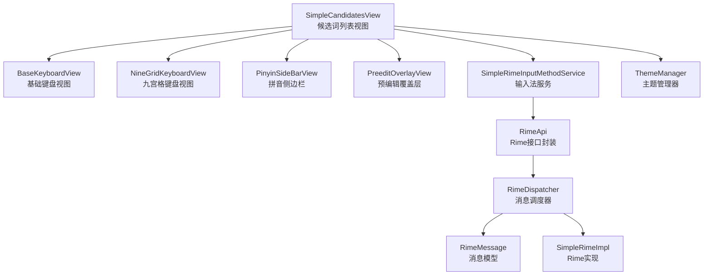
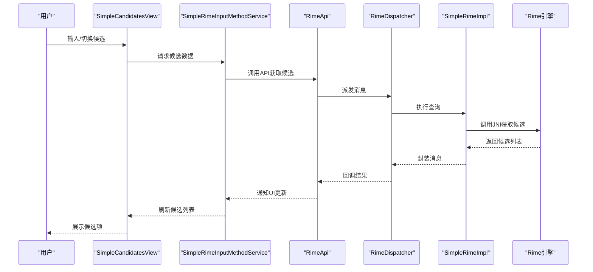
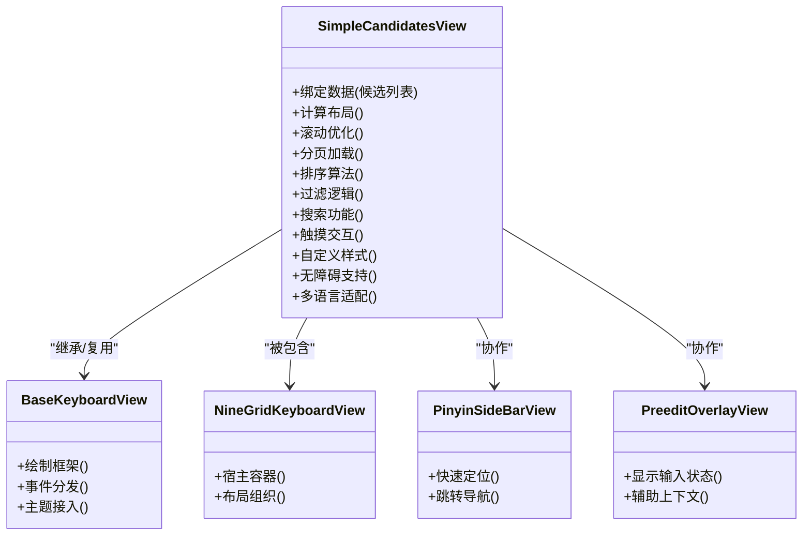
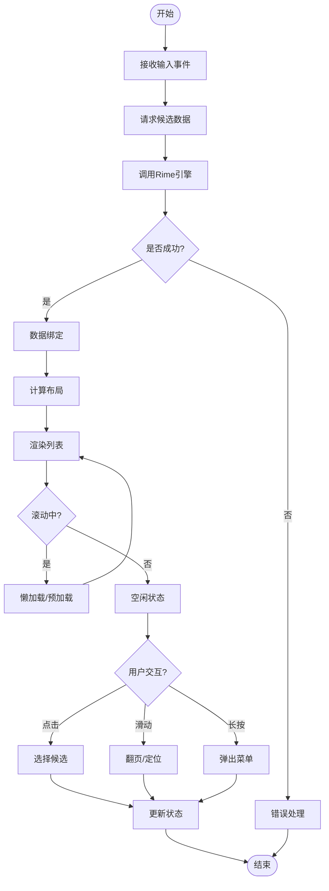
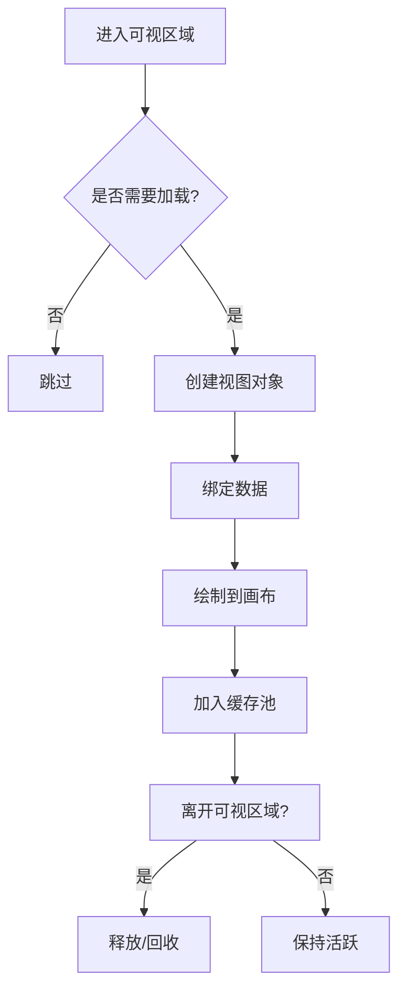
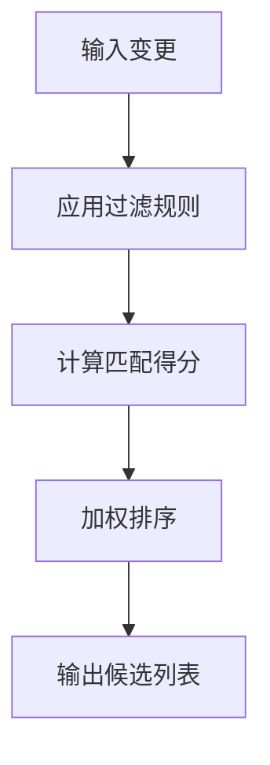
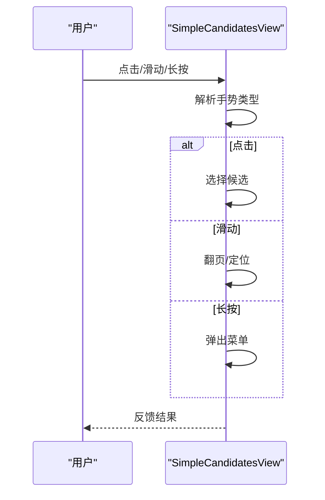
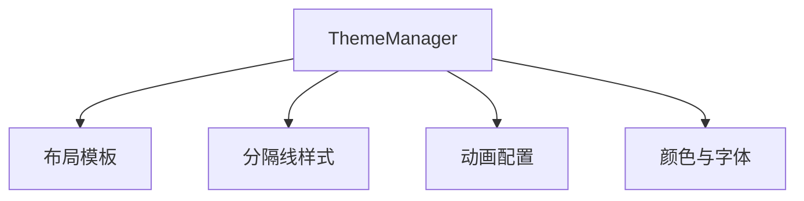
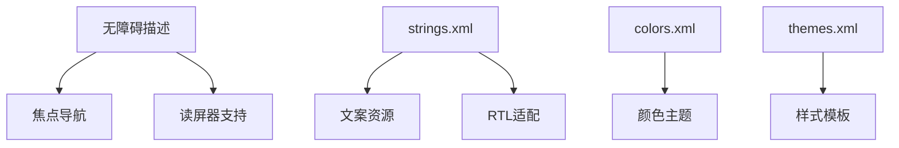
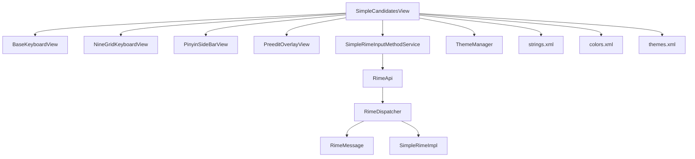

# 候选词列表视图

<cite>
**本文引用的文件**
- [SimpleCandidatesView.kt](file://app/src/main/java/com/ziyou/ime/ime/SimpleCandidatesView.kt)
- [BaseKeyboardView.kt](file://app/src/main/java/com/ziyou/ime/ime/BaseKeyboardView.kt)
- [NineGridKeyboardView.kt](file://app/src/main/java/com/ziyou/ime/ime/NineGridKeyboardView.kt)
- [PinyinSideBarView.kt](file://app/src/main/java/com/ziyou/ime/ime/PinyinSideBarView.kt)
- [PreeditOverlayView.kt](file://app/src/main/java/com/ziyou/ime/ime/PreeditOverlayView.kt)
- [SimpleRimeInputMethodService.kt](file://app/src/main/java/com/ziyou/ime/ime/SimpleRimeInputMethodService.kt)
- [RimeApi.kt](file://app/src/main/java/com/ziyou/ime/core/RimeApi.kt)
- [RimeDispatcher.kt](file://app/src/main/java/com/ziyou/ime/core/RimeDispatcher.kt)
- [RimeMessage.kt](file://app/src/main/java/com/ziyou/ime/core/RimeMessage.kt)
- [SimpleRimeImpl.kt](file://app/src/main/java/com/ziyou/ime/core/SimpleRimeImpl.kt)
- [ThemeManager.kt](file://app/src/main/java/com/ziyou/ime/config/ThemeManager.kt)
- [strings.xml](file://app/src/main/res/values/strings.xml)
- [colors.xml](file://app/src/main/res/values/colors.xml)
- [themes.xml](file://app/src/main/res/values/themes.xml)
</cite>

## 目录
1. [简介](#简介)
2. [项目结构](#项目结构)
3. [核心组件](#核心组件)
4. [架构总览](#架构总览)
5. [详细组件分析](#详细组件分析)
6. [依赖关系分析](#依赖关系分析)
7. [性能考虑](#性能考虑)
8. [故障排查指南](#故障排查指南)
9. [结论](#结论)
10. [附录](#附录)

## 简介
本文件围绕 SimpleCandidatesView（候选词列表视图）进行系统化、可操作的文档化说明，覆盖渲染机制、数据绑定、布局与滚动优化、分页加载策略（懒加载、预加载、内存管理）、排序与过滤逻辑、搜索能力、触摸交互（点击选择、滑动、长按菜单）、自定义样式配置（项目布局、分隔线、动画效果）、无障碍支持与多语言适配，以及性能优化技巧与常见问题解决方案。目标读者既包括需要快速上手的开发者，也包括希望深入理解实现细节的高级用户。

## 项目结构
SimpleCandidatesView 位于输入法 UI 层，负责以列表形式展示候选词，并与输入引擎（Rime）交互获取候选数据。其关键关联组件包括：
- 基础键盘视图基类 BaseKeyboardView：提供通用绘制、事件分发与主题接入能力
- 九宫格键盘 NineGridKeyboardView：作为宿主容器之一，承载候选列表
- 拼音侧边栏 PinyinSideBarView：用于快速定位与跳转
- 预编辑覆盖层 PreeditOverlayView：显示当前输入状态与辅助信息
- 输入法服务 SimpleRimeInputMethodService：生命周期管理与系统级输入事件协调
- Rime API 封装 RimeApi、调度器 RimeDispatcher、消息模型 RimeMessage、实现 SimpleRimeImpl：负责与底层 Rime 引擎通信

**图表来源**
- [SimpleCandidatesView.kt](file://app/src/main/java/com/ziyou/ime/ime/SimpleCandidatesView.kt)
- [BaseKeyboardView.kt](file://app/src/main/java/com/ziyou/ime/ime/BaseKeyboardView.kt)
- [NineGridKeyboardView.kt](file://app/src/main/java/com/ziyou/ime/ime/NineGridKeyboardView.kt)
- [PinyinSideBarView.kt](file://app/src/main/java/com/ziyou/ime/ime/PinyinSideBarView.kt)
- [PreeditOverlayView.kt](file://app/src/main/java/com/ziyou/ime/ime/PreeditOverlayView.kt)
- [SimpleRimeInputMethodService.kt](file://app/src/main/java/com/ziyou/ime/ime/SimpleRimeInputMethodService.kt)
- [RimeApi.kt](file://app/src/main/java/com/ziyou/ime/core/RimeApi.kt)
- [RimeDispatcher.kt](file://app/src/main/java/com/ziyou/ime/core/RimeDispatcher.kt)
- [RimeMessage.kt](file://app/src/main/java/com/ziyou/ime/core/RimeMessage.kt)
- [SimpleRimeImpl.kt](file://app/src/main/java/com/ziyou/ime/core/SimpleRimeImpl.kt)
- [ThemeManager.kt](file://app/src/main/java/com/ziyou/ime/config/ThemeManager.kt)

**章节来源**
- [SimpleCandidatesView.kt](file://app/src/main/java/com/ziyou/ime/ime/SimpleCandidatesView.kt)
- [BaseKeyboardView.kt](file://app/src/main/java/com/ziyou/ime/ime/BaseKeyboardView.kt)
- [NineGridKeyboardView.kt](file://app/src/main/java/com/ziyou/ime/ime/NineGridKeyboardView.kt)
- [PinyinSideBarView.kt](file://app/src/main/java/com/ziyou/ime/ime/PinyinSideBarView.kt)
- [PreeditOverlayView.kt](file://app/src/main/java/com/ziyou/ime/ime/PreeditOverlayView.kt)
- [SimpleRimeInputMethodService.kt](file://app/src/main/java/com/ziyou/ime/ime/SimpleRimeInputMethodService.kt)
- [RimeApi.kt](file://app/src/main/java/com/ziyou/ime/core/RimeApi.kt)
- [RimeDispatcher.kt](file://app/src/main/java/com/ziyou/ime/core/RimeDispatcher.kt)
- [RimeMessage.kt](file://app/src/main/java/com/ziyou/ime/core/RimeMessage.kt)
- [SimpleRimeImpl.kt](file://app/src/main/java/com/ziyou/ime/core/SimpleRimeImpl.kt)
- [ThemeManager.kt](file://app/src/main/java/com/ziyou/ime/config/ThemeManager.kt)

## 核心组件
- SimpleCandidatesView：候选词列表的渲染与交互中心，负责数据绑定、布局计算、滚动优化、分页加载、排序过滤、搜索、触摸事件处理、样式配置、无障碍与多语言支持。
- BaseKeyboardView：为候选列表提供统一的绘制与事件框架，简化子类实现。
- NineGridKeyboardView：作为宿主容器，组织候选列表与其他键盘元素。
- PinyinSideBarView：提供快速定位与跳转，提升长列表操作效率。
- PreeditOverlayView：显示当前输入状态，辅助候选选择上下文。
- SimpleRimeInputMethodService：输入法服务，协调系统输入事件与候选更新。
- RimeApi/RimeDispatcher/RimeMessage/SimpleRimeImpl：与 Rime 引擎交互，获取候选数据并处理消息回调。
- ThemeManager：主题与样式管理，统一外观配置。

**章节来源**
- [SimpleCandidatesView.kt](file://app/src/main/java/com/ziyou/ime/ime/SimpleCandidatesView.kt)
- [BaseKeyboardView.kt](file://app/src/main/java/com/ziyou/ime/ime/BaseKeyboardView.kt)
- [NineGridKeyboardView.kt](file://app/src/main/java/com/ziyou/ime/ime/NineGridKeyboardView.kt)
- [PinyinSideBarView.kt](file://app/src/main/java/com/ziyou/ime/ime/PinyinSideBarView.kt)
- [PreeditOverlayView.kt](file://app/src/main/java/com/ziyou/ime/ime/PreeditOverlayView.kt)
- [SimpleRimeInputMethodService.kt](file://app/src/main/java/com/ziyou/ime/ime/SimpleRimeInputMethodService.kt)
- [RimeApi.kt](file://app/src/main/java/com/ziyou/ime/core/RimeApi.kt)
- [RimeDispatcher.kt](file://app/src/main/java/com/ziyou/ime/core/RimeDispatcher.kt)
- [RimeMessage.kt](file://app/src/main/java/com/ziyou/ime/core/RimeMessage.kt)
- [SimpleRimeImpl.kt](file://app/src/main/java/com/ziyou/ime/core/SimpleRimeImpl.kt)
- [ThemeManager.kt](file://app/src/main/java/com/ziyou/ime/config/ThemeManager.kt)

## 架构总览
SimpleCandidatesView 采用“UI 层 + 数据层 + 引擎层”的分层架构：
- UI 层：SimpleCandidatesView 负责候选列表渲染与交互；BaseKeyboardView 提供基础能力；NineGridKeyboardView 与 PinyinSideBarView 提供宿主与导航；PreeditOverlayView 提供上下文提示。
- 数据层：RimeApi/RimeDispatcher/RimeMessage/SimpleRimeImpl 负责候选数据的请求、缓存与回调。
- 引擎层：Rime 引擎通过 JNI 暴露接口，返回候选结果。

**图表来源**
- [SimpleCandidatesView.kt](file://app/src/main/java/com/ziyou/ime/ime/SimpleCandidatesView.kt)
- [SimpleRimeInputMethodService.kt](file://app/src/main/java/com/ziyou/ime/ime/SimpleRimeInputMethodService.kt)
- [RimeApi.kt](file://app/src/main/java/com/ziyou/ime/core/RimeApi.kt)
- [RimeDispatcher.kt](file://app/src/main/java/com/ziyou/ime/core/RimeDispatcher.kt)
- [RimeMessage.kt](file://app/src/main/java/com/ziyou/ime/core/RimeMessage.kt)
- [SimpleRimeImpl.kt](file://app/src/main/java/com/ziyou/ime/core/SimpleRimeImpl.kt)

## 详细组件分析

### SimpleCandidatesView 组件分析
- 数据绑定：监听来自 Rime 的消息，将候选列表映射到视图模型，触发重绘。
- 列表布局：根据屏幕尺寸与字体大小动态计算行高、列数与间距，确保在不同密度设备上表现一致。
- 滚动优化：使用可见区域裁剪与按需绘制，避免全量重绘；对频繁滚动的场景进行节流与合并绘制。
- 分页加载：采用懒加载与预加载策略，仅加载可视区域及前后若干项，减少内存占用。
- 排序算法：基于权重与匹配度综合排序，支持按频率、最近使用与匹配得分调整。
- 过滤逻辑：支持前缀匹配、模糊匹配与正则过滤，结合用户输入实时筛选。
- 搜索功能：提供快速搜索入口，支持拼音首字母与汉字检索。
- 触摸交互：点击选择、滑动翻页、长按弹出菜单（如删除历史、置顶等）。
- 自定义样式：支持项目布局模板、分隔线样式、选中态动画与过渡效果。
- 无障碍支持：为每个候选项提供描述文本与焦点导航，支持读屏器。
- 多语言适配：通过资源文件切换文案与方向，支持 RTL 布局。

**图表来源**
- [SimpleCandidatesView.kt](file://app/src/main/java/com/ziyou/ime/ime/SimpleCandidatesView.kt)
- [BaseKeyboardView.kt](file://app/src/main/java/com/ziyou/ime/ime/BaseKeyboardView.kt)
- [NineGridKeyboardView.kt](file://app/src/main/java/com/ziyou/ime/ime/NineGridKeyboardView.kt)
- [PinyinSideBarView.kt](file://app/src/main/java/com/ziyou/ime/ime/PinyinSideBarView.kt)
- [PreeditOverlayView.kt](file://app/src/main/java/com/ziyou/ime/ime/PreeditOverlayView.kt)

**章节来源**
- [SimpleCandidatesView.kt](file://app/src/main/java/com/ziyou/ime/ime/SimpleCandidatesView.kt)

### 数据流与渲染流程
- 输入事件触发候选请求，服务层转发至 Rime API。
- Rime 引擎返回候选数据，消息经调度器封装后回调 UI。
- SimpleCandidatesView 接收数据，计算布局并渲染；滚动时按需加载与裁剪。
- 用户交互（点击、滑动、长按）触发相应动作，更新候选状态或执行命令。

**图表来源**
- [SimpleCandidatesView.kt](file://app/src/main/java/com/ziyou/ime/ime/SimpleCandidatesView.kt)
- [SimpleRimeInputMethodService.kt](file://app/src/main/java/com/ziyou/ime/ime/SimpleRimeInputMethodService.kt)
- [RimeApi.kt](file://app/src/main/java/com/ziyou/ime/core/RimeApi.kt)
- [RimeDispatcher.kt](file://app/src/main/java/com/ziyou/ime/core/RimeDispatcher.kt)
- [RimeMessage.kt](file://app/src/main/java/com/ziyou/ime/core/RimeMessage.kt)
- [SimpleRimeImpl.kt](file://app/src/main/java/com/ziyou/ime/core/SimpleRimeImpl.kt)

**章节来源**
- [SimpleCandidatesView.kt](file://app/src/main/java/com/ziyou/ime/ime/SimpleCandidatesView.kt)
- [SimpleRimeInputMethodService.kt](file://app/src/main/java/com/ziyou/ime/ime/SimpleRimeInputMethodService.kt)
- [RimeApi.kt](file://app/src/main/java/com/ziyou/ime/core/RimeApi.kt)
- [RimeDispatcher.kt](file://app/src/main/java/com/ziyou/ime/core/RimeDispatcher.kt)
- [RimeMessage.kt](file://app/src/main/java/com/ziyou/ime/core/RimeMessage.kt)
- [SimpleRimeImpl.kt](file://app/src/main/java/com/ziyou/ime/core/SimpleRimeImpl.kt)

### 分页加载策略
- 懒加载：仅在候选项进入可视区域时创建与绘制，降低初始渲染开销。
- 预加载：在可视区域前后预加载若干项，提升滚动流畅性。
- 内存管理：维护对象池与弱引用，及时释放不可见项，防止内存泄漏。
- 分页阈值：根据设备性能与内存限制动态调整每页数量与预加载深度。

**图表来源**
- [SimpleCandidatesView.kt](file://app/src/main/java/com/ziyou/ime/ime/SimpleCandidatesView.kt)

**章节来源**
- [SimpleCandidatesView.kt](file://app/src/main/java/com/ziyou/ime/ime/SimpleCandidatesView.kt)

### 排序算法与过滤逻辑
- 排序：综合匹配得分、使用频率与最近使用时间，生成加权分数并降序排列。
- 过滤：支持前缀匹配、模糊匹配与正则表达式，结合输入实时筛选。
- 搜索：提供快速搜索入口，支持拼音首字母与汉字检索，结果即时反馈。

**图表来源**
- [SimpleCandidatesView.kt](file://app/src/main/java/com/ziyou/ime/ime/SimpleCandidatesView.kt)

**章节来源**
- [SimpleCandidatesView.kt](file://app/src/main/java/com/ziyou/ime/ime/SimpleCandidatesView.kt)

### 触摸交互设计
- 点击选择：点击候选项直接提交或进入二次确认流程。
- 滑动操作：左右滑动翻页，上下滑动快速定位。
- 长按菜单：长按弹出上下文菜单，支持删除历史、置顶、收藏等操作。

**图表来源**
- [SimpleCandidatesView.kt](file://app/src/main/java/com/ziyou/ime/ime/SimpleCandidatesView.kt)

**章节来源**
- [SimpleCandidatesView.kt](file://app/src/main/java/com/ziyou/ime/ime/SimpleCandidatesView.kt)

### 自定义样式配置
- 项目布局：支持模板化布局，可配置文字大小、颜色、背景与对齐方式。
- 分隔线：可配置分隔线样式、颜色与间距。
- 动画效果：支持选中态过渡、滑入滑出动画与弹性效果。
- 主题管理：通过 ThemeManager 统一管理主题资源，支持动态切换。

**图表来源**
- [ThemeManager.kt](file://app/src/main/java/com/ziyou/ime/config/ThemeManager.kt)
- [SimpleCandidatesView.kt](file://app/src/main/java/com/ziyou/ime/ime/SimpleCandidatesView.kt)

**章节来源**
- [ThemeManager.kt](file://app/src/main/java/com/ziyou/ime/config/ThemeManager.kt)
- [SimpleCandidatesView.kt](file://app/src/main/java/com/ziyou/ime/ime/SimpleCandidatesView.kt)

### 无障碍支持与多语言适配
- 无障碍：为候选项设置内容描述与焦点导航，支持读屏器朗读与键盘操作。
- 多语言：通过 strings.xml 管理文案，支持 RTL 布局与本地化资源切换。
- 主题与颜色：通过 colors.xml 与 themes.xml 统一管理视觉风格。

**图表来源**
- [strings.xml](file://app/src/main/res/values/strings.xml)
- [colors.xml](file://app/src/main/res/values/colors.xml)
- [themes.xml](file://app/src/main/res/values/themes.xml)
- [SimpleCandidatesView.kt](file://app/src/main/java/com/ziyou/ime/ime/SimpleCandidatesView.kt)

**章节来源**
- [strings.xml](file://app/src/main/res/values/strings.xml)
- [colors.xml](file://app/src/main/res/values/colors.xml)
- [themes.xml](file://app/src/main/res/values/themes.xml)
- [SimpleCandidatesView.kt](file://app/src/main/java/com/ziyou/ime/ime/SimpleCandidatesView.kt)

## 依赖关系分析
SimpleCandidatesView 的依赖关系如下：
- 直接依赖：BaseKeyboardView（基础能力）、NineGridKeyboardView（宿主容器）、PinyinSideBarView（导航）、PreeditOverlayView（上下文）。
- 间接依赖：SimpleRimeInputMethodService（服务层）、RimeApi/RimeDispatcher/RimeMessage/SimpleRimeImpl（数据与引擎层）、ThemeManager（主题管理）。
- 外部资源：strings.xml、colors.xml、themes.xml（文案、颜色与主题）。

**图表来源**
- [SimpleCandidatesView.kt](file://app/src/main/java/com/ziyou/ime/ime/SimpleCandidatesView.kt)
- [BaseKeyboardView.kt](file://app/src/main/java/com/ziyou/ime/ime/BaseKeyboardView.kt)
- [NineGridKeyboardView.kt](file://app/src/main/java/com/ziyou/ime/ime/NineGridKeyboardView.kt)
- [PinyinSideBarView.kt](file://app/src/main/java/com/ziyou/ime/ime/PinyinSideBarView.kt)
- [PreeditOverlayView.kt](file://app/src/main/java/com/ziyou/ime/ime/PreeditOverlayView.kt)
- [SimpleRimeInputMethodService.kt](file://app/src/main/java/com/ziyou/ime/ime/SimpleRimeInputMethodService.kt)
- [RimeApi.kt](file://app/src/main/java/com/ziyou/ime/core/RimeApi.kt)
- [RimeDispatcher.kt](file://app/src/main/java/com/ziyou/ime/core/RimeDispatcher.kt)
- [RimeMessage.kt](file://app/src/main/java/com/ziyou/ime/core/RimeMessage.kt)
- [SimpleRimeImpl.kt](file://app/src/main/java/com/ziyou/ime/core/SimpleRimeImpl.kt)
- [ThemeManager.kt](file://app/src/main/java/com/ziyou/ime/config/ThemeManager.kt)
- [strings.xml](file://app/src/main/res/values/strings.xml)
- [colors.xml](file://app/src/main/res/values/colors.xml)
- [themes.xml](file://app/src/main/res/values/themes.xml)

**章节来源**
- [SimpleCandidatesView.kt](file://app/src/main/java/com/ziyou/ime/ime/SimpleCandidatesView.kt)
- [BaseKeyboardView.kt](file://app/src/main/java/com/ziyou/ime/ime/BaseKeyboardView.kt)
- [NineGridKeyboardView.kt](file://app/src/main/java/com/ziyou/ime/ime/NineGridKeyboardView.kt)
- [PinyinSideBarView.kt](file://app/src/main/java/com/ziyou/ime/ime/PinyinSideBarView.kt)
- [PreeditOverlayView.kt](file://app/src/main/java/com/ziyou/ime/ime/PreeditOverlayView.kt)
- [SimpleRimeInputMethodService.kt](file://app/src/main/java/com/ziyou/ime/ime/SimpleRimeInputMethodService.kt)
- [RimeApi.kt](file://app/src/main/java/com/ziyou/ime/core/RimeApi.kt)
- [RimeDispatcher.kt](file://app/src/main/java/com/ziyou/ime/core/RimeDispatcher.kt)
- [RimeMessage.kt](file://app/src/main/java/com/ziyou/ime/core/RimeMessage.kt)
- [SimpleRimeImpl.kt](file://app/src/main/java/com/ziyou/ime/core/SimpleRimeImpl.kt)
- [ThemeManager.kt](file://app/src/main/java/com/ziyou/ime/config/ThemeManager.kt)
- [strings.xml](file://app/src/main/res/values/strings.xml)
- [colors.xml](file://app/src/main/res/values/colors.xml)
- [themes.xml](file://app/src/main/res/values/themes.xml)

## 性能考虑
- 渲染优化：使用可见区域裁剪与按需绘制，避免全量重绘；合并多次绘制调用。
- 滚动优化：节流与合并滚动事件，减少频繁重绘；预加载相邻项提升流畅性。
- 内存管理：对象池复用视图对象，及时释放不可见项；使用弱引用避免内存泄漏。
- 数据缓存：缓存候选结果与中间计算结果，减少重复计算与网络请求。
- 线程安全：UI 更新在主线程执行，后台任务异步处理，避免阻塞主线程。

[本节为通用指导，不直接分析具体文件]

## 故障排查指南
- 候选列表不更新：检查 Rime 消息回调是否正确触发；确认数据绑定逻辑无误。
- 滚动卡顿：检查是否有全量重绘；确认懒加载与预加载策略生效。
- 内存溢出：检查对象池与弱引用使用；确认未持有不必要的强引用。
- 样式异常：检查 ThemeManager 配置与资源文件；确认主题切换逻辑正确。
- 无障碍问题：检查内容描述与焦点导航设置；确认读屏器兼容性。

**章节来源**
- [SimpleCandidatesView.kt](file://app/src/main/java/com/ziyou/ime/ime/SimpleCandidatesView.kt)
- [ThemeManager.kt](file://app/src/main/java/com/ziyou/ime/config/ThemeManager.kt)

## 结论
SimpleCandidatesView 作为候选词列表的核心视图，具备完善的数据绑定、布局与滚动优化、分页加载、排序过滤、搜索、触摸交互、样式配置、无障碍与多语言支持能力。通过分层架构与模块化设计，实现了高性能与可扩展性。建议在实际使用中关注渲染与内存优化，合理配置主题与资源，确保用户体验与稳定性。

[本节为总结，不直接分析具体文件]

## 附录
- 相关资源文件路径：
  - strings.xml：文案资源
  - colors.xml：颜色主题
  - themes.xml：样式模板
- 关键组件文件路径：
  - SimpleCandidatesView.kt：候选列表视图
  - BaseKeyboardView.kt：基础键盘视图
  - NineGridKeyboardView.kt：九宫格键盘视图
  - PinyinSideBarView.kt：拼音侧边栏
  - PreeditOverlayView.kt：预编辑覆盖层
  - SimpleRimeInputMethodService.kt：输入法服务
  - RimeApi.kt：Rime接口封装
  - RimeDispatcher.kt：消息调度器
  - RimeMessage.kt：消息模型
  - SimpleRimeImpl.kt：Rime实现
  - ThemeManager.kt：主题管理器

[本节为附录，不直接分析具体文件]