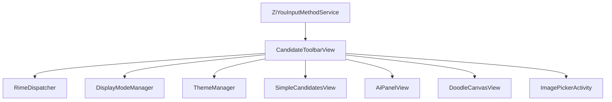
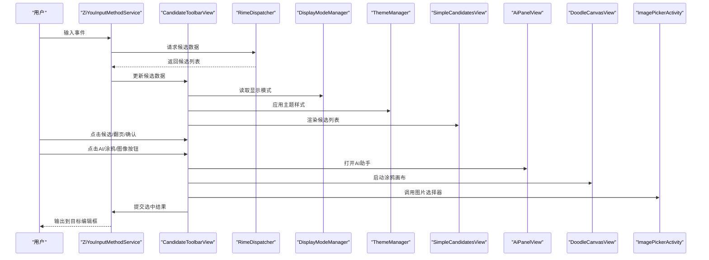
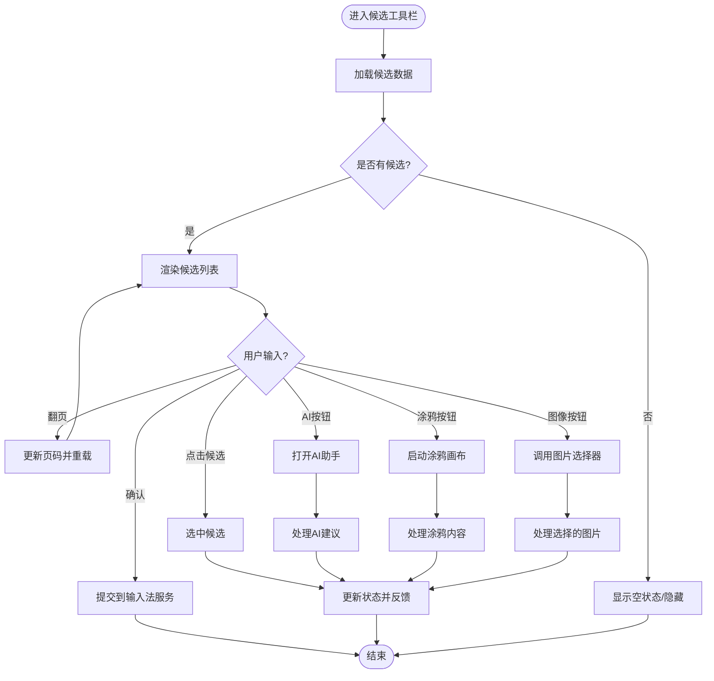
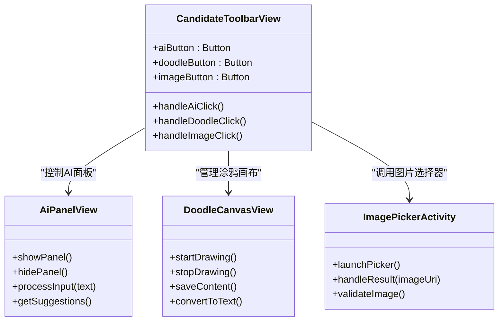
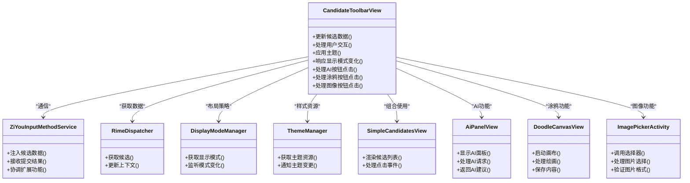

# 候选词工具栏视图 (CandidateToolbarView)

<cite>
**本文档引用的文件**   
- [CandidateToolbarView.kt](file://app/src/main/java/com/ziyou/ime/CandidateToolbarView.kt)
- [BaseKeyboardView.kt](file://app/src/main/java/com/ziyou/ime/BaseKeyboardView.kt)
- [ZiYouInputMethodService.kt](file://app/src/main/java/com/ziyou/ime/ZiYouInputMethodService.kt)
- [DisplayModeManager.kt](file://app/src/main/java/com/ziyou/ime/config/DisplayModeManager.kt)
- [ThemeManager.kt](file://app/src/main/java/com/ziyou/ime/config/ThemeManager.kt)
- [RimeDispatcher.kt](file://app/src/main/java/com/ziyou/ime/core/RimeDispatcher.kt)
- [SimpleCandidatesView.kt](file://app/src/main/java/com/ziyou/ime/SimpleCandidatesView.kt)
- [AiPanelView.kt](file://app/src/main/java/com/ziyou/ime/AiPanelView.kt)
- [DoodleCanvasView.kt](file://app/src/main/java/com/ziyou/ime/DoodleCanvasView.kt)
- [ImagePickerActivity.kt](file://app/src/main/java/com/ziyou/ime/ImagePickerActivity.kt)
</cite>

## 更新摘要
**所做更改**   
- 新增AI、涂鸦和图像按钮功能说明
- 更新候选词工具栏的扩展功能架构
- 添加新功能组件的详细分析
- 更新交互流程图以反映新的按钮功能

## 目录
1. [简介](#简介)
2. [项目结构](#项目结构)
3. [核心组件](#核心组件)
4. [架构总览](#架构总览)
5. [详细组件分析](#详细组件分析)
6. [新增功能详解](#新增功能详解)
7. [依赖分析](#依赖分析)
8. [性能考虑](#性能考虑)
9. [故障排查指南](#故障排查指南)
10. [结论](#结论)
11. [附录](#附录)

## 简介
本文件围绕输入法中的"候选词工具栏视图（CandidateToolbarView）"进行系统化文档化，涵盖其职责、与输入流程的交互、数据流、UI 渲染策略以及与主题和显示模式的集成。该视图负责在用户输入过程中展示候选词列表及快捷操作（如翻页、确认、撤销等），是输入法 UI 层的关键组成部分。

**更新** 现已增强支持AI助手、数字涂鸦和图像插入等扩展功能，为用户提供更丰富的输入体验。

## 项目结构
CandidateToolbarView 位于输入法模块的 ime 包中，属于 Android 自定义 View 层，向上与 InputMethodService 交互，向下通过 Rime 调度器获取候选数据，并受主题与显示模式管理器控制外观与布局行为。

图表来源
- [ZiYouInputMethodService.kt](file://app/src/main/java/com/ziyou/ime/ZiYouInputMethodService.kt)
- [CandidateToolbarView.kt](file://app/src/main/java/com/ziyou/ime/CandidateToolbarView.kt)
- [RimeDispatcher.kt](file://app/src/main/java/com/ziyou/ime/core/RimeDispatcher.kt)
- [DisplayModeManager.kt](file://app/src/main/java/com/ziyou/ime/config/DisplayModeManager.kt)
- [ThemeManager.kt](file://app/src/main/java/com/ziyou/ime/config/ThemeManager.kt)
- [SimpleCandidatesView.kt](file://app/src/main/java/com/ziyou/ime/SimpleCandidatesView.kt)
- [AiPanelView.kt](file://app/src/main/java/com/ziyou/ime/AiPanelView.kt)
- [DoodleCanvasView.kt](file://app/src/main/java/com/ziyou/ime/DoodleCanvasView.kt)
- [ImagePickerActivity.kt](file://app/src/main/java/com/ziyou/ime/ImagePickerActivity.kt)

章节来源
- [CandidateToolbarView.kt](file://app/src/main/java/com/ziyou/ime/CandidateToolbarView.kt)
- [ZiYouInputMethodService.kt](file://app/src/main/java/com/ziyou/ime/ZiYouInputMethodService.kt)

## 核心组件
- CandidateToolbarView：候选词工具栏视图，负责候选项展示、分页、选择与提交、以及工具栏按钮交互。
- BaseKeyboardView：键盘基类，提供与输入法服务的基础交互能力，CandidateToolbarView 通常与其协作或由其管理生命周期。
- ZiYouInputMethodService：输入法服务入口，协调 UI 视图与底层引擎（Rime）之间的消息与状态同步。
- RimeDispatcher：对 Rime 引擎的封装与调度，提供候选查询、上下文更新等接口。
- DisplayModeManager：管理显示模式（如横竖屏、面板展开/收起等），影响候选栏布局与可见性。
- ThemeManager：主题管理，统一颜色、字体、间距等视觉样式。
- SimpleCandidatesView：候选项的具体展示控件，CandidateToolbarView 可组合使用以承载候选列表。
- AiPanelView：AI助手面板，提供智能对话和建议功能。
- DoodleCanvasView：数字画布，支持手写涂鸦和图形绘制。
- ImagePickerActivity：图片选择器，允许用户从相册选择图片插入。

章节来源
- [CandidateToolbarView.kt](file://app/src/main/java/com/ziyou/ime/CandidateToolbarView.kt)
- [BaseKeyboardView.kt](file://app/src/main/java/com/ziyou/ime/BaseKeyboardView.kt)
- [ZiYouInputMethodService.kt](file://app/src/main/java/com/ziyou/ime/ZiYouInputMethodService.kt)
- [RimeDispatcher.kt](file://app/src/main/java/com/ziyou/ime/core/RimeDispatcher.kt)
- [DisplayModeManager.kt](file://app/src/main/java/com/ziyou/ime/config/DisplayModeManager.kt)
- [ThemeManager.kt](file://app/src/main/java/com/ziyou/ime/config/ThemeManager.kt)
- [SimpleCandidatesView.kt](file://app/src/main/java/com/ziyou/ime/SimpleCandidatesView.kt)
- [AiPanelView.kt](file://app/src/main/java/com/ziyou/ime/AiPanelView.kt)
- [DoodleCanvasView.kt](file://app/src/main/java/com/ziyou/ime/DoodleCanvasView.kt)
- [ImagePickerActivity.kt](file://app/src/main/java/com/ziyou/ime/ImagePickerActivity.kt)

## 架构总览
下图展示了候选词工具栏在输入法整体架构中的位置与关键交互路径：

图表来源
- [ZiYouInputMethodService.kt](file://app/src/main/java/com/ziyou/ime/ZiYouInputMethodService.kt)
- [CandidateToolbarView.kt](file://app/src/main/java/com/ziyou/ime/CandidateToolbarView.kt)
- [RimeDispatcher.kt](file://app/src/main/java/com/ziyou/ime/core/RimeDispatcher.kt)
- [DisplayModeManager.kt](file://app/src/main/java/com/ziyou/ime/config/DisplayModeManager.kt)
- [ThemeManager.kt](file://app/src/main/java/com/ziyou/ime/config/ThemeManager.kt)
- [SimpleCandidatesView.kt](file://app/src/main/java/com/ziyou/ime/SimpleCandidatesView.kt)
- [AiPanelView.kt](file://app/src/main/java/com/ziyou/ime/AiPanelView.kt)
- [DoodleCanvasView.kt](file://app/src/main/java/com/ziyou/ime/DoodleCanvasView.kt)
- [ImagePickerActivity.kt](file://app/src/main/java/com/ziyou/ime/ImagePickerActivity.kt)

## 详细组件分析

### CandidateToolbarView 组件分析
- 职责
  - 维护候选词集合与当前页码，支持左右翻页。
  - 处理用户点击候选项、确认键、撤销键等交互。
  - 根据显示模式与主题动态调整布局与样式。
  - 与输入法服务通信，提交最终选中的文本。
  - **新增** 管理AI助手、涂鸦画布和图像插入功能的触发与协调。
- 数据流
  - 从 RimeDispatcher 获取候选数据后，缓存并分发至 SimpleCandidatesView 渲染。
  - 监听显示模式变化，必要时重新计算布局与可见性。
  - 主题变更时刷新颜色、字体等视觉属性。
  - **新增** 协调AI面板、涂鸦画布和图片选择器的数据交换。
- 交互流程
  - 用户点击候选项 → 触发选中回调 → 调用输入法服务提交 → 清空或更新候选状态。
  - 翻页按钮 → 更新页码 → 重新加载对应页候选 → 重绘。
  - **新增** AI按钮 → 打开AI助手面板 → 处理AI建议 → 插入结果。
  - **新增** 涂鸦按钮 → 启动画布 → 接收手绘内容 → 转换为文本或图像。
  - **新增** 图像按钮 → 调用图片选择器 → 处理选择的图片 → 插入到输入框。
- 错误处理
  - 候选为空时的降级展示（隐藏或提示）。
  - 主题资源缺失时的回退默认样式。
  - 显示模式切换异常时的安全恢复逻辑。
  - **新增** AI服务不可用时的降级处理。
  - **新增** 涂鸦保存失败时的重试机制。
  - **新增** 图片选择权限被拒绝时的引导提示。

图表来源
- [CandidateToolbarView.kt](file://app/src/main/java/com/ziyou/ime/CandidateToolbarView.kt)
- [SimpleCandidatesView.kt](file://app/src/main/java/com/ziyou/ime/SimpleCandidatesView.kt)
- [AiPanelView.kt](file://app/src/main/java/com/ziyou/ime/AiPanelView.kt)
- [DoodleCanvasView.kt](file://app/src/main/java/com/ziyou/ime/DoodleCanvasView.kt)
- [ImagePickerActivity.kt](file://app/src/main/java/com/ziyou/ime/ImagePickerActivity.kt)

章节来源
- [CandidateToolbarView.kt](file://app/src/main/java/com/ziyou/ime/CandidateToolbarView.kt)
- [SimpleCandidatesView.kt](file://app/src/main/java/com/ziyou/ime/SimpleCandidatesView.kt)

### 与输入法服务的集成
- 作为 UI 层，CandidateToolbarView 不直接访问底层引擎，而是通过 ZiYouInputMethodService 暴露的接口进行数据交换。
- 服务负责将候选数据注入视图，并接收视图提交的最终结果。
- 视图的生命周期由服务统一管理，确保与输入法状态一致。
- **新增** 服务协调AI助手、涂鸦功能和图像插入的生命周期管理。

章节来源
- [ZiYouInputMethodService.kt](file://app/src/main/java/com/ziyou/ime/ZiYouInputMethodService.kt)
- [CandidateToolbarView.kt](file://app/src/main/java/com/ziyou/ime/CandidateToolbarView.kt)

### 与显示模式和主题的集成
- 显示模式管理器决定候选栏的布局策略（如横向滚动、网格排列、是否折叠）。
- 主题管理器提供统一的视觉资源，候选栏在初始化或主题变更时主动刷新样式。
- 当设备方向或窗口尺寸变化时，候选栏应响应并重新测量与绘制。
- **新增** 扩展功能按钮在不同显示模式下的自适应布局。

章节来源
- [DisplayModeManager.kt](file://app/src/main/java/com/ziyou/ime/config/DisplayModeManager.kt)
- [ThemeManager.kt](file://app/src/main/java/com/ziyou/ime/config/ThemeManager.kt)
- [CandidateToolbarView.kt](file://app/src/main/java/com/ziyou/ime/CandidateToolbarView.kt)

### 与候选列表控件的协作
- SimpleCandidatesView 承担具体的候选项绘制与点击事件分发。
- CandidateToolbarView 负责数据装配与分页控制，SimpleCandidatesView 专注 UI 表现。
- 两者通过回调或监听机制解耦，便于替换不同的候选展示实现。

章节来源
- [SimpleCandidatesView.kt](file://app/src/main/java/com/ziyou/ime/SimpleCandidatesView.kt)
- [CandidateToolbarView.kt](file://app/src/main/java/com/ziyou/ime/CandidateToolbarView.kt)

## 新增功能详解

### AI助手功能
- **功能描述**：集成AI助手面板，提供智能对话、文本建议和自动补全功能。
- **实现方式**：通过AiPanelView组件实现，支持自然语言处理和智能推荐。
- **用户体验**：点击AI按钮即可打开助手面板，输入问题或需求获取智能建议。
- **技术特点**：异步处理AI请求，支持离线和在线模式切换。

### 数字涂鸦功能
- **功能描述**：内置数字画布，支持手写输入、图形绘制和手势识别。
- **实现方式**：通过DoodleCanvasView组件实现，提供丰富的绘图工具和笔刷效果。
- **用户体验**：点击涂鸦按钮进入画布界面，完成后可转换为文本或图像插入。
- **技术特点**：支持多点触控、压力感应和撤销重做功能。

### 图像插入功能
- **功能描述**：允许用户从相册选择图片并插入到输入框中。
- **实现方式**：通过ImagePickerActivity组件实现，支持多种图片格式和大小限制。
- **用户体验**：点击图像按钮调用系统图片选择器，选择后自动插入。
- **技术特点**：支持图片压缩、裁剪和预览功能。

图表来源
- [CandidateToolbarView.kt](file://app/src/main/java/com/ziyou/ime/CandidateToolbarView.kt)
- [AiPanelView.kt](file://app/src/main/java/com/ziyou/ime/AiPanelView.kt)
- [DoodleCanvasView.kt](file://app/src/main/java/com/ziyou/ime/DoodleCanvasView.kt)
- [ImagePickerActivity.kt](file://app/src/main/java/com/ziyou/ime/ImagePickerActivity.kt)

章节来源
- [CandidateToolbarView.kt](file://app/src/main/java/com/ziyou/ime/CandidateToolbarView.kt)
- [AiPanelView.kt](file://app/src/main/java/com/ziyou/ime/AiPanelView.kt)
- [DoodleCanvasView.kt](file://app/src/main/java/com/ziyou/ime/DoodleCanvasView.kt)
- [ImagePickerActivity.kt](file://app/src/main/java/com/ziyou/ime/ImagePickerActivity.kt)

## 依赖分析
CandidateToolbarView 的依赖关系如下：

图表来源
- [CandidateToolbarView.kt](file://app/src/main/java/com/ziyou/ime/CandidateToolbarView.kt)
- [ZiYouInputMethodService.kt](file://app/src/main/java/com/ziyou/ime/ZiYouInputMethodService.kt)
- [RimeDispatcher.kt](file://app/src/main/java/com/ziyou/ime/core/RimeDispatcher.kt)
- [DisplayModeManager.kt](file://app/src/main/java/com/ziyou/ime/config/DisplayModeManager.kt)
- [ThemeManager.kt](file://app/src/main/java/com/ziyou/ime/config/ThemeManager.kt)
- [SimpleCandidatesView.kt](file://app/src/main/java/com/ziyou/ime/SimpleCandidatesView.kt)
- [AiPanelView.kt](file://app/src/main/java/com/ziyou/ime/AiPanelView.kt)
- [DoodleCanvasView.kt](file://app/src/main/java/com/ziyou/ime/DoodleCanvasView.kt)
- [ImagePickerActivity.kt](file://app/src/main/java/com/ziyou/ime/ImagePickerActivity.kt)

章节来源
- [CandidateToolbarView.kt](file://app/src/main/java/com/ziyou/ime/CandidateToolbarView.kt)

## 性能考虑
- 数据缓存：避免重复请求候选数据，合理设置缓存失效策略。
- 渲染优化：候选列表采用懒加载与分页，减少一次性绘制压力。
- 主题切换：批量更新样式，避免频繁重绘。
- 内存占用：及时释放不再使用的位图与临时对象，防止内存泄漏。
- 主线程阻塞：耗时操作（如网络或磁盘 IO）应在后台线程执行，并通过回调更新 UI。
- **新增** AI请求异步处理，避免阻塞主线程。
- **新增** 涂鸦画布内存管理，及时清理大图像数据。
- **新增** 图片选择优化，支持缩略图预览和大图延迟加载。

## 故障排查指南
- 候选为空
  - 检查 RimeDispatcher 是否正确返回候选数据。
  - 确认输入法上下文状态是否正常。
- 主题不生效
  - 验证 ThemeManager 是否成功加载资源。
  - 检查视图是否在主题变更后触发了刷新。
- 显示模式异常
  - 确认 DisplayModeManager 的状态监听是否注册。
  - 检查布局参数在模式切换时是否正确重置。
- 点击无响应
  - 校验 SimpleCandidatesView 的事件分发链。
  - 检查 CandidateToolbarView 的点击回调是否绑定。
- **新增** AI功能异常
  - 检查网络连接状态和AI服务可用性。
  - 验证AI面板的初始化和配置是否正确。
- **新增** 涂鸦功能问题
  - 确认画布权限和存储访问权限。
  - 检查涂鸦数据的序列化和反序列化。
- **新增** 图像插入失败
  - 验证图片选择权限和文件系统访问。
  - 检查图片格式支持和大小限制。

章节来源
- [CandidateToolbarView.kt](file://app/src/main/java/com/ziyou/ime/CandidateToolbarView.kt)
- [SimpleCandidatesView.kt](file://app/src/main/java/com/ziyou/ime/SimpleCandidatesView.kt)
- [ThemeManager.kt](file://app/src/main/java/com/ziyou/ime/config/ThemeManager.kt)
- [DisplayModeManager.kt](file://app/src/main/java/com/ziyou/ime/config/DisplayModeManager.kt)
- [RimeDispatcher.kt](file://app/src/main/java/com/ziyou/ime/core/RimeDispatcher.kt)
- [AiPanelView.kt](file://app/src/main/java/com/ziyou/ime/AiPanelView.kt)
- [DoodleCanvasView.kt](file://app/src/main/java/com/ziyou/ime/DoodleCanvasView.kt)
- [ImagePickerActivity.kt](file://app/src/main/java/com/ziyou/ime/ImagePickerActivity.kt)

## 结论
CandidateToolbarView 作为输入法候选词展示的核心 UI 组件，承担着数据装配、交互处理与样式适配等多重职责。通过与输入法服务、Rime 调度器、显示模式与主题管理器的协同工作，实现了稳定、高效且可扩展的候选词工具栏体验。

**更新** 新增的AI助手、数字涂鸦和图像插入功能进一步丰富了输入法的表达能力，为用户提供了更加智能化和多样化的输入体验。在实际使用中，建议重点关注数据缓存、渲染优化与错误恢复，以提升用户体验与系统稳定性。

## 附录
- 相关术语
  - 候选词：输入法根据输入序列预测的可能字词。
  - 工具栏：包含候选列表与快捷操作的 UI 区域。
  - 显示模式：横竖屏、面板展开/收起等布局策略。
  - 主题：统一的视觉风格与资源集合。
  - AI助手：基于人工智能的智能对话和建议系统。
  - 数字涂鸦：支持手写输入和图形绘制的数字画布功能。
  - 图像插入：从相册选择并插入图片的功能。

[本节为概念说明，无需引用具体文件]