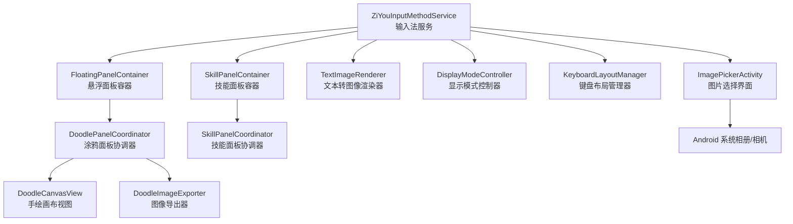
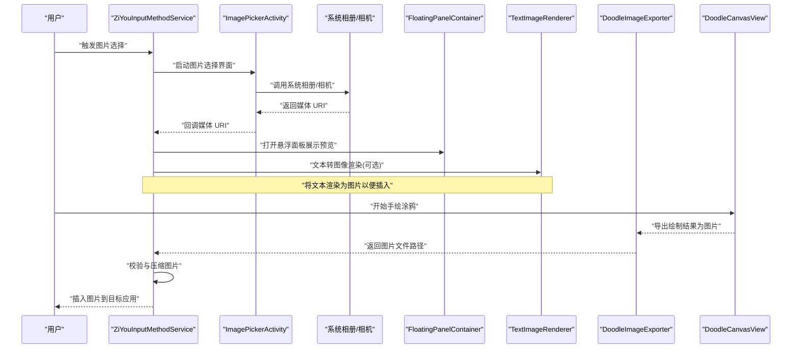
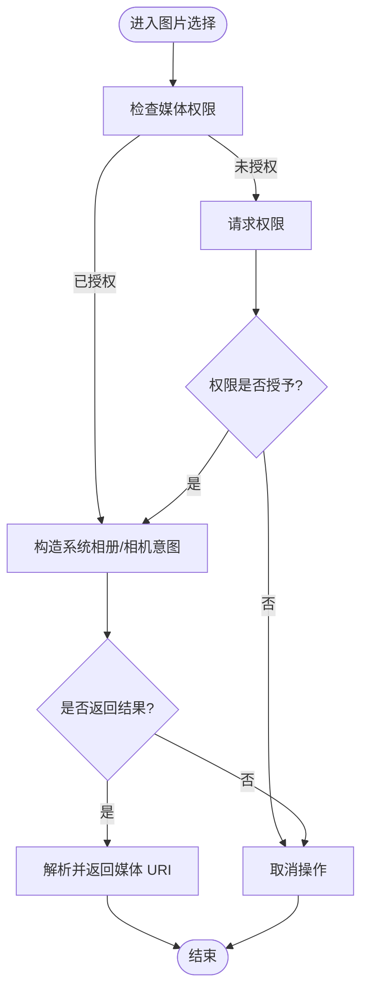
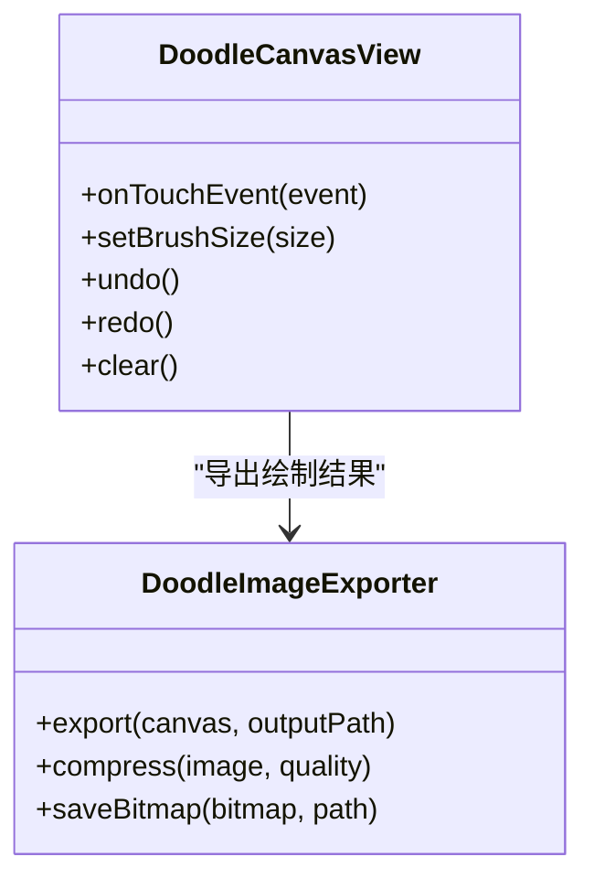
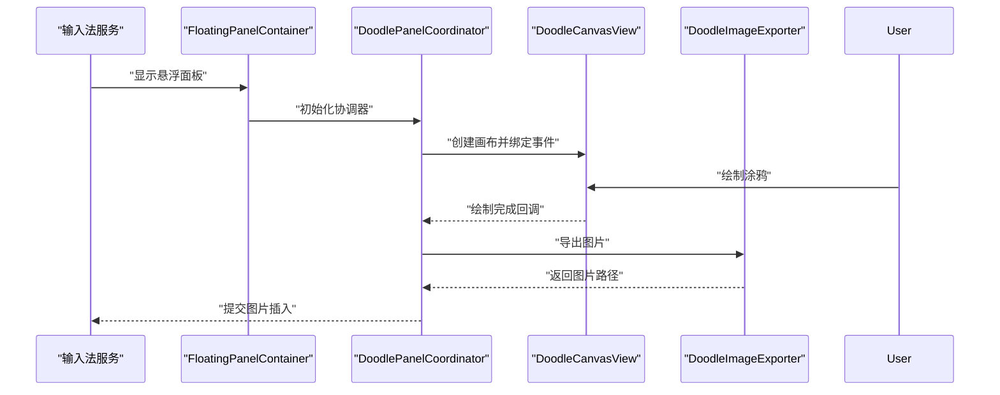
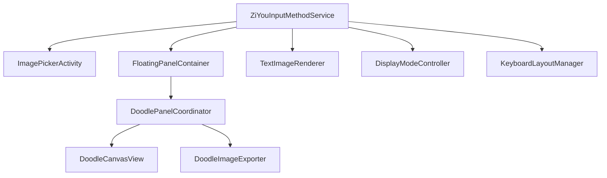

# 图片选择与媒体处理系统

<cite>
**本文引用的文件**   
- [ImagePickerActivity.kt](file://app/src/main/java/com/ziyou/ime/ime/ImagePickerActivity.kt)
- [DoodleCanvasView.kt](file://app/src/main/java/com/ziyou/ime/ime/DoodleCanvasView.kt)
- [DoodleImageExporter.kt](file://app/src/main/java/com/ziyou/ime/ime/DoodleImageExporter.kt)
- [DoodlePanelCoordinator.kt](file://app/src/main/java/com/ziyou/ime/ime/DoodlePanelCoordinator.kt)
- [FloatingPanelContainer.kt](file://app/src/main/java/com/ziyou/ime/ime/FloatingPanelContainer.kt)
- [SkillPanelContainer.kt](file://app/src/main/java/com/ziyou/ime/ime/SkillPanelContainer.kt)
- [SkillPanelCoordinator.kt](file://app/src/main/java/com/ziyou/ime/ime/SkillPanelCoordinator.kt)
- [ZiYouInputMethodService.kt](file://app/src/main/java/com/ziyou/ime/ime/ZiYouInputMethodService.kt)
- [TextImageRenderer.kt](file://app/src/main/java/com/ziyou/ime/ime/TextImageRenderer.kt)
- [DisplayModeController.kt](file://app/src/main/java/com/ziyou/ime/ime/DisplayModeController.kt)
- [DisplayMode.kt](file://app/src/main/java/com/ziyou/ime/ime/DisplayMode.kt)
- [KeyboardLayoutManager.kt](file://app/src/main/java/com/ziyou/ime/ime/KeyboardLayoutManager.kt)
- [IME 文件路径配置](file://app/src/main/res/xml/ime_file_paths.xml)
</cite>

## 目录
1. [简介](#简介)
2. [项目结构](#项目结构)
3. [核心组件](#核心组件)
4. [架构总览](#架构总览)
5. [详细组件分析](#详细组件分析)
6. [依赖关系分析](#依赖关系分析)
7. [性能考量](#性能考量)
8. [故障排查指南](#故障排查指南)
9. [结论](#结论)
10. [附录](#附录)

## 简介
本文件围绕输入法项目中的“图片选择与媒体处理系统”进行系统化文档化，覆盖从用户选择图片、手绘涂鸦、图像导出到在输入面板中渲染与展示的完整流程。该子系统与悬浮面板、技能面板、显示模式切换以及键盘布局管理协同工作，确保在 IME 环境中稳定、流畅地插入图片与媒体内容。

## 项目结构
与图片选择和媒体处理相关的代码主要位于 app 模块的 ime 包内，包括：
- 图片选择入口 Activity
- 手绘画布与导出工具
- 悬浮面板容器与协调器
- 文本转图像渲染器
- 显示模式控制器与枚举
- 键盘布局管理器
- IME 文件路径配置（用于媒体访问）

图表来源
- [ZiYouInputMethodService.kt](file://app/src/main/java/com/ziyou/ime/ime/ZiYouInputMethodService.kt)
- [FloatingPanelContainer.kt](file://app/src/main/java/com/ziyou/ime/ime/FloatingPanelContainer.kt)
- [SkillPanelContainer.kt](file://app/src/main/java/com/ziyou/ime/ime/SkillPanelContainer.kt)
- [DoodlePanelCoordinator.kt](file://app/src/main/java/com/ziyou/ime/ime/DoodlePanelCoordinator.kt)
- [DoodleCanvasView.kt](file://app/src/main/java/com/ziyou/ime/ime/DoodleCanvasView.kt)
- [DoodleImageExporter.kt](file://app/src/main/java/com/ziyou/ime/ime/DoodleImageExporter.kt)
- [TextImageRenderer.kt](file://app/src/main/java/com/ziyou/ime/ime/TextImageRenderer.kt)
- [DisplayModeController.kt](file://app/src/main/java/com/ziyou/ime/ime/DisplayModeController.kt)
- [KeyboardLayoutManager.kt](file://app/src/main/java/com/ziyou/ime/ime/KeyboardLayoutManager.kt)
- [ImagePickerActivity.kt](file://app/src/main/java/com/ziyou/ime/ime/ImagePickerActivity.kt)

章节来源
- [ZiYouInputMethodService.kt](file://app/src/main/java/com/ziyou/ime/ime/ZiYouInputMethodService.kt)
- [FloatingPanelContainer.kt](file://app/src/main/java/com/ziyou/ime/ime/FloatingPanelContainer.kt)
- [SkillPanelContainer.kt](file://app/src/main/java/com/ziyou/ime/ime/SkillPanelContainer.kt)
- [DoodlePanelCoordinator.kt](file://app/src/main/java/com/ziyou/ime/ime/DoodlePanelCoordinator.kt)
- [DoodleCanvasView.kt](file://app/src/main/java/com/ziyou/ime/ime/DoodleCanvasView.kt)
- [DoodleImageExporter.kt](file://app/src/main/java/com/ziyou/ime/ime/DoodleImageExporter.kt)
- [TextImageRenderer.kt](file://app/src/main/java/com/ziyou/ime/ime/TextImageRenderer.kt)
- [DisplayModeController.kt](file://app/src/main/java/com/ziyou/ime/ime/DisplayModeController.kt)
- [KeyboardLayoutManager.kt](file://app/src/main/java/com/ziyou/ime/ime/KeyboardLayoutManager.kt)
- [ImagePickerActivity.kt](file://app/src/main/java/com/ziyou/ime/ime/ImagePickerActivity.kt)

## 核心组件
- 图片选择入口：提供调用系统相册或相机的能力，并将选中的媒体资源返回给输入法服务进行处理与插入。
- 手绘画布与导出：支持用户在悬浮面板中进行涂鸦绘制，并可将绘制结果导出为图片文件供后续使用。
- 悬浮面板与技能面板：承载图片预览、涂鸦编辑、技能插件等交互区域，负责生命周期管理与事件分发。
- 文本转图像渲染：将文本内容渲染为位图，便于以图片形式插入目标应用。
- 显示模式控制：根据当前输入场景切换不同的显示模式，影响面板布局与行为。
- 键盘布局管理：在插入图片或媒体时调整键盘布局，避免遮挡与重叠。
- IME 文件路径配置：定义输入法可访问的文件路径策略，保障媒体文件的读取与写入权限。

章节来源
- [ImagePickerActivity.kt](file://app/src/main/java/com/ziyou/ime/ime/ImagePickerActivity.kt)
- [DoodleCanvasView.kt](file://app/src/main/java/com/ziyou/ime/ime/DoodleCanvasView.kt)
- [DoodleImageExporter.kt](file://app/src/main/java/com/ziyou/ime/ime/DoodleImageExporter.kt)
- [DoodlePanelCoordinator.kt](file://app/src/main/java/com/ziyou/ime/ime/DoodlePanelCoordinator.kt)
- [FloatingPanelContainer.kt](file://app/src/main/java/com/ziyou/ime/ime/FloatingPanelContainer.kt)
- [SkillPanelContainer.kt](file://app/src/main/java/com/ziyou/ime/ime/SkillPanelContainer.kt)
- [TextImageRenderer.kt](file://app/src/main/java/com/ziyou/ime/ime/TextImageRenderer.kt)
- [DisplayModeController.kt](file://app/src/main/java/com/ziyou/ime/ime/DisplayModeController.kt)
- [KeyboardLayoutManager.kt](file://app/src/main/java/com/ziyou/ime/ime/KeyboardLayoutManager.kt)
- [IME 文件路径配置](file://app/src/main/res/xml/ime_file_paths.xml)

## 架构总览
下图展示了图片选择与媒体处理的端到端流程：从用户触发图片选择，到系统返回媒体 URI，再到导入、渲染与插入目标应用；同时涵盖手绘涂鸦的绘制与导出流程。

图表来源
- [ZiYouInputMethodService.kt](file://app/src/main/java/com/ziyou/ime/ime/ZiYouInputMethodService.kt)
- [ImagePickerActivity.kt](file://app/src/main/java/com/ziyou/ime/ime/ImagePickerActivity.kt)
- [FloatingPanelContainer.kt](file://app/src/main/java/com/ziyou/ime/ime/FloatingPanelContainer.kt)
- [TextImageRenderer.kt](file://app/src/main/java/com/ziyou/ime/ime/TextImageRenderer.kt)
- [DoodleCanvasView.kt](file://app/src/main/java/com/ziyou/ime/ime/DoodleCanvasView.kt)
- [DoodleImageExporter.kt](file://app/src/main/java/com/ziyou/ime/ime/DoodleImageExporter.kt)

## 详细组件分析

### 图片选择入口（ImagePickerActivity）
- 职责：封装调用系统相册/相机的逻辑，接收媒体 URI 并通过回调返回给输入法服务。
- 关键点：
  - 权限检查与请求（存储/媒体访问）
  - 意图构造与结果回调处理
  - 错误处理（无可用应用、权限拒绝等）
- 典型调用链：输入法服务 -> 启动 Activity -> 系统媒体选择 -> 回调结果

图表来源
- [ImagePickerActivity.kt](file://app/src/main/java/com/ziyou/ime/ime/ImagePickerActivity.kt)

章节来源
- [ImagePickerActivity.kt](file://app/src/main/java/com/ziyou/ime/ime/ImagePickerActivity.kt)

### 手绘画布与导出（DoodleCanvasView 与 DoodleImageExporter）
- 职责：
  - DoodleCanvasView：提供触摸绘制、撤销/重做、画笔参数设置等功能。
  - DoodleImageExporter：将画布内容导出为图片文件，支持尺寸缩放与格式转换。
- 关键点：
  - 绘制事件处理与路径缓存
  - 导出时的内存管理与压缩策略
  - 异常处理（导出失败、IO 错误）

图表来源
- [DoodleCanvasView.kt](file://app/src/main/java/com/ziyou/ime/ime/DoodleCanvasView.kt)
- [DoodleImageExporter.kt](file://app/src/main/java/com/ziyou/ime/ime/DoodleImageExporter.kt)

章节来源
- [DoodleCanvasView.kt](file://app/src/main/java/com/ziyou/ime/ime/DoodleCanvasView.kt)
- [DoodleImageExporter.kt](file://app/src/main/java/com/ziyou/ime/ime/DoodleImageExporter.kt)

### 悬浮面板与协调器（FloatingPanelContainer 与 DoodlePanelCoordinator）
- 职责：
  - FloatingPanelContainer：管理悬浮面板的显示、隐藏、生命周期与事件转发。
  - DoodlePanelCoordinator：协调涂鸦面板与画布、导出器的交互，处理用户操作与状态同步。
- 关键点：
  - 面板可见性与焦点管理
  - 事件分发与回调机制
  - 与输入法服务的通信

图表来源
- [FloatingPanelContainer.kt](file://app/src/main/java/com/ziyou/ime/ime/FloatingPanelContainer.kt)
- [DoodlePanelCoordinator.kt](file://app/src/main/java/com/ziyou/ime/ime/DoodlePanelCoordinator.kt)
- [DoodleCanvasView.kt](file://app/src/main/java/com/ziyou/ime/ime/DoodleCanvasView.kt)
- [DoodleImageExporter.kt](file://app/src/main/java/com/ziyou/ime/ime/DoodleImageExporter.kt)

章节来源
- [FloatingPanelContainer.kt](file://app/src/main/java/com/ziyou/ime/ime/FloatingPanelContainer.kt)
- [DoodlePanelCoordinator.kt](file://app/src/main/java/com/ziyou/ime/ime/DoodlePanelCoordinator.kt)

### 技能面板与协调器（SkillPanelContainer 与 SkillPanelCoordinator）
- 职责：
  - SkillPanelContainer：管理技能插件面板的显示与生命周期。
  - SkillPanelCoordinator：协调技能面板与输入法服务之间的交互，处理插件事件。
- 关键点：
  - 插件加载与卸载
  - 事件桥接与回调
  - 与悬浮面板的共存与切换

章节来源
- [SkillPanelContainer.kt](file://app/src/main/java/com/ziyou/ime/ime/SkillPanelContainer.kt)
- [SkillPanelCoordinator.kt](file://app/src/main/java/com/ziyou/ime/ime/SkillPanelCoordinator.kt)

### 文本转图像渲染（TextImageRenderer）
- 职责：将文本内容渲染为位图，便于以图片形式插入目标应用。
- 关键点：
  - 字体与样式适配
  - 画布尺寸计算与裁剪
  - 输出格式与质量配置

章节来源
- [TextImageRenderer.kt](file://app/src/main/java/com/ziyou/ime/ime/TextImageRenderer.kt)

### 显示模式控制（DisplayModeController 与 DisplayMode）
- 职责：根据输入场景切换显示模式，影响面板布局与行为。
- 关键点：
  - 模式枚举定义
  - 模式切换逻辑与状态持久化
  - 与键盘布局管理的联动

章节来源
- [DisplayModeController.kt](file://app/src/main/java/com/ziyou/ime/ime/DisplayModeController.kt)
- [DisplayMode.kt](file://app/src/main/java/com/ziyou/ime/ime/DisplayMode.kt)

### 键盘布局管理（KeyboardLayoutManager）
- 职责：在插入图片或媒体时调整键盘布局，避免遮挡与重叠。
- 关键点：
  - 布局测量与重排
  - 动画过渡与用户体验优化
  - 与显示模式的协同

章节来源
- [KeyboardLayoutManager.kt](file://app/src/main/java/com/ziyou/ime/ime/KeyboardLayoutManager.kt)

## 依赖关系分析
图片选择与媒体处理子系统与输入法服务紧密耦合，通过悬浮面板和技能面板进行扩展。关键依赖如下：
- ImagePickerActivity 依赖 Android 系统媒体 API
- DoodleCanvasView 与 DoodleImageExporter 之间为内部协作关系
- FloatingPanelContainer 与 DoodlePanelCoordinator 共同管理悬浮面板生命周期
- TextImageRenderer 作为独立渲染工具被服务层调用
- DisplayModeController 与 KeyboardLayoutManager 协同影响 UI 布局

图表来源
- [ZiYouInputMethodService.kt](file://app/src/main/java/com/ziyou/ime/ime/ZiYouInputMethodService.kt)
- [ImagePickerActivity.kt](file://app/src/main/java/com/ziyou/ime/ime/ImagePickerActivity.kt)
- [FloatingPanelContainer.kt](file://app/src/main/java/com/ziyou/ime/ime/FloatingPanelContainer.kt)
- [DoodlePanelCoordinator.kt](file://app/src/main/java/com/ziyou/ime/ime/DoodlePanelCoordinator.kt)
- [DoodleCanvasView.kt](file://app/src/main/java/com/ziyou/ime/ime/DoodleCanvasView.kt)
- [DoodleImageExporter.kt](file://app/src/main/java/com/ziyou/ime/ime/DoodleImageExporter.kt)
- [TextImageRenderer.kt](file://app/src/main/java/com/ziyou/ime/ime/TextImageRenderer.kt)
- [DisplayModeController.kt](file://app/src/main/java/com/ziyou/ime/ime/DisplayModeController.kt)
- [KeyboardLayoutManager.kt](file://app/src/main/java/com/ziyou/ime/ime/KeyboardLayoutManager.kt)

章节来源
- [ZiYouInputMethodService.kt](file://app/src/main/java/com/ziyou/ime/ime/ZiYouInputMethodService.kt)
- [ImagePickerActivity.kt](file://app/src/main/java/com/ziyou/ime/ime/ImagePickerActivity.kt)
- [FloatingPanelContainer.kt](file://app/src/main/java/com/ziyou/ime/ime/FloatingPanelContainer.kt)
- [DoodlePanelCoordinator.kt](file://app/src/main/java/com/ziyou/ime/ime/DoodlePanelCoordinator.kt)
- [DoodleCanvasView.kt](file://app/src/main/java/com/ziyou/ime/ime/DoodleCanvasView.kt)
- [DoodleImageExporter.kt](file://app/src/main/java/com/ziyou/ime/ime/DoodleImageExporter.kt)
- [TextImageRenderer.kt](file://app/src/main/java/com/ziyou/ime/ime/TextImageRenderer.kt)
- [DisplayModeController.kt](file://app/src/main/java/com/ziyou/ime/ime/DisplayModeController.kt)
- [KeyboardLayoutManager.kt](file://app/src/main/java/com/ziyou/ime/ime/KeyboardLayoutManager.kt)

## 性能考量
- 图片压缩与缩放：在导出与插入前对大图进行压缩与缩放，减少内存占用与传输开销。
- 异步处理：媒体选择与导出应在后台线程执行，避免阻塞主线程。
- 资源释放：及时释放位图与临时文件，防止内存泄漏。
- 渲染优化：文本转图像时使用离屏渲染与缓存策略，提升重复渲染性能。
- 布局重绘：键盘布局调整时尽量减少重绘次数，使用平滑动画提升体验。

[本节为通用指导，不直接分析具体文件]

## 故障排查指南
- 权限问题：确认媒体访问权限已授予，必要时引导用户手动开启。
- 系统无可用应用：当系统相册或相机不可用时，提示用户安装或启用相关应用。
- 导出失败：检查存储空间与 IO 权限，确保导出路径有效且可写。
- 渲染异常：验证文本内容与字体可用性，检查画布尺寸与像素密度。
- 面板遮挡：调整悬浮面板位置与键盘布局，避免内容被遮挡。

章节来源
- [ImagePickerActivity.kt](file://app/src/main/java/com/ziyou/ime/ime/ImagePickerActivity.kt)
- [DoodleImageExporter.kt](file://app/src/main/java/com/ziyou/ime/ime/DoodleImageExporter.kt)
- [TextImageRenderer.kt](file://app/src/main/java/com/ziyou/ime/ime/TextImageRenderer.kt)
- [FloatingPanelContainer.kt](file://app/src/main/java/com/ziyou/ime/ime/FloatingPanelContainer.kt)
- [KeyboardLayoutManager.kt](file://app/src/main/java/com/ziyou/ime/ime/KeyboardLayoutManager.kt)

## 结论
图片选择与媒体处理系统在输入法框架中提供了完整的媒体插入能力，涵盖系统媒体选择、手绘涂鸦、图像渲染与导出、悬浮面板交互以及键盘布局管理。通过合理的组件划分与依赖管理，系统在功能完整性与用户体验方面达到了良好平衡。未来可进一步优化性能与错误处理，增强在不同设备与系统版本上的兼容性。

[本节为总结性内容，不直接分析具体文件]

## 附录
- IME 文件路径配置：用于定义输入法可访问的文件路径策略，确保媒体文件的读取与写入权限。

章节来源
- [IME 文件路径配置](file://app/src/main/res/xml/ime_file_paths.xml)