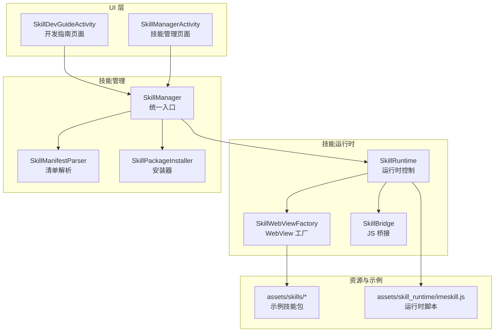
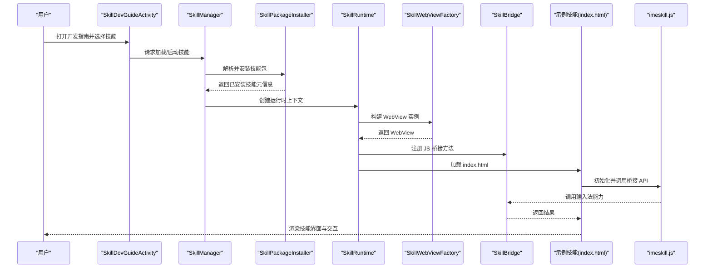
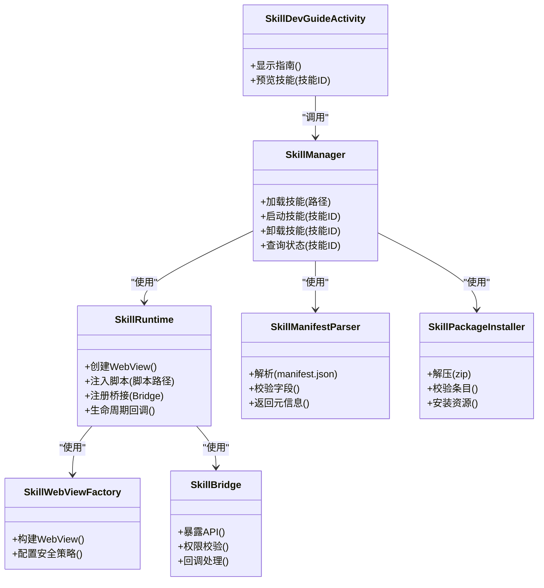

# 技能开发指南活动 (SkillDevGuideActivity)

<cite>
**本文引用的文件**   
- [SkillDevGuideActivity.kt](file://app/src/main/java/com/ziyou/ime/ui/SkillDevGuideActivity.kt)
- [SkillManager.kt](file://app/src/main/java/com/ziyou/ime/skill/SkillManager.kt)
- [SkillRuntime.kt](file://app/src/main/java/com/ziyou/ime/skill/SkillRuntime.kt)
- [SkillWebViewFactory.kt](file://app/src/main/java/com/ziyou/ime/skill/SkillWebViewFactory.kt)
- [SkillBridge.kt](file://app/src/main/java/com/ziyou/ime/skill/SkillBridge.kt)
- [SkillManifestParser.kt](file://app/src/main/java/com/ziyou/ime/skill/SkillManifestParser.kt)
- [SkillPackageInstaller.kt](file://app/src/main/java/com/ziyou/ime/skill/SkillPackageInstaller.kt)
- [SkillManagerActivity.kt](file://app/src/main/java/com/ziyou/ime/ui/SkillManagerActivity.kt)
- [manifest.json](file://app/src/main/assets/skills/calculator/manifest.json)
- [index.html](file://app/src/main/assets/skills/calculator/index.html)
- [imeskill.js](file://app/src/main/assets/skill_runtime/imeskill.js)
</cite>

## 目录
1. [简介](#简介)
2. [项目结构](#项目结构)
3. [核心组件](#核心组件)
4. [架构总览](#架构总览)
5. [详细组件分析](#详细组件分析)
6. [依赖关系分析](#依赖关系分析)
7. [性能考虑](#性能考虑)
8. [故障排查指南](#故障排查指南)
9. [结论](#结论)
10. [附录](#附录)

## 简介
本指南围绕“技能开发指南活动（SkillDevGuideActivity）”展开，面向输入法技能插件开发者。该活动用于展示技能开发流程、运行环境与调试要点，帮助开发者快速理解技能包结构、生命周期与桥接机制，并能在应用内直接预览和验证技能效果。文档从系统架构、数据流、关键类职责到常见问题排查进行分层说明，力求让非专业读者也能顺畅上手。

## 项目结构
与技能开发相关的代码主要分布在以下模块：
- UI 层：技能管理界面与开发指南页面
- 技能运行时：WebView 容器、JS 桥接、脚本注入
- 技能管理：清单解析、安装、版本比较、权限校验
- 资源与示例：内置技能包与运行时脚本

图表来源
- [SkillDevGuideActivity.kt](file://app/src/main/java/com/ziyou/ime/ui/SkillDevGuideActivity.kt)
- [SkillManagerActivity.kt](file://app/src/main/java/com/ziyou/ime/ui/SkillManagerActivity.kt)
- [SkillManager.kt](file://app/src/main/java/com/ziyou/ime/skill/SkillManager.kt)
- [SkillRuntime.kt](file://app/src/main/java/com/ziyou/ime/skill/SkillRuntime.kt)
- [SkillWebViewFactory.kt](file://app/src/main/java/com/ziyou/ime/skill/SkillWebViewFactory.kt)
- [SkillBridge.kt](file://app/src/main/java/com/ziyou/ime/skill/SkillBridge.kt)
- [SkillManifestParser.kt](file://app/src/main/java/com/ziyou/ime/skill/SkillManifestParser.kt)
- [SkillPackageInstaller.kt](file://app/src/main/java/com/ziyou/ime/skill/SkillPackageInstaller.kt)
- [manifest.json](file://app/src/main/assets/skills/calculator/manifest.json)
- [index.html](file://app/src/main/assets/skills/calculator/index.html)
- [imeskill.js](file://app/src/main/assets/skill_runtime/imeskill.js)

章节来源
- [SkillDevGuideActivity.kt](file://app/src/main/java/com/ziyou/ime/ui/SkillDevGuideActivity.kt)
- [SkillManager.kt](file://app/src/main/java/com/ziyou/ime/skill/SkillManager.kt)
- [SkillRuntime.kt](file://app/src/main/java/com/ziyou/ime/skill/SkillRuntime.kt)
- [SkillWebViewFactory.kt](file://app/src/main/java/com/ziyou/ime/skill/SkillWebViewFactory.kt)
- [SkillBridge.kt](file://app/src/main/java/com/ziyou/ime/skill/SkillBridge.kt)
- [SkillManifestParser.kt](file://app/src/main/java/com/ziyou/ime/skill/SkillManifestParser.kt)
- [SkillPackageInstaller.kt](file://app/src/main/java/com/ziyou/ime/skill/SkillPackageInstaller.kt)
- [SkillManagerActivity.kt](file://app/src/main/java/com/ziyou/ime/ui/SkillManagerActivity.kt)
- [manifest.json](file://app/src/main/assets/skills/calculator/manifest.json)
- [index.html](file://app/src/main/assets/skills/calculator/index.html)
- [imeskill.js](file://app/src/main/assets/skill_runtime/imeskill.js)

## 核心组件
- SkillDevGuideActivity：开发指南入口，提供技能开发流程说明、示例技能预览与调试提示。
- SkillManager：技能生命周期与能力聚合，负责加载、启动、卸载与状态查询。
- SkillRuntime：技能运行环境控制，创建 WebView、注入脚本、处理 JS 调用。
- SkillWebViewFactory：WebView 实例化与配置，设置安全策略、混合内容、缓存等。
- SkillBridge：JS 与 Kotlin 的桥接层，暴露输入法和系统能力给技能脚本。
- SkillManifestParser：解析 manifest.json，校验字段与权限。
- SkillPackageInstaller：技能包解压、校验与安装，生成可运行单元。

章节来源
- [SkillDevGuideActivity.kt](file://app/src/main/java/com/ziyou/ime/ui/SkillDevGuideActivity.kt)
- [SkillManager.kt](file://app/src/main/java/com/ziyou/ime/skill/SkillManager.kt)
- [SkillRuntime.kt](file://app/src/main/java/com/ziyou/ime/skill/SkillRuntime.kt)
- [SkillWebViewFactory.kt](file://app/src/main/java/com/ziyou/ime/skill/SkillWebViewFactory.kt)
- [SkillBridge.kt](file://app/src/main/java/com/ziyou/ime/skill/SkillBridge.kt)
- [SkillManifestParser.kt](file://app/src/main/java/com/ziyou/ime/skill/SkillManifestParser.kt)
- [SkillPackageInstaller.kt](file://app/src/main/java/com/ziyou/ime/skill/SkillPackageInstaller.kt)

## 架构总览
技能开发指南活动的整体交互如下：用户通过指南页面选择示例技能或自定义技能包，系统解析清单、安装技能、创建 WebView 并注入运行时脚本，随后在隔离环境中执行技能逻辑，并通过桥接层与输入法能力通信。

图表来源
- [SkillDevGuideActivity.kt](file://app/src/main/java/com/ziyou/ime/ui/SkillDevGuideActivity.kt)
- [SkillManager.kt](file://app/src/main/java/com/ziyou/ime/skill/SkillManager.kt)
- [SkillPackageInstaller.kt](file://app/src/main/java/com/ziyou/ime/skill/SkillPackageInstaller.kt)
- [SkillRuntime.kt](file://app/src/main/java/com/ziyou/ime/skill/SkillRuntime.kt)
- [SkillWebViewFactory.kt](file://app/src/main/java/com/ziyou/ime/skill/SkillWebViewFactory.kt)
- [SkillBridge.kt](file://app/src/main/java/com/ziyou/ime/skill/SkillBridge.kt)
- [index.html](file://app/src/main/assets/skills/calculator/index.html)
- [imeskill.js](file://app/src/main/assets/skill_runtime/imeskill.js)

## 详细组件分析

### SkillDevGuideActivity（开发指南活动）
- 职责：展示技能开发流程、示例技能列表、一键预览与调试提示；引导开发者完成技能包结构与清单编写。
- 交互：点击示例技能后，委托 SkillManager 启动对应技能；必要时跳转到 SkillManagerActivity 进行安装与管理。
- 关键点：
  - 使用 SkillManager 获取可用技能与状态
  - 将示例技能的 manifest.json 路径传递给安装器与运行时
  - 为开发者提供日志与错误提示入口

章节来源
- [SkillDevGuideActivity.kt](file://app/src/main/java/com/ziyou/ime/ui/SkillDevGuideActivity.kt)
- [SkillManager.kt](file://app/src/main/java/com/ziyou/ime/skill/SkillManager.kt)
- [SkillManagerActivity.kt](file://app/src/main/java/com/ziyou/ime/ui/SkillManagerActivity.kt)

### SkillManager（技能管理器）
- 职责：技能生命周期管理（加载、启动、停止、卸载）、状态查询、事件分发。
- 依赖：SkillPackageInstaller（安装）、SkillRuntime（运行）、SkillManifestParser（解析）。
- 关键点：
  - 维护技能实例映射与状态机
  - 协调安装与启动流程，确保依赖就绪
  - 对外暴露统一的启动接口供 UI 调用

章节来源
- [SkillManager.kt](file://app/src/main/java/com/ziyou/ime/skill/SkillManager.kt)
- [SkillPackageInstaller.kt](file://app/src/main/java/com/ziyou/ime/skill/SkillPackageInstaller.kt)
- [SkillRuntime.kt](file://app/src/main/java/com/ziyou/ime/skill/SkillRuntime.kt)
- [SkillManifestParser.kt](file://app/src/main/java/com/ziyou/ime/skill/SkillManifestParser.kt)

### SkillRuntime（运行时）
- 职责：创建 WebView、注入 imeskill.js、建立 JS 桥接、处理生命周期回调。
- 关键点：
  - 通过 SkillWebViewFactory 创建安全的 WebView
  - 向 JS 暴露输入法能力（如候选词、输入状态、剪贴板等）
  - 捕获异常并回传给上层以便调试

章节来源
- [SkillRuntime.kt](file://app/src/main/java/com/ziyou/ime/skill/SkillRuntime.kt)
- [SkillWebViewFactory.kt](file://app/src/main/java/com/ziyou/ime/skill/SkillWebViewFactory.kt)
- [SkillBridge.kt](file://app/src/main/java/com/ziyou/ime/skill/SkillBridge.kt)
- [imeskill.js](file://app/src/main/assets/skill_runtime/imeskill.js)

### SkillWebViewFactory（WebView 工厂）
- 职责：构造 WebView 实例，配置安全策略、混合内容、缓存、缩放与调试开关。
- 关键点：
  - 禁用不安全的默认行为，限制跨域访问
  - 根据开发模式开启远程调试
  - 为不同技能提供隔离的 WebView 配置

章节来源
- [SkillWebViewFactory.kt](file://app/src/main/java/com/ziyou/ime/skill/SkillWebViewFactory.kt)

### SkillBridge（JS 桥接）
- 职责：定义 JS 可调用的 Kotlin 方法，实现双向通信与权限校验。
- 关键点：
  - 方法命名规范与参数校验
  - 异步回调与错误码约定
  - 敏感能力的权限检查与白名单

章节来源
- [SkillBridge.kt](file://app/src/main/java/com/ziyou/ime/skill/SkillBridge.kt)

### SkillManifestParser（清单解析）
- 职责：解析 manifest.json，校验必填字段、版本号、权限声明与入口文件。
- 关键点：
  - 字段类型与格式校验
  - 版本兼容性与降级策略
  - 错误信息结构化输出

章节来源
- [SkillManifestParser.kt](file://app/src/main/java/com/ziyou/ime/skill/SkillManifestParser.kt)
- [manifest.json](file://app/src/main/assets/skills/calculator/manifest.json)

### SkillPackageInstaller（安装器）
- 职责：解压技能包、校验完整性、复制资源、生成安装元数据。
- 关键点：
  - ZIP 条目校验与白名单
  - 资源路径规范化与冲突检测
  - 安装失败的回滚与清理

章节来源
- [SkillPackageInstaller.kt](file://app/src/main/java/com/ziyou/ime/skill/SkillPackageInstaller.kt)

### 示例技能与资源
- 示例技能（calculator）：包含 index.html 与 manifest.json，演示基本结构与桥接调用。
- 运行时脚本（imeskill.js）：封装常用 API，简化技能开发。

章节来源
- [index.html](file://app/src/main/assets/skills/calculator/index.html)
- [manifest.json](file://app/src/main/assets/skills/calculator/manifest.json)
- [imeskill.js](file://app/src/main/assets/skill_runtime/imeskill.js)

## 依赖关系分析
技能相关模块之间的依赖关系如下：

图表来源
- [SkillDevGuideActivity.kt](file://app/src/main/java/com/ziyou/ime/ui/SkillDevGuideActivity.kt)
- [SkillManager.kt](file://app/src/main/java/com/ziyou/ime/skill/SkillManager.kt)
- [SkillRuntime.kt](file://app/src/main/java/com/ziyou/ime/skill/SkillRuntime.kt)
- [SkillWebViewFactory.kt](file://app/src/main/java/com/ziyou/ime/skill/SkillWebViewFactory.kt)
- [SkillBridge.kt](file://app/src/main/java/com/ziyou/ime/skill/SkillBridge.kt)
- [SkillManifestParser.kt](file://app/src/main/java/com/ziyou/ime/skill/SkillManifestParser.kt)
- [SkillPackageInstaller.kt](file://app/src/main/java/com/ziyou/ime/skill/SkillPackageInstaller.kt)

章节来源
- [SkillDevGuideActivity.kt](file://app/src/main/java/com/ziyou/ime/ui/SkillDevGuideActivity.kt)
- [SkillManager.kt](file://app/src/main/java/com/ziyou/ime/skill/SkillManager.kt)
- [SkillRuntime.kt](file://app/src/main/java/com/ziyou/ime/skill/SkillRuntime.kt)
- [SkillWebViewFactory.kt](file://app/src/main/java/com/ziyou/ime/skill/SkillWebViewFactory.kt)
- [SkillBridge.kt](file://app/src/main/java/com/ziyou/ime/skill/SkillBridge.kt)
- [SkillManifestParser.kt](file://app/src/main/java/com/ziyou/ime/skill/SkillManifestParser.kt)
- [SkillPackageInstaller.kt](file://app/src/main/java/com/ziyou/ime/skill/SkillPackageInstaller.kt)

## 性能考虑
- WebView 实例复用：避免频繁创建销毁，按需复用并合理释放资源。
- 资源加载优化：静态资源预缓存，按需懒加载，减少首屏时间。
- JS 桥接开销：批量调用与节流，避免高频同步阻塞。
- 内存管理：及时释放 WebView 与监听器，防止内存泄漏。
- 安装与解析：对大型技能包采用增量校验与并行解压。

[本节为通用指导，无需特定文件引用]

## 故障排查指南
- 清单解析失败：检查 manifest.json 字段类型、必填项与版本兼容性。
- WebView 无法加载：确认 index.html 路径正确、安全策略未阻断本地资源。
- JS 桥接无响应：核对方法名、权限声明与回调链路。
- 安装失败：查看 ZIP 条目白名单与资源冲突，检查磁盘空间与权限。
- 运行时崩溃：启用 WebView 远程调试，定位 JS 错误栈与原生异常。

章节来源
- [SkillManifestParser.kt](file://app/src/main/java/com/ziyou/ime/skill/SkillManifestParser.kt)
- [SkillWebViewFactory.kt](file://app/src/main/java/com/ziyou/ime/skill/SkillWebViewFactory.kt)
- [SkillBridge.kt](file://app/src/main/java/com/ziyou/ime/skill/SkillBridge.kt)
- [SkillPackageInstaller.kt](file://app/src/main/java/com/ziyou/ime/skill/SkillPackageInstaller.kt)
- [SkillRuntime.kt](file://app/src/main/java/com/ziyou/ime/skill/SkillRuntime.kt)

## 结论
SkillDevGuideActivity 作为技能开发的入口与教学界面，串联了清单解析、安装、运行时与桥接等关键环节。通过清晰的职责划分与模块化设计，开发者可以快速理解技能生命周期与扩展点，并在应用内高效验证与调试。建议遵循清单规范、合理使用桥接 API，并注意性能与内存管理，以获得稳定流畅的技能体验。

[本节为总结性内容，无需特定文件引用]

## 附录
- 技能包结构建议：
  - manifest.json：描述名称、版本、权限、入口文件等
  - index.html：技能主界面与交互逻辑
  - 其他资源：样式、图片、脚本等
- 开发流程建议：
  - 编写 manifest.json 与 index.html
  - 使用 SkillDevGuideActivity 预览与调试
  - 通过 SkillBridge 调用输入法能力
  - 打包为 ZIP 并进行安装测试

[本节为补充说明，无需特定文件引用]