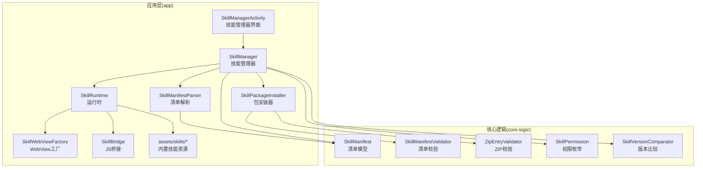
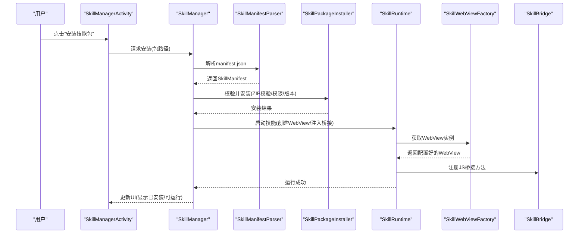
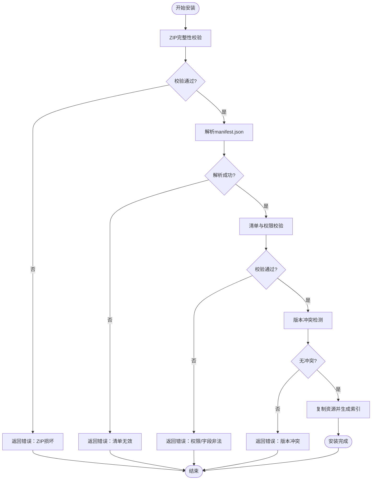
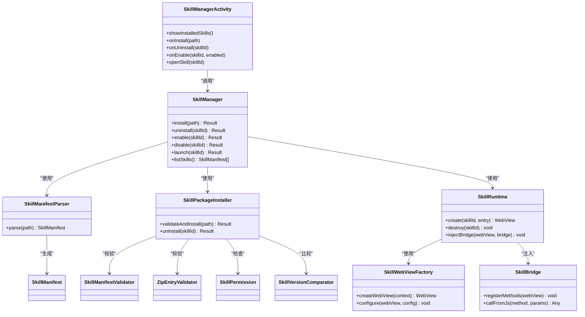

# 技能管理器界面

<cite>
**本文引用的文件**   
- [SkillManagerActivity.kt](file://app/src/main/java/com/ziyou/ime/ui/SkillManagerActivity.kt)
- [SkillManager.kt](file://app/src/main/java/com/ziyou/ime/skill/SkillManager.kt)
- [SkillManifestParser.kt](file://app/src/main/java/com/ziyou/ime/skill/SkillManifestParser.kt)
- [SkillPackageInstaller.kt](file://app/src/main/java/com/ziyou/ime/skill/SkillPackageInstaller.kt)
- [SkillRuntime.kt](file://app/src/main/java/com/ziyou/ime/skill/SkillRuntime.kt)
- [SkillWebViewFactory.kt](file://app/src/main/java/com/ziyou/ime/skill/SkillWebViewFactory.kt)
- [SkillBridge.kt](file://app/src/main/java/com/ziyou/ime/skill/SkillBridge.kt)
- [SkillManifest.kt](file://core-logic/src/main/java/com/ziyou/ime/core/skill/SkillManifest.kt)
- [SkillManifestValidator.kt](file://core-logic/src/main/java/com/ziyou/ime/core/skill/SkillManifestValidator.kt)
- [ZipEntryValidator.kt](file://core-logic/src/main/java/com/ziyou/ime/core/skill/ZipEntryValidator.kt)
- [SkillPermission.kt](file://core-logic/src/main/java/com/ziyou/ime/core/skill/SkillPermission.kt)
- [SkillVersionComparator.kt](file://core-logic/src/main/java/com/ziyou/ime/core/skill/SkillVersionComparator.kt)
- [manifest.json](file://app/src/main/assets/skills/calculator/manifest.json)
- [index.html](file://app/src/main/assets/skills/calculator/index.html)
</cite>

## 目录
1. [简介](#简介)
2. [项目结构](#项目结构)
3. [核心组件](#核心组件)
4. [架构总览](#架构总览)
5. [详细组件分析](#详细组件分析)
6. [依赖关系分析](#依赖关系分析)
7. [性能考虑](#性能考虑)
8. [故障排查指南](#故障排查指南)
9. [结论](#结论)
10. [附录](#附录)

## 简介
本文件围绕“技能管理器界面”展开，聚焦于输入法应用中“技能（插件）”的展示、安装、卸载、启停与运行管理。该能力由 UI 层 Activity 驱动，通过技能管理器协调清单解析、包安装校验、运行时容器创建与桥接通信，最终在 WebView 中加载并执行技能页面资源。文档从系统架构、数据流、处理逻辑、集成点与错误处理等维度进行系统化说明，并提供可视化图示帮助理解。

## 项目结构
技能管理器相关代码主要分布在以下模块：
- app 模块
  - ui: 技能管理器界面入口 Activity
  - skill: 技能生命周期、清单解析、安装包校验、运行时与 WebView 工厂、JS 桥接
  - assets/skills: 内置技能示例（如计算器、天气、引语）及其 manifest 与页面资源
- core-logic 模块
  - core/skill: 技能清单模型、清单校验器、权限定义、版本比较器、ZIP 条目校验器等通用能力

图表来源
- [SkillManagerActivity.kt](file://app/src/main/java/com/ziyou/ime/ui/SkillManagerActivity.kt)
- [SkillManager.kt](file://app/src/main/java/com/ziyou/ime/skill/SkillManager.kt)
- [SkillManifestParser.kt](file://app/src/main/java/com/ziyou/ime/skill/SkillManifestParser.kt)
- [SkillPackageInstaller.kt](file://app/src/main/java/com/ziyou/ime/skill/SkillPackageInstaller.kt)
- [SkillRuntime.kt](file://app/src/main/java/com/ziyou/ime/skill/SkillRuntime.kt)
- [SkillWebViewFactory.kt](file://app/src/main/java/com/ziyou/ime/skill/SkillWebViewFactory.kt)
- [SkillBridge.kt](file://app/src/main/java/com/ziyou/ime/skill/SkillBridge.kt)
- [SkillManifest.kt](file://core-logic/src/main/java/com/ziyou/ime/core/skill/SkillManifest.kt)
- [SkillManifestValidator.kt](file://core-logic/src/main/java/com/ziyou/ime/core/skill/SkillManifestValidator.kt)
- [ZipEntryValidator.kt](file://core-logic/src/main/java/com/ziyou/ime/core/skill/ZipEntryValidator.kt)
- [SkillPermission.kt](file://core-logic/src/main/java/com/ziyou/ime/core/skill/SkillPermission.kt)
- [SkillVersionComparator.kt](file://core-logic/src/main/java/com/ziyou/ime/core/skill/SkillVersionComparator.kt)
- [manifest.json](file://app/src/main/assets/skills/calculator/manifest.json)
- [index.html](file://app/src/main/assets/skills/calculator/index.html)

章节来源
- [SkillManagerActivity.kt](file://app/src/main/java/com/ziyou/ime/ui/SkillManagerActivity.kt)
- [SkillManager.kt](file://app/src/main/java/com/ziyou/ime/skill/SkillManager.kt)
- [SkillManifestParser.kt](file://app/src/main/java/com/ziyou/ime/skill/SkillManifestParser.kt)
- [SkillPackageInstaller.kt](file://app/src/main/java/com/ziyou/ime/skill/SkillPackageInstaller.kt)
- [SkillRuntime.kt](file://app/src/main/java/com/ziyou/ime/skill/SkillRuntime.kt)
- [SkillWebViewFactory.kt](file://app/src/main/java/com/ziyou/ime/skill/SkillWebViewFactory.kt)
- [SkillBridge.kt](file://app/src/main/java/com/ziyou/ime/skill/SkillBridge.kt)
- [SkillManifest.kt](file://core-logic/src/main/java/com/ziyou/ime/core/skill/SkillManifest.kt)
- [SkillManifestValidator.kt](file://core-logic/src/main/java/com/ziyou/ime/core/skill/SkillManifestValidator.kt)
- [ZipEntryValidator.kt](file://core-logic/src/main/java/com/ziyou/ime/core/skill/SipEntryValidator.kt)
- [SkillPermission.kt](file://core-logic/src/main/java/com/ziyou/ime/core/skill/SkillPermission.kt)
- [SkillVersionComparator.kt](file://core-logic/src/main/java/com/ziyou/ime/core/skill/SkillVersionComparator.kt)
- [manifest.json](file://app/src/main/assets/skills/calculator/manifest.json)
- [index.html](file://app/src/main/assets/skills/calculator/index.html)

## 核心组件
- 技能管理器界面（Activity）
  - 职责：提供用户操作入口，展示已安装技能列表，支持安装、卸载、启用/禁用、打开技能页面等操作；负责与 SkillManager 交互并更新 UI。
- 技能管理器（SkillManager）
  - 职责：统一编排技能的生命周期与状态，协调清单解析、包安装、运行时创建与销毁、JS 桥接注入等。
- 清单解析器（SkillManifestParser）
  - 职责：读取技能的 manifest.json，构建 SkillManifest 对象，供后续校验与展示使用。
- 包安装器（SkillPackageInstaller）
  - 职责：对技能包进行 ZIP 校验、清单校验、权限检查、版本对比与安装/卸载流程控制。
- 运行时（SkillRuntime）
  - 职责：为每个技能创建独立的 WebView 容器，注入 JS 桥接，管理页面加载与生命周期回调。
- WebView 工厂（SkillWebViewFactory）
  - 职责：封装 WebView 实例化、安全配置、缓存策略与资源路径设置。
- JS 桥接（SkillBridge）
  - 职责：在 WebView 与 Android 之间建立双向通信通道，暴露输入法和系统能力给技能侧调用。

章节来源
- [SkillManagerActivity.kt](file://app/src/main/java/com/ziyou/ime/ui/SkillManagerActivity.kt)
- [SkillManager.kt](file://app/src/main/java/com/ziyou/ime/skill/SkillManager.kt)
- [SkillManifestParser.kt](file://app/src/main/java/com/ziyou/ime/skill/SkillManifestParser.kt)
- [SkillPackageInstaller.kt](file://app/src/main/java/com/ziyou/ime/skill/SkillPackageInstaller.kt)
- [SkillRuntime.kt](file://app/src/main/java/com/ziyou/ime/skill/SkillRuntime.kt)
- [SkillWebViewFactory.kt](file://app/src/main/java/com/ziyou/ime/skill/SkillWebViewFactory.kt)
- [SkillBridge.kt](file://app/src/main/java/com/ziyou/ime/skill/SkillBridge.kt)

## 架构总览
技能管理器界面采用分层协作模式：UI 层仅负责交互与展示，业务编排集中在 SkillManager，数据与规则集中在 core-logic 的 skill 子模块，运行时以 WebView 为载体承载技能页面。

图表来源
- [SkillManagerActivity.kt](file://app/src/main/java/com/ziyou/ime/ui/SkillManagerActivity.kt)
- [SkillManager.kt](file://app/src/main/java/com/ziyou/ime/skill/SkillManager.kt)
- [SkillManifestParser.kt](file://app/src/main/java/com/ziyou/ime/skill/SkillManifestParser.kt)
- [SkillPackageInstaller.kt](file://app/src/main/java/com/ziyou/ime/skill/SkillPackageInstaller.kt)
- [SkillRuntime.kt](file://app/src/main/java/com/ziyou/ime/skill/SkillRuntime.kt)
- [SkillWebViewFactory.kt](file://app/src/main/java/com/ziyou/ime/skill/SkillWebViewFactory.kt)
- [SkillBridge.kt](file://app/src/main/java/com/ziyou/ime/skill/SkillBridge.kt)

## 详细组件分析

### 技能管理器界面（SkillManagerActivity）
- 功能要点
  - 展示技能列表（名称、版本、描述、是否启用）。
  - 触发安装/卸载、启用/禁用、打开技能页面等操作。
  - 监听 SkillManager 的状态变化并刷新 UI。
- 关键交互
  - 安装：选择技能包 -> 调用 SkillManager.install() -> 更新列表。
  - 卸载：长按或菜单项 -> 调用 SkillManager.uninstall() -> 清理运行时。
  - 启用/禁用：切换开关 -> 调用 SkillManager.enable()/disable()。
  - 打开页面：点击卡片 -> 调用 SkillRuntime.launch(skillId)。
- 错误处理
  - 无可用技能包时提示。
  - 安装失败回滚状态并提示原因（校验失败、权限不足、版本冲突等）。

章节来源
- [SkillManagerActivity.kt](file://app/src/main/java/com/ziyou/ime/ui/SkillManagerActivity.kt)

### 技能管理器（SkillManager）
- 职责边界
  - 维护技能元数据与状态（已安装、启用、运行中）。
  - 编排安装、卸载、启停、打开流程。
  - 协调解析、校验、运行时创建与桥接注入。
- 数据结构
  - 技能集合：按 skillId 索引，便于快速查找与状态管理。
  - 运行时映射：skillId -> Runtime 实例，避免重复创建。
- 并发与线程
  - 解析与校验在后台线程执行，UI 更新在主线程。
  - 运行时创建与页面加载遵循 WebView 主线程约束。

章节来源
- [SkillManager.kt](file://app/src/main/java/com/ziyou/ime/skill/SkillManager.kt)

### 清单解析器（SkillManifestParser）
- 输入：技能目录或包中的 manifest.json
- 输出：SkillManifest 对象（包含 id、name、version、permissions、entry 等）
- 异常处理：格式错误、必填字段缺失、类型不匹配等抛出明确错误信息

章节来源
- [SkillManifestParser.kt](file://app/src/main/java/com/ziyou/ime/skill/SkillManifestParser.kt)
- [SkillManifest.kt](file://core-logic/src/main/java/com/ziyou/ime/core/skill/SkillManifest.kt)

### 包安装器（SkillPackageInstaller）
- 校验流程
  - ZIP 完整性校验（ZipEntryValidator）
  - 清单合法性校验（SkillManifestValidator）
  - 权限白名单校验（SkillPermission）
  - 版本冲突检测（SkillVersionComparator）
- 安装动作
  - 复制资源到目标目录
  - 生成索引与缓存
  - 记录安装时间与版本信息

图表来源
- [SkillPackageInstaller.kt](file://app/src/main/java/com/ziyou/ime/skill/SkillPackageInstaller.kt)
- [ZipEntryValidator.kt](file://core-logic/src/main/java/com/ziyou/ime/core/skill/ZipEntryValidator.kt)
- [SkillManifestValidator.kt](file://core-logic/src/main/java/com/ziyou/ime/core/skill/SkillManifestValidator.kt)
- [SkillPermission.kt](file://core-logic/src/main/java/com/ziyou/ime/core/skill/SkillPermission.kt)
- [SkillVersionComparator.kt](file://core-logic/src/main/java/com/ziyou/ime/core/skill/SkillVersionComparator.kt)

章节来源
- [SkillPackageInstaller.kt](file://app/src/main/java/com/ziyou/ime/skill/SkillPackageInstaller.kt)
- [ZipEntryValidator.kt](file://core-logic/src/main/java/com/ziyou/ime/core/skill/ZipEntryValidator.kt)
- [SkillManifestValidator.kt](file://core-logic/src/main/java/com/ziyou/ime/core/skill/SkillManifestValidator.kt)
- [SkillPermission.kt](file://core-logic/src/main/java/com/ziyou/ime/core/skill/SkillPermission.kt)
- [SkillVersionComparator.kt](file://core-logic/src/main/java/com/ziyou/ime/core/skill/SkillVersionComparator.kt)

### 运行时（SkillRuntime）与 WebView 工厂（SkillWebViewFactory）
- 运行时职责
  - 为每个技能创建独立 WebView 容器
  - 注入 SkillBridge，暴露 API 给技能侧
  - 管理页面加载、生命周期回调、内存释放
- WebView 工厂职责
  - 统一配置 WebView 安全选项（JavaScript、文件访问、混合内容策略）
  - 设置缓存策略与资源根路径（assets/skills/<id>/）
  - 提供复用与销毁策略

章节来源
- [SkillRuntime.kt](file://app/src/main/java/com/ziyou/ime/skill/SkillRuntime.kt)
- [SkillWebViewFactory.kt](file://app/src/main/java/com/ziyou/ime/skill/SkillWebViewFactory.kt)

### JS 桥接（SkillBridge）
- 作用
  - 在 WebView 与 Android 之间建立双向通信
  - 向技能侧暴露输入法能力（如候选词、键盘事件、剪贴板）
  - 接收技能侧请求（如提交文本、查询系统信息）
- 设计要点
  - 方法命名空间隔离，避免冲突
  - 参数校验与异常捕获，防止崩溃
  - 异步回调与线程切换，保证 UI 流畅

章节来源
- [SkillBridge.kt](file://app/src/main/java/com/ziyou/ime/skill/SkillBridge.kt)

### 技能资源与清单示例（计算器）
- 清单文件：manifest.json
  - 定义技能标识、名称、版本、权限、入口页等
- 入口页面：index.html
  - 通过 SkillBridge 调用输入法能力，实现计算与输入

章节来源
- [manifest.json](file://app/src/main/assets/skills/calculator/manifest.json)
- [index.html](file://app/src/main/assets/skills/calculator/index.html)

## 依赖关系分析
- 组件耦合
  - SkillManagerActivity 仅依赖 SkillManager，保持 UI 与业务解耦
  - SkillManager 聚合解析、安装、运行时等子模块，承担编排职责
  - core-logic 提供纯逻辑与校验能力，无 Android 平台耦合
- 外部依赖
  - WebView 作为技能运行载体
  - JSON 解析库用于清单读取
  - ZIP 工具类用于包校验

图表来源
- [SkillManagerActivity.kt](file://app/src/main/java/com/ziyou/ime/ui/SkillManagerActivity.kt)
- [SkillManager.kt](file://app/src/main/java/com/ziyou/ime/skill/SkillManager.kt)
- [SkillManifestParser.kt](file://app/src/main/java/com/ziyou/ime/skill/SkillManifestParser.kt)
- [SkillPackageInstaller.kt](file://app/src/main/java/com/ziyou/ime/skill/SkillPackageInstaller.kt)
- [SkillRuntime.kt](file://app/src/main/java/com/ziyou/ime/skill/SkillRuntime.kt)
- [SkillWebViewFactory.kt](file://app/src/main/java/com/ziyou/ime/skill/SkillWebViewFactory.kt)
- [SkillBridge.kt](file://app/src/main/java/com/ziyou/ime/skill/SkillBridge.kt)
- [SkillManifest.kt](file://core-logic/src/main/java/com/ziyou/ime/core/skill/SkillManifest.kt)
- [SkillManifestValidator.kt](file://core-logic/src/main/java/com/ziyou/ime/core/skill/SkillManifestValidator.kt)
- [ZipEntryValidator.kt](file://core-logic/src/main/java/com/ziyou/ime/core/skill/ZipEntryValidator.kt)
- [SkillPermission.kt](file://core-logic/src/main/java/com/ziyou/ime/core/skill/SkillPermission.kt)
- [SkillVersionComparator.kt](file://core-logic/src/main/java/com/ziyou/ime/core/skill/SkillVersionComparator.kt)

章节来源
- [SkillManager.kt](file://app/src/main/java/com/ziyou/ime/skill/SkillManager.kt)
- [SkillManifestParser.kt](file://app/src/main/java/com/ziyou/ime/skill/SkillManifestParser.kt)
- [SkillPackageInstaller.kt](file://app/src/main/java/com/ziyou/ime/skill/SkillPackageInstaller.kt)
- [SkillRuntime.kt](file://app/src/main/java/com/ziyou/ime/skill/SkillRuntime.kt)
- [SkillWebViewFactory.kt](file://app/src/main/java/com/ziyou/ime/skill/SkillWebViewFactory.kt)
- [SkillBridge.kt](file://app/src/main/java/com/ziyou/ime/skill/SkillBridge.kt)
- [SkillManifest.kt](file://core-logic/src/main/java/com/ziyou/ime/core/skill/SkillManifest.kt)
- [SkillManifestValidator.kt](file://core-logic/src/main/java/com/ziyou/ime/core/skill/SkillManifestValidator.kt)
- [ZipEntryValidator.kt](file://core-logic/src/main/java/com/ziyou/ime/core/skill/ZipEntryValidator.kt)
- [SkillPermission.kt](file://core-logic/src/main/java/com/ziyou/ime/core/skill/SkillPermission.kt)
- [SkillVersionComparator.kt](file://core-logic/src/main/java/com/ziyou/ime/core/skill/SkillVersionComparator.kt)

## 性能考虑
- 解析与校验
  - 大清单或复杂 ZIP 应在后台线程执行，避免阻塞 UI
  - 增量校验：仅对变更部分重新校验
- WebView 管理
  - 复用 WebView 实例，减少创建开销
  - 合理设置缓存策略，降低网络与磁盘 IO
  - 及时销毁不再使用的 WebView，释放内存
- 桥接通信
  - 批量消息合并，减少跨进程调用次数
  - 异步回调，避免阻塞主线程

[本节为通用指导，不直接分析具体文件]

## 故障排查指南
- 安装失败
  - 检查 ZIP 完整性与清单格式是否正确
  - 确认权限声明是否符合白名单
  - 查看版本冲突日志，必要时降级或升级
- 运行时崩溃
  - 检查 WebView 配置与安全策略
  - 验证 JS 桥接方法是否存在与参数类型
  - 观察内存占用与泄漏情况
- 页面无法加载
  - 核对入口路径与资源目录结构
  - 确认 assets 资源未被混淆或移除
  - 检查网络与混合内容策略限制

章节来源
- [SkillPackageInstaller.kt](file://app/src/main/java/com/ziyou/ime/skill/SkillPackageInstaller.kt)
- [SkillRuntime.kt](file://app/src/main/java/com/ziyou/ime/skill/SkillRuntime.kt)
- [SkillWebViewFactory.kt](file://app/src/main/java/com/ziyou/ime/skill/SkillWebViewFactory.kt)
- [SkillBridge.kt](file://app/src/main/java/com/ziyou/ime/skill/SkillBridge.kt)

## 结论
技能管理器界面通过清晰的职责划分与模块化设计，实现了技能的全生命周期管理与安全的 WebView 运行环境。UI 层专注交互，SkillManager 统筹编排，core-logic 提供稳定可靠的校验与规则。未来可在性能优化、错误诊断与开发者体验方面持续改进，以提升整体稳定性与易用性。

[本节为总结性内容，不直接分析具体文件]

## 附录
- 术语表
  - 技能：基于 Web 技术的扩展能力，通过 manifest 描述并在 WebView 中运行
  - 清单：描述技能元数据与权限的配置文件
  - 桥接：WebView 与 Android 之间的通信机制
- 参考资源
  - 内置技能示例位于 assets/skills 目录
  - 核心逻辑位于 core-logic 模块的 skill 子包

[本节为补充信息，不直接分析具体文件]