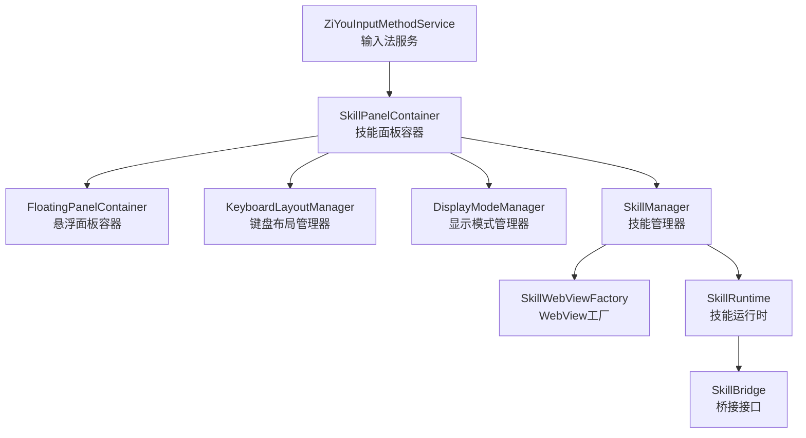
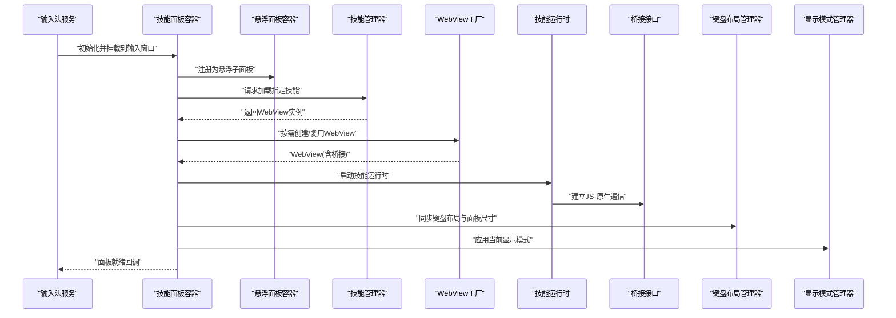
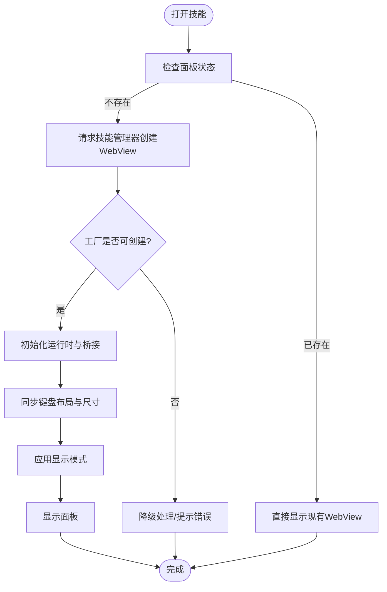
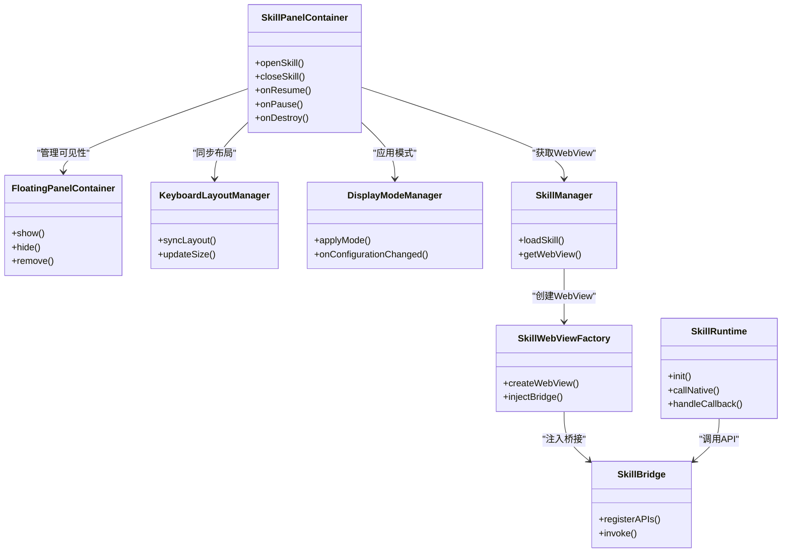

# 技能面板容器

<cite>
**本文引用的文件**   
- [SkillPanelContainer.kt](file://app/src/main/java/com/ziyou/ime/ime/SkillPanelContainer.kt)
- [FloatingPanelContainer.kt](file://app/src/main/java/com/ziyou/ime/ime/FloatingPanelContainer.kt)
- [ZiYouInputMethodService.kt](file://app/src/main/java/com/ziyou/ime/ime/ZiYouInputMethodService.kt)
- [SkillManager.kt](file://app/src/main/java/com/ziyou/ime/skill/SkillManager.kt)
- [SkillWebViewFactory.kt](file://app/src/main/java/com/ziyou/ime/skill/SkillWebViewFactory.kt)
- [SkillRuntime.kt](file://app/src/main/java/com/ziyou/ime/skill/SkillRuntime.kt)
- [SkillBridge.kt](file://app/src/main/java/com/ziyou/ime/skill/SkillBridge.kt)
- [DisplayModeManager.kt](file://app/src/main/java/com/ziyou/ime/config/DisplayModeManager.kt)
- [KeyboardLayoutManager.kt](file://app/src/main/java/com/ziyou/ime/ime/KeyboardLayoutManager.kt)
- [BaseKeyboardView.kt](file://app/src/main/java/com/ziyou/ime/ime/BaseKeyboardView.kt)
</cite>

## 目录
1. [简介](#简介)
2. [项目结构](#项目结构)
3. [核心组件](#核心组件)
4. [架构总览](#架构总览)
5. [详细组件分析](#详细组件分析)
6. [依赖关系分析](#依赖关系分析)
7. [性能考量](#性能考量)
8. [故障排查指南](#故障排查指南)
9. [结论](#结论)
10. [附录](#附录)

## 简介
本文件围绕输入法中的“技能面板容器”进行系统化文档化，重点说明其职责、与悬浮面板容器的关系、与输入服务及技能运行时的交互方式，以及布局与显示模式管理。目标是帮助开发者快速理解技能面板的加载、展示、生命周期管理与事件流转，并为扩展与维护提供清晰的参考路径。

## 项目结构
技能面板容器位于输入法界面层，负责承载并管理技能 WebView 实例，协调悬浮面板容器、键盘布局管理器与显示模式管理器，确保在不同输入场景下正确呈现技能内容。

图表来源
- [ZiYouInputMethodService.kt](file://app/src/main/java/com/ziyou/ime/ime/ZiYouInputMethodService.kt)
- [SkillPanelContainer.kt](file://app/src/main/java/com/ziyou/ime/ime/SkillPanelContainer.kt)
- [FloatingPanelContainer.kt](file://app/src/main/java/com/ziyou/ime/ime/FloatingPanelContainer.kt)
- [KeyboardLayoutManager.kt](file://app/src/main/java/com/ziyou/ime/ime/KeyboardLayoutManager.kt)
- [DisplayModeManager.kt](file://app/src/main/java/com/ziyou/ime/config/DisplayModeManager.kt)
- [SkillManager.kt](file://app/src/main/java/com/ziyou/ime/skill/SkillManager.kt)
- [SkillWebViewFactory.kt](file://app/src/main/java/com/ziyou/ime/skill/SkillWebViewFactory.kt)
- [SkillRuntime.kt](file://app/src/main/java/com/ziyou/ime/skill/SkillRuntime.kt)
- [SkillBridge.kt](file://app/src/main/java/com/ziyou/ime/skill/SkillBridge.kt)

章节来源
- [SkillPanelContainer.kt](file://app/src/main/java/com/ziyou/ime/ime/SkillPanelContainer.kt)
- [FloatingPanelContainer.kt](file://app/src/main/java/com/ziyou/ime/ime/FloatingPanelContainer.kt)
- [ZiYouInputMethodService.kt](file://app/src/main/java/com/ziyou/ime/ime/ZiYouInputMethodService.kt)
- [SkillManager.kt](file://app/src/main/java/com/ziyou/ime/skill/SkillManager.kt)
- [SkillWebViewFactory.kt](file://app/src/main/java/com/ziyou/ime/skill/SkillWebViewFactory.kt)
- [SkillRuntime.kt](file://app/src/main/java/com/ziyou/ime/skill/SkillRuntime.kt)
- [SkillBridge.kt](file://app/src/main/java/com/ziyou/ime/skill/SkillBridge.kt)
- [DisplayModeManager.kt](file://app/src/main/java/com/ziyou/ime/config/DisplayModeManager.kt)
- [KeyboardLayoutManager.kt](file://app/src/main/java/com/ziyou/ime/ime/KeyboardLayoutManager.kt)
- [BaseKeyboardView.kt](file://app/src/main/java/com/ziyou/ime/ime/BaseKeyboardView.kt)

## 核心组件
- 技能面板容器：承载技能 WebView，处理显示/隐藏、尺寸适配、生命周期回调以及与悬浮面板和键盘布局的协同。
- 悬浮面板容器：作为上层容器，管理面板的可见性、层级与手势交互。
- 输入服务：输入法入口，负责在合适时机创建或销毁技能面板容器。
- 技能管理器：负责技能的发现、安装、版本比较与权限校验，并提供 WebView 实例。
- WebView 工厂：根据技能清单与运行时配置创建 WebView 实例，注入桥接对象。
- 技能运行时：封装 JS 与原生之间的通信通道（桥接），统一调用与回调。
- 显示模式管理器：控制面板在不同显示模式下的行为（如全屏、分屏、横竖屏）。
- 键盘布局管理器：协调技能面板与键盘视图的布局与遮挡问题。

章节来源
- [SkillPanelContainer.kt](file://app/src/main/java/com/ziyou/ime/ime/SkillPanelContainer.kt)
- [FloatingPanelContainer.kt](file://app/src/main/java/com/ziyou/ime/ime/FloatingPanelContainer.kt)
- [ZiYouInputMethodService.kt](file://app/src/main/java/com/ziyou/ime/ime/ZiYouInputMethodService.kt)
- [SkillManager.kt](file://app/src/main/java/com/ziyou/ime/skill/SkillManager.kt)
- [SkillWebViewFactory.kt](file://app/src/main/java/com/ziyou/ime/skill/SkillWebViewFactory.kt)
- [SkillRuntime.kt](file://app/src/main/java/com/ziyou/ime/skill/SkillRuntime.kt)
- [SkillBridge.kt](file://app/src/main/java/com/ziyou/ime/skill/SkillBridge.kt)
- [DisplayModeManager.kt](file://app/src/main/java/com/ziyou/ime/config/DisplayModeManager.kt)
- [KeyboardLayoutManager.kt](file://app/src/main/java/com/ziyou/ime/ime/KeyboardLayoutManager.kt)

## 架构总览
技能面板容器处于 UI 层与技能运行时之间，向上对接输入服务与悬浮面板容器，向下通过技能管理器与 WebView 工厂获取 WebView，并通过运行时桥接与 JS 侧技能页面通信。显示模式与键盘布局管理器共同保证面板在不同设备状态下的正确呈现。

图表来源
- [ZiYouInputMethodService.kt](file://app/src/main/java/com/ziyou/ime/ime/ZiYouInputMethodService.kt)
- [SkillPanelContainer.kt](file://app/src/main/java/com/ziyou/ime/ime/SkillPanelContainer.kt)
- [FloatingPanelContainer.kt](file://app/src/main/java/com/ziyou/ime/ime/FloatingPanelContainer.kt)
- [SkillManager.kt](file://app/src/main/java/com/ziyou/ime/skill/SkillManager.kt)
- [SkillWebViewFactory.kt](file://app/src/main/java/com/ziyou/ime/skill/SkillWebViewFactory.kt)
- [SkillRuntime.kt](file://app/src/main/java/com/ziyou/ime/skill/SkillRuntime.kt)
- [SkillBridge.kt](file://app/src/main/java/com/ziyou/ime/skill/SkillBridge.kt)
- [KeyboardLayoutManager.kt](file://app/src/main/java/com/ziyou/ime/ime/KeyboardLayoutManager.kt)
- [DisplayModeManager.kt](file://app/src/main/java/com/ziyou/ime/config/DisplayModeManager.kt)

## 详细组件分析

### 技能面板容器（SkillPanelContainer）
- 职责
  - 持有并管理技能 WebView 的生命周期（创建、显示、隐藏、销毁）。
  - 与悬浮面板容器协作，确保面板层级与手势行为正确。
  - 与键盘布局管理器联动，避免被键盘遮挡或重叠。
  - 响应显示模式变化，调整面板尺寸与布局策略。
  - 暴露统一的 API 供输入服务调用（打开/关闭技能面板、切换技能等）。
- 关键流程
  - 打开技能：向技能管理器请求 WebView -> 由工厂创建/复用 -> 运行时初始化 -> 桥接建立 -> 布局与模式适配 -> 显示。
  - 关闭技能：暂停运行时 -> 释放 WebView -> 通知悬浮面板容器移除 -> 清理资源。
- 错误处理
  - WebView 创建失败时回退到默认提示页或禁用技能入口。
  - 运行时异常捕获并上报，保证输入法主线程稳定。
- 性能优化
  - WebView 复用与懒加载，减少内存占用。
  - 按需加载技能资源，避免首屏卡顿。

图表来源
- [SkillPanelContainer.kt](file://app/src/main/java/com/ziyou/ime/ime/SkillPanelContainer.kt)
- [SkillManager.kt](file://app/src/main/java/com/ziyou/ime/skill/SkillManager.kt)
- [SkillWebViewFactory.kt](file://app/src/main/java/com/ziyou/ime/skill/SkillWebViewFactory.kt)
- [SkillRuntime.kt](file://app/src/main/java/com/ziyou/ime/skill/SkillRuntime.kt)
- [KeyboardLayoutManager.kt](file://app/src/main/java/com/ziyou/ime/ime/KeyboardLayoutManager.kt)
- [DisplayModeManager.kt](file://app/src/main/java/com/ziyou/ime/config/DisplayModeManager.kt)

章节来源
- [SkillPanelContainer.kt](file://app/src/main/java/com/ziyou/ime/ime/SkillPanelContainer.kt)
- [SkillManager.kt](file://app/src/main/java/com/ziyou/ime/skill/SkillManager.kt)
- [SkillWebViewFactory.kt](file://app/src/main/java/com/ziyou/ime/skill/SkillWebViewFactory.kt)
- [SkillRuntime.kt](file://app/src/main/java/com/ziyou/ime/skill/SkillRuntime.kt)
- [KeyboardLayoutManager.kt](file://app/src/main/java/com/ziyou/ime/ime/KeyboardLayoutManager.kt)
- [DisplayModeManager.kt](file://app/src/main/java/com/ziyou/ime/config/DisplayModeManager.kt)

### 悬浮面板容器（FloatingPanelContainer）
- 职责
  - 管理技能面板的层级、可见性与手势交互（拖拽、缩放、关闭）。
  - 与输入法窗口生命周期联动，确保面板随输入窗口正确显示/隐藏。
- 关键点
  - 使用合适的 WindowManager 参数，避免系统级冲突。
  - 处理多窗口与分屏场景下的坐标与尺寸计算。

章节来源
- [FloatingPanelContainer.kt](file://app/src/main/java/com/ziyou/ime/ime/FloatingPanelContainer.kt)
- [ZiYouInputMethodService.kt](file://app/src/main/java/com/ziyou/ime/ime/ZiYouInputMethodService.kt)

### 输入服务（ZiYouInputMethodService）
- 职责
  - 在输入法激活/停用、软键盘弹出/收起等时机，触发技能面板的创建与销毁。
  - 将技能面板容器挂载到输入窗口，确保与键盘视图协同。
- 关键点
  - 生命周期回调中谨慎处理面板状态，避免重复创建或泄漏。
  - 与键盘布局管理器保持同步，防止面板遮挡候选区。

章节来源
- [ZiYouInputMethodService.kt](file://app/src/main/java/com/ziyou/ime/ime/ZiYouInputMethodService.kt)
- [BaseKeyboardView.kt](file://app/src/main/java/com/ziyou/ime/ime/BaseKeyboardView.kt)

### 技能管理器（SkillManager）
- 职责
  - 发现与加载技能包，解析清单，校验权限与版本。
  - 提供 WebView 实例给面板容器，支持缓存与复用。
- 关键点
  - 版本比较与兼容性判断，确保旧版技能仍可运行。
  - 权限校验失败时拒绝加载并给出明确提示。

章节来源
- [SkillManager.kt](file://app/src/main/java/com/ziyou/ime/skill/SkillManager.kt)

### WebView 工厂（SkillWebViewFactory）
- 职责
  - 根据技能清单与运行时配置创建 WebView 实例。
  - 注入桥接对象，使 JS 能调用原生能力。
- 关键点
  - 安全设置（如禁用危险特性）、缓存策略与内存回收。
  - 与 Android 版本兼容（API 差异处理）。

章节来源
- [SkillWebViewFactory.kt](file://app/src/main/java/com/ziyou/ime/skill/SkillWebViewFactory.kt)

### 技能运行时（SkillRuntime）与桥接（SkillBridge）
- 职责
  - 运行时负责 JS 与原生通信的统一入口，封装方法调用与回调。
  - 桥接定义 JS 可调用的 API 列表与参数规范。
- 关键点
  - 线程安全与异步回调处理。
  - 错误码与异常信息标准化，便于前端调试。

章节来源
- [SkillRuntime.kt](file://app/src/main/java/com/ziyou/ime/skill/SkillRuntime.kt)
- [SkillBridge.kt](file://app/src/main/java/com/ziyou/ime/skill/SkillBridge.kt)

### 显示模式管理器（DisplayModeManager）与键盘布局管理器（KeyboardLayoutManager）
- 职责
  - 显示模式管理器：根据横竖屏、分屏、全屏等模式调整面板行为。
  - 键盘布局管理器：协调面板与键盘视图的布局，避免遮挡与重叠。
- 关键点
  - 监听系统配置变化与窗口尺寸变化，及时刷新布局。
  - 与输入法窗口高度动态计算，确保面板始终可见。

章节来源
- [DisplayModeManager.kt](file://app/src/main/java/com/ziyou/ime/config/DisplayModeManager.kt)
- [KeyboardLayoutManager.kt](file://app/src/main/java/com/ziyou/ime/ime/KeyboardLayoutManager.kt)
- [BaseKeyboardView.kt](file://app/src/main/java/com/ziyou/ime/ime/BaseKeyboardView.kt)

## 依赖关系分析
技能面板容器依赖多个子系统，形成清晰的层次结构与单向依赖，降低耦合度并提升可维护性。

图表来源
- [SkillPanelContainer.kt](file://app/src/main/java/com/ziyou/ime/ime/SkillPanelContainer.kt)
- [FloatingPanelContainer.kt](file://app/src/main/java/com/ziyou/ime/ime/FloatingPanelContainer.kt)
- [KeyboardLayoutManager.kt](file://app/src/main/java/com/ziyou/ime/ime/KeyboardLayoutManager.kt)
- [DisplayModeManager.kt](file://app/src/main/java/com/ziyou/ime/config/DisplayModeManager.kt)
- [SkillManager.kt](file://app/src/main/java/com/ziyou/ime/skill/SkillManager.kt)
- [SkillWebViewFactory.kt](file://app/src/main/java/com/ziyou/ime/skill/SkillWebViewFactory.kt)
- [SkillRuntime.kt](file://app/src/main/java/com/ziyou/ime/skill/SkillRuntime.kt)
- [SkillBridge.kt](file://app/src/main/java/com/ziyou/ime/skill/SkillBridge.kt)

章节来源
- [SkillPanelContainer.kt](file://app/src/main/java/com/ziyou/ime/ime/SkillPanelContainer.kt)
- [FloatingPanelContainer.kt](file://app/src/main/java/com/ziyou/ime/ime/FloatingPanelContainer.kt)
- [KeyboardLayoutManager.kt](file://app/src/main/java/com/ziyou/ime/ime/KeyboardLayoutManager.kt)
- [DisplayModeManager.kt](file://app/src/main/java/com/ziyou/ime/config/DisplayModeManager.kt)
- [SkillManager.kt](file://app/src/main/java/com/ziyou/ime/skill/SkillManager.kt)
- [SkillWebViewFactory.kt](file://app/src/main/java/com/ziyou/ime/skill/SkillWebViewFactory.kt)
- [SkillRuntime.kt](file://app/src/main/java/com/ziyou/ime/skill/SkillRuntime.kt)
- [SkillBridge.kt](file://app/src/main/java/com/ziyou/ime/skill/SkillBridge.kt)

## 性能考量
- WebView 复用与懒加载：避免频繁创建销毁，降低内存峰值。
- 资源按需加载：首屏仅加载必要资源，后续再异步加载。
- 线程隔离：JS 回调与 UI 更新在主线程执行，耗时操作放后台。
- 布局优化：与键盘布局管理器协同，减少重绘与测量次数。
- 内存回收：在 onPause/onDestroy 中及时释放 WebView 与运行时资源。

[本节为通用指导，不直接分析具体文件]

## 故障排查指南
- 症状：技能面板无法显示
  - 检查技能管理器是否正确加载技能包与清单。
  - 确认 WebView 工厂创建成功且桥接已注入。
  - 查看悬浮面板容器是否被系统拦截或权限不足。
- 症状：面板被键盘遮挡
  - 核对键盘布局管理器是否同步了面板尺寸与位置。
  - 检查输入法窗口高度变化监听是否生效。
- 症状：JS 调用原生失败
  - 确认桥接 API 注册完整且参数类型匹配。
  - 查看运行时日志与异常堆栈，定位调用链。
- 症状：横竖屏切换后布局错乱
  - 检查显示模式管理器是否响应配置变化并重新应用模式。
  - 验证面板尺寸与悬浮面板坐标计算逻辑。

章节来源
- [SkillPanelContainer.kt](file://app/src/main/java/com/ziyou/ime/ime/SkillPanelContainer.kt)
- [SkillManager.kt](file://app/src/main/java/com/ziyou/ime/skill/SkillManager.kt)
- [SkillWebViewFactory.kt](file://app/src/main/java/com/ziyou/ime/skill/SkillWebViewFactory.kt)
- [SkillRuntime.kt](file://app/src/main/java/com/ziyou/ime/skill/SkillRuntime.kt)
- [SkillBridge.kt](file://app/src/main/java/com/ziyou/ime/skill/SkillBridge.kt)
- [FloatingPanelContainer.kt](file://app/src/main/java/com/ziyou/ime/ime/FloatingPanelContainer.kt)
- [KeyboardLayoutManager.kt](file://app/src/main/java/com/ziyou/ime/ime/KeyboardLayoutManager.kt)
- [DisplayModeManager.kt](file://app/src/main/java/com/ziyou/ime/config/DisplayModeManager.kt)

## 结论
技能面板容器是输入法技能系统的核心 UI 组件，通过与悬浮面板容器、键盘布局管理器、显示模式管理器以及技能运行时的紧密协作，实现了跨平台、可扩展的技能展示与交互。合理的依赖拆分与生命周期管理保证了稳定性与性能，为后续功能扩展提供了坚实基础。

[本节为总结性内容，不直接分析具体文件]

## 附录
- 相关开发文档
  - 技能插件开发指南
  - 技能插件系统可行性方案
  - 联想功能重构方案
  - 游戏悬浮输入法可行性方案

[本节为概念性内容，不直接分析具体文件]