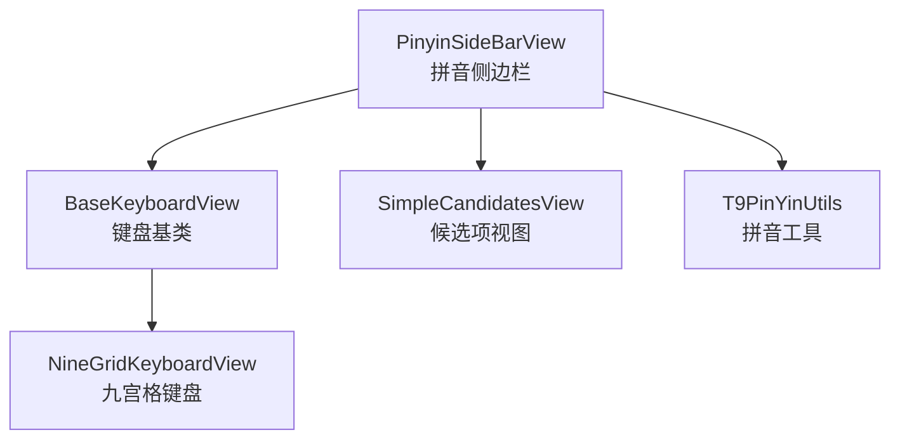
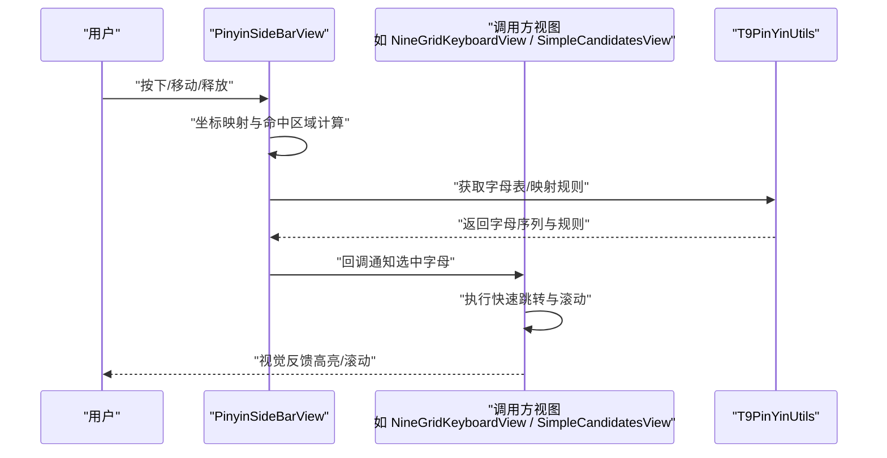
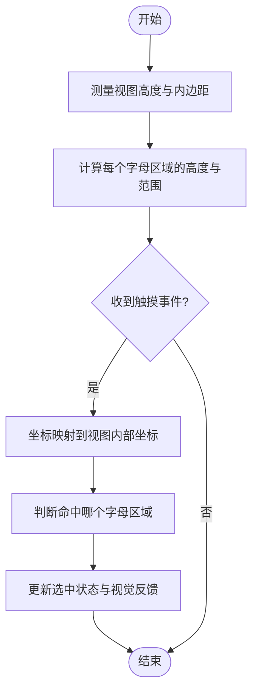
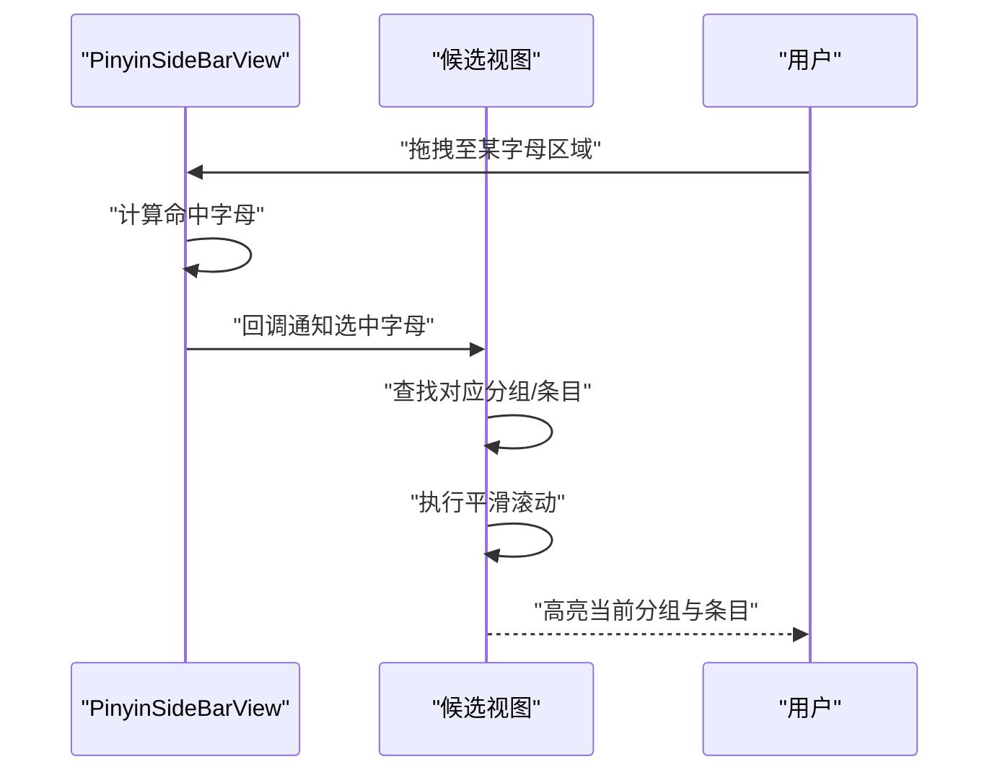
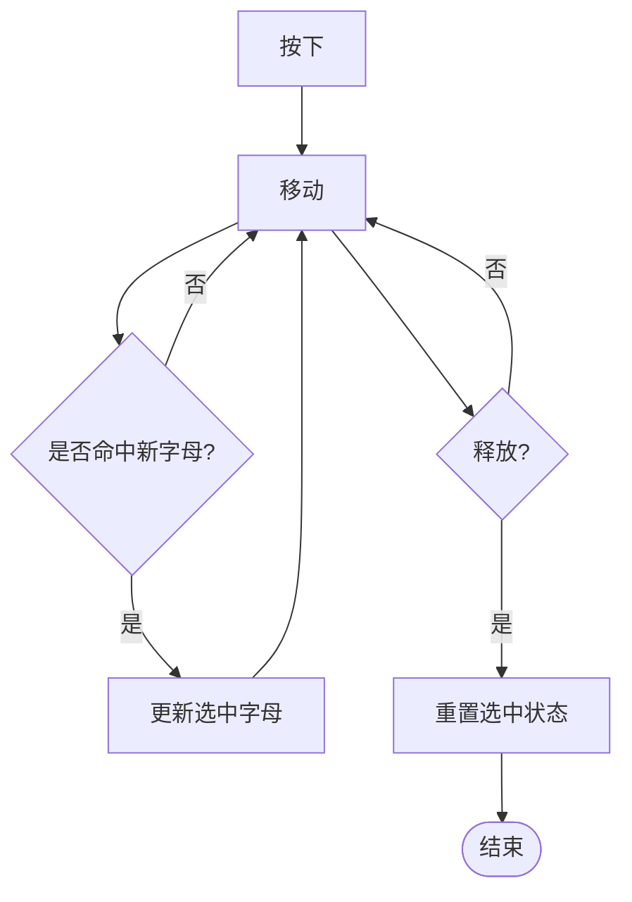
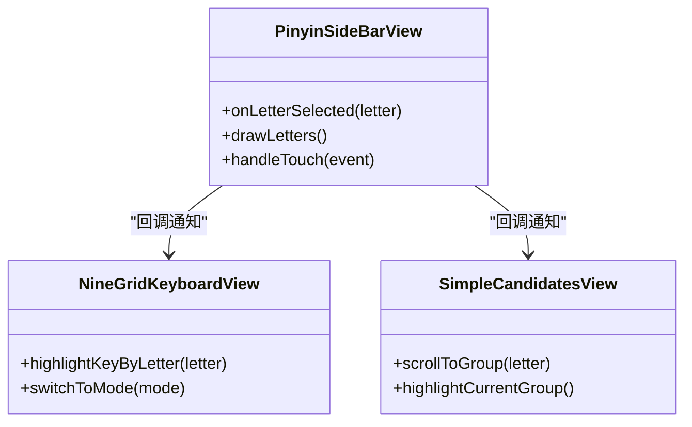
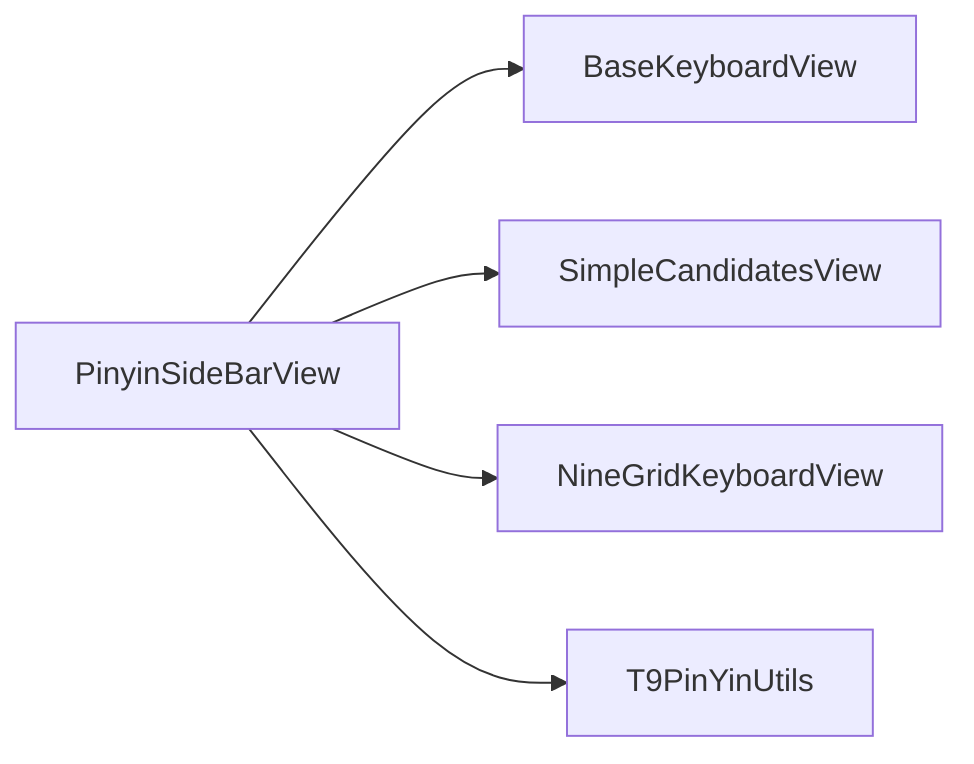

# 拼音侧边栏

<cite>
**本文引用的文件**   
- [PinyinSideBarView.kt](file://app/src/main/java/com/ziyou/ime/ime/PinyinSideBarView.kt)
- [BaseKeyboardView.kt](file://app/src/main/java/com/ziyou/ime/ime/BaseKeyboardView.kt)
- [NineGridKeyboardView.kt](file://app/src/main/java/com/ziyou/ime/ime/NineGridKeyboardView.kt)
- [SimpleCandidatesView.kt](file://app/src/main/java/com/ziyou/ime/ime/SimpleCandidatesView.kt)
- [T9PinYinUtils.kt](file://app/src/main/java/com/ziyou/ime/util/T9PinYinUtils.kt)
</cite>

## 目录
1. [简介](#简介)
2. [项目结构](#项目结构)
3. [核心组件](#核心组件)
4. [架构总览](#架构总览)
5. [详细组件分析](#详细组件分析)
6. [依赖分析](#依赖分析)
7. [性能考虑](#性能考虑)
8. [故障排查指南](#故障排查指南)
9. [结论](#结论)
10. [附录](#附录)

## 简介
本文件围绕 PinyinSideBarView（拼音侧边栏）进行系统化文档化，重点解释以下方面：
- 拼音字母索引的实现原理：字母布局计算、触摸区域划分与坐标映射
- 快速跳转功能：字母匹配算法、平滑滚动与视觉反馈
- 触摸事件处理：按下、移动、释放状态切换与边界检测
- 自定义样式配置：字母字体、颜色与选中效果
- 性能优化策略：视图复用、绘制优化与内存控制
- 手势识别、动画效果与用户体验优化
- 使用示例与扩展方法

该组件通常作为输入法键盘右侧的“字母条”，用于快速定位候选词或跳转到对应首字母分组。

## 项目结构
PinyinSideBarView 位于输入法的 ime 模块中，与键盘视图、候选项视图以及工具类协同工作。其关键位置如下：
- 组件实现：app/src/main/java/com/ziyou/ime/ime/PinyinSideBarView.kt
- 基类与键盘视图：app/src/main/java/com/ziyou/ime/ime/BaseKeyboardView.kt、NineGridKeyboardView.kt
- 候选项视图：app/src/main/java/com/ziyou/ime/ime/SimpleCandidatesView.kt
- 拼音工具：app/src/main/java/com/ziyou/ime/util/T9PinYinUtils.kt

图表来源
- [PinyinSideBarView.kt](file://app/src/main/java/com/ziyou/ime/ime/PinyinSideBarView.kt)
- [BaseKeyboardView.kt](file://app/src/main/java/com/ziyou/ime/ime/BaseKeyboardView.kt)
- [NineGridKeyboardView.kt](file://app/src/main/java/com/ziyou/ime/ime/NineGridKeyboardView.kt)
- [SimpleCandidatesView.kt](file://app/src/main/java/com/ziyou/ime/ime/SimpleCandidatesView.kt)
- [T9PinYinUtils.kt](file://app/src/main/java/com/ziyou/ime/util/T9PinYinUtils.kt)

章节来源
- [PinyinSideBarView.kt](file://app/src/main/java/com/ziyou/ime/ime/PinyinSideBarView.kt)
- [BaseKeyboardView.kt](file://app/src/main/java/com/ziyou/ime/ime/BaseKeyboardView.kt)
- [NineGridKeyboardView.kt](file://app/src/main/java/com/ziyou/ime/ime/NineGridKeyboardView.kt)
- [SimpleCandidatesView.kt](file://app/src/main/java/com/ziyou/ime/ime/SimpleCandidatesView.kt)
- [T9PinYinUtils.kt](file://app/src/main/java/com/ziyou/ime/util/T9PinYinUtils.kt)

## 核心组件
- PinyinSideBarView：负责渲染 A-Z 字母条、处理触摸事件、计算命中区域、触发快速跳转与视觉反馈。
- BaseKeyboardView：提供键盘相关的基础能力（如尺寸测量、绘制上下文等），可能被 PinyinSideBarView 继承或组合使用。
- SimpleCandidatesView：展示候选词列表，与侧边栏联动以在用户选择字母后滚动到对应分组。
- T9PinYinUtils：提供拼音相关的工具方法（例如字母与拼音首字母的映射、排序规则等）。

章节来源
- [PinyinSideBarView.kt](file://app/src/main/java/com/ziyou/ime/ime/PinyinSideBarView.kt)
- [BaseKeyboardView.kt](file://app/src/main/java/com/ziyou/ime/ime/BaseKeyboardView.kt)
- [SimpleCandidatesView.kt](file://app/src/main/java/com/ziyou/ime/ime/SimpleCandidatesView.kt)
- [T9PinYinUtils.kt](file://app/src/main/java/com/ziyou/ime/util/T9PinYinUtils.kt)

## 架构总览
PinyinSideBarView 的典型交互流程如下：
- 用户在侧边栏上按下并拖动，系统根据 Y 坐标计算命中字母
- 若进入某字母区域，更新选中状态并触发回调
- 调用方（如 NineGridKeyboardView 或 SimpleCandidatesView）执行快速跳转与滚动
- 释放时恢复非选中状态

图表来源
- [PinyinSideBarView.kt](file://app/src/main/java/com/ziyou/ime/ime/PinyinSideBarView.kt)
- [T9PinYinUtils.kt](file://app/src/main/java/com/ziyou/ime/util/T9PinYinUtils.kt)
- [NineGridKeyboardView.kt](file://app/src/main/java/com/ziyou/ime/ime/NineGridKeyboardView.kt)
- [SimpleCandidatesView.kt](file://app/src/main/java/com/ziyou/ime/ime/SimpleCandidatesView.kt)

## 详细组件分析

### 字母布局计算与触摸区域划分
- 字母布局：将 A-Z 均匀分布在侧边栏高度范围内，每个字母占据一个等高的矩形区域。布局计算需考虑：
  - 视图高度与内边距
  - 文字大小与行高
  - 可选的顶部/底部留白
- 触摸区域划分：根据当前触摸点的 Y 坐标，计算落入哪个字母区间。常用方法为：
  - 将可用高度按字母数量均分，得到每个区域的起始与结束 Y
  - 对越界坐标做裁剪，确保不会命中无效区域
- 坐标映射：将屏幕坐标转换为视图内部坐标，再映射到字母索引。需要处理：
  - 多指触控与滑动冲突
  - 不同 DPI 下的像素换算
  - 旋转与缩放场景下的坐标修正

章节来源
- [PinyinSideBarView.kt](file://app/src/main/java/com/ziyou/ime/ime/PinyinSideBarView.kt)

### 快速跳转功能：字母匹配、平滑滚动与视觉反馈
- 字母匹配：根据触摸到的字母，查找候选列表中首个以该字母开头的条目或分组。可借助工具类提供的映射规则。
- 平滑滚动：通过动画或插值器驱动滚动，避免跳变。常见做法：
  - 计算目标位置与当前位置
  - 使用线性或弹性插值器进行过渡
  - 限制滚动范围，防止越界
- 视觉反馈：
  - 选中字母高亮显示
  - 候选列表滚动时同步高亮当前分组
  - 可选的抖动或缩放效果增强感知

章节来源
- [PinyinSideBarView.kt](file://app/src/main/java/com/ziyou/ime/ime/PinyinSideBarView.kt)
- [SimpleCandidatesView.kt](file://app/src/main/java/com/ziyou/ime/ime/SimpleCandidatesView.kt)
- [T9PinYinUtils.kt](file://app/src/main/java/com/ziyou/ime/util/T9PinYinUtils.kt)

### 触摸事件处理：按下、移动、释放与边界检测
- 按下（ACTION_DOWN）：记录初始位置，开启命中检测
- 移动（ACTION_MOVE）：持续计算新坐标，更新命中字母与选中状态
- 释放（ACTION_UP/ACTION_CANCEL）：清除选中状态，必要时触发最终跳转
- 边界检测：
  - 防止超出视图上下边界
  - 处理滑出视图后的事件丢失
  - 兼容多点触控与手势冲突

章节来源
- [PinyinSideBarView.kt](file://app/src/main/java/com/ziyou/ime/ime/PinyinSideBarView.kt)

### 自定义样式配置：字体、颜色与选中效果
- 字体设置：支持自定义字母字体、字号与行高，保证在不同设备上清晰可读
- 颜色配置：正常态与选中态的颜色区分，支持主题切换
- 选中效果：背景色块、描边或阴影，提升视觉层次
- 适配策略：
  - 根据 DPI 调整文字大小与间距
  - 动态计算文本边界，避免重叠
  - 支持夜间模式与高对比度主题

章节来源
- [PinyinSideBarView.kt](file://app/src/main/java/com/ziyou/ime/ime/PinyinSideBarView.kt)

### 与键盘和候选视图的集成
- 与 NineGridKeyboardView 集成：当用户选择字母后，键盘可切换到对应首字母的快速输入模式或高亮相应键位
- 与 SimpleCandidatesView 集成：根据选中字母滚动候选列表，并高亮当前分组

图表来源
- [PinyinSideBarView.kt](file://app/src/main/java/com/ziyou/ime/ime/PinyinSideBarView.kt)
- [NineGridKeyboardView.kt](file://app/src/main/java/com/ziyou/ime/ime/NineGridKeyboardView.kt)
- [SimpleCandidatesView.kt](file://app/src/main/java/com/ziyou/ime/ime/SimpleCandidatesView.kt)

章节来源
- [PinyinSideBarView.kt](file://app/src/main/java/com/ziyou/ime/ime/PinyinSideBarView.kt)
- [NineGridKeyboardView.kt](file://app/src/main/java/com/ziyou/ime/ime/NineGridKeyboardView.kt)
- [SimpleCandidatesView.kt](file://app/src/main/java/com/ziyou/ime/ime/SimpleCandidatesView.kt)

## 依赖分析
- 内部依赖：
  - BaseKeyboardView：可能提供绘制与测量基础能力
  - T9PinYinUtils：提供字母与拼音映射、排序规则等
- 外部协作：
  - SimpleCandidatesView：接收选中字母并执行滚动与高亮
  - NineGridKeyboardView：根据选中字母切换键盘模式或高亮键位

图表来源
- [PinyinSideBarView.kt](file://app/src/main/java/com/ziyou/ime/ime/PinyinSideBarView.kt)
- [BaseKeyboardView.kt](file://app/src/main/java/com/ziyou/ime/ime/BaseKeyboardView.kt)
- [SimpleCandidatesView.kt](file://app/src/main/java/com/ziyou/ime/ime/SimpleCandidatesView.kt)
- [NineGridKeyboardView.kt](file://app/src/main/java/com/ziyou/ime/ime/NineGridKeyboardView.kt)
- [T9PinYinUtils.kt](file://app/src/main/java/com/ziyou/ime/util/T9PinYinUtils.kt)

章节来源
- [PinyinSideBarView.kt](file://app/src/main/java/com/ziyou/ime/ime/PinyinSideBarView.kt)
- [BaseKeyboardView.kt](file://app/src/main/java/com/ziyou/ime/ime/BaseKeyboardView.kt)
- [SimpleCandidatesView.kt](file://app/src/main/java/com/ziyou/ime/ime/SimpleCandidatesView.kt)
- [NineGridKeyboardView.kt](file://app/src/main/java/com/ziyou/ime/ime/NineGridKeyboardView.kt)
- [T9PinYinUtils.kt](file://app/src/main/java/com/ziyou/ime/util/T9PinYinUtils.kt)

## 性能考虑
- 视图复用：避免频繁创建与销毁对象，重用画笔、路径与缓存数据
- 绘制优化：
  - 减少不必要的重绘，仅在状态变化时刷新
  - 使用离屏缓存或硬件加速提升绘制效率
  - 合理设置抗锯齿与透明度，避免过度合成
- 内存控制：
  - 避免在触摸事件中分配大量临时对象
  - 及时释放大对象引用，防止内存泄漏
- 滚动与动画：
  - 使用轻量级插值器，避免卡顿
  - 限制动画帧率与持续时间，平衡流畅性与功耗

[本节为通用指导，不直接分析具体文件]

## 故障排查指南
常见问题与定位建议：
- 触摸无响应：检查坐标映射是否正确，确认事件分发未被拦截
- 命中区域偏移：核对内边距与文字行高计算，验证 DPI 换算
- 滚动异常：检查目标位置计算与滚动范围限制
- 样式错乱：确认字体与颜色配置生效，检查主题切换逻辑
- 性能问题：观察重绘频率与对象分配，启用 Profiler 分析热点

章节来源
- [PinyinSideBarView.kt](file://app/src/main/java/com/ziyou/ime/ime/PinyinSideBarView.kt)

## 结论
PinyinSideBarView 通过精确的布局计算与触摸事件处理，实现了高效的拼音字母索引与快速跳转。结合候选视图与键盘视图的协作，提供了流畅的用户体验。合理的样式配置与性能优化策略进一步提升了可用性与稳定性。

[本节为总结性内容，不直接分析具体文件]

## 附录
- 使用示例：
  - 在布局中添加 PinyinSideBarView，并设置回调监听选中字母
  - 在回调中调用候选视图的滚动方法与键盘视图的高亮方法
- 扩展方法：
  - 自定义字母顺序（如包含特殊符号）
  - 增加长按预览或震动反馈
  - 支持国际化与本地化字符集

[本节为概念性内容，不直接分析具体文件]