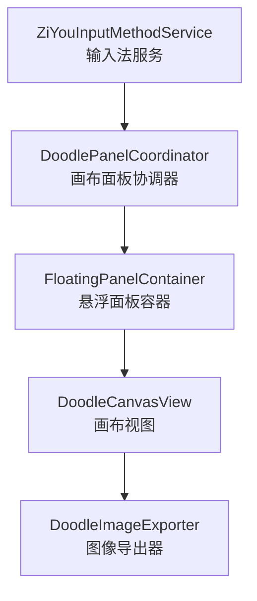
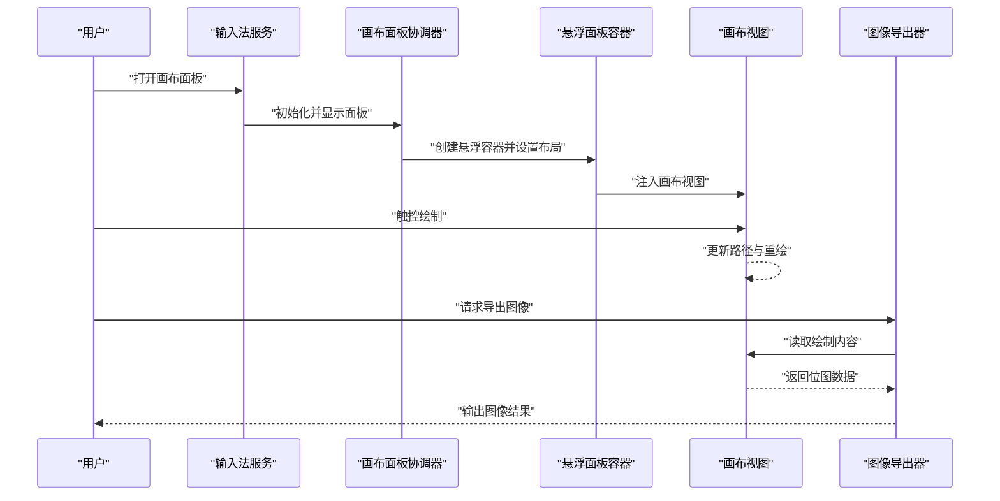
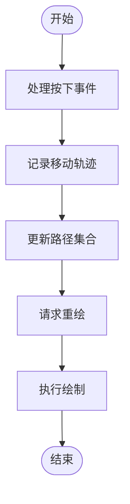
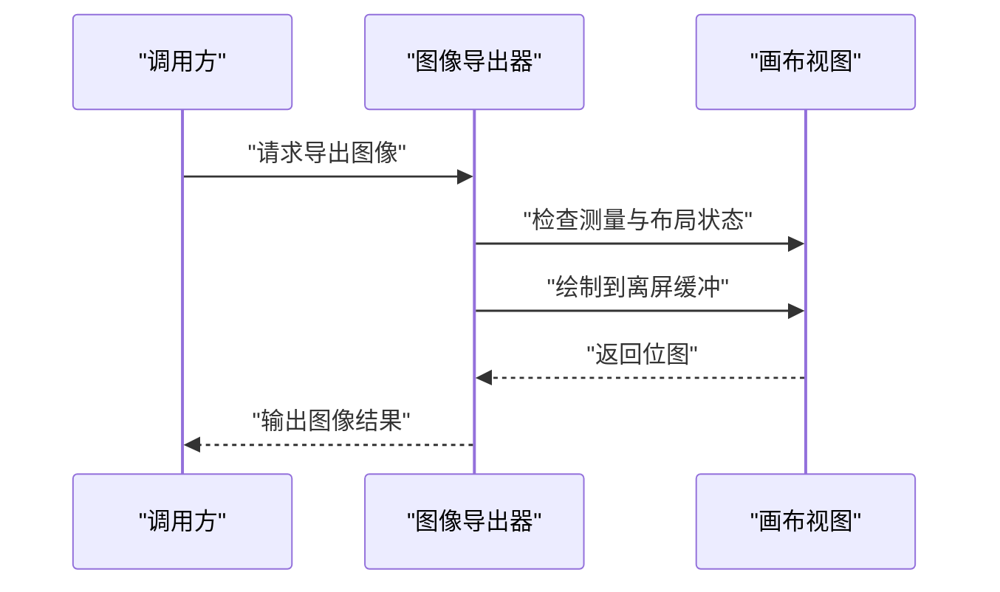
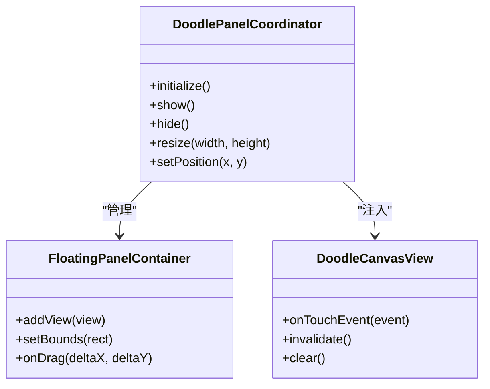
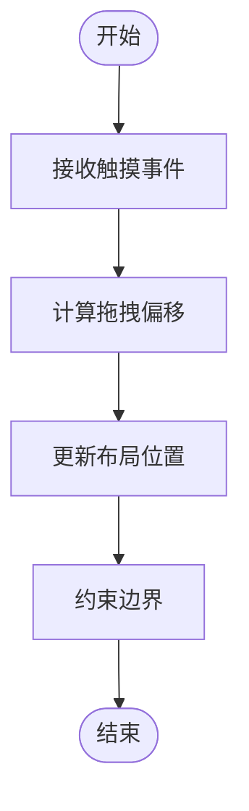
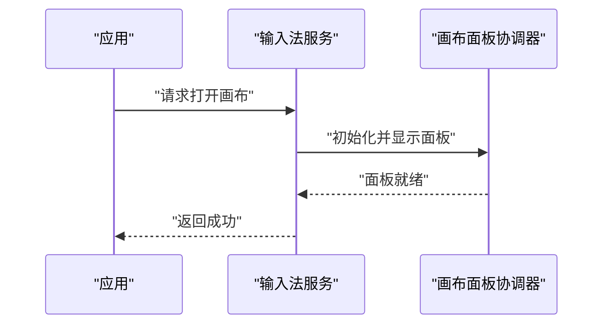
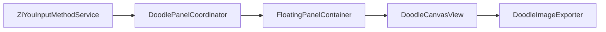

# 数字绘画画布系统

<cite>
**本文引用的文件**   
- [DoodleCanvasView.kt](file://app/src/main/java/com/ziyou/ime/DoodleCanvasView.kt)
- [DoodleImageExporter.kt](file://app/src/main/java/com/ziyou/ime/DoodleImageExporter.kt)
- [DoodlePanelCoordinator.kt](file://app/src/main/java/com/ziyou/ime/DoodlePanelCoordinator.kt)
- [FloatingPanelContainer.kt](file://app/src/main/java/com/ziyou/ime/FloatingPanelContainer.kt)
- [ZiYouInputMethodService.kt](file://app/src/main/java/com/ziyou/ime/ZiYouInputMethodService.kt)
</cite>

## 目录
1. [简介](#简介)
2. [项目结构](#项目结构)
3. [核心组件](#核心组件)
4. [架构总览](#架构总览)
5. [详细组件分析](#详细组件分析)
6. [依赖关系分析](#依赖关系分析)
7. [性能考量](#性能考量)
8. [故障排查指南](#故障排查指南)
9. [结论](#结论)
10. [附录](#附录)

## 简介
本文件围绕“数字绘画画布系统”进行系统化文档化，聚焦于输入法应用中的手绘绘制、面板协调与图像导出能力。该子系统通过自定义视图承载画布交互，由协调器管理面板生命周期与状态，并提供统一的图片导出接口，以便将用户绘制的内容输出为位图资源。

## 项目结构
数字绘画画布系统位于输入法的 UI 层，主要涉及以下职责：
- 画布绘制与手势处理：在自定义视图中完成触摸事件解析、路径记录与重绘。
- 面板协调：负责画布面板的显示、隐藏、尺寸调整以及与输入法主界面的协作。
- 图像导出：将画布内容转换为位图，供分享或保存使用。
- 悬浮容器：提供可拖拽、可定位的悬浮面板容器，支撑画布面板的浮动展示。

**图示来源** 
- [ZiYouInputMethodService.kt](file://app/src/main/java/com/ziyou/ime/ZiYouInputMethodService.kt)
- [DoodlePanelCoordinator.kt](file://app/src/main/java/com/ziyou/ime/DoodlePanelCoordinator.kt)
- [FloatingPanelContainer.kt](file://app/src/main/java/com/ziyou/ime/FloatingPanelContainer.kt)
- [DoodleCanvasView.kt](file://app/src/main/java/com/ziyou/ime/DoodleCanvasView.kt)
- [DoodleImageExporter.kt](file://app/src/main/java/com/ziyou/ime/DoodleImageExporter.kt)

**章节来源**
- [ZiYouInputMethodService.kt](file://app/src/main/java/com/ziyou/ime/ZiYouInputMethodService.kt)
- [DoodlePanelCoordinator.kt](file://app/src/main/java/com/ziyou/ime/DoodlePanelCoordinator.kt)
- [FloatingPanelContainer.kt](file://app/src/main/java/com/ziyou/ime/FloatingPanelContainer.kt)
- [DoodleCanvasView.kt](file://app/src/main/java/com/ziyou/ime/DoodleCanvasView.kt)
- [DoodleImageExporter.kt](file://app/src/main/java/com/ziyou/ime/DoodleImageExporter.kt)

## 核心组件
- 画布视图（DoodleCanvasView）：封装绘制逻辑与手势识别，维护路径集合、画笔属性与渲染状态。
- 图像导出器（DoodleImageExporter）：从画布视图生成位图，支持分辨率与背景色配置。
- 画布面板协调器（DoodlePanelCoordinator）：管理画布面板的创建、显示、隐藏、尺寸与位置，并与输入法服务通信。
- 悬浮面板容器（FloatingPanelContainer）：提供悬浮窗口的布局、拖拽与边界约束。
- 输入法服务（ZiYouInputMethodService）：作为宿主，协调各模块并对外暴露入口。

**章节来源**
- [DoodleCanvasView.kt](file://app/src/main/java/com/ziyou/ime/DoodleCanvasView.kt)
- [DoodleImageExporter.kt](file://app/src/main/java/com/ziyou/ime/DoodleImageExporter.kt)
- [DoodlePanelCoordinator.kt](file://app/src/main/java/com/ziyou/ime/DoodlePanelCoordinator.kt)
- [FloatingPanelContainer.kt](file://app/src/main/java/com/ziyou/ime/FloatingPanelContainer.kt)
- [ZiYouInputMethodService.kt](file://app/src/main/java/com/ziyou/ime/ZiYouInputMethodService.kt)

## 架构总览
下图展示了数字绘画画布系统的整体架构与数据流向：
- 用户在画布视图上进行触控操作，视图记录路径并重绘。
- 协调器根据用户动作控制面板可见性与尺寸。
- 导出器从画布视图捕获当前帧并生成位图。
- 悬浮容器负责面板的定位与拖拽行为。
- 输入法服务作为顶层协调者，确保各组件协同工作。

**图示来源** 
- [ZiYouInputMethodService.kt](file://app/src/main/java/com/ziyou/ime/ZiYouInputMethodService.kt)
- [DoodlePanelCoordinator.kt](file://app/src/main/java/com/ziyou/ime/DoodlePanelCoordinator.kt)
- [FloatingPanelContainer.kt](file://app/src/main/java/com/ziyou/ime/FloatingPanelContainer.kt)
- [DoodleCanvasView.kt](file://app/src/main/java/com/ziyou/ime/DoodleCanvasView.kt)
- [DoodleImageExporter.kt](file://app/src/main/java/com/ziyou/ime/DoodleImageExporter.kt)

## 详细组件分析

### 画布视图（DoodleCanvasView）
- 职责：处理触摸事件、维护绘制路径、执行重绘；提供获取绘制内容与清空画布的接口。
- 关键流程：
  - 接收触摸事件，区分按下、移动、抬起等状态。
  - 将轨迹点加入路径集合，触发重绘。
  - 支持撤销、清空等操作以改变绘制状态。
- 复杂度与优化：
  - 路径集合规模影响重绘开销，建议按需合并路径与限制最大点数。
  - 使用离屏缓冲可减少闪烁与重复计算。

**图示来源** 
- [DoodleCanvasView.kt](file://app/src/main/java/com/ziyou/ime/DoodleCanvasView.kt)

**章节来源**
- [DoodleCanvasView.kt](file://app/src/main/java/com/ziyou/ime/DoodleCanvasView.kt)

### 图像导出器（DoodleImageExporter）
- 职责：从画布视图生成位图，支持分辨率、背景色与缩放策略。
- 关键流程：
  - 校验画布视图是否已测量与布局。
  - 创建位图缓存，调用画布视图绘制到缓存。
  - 返回位图对象供上层使用。
- 注意事项：
  - 避免在主线程阻塞，必要时异步处理大尺寸位图。
  - 合理设置采样率以减少内存占用。

**图示来源** 
- [DoodleImageExporter.kt](file://app/src/main/java/com/ziyou/ime/DoodleImageExporter.kt)
- [DoodleCanvasView.kt](file://app/src/main/java/com/ziyou/ime/DoodleCanvasView.kt)

**章节来源**
- [DoodleImageExporter.kt](file://app/src/main/java/com/ziyou/ime/DoodleImageExporter.kt)

### 画布面板协调器（DoodlePanelCoordinator）
- 职责：管理画布面板的生命周期、尺寸与位置；与悬浮容器和输入法服务交互。
- 关键流程：
  - 创建并配置悬浮容器。
  - 注入画布视图到容器。
  - 响应显示/隐藏、尺寸变化与位置更新。
- 设计要点：
  - 解耦面板与具体视图实现，便于扩展其他类型面板。
  - 统一回调接口，简化上层调用。

**图示来源** 
- [DoodlePanelCoordinator.kt](file://app/src/main/java/com/ziyou/ime/DoodlePanelCoordinator.kt)
- [FloatingPanelContainer.kt](file://app/src/main/java/com/ziyou/ime/FloatingPanelContainer.kt)
- [DoodleCanvasView.kt](file://app/src/main/java/com/ziyou/ime/DoodleCanvasView.kt)

**章节来源**
- [DoodlePanelCoordinator.kt](file://app/src/main/java/com/ziyou/ime/DoodlePanelCoordinator.kt)
- [FloatingPanelContainer.kt](file://app/src/main/java/com/ziyou/ime/FloatingPanelContainer.kt)
- [DoodleCanvasView.kt](file://app/src/main/java/com/ziyou/ime/DoodleCanvasView.kt)

### 悬浮面板容器（FloatingPanelContainer）
- 职责：提供悬浮窗口的基础能力，包括添加子视图、设置边界、处理拖拽与边界回弹。
- 关键流程：
  - 监听触摸事件，计算偏移量并更新布局。
  - 约束面板位置在屏幕范围内。
  - 支持点击穿透与焦点管理。

**图示来源** 
- [FloatingPanelContainer.kt](file://app/src/main/java/com/ziyou/ime/FloatingPanelContainer.kt)

**章节来源**
- [FloatingPanelContainer.kt](file://app/src/main/java/com/ziyou/ime/FloatingPanelContainer.kt)

### 输入法服务（ZiYouInputMethodService）
- 职责：作为宿主服务，协调画布面板与其他输入法功能；提供外部访问入口。
- 关键流程：
  - 初始化画布面板协调器。
  - 响应用户操作，触发面板显示或隐藏。
  - 与导出器协作，完成图像输出。

**图示来源** 
- [ZiYouInputMethodService.kt](file://app/src/main/java/com/ziyou/ime/ZiYouInputMethodService.kt)
- [DoodlePanelCoordinator.kt](file://app/src/main/java/com/ziyou/ime/DoodlePanelCoordinator.kt)

**章节来源**
- [ZiYouInputMethodService.kt](file://app/src/main/java/com/ziyou/ime/ZiYouInputMethodService.kt)
- [DoodlePanelCoordinator.kt](file://app/src/main/java/com/ziyou/ime/DoodlePanelCoordinator.kt)

## 依赖关系分析
- 松耦合设计：协调器通过接口与容器和画布视图交互，降低直接依赖。
- 单向依赖：导出器仅依赖画布视图的绘制能力，不反向依赖上层。
- 宿主协调：输入法服务作为顶层协调者，避免循环依赖。

**图示来源** 
- [ZiYouInputMethodService.kt](file://app/src/main/java/com/ziyou/ime/ZiYouInputMethodService.kt)
- [DoodlePanelCoordinator.kt](file://app/src/main/java/com/ziyou/ime/DoodlePanelCoordinator.kt)
- [FloatingPanelContainer.kt](file://app/src/main/java/com/ziyou/ime/FloatingPanelContainer.kt)
- [DoodleCanvasView.kt](file://app/src/main/java/com/ziyou/ime/DoodleCanvasView.kt)
- [DoodleImageExporter.kt](file://app/src/main/java/com/ziyou/ime/DoodleImageExporter.kt)

**章节来源**
- [ZiYouInputMethodService.kt](file://app/src/main/java/com/ziyou/ime/ZiYouInputMethodService.kt)
- [DoodlePanelCoordinator.kt](file://app/src/main/java/com/ziyou/ime/DoodlePanelCoordinator.kt)
- [FloatingPanelContainer.kt](file://app/src/main/java/com/ziyou/ime/FloatingPanelContainer.kt)
- [DoodleCanvasView.kt](file://app/src/main/java/com/ziyou/ime/DoodleCanvasView.kt)
- [DoodleImageExporter.kt](file://app/src/main/java/com/ziyou/ime/DoodleImageExporter.kt)

## 性能考量
- 绘制性能：路径数量与复杂曲线会增加重绘开销，建议合并相邻路径与限制点数。
- 内存管理：大尺寸位图易导致内存压力，应使用合适的采样率与离屏缓冲。
- 线程模型：导出与重绘应避免阻塞主线程，必要时采用异步任务。
- 事件处理：手势识别需去抖与节流，减少不必要的重绘。

[本节为通用指导，不涉及具体文件分析]

## 故障排查指南
- 画布无响应：检查触摸事件分发与视图测量状态，确认 invalidate 被正确调用。
- 导出结果为空：验证画布是否已完成布局与绘制，确保导出前存在有效内容。
- 面板位置异常：检查悬浮容器的边界约束与坐标转换逻辑。
- 内存溢出：监控位图大小与引用释放，避免长时间持有大对象。

**章节来源**
- [DoodleCanvasView.kt](file://app/src/main/java/com/ziyou/ime/DoodleCanvasView.kt)
- [DoodleImageExporter.kt](file://app/src/main/java/com/ziyou/ime/DoodleImageExporter.kt)
- [FloatingPanelContainer.kt](file://app/src/main/java/com/ziyou/ime/FloatingPanelContainer.kt)

## 结论
数字绘画画布系统通过清晰的组件划分与松耦合设计，实现了流畅的手绘体验与可靠的图像导出能力。协调器与悬浮容器提供了灵活的面板管理能力，而导出器确保了绘制内容的稳定输出。在实际使用中，应关注绘制性能与内存管理，以获得更佳的用户体验。

[本节为总结性内容，不涉及具体文件分析]

## 附录
- 最佳实践：
  - 将路径数据序列化以便持久化与恢复。
  - 提供撤销/重做栈以提升交互体验。
  - 为不同设备密度适配画布分辨率。
- 扩展方向：
  - 增加图层管理与混合模式。
  - 引入矢量图形与贝塞尔曲线编辑。
  - 支持多指手势与工具切换。

[本节为概念性内容，不涉及具体文件分析]