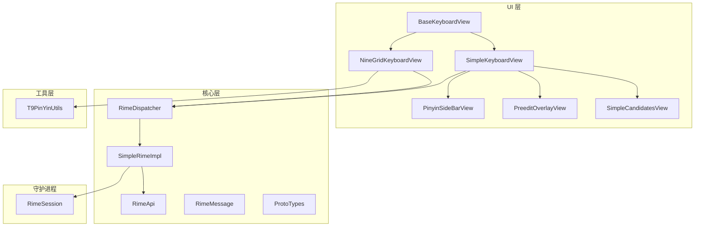
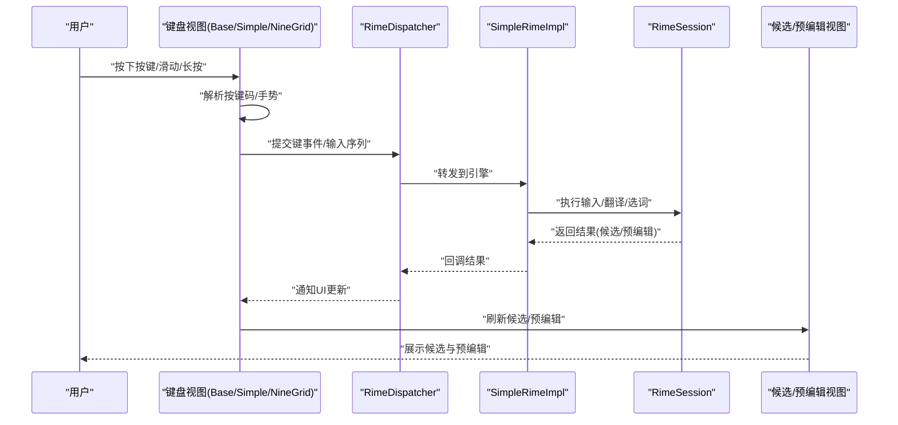
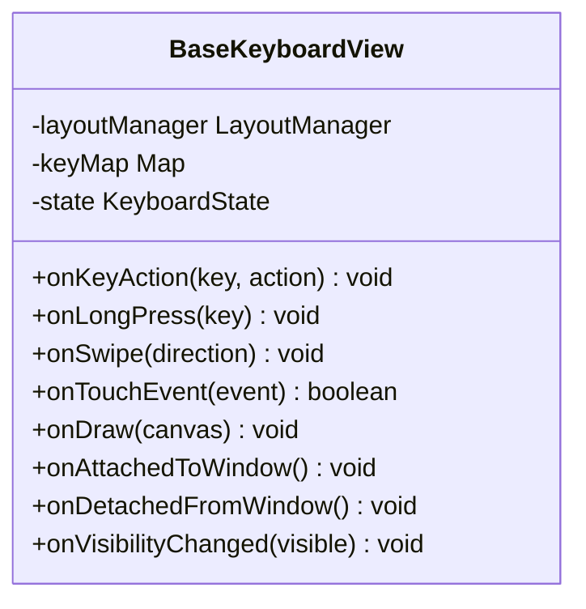
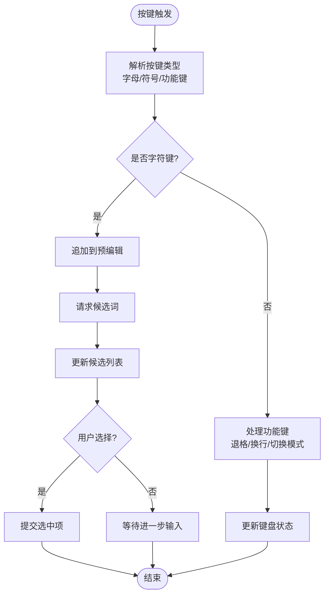
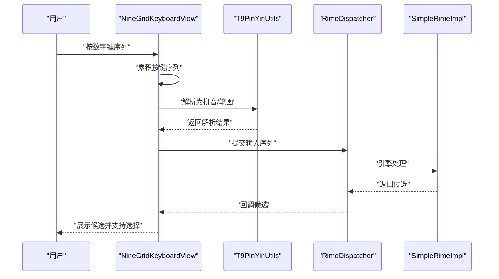
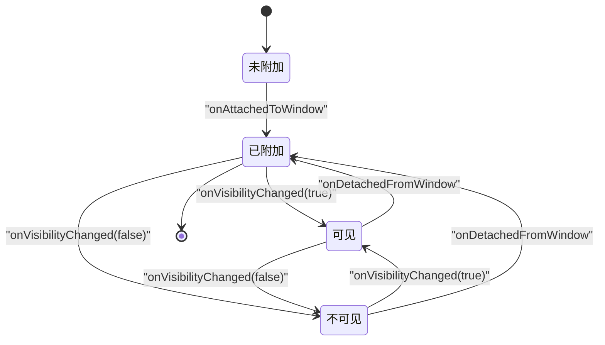
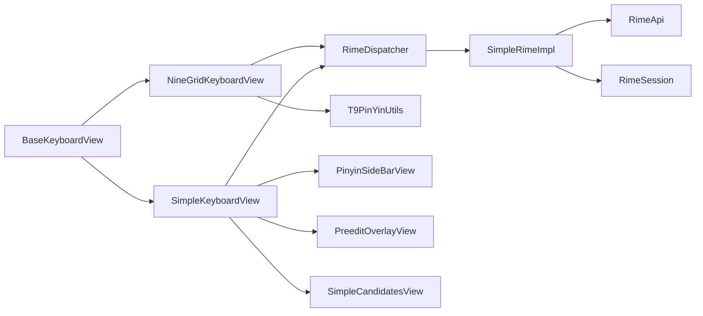

# 键盘视图基础

<cite>
**本文引用的文件**   
- [BaseKeyboardView.kt](file://app/src/main/java/com/ziyou/ime/ime/BaseKeyboardView.kt)
- [SimpleKeyboardView.kt](file://app/src/main/java/com/ziyou/ime/ime/SimpleKeyboardView.kt)
- [NineGridKeyboardView.kt](file://app/src/main/java/com/ziyou/ime/ime/NineGridKeyboardView.kt)
- [KeyCode.kt](file://app/src/main/java/com/ziyou/ime/ime/KeyCode.kt)
- [KeyboardType.kt](file://app/src/main/java/com/ziyou/ime/ime/KeyboardType.kt)
- [PinyinSideBarView.kt](file://app/src/main/java/com/ziyou/ime/ime/PinyinSideBarView.kt)
- [PreeditOverlayView.kt](file://app/src/main/java/com/ziyou/ime/ime/PreeditOverlayView.kt)
- [SimpleCandidatesView.kt](file://app/src/main/java/com/ziyou/ime/ime/SimpleCandidatesView.kt)
- [T9PinYinUtils.kt](file://app/src/main/java/com/ziyou/ime/util/T9PinYinUtils.kt)
- [RimeDispatcher.kt](file://app/src/main/java/com/ziyou/ime/core/RimeDispatcher.kt)
- [SimpleRimeImpl.kt](file://app/src/main/java/com/ziyou/ime/core/SimpleRimeImpl.kt)
- [RimeApi.kt](file://app/src/main/java/com/ziyou/ime/core/RimeApi.kt)
- [RimeMessage.kt](file://app/src/main/java/com/ziyou/ime/core/RimeMessage.kt)
- [ProtoTypes.kt](file://app/src/main/java/com/ziyou/ime/core/ProtoTypes.kt)
- [RimeSession.kt](file://app/src/main/java/com/ziyou/ime/daemon/RimeSession.kt)
- [SimpleRimeInputMethodService.kt](file://app/src/main/java/com/ziyou/ime/ime/SimpleRimeInputMethodService.kt)
</cite>

## 目录
1. [简介](#简介)
2. [项目结构](#项目结构)
3. [核心组件](#核心组件)
4. [架构总览](#架构总览)
5. [详细组件分析](#详细组件分析)
6. [依赖关系分析](#依赖关系分析)
7. [性能考虑](#性能考虑)
8. [故障排查指南](#故障排查指南)
9. [结论](#结论)
10. [附录](#附录)

## 简介
本文件围绕输入法项目的“键盘视图基础”展开，系统性阐述 BaseKeyboardView 的抽象设计、SimpleKeyboardView 的标准键盘实现、NineGridKeyboardView 的九宫格实现，以及键盘视图的生命周期管理、事件分发机制、与 Rime 引擎的集成方式。文档同时提供自定义键盘开发方法、样式配置、性能优化策略和多设备适配方案，并给出完整示例与最佳实践，帮助读者快速掌握键盘视图的开发与扩展。

## 项目结构
本项目采用分层组织：UI 层包含键盘视图与候选词、侧边栏等；core 层封装 Rime 引擎调用与消息调度；daemon 层维护会话；util 层提供工具类（如 T9 拼音工具）。键盘视图相关代码集中在 ime 包下，配合 core 与 util 完成输入逻辑。

**图表来源** 
- [BaseKeyboardView.kt](file://app/src/main/java/com/ziyou/ime/ime/BaseKeyboardView.kt)
- [SimpleKeyboardView.kt](file://app/src/main/java/com/ziyou/ime/ime/SimpleKeyboardView.kt)
- [NineGridKeyboardView.kt](file://app/src/main/java/com/ziyou/ime/ime/NineGridKeyboardView.kt)
- [PinyinSideBarView.kt](file://app/src/main/java/com/ziyou/ime/ime/PinyinSideBarView.kt)
- [PreeditOverlayView.kt](file://app/src/main/java/com/ziyou/ime/ime/PreeditOverlayView.kt)
- [SimpleCandidatesView.kt](file://app/src/main/java/com/ziyou/ime/ime/SimpleCandidatesView.kt)
- [RimeDispatcher.kt](file://app/src/main/java/com/ziyou/ime/core/RimeDispatcher.kt)
- [SimpleRimeImpl.kt](file://app/src/main/java/com/ziyou/ime/core/SimpleRimeImpl.kt)
- [RimeApi.kt](file://app/src/main/java/com/ziyou/ime/core/RimeApi.kt)
- [RimeMessage.kt](file://app/src/main/java/com/ziyou/ime/core/RimeMessage.kt)
- [ProtoTypes.kt](file://app/src/main/java/com/ziyou/ime/core/ProtoTypes.kt)
- [RimeSession.kt](file://app/src/main/java/com/ziyou/ime/daemon/RimeSession.kt)
- [T9PinYinUtils.kt](file://app/src/main/java/com/ziyou/ime/util/T9PinYinUtils.kt)

**章节来源**
- [BaseKeyboardView.kt](file://app/src/main/java/com/ziyou/ime/ime/BaseKeyboardView.kt)
- [SimpleKeyboardView.kt](file://app/src/main/java/com/ziyou/ime/ime/SimpleKeyboardView.kt)
- [NineGridKeyboardView.kt](file://app/src/main/java/com/ziyou/ime/ime/NineGridKeyboardView.kt)

## 核心组件
- BaseKeyboardView：键盘视图抽象基类，定义布局加载、按键绘制、触摸事件分发、状态管理与生命周期钩子。
- SimpleKeyboardView：标准 QWERTY/中文键盘实现，负责按键响应、候选词联动、预编辑区显示与侧边栏交互。
- NineGridKeyboardView：九宫格数字键盘实现，支持数字映射、笔画输入与智能联想（结合 T9 工具）。
- 辅助视图：PinyinSideBarView（拼音侧边栏）、PreeditOverlayView（预编辑覆盖层）、SimpleCandidatesView（候选词列表）。
- 核心集成：RimeDispatcher、SimpleRimeImpl、RimeApi、RimeMessage、ProtoTypes、RimeSession。
- 工具：T9PinYinUtils（T9 拼音转换与联想）。

**章节来源**
- [BaseKeyboardView.kt](file://app/src/main/java/com/ziyou/ime/ime/BaseKeyboardView.kt)
- [SimpleKeyboardView.kt](file://app/src/main/java/com/ziyou/ime/ime/SimpleKeyboardView.kt)
- [NineGridKeyboardView.kt](file://app/src/main/java/com/ziyou/ime/ime/NineGridKeyboardView.kt)
- [PinyinSideBarView.kt](file://app/src/main/java/com/ziyou/ime/ime/PinyinSideBarView.kt)
- [PreeditOverlayView.kt](file://app/src/main/java/com/ziyou/ime/ime/PreeditOverlayView.kt)
- [SimpleCandidatesView.kt](file://app/src/main/java/com/ziyou/ime/ime/SimpleCandidatesView.kt)
- [RimeDispatcher.kt](file://app/src/main/java/com/ziyou/ime/core/RimeDispatcher.kt)
- [SimpleRimeImpl.kt](file://app/src/main/java/com/ziyou/ime/core/SimpleRimeImpl.kt)
- [RimeApi.kt](file://app/src/main/java/com/ziyou/ime/core/RimeApi.kt)
- [RimeMessage.kt](file://app/src/main/java/com/ziyou/ime/core/RimeMessage.kt)
- [ProtoTypes.kt](file://app/src/main/java/com/ziyou/ime/core/ProtoTypes.kt)
- [RimeSession.kt](file://app/src/main/java/com/ziyou/ime/daemon/RimeSession.kt)
- [T9PinYinUtils.kt](file://app/src/main/java/com/ziyou/ime/util/T9PinYinUtils.kt)

## 架构总览
键盘视图通过抽象基类统一事件分发与渲染流程，具体键盘类型继承后实现差异化行为。输入事件经键盘视图处理后，交由 Rime 引擎进行文本处理与候选生成，再通过回调更新 UI。

**图表来源** 
- [BaseKeyboardView.kt](file://app/src/main/java/com/ziyou/ime/ime/BaseKeyboardView.kt)
- [SimpleKeyboardView.kt](file://app/src/main/java/com/ziyou/ime/ime/SimpleKeyboardView.kt)
- [NineGridKeyboardView.kt](file://app/src/main/java/com/ziyou/ime/ime/NineGridKeyboardView.kt)
- [RimeDispatcher.kt](file://app/src/main/java/com/ziyou/ime/core/RimeDispatcher.kt)
- [SimpleRimeImpl.kt](file://app/src/main/java/com/ziyou/ime/core/SimpleRimeImpl.kt)
- [RimeSession.kt](file://app/src/main/java/com/ziyou/ime/daemon/RimeSession.kt)

## 详细组件分析

### BaseKeyboardView：抽象设计与事件分发
- 职责
  - 键盘布局加载与绘制：从资源或数据模型构建按键网格，计算尺寸与位置。
  - 触摸事件分发：onTouchEvent 中识别点击、长按、滑动手势，分发给对应按键或全局操作。
  - 按键行为抽象：定义 onKeyAction、onLongPress、onSwipe 等回调，供子类实现。
  - 状态管理：维护当前模式（字母/符号/数字）、焦点按键、动画状态。
  - 生命周期钩子：onAttachedToWindow、onDetachedFromWindow、onVisibilityChanged 等，用于资源初始化与释放。
- 关键设计点
  - 解耦布局与行为：布局数据与绘制分离，便于动态切换主题与布局。
  - 事件优先级：长按优先于点击，滑动优先于多次点击，避免误触。
  - 可扩展性：通过接口回调与枚举类型（如 KeyCode、KeyboardType）扩展新按键与模式。

**图表来源** 
- [BaseKeyboardView.kt](file://app/src/main/java/com/ziyou/ime/ime/BaseKeyboardView.kt)
- [KeyCode.kt](file://app/src/main/java/com/ziyou/ime/ime/KeyCode.kt)
- [KeyboardType.kt](file://app/src/main/java/com/ziyou/ime/ime/KeyboardType.kt)

**章节来源**
- [BaseKeyboardView.kt](file://app/src/main/java/com/ziyou/ime/ime/BaseKeyboardView.kt)
- [KeyCode.kt](file://app/src/main/java/com/ziyou/ime/ime/KeyCode.kt)
- [KeyboardType.kt](file://app/src/main/java/com/ziyou/ime/ime/KeyboardType.kt)

### SimpleKeyboardView：标准键盘实现
- 职责
  - 标准布局：QWERTY/中文布局，支持大小写切换、符号面板、空格与回车。
  - 按键响应：字符输入、退格、换行、切换模式等。
  - 状态管理：当前语言模式、候选词列表、预编辑字符串、侧边栏可见性。
  - 联动视图：与 PinyinSideBarView、PreeditOverlayView、SimpleCandidatesView 协作。
- 关键流程
  - 按键事件 -> 更新预编辑 -> 请求候选 -> 刷新候选列表 -> 用户选择 -> 提交文本。

**图表来源** 
- [SimpleKeyboardView.kt](file://app/src/main/java/com/ziyou/ime/ime/SimpleKeyboardView.kt)
- [PinyinSideBarView.kt](file://app/src/main/java/com/ziyou/ime/ime/PinyinSideBarView.kt)
- [PreeditOverlayView.kt](file://app/src/main/java/com/ziyou/ime/ime/PreeditOverlayView.kt)
- [SimpleCandidatesView.kt](file://app/src/main/java/com/ziyou/ime/ime/SimpleCandidatesView.kt)

**章节来源**
- [SimpleKeyboardView.kt](file://app/src/main/java/com/ziyou/ime/ime/SimpleKeyboardView.kt)
- [PinyinSideBarView.kt](file://app/src/main/java/com/ziyou/ime/ime/PinyinSideBarView.kt)
- [PreeditOverlayView.kt](file://app/src/main/java/com/ziyou/ime/ime/PreeditOverlayView.kt)
- [SimpleCandidatesView.kt](file://app/src/main/java/com/ziyou/ime/ime/SimpleCandidatesView.kt)

### NineGridKeyboardView：九宫格实现
- 职责
  - 数字映射：将物理按键映射到字母集合（传统 T9 布局）。
  - 笔画输入：支持手写笔画序列转换为汉字。
  - 智能联想：结合 T9PinYinUtils 进行拼音联想与候选排序。
- 关键流程
  - 按键序列收集 -> 拼音/笔画解析 -> 候选生成 -> 高亮与选择 -> 提交。

**图表来源** 
- [NineGridKeyboardView.kt](file://app/src/main/java/com/ziyou/ime/ime/NineGridKeyboardView.kt)
- [T9PinYinUtils.kt](file://app/src/main/java/com/ziyou/ime/util/T9PinYinUtils.kt)
- [RimeDispatcher.kt](file://app/src/main/java/com/ziyou/ime/core/RimeDispatcher.kt)
- [SimpleRimeImpl.kt](file://app/src/main/java/com/ziyou/ime/core/SimpleRimeImpl.kt)

**章节来源**
- [NineGridKeyboardView.kt](file://app/src/main/java/com/ziyou/ime/ime/NineGridKeyboardView.kt)
- [T9PinYinUtils.kt](file://app/src/main/java/com/ziyou/ime/util/T9PinYinUtils.kt)

### 键盘视图生命周期管理
- 初始化阶段
  - onAttachedToWindow：加载布局、初始化 keyMap、注册监听器。
  - onVisibilityChanged：根据可见性控制渲染与事件处理。
- 运行阶段
  - onTouchEvent：分发触摸事件，更新状态与 UI。
  - onDraw：绘制按键、高亮、动画效果。
- 销毁阶段
  - onDetachedFromWindow：释放资源、取消回调、清理缓存。

**图表来源** 
- [BaseKeyboardView.kt](file://app/src/main/java/com/ziyou/ime/ime/BaseKeyboardView.kt)

**章节来源**
- [BaseKeyboardView.kt](file://app/src/main/java/com/ziyou/ime/ime/BaseKeyboardView.kt)

### 自定义键盘开发方法
- 布局文件定义
  - 使用 XML 或数据模型定义按键网格、行列数、按键属性（标签、图标、动作）。
  - 在 BaseKeyboardView 中通过布局管理器加载并生成 keyMap。
- 按键行为定制
  - 重写 onKeyAction、onLongPress、onSwipe，实现特殊按键逻辑（如快捷短语、宏命令）。
  - 通过 KeyCode 与 KeyboardType 扩展新类型与模式。
- 样式配置
  - 主题资源（颜色、字体、间距）通过 ThemeManager 或资源文件注入。
  - 支持动态切换布局与主题，无需重启。

**章节来源**
- [BaseKeyboardView.kt](file://app/src/main/java/com/ziyou/ime/ime/BaseKeyboardView.kt)
- [KeyCode.kt](file://app/src/main/java/com/ziyou/ime/ime/KeyCode.kt)
- [KeyboardType.kt](file://app/src/main/java/com/ziyou/ime/ime/KeyboardType.kt)

## 依赖关系分析
键盘视图依赖核心层进行文本处理与候选生成，依赖工具层进行特定算法（如 T9 拼音），并通过 IME Service 与系统输入框架交互。

**图表来源** 
- [BaseKeyboardView.kt](file://app/src/main/java/com/ziyou/ime/ime/BaseKeyboardView.kt)
- [SimpleKeyboardView.kt](file://app/src/main/java/com/ziyou/ime/ime/SimpleKeyboardView.kt)
- [NineGridKeyboardView.kt](file://app/src/main/java/com/ziyou/ime/ime/NineGridKeyboardView.kt)
- [RimeDispatcher.kt](file://app/src/main/java/com/ziyou/ime/core/RimeDispatcher.kt)
- [SimpleRimeImpl.kt](file://app/src/main/java/com/ziyou/ime/core/SimpleRimeImpl.kt)
- [RimeApi.kt](file://app/src/main/java/com/ziyou/ime/core/RimeApi.kt)
- [RimeSession.kt](file://app/src/main/java/com/ziyou/ime/daemon/RimeSession.kt)
- [T9PinYinUtils.kt](file://app/src/main/java/com/ziyou/ime/util/T9PinYinUtils.kt)
- [PinyinSideBarView.kt](file://app/src/main/java/com/ziyou/ime/ime/PinyinSideBarView.kt)
- [PreeditOverlayView.kt](file://app/src/main/java/com/ziyou/ime/ime/PreeditOverlayView.kt)
- [SimpleCandidatesView.kt](file://app/src/main/java/com/ziyou/ime/ime/SimpleCandidatesView.kt)

**章节来源**
- [BaseKeyboardView.kt](file://app/src/main/java/com/ziyou/ime/ime/BaseKeyboardView.kt)
- [SimpleKeyboardView.kt](file://app/src/main/java/com/ziyou/ime/ime/SimpleKeyboardView.kt)
- [NineGridKeyboardView.kt](file://app/src/main/java/com/ziyou/ime/ime/NineGridKeyboardView.kt)
- [RimeDispatcher.kt](file://app/src/main/java/com/ziyou/ime/core/RimeDispatcher.kt)
- [SimpleRimeImpl.kt](file://app/src/main/java/com/ziyou/ime/core/SimpleRimeImpl.kt)
- [RimeApi.kt](file://app/src/main/java/com/ziyou/ime/core/RimeApi.kt)
- [RimeSession.kt](file://app/src/main/java/com/ziyou/ime/daemon/RimeSession.kt)
- [T9PinYinUtils.kt](file://app/src/main/java/com/ziyou/ime/util/T9PinYinUtils.kt)
- [PinyinSideBarView.kt](file://app/src/main/java/com/ziyou/ime/ime/PinyinSideBarView.kt)
- [PreeditOverlayView.kt](file://app/src/main/java/com/ziyou/ime/ime/PreeditOverlayView.kt)
- [SimpleCandidatesView.kt](file://app/src/main/java/com/ziyou/ime/ime/SimpleCandidatesView.kt)

## 性能考虑
- 渲染优化
  - 减少重绘：仅在状态变化时触发 onDraw，合并绘制路径。
  - 离屏缓存：对复杂背景或动画使用 Bitmap 缓存。
- 事件处理优化
  - 事件节流：长按与滑动去抖，避免频繁回调。
  - 异步处理：候选生成与网络请求（如有）放入后台线程，主线程仅更新 UI。
- 内存管理
  - 及时释放：onDetachedFromWindow 中清理大对象与监听器。
  - 对象复用：按键对象、位图资源池化。
- 多设备适配
  - 屏幕密度适配：dp/sp 单位，动态计算按键尺寸。
  - 横竖屏切换：重新布局与状态恢复。

[本节为通用指导，不直接分析具体文件]

## 故障排查指南
- 常见问题
  - 按键无响应：检查 onTouchEvent 分发逻辑与 keyMap 是否正确加载。
  - 候选不更新：确认 RimeDispatcher 回调是否被正确接收与处理。
  - 内存泄漏：确保在 onDetachedFromWindow 中释放资源与取消回调。
- 调试建议
  - 日志输出：在关键路径添加日志（按键、候选、回调）。
  - 单元测试：对按键解析、T9 转换、候选生成进行单测验证。

**章节来源**
- [BaseKeyboardView.kt](file://app/src/main/java/com/ziyou/ime/ime/BaseKeyboardView.kt)
- [RimeDispatcher.kt](file://app/src/main/java/com/ziyou/ime/core/RimeDispatcher.kt)
- [SimpleRimeImpl.kt](file://app/src/main/java/com/ziyou/ime/core/SimpleRimeImpl.kt)

## 结论
BaseKeyboardView 提供了统一的键盘抽象与事件分发机制，SimpleKeyboardView 与 NineGridKeyboardView 分别实现了标准键盘与九宫格键盘的典型场景。通过与 Rime 引擎的深度集成，项目实现了高效的输入体验。遵循本文档的设计与最佳实践，可快速扩展自定义键盘并优化性能与适配性。

[本节为总结，不直接分析具体文件]

## 附录
- 完整示例与最佳实践
  - 自定义布局：参考 SimpleKeyboardView 的布局定义方式，使用 XML 或数据模型描述按键。
  - 按键行为：在 onKeyAction 中实现快捷键、宏命令、上下文敏感操作。
  - 样式配置：通过主题资源与 ThemeManager 动态切换外观。
  - 性能调优：使用离屏缓存、事件节流、异步处理提升流畅度。
  - 多设备适配：基于 dp/sp 与屏幕方向动态调整布局。

[本节为补充说明，不直接分析具体文件]