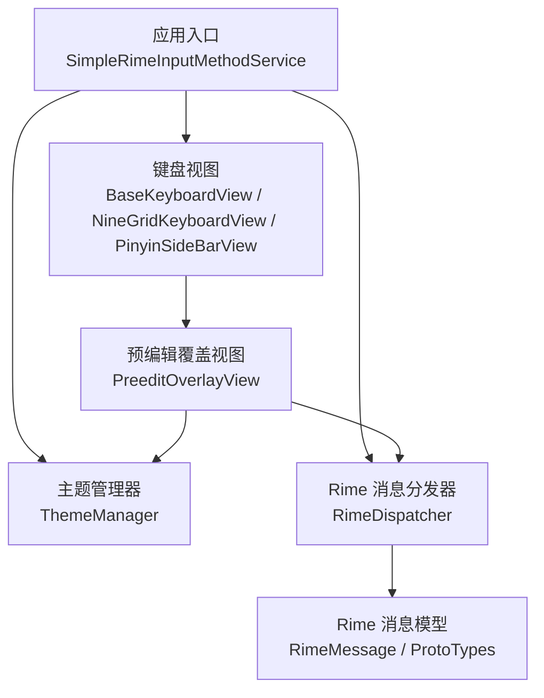
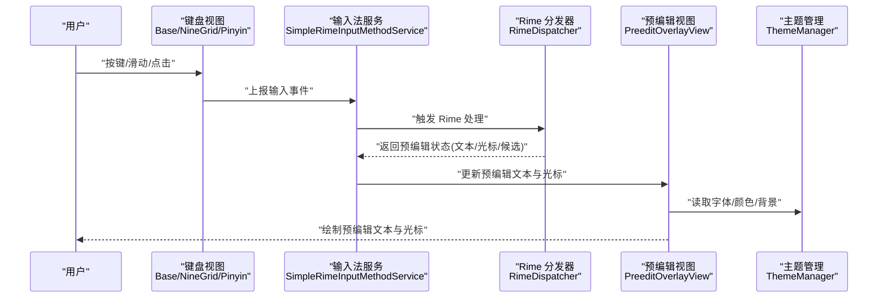
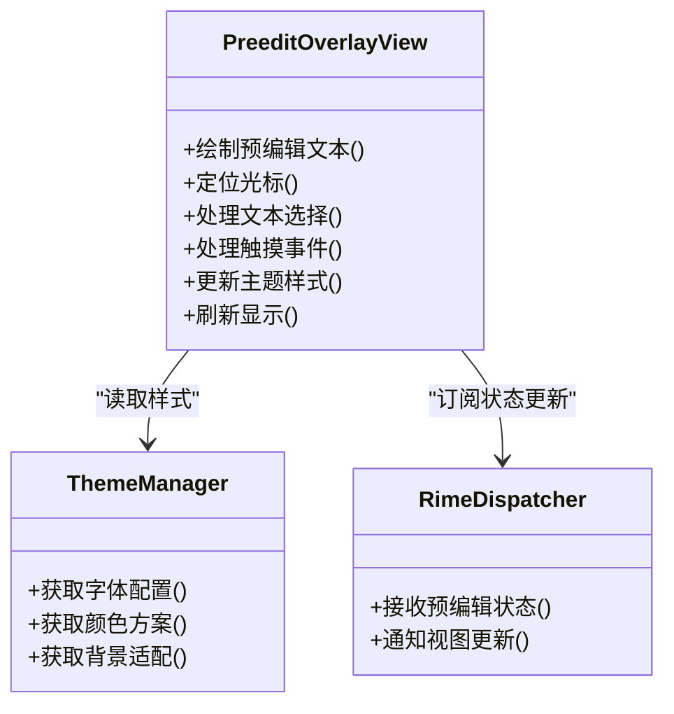
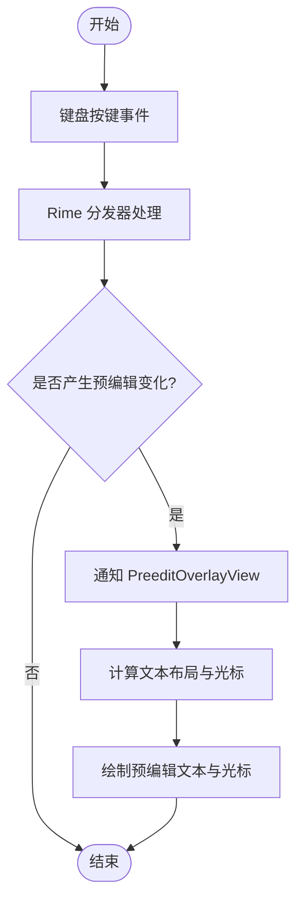
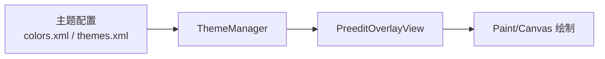
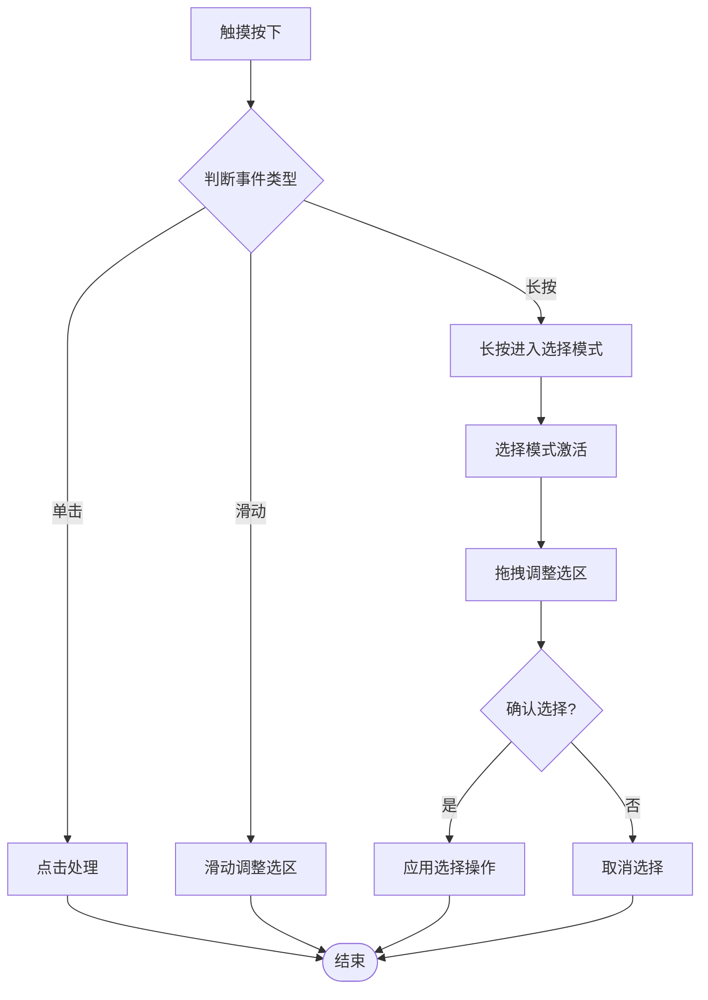
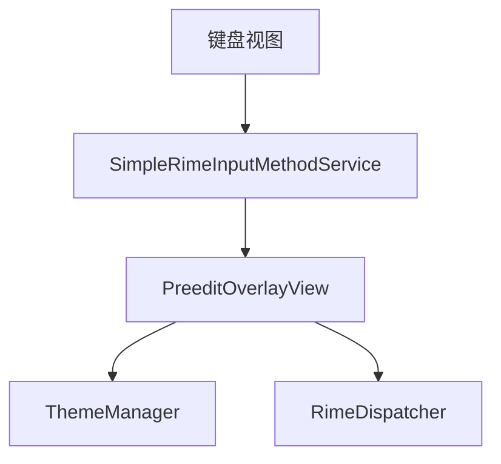

# 预编辑文本视图

<cite>
**本文档引用的文件**   
- [PreeditOverlayView.kt](file://app/src/main/java/com/ziyou/ime/ime/PreeditOverlayView.kt)
- [SimpleRimeInputMethodService.kt](file://app/src/main/java/com/ziyou/ime/ime/SimpleRimeInputMethodService.kt)
- [BaseKeyboardView.kt](file://app/src/main/java/com/ziyou/ime/ime/BaseKeyboardView.kt)
- [NineGridKeyboardView.kt](file://app/src/main/java/com/ziyou/ime/ime/NineGridKeyboardView.kt)
- [PinyinSideBarView.kt](file://app/src/main/java/com/ziyou/ime/ime/PinyinSideBarView.kt)
- [ThemeManager.kt](file://app/src/main/java/com/ziyou/ime/config/ThemeManager.kt)
- [colors.xml](file://app/src/main/res/values/colors.xml)
- [themes.xml](file://app/src/main/res/values/themes.xml)
- [RimeDispatcher.kt](file://app/src/main/java/com/ziyou/ime/core/RimeDispatcher.kt)
- [RimeMessage.kt](file://app/src/main/java/com/ziyou/ime/core/RimeMessage.kt)
- [ProtoTypes.kt](file://app/src/main/java/com/ziyou/ime/core/ProtoTypes.kt)
</cite>

## 目录
1. [简介](#简介)
2. [项目结构](#项目结构)
3. [核心组件](#核心组件)
4. [架构总览](#架构总览)
5. [详细组件分析](#详细组件分析)
6. [依赖关系分析](#依赖关系分析)
7. [性能考虑](#性能考虑)
8. [故障排查指南](#故障排查指南)
9. [结论](#结论)
10. [附录](#附录)

## 简介
本文件围绕 PreeditOverlayView（预编辑文本覆盖视图）进行系统化文档化，重点解释：
- 预编辑文本的显示机制：文本渲染、光标定位算法与文本选择功能
- 与输入法引擎的交互：实时文本更新、状态同步与事件处理
- 自定义样式配置：字体设置、颜色方案与背景适配
- 性能优化策略：文本缓存、重绘优化与内存管理
- 触摸事件处理、手势识别与用户体验优化
- 具体代码示例与使用模式

## 项目结构
PreeditOverlayView 位于输入法的 UI 层，负责在键盘上方以覆盖方式展示当前正在输入的“预编辑”文本。它与输入法服务、主题管理器以及 Rime 引擎的消息分发层协作，实现从按键到候选词再到预编辑文本的完整链路。

图表来源
- [SimpleRimeInputMethodService.kt](file://app/src/main/java/com/ziyou/ime/ime/SimpleRimeInputMethodService.kt)
- [BaseKeyboardView.kt](file://app/src/main/java/com/ziyou/ime/ime/BaseKeyboardView.kt)
- [NineGridKeyboardView.kt](file://app/src/main/java/com/ziyou/ime/ime/NineGridKeyboardView.kt)
- [PinyinSideBarView.kt](file://app/src/main/java/com/ziyou/ime/ime/PinyinSideBarView.kt)
- [PreeditOverlayView.kt](file://app/src/main/java/com/ziyou/ime/ime/PreeditOverlayView.kt)
- [ThemeManager.kt](file://app/src/main/java/com/ziyou/ime/config/ThemeManager.kt)
- [RimeDispatcher.kt](file://app/src/main/java/com/ziyou/ime/core/RimeDispatcher.kt)
- [RimeMessage.kt](file://app/src/main/java/com/ziyou/ime/core/RimeMessage.kt)
- [ProtoTypes.kt](file://app/src/main/java/com/ziyou/ime/core/ProtoTypes.kt)

章节来源
- [PreeditOverlayView.kt](file://app/src/main/java/com/ziyou/ime/ime/PreeditOverlayView.kt)
- [SimpleRimeInputMethodService.kt](file://app/src/main/java/com/ziyou/ime/ime/SimpleRimeInputMethodService.kt)
- [BaseKeyboardView.kt](file://app/src/main/java/com/ziyou/ime/ime/BaseKeyboardView.kt)
- [NineGridKeyboardView.kt](file://app/src/main/java/com/ziyou/ime/ime/NineGridKeyboardView.kt)
- [PinyinSideBarView.kt](file://app/src/main/java/com/ziyou/ime/ime/PinyinSideBarView.kt)
- [ThemeManager.kt](file://app/src/main/java/com/ziyou/ime/config/ThemeManager.kt)
- [RimeDispatcher.kt](file://app/src/main/java/com/ziyou/ime/core/RimeDispatcher.kt)
- [RimeMessage.kt](file://app/src/main/java/com/ziyou/ime/core/RimeMessage.kt)
- [ProtoTypes.kt](file://app/src/main/java/com/ziyou/ime/core/ProtoTypes.kt)

## 核心组件
- PreeditOverlayView：预编辑文本覆盖视图，负责绘制预编辑字符串、光标位置与选区高亮，并处理用户交互（如长按选择）。
- SimpleRimeInputMethodService：输入法服务，协调键盘视图与预编辑视图，转发 Rime 引擎状态变更。
- ThemeManager：主题与样式管理，提供字体、颜色与背景等配置。
- RimeDispatcher：Rime 消息分发器，统一处理来自 Rime 的状态更新与回调。
- RimeMessage / ProtoTypes：消息与类型定义，承载预编辑文本、光标位置、候选项等数据。

章节来源
- [PreeditOverlayView.kt](file://app/src/main/java/com/ziyou/ime/ime/PreeditOverlayView.kt)
- [SimpleRimeInputMethodService.kt](file://app/src/main/java/com/ziyou/ime/ime/SimpleRimeInputMethodService.kt)
- [ThemeManager.kt](file://app/src/main/java/com/ziyou/ime/config/ThemeManager.kt)
- [RimeDispatcher.kt](file://app/src/main/java/com/ziyou/ime/core/RimeDispatcher.kt)
- [RimeMessage.kt](file://app/src/main/java/com/ziyou/ime/core/RimeMessage.kt)
- [ProtoTypes.kt](file://app/src/main/java/com/ziyou/ime/core/ProtoTypes.kt)

## 架构总览
下图展示了从按键输入到预编辑文本显示的端到端流程，包括键盘视图、预编辑视图、主题管理与 Rime 消息分发。

图表来源
- [SimpleRimeInputMethodService.kt](file://app/src/main/java/com/ziyou/ime/ime/SimpleRimeInputMethodService.kt)
- [BaseKeyboardView.kt](file://app/src/main/java/com/ziyou/ime/ime/BaseKeyboardView.kt)
- [NineGridKeyboardView.kt](file://app/src/main/java/com/ziyou/ime/ime/NineGridKeyboardView.kt)
- [PinyinSideBarView.kt](file://app/src/main/java/com/ziyou/ime/ime/PinyinSideBarView.kt)
- [PreeditOverlayView.kt](file://app/src/main/java/com/ziyou/ime/ime/PreeditOverlayView.kt)
- [ThemeManager.kt](file://app/src/main/java/com/ziyou/ime/config/ThemeManager.kt)
- [RimeDispatcher.kt](file://app/src/main/java/com/ziyou/ime/core/RimeDispatcher.kt)

## 详细组件分析

### PreeditOverlayView：预编辑文本渲染与交互
- 文本渲染
  - 根据主题配置获取字体、字号、字重与颜色，计算文本边界与行高，确保多语言字符正确测量。
  - 支持富文本样式（如加粗、下划线），通过 Paint 属性控制绘制效果。
- 光标定位算法
  - 基于 UTF-16 或 Unicode 码点序列，结合 TextLayout/测量结果，将逻辑光标位置映射到像素坐标。
  - 处理组合字符与双向文本，保证光标在复杂脚本下的准确性。
- 文本选择功能
  - 支持长按进入选择模式，拖拽调整选区起点与终点，选中区域高亮显示。
  - 提供复制、删除等上下文操作（由上层服务决定行为）。
- 触摸事件处理
  - 拦截触摸事件，区分点击、长按、滑动，避免与键盘视图冲突。
  - 在需要时传递回父容器，保持整体交互一致性。

图表来源
- [PreeditOverlayView.kt](file://app/src/main/java/com/ziyou/ime/ime/PreeditOverlayView.kt)
- [ThemeManager.kt](file://app/src/main/java/com/ziyou/ime/config/ThemeManager.kt)
- [RimeDispatcher.kt](file://app/src/main/java/com/ziyou/ime/core/RimeDispatcher.kt)

章节来源
- [PreeditOverlayView.kt](file://app/src/main/java/com/ziyou/ime/ime/PreeditOverlayView.kt)

### 与输入法引擎的交互：实时文本更新、状态同步与事件处理
- 实时文本更新
  - 键盘视图捕获按键后，通过输入法服务调用 Rime 引擎进行处理。
  - Rime 返回预编辑文本、光标位置与候选列表，服务将其推送给 PreeditOverlayView。
- 状态同步
  - 使用消息模型（RimeMessage/ProtoTypes）封装状态，确保跨线程安全与一致性。
  - 视图层仅做最小化更新，避免不必要的重绘。
- 事件处理
  - 支持撤销、确认、取消等命令，由分发器统一调度，确保与引擎状态一致。

图表来源
- [RimeDispatcher.kt](file://app/src/main/java/com/ziyou/ime/core/RimeDispatcher.kt)
- [RimeMessage.kt](file://app/src/main/java/com/ziyou/ime/core/RimeMessage.kt)
- [ProtoTypes.kt](file://app/src/main/java/com/ziyou/ime/core/ProtoTypes.kt)
- [PreeditOverlayView.kt](file://app/src/main/java/com/ziyou/ime/ime/PreeditOverlayView.kt)

章节来源
- [RimeDispatcher.kt](file://app/src/main/java/com/ziyou/ime/core/RimeDispatcher.kt)
- [RimeMessage.kt](file://app/src/main/java/com/ziyou/ime/core/RimeMessage.kt)
- [ProtoTypes.kt](file://app/src/main/java/com/ziyou/ime/core/ProtoTypes.kt)
- [PreeditOverlayView.kt](file://app/src/main/java/com/ziyou/ime/ime/PreeditOverlayView.kt)

### 自定义样式配置：字体、颜色与背景
- 字体设置
  - 通过 ThemeManager 获取字体族、字号、字重与行距，支持动态切换主题。
- 颜色方案
  - 文本前景色、选区高亮色、光标颜色均可配置，适配深色/浅色模式。
- 背景适配
  - 支持半透明背景、圆角与阴影，提升视觉层次与可读性。

图表来源
- [ThemeManager.kt](file://app/src/main/java/com/ziyou/ime/config/ThemeManager.kt)
- [colors.xml](file://app/src/main/res/values/colors.xml)
- [themes.xml](file://app/src/main/res/values/themes.xml)
- [PreeditOverlayView.kt](file://app/src/main/java/com/ziyou/ime/ime/PreeditOverlayView.kt)

章节来源
- [ThemeManager.kt](file://app/src/main/java/com/ziyou/ime/config/ThemeManager.kt)
- [colors.xml](file://app/src/main/res/values/colors.xml)
- [themes.xml](file://app/src/main/res/values/themes.xml)
- [PreeditOverlayView.kt](file://app/src/main/java/com/ziyou/ime/ime/PreeditOverlayView.kt)

### 触摸事件处理、手势识别与用户体验优化
- 触摸事件
  - 区分单击、长按、滑动，避免与键盘视图的事件冲突。
  - 长按进入选择模式，滑动调整选区，点击确认或取消。
- 手势识别
  - 支持双指缩放预览（可选）、快速滚动候选（由其他视图负责）。
- 用户体验优化
  - 延迟绘制与批量更新，减少卡顿。
  - 智能隐藏/显示预编辑视图，避免遮挡关键内容。

图表来源
- [PreeditOverlayView.kt](file://app/src/main/java/com/ziyou/ime/ime/PreeditOverlayView.kt)

章节来源
- [PreeditOverlayView.kt](file://app/src/main/java/com/ziyou/ime/ime/PreeditOverlayView.kt)

### 使用模式与代码示例路径
- 基本用法
  - 在输入法服务中初始化 PreeditOverlayView，绑定主题与 Rime 分发器。
  - 监听键盘事件，更新预编辑文本与光标。
- 高级用法
  - 自定义选择行为（如复制、删除、插入空格）。
  - 扩展手势（如双击跳转单词边界）。
- 示例路径
  - 初始化与绑定：[PreeditOverlayView.kt](file://app/src/main/java/com/ziyou/ime/ime/PreeditOverlayView.kt)
  - 主题配置：[ThemeManager.kt](file://app/src/main/java/com/ziyou/ime/config/ThemeManager.kt)、[colors.xml](file://app/src/main/res/values/colors.xml)、[themes.xml](file://app/src/main/res/values/themes.xml)
  - 状态同步：[RimeDispatcher.kt](file://app/src/main/java/com/ziyou/ime/core/RimeDispatcher.kt)、[RimeMessage.kt](file://app/src/main/java/com/ziyou/ime/core/RimeMessage.kt)、[ProtoTypes.kt](file://app/src/main/java/com/ziyou/ime/core/ProtoTypes.kt)

章节来源
- [PreeditOverlayView.kt](file://app/src/main/java/com/ziyou/ime/ime/PreeditOverlayView.kt)
- [ThemeManager.kt](file://app/src/main/java/com/ziyou/ime/config/ThemeManager.kt)
- [colors.xml](file://app/src/main/res/values/colors.xml)
- [themes.xml](file://app/src/main/res/values/themes.xml)
- [RimeDispatcher.kt](file://app/src/main/java/com/ziyou/ime/core/RimeDispatcher.kt)
- [RimeMessage.kt](file://app/src/main/java/com/ziyou/ime/core/RimeMessage.kt)
- [ProtoTypes.kt](file://app/src/main/java/com/ziyou/ime/core/ProtoTypes.kt)

## 依赖关系分析
PreeditOverlayView 依赖主题管理与 Rime 消息分发器，同时被输入法服务与键盘视图间接引用。

图表来源
- [PreeditOverlayView.kt](file://app/src/main/java/com/ziyou/ime/ime/PreeditOverlayView.kt)
- [ThemeManager.kt](file://app/src/main/java/com/ziyou/ime/config/ThemeManager.kt)
- [RimeDispatcher.kt](file://app/src/main/java/com/ziyou/ime/core/RimeDispatcher.kt)
- [SimpleRimeInputMethodService.kt](file://app/src/main/java/com/ziyou/ime/ime/SimpleRimeInputMethodService.kt)
- [BaseKeyboardView.kt](file://app/src/main/java/com/ziyou/ime/ime/BaseKeyboardView.kt)

章节来源
- [PreeditOverlayView.kt](file://app/src/main/java/com/ziyou/ime/ime/PreeditOverlayView.kt)
- [ThemeManager.kt](file://app/src/main/java/com/ziyou/ime/config/ThemeManager.kt)
- [RimeDispatcher.kt](file://app/src/main/java/com/ziyou/ime/core/RimeDispatcher.kt)
- [SimpleRimeInputMethodService.kt](file://app/src/main/java/com/ziyou/ime/ime/SimpleRimeInputMethodService.kt)
- [BaseKeyboardView.kt](file://app/src/main/java/com/ziyou/ime/ime/BaseKeyboardView.kt)

## 性能考虑
- 文本缓存
  - 对常用字符与布局结果进行缓存，减少重复测量与绘制开销。
- 重绘优化
  - 仅在状态变化时触发局部重绘，避免整屏刷新。
  - 使用无效区域裁剪，限制绘制范围。
- 内存管理
  - 及时释放大对象引用，避免内存泄漏。
  - 使用轻量级数据结构存储临时状态。
- 异步更新
  - 将耗时计算放入后台线程，主线程仅负责渲染。

## 故障排查指南
- 预编辑文本不显示
  - 检查 Rime 分发器是否正确返回预编辑状态。
  - 确认主题配置中的字体与颜色有效。
- 光标位置错误
  - 验证文本编码与测量逻辑，确保组合字符与双向文本正确处理。
- 选择功能异常
  - 检查触摸事件拦截与选择模式切换逻辑。
- 性能问题
  - 启用性能分析工具，定位卡顿点；减少不必要的重绘与对象创建。

章节来源
- [PreeditOverlayView.kt](file://app/src/main/java/com/ziyou/ime/ime/PreeditOverlayView.kt)
- [RimeDispatcher.kt](file://app/src/main/java/com/ziyou/ime/core/RimeDispatcher.kt)
- [ThemeManager.kt](file://app/src/main/java/com/ziyou/ime/config/ThemeManager.kt)

## 结论
PreeditOverlayView 作为输入法预编辑文本的核心视图，实现了高效的文本渲染、精确的光标定位与灵活的文本选择功能。通过与主题管理器与 Rime 分发器的协作，确保了良好的用户体验与可扩展性。在实际使用中，建议关注性能优化与错误处理，以获得更稳定的表现。

## 附录
- 相关资源文件
  - 颜色与主题配置：[colors.xml](file://app/src/main/res/values/colors.xml)、[themes.xml](file://app/src/main/res/values/themes.xml)
- 参考实现
  - 键盘视图基类与实现：[BaseKeyboardView.kt](file://app/src/main/java/com/ziyou/ime/ime/BaseKeyboardView.kt)、[NineGridKeyboardView.kt](file://app/src/main/java/com/ziyou/ime/ime/NineGridKeyboardView.kt)、[PinyinSideBarView.kt](file://app/src/main/java/com/ziyou/ime/ime/PinyinSideBarView.kt)