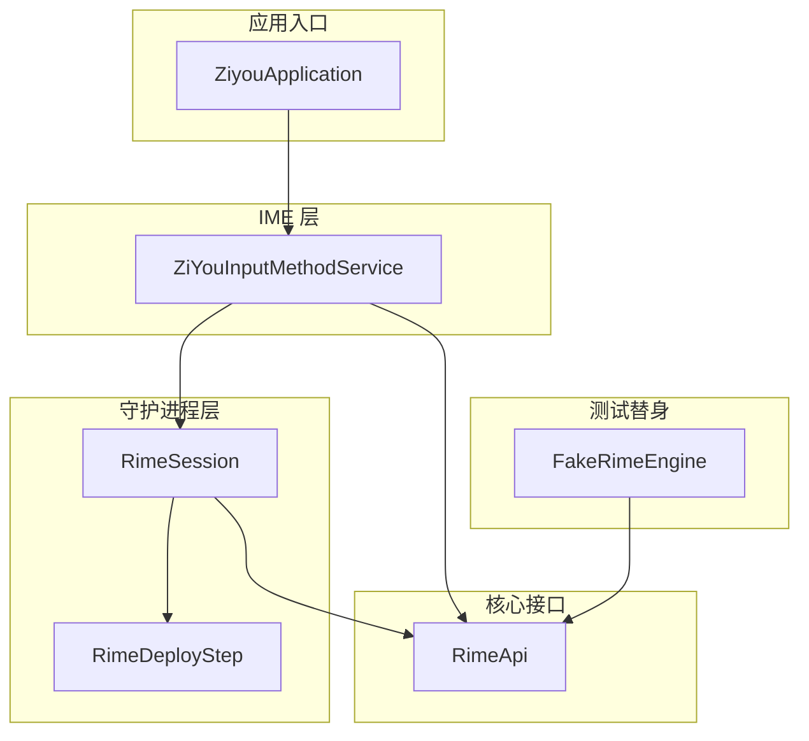
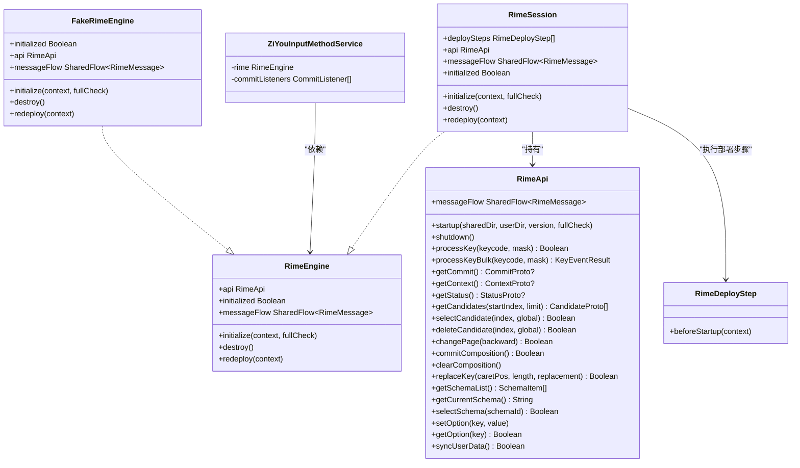
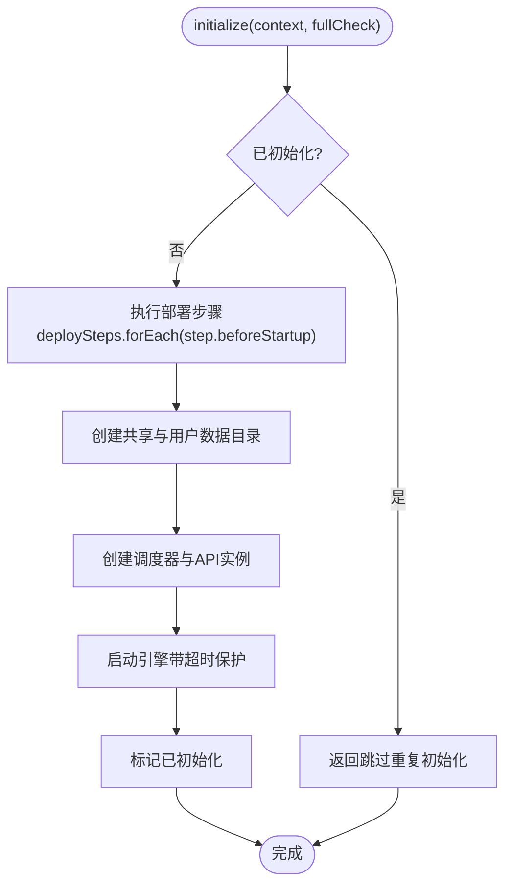
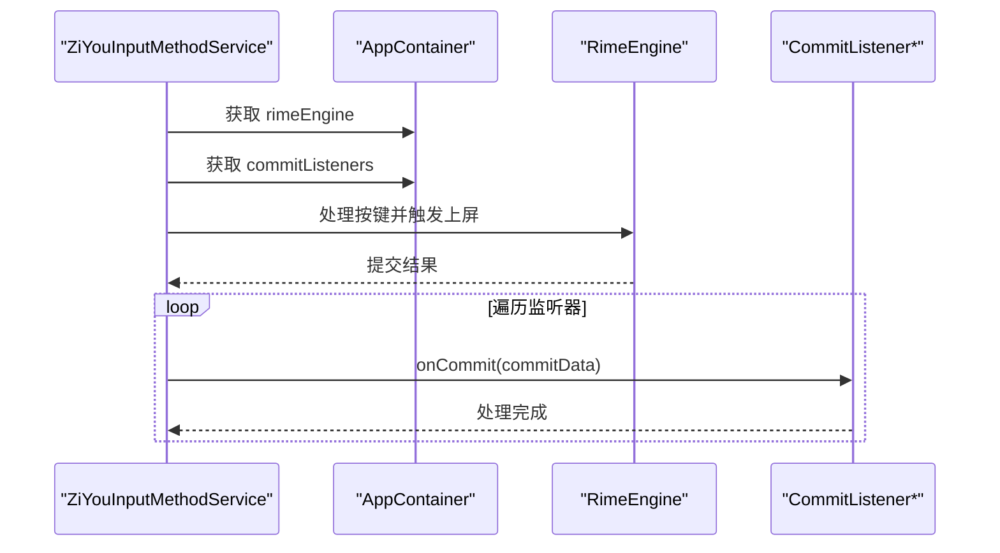
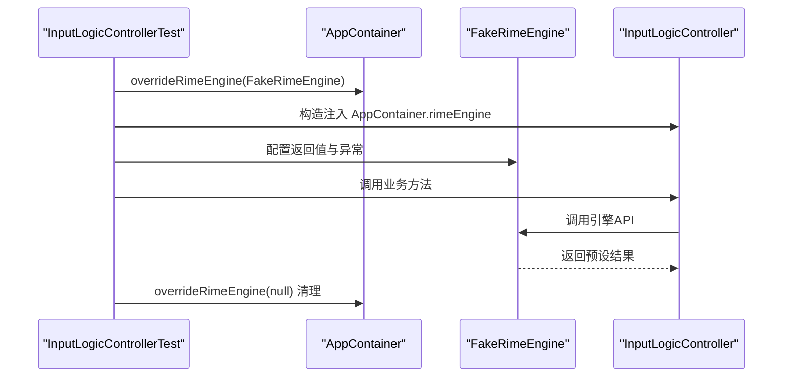
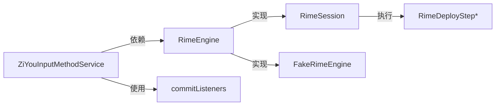

# 依赖注入容器

<cite>
**本文引用的文件**   
- [RimeSession.kt](file://app/src/main/java/com/ziyou/ime/daemon/RimeSession.kt)
- [RimeDeployStep.kt](file://app/src/main/java/com/ziyou/ime/daemon/RimeDeployStep.kt)
- [RimeApi.kt](file://app/src/main/java/com/ziyou/ime/core/RimeApi.kt)
- [ZiYouInputMethodService.kt](file://app/src/main/java/com/ziyou/ime/ime/ZiYouInputMethodService.kt)
- [FakeRimeEngine.kt](file://app/src/test/java/com/ziyou/ime/testing/FakeRimeEngine.kt)
- [InputLogicControllerTest.kt](file://app/src/test/java/com/ziyou/ime/ime/InputLogicControllerTest.kt)
</cite>

## 目录
1. [简介](#简介)
2. [项目结构](#项目结构)
3. [核心组件](#核心组件)
4. [架构总览](#架构总览)
5. [详细组件分析](#详细组件分析)
6. [依赖关系分析](#依赖关系分析)
7. [性能考量](#性能考量)
8. [故障排查指南](#故障排查指南)
9. [结论](#结论)
10. [附录](#附录)

## 简介
本技术文档围绕依赖注入容器的设计与实现展开，重点阐述 AppContainer 组合根模式在输入法引擎装配中的作用。内容涵盖：
- RimeEngine 接口的暴露与默认生产实现的装配
- 测试替身（FakeRimeEngine）的注入机制
- 组合根承担的两项关键装配职责：
  - RimeSession.deploySteps 的部署步骤装配（资源部署 → 扩展词库注入）
  - commitListeners 的上屏监听装配（等级计分等横切关注点）
- 通过 overrideRimeEngine() 方法在测试环境中注入模拟实现
- 使用依赖注入容器获取服务实例与进行单元测试的实践示例

## 项目结构
本项目采用分层组织方式，核心依赖注入相关代码集中在以下位置：
- daemon 层：RimeSession、RimeDeployStep 定义引擎生命周期与部署步骤抽象
- core 层：RimeApi 定义引擎 API 接口
- ime 层：ZiYouInputMethodService 消费 RimeEngine 与 commitListeners
- test 层：FakeRimeEngine 提供可配置的测试替身，配合测试用例完成覆盖

图表来源
- [ZiYouInputMethodService.kt](file://app/src/main/java/com/ziyou/ime/ime/ZiYouInputMethodService.kt)
- [RimeSession.kt](file://app/src/main/java/com/ziyou/ime/daemon/RimeSession.kt)
- [RimeDeployStep.kt](file://app/src/main/java/com/ziyou/ime/daemon/RimeDeployStep.kt)
- [RimeApi.kt](file://app/src/main/java/com/ziyou/ime/core/RimeApi.kt)
- [FakeRimeEngine.kt](file://app/src/test/java/com/ziyou/ime/testing/FakeRimeEngine.kt)

章节来源
- [RimeSession.kt:1-226](file://app/src/main/java/com/ziyou/ime/daemon/RimeSession.kt#L1-L226)
- [RimeApi.kt:1-105](file://app/src/main/java/com/ziyou/ime/core/RimeApi.kt#L1-L105)

## 核心组件
- RimeEngine 接口：对外暴露引擎能力，包括初始化、销毁、重新部署、消息流与 api 访问。该接口由 RimeSession 作为默认生产实现，同时允许测试替身 FakeRimeEngine 替换。
- RimeSession：单例会话管理器，负责引擎生命周期、线程安全、部署步骤执行与目录准备。其 deploySteps 由组合根装配，确保“资源部署 → 扩展词库注入”的顺序。
- RimeApi：定义所有引擎操作为 suspend 函数，屏蔽线程细节；提供 processKeyBulk 热路径优化。
- RimeDeployStep：部署步骤抽象，用于在引擎启动前执行一系列前置任务（如资源复制、词典注入）。
- ZiYouInputMethodService：IME 服务，消费 RimeEngine 与 commitListeners，将上屏事件交由监听器处理（如等级计分）。
- FakeRimeEngine：可配置的测试替身，记录调用历史并支持设置返回值，便于单元测试断言。

章节来源
- [RimeSession.kt:38-110](file://app/src/main/java/com/ziyou/ime/daemon/RimeSession.kt#L38-L110)
- [RimeApi.kt:10-40](file://app/src/main/java/com/ziyou/ime/core/RimeApi.kt#L10-L40)
- [RimeDeployStep.kt:1-20](file://app/src/main/java/com/ziyou/ime/daemon/RimeDeployStep.kt#L1-L20)
- [ZiYouInputMethodService.kt:70-90](file://app/src/main/java/com/ziyou/ime/ime/ZiYouInputMethodService.kt#L70-L90)
- [FakeRimeEngine.kt:21-52](file://app/src/test/java/com/ziyou/ime/testing/FakeRimeEngine.kt#L21-L52)

## 架构总览
依赖注入容器以 AppContainer 为组合根，集中装配 RimeEngine 与 commitListeners，并通过静态访问点向各模块暴露服务。这种设计遵循以下原则：
- 接口抽象：上层仅依赖 RimeEngine 与 RimeApi 接口，不关心具体实现
- 单向依赖：daemon 层不直接依赖业务模块，通过 deploySteps 回调注入
- 解耦：IME 层只依赖接口与监听器列表，避免紧耦合
- 可测试性：通过 overrideRimeEngine() 注入 FakeRimeEngine，隔离外部依赖

图表来源
- [RimeApi.kt:10-105](file://app/src/main/java/com/ziyou/ime/core/RimeApi.kt#L10-L105)
- [RimeSession.kt:38-110](file://app/src/main/java/com/ziyou/ime/daemon/RimeSession.kt#L38-L110)
- [FakeRimeEngine.kt:21-52](file://app/src/test/java/com/ziyou/ime/testing/FakeRimeEngine.kt#L21-L52)
- [RimeDeployStep.kt:1-20](file://app/src/main/java/com/ziyou/ime/daemon/RimeDeployStep.kt#L1-L20)
- [ZiYouInputMethodService.kt:70-90](file://app/src/main/java/com/ziyou/ime/ime/ZiYouInputMethodService.kt#L70-L90)

## 详细组件分析

### RimeSession 与部署步骤装配
RimeSession 是引擎的单例管理者，其关键特性包括：
- 生命周期互斥锁：串行化 initialize/destroy/redeploy，避免并发导致的重复初始化与线程泄漏
- 部署步骤执行：在 IO 线程中按顺序执行 deploySteps，确保资源就绪后再启动引擎
- 超时保护：启动带超时限制，防止长时间阻塞

图表来源
- [RimeSession.kt:88-153](file://app/src/main/java/com/ziyou/ime/daemon/RimeSession.kt#L88-L153)

章节来源
- [RimeSession.kt:88-153](file://app/src/main/java/com/ziyou/ime/daemon/RimeSession.kt#L88-L153)

### commitListeners 上屏监听装配
ZiYouInputMethodService 在构造输入逻辑控制器时，从 AppContainer 获取 commitListeners 列表，将上屏事件交由监听器处理。典型场景包括等级计分、统计上报等横切关注点。

图表来源
- [ZiYouInputMethodService.kt:338-339](file://app/src/main/java/com/ziyou/ime/ime/ZiYouInputMethodService.kt#L338-L339)

章节来源
- [ZiYouInputMethodService.kt:338-339](file://app/src/main/java/com/ziyou/ime/ime/ZiYouInputMethodService.kt#L338-L339)

### 测试替身注入机制
通过 AppContainer.overrideRimeEngine() 方法，可在测试环境中注入 FakeRimeEngine，覆盖默认实现。测试用例展示如何设置返回值、断言调用历史，并清理环境。

图表来源
- [InputLogicControllerTest.kt:35-77](file://app/src/test/java/com/ziyou/ime/ime/InputLogicControllerTest.kt#L35-L77)
- [FakeRimeEngine.kt:21-52](file://app/src/test/java/com/ziyou/ime/testing/FakeRimeEngine.kt#L21-L52)

章节来源
- [InputLogicControllerTest.kt:35-77](file://app/src/test/java/com/ziyou/ime/ime/InputLogicControllerTest.kt#L35-L77)
- [FakeRimeEngine.kt:21-52](file://app/src/test/java/com/ziyou/ime/testing/FakeRimeEngine.kt#L21-L52)

## 依赖关系分析
- 接口抽象：RimeEngine 与 RimeApi 定义稳定契约，上层模块仅依赖接口
- 单向依赖：daemon 层通过 deploySteps 回调注入业务逻辑，避免反向依赖
- 解耦：IME 层通过 AppContainer 获取服务，不关心具体实现
- 可测试性：测试替身完全替代生产实现，支持细粒度控制与断言

图表来源
- [ZiYouInputMethodService.kt:70-90](file://app/src/main/java/com/ziyou/ime/ime/ZiYouInputMethodService.kt#L70-L90)
- [RimeSession.kt:38-110](file://app/src/main/java/com/ziyou/ime/daemon/RimeSession.kt#L38-L110)
- [FakeRimeEngine.kt:21-52](file://app/src/test/java/com/ziyou/ime/testing/FakeRimeEngine.kt#L21-L52)
- [RimeDeployStep.kt:1-20](file://app/src/main/java/com/ziyou/ime/daemon/RimeDeployStep.kt#L1-L20)

章节来源
- [ZiYouInputMethodService.kt:70-90](file://app/src/main/java/com/ziyou/ime/ime/ZiYouInputMethodService.kt#L70-L90)
- [RimeSession.kt:38-110](file://app/src/main/java/com/ziyou/ime/daemon/RimeSession.kt#L38-L110)

## 性能考量
- 部署步骤在 IO 线程执行：避免主线程阻塞，降低 ANR 风险
- 启动超时保护：防止引擎启动过久影响用户体验
- 批量按键处理：processKeyBulk 减少 JNI 跨界次数，提升热路径性能
- 互斥锁串行化：避免并发初始化导致的资源竞争与内存泄漏

## 故障排查指南
- 引擎未初始化异常：检查是否先调用 initialize()，确认 isInitialized 状态
- 启动超时：检查词典文件完整性，适当调整 fullCheck 参数
- 部署步骤失败：查看 beforeStartup 实现，确保资源路径正确
- 测试环境异常：确认 overrideRimeEngine() 是否正确注入与清理

章节来源
- [RimeSession.kt:72-82](file://app/src/main/java/com/ziyou/ime/daemon/RimeSession.kt#L72-L82)
- [RimeSession.kt:134-152](file://app/src/main/java/com/ziyou/ime/daemon/RimeSession.kt#L134-L152)

## 结论
AppContainer 组合根模式通过接口抽象、单向依赖与解耦设计，实现了高内聚、低耦合的依赖注入架构。RimeSession 的部署步骤装配与 commitListeners 的上屏监听装配，体现了横切关注点的清晰分离。测试替身机制确保了系统的可测试性与稳定性。整体设计为输入法引擎提供了可靠、可扩展的基础设施。

## 附录
- 使用依赖注入容器获取服务实例：
  - 在 IME 服务中通过 AppContainer.rimeEngine 获取引擎实例
  - 通过 AppContainer.commitListeners 获取上屏监听器列表
- 单元测试实践：
  - 使用 AppContainer.overrideRimeEngine() 注入 FakeRimeEngine
  - 配置测试替身的返回值与行为，断言调用历史
  - 测试结束后清理注入，恢复默认实现

章节来源
- [ZiYouInputMethodService.kt:74](file://app/src/main/java/com/ziyou/ime/ime/ZiYouInputMethodService.kt#L74)
- [ZiYouInputMethodService.kt:338-339](file://app/src/main/java/com/ziyou/ime/ime/ZiYouInputMethodService.kt#L338-L339)
- [InputLogicControllerTest.kt:57-77](file://app/src/test/java/com/ziyou/ime/ime/InputLogicControllerTest.kt#L57-L77)