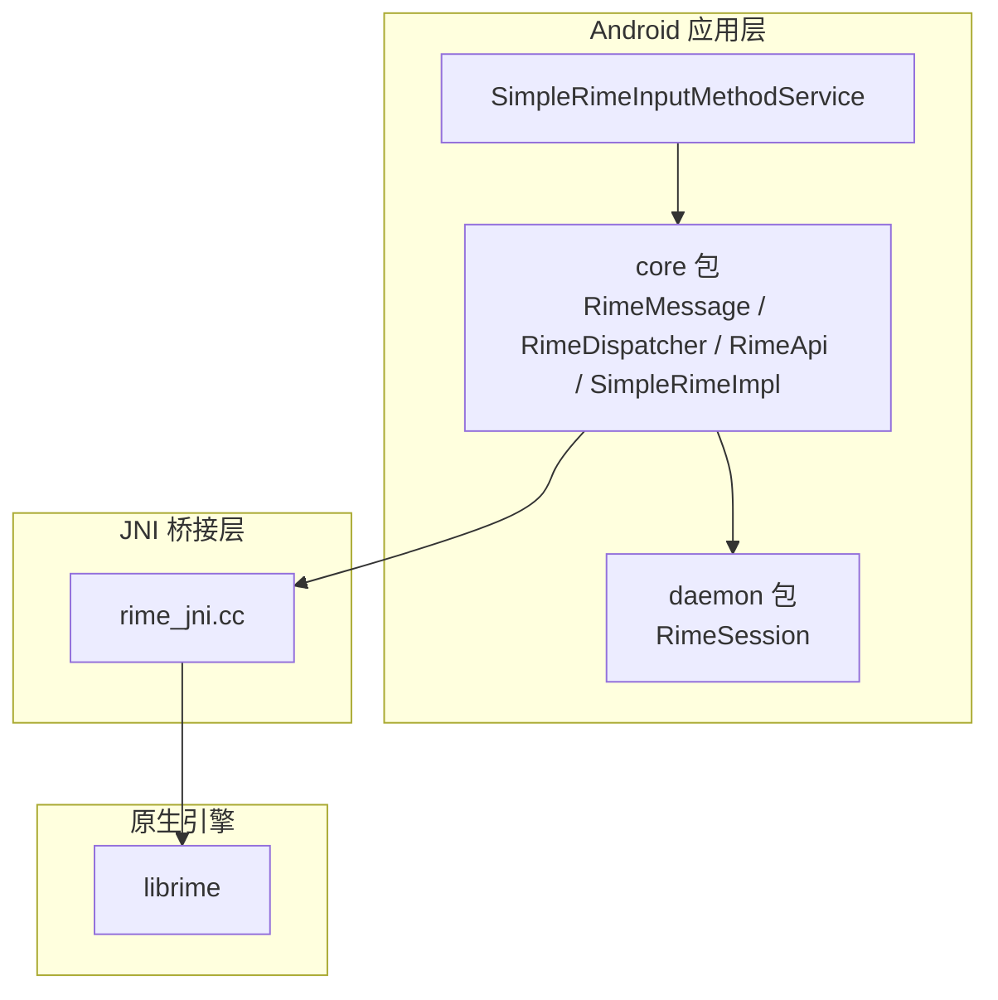
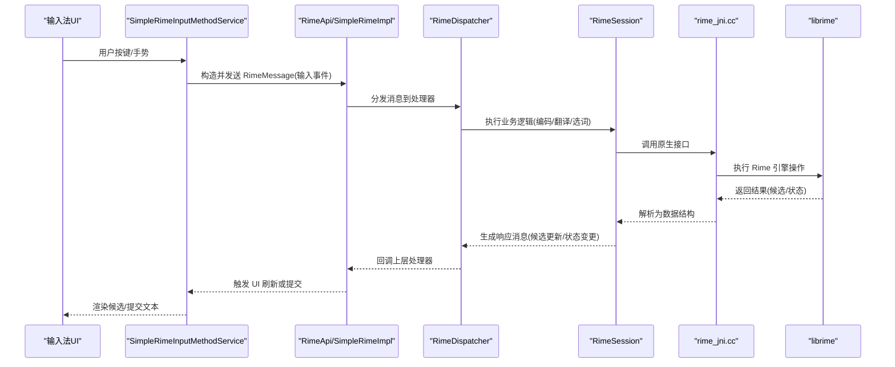
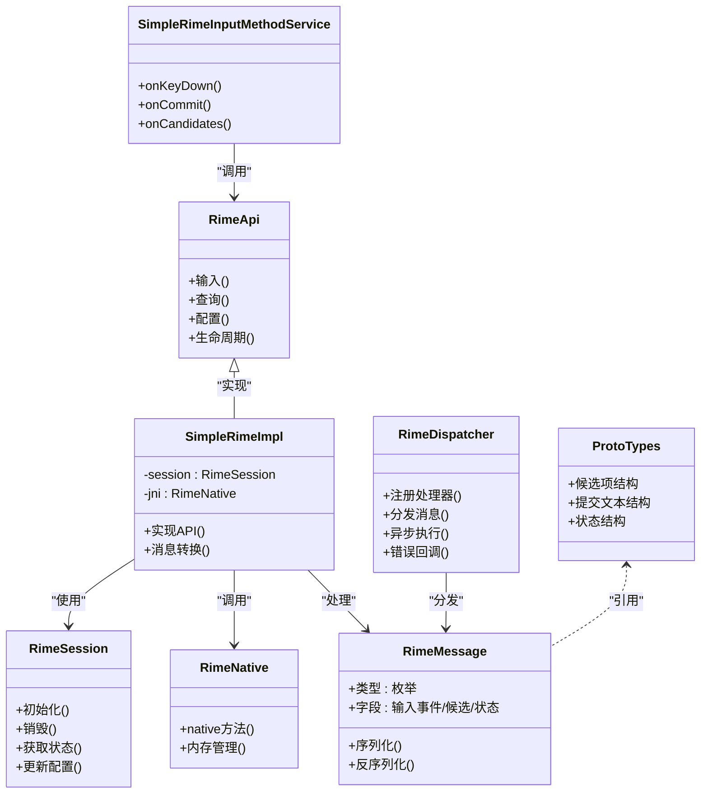

# Rime 消息处理

<cite>
**本文引用的文件**   
- [RimeMessage.kt](file://app/src/main/java/com/ziyou/ime/core/RimeMessage.kt)
- [RimeDispatcher.kt](file://app/src/main/java/com/ziyou/ime/core/RimeDispatcher.kt)
- [RimeApi.kt](file://app/src/main/java/com/ziyou/ime/core/RimeApi.kt)
- [SimpleRimeImpl.kt](file://app/src/main/java/com/ziyou/ime/core/SimpleRimeImpl.kt)
- [RimeNative.kt](file://app/src/main/java/com/ziyou/ime/core/RimeNative.kt)
- [ProtoTypes.kt](file://app/src/main/java/com/ziyou/ime/core/ProtoTypes.kt)
- [RimeSession.kt](file://app/src/main/java/com/ziyou/ime/daemon/RimeSession.kt)
- [SimpleRimeInputMethodService.kt](file://app/src/main/java/com/ziyou/ime/ime/SimpleRimeInputMethodService.kt)
- [rime_jni.cc](file://app/src/main/jni/librime_jni/rime_jni.cc)
</cite>

## 目录
1. [简介](#简介)
2. [项目结构](#项目结构)
3. [核心组件](#核心组件)
4. [架构总览](#架构总览)
5. [详细组件分析](#详细组件分析)
6. [依赖关系分析](#依赖关系分析)
7. [性能考虑](#性能考虑)
8. [故障排查指南](#故障排查指南)
9. [结论](#结论)
10. [附录](#附录)

## 简介
本文件围绕 Android 输入法应用与 Rime 引擎之间的消息通信机制，系统化阐述 RimeMessage 的设计与实现。内容涵盖：
- 消息结构与类型定义（输入事件、候选词更新、状态变更等）
- 消息的发送、接收与处理流程
- 异步消息处理机制与错误处理策略
- 典型使用示例（创建、发送、处理不同类型消息）
- 性能优化建议与调试技巧

目标是帮助开发者快速理解并高效扩展 Rime 在 Android 端的消息体系。

## 项目结构
Android 端通过 Kotlin 层封装 Rime 能力，JNI 层桥接原生 librime。关键路径如下：
- app/src/main/java/com/ziyou/ime/core: 消息模型、分发器、API 抽象与实现、JNI 绑定
- app/src/main/java/com/ziyou/ime/daemon: 会话管理
- app/src/main/java/com/ziyou/ime/ime: 输入法服务与 UI 交互
- app/src/main/jni/librime_jni: JNI 入口与原生调用

图表来源
- [SimpleRimeInputMethodService.kt](file://app/src/main/java/com/ziyou/ime/ime/SimpleRimeInputMethodService.kt)
- [RimeMessage.kt](file://app/src/main/java/com/ziyou/ime/core/RimeMessage.kt)
- [RimeDispatcher.kt](file://app/src/main/java/com/ziyou/ime/core/RimeDispatcher.kt)
- [RimeApi.kt](file://app/src/main/java/com/ziyou/ime/core/RimeApi.kt)
- [SimpleRimeImpl.kt](file://app/src/main/java/com/ziyou/ime/core/SimpleRimeImpl.kt)
- [RimeSession.kt](file://app/src/main/java/com/ziyou/ime/daemon/RimeSession.kt)
- [rime_jni.cc](file://app/src/main/jni/librime_jni/rime_jni.cc)

章节来源
- [RimeMessage.kt](file://app/src/main/java/com/ziyou/ime/core/RimeMessage.kt)
- [RimeDispatcher.kt](file://app/src/main/java/com/ziyou/ime/core/RimeDispatcher.kt)
- [RimeApi.kt](file://app/src/main/java/com/ziyou/ime/core/RimeApi.kt)
- [SimpleRimeImpl.kt](file://app/src/main/java/com/ziyou/ime/core/SimpleRimeImpl.kt)
- [RimeSession.kt](file://app/src/main/java/com/ziyou/ime/daemon/RimeSession.kt)
- [SimpleRimeInputMethodService.kt](file://app/src/main/java/com/ziyou/ime/ime/SimpleRimeInputMethodService.kt)
- [rime_jni.cc](file://app/src/main/jni/librime_jni/rime_jni.cc)

## 核心组件
- RimeMessage: 统一的消息载体，承载输入事件、候选更新、状态变更等语义化数据。
- RimeDispatcher: 消息分发中心，负责将消息路由到对应处理器，支持同步/异步执行与错误回调。
- RimeApi: 对外暴露的 API 抽象，屏蔽底层实现差异。
- SimpleRimeImpl: 默认实现，组合 RimeSession、JNI 调用与消息处理逻辑。
- RimeSession: 会话级上下文，维护 Rime 引擎实例、配置与状态。
- ProtoTypes: 与原生层交互的数据结构定义（如候选项、提交文本等）。
- rime_jni.cc: JNI 入口，将 Java/Kotlin 调用映射到 librime C/C++ API。

章节来源
- [RimeMessage.kt](file://app/src/main/java/com/ziyou/ime/core/RimeMessage.kt)
- [RimeDispatcher.kt](file://app/src/main/java/com/ziyou/ime/core/RimeDispatcher.kt)
- [RimeApi.kt](file://app/src/main/java/com/ziyou/ime/core/RimeApi.kt)
- [SimpleRimeImpl.kt](file://app/src/main/java/com/ziyou/ime/core/SimpleRimeImpl.kt)
- [RimeSession.kt](file://app/src/main/java/com/ziyou/ime/daemon/RimeSession.kt)
- [ProtoTypes.kt](file://app/src/main/java/com/ziyou/ime/core/ProtoTypes.kt)
- [rime_jni.cc](file://app/src/main/jni/librime_jni/rime_jni.cc)

## 架构总览
下图展示从输入法 UI 到 Rime 引擎的消息流转路径，以及返回结果的回调链路。

图表来源
- [SimpleRimeInputMethodService.kt](file://app/src/main/java/com/ziyou/ime/ime/SimpleRimeInputMethodService.kt)
- [RimeApi.kt](file://app/src/main/java/com/ziyou/ime/core/RimeApi.kt)
- [SimpleRimeImpl.kt](file://app/src/main/java/com/ziyou/ime/core/SimpleRimeImpl.kt)
- [RimeDispatcher.kt](file://app/src/main/java/com/ziyou/ime/core/RimeDispatcher.kt)
- [RimeSession.kt](file://app/src/main/java/com/ziyou/ime/daemon/RimeSession.kt)
- [rime_jni.cc](file://app/src/main/jni/librime_jni/rime_jni.cc)

## 详细组件分析

### RimeMessage 消息模型
- 设计目标
  - 统一表达输入法与 Rime 引擎之间的所有交互语义
  - 支持可扩展的消息类型与字段
  - 便于序列化、日志记录与跨线程传递
- 主要类型
  - 输入事件：键码、修饰键、时间戳、来源视图等
  - 候选更新：候选列表、光标位置、预编辑文本
  - 状态变更：模式切换、标点设置、主题/布局变化
  - 控制命令：初始化、销毁、配置重载、缓存清理
- 数据结构要点
  - 使用强类型字段避免歧义
  - 对可选字段提供默认值或空安全访问
  - 对敏感信息（如用户词典路径）进行脱敏或权限校验

章节来源
- [RimeMessage.kt](file://app/src/main/java/com/ziyou/ime/core/RimeMessage.kt)
- [ProtoTypes.kt](file://app/src/main/java/com/ziyou/ime/core/ProtoTypes.kt)

### RimeDispatcher 分发器
- 职责
  - 注册/注销消息处理器
  - 根据消息类型选择处理器
  - 支持同步/异步执行与超时控制
  - 统一异常捕获与错误回调
- 关键特性
  - 线程安全：保证主线程 UI 更新与后台计算分离
  - 优先级：允许高优消息抢占低优任务
  - 幂等性：重复消息可去重或合并
- 错误处理
  - 捕获运行时异常并转换为业务错误码
  - 提供重试策略与降级方案

章节来源
- [RimeDispatcher.kt](file://app/src/main/java/com/ziyou/ime/core/RimeDispatcher.kt)

### RimeApi 与 SimpleRimeImpl
- RimeApi
  - 定义统一的输入、查询、配置、生命周期等方法
  - 屏蔽不同实现细节（如多进程/单进程）
- SimpleRimeImpl
  - 组合 RimeSession 与 JNI 调用
  - 将 RimeMessage 转换为原生参数并解析返回结果
  - 维护会话状态与缓存策略

章节来源
- [RimeApi.kt](file://app/src/main/java/com/ziyou/ime/core/RimeApi.kt)
- [SimpleRimeImpl.kt](file://app/src/main/java/com/ziyou/ime/core/SimpleRimeImpl.kt)

### RimeSession 会话管理
- 职责
  - 持有 Rime 引擎实例与上下文
  - 管理配置加载、插件初始化、资源释放
  - 维护用户词典、历史与统计
- 关键点
  - 线程隔离：确保同一会话在同一线程访问
  - 懒加载：按需初始化重型资源
  - 健康检查：定期检测引擎状态并自动恢复

章节来源
- [RimeSession.kt](file://app/src/main/java/com/ziyou/ime/daemon/RimeSession.kt)

### JNI 桥接 rime_jni.cc
- 职责
  - 暴露 Java/Kotlin 可调用的 native 方法
  - 将 Kotlin 对象映射为 C/C++ 结构体
  - 处理内存管理与异常传播
- 关键点
  - 字符串与字节数组的安全转换
  - 大对象（候选列表）的零拷贝或高效序列化
  - 错误码与异常的对应关系

章节来源
- [rime_jni.cc](file://app/src/main/jni/librime_jni/rime_jni.cc)

### 输入法服务与 UI 集成
- SimpleRimeInputMethodService
  - 监听系统输入事件，构造 RimeMessage 并发送
  - 接收候选更新与提交结果，驱动 UI 渲染
  - 处理焦点切换、软键盘显示/隐藏等生命周期

章节来源
- [SimpleRimeInputMethodService.kt](file://app/src/main/java/com/ziyou/ime/ime/SimpleRimeInputMethodService.kt)

## 依赖关系分析

图表来源
- [RimeMessage.kt](file://app/src/main/java/com/ziyou/ime/core/RimeMessage.kt)
- [RimeDispatcher.kt](file://app/src/main/java/com/ziyou/ime/core/RimeDispatcher.kt)
- [RimeApi.kt](file://app/src/main/java/com/ziyou/ime/core/RimeApi.kt)
- [SimpleRimeImpl.kt](file://app/src/main/java/com/ziyou/ime/core/SimpleRimeImpl.kt)
- [RimeSession.kt](file://app/src/main/java/com/ziyou/ime/daemon/RimeSession.kt)
- [ProtoTypes.kt](file://app/src/main/java/com/ziyou/ime/core/ProtoTypes.kt)
- [SimpleRimeInputMethodService.kt](file://app/src/main/java/com/ziyou/ime/ime/SimpleRimeInputMethodService.kt)

章节来源
- [RimeMessage.kt](file://app/src/main/java/com/ziyou/ime/core/RimeMessage.kt)
- [RimeDispatcher.kt](file://app/src/main/java/com/ziyou/ime/core/RimeDispatcher.kt)
- [RimeApi.kt](file://app/src/main/java/com/ziyou/ime/core/RimeApi.kt)
- [SimpleRimeImpl.kt](file://app/src/main/java/com/ziyou/ime/core/SimpleRimeImpl.kt)
- [RimeSession.kt](file://app/src/main/java/com/ziyou/ime/daemon/RimeSession.kt)
- [ProtoTypes.kt](file://app/src/main/java/com/ziyou/ime/core/ProtoTypes.kt)
- [SimpleRimeInputMethodService.kt](file://app/src/main/java/com/ziyou/ime/ime/SimpleRimeInputMethodService.kt)

## 性能考虑
- 消息批处理
  - 合并高频输入事件，减少 JNI 调用次数
  - 批量更新候选列表，降低 UI 刷新开销
- 异步与线程
  - 将耗时计算放入后台线程，主线程仅做渲染
  - 使用队列限制并发，避免阻塞
- 内存管理
  - 避免频繁分配大对象，复用缓冲区
  - 及时释放 JNI 侧资源，防止泄漏
- 缓存策略
  - 缓存常用配置与词典索引
  - 对热点候选进行局部缓存
- 序列化优化
  - 使用紧凑格式传输候选数据
  - 避免不必要的字符串复制

[本节为通用指导，不直接分析具体文件]

## 故障排查指南
- 常见问题定位
  - 消息未到达：检查分发器注册与线程调度
  - 候选为空：确认输入事件字段完整与 JNI 返回值
  - 崩溃闪退：查看 JNI 异常堆栈与内存越界
- 调试技巧
  - 启用详细日志，记录消息序列与耗时
  - 使用模拟器与真机对比，排除平台差异
  - 断点跟踪 JNI 边界，验证数据结构一致性
- 错误处理策略
  - 统一错误码映射，便于前端提示
  - 提供降级模式（如禁用预测）保障可用性
  - 自动重试与回滚，确保状态一致

章节来源
- [RimeDispatcher.kt](file://app/src/main/java/com/ziyou/ime/core/RimeDispatcher.kt)
- [rime_jni.cc](file://app/src/main/jni/librime_jni/rime_jni.cc)

## 结论
RimeMessage 作为 Android 与 Rime 引擎之间的统一契约，结合 RimeDispatcher 的分发机制与 JNI 桥接，构建了高效、可扩展的消息通信体系。通过合理的异步处理、错误策略与性能优化，可在复杂输入法场景下保持流畅体验。建议持续完善消息类型与监控手段，提升可观测性与可维护性。

[本节为总结性内容，不直接分析具体文件]

## 附录
- 典型使用示例（以代码片段路径代替具体代码）
  - 创建输入事件消息：参考 [RimeMessage.kt](file://app/src/main/java/com/ziyou/ime/core/RimeMessage.kt)
  - 发送消息并处理回调：参考 [RimeDispatcher.kt](file://app/src/main/java/com/ziyou/ime/core/RimeDispatcher.kt)
  - 实现自定义处理器：参考 [SimpleRimeImpl.kt](file://app/src/main/java/com/ziyou/ime/core/SimpleRimeImpl.kt)
  - JNI 数据映射：参考 [rime_jni.cc](file://app/src/main/jni/librime_jni/rime_jni.cc)
  - 输入法服务集成：参考 [SimpleRimeInputMethodService.kt](file://app/src/main/java/com/ziyou/ime/ime/SimpleRimeInputMethodService.kt)

[本节为补充说明，不直接分析具体文件]