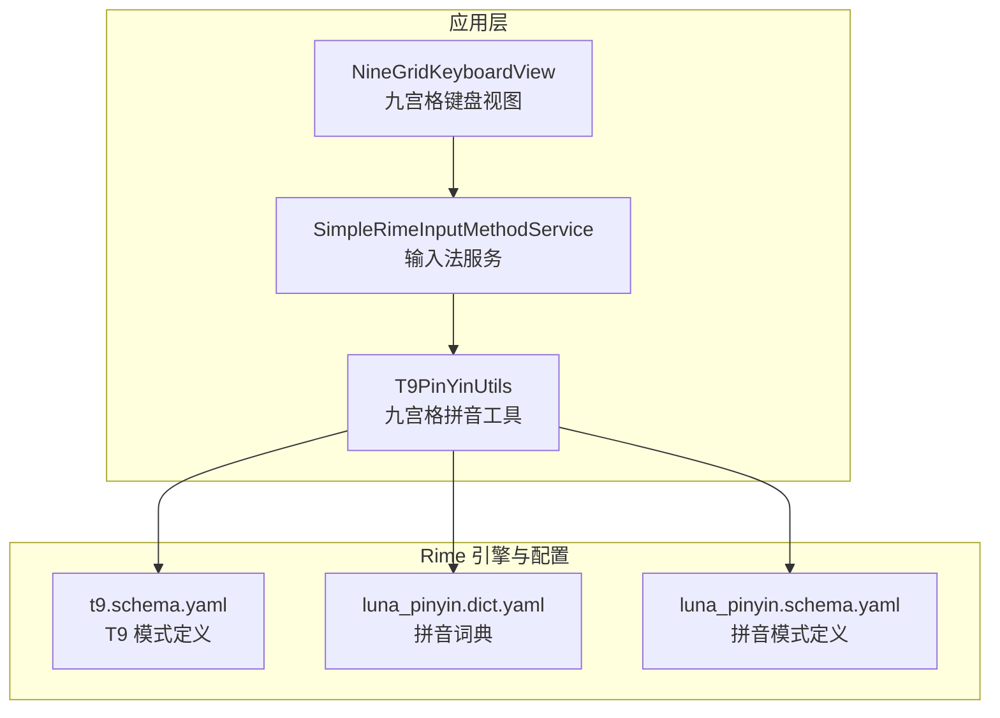
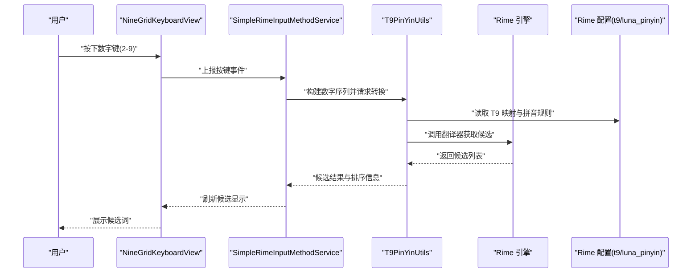
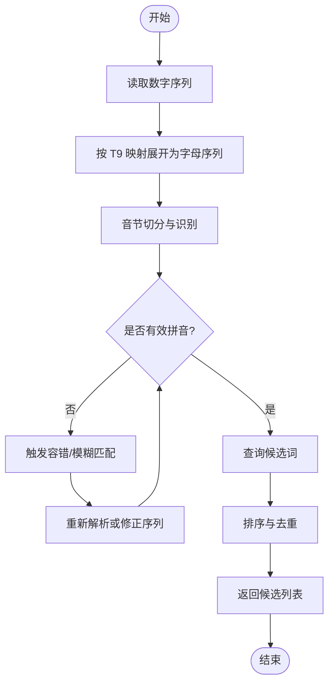
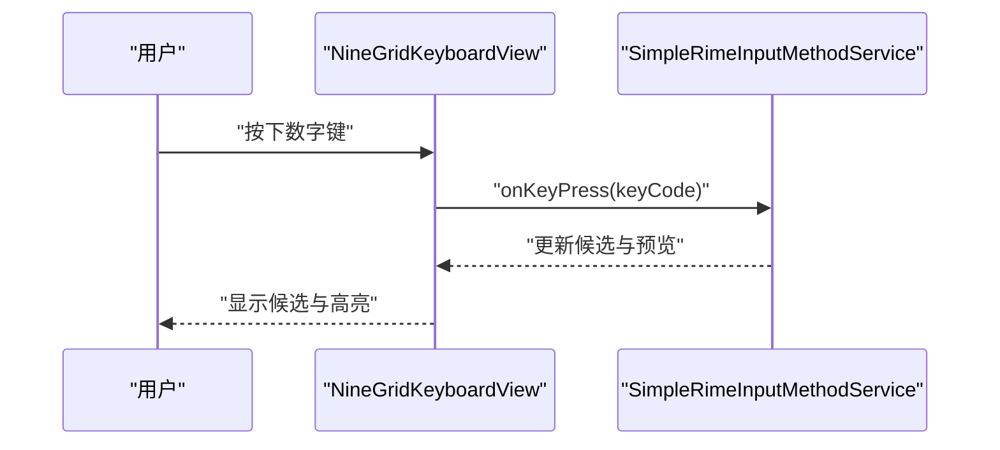
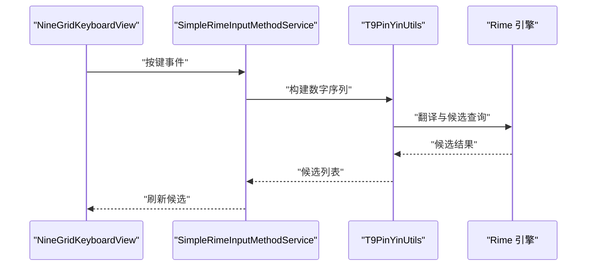
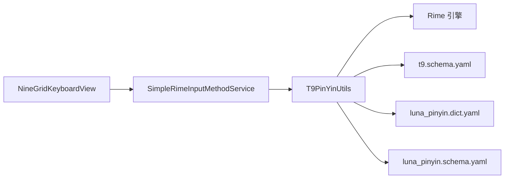

# 九宫格拼音工具

<cite>
**本文引用的文件**   
- [T9PinYinUtils.kt](file://app/src/main/java/com/ziyou/ime/util/T9PinYinUtils.kt)
- [NineGridKeyboardView.kt](file://app/src/main/java/com/ziyou/ime/ime/NineGridKeyboardView.kt)
- [SimpleRimeInputMethodService.kt](file://app/src/main/java/com/ziyou/ime/ime/SimpleRimeInputMethodService.kt)
- [t9.schema.yaml](file://app/src/main/assets/rime/t9.schema.yaml)
- [luna_pinyin.dict.yaml](file://app/src/main/assets/rime/luna_pinyin.dict.yaml)
- [luna_pinyin.schema.yaml](file://app/src/main/assets/rime/luna_pinyin.schema.yaml)
</cite>

## 目录
1. [简介](#简介)
2. [项目结构](#项目结构)
3. [核心组件](#核心组件)
4. [架构总览](#架构总览)
5. [详细组件分析](#详细组件分析)
6. [依赖关系分析](#依赖关系分析)
7. [性能考虑](#性能考虑)
8. [故障排查指南](#故障排查指南)
9. [结论](#结论)
10. [附录](#附录)

## 简介
本文件围绕 T9PinYinUtils 九宫格拼音工具进行系统化文档化，重点解释：
- 数字键位到拼音的映射规则（2-9键对应不同字母组合）
- 智能联想与候选词排序逻辑
- 拼音音节识别、声调处理与特殊字符处理机制
- 用户体验优化策略（快速输入模式、容错处理）
- 使用示例（通过路径引用代码片段位置）
- 性能优化建议与内存管理注意事项

该工具服务于 Android 输入法中的九宫格键盘场景，结合 Rime 引擎与本地配置，实现高效、流畅的中文输入体验。

## 项目结构
本项目采用分层组织方式：
- app 模块包含 UI、IME 服务、资源与 Rime 配置
- core-logic 模块预留核心算法扩展点
- librime-prebuilt 为 Rime 引擎预构建产物与源码参考

与本主题直接相关的核心文件包括：
- util/T9PinYinUtils.kt：九宫格拼音转换与候选生成工具类
- ime/NineGridKeyboardView.kt：九宫格键盘视图与按键事件处理
- ime/SimpleRimeInputMethodService.kt：输入法服务入口，协调 Rime 与 UI
- assets/rime/*.yaml：Rime 模式与词典配置，含 t9.schema.yaml 与 luna_pinyin.*

**图表来源** 
- [NineGridKeyboardView.kt](file://app/src/main/java/com/ziyou/ime/ime/NineGridKeyboardView.kt)
- [SimpleRimeInputMethodService.kt](file://app/src/main/java/com/ziyou/ime/ime/SimpleRimeInputMethodService.kt)
- [T9PinYinUtils.kt](file://app/src/main/java/com/ziyou/ime/util/T9PinYinUtils.kt)
- [t9.schema.yaml](file://app/src/main/assets/rime/t9.schema.yaml)
- [luna_pinyin.dict.yaml](file://app/src/main/assets/rime/luna_pinyin.dict.yaml)
- [luna_pinyin.schema.yaml](file://app/src/main/assets/rime/luna_pinyin.schema.yaml)

**章节来源**
- [T9PinYinUtils.kt](file://app/src/main/java/com/ziyou/ime/util/T9PinYinUtils.kt)
- [NineGridKeyboardView.kt](file://app/src/main/java/com/ziyou/ime/ime/NineGridKeyboardView.kt)
- [SimpleRimeInputMethodService.kt](file://app/src/main/java/com/ziyou/ime/ime/SimpleRimeInputMethodService.kt)
- [t9.schema.yaml](file://app/src/main/assets/rime/t9.schema.yaml)
- [luna_pinyin.dict.yaml](file://app/src/main/assets/rime/luna_pinyin.dict.yaml)
- [luna_pinyin.schema.yaml](file://app/src/main/assets/rime/luna_pinyin.schema.yaml)

## 核心组件
- T9PinYinUtils：封装九宫格数字到拼音的转换、候选词生成、排序与过滤等能力
- NineGridKeyboardView：负责九宫格按键捕获、输入序列构建与 UI 反馈
- SimpleRimeInputMethodService：作为 IME 服务，桥接 UI 与 Rime 引擎，驱动候选更新与提交
- Rime 配置（t9.schema.yaml、luna_pinyin.*）：定义 T9 模式、拼音映射、词典与翻译流程

这些组件共同完成“数字输入 → 拼音解析 → 候选生成 → 用户选择 → 文本提交”的完整链路。

**章节来源**
- [T9PinYinUtils.kt](file://app/src/main/java/com/ziyou/ime/util/T9PinYinUtils.kt)
- [NineGridKeyboardView.kt](file://app/src/main/java/com/ziyou/ime/ime/NineGridKeyboardView.kt)
- [SimpleRimeInputMethodService.kt](file://app/src/main/java/com/ziyou/ime/ime/SimpleRimeInputMethodService.kt)
- [t9.schema.yaml](file://app/src/main/assets/rime/t9.schema.yaml)
- [luna_pinyin.dict.yaml](file://app/src/main/assets/rime/luna_pinyin.dict.yaml)
- [luna_pinyin.schema.yaml](file://app/src/main/assets/rime/luna_pinyin.schema.yaml)

## 架构总览
下图展示从用户按键到候选词呈现的核心数据流与控制流：

**图表来源** 
- [NineGridKeyboardView.kt](file://app/src/main/java/com/ziyou/ime/ime/NineGridKeyboardView.kt)
- [SimpleRimeInputMethodService.kt](file://app/src/main/java/com/ziyou/ime/ime/SimpleRimeInputMethodService.kt)
- [T9PinYinUtils.kt](file://app/src/main/java/com/ziyou/ime/util/T9PinYinUtils.kt)
- [t9.schema.yaml](file://app/src/main/assets/rime/t9.schema.yaml)
- [luna_pinyin.dict.yaml](file://app/src/main/assets/rime/luna_pinyin.dict.yaml)
- [luna_pinyin.schema.yaml](file://app/src/main/assets/rime/luna_pinyin.schema.yaml)

## 详细组件分析

### T9PinYinUtils 工具类
职责概述：
- 数字键位映射：将 2-9 键映射到字母集合（标准 T9 布局）
- 拼音音节识别：基于 Rime 配置与词典，将数字序列转换为合法拼音音节
- 声调与特殊字符处理：支持带调拼音与常见符号的兼容
- 候选词生成与排序：结合频率、上下文与用户习惯进行排序
- 快速输入与容错：提供短序列匹配、模糊匹配与纠错策略

关键流程（算法流程图）：

**图表来源** 
- [T9PinYinUtils.kt](file://app/src/main/java/com/ziyou/ime/util/T9PinYinUtils.kt)
- [t9.schema.yaml](file://app/src/main/assets/rime/t9.schema.yaml)
- [luna_pinyin.dict.yaml](file://app/src/main/assets/rime/luna_pinyin.dict.yaml)
- [luna_pinyin.schema.yaml](file://app/src/main/assets/rime/luna_pinyin.schema.yaml)

要点说明：
- 数字键位映射规则（2-9）：
  - 2: abc, 3: def, 4: ghi, 5: jkl, 6: mno, 7: pqrs, 8: tuv, 9: wxyz
  - 映射表由 T9 配置与工具类内部规则共同决定，确保与标准手机键盘一致
- 拼音音节识别：
  - 依据 luna_pinyin 词典与 schema 定义的音节边界与拼写规则
  - 支持多音字与歧义消解，优先高频音节
- 声调与特殊字符：
  - 允许输入带调拼音（如 ā、á），在候选中保留或归一化为无调形式
  - 对常见标点与符号提供快捷映射
- 候选词排序逻辑：
  - 综合词典频率、历史输入、上下文匹配与用户自定义权重
  - 去重与截断策略保证候选列表长度与响应速度

使用示例（以路径引用代替代码内容）：
- 数字序列转候选：[T9PinYinUtils.kt](file://app/src/main/java/com/ziyou/ime/util/T9PinYinUtils.kt)
- 快速输入模式开关与参数：[T9PinYinUtils.kt](file://app/src/main/java/com/ziyou/ime/util/T9PinYinUtils.kt)
- 容错与模糊匹配策略：[T9PinYinUtils.kt](file://app/src/main/java/com/ziyou/ime/util/T9PinYinUtils.kt)

**章节来源**
- [T9PinYinUtils.kt](file://app/src/main/java/com/ziyou/ime/util/T9PinYinUtils.kt)
- [t9.schema.yaml](file://app/src/main/assets/rime/t9.schema.yaml)
- [luna_pinyin.dict.yaml](file://app/src/main/assets/rime/luna_pinyin.dict.yaml)
- [luna_pinyin.schema.yaml](file://app/src/main/assets/rime/luna_pinyin.schema.yaml)

### NineGridKeyboardView 九宫格键盘视图
职责概述：
- 捕获用户按键事件（数字 2-9、删除、空格等）
- 维护当前输入序列状态，传递给输入法服务
- 渲染候选区域与按键反馈，提升交互体验

交互流程（序列图）：

**图表来源** 
- [NineGridKeyboardView.kt](file://app/src/main/java/com/ziyou/ime/ime/NineGridKeyboardView.kt)
- [SimpleRimeInputMethodService.kt](file://app/src/main/java/com/ziyou/ime/ime/SimpleRimeInputMethodService.kt)

**章节来源**
- [NineGridKeyboardView.kt](file://app/src/main/java/com/ziyou/ime/ime/NineGridKeyboardView.kt)
- [SimpleRimeInputMethodService.kt](file://app/src/main/java/com/ziyou/ime/ime/SimpleRimeInputMethodService.kt)

### SimpleRimeInputMethodService 输入法服务
职责概述：
- 接收来自 UI 的按键事件，构造 Rime 输入上下文
- 调用 T9PinYinUtils 进行转换与候选生成
- 管理候选列表的更新、提交与撤销

控制流（序列图）：

**图表来源** 
- [SimpleRimeInputMethodService.kt](file://app/src/main/java/com/ziyou/ime/ime/SimpleRimeInputMethodService.kt)
- [T9PinYinUtils.kt](file://app/src/main/java/com/ziyou/ime/util/T9PinYinUtils.kt)

**章节来源**
- [SimpleRimeInputMethodService.kt](file://app/src/main/java/com/ziyou/ime/ime/SimpleRimeInputMethodService.kt)
- [T9PinYinUtils.kt](file://app/src/main/java/com/ziyou/ime/util/T9PinYinUtils.kt)

### Rime 配置（t9.schema.yaml、luna_pinyin.*）
- t9.schema.yaml：定义 T9 模式的键位映射、输入规则与翻译管线
- luna_pinyin.dict.yaml：中文词汇与拼音映射的词典数据
- luna_pinyin.schema.yaml：拼音输入的模式定义、音节边界与候选排序策略

这些配置文件直接影响 T9 输入行为与候选质量，需根据实际语言模型与用户需求进行调整。

**章节来源**
- [t9.schema.yaml](file://app/src/main/assets/rime/t9.schema.yaml)
- [luna_pinyin.dict.yaml](file://app/src/main/assets/rime/luna_pinyin.dict.yaml)
- [luna_pinyin.schema.yaml](file://app/src/main/assets/rime/luna_pinyin.schema.yaml)

## 依赖关系分析
T9PinYinUtils 依赖 Rime 引擎与配置，UI 层通过输入法服务间接调用工具类。整体依赖如下：

**图表来源** 
- [NineGridKeyboardView.kt](file://app/src/main/java/com/ziyou/ime/ime/NineGridKeyboardView.kt)
- [SimpleRimeInputMethodService.kt](file://app/src/main/java/com/ziyou/ime/ime/SimpleRimeInputMethodService.kt)
- [T9PinYinUtils.kt](file://app/src/main/java/com/ziyou/ime/util/T9PinYinUtils.kt)
- [t9.schema.yaml](file://app/src/main/assets/rime/t9.schema.yaml)
- [luna_pinyin.dict.yaml](file://app/src/main/assets/rime/luna_pinyin.dict.yaml)
- [luna_pinyin.schema.yaml](file://app/src/main/assets/rime/luna_pinyin.schema.yaml)

**章节来源**
- [T9PinYinUtils.kt](file://app/src/main/java/com/ziyou/ime/util/T9PinYinUtils.kt)
- [NineGridKeyboardView.kt](file://app/src/main/java/com/ziyou/ime/ime/NineGridKeyboardView.kt)
- [SimpleRimeInputMethodService.kt](file://app/src/main/java/com/ziyou/ime/ime/SimpleRimeInputMethodService.kt)
- [t9.schema.yaml](file://app/src/main/assets/rime/t9.schema.yaml)
- [luna_pinyin.dict.yaml](file://app/src/main/assets/rime/luna_pinyin.dict.yaml)
- [luna_pinyin.schema.yaml](file://app/src/main/assets/rime/luna_pinyin.schema.yaml)

## 性能考虑
- 缓存策略：对常用数字序列与候选结果进行短期缓存，减少重复计算
- 增量解析：仅对新增数字进行增量音节切分与候选更新，避免全量重算
- 异步处理：将耗时操作（如词典查询、排序）放入后台线程，主线程仅做 UI 更新
- 内存管理：限制候选列表长度，及时释放中间对象，避免频繁 GC
- 配置加载：Rime 配置与词典在启动时一次性加载，运行时只读访问

[本节为通用性能指导，不直接分析具体文件]

## 故障排查指南
常见问题与定位方法：
- 候选为空或异常：检查 t9.schema.yaml 映射是否正确，确认 luna_pinyin 词典已正确部署
- 输入延迟：查看是否频繁重建候选列表，优化增量解析与缓存命中
- 声调显示异常：核对拼音 schema 中对带调字符的处理逻辑
- 按键事件丢失：确认 NineGridKeyboardView 的事件分发与 Service 的回调链路

**章节来源**
- [t9.schema.yaml](file://app/src/main/assets/rime/t9.schema.yaml)
- [luna_pinyin.dict.yaml](file://app/src/main/assets/rime/luna_pinyin.dict.yaml)
- [luna_pinyin.schema.yaml](file://app/src/main/assets/rime/luna_pinyin.schema.yaml)
- [NineGridKeyboardView.kt](file://app/src/main/java/com/ziyou/ime/ime/NineGridKeyboardView.kt)
- [SimpleRimeInputMethodService.kt](file://app/src/main/java/com/ziyou/ime/ime/SimpleRimeInputMethodService.kt)
- [T9PinYinUtils.kt](file://app/src/main/java/com/ziyou/ime/util/T9PinYinUtils.kt)

## 结论
T9PinYinUtils 作为九宫格拼音输入的核心工具，结合 Rime 引擎与配置，实现了高效的数字到拼音转换与候选生成。通过合理的映射规则、智能排序与容错策略，显著提升了输入体验。在实际使用中，应关注性能优化与内存管理，确保流畅稳定的输入法表现。

[本节为总结性内容，不直接分析具体文件]

## 附录
- 数字键位映射速查（2-9）：
  - 2: abc
  - 3: def
  - 4: ghi
  - 5: jkl
  - 6: mno
  - 7: pqrs
  - 8: tuv
  - 9: wxyz
- 相关配置与实现路径：
  - T9 映射与规则：[t9.schema.yaml](file://app/src/main/assets/rime/t9.schema.yaml)
  - 拼音词典与模式：[luna_pinyin.dict.yaml](file://app/src/main/assets/rime/luna_pinyin.dict.yaml), [luna_pinyin.schema.yaml](file://app/src/main/assets/rime/luna_pinyin.schema.yaml)
  - 工具类实现：[T9PinYinUtils.kt](file://app/src/main/java/com/ziyou/ime/util/T9PinYinUtils.kt)
  - 键盘视图与服务：[NineGridKeyboardView.kt](file://app/src/main/java/com/ziyou/ime/ime/NineGridKeyboardView.kt), [SimpleRimeInputMethodService.kt](file://app/src/main/java/com/ziyou/ime/ime/SimpleRimeInputMethodService.kt)

[本节为补充信息，不直接分析具体文件]