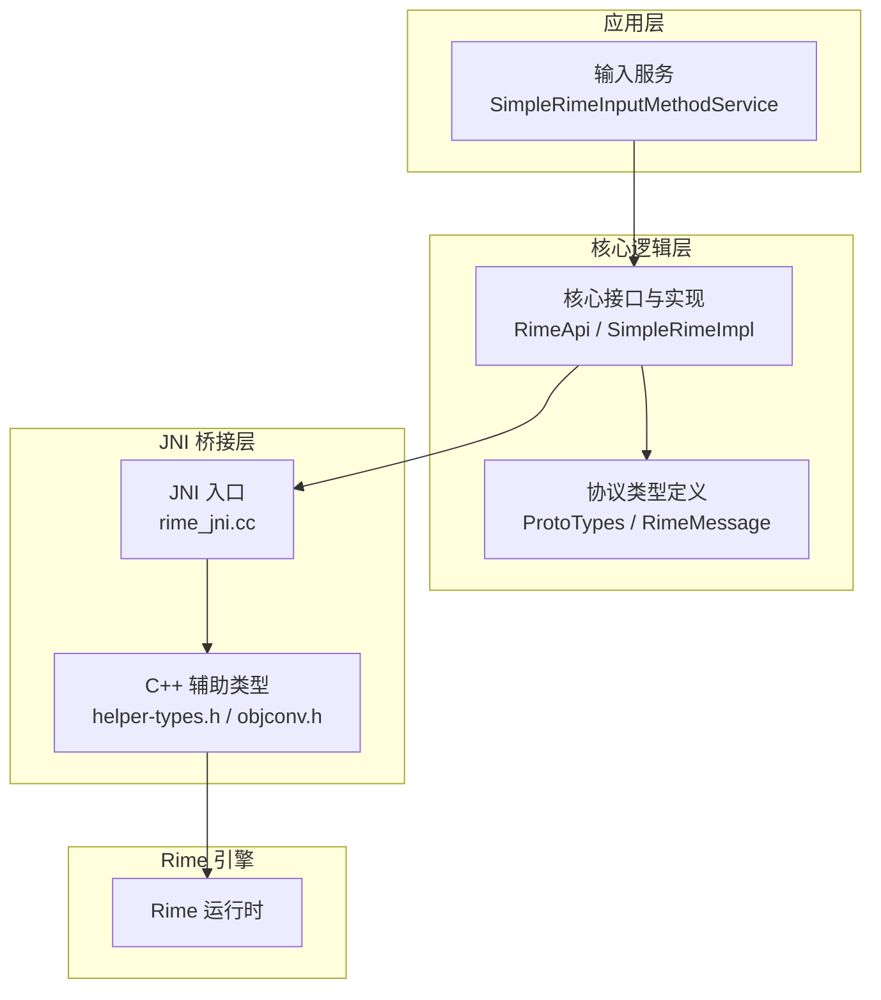
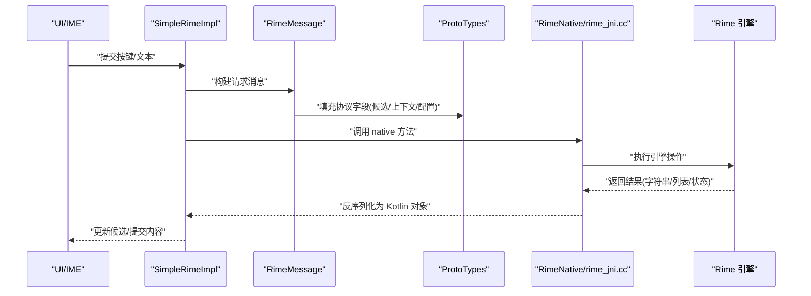
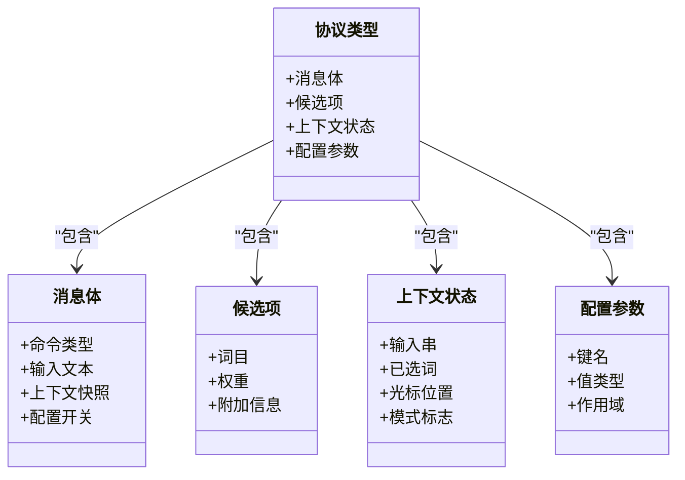
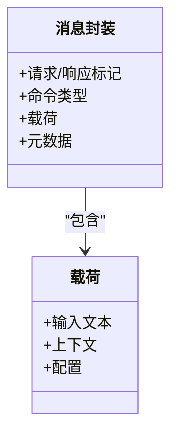
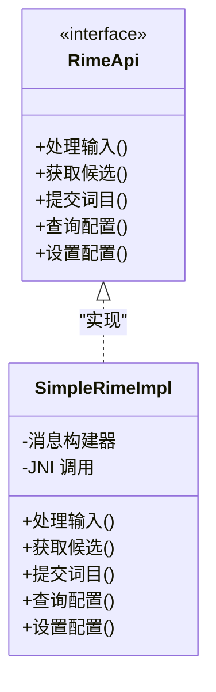
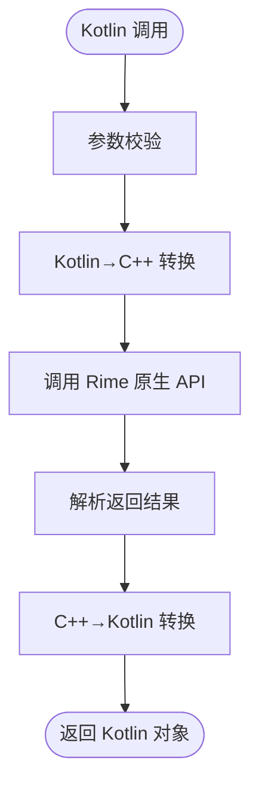
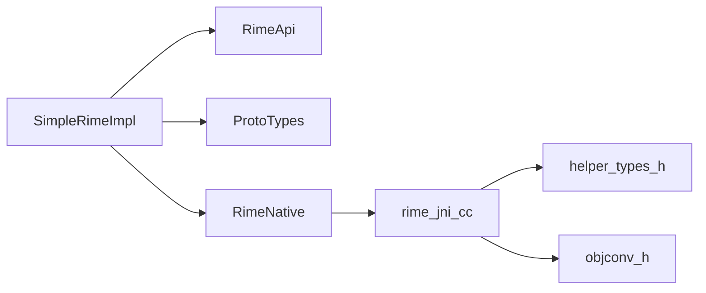

# 协议类型定义

<cite>
**本文档引用的文件**   
- [ProtoTypes.kt](file://app/src/main/java/com/ziyou/ime/core/ProtoTypes.kt)
- [RimeMessage.kt](file://app/src/main/java/com/ziyou/ime/core/RimeMessage.kt)
- [RimeApi.kt](file://app/src/main/java/com/ziyou/ime/core/RimeApi.kt)
- [SimpleRimeImpl.kt](file://app/src/main/java/com/ziyou/ime/core/SimpleRimeImpl.kt)
- [RimeNative.kt](file://app/src/main/java/com/ziyou/ime/core/RimeNative.kt)
- [RimeSession.kt](file://app/src/main/java/com/ziyou/ime/daemon/RimeSession.kt)
- [rime_jni.cc](file://app/src/main/jni/librime_jni/rime_jni.cc)
- [helper-types.h](file://app/src/main/jni/librime_jni/helper-types.h)
- [objconv.h](file://app/src/main/jni/librime_jni/objconv.h)
</cite>

## 目录
1. [简介](#简介)
2. [项目结构](#项目结构)
3. [核心组件](#核心组件)
4. [架构总览](#架构总览)
5. [详细组件分析](#详细组件分析)
6. [依赖关系分析](#依赖关系分析)
7. [性能考虑](#性能考虑)
8. [故障排查指南](#故障排查指南)
9. [结论](#结论)
10. [附录：使用示例与开发指南](#附录使用示例与开发指南)

## 简介
本文件聚焦于输入法项目中“协议类型定义”的设计与实现，围绕 ProtoTypes 及其相关消息、状态枚举、配置参数类型展开。文档将解释数据序列化/反序列化机制、与 Rime 引擎的数据交换格式、类型安全设计与空值处理策略，并给出数据模型之间的关系与依赖说明。同时提供构造与使用这些类型的实践示例，以及扩展自定义类型的开发指南。

## 项目结构
本项目采用分层组织：应用层（IME UI）、核心逻辑层（core）、JNI 桥接层（jni）与 Rime 预编译库。协议类型主要位于 core 模块的 Kotlin 代码中，并通过 JNI 与 C++ 侧的 Rime 交互。

图表来源 
- [RimeApi.kt](file://app/src/main/java/com/ziyou/ime/core/RimeApi.kt)
- [SimpleRimeImpl.kt](file://app/src/main/java/com/ziyou/ime/core/SimpleRimeImpl.kt)
- [ProtoTypes.kt](file://app/src/main/java/com/ziyou/ime/core/ProtoTypes.kt)
- [RimeMessage.kt](file://app/src/main/java/com/ziyou/ime/core/RimeMessage.kt)
- [rime_jni.cc](file://app/src/main/jni/librime_jni/rime_jni.cc)
- [helper-types.h](file://app/src/main/jni/librime_jni/helper-types.h)
- [objconv.h](file://app/src/main/jni/librime_jni/objconv.h)

章节来源
- [ProtoTypes.kt](file://app/src/main/java/com/ziyou/ime/core/ProtoTypes.kt)
- [RimeMessage.kt](file://app/src/main/java/com/ziyou/ime/core/RimeMessage.kt)
- [RimeApi.kt](file://app/src/main/java/com/ziyou/ime/core/RimeApi.kt)
- [SimpleRimeImpl.kt](file://app/src/main/java/com/ziyou/ime/core/SimpleRimeImpl.kt)
- [RimeNative.kt](file://app/src/main/java/com/ziyou/ime/core/RimeNative.kt)
- [RimeSession.kt](file://app/src/main/java/com/ziyou/ime/daemon/RimeSession.kt)
- [rime_jni.cc](file://app/src/main/jni/librime_jni/rime_jni.cc)
- [helper-types.h](file://app/src/main/jni/librime_jni/helper-types.h)
- [objconv.h](file://app/src/main/jni/librime_jni/objconv.h)

## 核心组件
- 协议类型定义（ProtoTypes）：集中定义与 Rime 交互的消息体、候选项、上下文状态、配置键值等数据结构。
- 消息封装（RimeMessage）：对请求/响应进行统一封装，包含命令类型、载荷与可选元数据。
- API 抽象（RimeApi）：对外暴露稳定的输入处理接口，屏蔽底层细节。
- 具体实现（SimpleRimeImpl）：基于 RimeApi 的实现，负责调用 JNI 并与 Rime 会话交互。
- JNI 桥接（RimeNative + rime_jni.cc）：Kotlin 到 C++ 的边界，完成对象转换与调用 Rime 原生 API。
- 会话管理（RimeSession）：维护单次输入会话的状态与生命周期。

章节来源
- [ProtoTypes.kt](file://app/src/main/java/com/ziyou/ime/core/ProtoTypes.kt)
- [RimeMessage.kt](file://app/src/main/java/com/ziyou/ime/core/RimeMessage.kt)
- [RimeApi.kt](file://app/src/main/java/com/ziyou/ime/core/RimeApi.kt)
- [SimpleRimeImpl.kt](file://app/src/main/java/com/ziyou/ime/core/SimpleRimeImpl.kt)
- [RimeNative.kt](file://app/src/main/java/com/ziyou/ime/core/RimeNative.kt)
- [RimeSession.kt](file://app/src/main/java/com/ziyou/ime/daemon/RimeSession.kt)

## 架构总览
下图展示从上层输入事件到 Rime 引擎的数据流与类型转换路径，突出协议类型在序列化和反序列化中的作用。

图表来源 
- [SimpleRimeImpl.kt](file://app/src/main/java/com/ziyou/ime/core/SimpleRimeImpl.kt)
- [RimeMessage.kt](file://app/src/main/java/com/ziyou/ime/core/RimeMessage.kt)
- [ProtoTypes.kt](file://app/src/main/java/com/ziyou/ime/core/ProtoTypes.kt)
- [RimeNative.kt](file://app/src/main/java/com/ziyou/ime/core/RimeNative.kt)
- [rime_jni.cc](file://app/src/main/jni/librime_jni/rime_jni.cc)

## 详细组件分析

### 协议类型（ProtoTypes）
- 职责：定义与 Rime 交互的核心数据结构，包括消息体、候选项、上下文状态、配置键值等。
- 设计要点：
  - 使用不可变数据类或密封类表达强类型约束，避免歧义。
  - 对可能缺失的字段采用可空类型或显式默认值，确保反序列化鲁棒性。
  - 为枚举限定取值范围，防止非法状态进入处理流程。
- 典型成员类别：
  - 消息体：包含命令类型、输入文本、上下文快照、配置开关等。
  - 候选项：词目、权重、附加信息。
  - 上下文状态：当前输入串、已选词、光标位置、模式标志。
  - 配置参数：键名、值类型、作用域（全局/用户/方案）。

图表来源 
- [ProtoTypes.kt](file://app/src/main/java/com/ziyou/ime/core/ProtoTypes.kt)

章节来源
- [ProtoTypes.kt](file://app/src/main/java/com/ziyou/ime/core/ProtoTypes.kt)

### 消息封装（RimeMessage）
- 职责：统一请求/响应的包装，便于跨层传递与日志记录。
- 关键点：
  - 明确区分请求与响应，避免混用。
  - 载荷字段按协议类型严格约束，禁止自由扩展。
  - 支持可选元数据（如时间戳、追踪 ID），用于调试与监控。

图表来源 
- [RimeMessage.kt](file://app/src/main/java/com/ziyou/ime/core/RimeMessage.kt)

章节来源
- [RimeMessage.kt](file://app/src/main/java/com/ziyou/ime/core/RimeMessage.kt)

### API 抽象与实现（RimeApi / SimpleRimeImpl）
- RimeApi：定义稳定接口，如输入处理、获取候选、提交词目、查询/设置配置等。
- SimpleRimeImpl：实现上述接口，内部组装 RimeMessage，调用 JNI 并解析返回结果。
- 错误处理：对异常进行捕获与转换，向上抛出领域语义明确的异常。

图表来源 
- [RimeApi.kt](file://app/src/main/java/com/ziyou/ime/core/RimeApi.kt)
- [SimpleRimeImpl.kt](file://app/src/main/java/com/ziyou/ime/core/SimpleRimeImpl.kt)

章节来源
- [RimeApi.kt](file://app/src/main/java/com/ziyou/ime/core/RimeApi.kt)
- [SimpleRimeImpl.kt](file://app/src/main/java/com/ziyou/ime/core/SimpleRimeImpl.kt)

### JNI 桥接（RimeNative / rime_jni.cc）
- 职责：Kotlin 与 C++ 之间的边界，负责参数校验、对象转换、调用 Rime 原生 API。
- 关键点：
  - 严格的类型映射（Kotlin 类型 ↔ C++ 类型）。
  - 对空指针与越界访问进行防护。
  - 将 Rime 返回的结构转换为 Kotlin 协议类型。

图表来源 
- [RimeNative.kt](file://app/src/main/java/com/ziyou/ime/core/RimeNative.kt)
- [rime_jni.cc](file://app/src/main/jni/librime_jni/rime_jni.cc)
- [helper-types.h](file://app/src/main/jni/librime_jni/helper-types.h)
- [objconv.h](file://app/src/main/jni/librime_jni/objconv.h)

章节来源
- [RimeNative.kt](file://app/src/main/java/com/ziyou/ime/core/RimeNative.kt)
- [rime_jni.cc](file://app/src/main/jni/librime_jni/rime_jni.cc)
- [helper-types.h](file://app/src/main/jni/librime_jni/helper-types.h)
- [objconv.h](file://app/src/main/jni/librime_jni/objconv.h)

### 会话管理（RimeSession）
- 职责：维护一次输入会话的生命周期，保存上下文状态，协调消息流转。
- 关键点：
  - 线程安全：保证并发访问下的状态一致性。
  - 资源清理：会话结束时释放 JNI 资源。
  - 状态回滚：异常时恢复至上一有效状态。

章节来源
- [RimeSession.kt](file://app/src/main/java/com/ziyou/ime/daemon/RimeSession.kt)

## 依赖关系分析
- 耦合关系：
  - SimpleRimeImpl 依赖 RimeApi 接口与 ProtoTypes 类型，通过 RimeNative 调用 JNI。
  - JNI 层依赖 helper-types.h 与 objconv.h 进行类型转换。
- 外部依赖：
  - Rime 引擎提供核心能力，协议类型需与其数据结构保持一致。
- 潜在循环依赖：
  - 通过接口隔离与消息封装避免循环引用。

图表来源 
- [SimpleRimeImpl.kt](file://app/src/main/java/com/ziyou/ime/core/SimpleRimeImpl.kt)
- [RimeApi.kt](file://app/src/main/java/com/ziyou/ime/core/RimeApi.kt)
- [ProtoTypes.kt](file://app/src/main/java/com/ziyou/ime/core/ProtoTypes.kt)
- [RimeNative.kt](file://app/src/main/java/com/ziyou/ime/core/RimeNative.kt)
- [rime_jni.cc](file://app/src/main/jni/librime_jni/rime_jni.cc)
- [helper-types.h](file://app/src/main/jni/librime_jni/helper-types.h)
- [objconv.h](file://app/src/main/jni/librime_jni/objconv.h)

章节来源
- [SimpleRimeImpl.kt](file://app/src/main/java/com/ziyou/ime/core/SimpleRimeImpl.kt)
- [RimeApi.kt](file://app/src/main/java/com/ziyou/ime/core/RimeApi.kt)
- [ProtoTypes.kt](file://app/src/main/java/com/ziyou/ime/core/ProtoTypes.kt)
- [RimeNative.kt](file://app/src/main/java/com/ziyou/ime/core/RimeNative.kt)
- [rime_jni.cc](file://app/src/main/jni/librime_jni/rime_jni.cc)
- [helper-types.h](file://app/src/main/jni/librime_jni/helper-types.h)
- [objconv.h](file://app/src/main/jni/librime_jni/objconv.h)

## 性能考虑
- 对象复用：尽量复用消息与上下文对象，减少 GC 压力。
- 批量处理：合并多次输入事件，降低 JNI 调用频率。
- 序列化优化：避免不必要的深拷贝，按需转换字段。
- 缓存策略：对频繁查询的配置与候选进行短期缓存。

[本节为通用指导，不直接分析具体文件]

## 故障排查指南
- 常见问题：
  - 空指针异常：检查可空字段的默认值与判空逻辑。
  - 类型不匹配：确认 Kotlin 与 C++ 类型映射一致。
  - 状态不一致：核对会话状态机与回滚逻辑。
- 定位手段：
  - 增加日志输出，记录消息结构与关键状态。
  - 使用单元测试覆盖边界条件与异常路径。
  - 在 JNI 层添加断言与错误码，快速定位问题。

章节来源
- [RimeMessage.kt](file://app/src/main/java/com/ziyou/ime/core/RimeMessage.kt)
- [rime_jni.cc](file://app/src/main/jni/librime_jni/rime_jni.cc)

## 结论
本协议类型定义以强类型与不可变性为核心，结合消息封装与 JNI 桥接，构建了与 Rime 引擎稳定、高效且类型安全的交互通道。通过清晰的职责划分与严格的空值处理策略，系统具备良好的可维护性与可扩展性。后续扩展应遵循现有约定，确保类型一致性与向后兼容。

[本节为总结，不直接分析具体文件]

## 附录：使用示例与开发指南

### 构造与使用协议类型
- 构造消息：
  - 创建消息体，填充命令类型、输入文本、上下文快照与配置开关。
  - 将消息体封装为请求消息，附带必要元数据。
- 发送与接收：
  - 通过 SimpleRimeImpl 调用 API，等待返回响应。
  - 解析响应中的候选列表与上下文状态，更新 UI。
- 错误处理：
  - 捕获异常并转换为领域语义明确的错误。
  - 记录日志以便后续分析。

章节来源
- [RimeMessage.kt](file://app/src/main/java/com/ziyou/ime/core/RimeMessage.kt)
- [SimpleRimeImpl.kt](file://app/src/main/java/com/ziyou/ime/core/SimpleRimeImpl.kt)

### 类型安全与空值处理
- 类型安全：
  - 使用枚举限制取值范围，避免非法状态。
  - 使用不可变数据类表达协议字段，防止意外修改。
- 空值处理：
  - 对可选字段使用可空类型并提供默认值。
  - 在 JNI 层进行空指针防护与边界检查。

章节来源
- [ProtoTypes.kt](file://app/src/main/java/com/ziyou/ime/core/ProtoTypes.kt)
- [rime_jni.cc](file://app/src/main/jni/librime_jni/rime_jni.cc)

### 与 Rime 引擎的数据交换格式
- 请求格式：
  - 命令类型、输入文本、上下文快照、配置开关。
- 响应格式：
  - 候选列表（词目、权重、附加信息）、上下文状态更新、提交内容。
- 转换规则：
  - Kotlin 类型与 C++ 类型一一对应，必要时进行值域映射。

章节来源
- [RimeMessage.kt](file://app/src/main/java/com/ziyou/ime/core/RimeMessage.kt)
- [rime_jni.cc](file://app/src/main/jni/librime_jni/rime_jni.cc)
- [helper-types.h](file://app/src/main/jni/librime_jni/helper-types.h)
- [objconv.h](file://app/src/main/jni/librime_jni/objconv.h)

### 扩展与自定义类型开发指南
- 新增字段：
  - 在协议类型中添加新字段，保持向后兼容（可选字段+默认值）。
  - 更新 JNI 转换逻辑，确保两端一致。
- 新增命令：
  - 在消息体中扩展命令类型，并在 API 层提供对应方法。
  - 在 SimpleRimeImpl 中实现调用与解析逻辑。
- 测试验证：
  - 编写单元测试覆盖正常与异常路径。
  - 进行端到端集成测试，验证与 Rime 的交互正确性。

章节来源
- [ProtoTypes.kt](file://app/src/main/java/com/ziyou/ime/core/ProtoTypes.kt)
- [RimeMessage.kt](file://app/src/main/java/com/ziyou/ime/core/RimeMessage.kt)
- [SimpleRimeImpl.kt](file://app/src/main/java/com/ziyou/ime/core/SimpleRimeImpl.kt)
- [rime_jni.cc](file://app/src/main/jni/librime_jni/rime_jni.cc)