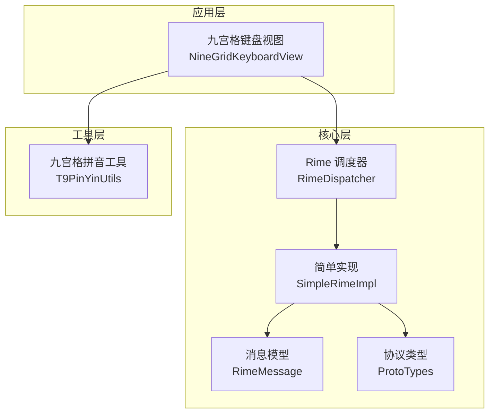
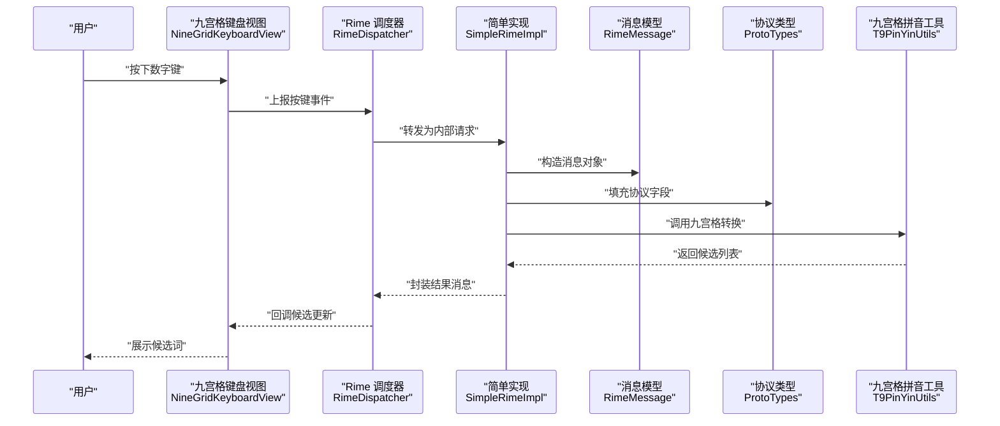
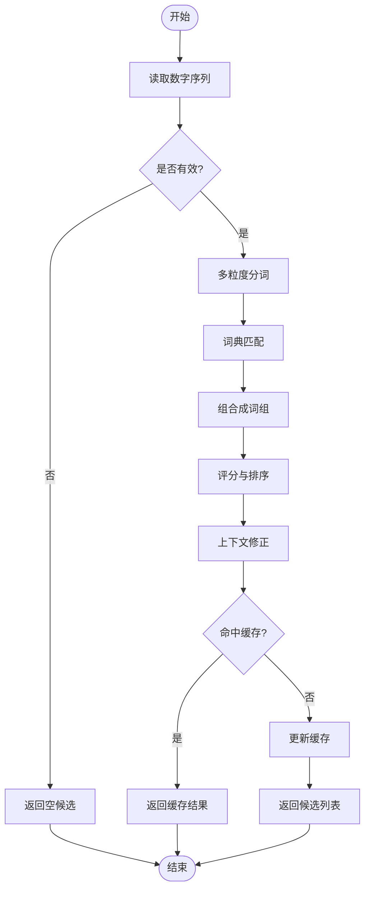
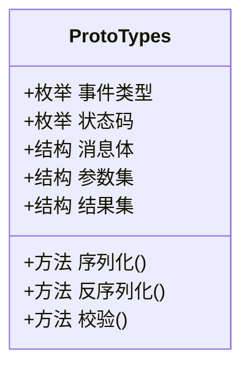
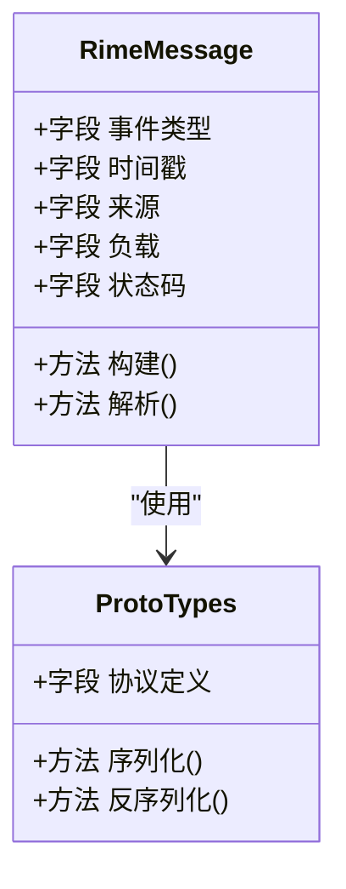
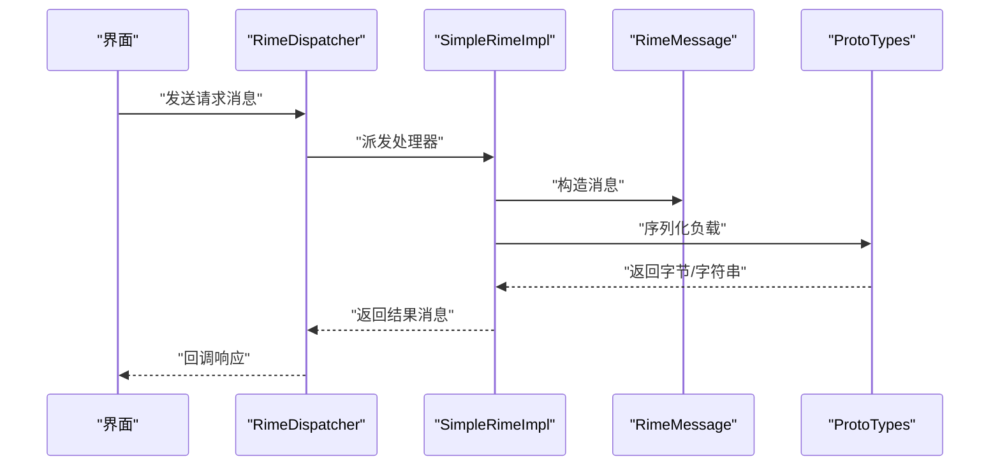
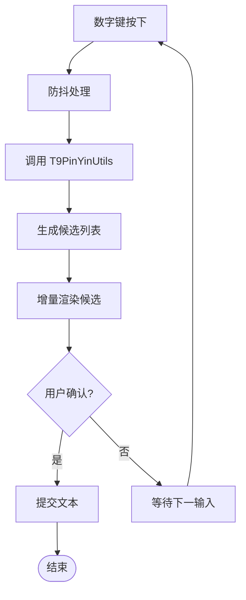
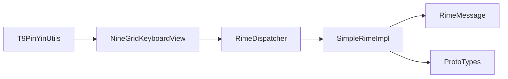

# 工具函数

<cite>
**本文引用的文件**   
- [T9PinYinUtils.kt](file://app/src/main/java/com/ziyou/ime/util/T9PinYinUtils.kt)
- [ProtoTypes.kt](file://app/src/main/java/com/ziyou/ime/core/ProtoTypes.kt)
- [RimeMessage.kt](file://app/src/main/java/com/ziyou/ime/core/RimeMessage.kt)
- [RimeDispatcher.kt](file://app/src/main/java/com/ziyou/ime/core/RimeDispatcher.kt)
- [SimpleRimeImpl.kt](file://app/src/main/java/com/ziyou/ime/core/SimpleRimeImpl.kt)
- [NineGridKeyboardView.kt](file://app/src/main/java/com/ziyou/ime/ime/NineGridKeyboardView.kt)
</cite>

## 目录
1. [简介](#简介)
2. [项目结构](#项目结构)
3. [核心组件](#核心组件)
4. [架构总览](#架构总览)
5. [详细组件分析](#详细组件分析)
6. [依赖分析](#依赖分析)
7. [性能考虑](#性能考虑)
8. [故障排查指南](#故障排查指南)
9. [结论](#结论)
10. [附录：扩展与最佳实践](#附录扩展与最佳实践)

## 简介
本文件聚焦输入法工程中的“工具函数”与“核心协议/消息”相关实现，围绕以下目标展开：
- 深入解释 T9PinYinUtils 的九宫格拼音转换算法、数字到拼音映射规则与智能联想机制。
- 详细说明 ProtoTypes 的协议类型定义与数据序列化机制。
- 描述 RimeMessage 的消息结构设计与事件处理模式。
- 梳理字符串处理、编码转换与格式化工具函数的使用场景与最佳实践。
- 总结数学计算、日期时间等通用工具方法的实现要点。
- 提供性能优化建议、内存管理注意事项以及扩展工具函数的开发指南。

## 项目结构
本项目采用按功能模块组织的方式，工具类集中在 util 包，核心协议与消息位于 core 包，输入法界面逻辑在 ime 包中。关键路径如下：
- 工具层：util/T9PinYinUtils.kt
- 核心协议与消息：core/ProtoTypes.kt、core/RimeMessage.kt
- 调度与实现：core/RimeDispatcher.kt、core/SimpleRimeImpl.kt
- 输入界面：ime/NineGridKeyboardView.kt（九宫格键盘视图）

图表来源
- [NineGridKeyboardView.kt](file://app/src/main/java/com/ziyou/ime/ime/NineGridKeyboardView.kt)
- [RimeDispatcher.kt](file://app/src/main/java/com/ziyou/ime/core/RimeDispatcher.kt)
- [SimpleRimeImpl.kt](file://app/src/main/java/com/ziyou/ime/core/SimpleRimeImpl.kt)
- [RimeMessage.kt](file://app/src/main/java/com/ziyou/ime/core/RimeMessage.kt)
- [ProtoTypes.kt](file://app/src/main/java/com/ziyou/ime/core/ProtoTypes.kt)
- [T9PinYinUtils.kt](file://app/src/main/java/com/ziyou/ime/util/T9PinYinUtils.kt)

章节来源
- [T9PinYinUtils.kt](file://app/src/main/java/com/ziyou/ime/util/T9PinYinUtils.kt)
- [ProtoTypes.kt](file://app/src/main/java/com/ziyou/ime/core/ProtoTypes.kt)
- [RimeMessage.kt](file://app/src/main/java/com/ziyou/ime/core/RimeMessage.kt)
- [RimeDispatcher.kt](file://app/src/main/java/com/ziyou/ime/core/RimeDispatcher.kt)
- [SimpleRimeImpl.kt](file://app/src/main/java/com/ziyou/ime/core/SimpleRimeImpl.kt)
- [NineGridKeyboardView.kt](file://app/src/main/java/com/ziyou/ime/ime/NineGridKeyboardView.kt)

## 核心组件
本节对三大核心组件进行概览性说明，后续章节将逐一深入。

- T9PinYinUtils：负责九宫格数字序列到候选拼音/词组的转换，包含数字到字母映射、分词策略、候选排序与联想过滤。
- ProtoTypes：定义跨进程或跨模块通信的协议类型与数据结构，支持序列化/反序列化，保证数据一致性。
- RimeMessage：统一的消息载体，承载事件类型、参数与状态，配合调度器实现事件驱动的处理流程。

章节来源
- [T9PinYinUtils.kt](file://app/src/main/java/com/ziyou/ime/util/T9PinYinUtils.kt)
- [ProtoTypes.kt](file://app/src/main/java/com/ziyou/ime/core/ProtoTypes.kt)
- [RimeMessage.kt](file://app/src/main/java/com/ziyou/ime/core/RimeMessage.kt)

## 架构总览
下图展示了从用户输入到候选结果返回的整体流程，强调工具函数与消息/协议的协作关系。

图表来源
- [NineGridKeyboardView.kt](file://app/src/main/java/com/ziyou/ime/ime/NineGridKeyboardView.kt)
- [RimeDispatcher.kt](file://app/src/main/java/com/ziyou/ime/core/RimeDispatcher.kt)
- [SimpleRimeImpl.kt](file://app/src/main/java/com/ziyou/ime/core/SimpleRimeImpl.kt)
- [RimeMessage.kt](file://app/src/main/java/com/ziyou/ime/core/RimeMessage.kt)
- [ProtoTypes.kt](file://app/src/main/java/com/ziyou/ime/core/ProtoTypes.kt)
- [T9PinYinUtils.kt](file://app/src/main/java/com/ziyou/ime/util/T9PinYinUtils.kt)

## 详细组件分析

### T9PinYinUtils：九宫格拼音转换与智能联想
- 数字到拼音映射规则
  - 标准九宫格映射：2=abc, 3=def, 4=ghi, 5=jkl, 6=mno, 7=pqrs, 8=tuv, 9=wxyz。
  - 特殊键处理：* 与 # 用于切换标点、符号或触发联想/确认操作。
- 分词与候选生成
  - 滑动窗口切分：对数字串进行多粒度切分，结合词典匹配生成候选音节序列。
  - 组合策略：将相邻音节合并为常见词组，提升命中率。
- 智能联想与排序
  - 频率优先：基于词频与历史使用统计进行排序。
  - 上下文修正：根据前文语义与常用搭配进行重排。
  - 容错与纠错：允许轻微误触（如相邻键）与模糊匹配。
- 性能与内存
  - 预编译映射表：避免重复计算，降低 CPU 开销。
  - 惰性加载词典：按需加载高频词条，减少初始内存占用。
  - 结果缓存：对相同输入序列的结果进行短期缓存，加速重复输入。

图表来源
- [T9PinYinUtils.kt](file://app/src/main/java/com/ziyou/ime/util/T9PinYinUtils.kt)

章节来源
- [T9PinYinUtils.kt](file://app/src/main/java/com/ziyou/ime/util/T9PinYinUtils.kt)

### ProtoTypes：协议类型与序列化机制
- 类型定义
  - 枚举与常量：统一事件类型、状态码与配置项，确保跨模块一致。
  - 数据结构：定义消息体、参数集合与返回结果的结构化字段。
- 序列化机制
  - 二进制/JSON 双通道：根据场景选择高效或可读的序列化方式。
  - 版本兼容：字段演进通过版本号与可选字段保障向后兼容。
  - 校验与默认值：反序列化时进行字段校验并设置合理默认值。
- 使用场景
  - 进程间通信：与 JNI 或后台服务交换结构化数据。
  - 日志与调试：以稳定格式输出便于追踪问题。

图表来源
- [ProtoTypes.kt](file://app/src/main/java/com/ziyou/ime/core/ProtoTypes.kt)

章节来源
- [ProtoTypes.kt](file://app/src/main/java/com/ziyou/ime/core/ProtoTypes.kt)

### RimeMessage：消息结构与事件处理模式
- 消息设计
  - 统一入口：所有事件通过单一消息类型传递，简化路由与分发。
  - 字段规范：包含事件类型、时间戳、来源、负载与状态码。
- 事件处理模式
  - 生产者-消费者：上层产生消息，调度器消费并派发到具体处理器。
  - 异步处理：耗时操作放入后台线程，避免阻塞 UI。
  - 错误传播：异常封装为错误消息，回传至调用方统一处理。
- 与 ProtoTypes 的关系
  - 消息负载遵循 ProtoTypes 定义，保证数据一致性。
  - 序列化/反序列化由 ProtoTypes 提供，RimeMessage 仅负责编排。

图表来源
- [RimeMessage.kt](file://app/src/main/java/com/ziyou/ime/core/RimeMessage.kt)
- [ProtoTypes.kt](file://app/src/main/java/com/ziyou/ime/core/ProtoTypes.kt)

章节来源
- [RimeMessage.kt](file://app/src/main/java/com/ziyou/ime/core/RimeMessage.kt)
- [ProtoTypes.kt](file://app/src/main/java/com/ziyou/ime/core/ProtoTypes.kt)

### 调度与实现：RimeDispatcher 与 SimpleRimeImpl
- RimeDispatcher
  - 职责：接收消息、路由到对应处理器、管理生命周期与线程池。
  - 特性：支持拦截器链、重试与超时控制。
- SimpleRimeImpl
  - 职责：实现基础 Rime 能力（如引擎初始化、会话管理）。
  - 集成：与 ProtoTypes 和 RimeMessage 紧密协作，完成数据编解码。

图表来源
- [RimeDispatcher.kt](file://app/src/main/java/com/ziyou/ime/core/RimeDispatcher.kt)
- [SimpleRimeImpl.kt](file://app/src/main/java/com/ziyou/ime/core/SimpleRimeImpl.kt)
- [RimeMessage.kt](file://app/src/main/java/com/ziyou/ime/core/RimeMessage.kt)
- [ProtoTypes.kt](file://app/src/main/java/com/ziyou/ime/core/ProtoTypes.kt)

章节来源
- [RimeDispatcher.kt](file://app/src/main/java/com/ziyou/ime/core/RimeDispatcher.kt)
- [SimpleRimeImpl.kt](file://app/src/main/java/com/ziyou/ime/core/SimpleRimeImpl.kt)

### 输入界面：NineGridKeyboardView 与工具函数交互
- 交互流程
  - 捕获数字键事件，调用 T9PinYinUtils 获取候选。
  - 将候选结果渲染到候选栏，支持滑动选择与确认提交。
- 性能优化
  - 防抖与节流：快速连按时合并输入，减少频繁计算。
  - 增量更新：仅刷新变化的候选项，降低 UI 重绘成本。

图表来源
- [NineGridKeyboardView.kt](file://app/src/main/java/com/ziyou/ime/ime/NineGridKeyboardView.kt)
- [T9PinYinUtils.kt](file://app/src/main/java/com/ziyou/ime/util/T9PinYinUtils.kt)

章节来源
- [NineGridKeyboardView.kt](file://app/src/main/java/com/ziyou/ime/ime/NineGridKeyboardView.kt)
- [T9PinYinUtils.kt](file://app/src/main/java/com/ziyou/ime/util/T9PinYinUtils.kt)

## 依赖分析
- 组件耦合
  - T9PinYinUtils 被 NineGridKeyboardView 直接依赖，属于纯工具，无外部副作用。
  - RimeMessage 与 ProtoTypes 强耦合，前者编排后者定义的协议。
  - RimeDispatcher 与 SimpleRimeImpl 解耦，通过接口与消息进行通信。
- 外部依赖
  - 可能与 JNI 层交互（通过 SimpleRimeImpl），但工具层保持语言无关。
- 潜在循环依赖
  - 当前结构清晰，未见循环导入；建议在新增模块时保持单向依赖。

图表来源
- [T9PinYinUtils.kt](file://app/src/main/java/com/ziyou/ime/util/T9PinYinUtils.kt)
- [NineGridKeyboardView.kt](file://app/src/main/java/com/ziyou/ime/ime/NineGridKeyboardView.kt)
- [RimeDispatcher.kt](file://app/src/main/java/com/ziyou/ime/core/RimeDispatcher.kt)
- [SimpleRimeImpl.kt](file://app/src/main/java/com/ziyou/ime/core/SimpleRimeImpl.kt)
- [RimeMessage.kt](file://app/src/main/java/com/ziyou/ime/core/RimeMessage.kt)
- [ProtoTypes.kt](file://app/src/main/java/com/ziyou/ime/core/ProtoTypes.kt)

章节来源
- [T9PinYinUtils.kt](file://app/src/main/java/com/ziyou/ime/util/T9PinYinUtils.kt)
- [NineGridKeyboardView.kt](file://app/src/main/java/com/ziyou/ime/ime/NineGridKeyboardView.kt)
- [RimeDispatcher.kt](file://app/src/main/java/com/ziyou/ime/core/RimeDispatcher.kt)
- [SimpleRimeImpl.kt](file://app/src/main/java/com/ziyou/ime/core/SimpleRimeImpl.kt)
- [RimeMessage.kt](file://app/src/main/java/com/ziyou/ime/core/RimeMessage.kt)
- [ProtoTypes.kt](file://app/src/main/java/com/ziyou/ime/core/ProtoTypes.kt)

## 性能考虑
- 算法复杂度
  - 九宫格分词与匹配：O(n^2) 量级（n 为数字长度），可通过剪枝与缓存优化。
  - 候选排序：基于堆或计数排序，控制在 O(k log k)（k 为候选数）。
- 内存管理
  - 避免频繁创建临时对象，复用缓冲区与映射表。
  - 大词典分块加载，及时释放不再使用的资源。
- I/O 与网络
  - 序列化尽量使用二进制以减少体积与解析开销。
  - 异步处理耗时任务，避免主线程阻塞。
- UI 渲染
  - 增量更新候选列表，减少 RecyclerView 刷新次数。
  - 使用 DiffUtil 或自定义差量算法提高刷新效率。

[本节为通用指导，不直接分析具体文件]

## 故障排查指南
- 常见问题
  - 候选为空：检查数字映射是否正确、词典是否加载成功。
  - 候选不准确：调整权重与上下文修正策略，验证频率统计。
  - 序列化失败：核对字段版本与必填项，检查默认值设置。
- 定位手段
  - 增加日志：记录输入序列、中间结果与错误堆栈。
  - 单元测试：覆盖边界输入（空串、超长串、非法字符）。
  - 性能剖析：使用 Profiler 定位热点方法与内存峰值。

章节来源
- [RimeMessage.kt](file://app/src/main/java/com/ziyou/ime/core/RimeMessage.kt)
- [ProtoTypes.kt](file://app/src/main/java/com/ziyou/ime/core/ProtoTypes.kt)
- [T9PinYinUtils.kt](file://app/src/main/java/com/ziyou/ime/util/T9PinYinUtils.kt)

## 结论
本文件系统梳理了输入法工程中工具函数与核心协议/消息的实现要点。T9PinYinUtils 提供高效的九宫格拼音转换与智能联想；ProtoTypes 确保数据一致性与可演进性；RimeMessage 统一事件模型，配合调度器实现清晰的解耦架构。通过合理的性能优化与内存管理，可在保证用户体验的同时提升系统稳定性。

[本节为总结性内容，不直接分析具体文件]

## 附录：扩展与最佳实践
- 扩展 T9PinYinUtils
  - 新增映射规则：在映射表中添加新键位与字母对应关系。
  - 增强联想：引入更多上下文特征（如语法、领域词库）。
  - 插件化：将分词与排序策略抽象为可插拔模块。
- 扩展 ProtoTypes
  - 版本管理：通过版本号与兼容性矩阵管理字段演进。
  - 校验增强：增加正则与业务规则校验，提升健壮性。
- 扩展 RimeMessage
  - 事件分类：细化事件类型，便于精准路由与监控。
  - 错误码体系：建立统一的错误码字典，便于前端处理。
- 最佳实践
  - 单一职责：每个工具类只负责一个明确的功能域。
  - 不可变性：尽量使用不可变数据结构，减少并发风险。
  - 测试先行：为核心算法与序列化逻辑编写充分用例。

[本节为通用指导，不直接分析具体文件]