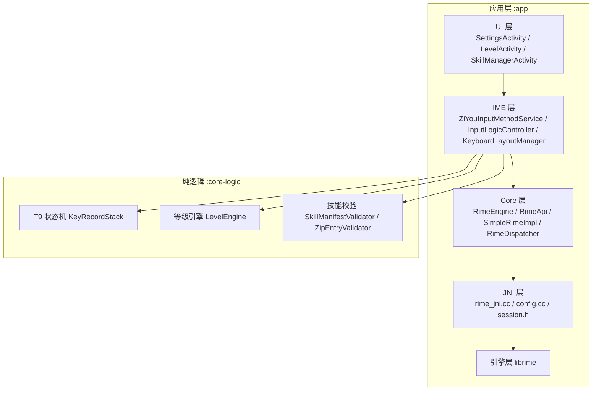
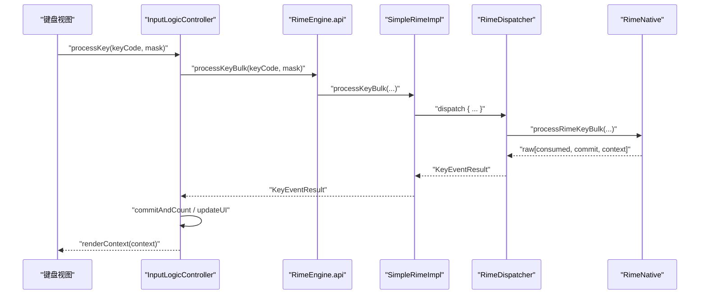
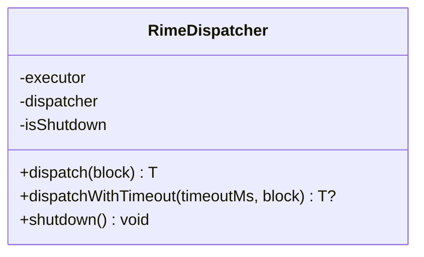
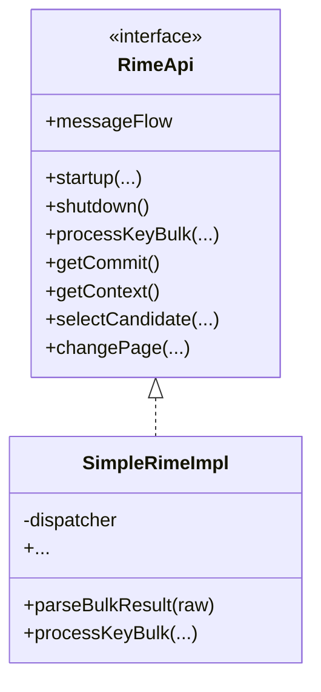
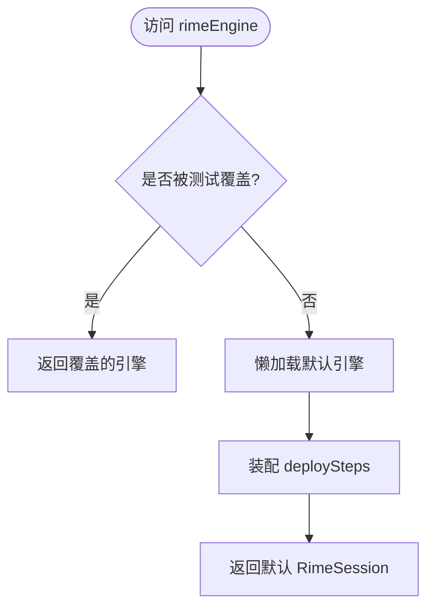
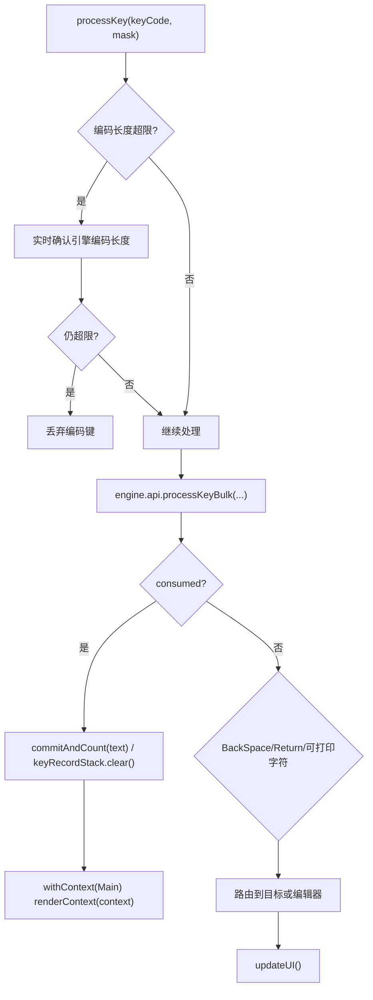
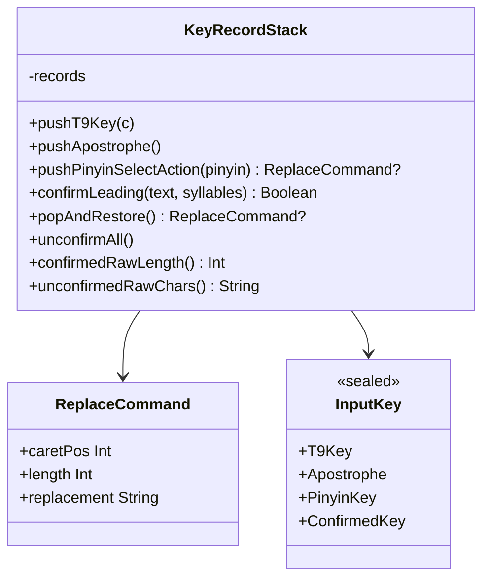
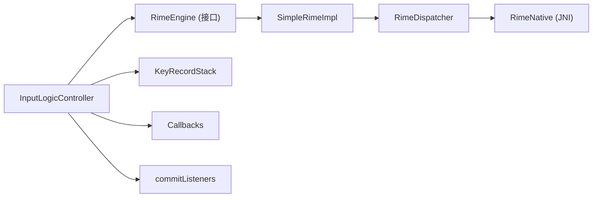

# 代码重构建议

<cite>
**本文引用的文件**   
- [ZiyouApplication.kt](file://app/src/main/java/com/ziyou/ime/ZiyouApplication.kt)
- [RimeDispatcher.kt](file://app/src/main/java/com/ziyou/ime/core/RimeDispatcher.kt)
- [SimpleRimeImpl.kt](file://app/src/main/java/com/ziyou/ime/core/SimpleRimeImpl.kt)
- [AppContainer.kt](file://app/src/main/java/com/ziyou/ime/di/AppContainer.kt)
- [InputLogicController.kt](file://app/src/main/java/com/ziyou/ime/ime/InputLogicController.kt)
- [KeyRecordStack.kt](file://core-logic/src/main/java/com/ziyou/ime/core/t9/KeyRecordStack.kt)
- [SkillManifest.kt](file://core-logic/src/main/java/com/ziyou/ime/core/skill/SkillManifest.kt)
- [FakeRimeEngine.kt](file://app/src/test/java/com/ziyou/ime/testing/FakeRimeEngine.kt)
- [InputLogicControllerTest.kt](file://app/src/test/java/com/ziyou/ime/ime/InputLogicControllerTest.kt)
- [KeyRecordStackTest.kt](file://core-logic/src/test/java/com/ziyou/ime/core/t9/KeyRecordStackTest.kt)
- [ARCHITECTURE.md](file://ARCHITECTURE.md)
</cite>

## 目录
1. [引言](#引言)
2. [项目结构](#项目结构)
3. [核心组件](#核心组件)
4. [架构总览](#架构总览)
5. [详细组件分析](#详细组件分析)
6. [依赖关系分析](#依赖关系分析)
7. [性能考量](#性能考量)
8. [故障排查指南](#故障排查指南)
9. [结论](#结论)
10. [附录：重构清单与案例](#附录：重构清单与案例)

## 引言
本文件面向字由输入法项目的代码重构，聚焦于遵循项目架构规范、保持依赖单向性、模块化设计原则、代码复用策略与测试驱动开发。文档基于仓库现有实现，提炼可操作的“识别代码异味—提取公共逻辑—简化复杂类—优化依赖注入—编写可测试代码”的完整路径，并给出前后对比的重构案例，帮助团队在保持输入热路径性能的前提下提升可维护性与可测试性。

## 项目结构
项目采用 Gradle 多模块组织：
- app：Android 应用层（UI、IME、Core、JNI、引擎集成）
- core-logic：纯 Kotlin 逻辑库（无 Android/JNI 依赖），承载 T9 状态机、等级计分、技能校验等可复用的纯逻辑

依赖方向严格单向：app → core-logic；app 内部遵循 UI → IME → Core → JNI → Engine 的分层。

图表来源
- [ARCHITECTURE.md:1-632](file://ARCHITECTURE.md#L1-L632)

章节来源
- [ARCHITECTURE.md:1-632](file://ARCHITECTURE.md#L1-L632)

## 核心组件
- 单线程调度器 RimeDispatcher：确保所有 librime API 在同一线程执行，协程友好，支持超时与关闭保护
- 引擎接口与实现：RimeApi（全 suspend）、SimpleRimeImpl（经 dispatcher 调度）
- 组合根 AppContainer：轻量 DI，装配部署步骤与上屏监听，提供测试覆盖点
- 输入控制器 InputLogicController：从 Service 剥离的核心输入路径，负责按键处理、候选选择、侧栏拼音替换、回车路由、富媒体提交等
- 九宫格状态机 KeyRecordStack：保证“列表顺序 == 编码串逻辑顺序”，支撑消歧、智能退格、分段确认
- 技能元数据 SkillManifest：纯数据模型，解析与校验分离，便于单测

章节来源
- [RimeDispatcher.kt:1-91](file://app/src/main/java/com/ziyou/ime/core/RimeDispatcher.kt#L1-L91)
- [SimpleRimeImpl.kt:1-177](file://app/src/main/java/com/ziyou/ime/core/SimpleRimeImpl.kt#L1-L177)
- [AppContainer.kt:1-59](file://app/src/main/java/com/ziyou/ime/di/AppContainer.kt#L1-L59)
- [InputLogicController.kt:1-531](file://app/src/main/java/com/ziyou/ime/ime/InputLogicController.kt#L1-L531)
- [KeyRecordStack.kt:1-310](file://core-logic/src/main/java/com/ziyou/ime/core/t9/KeyRecordStack.kt#L1-L310)
- [SkillManifest.kt:1-51](file://core-logic/src/main/java/com/ziyou/ime/core/skill/SkillManifest.kt#L1-L51)

## 架构总览
系统以“单线程 Dispatcher + 批量 API + 接口化引擎 + 组合根 DI”为核心，输入热路径通过 processKeyBulk 单次跨界减少 JNI 调用次数；上层通过 CommitTarget 抽象将上屏目标解耦（宿主编辑器或技能面板）。

图表来源
- [InputLogicController.kt:126-185](file://app/src/main/java/com/ziyou/ime/ime/InputLogicController.kt#L126-L185)
- [SimpleRimeImpl.kt:59-64](file://app/src/main/java/com/ziyou/ime/core/SimpleRimeImpl.kt#L59-L64)
- [RimeDispatcher.kt:48-60](file://app/src/main/java/com/ziyou/ime/core/RimeDispatcher.kt#L48-L60)

章节来源
- [ARCHITECTURE.md:393-453](file://ARCHITECTURE.md#L393-L453)

## 详细组件分析

### 单线程调度器 RimeDispatcher
- 职责：创建专属单线程 Executor，暴露 CoroutineDispatcher，封装 dispatch 与带超时的 dispatchWithTimeout，提供 shutdown 保护
- 设计要点：AtomicBoolean 标记关闭状态；异常捕获并记录日志；避免阻塞主线程
- 复杂度：O(1) 任务派发；线程安全由单线程保证

图表来源
- [RimeDispatcher.kt:22-90](file://app/src/main/java/com/ziyou/ime/core/RimeDispatcher.kt#L22-L90)

章节来源
- [RimeDispatcher.kt:1-91](file://app/src/main/java/com/ziyou/ime/core/RimeDispatcher.kt#L1-L91)

### 引擎接口与实现 SimpleRimeImpl
- 职责：实现 RimeApi，所有方法通过 dispatcher.dispatch 调度到 Rime 线程；批量结果解析为 KeyEventResult
- 设计要点：startup/shutdown 生命周期；processKeyBulk 热路径；消息流 messageFlow 透传
- 复杂度：每个方法 O(1) 派发；JNI 调用集中在 Native 层

图表来源
- [SimpleRimeImpl.kt:10-28](file://app/src/main/java/com/ziyou/ime/core/SimpleRimeImpl.kt#L10-L28)
- [SimpleRimeImpl.kt:59-64](file://app/src/main/java/com/ziyou/ime/core/SimpleRimeImpl.kt#L59-L64)

章节来源
- [SimpleRimeImpl.kt:1-177](file://app/src/main/java/com/ziyou/ime/core/SimpleRimeImpl.kt#L1-177)

### 组合根 AppContainer（DI）
- 职责：装配 RimeSession.deploySteps（资源部署、词库注入）、commitListeners（上屏后横切监听如等级计分）；提供 overrideRimeEngine 用于测试
- 设计要点：懒加载默认引擎；线程安全的 lazy；对外仅暴露接口

图表来源
- [AppContainer.kt:30-44](file://app/src/main/java/com/ziyou/ime/di/AppContainer.kt#L30-L44)

章节来源
- [AppContainer.kt:1-59](file://app/src/main/java/com/ziyou/ime/di/AppContainer.kt#L1-L59)

### 输入控制器 InputLogicController
- 职责：核心输入路径（processKey）、候选选择（selectCandidate）、翻页（changePage）、拼音侧栏替换（selectPinyin/restorePinyin）、回车路由（handleEnterKey）、直接上屏与图片提交、commitTarget 路由
- 设计要点：inputMutex 串行化一次按键事务；MAX_INPUT_LENGTH 超限防护；commitAndCount 统一出口；updateUI 刷新上下文
- 复杂度：热路径 O(1) 自增与单次跨界；异常捕获不崩溃

图表来源
- [InputLogicController.kt:126-185](file://app/src/main/java/com/ziyou/ime/ime/InputLogicController.kt#L126-L185)
- [InputLogicController.kt:518-528](file://app/src/main/java/com/ziyou/ime/ime/InputLogicController.kt#L518-L528)

章节来源
- [InputLogicController.kt:1-531](file://app/src/main/java/com/ziyou/ime/ime/InputLogicController.kt#L1-L531)

### 九宫格状态机 KeyRecordStack
- 职责：追踪 T9 按键与已锁定拼音，支持选拼音原地替换、智能退格还原、分段确认合并、偏移计算
- 不变式：列表顺序 == 编码串逻辑顺序；宽度计算考虑分词符与确认段原始记录
- 复杂度：push/select/pop/unconfirm 均为线性扫描，但平均规模小，整体高效

图表来源
- [KeyRecordStack.kt:20-266](file://core-logic/src/main/java/com/ziyou/ime/core/t9/KeyRecordStack.kt#L20-L266)
- [KeyRecordStack.kt:276-280](file://core-logic/src/main/java/com/ziyou/ime/core/t9/KeyRecordStack.kt#L276-L280)
- [KeyRecordStack.kt:285-309](file://core-logic/src/main/java/com/ziyou/ime/core/t9/KeyRecordStack.kt#L285-L309)

章节来源
- [KeyRecordStack.kt:1-310](file://core-logic/src/main/java/com/ziyou/ime/core/t9/KeyRecordStack.kt#L1-L310)

### 技能元数据 SkillManifest
- 职责：描述技能包元数据（id、name、version、permissions、entry、panelMode、needsInput 等）
- 设计要点：纯数据模型，解析与校验分离，便于单元测试与静态检查

章节来源
- [SkillManifest.kt:1-51](file://core-logic/src/main/java/com/ziyou/ime/core/skill/SkillManifest.kt#L1-L51)

## 依赖关系分析
- 依赖方向：app → core-logic（编译器强制单向）
- 组件耦合：InputLogicController 依赖 RimeEngine（接口）、KeyRecordStack（共享状态）、Callbacks（回调）、commitListeners（横切监听）
- 外部依赖：librime（C API）、Android Framework（InputConnection、EditorInfo、WebView 等）

图表来源
- [InputLogicController.kt:43-49](file://app/src/main/java/com/ziyou/ime/ime/InputLogicController.kt#L43-L49)
- [SimpleRimeImpl.kt:10-12](file://app/src/main/java/com/ziyou/ime/core/SimpleRimeImpl.kt#L10-L12)
- [RimeDispatcher.kt:31-38](file://app/src/main/java/com/ziyou/ime/core/RimeDispatcher.kt#L31-L38)

章节来源
- [ARCHITECTURE.md:65-66](file://ARCHITECTURE.md#L65-L66)

## 性能考量
- 单线程 Dispatcher：避免锁竞争，协程友好，天然顺序保证
- 批量 API：processKeyBulk 将 processKey/getCommit/getContext 合并为单次跨界，显著降低 JNI 开销
- 热路径零 IO：上屏计数内存自增，阈值触发异步落盘
- 编码长度上限：MAX_INPUT_LENGTH 防止组句搜索爆炸导致卡顿

章节来源
- [ARCHITECTURE.md:70-107](file://ARCHITECTURE.md#L70-L107)
- [InputLogicController.kt:54-64](file://app/src/main/java/com/ziyou/ime/ime/InputLogicController.kt#L54-L64)

## 故障排查指南
- 慢按键告警：SLOW_KEY_WARN_MS 阈值输出日志，定位耗时退化
- 引擎异常兜底：processKey/selectCandidate 等方法 catch 异常并记录，不崩溃
- 线程与生命周期：RimeDispatcher.shutdown 防止关闭后提交；RimeSession 初始化互斥避免双重初始化
- 消息流：SharedFlow 背压缓冲，订阅者丢失风险低

章节来源
- [InputLogicController.kt:140-146](file://app/src/main/java/com/ziyou/ime/ime/InputLogicController.kt#L140-L146)
- [RimeDispatcher.kt:84-90](file://app/src/main/java/com/ziyou/ime/core/RimeDispatcher.kt#L84-L90)
- [ARCHITECTURE.md:218-229](file://ARCHITECTURE.md#L218-L229)

## 结论
本项目在架构层面已具备优秀的分层与依赖控制，输入热路径通过单线程调度与批量 API 达到高性能。重构建议围绕以下方面持续演进：
- 强化依赖单向性与模块化边界，进一步下沉纯逻辑至 core-logic
- 完善 DI 装配点，使更多横切关注点（如埋点、审计）可通过 commitListeners 注入
- 扩展测试替身与用例覆盖率，确保关键路径回归稳定
- 对复杂类进行职责拆分与参数收敛，保持高内聚低耦合

## 附录：重构清单与案例

### 重构最佳实践清单
- 遵循架构规范
  - 保持 app → core-logic 单向依赖
  - 输入热路径禁止磁盘 IO，IO 走独立作用域
- 保持依赖单向性
  - 使用接口（RimeEngine/RimeApi）而非具体实现
  - 通过 AppContainer 装配部署步骤与监听，避免硬编码全局单例
- 模块化设计原则
  - 纯逻辑下沉 core-logic（T9、等级、技能校验）
  - UI/IME/Core/JNI/Engine 分层清晰
- 代码复用策略
  - 提取公共逻辑（如 commitAndCount、updateUI）
  - 使用状态机（KeyRecordStack）管理复杂交互
- 测试驱动开发
  - 使用 FakeRimeEngine 注入替身
  - 针对关键路径编写单测（InputLogicControllerTest、KeyRecordStackTest）

### 代码异味识别与修复建议
- 异味：跨层直接依赖具体实现
  - 修复：改为接口 + DI（RimeEngine 已由 AppContainer 提供）
- 异味：热路径存在同步阻塞
  - 修复：全部 suspend + dispatcher.dispatch（SimpleRimeImpl 已实现）
- 异味：大对象承担过多职责
  - 修复：拆分职责（InputLogicController 已从 Service 剥离）
- 异味：缺少可测试性
  - 修复：提供 overrideRimeEngine 与 FakeRimeEngine

### 典型重构案例（前后对比）
- 案例一：引擎调用方式
  - 前：多处分散调用 processKey/getCommit/getContext，多次 JNI 跨界
  - 后：统一使用 processKeyBulk，单次跨界返回结果，减少往返与 JNI 开销
  - 参考路径：
    - [SimpleRimeImpl.kt:59-64](file://app/src/main/java/com/ziyou/ime/core/SimpleRimeImpl.kt#L59-L64)
    - [InputLogicController.kt:140-146](file://app/src/main/java/com/ziyou/ime/ime/InputLogicController.kt#L140-L146)
- 案例二：上屏目标解耦
  - 前：直接调用 InputConnection.commitText
  - 后：通过 CommitTarget 抽象，支持面板与编辑器的不同路由
  - 参考路径：
    - [InputLogicController.kt:95-111](file://app/src/main/java/com/ziyou/ime/ime/InputLogicController.kt#L95-L111)
    - [InputLogicController.kt:493-504](file://app/src/main/java/com/ziyou/ime/ime/InputLogicController.kt#L493-L504)
- 案例三：依赖注入与测试
  - 前：硬依赖 RimeSession 单例
  - 后：AppContainer.rimeEngine + overrideRimeEngine，测试注入 FakeRimeEngine
  - 参考路径：
    - [AppContainer.kt:42-57](file://app/src/main/java/com/ziyou/ime/di/AppContainer.kt#L42-L57)
    - [FakeRimeEngine.kt:21-52](file://app/src/test/java/com/ziyou/ime/testing/FakeRimeEngine.kt#L21-L52)
- 案例四：九宫格状态机一致性
  - 前：选拼音追加到末尾导致位置错乱
  - 后：原地替换首个 T9 段，保持“列表顺序 == 编码串逻辑顺序”
  - 参考路径：
    - [KeyRecordStack.kt:57-83](file://core-logic/src/main/java/com/ziyou/ime/core/t9/KeyRecordStack.kt#L57-L83)

章节来源
- [InputLogicControllerTest.kt:84-109](file://app/src/test/java/com/ziyou/ime/ime/InputLogicControllerTest.kt#L84-L109)
- [KeyRecordStackTest.kt:18-46](file://core-logic/src/test/java/com/ziyou/ime/core/t9/KeyRecordStackTest.kt#L18-L46)