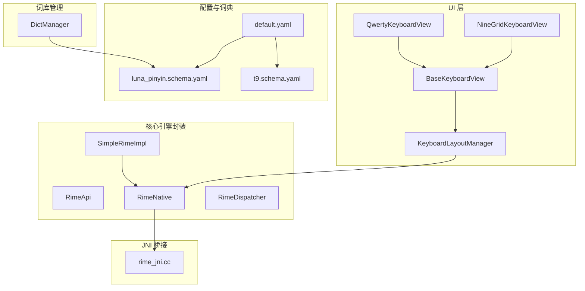
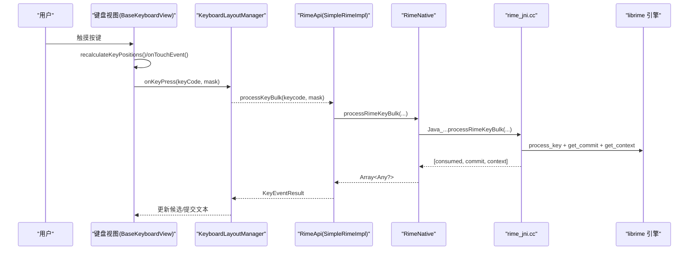
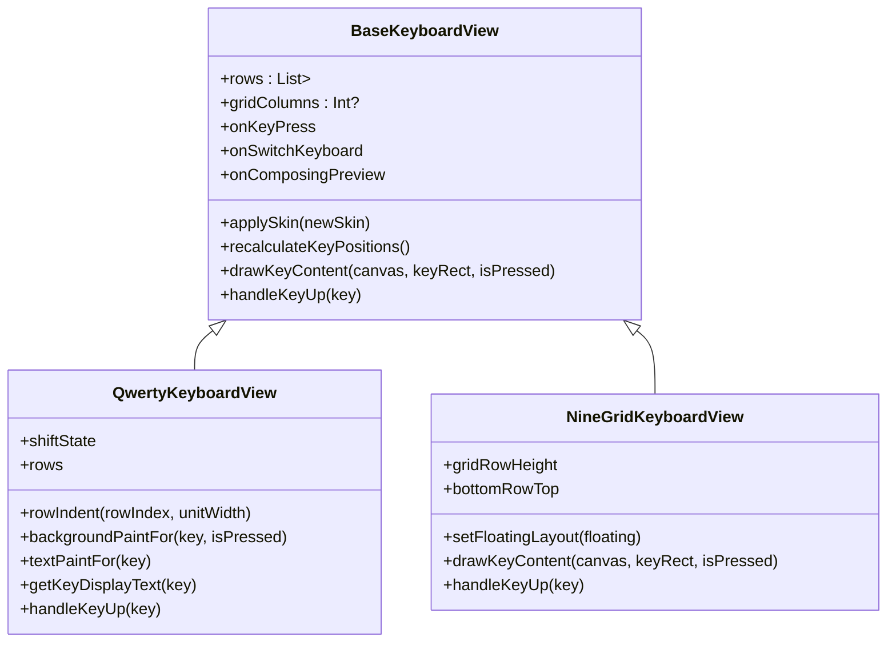
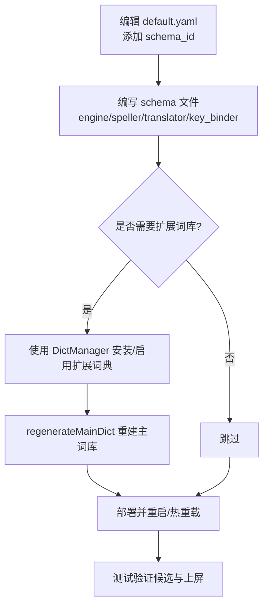
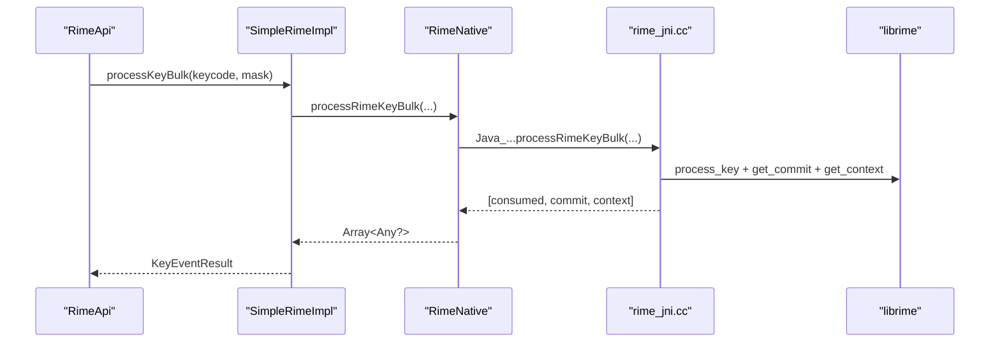
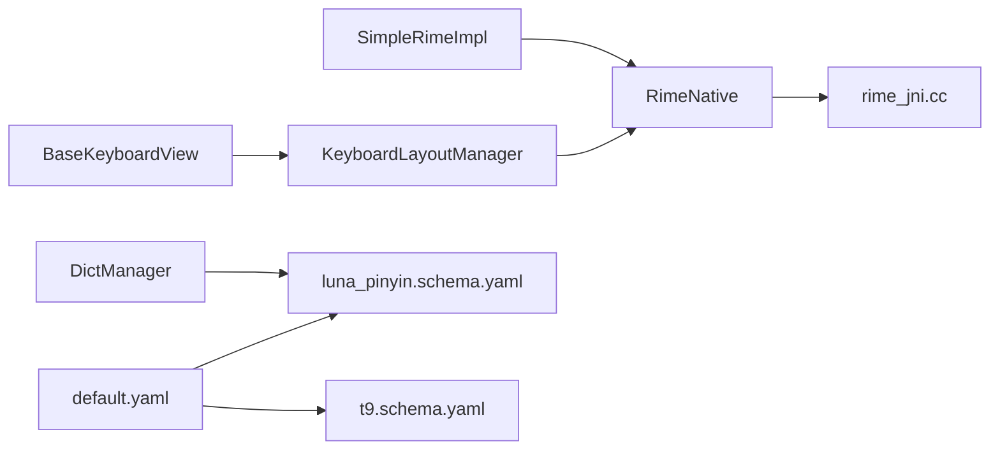

# 常用开发任务

<cite>
**本文引用的文件**   
- [BaseKeyboardView.kt](file://app/src/main/java/com/ziyou/ime/ime/BaseKeyboardView.kt)
- [QwertyKeyboardView.kt](file://app/src/main/java/com/ziyou/ime/ime/QwertyKeyboardView.kt)
- [NineGridKeyboardView.kt](file://app/src/main/java/com/ziyou/ime/ime/NineGridKeyboardView.kt)
- [KeyboardLayoutManager.kt](file://app/src/main/java/com/ziyou/ime/ime/KeyboardLayoutManager.kt)
- [default.yaml](file://app/src/main/assets/rime/default.yaml)
- [luna_pinyin.schema.yaml](file://app/src/main/assets/rime/luna_pinyin.schema.yaml)
- [t9.schema.yaml](file://app/src/main/assets/rime/t9.schema.yaml)
- [rime_jni.cc](file://app/src/main/jni/librime_jni/rime_jni.cc)
- [RimeNative.kt](file://app/src/main/java/com/ziyou/ime/core/RimeNative.kt)
- [RimeApi.kt](file://app/src/main/java/com/ziyou/ime/core/RimeApi.kt)
- [SimpleRimeImpl.kt](file://app/src/main/java/com/ziyou/ime/core/SimpleRimeImpl.kt)
- [DictManager.kt](file://app/src/main/java/com/ziyou/ime/dict/DictManager.kt)
</cite>

## 目录
1. [简介](#简介)
2. [项目结构](#项目结构)
3. [核心组件](#核心组件)
4. [架构总览](#架构总览)
5. [详细组件分析](#详细组件分析)
6. [依赖关系分析](#依赖关系分析)
7. [性能考虑](#性能考虑)
8. [故障排查指南](#故障排查指南)
9. [结论](#结论)
10. [附录](#附录)

## 简介
本指南面向输入法项目的日常开发任务，聚焦以下目标：
- 新增键盘布局的完整步骤（继承 BaseKeyboardView、实现触摸与绘制、配置布局参数、集成到 KeyboardLayoutManager）
- 新增输入方案（修改 default.yaml、添加词典与 schema、编译部署与测试验证）
- 扩展 JNI 函数（C++ 导出、Kotlin external 声明、RimeApi 接口方法）
- 扩展业务功能模块（数据模型、Repository、UI、依赖注入）
- 性能调优（减少 JNI 调用、优化内存、提升渲染）
- 代码重构建议与最佳实践

## 项目结构
本项目采用分层与模块化组织：
- UI 层：键盘视图与候选栏等（ime 包）
- 核心引擎封装：Rime 引擎的 Kotlin 抽象与实现（core 包）
- JNI 桥接：C++ 导出 librime API（jni 目录）
- 资源与配置：Rime 配置文件与词典（assets/rime）
- 词库管理：动态安装/启用/禁用扩展词库（dict 包）

**图表来源** 
- [BaseKeyboardView.kt](file://app/src/main/java/com/ziyou/ime/ime/BaseKeyboardView.kt)
- [QwertyKeyboardView.kt](file://app/src/main/java/com/ziyou/ime/ime/QwertyKeyboardView.kt)
- [NineGridKeyboardView.kt](file://app/src/main/java/com/ziyou/ime/ime/NineGridKeyboardView.kt)
- [KeyboardLayoutManager.kt](file://app/src/main/java/com/ziyou/ime/ime/KeyboardLayoutManager.kt)
- [RimeApi.kt](file://app/src/main/java/com/ziyou/ime/core/RimeApi.kt)
- [SimpleRimeImpl.kt](file://app/src/main/java/com/ziyou/ime/core/SimpleRimeImpl.kt)
- [RimeNative.kt](file://app/src/main/java/com/ziyou/ime/core/RimeNative.kt)
- [rime_jni.cc](file://app/src/main/jni/librime_jni/rime_jni.cc)
- [default.yaml](file://app/src/main/assets/rime/default.yaml)
- [luna_pinyin.schema.yaml](file://app/src/main/assets/rime/luna_pinyin.schema.yaml)
- [t9.schema.yaml](file://app/src/main/assets/rime/t9.schema.yaml)
- [DictManager.kt](file://app/src/main/java/com/ziyou/ime/dict/DictManager.kt)

**章节来源**
- [BaseKeyboardView.kt](file://app/src/main/java/com/ziyou/ime/ime/BaseKeyboardView.kt)
- [KeyboardLayoutManager.kt](file://app/src/main/java/com/ziyou/ime/ime/KeyboardLayoutManager.kt)
- [default.yaml](file://app/src/main/assets/rime/default.yaml)
- [luna_pinyin.schema.yaml](file://app/src/main/assets/rime/luna_pinyin.schema.yaml)
- [t9.schema.yaml](file://app/src/main/assets/rime/t9.schema.yaml)
- [rime_jni.cc](file://app/src/main/jni/librime_jni/rime_jni.cc)
- [RimeNative.kt](file://app/src/main/java/com/ziyou/ime/core/RimeNative.kt)
- [RimeApi.kt](file://app/src/main/java/com/ziyou/ime/core/RimeApi.kt)
- [SimpleRimeImpl.kt](file://app/src/main/java/com/ziyou/ime/core/SimpleRimeImpl.kt)
- [DictManager.kt](file://app/src/main/java/com/ziyou/ime/dict/DictManager.kt)

## 核心组件
- BaseKeyboardView：键盘视图基类，提供布局模型、绘制、触摸处理、皮肤与缩放能力。子类只需定义 rows、实现 handleKeyUp 即可。
- QwertyKeyboardView / NineGridKeyboardView：具体键盘布局实现，分别负责全键盘与九宫格逻辑。
- KeyboardLayoutManager：键盘视图装载器，统一创建、绑定回调、组装停靠/悬浮形态。
- RimeApi / SimpleRimeImpl：引擎 API 抽象与单线程调度实现，屏蔽线程安全细节。
- RimeNative：JNI 外部方法声明，映射到 C++ 导出函数。
- rime_jni.cc：JNI 导出与 librime 调用封装，包含批量按键处理、候选获取、方案管理等。
- DictManager：扩展词库管理器，负责安装/卸载/启用/禁用与主词库重建。

**章节来源**
- [BaseKeyboardView.kt](file://app/src/main/java/com/ziyou/ime/ime/BaseKeyboardView.kt)
- [QwertyKeyboardView.kt](file://app/src/main/java/com/ziyou/ime/ime/QwertyKeyboardView.kt)
- [NineGridKeyboardView.kt](file://app/src/main/java/com/ziyou/ime/ime/NineGridKeyboardView.kt)
- [KeyboardLayoutManager.kt](file://app/src/main/java/com/ziyou/ime/ime/KeyboardLayoutManager.kt)
- [RimeApi.kt](file://app/src/main/java/com/ziyou/ime/core/RimeApi.kt)
- [SimpleRimeImpl.kt](file://app/src/main/java/com/ziyou/ime/core/SimpleRimeImpl.kt)
- [RimeNative.kt](file://app/src/main/java/com/ziyou/ime/core/RimeNative.kt)
- [rime_jni.cc](file://app/src/main/jni/librime_jni/rime_jni.cc)
- [DictManager.kt](file://app/src/main/java/com/ziyou/ime/dict/DictManager.kt)

## 架构总览
下图展示从用户触摸到引擎处理的端到端流程，以及配置与词库管理的交互点。

**图表来源** 
- [BaseKeyboardView.kt](file://app/src/main/java/com/ziyou/ime/ime/BaseKeyboardView.kt)
- [KeyboardLayoutManager.kt](file://app/src/main/java/com/ziyou/ime/ime/KeyboardLayoutManager.kt)
- [SimpleRimeImpl.kt](file://app/src/main/java/com/ziyou/ime/core/SimpleRimeImpl.kt)
- [RimeNative.kt](file://app/src/main/java/com/ziyou/ime/core/RimeNative.kt)
- [rime_jni.cc](file://app/src/main/jni/librime_jni/rime_jni.cc)

## 详细组件分析

### 新增键盘布局（继承 BaseKeyboardView）
步骤概览：
- 新建键盘视图类，继承 BaseKeyboardView
- 定义 rows（行 × 键），必要时设置 gridColumns 启用列网格
- 覆写必要的方法：handleKeyUp、textPaintFor、getKeyDisplayText、rowIndent/rowUnitWidth 等
- 在 KeyboardLayoutManager.createKeyboardView 中登记新类型
- 通过 onKeyPress/onSwitchKeyboard 等回调与 Service 层交互

关键要点：
- 使用 Key.width 表示相对宽度或跨列数（gridColumns 时）
- 支持长按连续触发（如退格键），可覆写 isRepeatableKey
- 皮肤与缩放由基类统一管理，子类仅需同步自有画笔大小（onScaleChanged）

**图表来源** 
- [BaseKeyboardView.kt](file://app/src/main/java/com/ziyou/ime/ime/BaseKeyboardView.kt)
- [QwertyKeyboardView.kt](file://app/src/main/java/com/ziyou/ime/ime/QwertyKeyboardView.kt)
- [NineGridKeyboardView.kt](file://app/src/main/java/com/ziyou/ime/ime/NineGridKeyboardView.kt)

**章节来源**
- [BaseKeyboardView.kt](file://app/src/main/java/com/ziyou/ime/ime/BaseKeyboardView.kt)
- [QwertyKeyboardView.kt](file://app/src/main/java/com/ziyou/ime/ime/QwertyKeyboardView.kt)
- [NineGridKeyboardView.kt](file://app/src/main/java/com/ziyou/ime/ime/NineGridKeyboardView.kt)
- [KeyboardLayoutManager.kt](file://app/src/main/java/com/ziyou/ime/ime/KeyboardLayoutManager.kt)

### 集成新的输入方案（修改 default.yaml、添加词典与 schema）
步骤概览：
- 在 default.yaml 的 schema_list 中添加新方案的 schema_id
- 编写新方案的 schema 文件（如 t9.schema.yaml），定义 engine、speller、translator、key_binder 等
- 如需扩展词库，使用 DictManager 安装/启用扩展词典并重建主词库
- 部署后重启或触发重新部署，验证候选与上屏行为

关键点：
- default.yaml 控制可用方案列表与切换选项
- schema 文件决定处理器链、分词器、翻译器与过滤器
- 九宫格方案通过 algebra 派生数字编码，配合 spelling_hints 显示真实拼音

**图表来源** 
- [default.yaml](file://app/src/main/assets/rime/default.yaml)
- [luna_pinyin.schema.yaml](file://app/src/main/assets/rime/luna_pinyin.schema.yaml)
- [t9.schema.yaml](file://app/src/main/assets/rime/t9.schema.yaml)
- [DictManager.kt](file://app/src/main/java/com/ziyou/ime/dict/DictManager.kt)

**章节来源**
- [default.yaml](file://app/src/main/assets/rime/default.yaml)
- [luna_pinyin.schema.yaml](file://app/src/main/assets/rime/luna_pinyin.schema.yaml)
- [t9.schema.yaml](file://app/src/main/assets/rime/t9.schema.yaml)
- [DictManager.kt](file://app/src/main/java/com/ziyou/ime/dict/DictManager.kt)

### 扩展 JNI 函数（C++ 导出、Kotlin external、RimeApi 接口）
步骤概览：
- 在 rime_jni.cc 中新增 extern "C" 导出函数，封装 librime 调用
- 在 RimeNative.kt 中声明对应的 external fun
- 在 RimeApi.kt 中增加 suspend 方法（默认实现可组合多次调用）
- 在 SimpleRimeImpl 中实现具体调度（走 RimeDispatcher 单线程）

注意：
- 批量处理（processRimeKeyBulk）可减少 JNI 跨界次数，提高吞吐
- 消息回调（handleRimeMessage）用于 schema/option/deploy 事件通知

**图表来源** 
- [rime_jni.cc](file://app/src/main/jni/librime_jni/rime_jni.cc)
- [RimeNative.kt](file://app/src/main/java/com/ziyou/ime/core/RimeNative.kt)
- [RimeApi.kt](file://app/src/main/java/com/ziyou/ime/core/RimeApi.kt)
- [SimpleRimeImpl.kt](file://app/src/main/java/com/ziyou/ime/core/SimpleRimeImpl.kt)

**章节来源**
- [rime_jni.cc](file://app/src/main/jni/librime_jni/rime_jni.cc)
- [RimeNative.kt](file://app/src/main/java/com/ziyou/ime/core/RimeNative.kt)
- [RimeApi.kt](file://app/src/main/java/com/ziyou/ime/core/RimeApi.kt)
- [SimpleRimeImpl.kt](file://app/src/main/java/com/ziyou/ime/core/SimpleRimeImpl.kt)

### 添加新的业务功能模块（数据模型、Repository、UI、依赖注入）
通用步骤：
- 设计数据模型（Kotlin data class）
- 实现 Repository（IO 与缓存策略）
- 开发 UI（Activity/Fragment/ViewModel）
- 配置依赖注入（Dagger/Hilt/Koin，按项目现有方式）
- 在合适的入口注册与暴露（如 Settings、工具面板）

建议：
- 将 IO 操作放入协程/线程池，避免阻塞主线程
- 使用 Flow/SharedFlow 进行状态广播
- 对敏感数据进行加密与权限校验

[本节为概念性内容，不直接分析具体文件，故无“章节来源”]

## 依赖关系分析
- 键盘视图依赖皮肤管理与回调机制，通过 KeyboardLayoutManager 统一装配
- 引擎调用路径：UI → RimeApi → SimpleRimeImpl → RimeNative → rime_jni.cc → librime
- 配置与词典：default.yaml 管理方案列表；schema 文件定义引擎行为；DictManager 动态维护主词库

**图表来源** 
- [BaseKeyboardView.kt](file://app/src/main/java/com/ziyou/ime/ime/BaseKeyboardView.kt)
- [KeyboardLayoutManager.kt](file://app/src/main/java/com/ziyou/ime/ime/KeyboardLayoutManager.kt)
- [SimpleRimeImpl.kt](file://app/src/main/java/com/ziyou/ime/core/SimpleRimeImpl.kt)
- [RimeNative.kt](file://app/src/main/java/com/ziyou/ime/core/RimeNative.kt)
- [rime_jni.cc](file://app/src/main/jni/librime_jni/rime_jni.cc)
- [default.yaml](file://app/src/main/assets/rime/default.yaml)
- [luna_pinyin.schema.yaml](file://app/src/main/assets/rime/luna_pinyin.schema.yaml)
- [t9.schema.yaml](file://app/src/main/assets/rime/t9.schema.yaml)
- [DictManager.kt](file://app/src/main/java/com/ziyou/ime/dict/DictManager.kt)

**章节来源**
- [KeyboardLayoutManager.kt](file://app/src/main/java/com/ziyou/ime/ime/KeyboardLayoutManager.kt)
- [SimpleRimeImpl.kt](file://app/src/main/java/com/ziyou/ime/core/SimpleRimeImpl.kt)
- [RimeNative.kt](file://app/src/main/java/com/ziyou/ime/core/RimeNative.kt)
- [rime_jni.cc](file://app/src/main/jni/librime_jni/rime_jni.cc)
- [default.yaml](file://app/src/main/assets/rime/default.yaml)
- [luna_pinyin.schema.yaml](file://app/src/main/assets/rime/luna_pinyin.schema.yaml)
- [t9.schema.yaml](file://app/src/main/assets/rime/t9.schema.yaml)
- [DictManager.kt](file://app/src/main/java/com/ziyou/ime/dict/DictManager.kt)

## 性能考虑
- 减少 JNI 调用次数：优先使用 processRimeKeyBulk 合并 processKey + getCommit + getContext
- 优化内存使用：部署完成后调用 trimNativeHeap 归还 native 堆空闲页；避免频繁创建大对象
- 提升渲染性能：复用 Paint 与 KeyRect；仅在必要时 requestLayout/invalidate；利用 gridColumns 对齐减少计算
- 线程安全：所有 librime 调用经 RimeDispatcher 单线程执行，避免竞争

**章节来源**
- [rime_jni.cc](file://app/src/main/jni/librime_jni/rime_jni.cc)
- [RimeNative.kt](file://app/src/main/java/com/ziyou/ime/core/RimeNative.kt)
- [BaseKeyboardView.kt](file://app/src/main/java/com/ziyou/ime/ime/BaseKeyboardView.kt)

## 故障排查指南
常见问题与定位：
- JNI 库加载失败：检查 ABI 匹配与 .so 是否存在；查看 RimeNative.isLoaded 与日志
- 引擎未初始化：确保 startupRime 成功且环境变量正确；检查 notificationHandler 异常
- 候选为空：确认 schema 已选择、speller/algebra 配置正确；检查 predict.db 是否部署
- 词库未生效：确认 DictManager 重建主词库成功；检查 ext_dicts 目录与 enabled 状态
- 键盘触摸异常：检查 findKeyAt 命中与 pressedKeyIndex 清理；窗口失焦时 clearPressedState

**章节来源**
- [RimeNative.kt](file://app/src/main/java/com/ziyou/ime/core/RimeNative.kt)
- [rime_jni.cc](file://app/src/main/jni/librime_jni/rime_jni.cc)
- [DictManager.kt](file://app/src/main/java/com/ziyou/ime/dict/DictManager.kt)
- [BaseKeyboardView.kt](file://app/src/main/java/com/ziyou/ime/ime/BaseKeyboardView.kt)

## 结论
通过统一的键盘视图基类与布局管理器，新增键盘布局与输入方案具备良好可扩展性；借助 JNI 批量接口与单线程调度，性能与稳定性得到保障；词库管理模块使扩展词库的动态化成为可能。遵循本文步骤与最佳实践，可高效完成常见开发任务。

[本节为总结性内容，不直接分析具体文件，故无“章节来源”]

## 附录
- 键盘布局最佳实践：
  - 使用 gridColumns 保证多行严格对齐
  - 合理设置 insetGapStart/End 以增强视觉分隔
  - 在 onScaleChanged 中同步自定义画笔字号
- 输入方案最佳实践：
  - 明确 speller/algebra 规则，避免歧义
  - 使用 spelling_hints 提升候选可读性
  - 谨慎配置 predictor，避免过度联想影响体验
- JNI 扩展最佳实践：
  - 批量接口优先，减少跨界开销
  - 错误处理与异常捕获，防止崩溃
  - 消息回调统一处理，便于上层监听

[本节为概念性内容，不直接分析具体文件，故无“章节来源”]