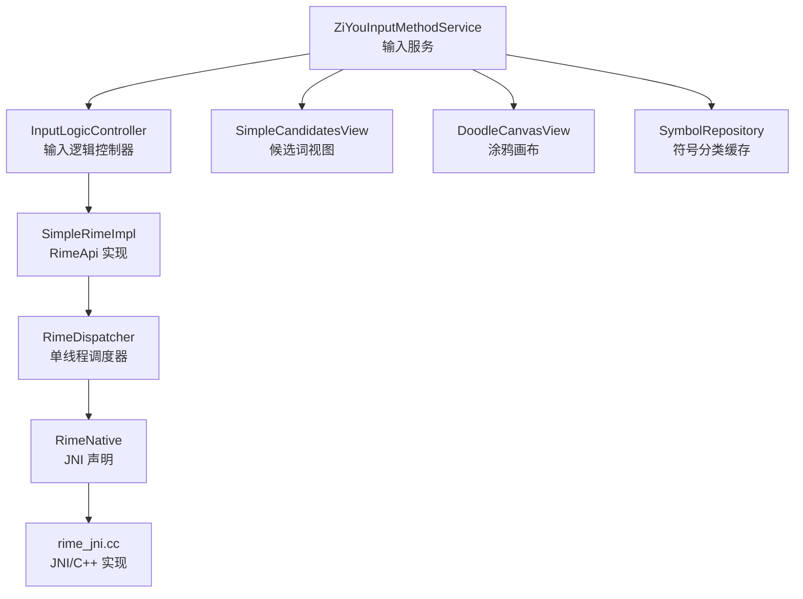
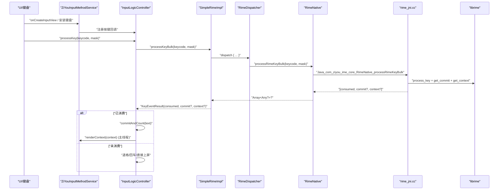
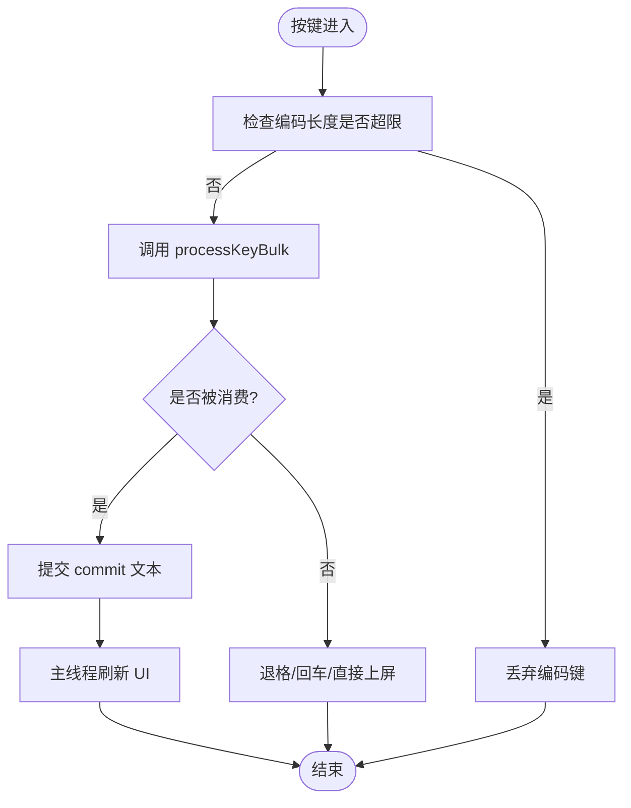
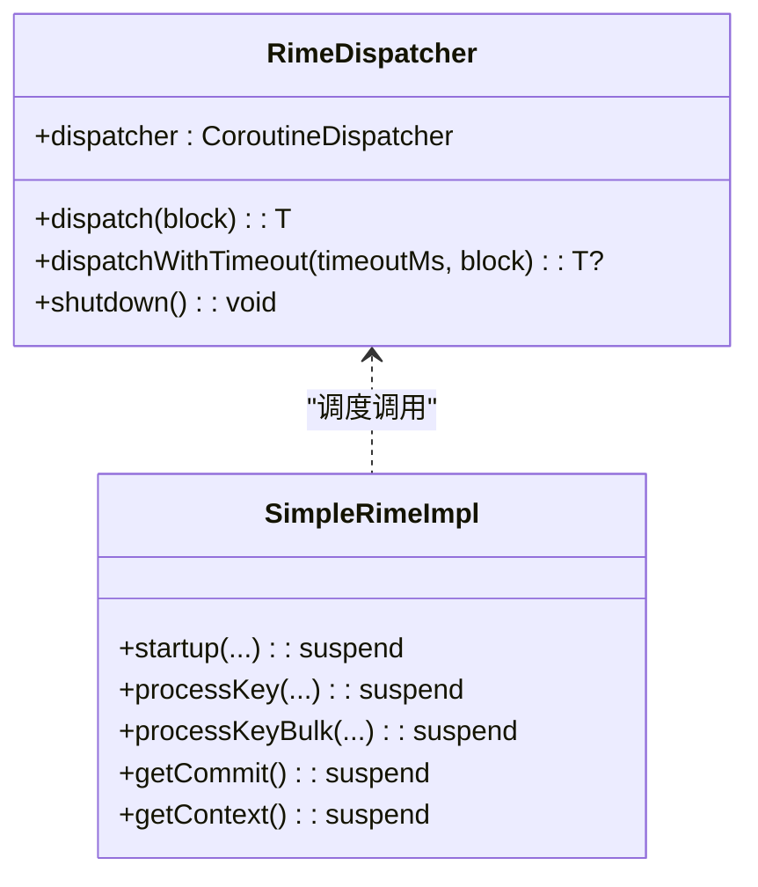
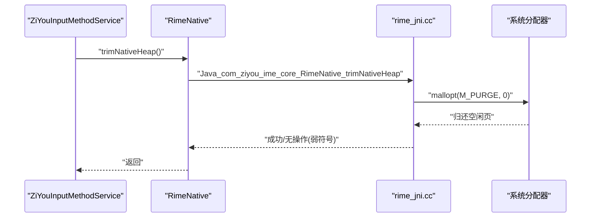
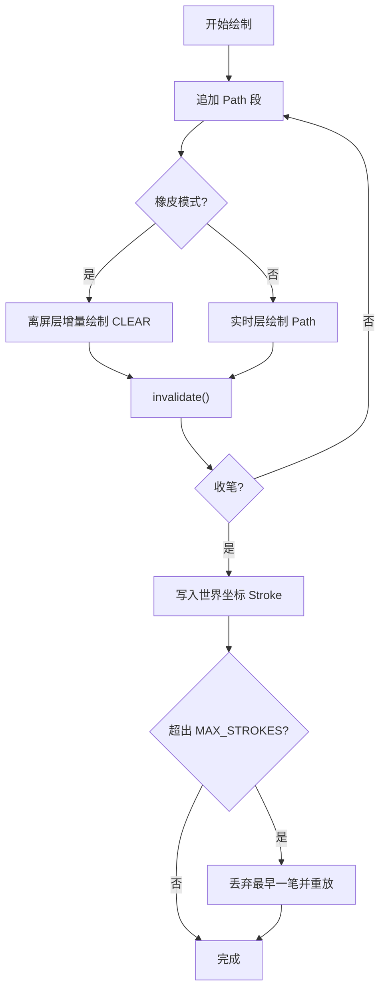
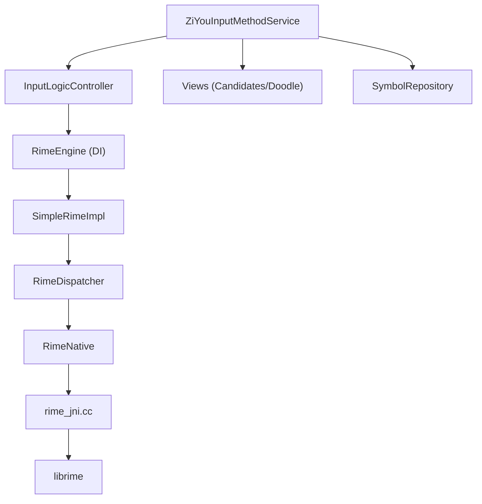

# 性能调优技巧

<cite>
**本文引用的文件**   
- [RimeNative.kt](file://app/src/main/java/com/ziyou/ime/core/RimeNative.kt)
- [RimeDispatcher.kt](file://app/src/main/java/com/ziyou/ime/core/RimeDispatcher.kt)
- [SimpleRimeImpl.kt](file://app/src/main/java/com/ziyou/ime/core/SimpleRimeImpl.kt)
- [rime_jni.cc](file://app/src/main/jni/librime_jni/rime_jni.cc)
- [ZiYouInputMethodService.kt](file://app/src/main/java/com/ziyou/ime/ime/ZiYouInputMethodService.kt)
- [InputLogicController.kt](file://app/src/main/java/com/ziyou/ime/ime/InputLogicController.kt)
- [DoodleCanvasView.kt](file://app/src/main/java/com/ziyou/ime/ime/DoodleCanvasView.kt)
- [SimpleCandidatesView.kt](file://app/src/main/java/com/ziyou/ime/ime/SimpleCandidatesView.kt)
- [SymbolCategory.kt](file://app/src/main/java/com/ziyou/ime/data/SymbolCategory.kt)
</cite>

## 目录
1. [简介](#简介)
2. [项目结构](#项目结构)
3. [核心组件](#核心组件)
4. [架构总览](#架构总览)
5. [详细组件分析](#详细组件分析)
6. [依赖分析](#依赖分析)
7. [性能考量](#性能考量)
8. [故障排查指南](#故障排查指南)
9. [结论](#结论)
10. [附录](#附录)

## 简介
本指南聚焦输入法性能优化，围绕减少 JNI 调用次数、优化内存使用、提升渲染性能与避免热路径阻塞等关键技术展开。结合代码库中的批量 JNI 调用、协程调度策略、内存池与缓存机制、以及 Canvas 绘制优化实践，提供可落地的优化方法与评估手段。

## 项目结构
本项目采用分层与模块化组织：
- 核心引擎层：RimeNative（JNI 声明）、SimpleRimeImpl（API 实现）、RimeDispatcher（单线程调度）
- 输入服务层：ZiYouInputMethodService（生命周期、视图装配、事件路由）
- 输入逻辑层：InputLogicController（按键处理、上屏、UI 刷新）
- 渲染层：DoodleCanvasView（涂鸦画布）、SimpleCandidatesView（候选词列表）
- 数据与缓存：SymbolRepository（符号分类 YAML 解析与缓存）
- JNI 实现：rime_jni.cc（librime 封装、批量接口、内存回收）

图表来源
- [ZiYouInputMethodService.kt:1-120](file://app/src/main/java/com/ziyou/ime/ime/ZiYouInputMethodService.kt#L1-L120)
- [InputLogicController.kt:1-120](file://app/src/main/java/com/ziyou/ime/ime/InputLogicController.kt#L1-L120)
- [SimpleRimeImpl.kt:1-80](file://app/src/main/java/com/ziyou/ime/core/SimpleRimeImpl.kt#L1-L80)
- [RimeDispatcher.kt:1-60](file://app/src/main/java/com/ziyou/ime/core/RimeDispatcher.kt#L1-L60)
- [RimeNative.kt:1-80](file://app/src/main/java/com/ziyou/ime/core/RimeNative.kt#L1-L80)
- [rime_jni.cc:1-120](file://app/src/main/jni/librime_jni/rime_jni.cc#L1-L120)
- [SimpleCandidatesView.kt:1-80](file://app/src/main/java/com/ziyou/ime/ime/SimpleCandidatesView.kt#L1-L80)
- [DoodleCanvasView.kt:1-120](file://app/src/main/java/com/ziyou/ime/ime/DoodleCanvasView.kt#L1-L120)
- [SymbolCategory.kt:1-80](file://app/src/main/java/com/ziyou/ime/data/SymbolCategory.kt#L1-L80)

章节来源
- [ZiYouInputMethodService.kt:1-120](file://app/src/main/java/com/ziyou/ime/ime/ZiYouInputMethodService.kt#L1-L120)
- [InputLogicController.kt:1-120](file://app/src/main/java/com/ziyou/ime/ime/InputLogicController.kt#L1-L120)
- [SimpleRimeImpl.kt:1-80](file://app/src/main/java/com/ziyou/ime/core/SimpleRimeImpl.kt#L1-L80)
- [RimeDispatcher.kt:1-60](file://app/src/main/java/com/ziyou/ime/core/RimeDispatcher.kt#L1-L60)
- [RimeNative.kt:1-80](file://app/src/main/java/com/ziyou/ime/core/RimeNative.kt#L1-L80)
- [rime_jni.cc:1-120](file://app/src/main/jni/librime_jni/rime_jni.cc#L1-L120)
- [SimpleCandidatesView.kt:1-80](file://app/src/main/java/com/ziyou/ime/ime/SimpleCandidatesView.kt#L1-L80)
- [DoodleCanvasView.kt:1-120](file://app/src/main/java/com/ziyou/ime/ime/DoodleCanvasView.kt#L1-L120)
- [SymbolCategory.kt:1-80](file://app/src/main/java/com/ziyou/ime/data/SymbolCategory.kt#L1-L80)

## 核心组件
- RimeNative：JNI 方法声明，包含启动、退出、按键处理、状态获取、方案管理、选项设置与消息回调；提供批量按键与批量候选接口用于热路径优化。
- RimeDispatcher：单线程调度器，确保所有 librime 调用在同一线程顺序执行，避免数据竞争。
- SimpleRimeImpl：RimeApi 的具体实现，将上层挂起调用统一调度到 RimeDispatcher，并解析批量结果。
- rime_jni.cc：JNI/C++ 实现，封装 librime 会话、批量按键处理、批量候选获取、用户数据同步与 native 堆释放。
- InputLogicController：输入逻辑控制器，串联 processKeyBulk、commit、UI 刷新，内置慢按键告警与编码长度上限保护。
- ZiYouInputMethodService：输入法服务主类，负责生命周期、视图装配、键盘切换、引擎同步与面板协调。
- DoodleCanvasView：双层渲染的无限画布，离屏位图缓存当前视口笔迹，平移时重放，导出降采样防 OOM。
- SimpleCandidatesView：候选词视图，支持预测态高亮、滑动翻页与缩放因子适配悬浮模式。
- SymbolRepository：符号分类 YAML 解析与全量缓存，预热后零 IO 访问。

章节来源
- [RimeNative.kt:1-170](file://app/src/main/java/com/ziyou/ime/core/RimeNative.kt#L1-L170)
- [RimeDispatcher.kt:1-91](file://app/src/main/java/com/ziyou/ime/core/RimeDispatcher.kt#L1-L91)
- [SimpleRimeImpl.kt:1-177](file://app/src/main/java/com/ziyou/ime/core/SimpleRimeImpl.kt#L1-L177)
- [rime_jni.cc:1-528](file://app/src/main/jni/librime_jni/rime_jni.cc#L1-L528)
- [InputLogicController.kt:1-200](file://app/src/main/java/com/ziyou/ime/ime/InputLogicController.kt#L1-L200)
- [ZiYouInputMethodService.kt:1-200](file://app/src/main/java/com/ziyou/ime/ime/ZiYouInputMethodService.kt#L1-L200)
- [DoodleCanvasView.kt:1-120](file://app/src/main/java/com/ziyou/ime/ime/DoodleCanvasView.kt#L1-L120)
- [SimpleCandidatesView.kt:1-120](file://app/src/main/java/com/ziyou/ime/ime/SimpleCandidatesView.kt#L1-L120)
- [SymbolCategory.kt:1-120](file://app/src/main/java/com/ziyou/ime/data/SymbolCategory.kt#L1-L120)

## 架构总览
下图展示从按键到渲染的关键流程，突出批量 JNI 调用与单线程调度对性能的贡献。

图表来源
- [InputLogicController.kt:120-200](file://app/src/main/java/com/ziyou/ime/ime/InputLogicController.kt#L120-L200)
- [SimpleRimeImpl.kt:50-90](file://app/src/main/java/com/ziyou/ime/core/SimpleRimeImpl.kt#L50-L90)
- [RimeNative.kt:60-110](file://app/src/main/java/com/ziyou/ime/core/RimeNative.kt#L60-L110)
- [rime_jni.cc:350-420](file://app/src/main/jni/librime_jni/rime_jni.cc#L350-L420)

章节来源
- [InputLogicController.kt:120-200](file://app/src/main/java/com/ziyou/ime/ime/InputLogicController.kt#L120-L200)
- [SimpleRimeImpl.kt:50-90](file://app/src/main/java/com/ziyou/ime/core/SimpleRimeImpl.kt#L50-L90)
- [RimeNative.kt:60-110](file://app/src/main/java/com/ziyou/ime/core/RimeNative.kt#L60-L110)
- [rime_jni.cc:350-420](file://app/src/main/jni/librime_jni/rime_jni.cc#L350-L420)

## 详细组件分析

### 批量 JNI 调用与热路径优化
- 关键思路：将 processKey + getCommit + getContext 合并为单次 JNI 跨界，减少主线程↔Rime 线程往返与 JNI 开销。
- 实现要点：
  - JNI 层返回数组 [consumed, commit?, context?]，Kotlin 层解析为 KeyEventResult。
  - 在 InputLogicController 中通过 processKeyBulk 走热路径，并在慢按键阈值触发告警日志。
  - 编码长度上限防护避免 T9 长串导致的组合爆炸。

图表来源
- [InputLogicController.kt:120-186](file://app/src/main/java/com/ziyou/ime/ime/InputLogicController.kt#L120-L186)
- [SimpleRimeImpl.kt:58-70](file://app/src/main/java/com/ziyou/ime/core/SimpleRimeImpl.kt#L58-L70)
- [RimeNative.kt:60-80](file://app/src/main/java/com/ziyou/ime/core/RimeNative.kt#L60-L80)
- [rime_jni.cc:360-390](file://app/src/main/jni/librime_jni/rime_jni.cc#L360-L390)

章节来源
- [InputLogicController.kt:120-186](file://app/src/main/java/com/ziyou/ime/ime/InputLogicController.kt#L120-L186)
- [SimpleRimeImpl.kt:58-70](file://app/src/main/java/com/ziyou/ime/core/SimpleRimeImpl.kt#L58-L70)
- [RimeNative.kt:60-80](file://app/src/main/java/com/ziyou/ime/core/RimeNative.kt#L60-L80)
- [rime_jni.cc:360-390](file://app/src/main/jni/librime_jni/rime_jni.cc#L360-L390)

### 单线程调度与协程策略
- RimeDispatcher 创建专属单线程 Executor，并通过协程调度器保证 librime 调用顺序执行。
- 所有 RimeApi 方法以 suspend 形式暴露，内部统一 dispatch 到该线程。
- 超时与关闭控制：dispatchWithTimeout 提供超时保护，shutdown 释放资源。

图表来源
- [RimeDispatcher.kt:20-91](file://app/src/main/java/com/ziyou/ime/core/RimeDispatcher.kt#L20-L91)
- [SimpleRimeImpl.kt:30-120](file://app/src/main/java/com/ziyou/ime/core/SimpleRimeImpl.kt#L30-L120)

章节来源
- [RimeDispatcher.kt:20-91](file://app/src/main/java/com/ziyou/ime/core/RimeDispatcher.kt#L20-L91)
- [SimpleRimeImpl.kt:30-120](file://app/src/main/java/com/ziyou/ime/core/SimpleRimeImpl.kt#L30-L120)

### 内存管理与 Native 堆释放
- 词库部署会产生大量临时分配，scudo 分配器默认持留空闲页不还，导致常驻内存升高。
- 通过 trimNativeHeap 调用 mallopt(M_PURGE) 归还空闲页给系统，降低驻留占用。
- 在部署完成或内存吃紧时机调用，线程安全且无需经 RimeDispatcher。

图表来源
- [ZiYouInputMethodService.kt:880-900](file://app/src/main/java/com/ziyou/ime/ime/ZiYouInputMethodService.kt#L880-L900)
- [RimeNative.kt:50-60](file://app/src/main/java/com/ziyou/ime/core/RimeNative.kt#L50-L60)
- [rime_jni.cc:330-350](file://app/src/main/jni/librime_jni/rime_jni.cc#L330-L350)

章节来源
- [ZiYouInputMethodService.kt:880-900](file://app/src/main/java/com/ziyou/ime/ime/ZiYouInputMethodService.kt#L880-L900)
- [RimeNative.kt:50-60](file://app/src/main/java/com/ziyou/ime/core/RimeNative.kt#L50-L60)
- [rime_jni.cc:330-350](file://app/src/main/jni/librime_jni/rime_jni.cc#L330-L350)

### Canvas 绘制优化（涂鸦画布）
- 双层渲染：底层离屏 Bitmap 缓存当前视口可见笔迹；顶层仅绘制实时 Path。
- 平移时按笔画栈整体重放位图，受 MAX_STROKES 约束，避免无限增长。
- 导出快照时对包围盒超限时等比降采样，防止 OOM。
- 橡皮擦增量绘入离屏层，撤销/清空高效。

图表来源
- [DoodleCanvasView.kt:150-220](file://app/src/main/java/com/ziyou/ime/ime/DoodleCanvasView.kt#L150-L220)
- [DoodleCanvasView.kt:340-370](file://app/src/main/java/com/ziyou/ime/ime/DoodleCanvasView.kt#L340-L370)
- [DoodleCanvasView.kt:430-470](file://app/src/main/java/com/ziyou/ime/ime/DoodleCanvasView.kt#L430-L470)

章节来源
- [DoodleCanvasView.kt:150-220](file://app/src/main/java/com/ziyou/ime/ime/DoodleCanvasView.kt#L150-L220)
- [DoodleCanvasView.kt:340-370](file://app/src/main/java/com/ziyou/ime/ime/DoodleCanvasView.kt#L340-L370)
- [DoodleCanvasView.kt:430-470](file://app/src/main/java/com/ziyou/ime/ime/DoodleCanvasView.kt#L430-L470)

### 候选词渲染与预测态
- SimpleCandidatesView 支持预测态整栏强调色绘制，与普通候选区分。
- 悬浮模式下 scaleFactor 统一缩放字号与高度，保持视觉一致。
- 滑动翻页与点击选择快速响应，布局计算复用 RectF 列表。

章节来源
- [SimpleCandidatesView.kt:180-260](file://app/src/main/java/com/ziyou/ime/ime/SimpleCandidatesView.kt#L180-L260)

### 数据缓存与预热
- SymbolRepository 首次访问时解析 symbols.yaml 并全量缓存，后续访问零 IO。
- 可在 Service onCreate 后台预热，避免首次切分类卡顿。
- 失败回退内置兜底集合，保证可用性。

章节来源
- [SymbolCategory.kt:150-260](file://app/src/main/java/com/ziyou/ime/data/SymbolCategory.kt#L150-L260)

## 依赖分析
- 组件耦合：
  - InputLogicController 依赖 RimeEngine（DI 注入），通过 Callbacks 与 Service 解耦。
  - SimpleRimeImpl 依赖 RimeDispatcher 与 RimeNative。
  - rime_jni.cc 依赖 librime API 与 Android log/malloc。
- 外部依赖：
  - librime（静态库/插件可选：lua/octagram/predict）。
  - Android InputMethodService、ClipboardManager、KeyCharacterMap。
- 潜在循环依赖：
  - 通过 DI 容器与接口抽象避免 Service 与 Controller 的直接强耦合。

图表来源
- [InputLogicController.kt:1-120](file://app/src/main/java/com/ziyou/ime/ime/InputLogicController.kt#L1-L120)
- [SimpleRimeImpl.kt:1-80](file://app/src/main/java/com/ziyou/ime/core/SimpleRimeImpl.kt#L1-L80)
- [RimeDispatcher.kt:1-60](file://app/src/main/java/com/ziyou/ime/core/RimeDispatcher.kt#L1-L60)
- [RimeNative.kt:1-80](file://app/src/main/java/com/ziyou/ime/core/RimeNative.kt#L1-L80)
- [rime_jni.cc:1-120](file://app/src/main/jni/librime_jni/rime_jni.cc#L1-L120)
- [ZiYouInputMethodService.kt:1-120](file://app/src/main/java/com/ziyou/ime/ime/ZiYouInputMethodService.kt#L1-L120)
- [SimpleCandidatesView.kt:1-80](file://app/src/main/java/com/ziyou/ime/ime/SimpleCandidatesView.kt#L1-L80)
- [DoodleCanvasView.kt:1-80](file://app/src/main/java/com/ziyou/ime/ime/DoodleCanvasView.kt#L1-L80)
- [SymbolCategory.kt:1-80](file://app/src/main/java/com/ziyou/ime/data/SymbolCategory.kt#L1-L80)

章节来源
- [InputLogicController.kt:1-120](file://app/src/main/java/com/ziyou/ime/ime/InputLogicController.kt#L1-L120)
- [SimpleRimeImpl.kt:1-80](file://app/src/main/java/com/ziyou/ime/core/SimpleRimeImpl.kt#L1-L80)
- [RimeDispatcher.kt:1-60](file://app/src/main/java/com/ziyou/ime/core/RimeDispatcher.kt#L1-L60)
- [RimeNative.kt:1-80](file://app/src/main/java/com/ziyou/ime/core/RimeNative.kt#L1-L80)
- [rime_jni.cc:1-120](file://app/src/main/jni/librime_jni/rime_jni.cc#L1-L120)
- [ZiYouInputMethodService.kt:1-120](file://app/src/main/java/com/ziyou/ime/ime/ZiYouInputMethodService.kt#L1-L120)
- [SimpleCandidatesView.kt:1-80](file://app/src/main/java/com/ziyou/ime/ime/SimpleCandidatesView.kt#L1-L80)
- [DoodleCanvasView.kt:1-80](file://app/src/main/java/com/ziyou/ime/ime/DoodleCanvasView.kt#L1-L80)
- [SymbolCategory.kt:1-80](file://app/src/main/java/com/ziyou/ime/data/SymbolCategory.kt#L1-L80)

## 性能考量
- 减少 JNI 调用次数
  - 使用 processRimeKeyBulk 合并三次调用，显著降低跨进程与线程切换成本。
  - 批量候选 getRimeBulkCandidates 一次返回 size、highlighted 与候选列表。
- 优化内存使用
  - 调用 trimNativeHeap 归还 native 堆空闲页，降低部署后的驻留内存。
  - 涂鸦画布限制 MAX_STROKES，导出时降采样，避免大 Bitmap。
- 提升渲染性能
  - 双层渲染与离屏位图缓存，平移时重放而非逐笔重绘。
  - 候选词视图复用 Paint 与 RectF，减少对象分配。
- 避免热路径阻塞
  - 编码长度上限防护，避免 T9 长串组合爆炸。
  - 慢按键告警阈值（SLOW_KEY_WARN_MS）定位耗时退化。
  - latest-wins 串行化引擎同步，避免并发交错导致迟到写入。
- 缓存机制
  - SymbolRepository 预热 YAML 分类缓存，首访零 IO。
  - ClipboardHistoryRepository 内存缓存读路径 O(1)。

[本节为通用指导，不直接分析具体文件]

## 故障排查指南
- 慢按键检测
  - 在 InputLogicController 中对 processKeyBulk 计时，超过阈值输出警告日志，便于定位瓶颈。
- 引擎就绪等待
  - awaitEngineReady 轮询引擎初始化状态，超时放弃并依赖部署完成消息重同步。
- 异常捕获与恢复
  - RimeDispatcher 捕获异常并记录日志；Service 层在同步异常时清理标志位避免状态残留。
- 内存泄漏与资源释放
  - 涂鸦画布 release 回收离屏层与 Bitmap；面板关闭前统一清理 WebView 与离屏资源。

章节来源
- [InputLogicController.kt:140-186](file://app/src/main/java/com/ziyou/ime/ime/InputLogicController.kt#L140-L186)
- [ZiYouInputMethodService.kt:650-700](file://app/src/main/java/com/ziyou/ime/ime/ZiYouInputMethodService.kt#L650-L700)
- [DoodleCanvasView.kt:460-475](file://app/src/main/java/com/ziyou/ime/ime/DoodleCanvasView.kt#L460-L475)

## 结论
通过批量 JNI 调用、单线程调度、内存池与缓存机制、以及 Canvas 双层渲染优化，输入法在热路径与渲染性能方面具备显著提升。配合慢按键监控与引擎就绪等待策略，可有效避免阻塞与抖动。建议持续使用性能工具（如 Perfetto、Systrace、Android Studio Profiler）进行瓶颈分析与效果评估，确保在高帧率设备上的稳定体验。

[本节为总结性内容，不直接分析具体文件]

## 附录
- 性能监控工具建议
  - Perfetto：追踪 JNI 跨界、协程调度与绘制帧时间。
  - Systrace：分析输入事件链路与 UI 线程阻塞。
  - Android Studio Profiler：CPU/内存/网络热点定位。
- 优化效果评估方法
  - 基准测试：统计 processKeyBulk 平均耗时与 P95/P99。
  - 内存基线：部署前后 native 堆驻留对比，验证 trimNativeHeap 效果。
  - 渲染指标：帧时间、重绘次数、Bitmap 分配频率。

[本节为通用指导，不直接分析具体文件]