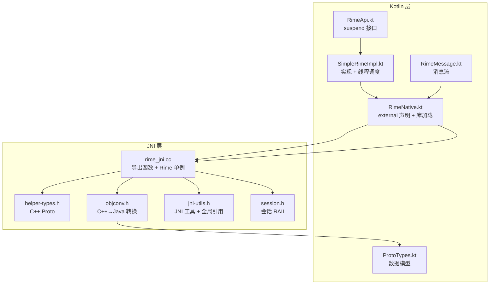
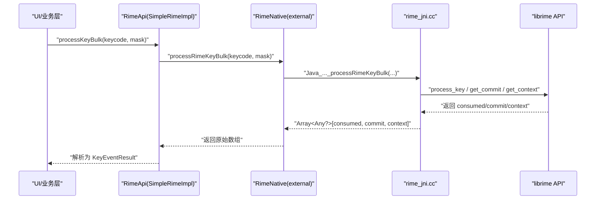
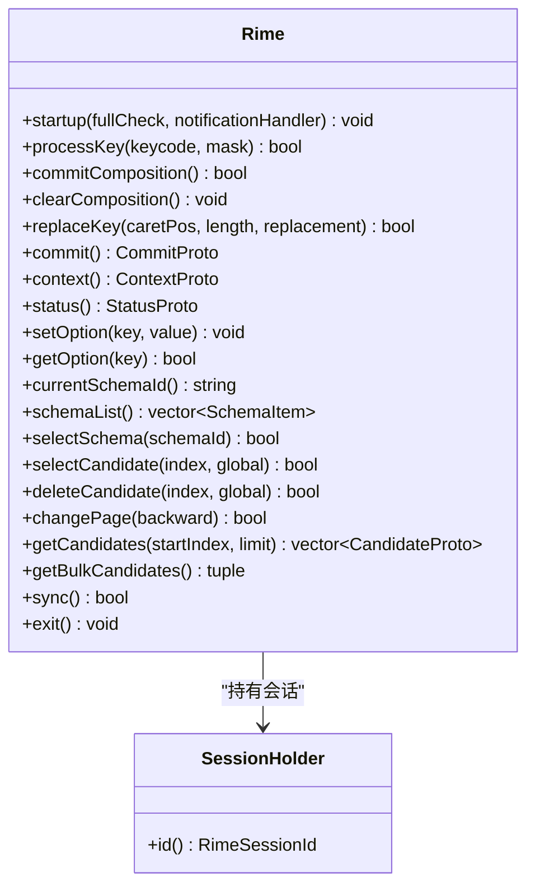
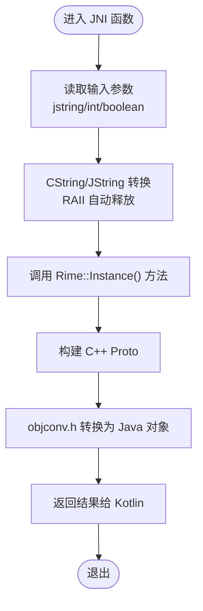
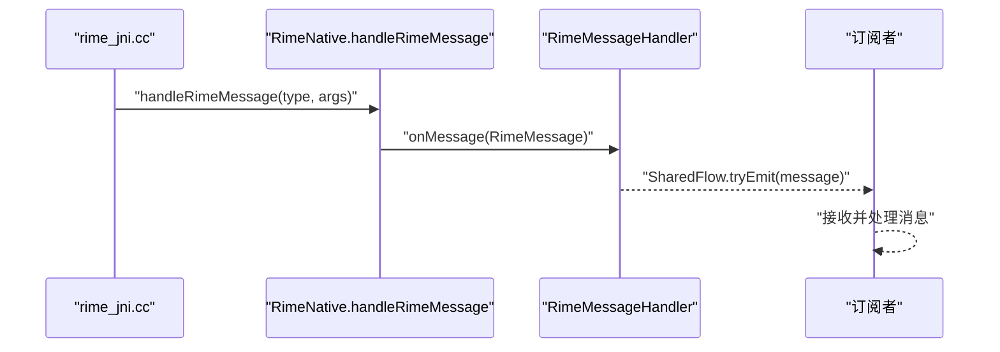
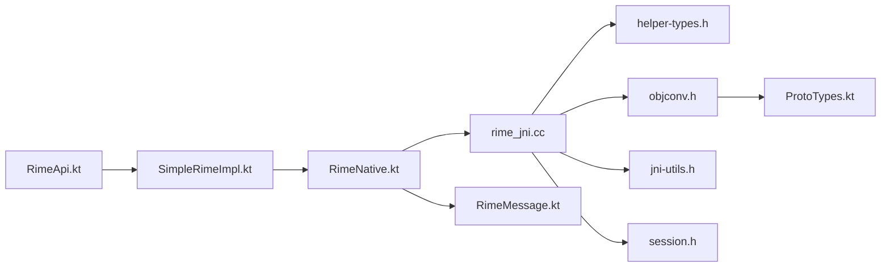

# 扩展 JNI 函数

<cite>
**本文引用的文件**   
- [rime_jni.cc](file://app/src/main/jni/librime_jni/rime_jni.cc)
- [RimeNative.kt](file://app/src/main/java/com/ziyou/ime/core/RimeNative.kt)
- [RimeApi.kt](file://app/src/main/java/com/ziyou/ime/core/RimeApi.kt)
- [helper-types.h](file://app/src/main/jni/librime_jni/helper-types.h)
- [jni-utils.h](file://app/src/main/jni/librime_jni/jni-utils.h)
- [objconv.h](file://app/src/main/jni/librime_jni/objconv.h)
- [session.h](file://app/src/main/jni/librime_jni/session.h)
- [RimeMessage.kt](file://app/src/main/java/com/ziyou/ime/core/RimeMessage.kt)
- [SimpleRimeImpl.kt](file://app/src/main/java/com/ziyou/ime/core/SimpleRimeImpl.kt)
- [ProtoTypes.kt](file://app/src/main/java/com/ziyou/ime/core/ProtoTypes.kt)
</cite>

## 目录
1. [简介](#简介)
2. [项目结构](#项目结构)
3. [核心组件](#核心组件)
4. [架构总览](#架构总览)
5. [详细组件分析](#详细组件分析)
6. [依赖关系分析](#依赖关系分析)
7. [性能考虑](#性能考虑)
8. [故障排查指南](#故障排查指南)
9. [结论](#结论)
10. [附录：三步实现流程与最佳实践](#附录三步实现流程与最佳实践)

## 简介
本文面向需要在 Android 输入法项目中扩展 JNI 以调用新的 librime API 的开发者。内容涵盖在 C++ 层导出 JNI 函数、在 Kotlin 层声明 external 方法、在 RimeApi 接口中暴露 suspend 方法，并详细说明 JNI 数据类型转换、异常处理、内存管理与线程安全。文末提供“三步实现流程”和最佳实践（RAII 资源管理、错误处理模式），帮助快速、稳定地新增功能。

## 项目结构
本项目的 JNI 桥接位于 app/src/main/jni/librime_jni 目录，Kotlin 侧封装位于 app/src/main/java/com/ziyou/ime/core。关键文件职责如下：
- rime_jni.cc：JNI 导出函数、Rime 引擎单例封装、会话生命周期、对象转换入口
- helper-types.h：C++ 侧数据模型（CommitProto、ContextProto、StatusProto、SchemaItem 等）
- jni-utils.h：JNI 工具类（CString/JString/JRef/JEnv/GlobalRefSingleton）
- objconv.h：C++ Proto 到 Java 对象的转换函数
- session.h：会话 RAII 封装
- RimeNative.kt：external 方法声明与库加载、消息回调入口
- RimeApi.kt：对外 suspend API 接口
- SimpleRimeImpl.kt：接口实现，统一调度到单线程执行
- RimeMessage.kt：消息类型与 SharedFlow 分发
- ProtoTypes.kt：Java 侧数据模型，与 C++ Proto 一一对应

图表来源
- [rime_jni.cc:1-528](file://app/src/main/jni/librime_jni/rime_jni.cc#L1-L528)
- [RimeNative.kt:1-170](file://app/src/main/java/com/ziyou/ime/core/RimeNative.kt#L1-L170)
- [RimeApi.kt:1-105](file://app/src/main/java/com/ziyou/ime/core/RimeApi.kt#L1-L105)
- [helper-types.h:1-165](file://app/src/main/jni/librime_jni/helper-types.h#L1-L165)
- [jni-utils.h:1-209](file://app/src/main/jni/librime_jni/jni-utils.h#L1-L209)
- [objconv.h:1-126](file://app/src/main/jni/librime_jni/objconv.h#L1-L126)
- [session.h:1-36](file://app/src/main/jni/librime_jni/session.h#L1-L36)
- [RimeMessage.kt:1-42](file://app/src/main/java/com/ziyou/ime/core/RimeMessage.kt#L1-L42)
- [ProtoTypes.kt:1-108](file://app/src/main/java/com/ziyou/ime/core/ProtoTypes.kt#L1-L108)

章节来源
- [rime_jni.cc:1-528](file://app/src/main/jni/librime_jni/rime_jni.cc#L1-L528)
- [RimeNative.kt:1-170](file://app/src/main/java/com/ziyou/ime/core/RimeNative.kt#L1-L170)
- [RimeApi.kt:1-105](file://app/src/main/java/com/ziyou/ime/core/RimeApi.kt#L1-L105)
- [helper-types.h:1-165](file://app/src/main/jni/librime_jni/helper-types.h#L1-L165)
- [jni-utils.h:1-209](file://app/src/main/jni/librime_jni/jni-utils.h#L1-L209)
- [objconv.h:1-126](file://app/src/main/jni/librime_jni/objconv.h#L1-L126)
- [session.h:1-36](file://app/src/main/jni/librime_jni/session.h#L1-L36)
- [RimeMessage.kt:1-42](file://app/src/main/java/com/ziyou/ime/core/RimeMessage.kt#L1-L42)
- [ProtoTypes.kt:1-108](file://app/src/main/java/com/ziyou/ime/core/ProtoTypes.kt#L1-L108)

## 核心组件
- Rime 引擎单例与 Session 管理：封装 librime API 初始化、会话创建/销毁、选项与候选词操作
- JNI 导出函数：将 Kotlin 的 external 方法与 C++ 实现绑定
- 对象转换层：C++ Proto → Java 对象，保证零拷贝或最小拷贝
- 消息回调：从 C++ 回调到 Kotlin，通过 SharedFlow 广播
- 线程调度：所有 suspend 方法经 RimeDispatcher 在单线程执行，避免并发问题

章节来源
- [rime_jni.cc:46-265](file://app/src/main/jni/librime_jni/rime_jni.cc#L46-L265)
- [session.h:12-36](file://app/src/main/jni/librime_jni/session.h#L12-L36)
- [objconv.h:14-126](file://app/src/main/jni/librime_jni/objconv.h#L14-L126)
- [RimeMessage.kt:29-42](file://app/src/main/java/com/ziyou/ime/core/RimeMessage.kt#L29-L42)
- [SimpleRimeImpl.kt:10-177](file://app/src/main/java/com/ziyou/ime/core/SimpleRimeImpl.kt#L10-L177)

## 架构总览
下图展示从 Kotlin 调用到 librime 的完整链路，包括批量按键处理的热路径优化。

图表来源
- [rime_jni.cc:366-384](file://app/src/main/jni/librime_jni/rime_jni.cc#L366-L384)
- [RimeNative.kt:66-71](file://app/src/main/java/com/ziyou/ime/core/RimeNative.kt#L66-L71)
- [SimpleRimeImpl.kt:59-64](file://app/src/main/java/com/ziyou/ime/core/SimpleRimeImpl.kt#L59-L64)

## 详细组件分析

### JNI 导出函数与 Rime 单例
- 单例 Rime：负责 startup、exit、session 管理、选项设置、候选词操作、状态获取等
- 导出函数命名遵循 JNI 规范：Java_com_ziyou_ime_core_RimeNative_<method>
- 热路径 processRimeKeyBulk：一次 JNI 跨界完成 process_key + get_commit + get_context，减少跨进程开销

图表来源
- [rime_jni.cc:46-265](file://app/src/main/jni/librime_jni/rime_jni.cc#L46-L265)
- [session.h:12-36](file://app/src/main/jni/librime_jni/session.h#L12-L36)

章节来源
- [rime_jni.cc:277-528](file://app/src/main/jni/librime_jni/rime_jni.cc#L277-L528)
- [session.h:12-36](file://app/src/main/jni/librime_jni/session.h#L12-L36)

### JNI 数据类型转换与内存管理
- CString/JString：RAII 包装，自动释放 UTF-8 字符串，避免内存泄漏
- JRef：局部引用 RAII，确保 DeleteLocalRef 被调用
- GlobalRefSingleton：缓存 Java 类与方法 ID，避免重复查找
- objconv.h：C++ Proto → Java 对象，构造参数与构造函数签名需严格匹配
- helper-types.h：C++ 侧数据结构与 Java 侧 ProtoTypes.kt 一一对应

图表来源
- [jni-utils.h:18-72](file://app/src/main/jni/librime_jni/jni-utils.h#L18-L72)
- [objconv.h:14-126](file://app/src/main/jni/librime_jni/objconv.h#L14-L126)
- [helper-types.h:16-165](file://app/src/main/jni/librime_jni/helper-types.h#L16-L165)

章节来源
- [jni-utils.h:18-209](file://app/src/main/jni/librime_jni/jni-utils.h#L18-L209)
- [objconv.h:14-126](file://app/src/main/jni/librime_jni/objconv.h#L14-L126)
- [helper-types.h:16-165](file://app/src/main/jni/librime_jni/helper-types.h#L16-L165)

### 异常处理与线程安全
- JNI 异常检查：在回调中捕获并清除异常，防止崩溃
- 线程安全：
  - RimeNative 注释明确：native 方法非线程安全，必须通过 RimeDispatcher 在单一线程调用
  - mallopt(M_PURGE) 线程安全，可在任意线程调用
  - 通知回调使用 AttachCurrentThread 获取 JNIEnv
- 错误处理模式：
  - 启动失败时记录日志并跳过重复初始化
  - 会话创建失败时抛出异常并置空会话指针
  - 未消费按键时返回 null 的 commit/context，调用方无需刷新 UI

章节来源
- [rime_jni.cc:289-315](file://app/src/main/jni/librime_jni/rime_jni.cc#L289-L315)
- [rime_jni.cc:337-343](file://app/src/main/jni/librime_jni/rime_jni.cc#L337-L343)
- [RimeNative.kt:8-9](file://app/src/main/java/com/ziyou/ime/core/RimeNative.kt#L8-L9)
- [SimpleRimeImpl.kt:32-42](file://app/src/main/java/com/ziyou/ime/core/SimpleRimeImpl.kt#L32-L42)

### 消息回调与事件流
- JNI 层根据 message_type 映射为数字类型，调用 Kotlin handleRimeMessage
- Kotlin 层将消息封装为 RimeMessage 并通过 SharedFlow 广播
- UI 订阅 messageFlow 获取 schema/option/deploy 变更

图表来源
- [rime_jni.cc:289-315](file://app/src/main/jni/librime_jni/rime_jni.cc#L289-L315)
- [RimeNative.kt:158-168](file://app/src/main/java/com/ziyou/ime/core/RimeNative.kt#L158-L168)
- [RimeMessage.kt:29-42](file://app/src/main/java/com/ziyou/ime/core/RimeMessage.kt#L29-L42)

章节来源
- [RimeMessage.kt:11-42](file://app/src/main/java/com/ziyou/ime/core/RimeMessage.kt#L11-L42)
- [RimeNative.kt:158-168](file://app/src/main/java/com/ziyou/ime/core/RimeNative.kt#L158-L168)

## 依赖关系分析
- Kotlin 层依赖：
  - RimeApi → SimpleRimeImpl → RimeNative → rime_jni.cc
  - ProtoTypes.kt 与 helper-types.h 一一对应
  - RimeMessage.kt 用于事件分发
- JNI 层依赖：
  - rime_jni.cc 依赖 helper-types.h、objconv.h、jni-utils.h、session.h
  - 通过 GlobalRefSingleton 缓存 Java 类与方法 ID

图表来源
- [RimeApi.kt:1-105](file://app/src/main/java/com/ziyou/ime/core/RimeApi.kt#L1-L105)
- [SimpleRimeImpl.kt:10-177](file://app/src/main/java/com/ziyou/ime/core/SimpleRimeImpl.kt#L10-L177)
- [RimeNative.kt:1-170](file://app/src/main/java/com/ziyou/ime/core/RimeNative.kt#L1-L170)
- [rime_jni.cc:1-528](file://app/src/main/jni/librime_jni/rime_jni.cc#L1-L528)
- [helper-types.h:1-165](file://app/src/main/jni/librime_jni/helper-types.h#L1-L165)
- [objconv.h:1-126](file://app/src/main/jni/librime_jni/objconv.h#L1-L126)
- [jni-utils.h:1-209](file://app/src/main/jni/librime_jni/jni-utils.h#L1-L209)
- [session.h:1-36](file://app/src/main/jni/librime_jni/session.h#L1-L36)
- [RimeMessage.kt:1-42](file://app/src/main/java/com/ziyou/ime/core/RimeMessage.kt#L1-L42)
- [ProtoTypes.kt:1-108](file://app/src/main/java/com/ziyou/ime/core/ProtoTypes.kt#L1-L108)

章节来源
- [RimeApi.kt:1-105](file://app/src/main/java/com/ziyou/ime/core/RimeApi.kt#L1-L105)
- [SimpleRimeImpl.kt:10-177](file://app/src/main/java/com/ziyou/ime/core/SimpleRimeImpl.kt#L10-L177)
- [RimeNative.kt:1-170](file://app/src/main/java/com/ziyou/ime/core/RimeNative.kt#L1-L170)
- [rime_jni.cc:1-528](file://app/src/main/jni/librime_jni/rime_jni.cc#L1-L528)
- [helper-types.h:1-165](file://app/src/main/jni/librime_jni/helper-types.h#L1-L165)
- [objconv.h:1-126](file://app/src/main/jni/librime_jni/objconv.h#L1-L126)
- [jni-utils.h:1-209](file://app/src/main/jni/librime_jni/jni-utils.h#L1-L209)
- [session.h:1-36](file://app/src/main/jni/librime_jni/session.h#L1-L36)
- [RimeMessage.kt:1-42](file://app/src/main/java/com/ziyou/ime/core/RimeMessage.kt#L1-L42)
- [ProtoTypes.kt:1-108](file://app/src/main/java/com/ziyou/ime/core/ProtoTypes.kt#L1-L108)

## 性能考虑
- 热路径优化：processRimeKeyBulk 合并三次 JNI 跨界为一次，显著降低延迟
- 内存管理：
  - 使用 RAII 包装 JNI 引用，避免手动释放导致的泄漏
  - mallopt(M_PURGE) 归还空闲页，降低部署后常驻内存
- 对象分配：
  - 预分配向量大小（reserve）减少重分配
  - 使用 std::move 转移所有权，避免拷贝

章节来源
- [rime_jni.cc:366-384](file://app/src/main/jni/librime_jni/rime_jni.cc#L366-L384)
- [rime_jni.cc:337-343](file://app/src/main/jni/librime_jni/rime_jni.cc#L337-L343)
- [helper-types.h:24-33](file://app/src/main/jni/librime_jni/helper-types.h#L24-L33)

## 故障排查指南
- 库加载失败：
  - 检查 ABI 是否匹配（arm64-v8a）
  - 确认 .so 文件存在且可加载
- 引擎未初始化：
  - 确保 startupRime 已调用且 fullCheck 参数正确
  - 检查环境变量设置（RIME_SHARED_DATA_DIR、RIME_USER_DATA_DIR、RIME_DISTRIBUTION_VERSION）
- 会话创建失败：
  - 查看日志输出，确认 rime_get_api 可用
  - 检查是否有重复初始化导致的状态不一致
- 消息回调崩溃：
  - 检查 JNI 异常是否被捕获并清除
  - 确认 handleRimeMessage 的参数类型与签名一致

章节来源
- [RimeNative.kt:18-27](file://app/src/main/java/com/ziyou/ime/core/RimeNative.kt#L18-L27)
- [rime_jni.cc:289-315](file://app/src/main/jni/librime_jni/rime_jni.cc#L289-L315)
- [session.h:14-21](file://app/src/main/jni/librime_jni/session.h#L14-L21)

## 结论
通过统一的 JNI 导出函数、RAII 资源管理、对象转换层与线程安全的 suspend API，本项目实现了高效、稳定的 librime 集成。扩展新 API 时，遵循“三步实现流程”与最佳实践，可快速、安全地添加功能，同时保持性能与稳定性。

## 附录：三步实现流程与最佳实践

### 第一步：在 rime_jni.cc 中添加导出函数
- 定义 JNI 导出函数，命名遵循 Java_com_ziyou_ime_core_RimeNative_<method>
- 使用 CString/JString 进行字符串转换，JRef 管理局部引用
- 调用 Rime::Instance() 对应方法，处理返回值
- 示例参考现有函数：processRimeKey、getRimeCommit、getRimeContext、selectRimeSchema

章节来源
- [rime_jni.cc:354-361](file://app/src/main/jni/librime_jni/rime_jni.cc#L354-L361)
- [rime_jni.cc:411-416](file://app/src/main/jni/librime_jni/rime_jni.cc#L411-L416)
- [rime_jni.cc:420-424](file://app/src/main/jni/librime_jni/rime_jni.cc#L420-L424)
- [rime_jni.cc:470-475](file://app/src/main/jni/librime_jni/rime_jni.cc#L470-L475)

### 第二步：在 RimeNative.kt 中声明 external 函数
- 添加 external fun，参数类型与 JNI 函数签名一致
- 保持与 rime_jni.cc 导出函数名称对应
- 示例参考：processRimeKey、getRimeCommit、selectRimeSchema

章节来源
- [RimeNative.kt:62-71](file://app/src/main/java/com/ziyou/ime/core/RimeNative.kt#L62-L71)
- [RimeNative.kt:87-97](file://app/src/main/java/com/ziyou/ime/core/RimeNative.kt#L87-L97)
- [RimeNative.kt:131-133](file://app/src/main/java/com/ziyou/ime/core/RimeNative.kt#L131-L133)

### 第三步：在 RimeApi.kt 中添加接口方法
- 添加 suspend fun，封装外部调用逻辑
- 默认实现可使用多次调用组合（便于测试），生产实现可单次跨界
- 示例参考：processKeyBulk、getCandidates、selectSchema

章节来源
- [RimeApi.kt:28-40](file://app/src/main/java/com/ziyou/ime/core/RimeApi.kt#L28-L40)
- [RimeApi.kt:62-74](file://app/src/main/java/com/ziyou/ime/core/RimeApi.kt#L62-L74)
- [RimeApi.kt:78-85](file://app/src/main/java/com/ziyou/ime/core/RimeApi.kt#L78-L85)

### 最佳实践
- RAII 资源管理：
  - 使用 CString/JString/JRef 自动管理 JNI 引用
  - SessionHolder 自动创建/销毁会话
- 错误处理模式：
  - 启动失败时记录日志并跳过重复初始化
  - 会话创建失败时抛出异常并置空会话指针
  - 未消费按键时返回 null 的 commit/context
- 线程安全：
  - 所有 native 调用通过 RimeDispatcher 在单一线程执行
  - 回调中使用 AttachCurrentThread 获取 JNIEnv
- 性能优化：
  - 热路径合并 JNI 跨界（processRimeKeyBulk）
  - 预分配向量大小，使用 std::move 转移所有权

章节来源
- [jni-utils.h:18-72](file://app/src/main/jni/librime_jni/jni-utils.h#L18-L72)
- [session.h:12-36](file://app/src/main/jni/librime_jni/session.h#L12-L36)
- [rime_jni.cc:289-315](file://app/src/main/jni/librime_jni/rime_jni.cc#L289-L315)
- [rime_jni.cc:366-384](file://app/src/main/jni/librime_jni/rime_jni.cc#L366-L384)
- [RimeNative.kt:8-9](file://app/src/main/java/com/ziyou/ime/core/RimeNative.kt#L8-L9)