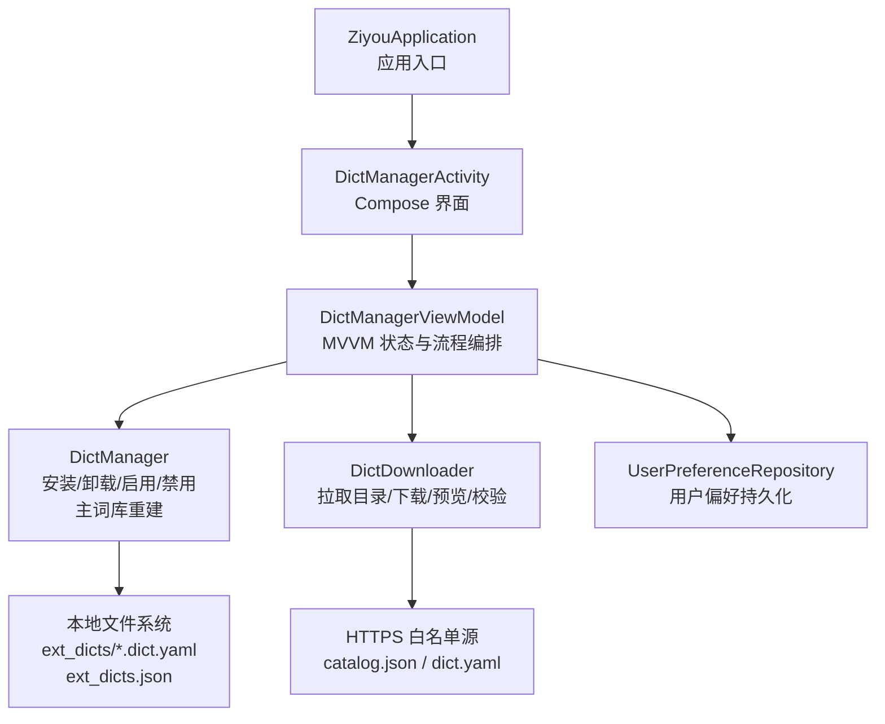
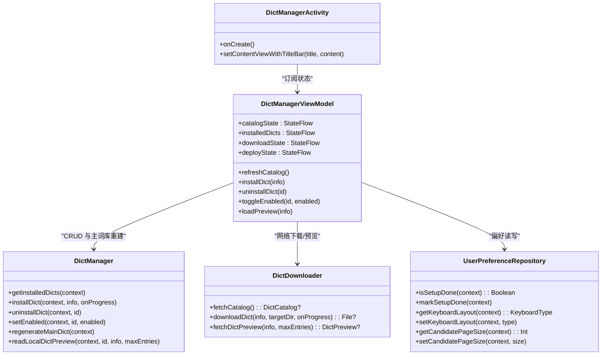
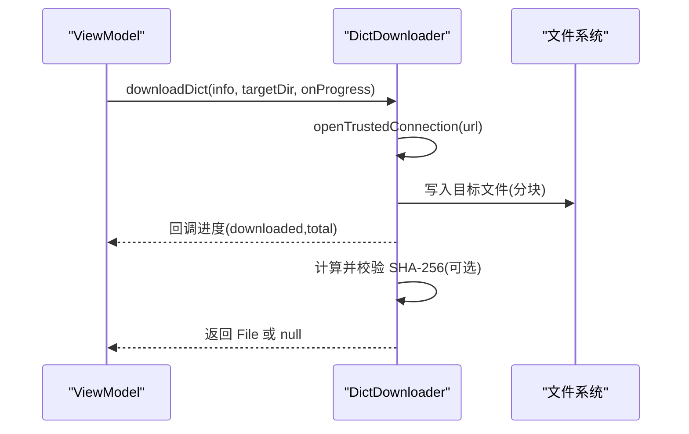
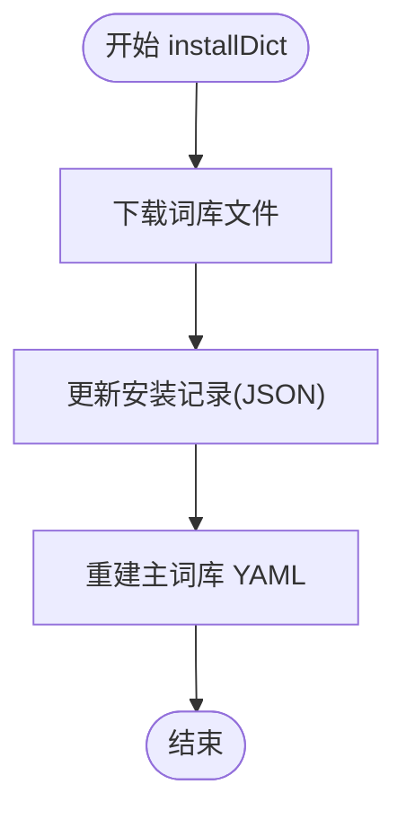
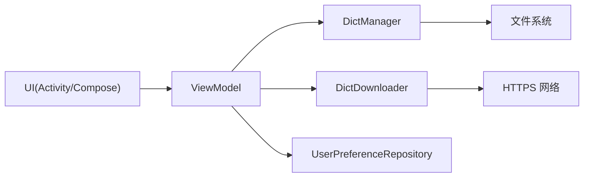

# 添加业务功能模块

<cite>
**本文引用的文件**   
- [ZiyouApplication.kt](file://app/src/main/java/com/ziyou/ime/ZiyouApplication.kt)
- [DictManagerActivity.kt](file://app/src/main/java/com/ziyou/ime/ui/DictManagerActivity.kt)
- [DictManagerViewModel.kt](file://app/src/main/java/com/ziyou/ime/ui/DictManagerViewModel.kt)
- [DictManager.kt](file://app/src/main/java/com/ziyou/ime/dict/DictManager.kt)
- [DictDownloader.kt](file://app/src/main/java/com/ziyou/ime/dict/DictDownloader.kt)
- [DictModels.kt](file://app/src/main/java/com/ziyou/ime/dict/DictModels.kt)
- [UserPreferenceRepository.kt](file://app/src/main/java/com/ziyou/ime/data/UserPreferenceRepository.kt)
</cite>

## 目录
1. [引言](#引言)
2. [项目结构](#项目结构)
3. [核心组件](#核心组件)
4. [架构总览](#架构总览)
5. [详细组件分析](#详细组件分析)
6. [依赖关系分析](#依赖关系分析)
7. [性能考量](#性能考量)
8. [故障排查指南](#故障排查指南)
9. [结论](#结论)
10. [附录：新增模块开发模板与步骤](#附录新增模块开发模板与步骤)

## 引言
本指南面向希望在输入法应用中新增“业务功能模块”的开发者，围绕 MVVM 架构、数据模型设计、Repository 实现、UI 界面开发与依赖注入配置，提供从 0 到 1 的完整方法论与示例。文档以“扩展词库管理”为真实案例，覆盖 CRUD 操作、网络请求、本地存储、异步处理与 UI 状态管理，帮助你在不破坏现有架构的前提下快速扩展新功能。

## 项目结构
本项目采用分层与模块化组织方式：
- 应用入口与全局初始化：ZiyouApplication
- UI 层（Jetpack Compose + Activity）：DictManagerActivity
- 视图模型（MVVM ViewModel）：DictManagerViewModel
- 领域/数据访问层（单例对象）：DictManager（安装/卸载/启用/禁用、主词库重建）、DictDownloader（网络下载、预览、校验）
- 数据模型：DictModels（远程/本地词库信息、目录、状态等）
- 偏好持久化：UserPreferenceRepository（SharedPreferences）

图表来源
- [ZiyouApplication.kt:1-26](file://app/src/main/java/com/ziyou/ime/ZiyouApplication.kt#L1-L26)
- [DictManagerActivity.kt:1-738](file://app/src/main/java/com/ziyou/ime/ui/DictManagerActivity.kt#L1-L738)
- [DictManagerViewModel.kt:1-234](file://app/src/main/java/com/ziyou/ime/ui/DictManagerViewModel.kt#L1-L234)
- [DictManager.kt:1-376](file://app/src/main/java/com/ziyou/ime/dict/DictManager.kt#L1-L376)
- [DictDownloader.kt:1-367](file://app/src/main/java/com/ziyou/ime/dict/DictDownloader.kt#L1-L367)
- [UserPreferenceRepository.kt:1-83](file://app/src/main/java/com/ziyou/ime/data/UserPreferenceRepository.kt#L1-L83)

章节来源
- [ZiyouApplication.kt:1-26](file://app/src/main/java/com/ziyou/ime/ZiyouApplication.kt#L1-L26)
- [DictManagerActivity.kt:1-738](file://app/src/main/java/com/ziyou/ime/ui/DictManagerActivity.kt#L1-L738)
- [DictManagerViewModel.kt:1-234](file://app/src/main/java/com/ziyou/ime/ui/DictManagerViewModel.kt#L1-L234)
- [DictManager.kt:1-376](file://app/src/main/java/com/ziyou/ime/dict/DictManager.kt#L1-L376)
- [DictDownloader.kt:1-367](file://app/src/main/java/com/ziyou/ime/dict/DictDownloader.kt#L1-L367)
- [UserPreferenceRepository.kt:1-83](file://app/src/main/java/com/ziyou/ime/data/UserPreferenceRepository.kt#L1-L83)

## 核心组件
- 数据模型（DictModels）
  - 远程词库信息、分类枚举、目录结构、安装记录、下载/部署/预览状态等统一建模，便于 UI 与网络/本地层解耦。
- 网络层（DictDownloader）
  - 负责 catalog 拉取、词库下载、预览读取、SHA-256 完整性校验、HTTPS 白名单与受控重定向。
- 数据访问层（DictManager）
  - 封装安装/卸载/启用/禁用、安装记录 JSON 读写、主词库 YAML 重建、本地预览解析。
- 视图模型（DictManagerViewModel）
  - 使用 StateFlow 暴露 UI 状态；在 viewModelScope 中调度 IO 任务；协调网络与本地操作，触发引擎重部署。
- UI 层（DictManagerActivity）
  - 基于 Jetpack Compose 构建列表、筛选、弹窗、进度条与错误重试等交互。
- 偏好持久化（UserPreferenceRepository）
  - 通过 SharedPreferences 保存用户偏好，供其他模块复用。

章节来源
- [DictModels.kt:1-113](file://app/src/main/java/com/ziyou/ime/dict/DictModels.kt#L1-L113)
- [DictDownloader.kt:1-367](file://app/src/main/java/com/ziyou/ime/dict/DictDownloader.kt#L1-L367)
- [DictManager.kt:1-376](file://app/src/main/java/com/ziyou/ime/dict/DictManager.kt#L1-L376)
- [DictManagerViewModel.kt:1-234](file://app/src/main/java/com/ziyou/ime/ui/DictManagerViewModel.kt#L1-L234)
- [DictManagerActivity.kt:1-738](file://app/src/main/java/com/ziyou/ime/ui/DictManagerActivity.kt#L1-L738)
- [UserPreferenceRepository.kt:1-83](file://app/src/main/java/com/ziyou/ime/data/UserPreferenceRepository.kt#L1-L83)

## 架构总览
MVVM 在本项目中的落地方式：
- View（Activity + Compose）仅负责展示与用户交互，订阅 ViewModel 的 StateFlow。
- ViewModel 编排业务流，调用 Repository/Service（此处为 DictManager、DictDownloader），将结果映射为 UI 状态。
- Repository/Service 专注数据获取与持久化，屏蔽 IO 细节，向上暴露协程 API。
- 依赖注入：通过组合根（AppContainer）暴露 RIME 引擎等全局能力，由 ViewModel 在需要时调用。

图表来源
- [DictManagerActivity.kt:1-738](file://app/src/main/java/com/ziyou/ime/ui/DictManagerActivity.kt#L1-L738)
- [DictManagerViewModel.kt:1-234](file://app/src/main/java/com/ziyou/ime/ui/DictManagerViewModel.kt#L1-L234)
- [DictManager.kt:1-376](file://app/src/main/java/com/ziyou/ime/dict/DictManager.kt#L1-L376)
- [DictDownloader.kt:1-367](file://app/src/main/java/com/ziyou/ime/dict/DictDownloader.kt#L1-L367)
- [UserPreferenceRepository.kt:1-83](file://app/src/main/java/com/ziyou/ime/data/UserPreferenceRepository.kt#L1-L83)

## 详细组件分析

### 数据模型设计（DictModels）
- 分类与枚举：DictCategory 支持多分类显示与转换。
- 远程信息：RemoteDictInfo 包含 id/name/category/version/url/size/author/sha256，并提供 sizeDisplay 与 ID 合法性校验。
- 目录与安装记录：DictCatalog、InstalledDictsConfig 描述 catalog 结构与本地安装记录结构。
- 状态类型：DownloadState、DeployState、PreviewState 等 sealed class 表达 UI 状态机，避免歧义。
- 词条预览：DictEntry、DictPreview 用于展示前 N 条词条与总数提示。

复杂度与注意事项
- ID 合法性校验防止路径穿越攻击。
- 大小显示格式化提升可读性。
- 状态类确保 UI 分支清晰、可测试。

章节来源
- [DictModels.kt:1-113](file://app/src/main/java/com/ziyou/ime/dict/DictModels.kt#L1-L113)

### 网络层（DictDownloader）
- 安全策略：强制 HTTPS、域名白名单、受控重定向（最多 N 跳）。
- 资源限制：catalog 响应上限、单个词库文件大小上限、预览读取上限。
- 完整性校验：可选 SHA-256 校验，失败则删除半成品并拒绝安装。
- 解析逻辑：解析 catalog.json 与 dict.yaml 正文（跳过注释与头部），提取词条与统计数量。

关键流程（下载词库）

图表来源
- [DictDownloader.kt:87-162](file://app/src/main/java/com/ziyou/ime/dict/DictDownloader.kt#L87-L162)
- [DictDownloader.kt:262-320](file://app/src/main/java/com/ziyou/ime/dict/DictDownloader.kt#L262-L320)

章节来源
- [DictDownloader.kt:1-367](file://app/src/main/java/com/ziyou/ime/dict/DictDownloader.kt#L1-L367)

### 数据访问层（DictManager）
- 安装/卸载/启用/禁用：更新 ext_dicts.json 安装记录，并重建主词库 YAML（luna_pinyin.dict.yaml）。
- 主词库重建：保留基础 import_tables，动态追加已启用的扩展词库路径。
- 本地预览：解析已安装的 .dict.yaml 正文，提取词条与总数提示。
- 检查更新：对比本地版本与 catalog 版本差异。

关键流程（安装词库）

图表来源
- [DictManager.kt:120-150](file://app/src/main/java/com/ziyou/ime/dict/DictManager.kt#L120-L150)
- [DictManager.kt:222-302](file://app/src/main/java/com/ziyou/ime/dict/DictManager.kt#L222-L302)

章节来源
- [DictManager.kt:1-376](file://app/src/main/java/com/ziyou/ime/dict/DictManager.kt#L1-L376)

### 视图模型（DictManagerViewModel）
- 状态管理：使用 MutableStateFlow 暴露 catalogState、installedDicts、downloadState、deployState、updatableIds、selectedCategory、showInstalledOnly、previewState。
- 异步处理：所有 IO 与网络操作均在 viewModelScope 中执行，必要时切换至 Dispatchers.IO。
- 业务流程：
  - 刷新目录：加载 catalog 并计算可更新集合。
  - 安装/卸载/启用：调用 DictManager，完成后刷新本地列表并触发重部署。
  - 预览：优先本地读取，未安装则走网络预览。
- 依赖注入：通过 AppContainer.rimeEngine.redeploy(context) 触发引擎重部署。

章节来源
- [DictManagerViewModel.kt:1-234](file://app/src/main/java/com/ziyou/ime/ui/DictManagerViewModel.kt#L1-L234)

### UI 界面（DictManagerActivity）
- 页面结构：标题栏复用 View 版 TitleBarView，内容区使用 Compose。
- 状态订阅：collectAsState 订阅 ViewModel 的多个 StateFlow，驱动 UI 渲染。
- 交互：分类筛选 TabRow、卡片列表、下载进度条、部署提示横幅、错误重试、预览弹窗。
- 生命周期：在 RESUMED 阶段收集 deployState 并给出 Toast 提示。

章节来源
- [DictManagerActivity.kt:1-738](file://app/src/main/java/com/ziyou/ime/ui/DictManagerActivity.kt#L1-L738)

### 偏好持久化（UserPreferenceRepository）
- 首启向导标记、键盘布局、候选词每页数量等偏好项。
- 与 IME 服务共享同一份偏好文件，保证设置一致性。
- 默认值与 assets/rime/default.yaml 保持一致，避免不一致行为。

章节来源
- [UserPreferenceRepository.kt:1-83](file://app/src/main/java/com/ziyou/ime/data/UserPreferenceRepository.kt#L1-L83)

## 依赖关系分析
- 低耦合高内聚：UI 只依赖 ViewModel；ViewModel 依赖数据层；数据层独立处理 IO。
- 外部依赖：网络层依赖 HttpURLConnection 与 JSON 解析；本地层依赖文件系统与 JSON。
- 可能的循环依赖：当前无循环依赖，ViewModel 通过 AppContainer 访问引擎能力，避免直接耦合。

图表来源
- [DictManagerActivity.kt:1-738](file://app/src/main/java/com/ziyou/ime/ui/DictManagerActivity.kt#L1-L738)
- [DictManagerViewModel.kt:1-234](file://app/src/main/java/com/ziyou/ime/ui/DictManagerViewModel.kt#L1-L234)
- [DictManager.kt:1-376](file://app/src/main/java/com/ziyou/ime/dict/DictManager.kt#L1-L376)
- [DictDownloader.kt:1-367](file://app/src/main/java/com/ziyou/ime/dict/DictDownloader.kt#L1-L367)
- [UserPreferenceRepository.kt:1-83](file://app/src/main/java/com/ziyou/ime/data/UserPreferenceRepository.kt#L1-L83)

章节来源
- [DictManagerViewModel.kt:1-234](file://app/src/main/java/com/ziyou/ime/ui/DictManagerViewModel.kt#L1-L234)
- [DictManager.kt:1-376](file://app/src/main/java/com/ziyou/ime/dict/DictManager.kt#L1-L376)
- [DictDownloader.kt:1-367](file://app/src/main/java/com/ziyou/ime/dict/DictDownloader.kt#L1-L367)

## 性能考量
- 异步与线程：所有 IO/网络操作在 IO 线程执行，避免阻塞主线程；UI 侧使用 collectLatest 减少重复渲染。
- 资源限制：catalog/词库/预览均设置上限，防止内存与磁盘耗尽。
- 增量更新：仅对变更的词库进行重部署，减少不必要的引擎重启。
- 缓存与本地优先：已安装词库优先本地预览，降低网络开销。

[本节为通用指导，无需引用具体文件]

## 故障排查指南
- 网络异常：检查 HTTPS 白名单与重定向策略；确认 catalog 与词库 URL 可达。
- 完整性校验失败：核对 sha256 是否匹配；清理半成品文件后重试。
- 主词库重建失败：检查 luna_pinyin.dict.yaml 是否存在且可写；确认已启用词库路径正确。
- UI 状态卡住：检查 StateFlow 是否正确发射；确认生命周期收集在 RESUMED 阶段。
- 偏好不一致：确认与 IME 服务共用偏好文件名与键名一致。

章节来源
- [DictDownloader.kt:262-320](file://app/src/main/java/com/ziyou/ime/dict/DictDownloader.kt#L262-L320)
- [DictManager.kt:222-302](file://app/src/main/java/com/ziyou/ime/dict/DictManager.kt#L222-L302)
- [DictManagerActivity.kt:54-71](file://app/src/main/java/com/ziyou/ime/ui/DictManagerActivity.kt#L54-L71)
- [UserPreferenceRepository.kt:29-36](file://app/src/main/java/com/ziyou/ime/data/UserPreferenceRepository.kt#L29-L36)

## 结论
通过 MVVM 分层、清晰的 StateFlow 状态管理与安全的网络/本地策略，新增业务模块可以高效、稳健地集成到输入法应用中。以“扩展词库管理”为例，展示了从数据模型、Repository、UI 到依赖注入的完整闭环，可作为后续模块开发的参考范式。

[本节为总结，无需引用具体文件]

## 附录：新增模块开发模板与步骤
以下以“新增一个具备 CRUD、网络请求、本地存储与 UI 集成的业务模块”为目标，给出标准步骤与要点。你可以参照“扩展词库管理”的实现模式进行复制与改造。

- 1. 定义数据模型
  - 创建数据类与枚举，明确远程/本地数据结构与 UI 状态机（如 Catalog/Item/State）。
  - 建议包含 ID 合法性校验与大小格式化等实用属性。
  - 参考：[DictModels.kt:1-113](file://app/src/main/java/com/ziyou/ime/dict/DictModels.kt#L1-L113)

- 2. 实现网络层（Repository/Service）
  - 封装网络请求（HTTP/JSON），设置超时、白名单、重定向控制与资源上限。
  - 提供进度回调与错误处理；对敏感数据进行完整性校验（如 SHA-256）。
  - 参考：[DictDownloader.kt:1-367](file://app/src/main/java/com/ziyou/ime/dict/DictDownloader.kt#L1-L367)

- 3. 实现数据访问层（Repository）
  - 封装本地存储（文件/数据库/SharedPreferences），提供事务性操作（增删改查）。
  - 对外暴露 suspend 函数，内部使用 withContext(Dispatchers.IO)。
  - 参考：[DictManager.kt:1-376](file://app/src/main/java/com/ziyou/ime/dict/DictManager.kt#L1-L376)、[UserPreferenceRepository.kt:1-83](file://app/src/main/java/com/ziyou/ime/data/UserPreferenceRepository.kt#L1-L83)

- 4. 编写 ViewModel
  - 使用 MutableStateFlow 暴露 UI 状态，init 中加载初始数据。
  - 在 viewModelScope 中编排业务流，调用 Repository/Service，映射为 UI 状态。
  - 处理错误与重试，必要时触发全局能力（如引擎重部署）。
  - 参考：[DictManagerViewModel.kt:1-234](file://app/src/main/java/com/ziyou/ime/ui/DictManagerViewModel.kt#L1-L234)

- 5. 开发 UI 界面（Compose）
  - Activity 承载 Compose 内容，订阅 ViewModel 的 StateFlow。
  - 使用 LazyColumn/TabRow/Card/Dialog 等组件构建列表、筛选、弹窗与进度反馈。
  - 在 RESUMED 阶段收集状态变化，给出友好提示。
  - 参考：[DictManagerActivity.kt:1-738](file://app/src/main/java/com/ziyou/ime/ui/DictManagerActivity.kt#L1-L738)

- 6. 依赖注入配置
  - 在组合根（AppContainer）注册全局能力（如 RIME 引擎、网络客户端、存储实例）。
  - ViewModel 通过容器获取所需依赖，避免硬编码与循环依赖。
  - 参考：[DictManagerViewModel.kt:176-188](file://app/src/main/java/com/ziyou/ime/ui/DictManagerViewModel.kt#L176-L188)

- 7. 测试与验证
  - 单元测试：对 Repository 与 ViewModel 的关键流程进行断言。
  - 集成测试：模拟网络与本地存储，验证端到端流程。
  - 边界条件：非法 ID、超大文件、网络中断、权限不足等场景。

- 8. 上线与监控
  - 日志埋点：关键节点输出日志，便于问题定位。
  - 灰度发布：先小范围验证稳定性与性能。
  - 回滚策略：准备降级方案（如禁用新模块、恢复旧配置）。

章节来源
- [DictModels.kt:1-113](file://app/src/main/java/com/ziyou/ime/dict/DictModels.kt#L1-L113)
- [DictDownloader.kt:1-367](file://app/src/main/java/com/ziyou/ime/dict/DictDownloader.kt#L1-L367)
- [DictManager.kt:1-376](file://app/src/main/java/com/ziyou/ime/dict/DictManager.kt#L1-L376)
- [UserPreferenceRepository.kt:1-83](file://app/src/main/java/com/ziyou/ime/data/UserPreferenceRepository.kt#L1-L83)
- [DictManagerViewModel.kt:1-234](file://app/src/main/java/com/ziyou/ime/ui/DictManagerViewModel.kt#L1-L234)
- [DictManagerActivity.kt:1-738](file://app/src/main/java/com/ziyou/ime/ui/DictManagerActivity.kt#L1-L738)