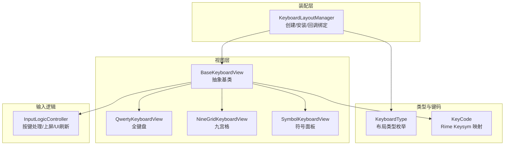
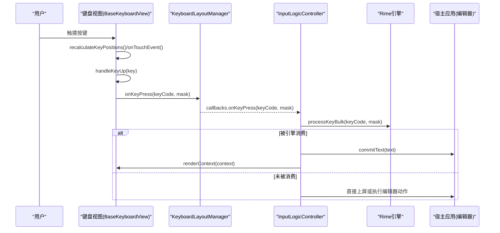
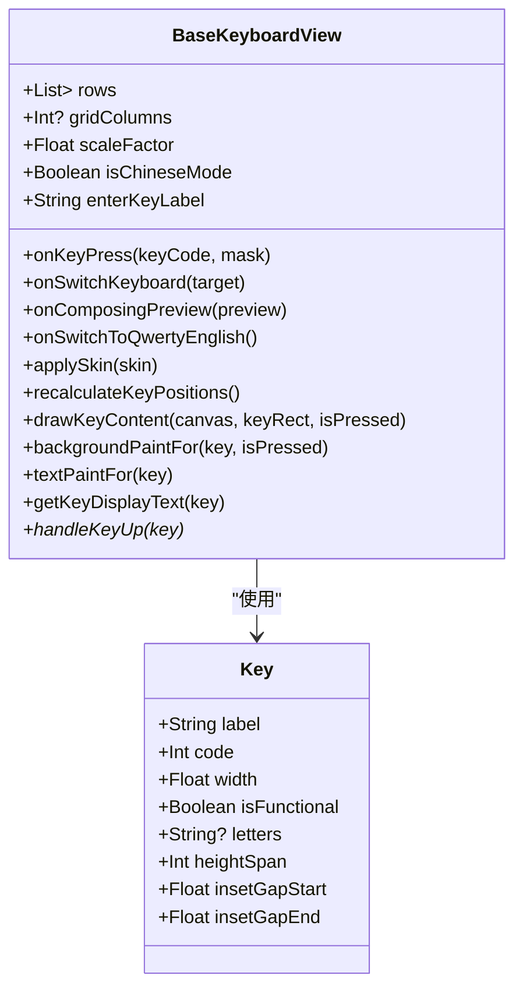
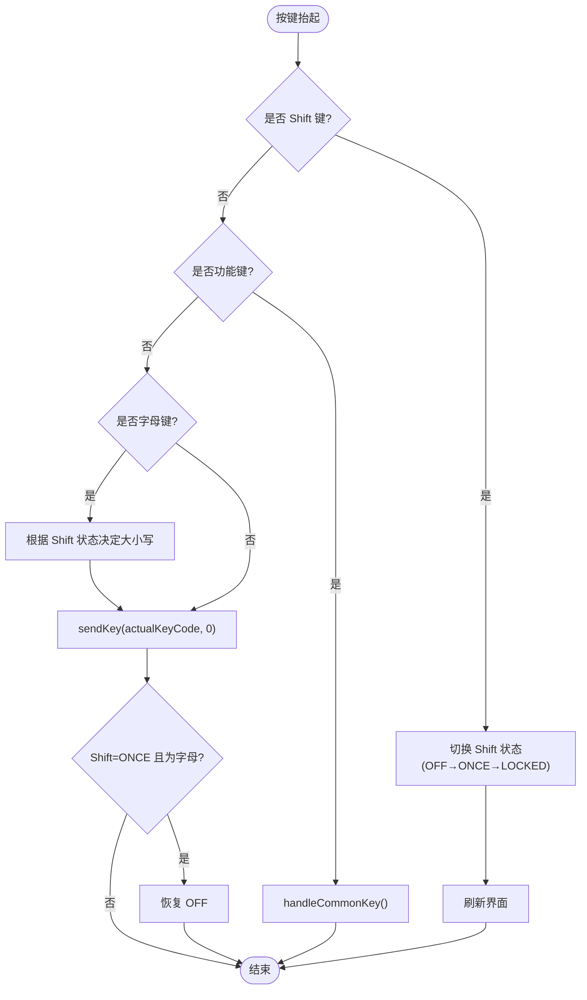
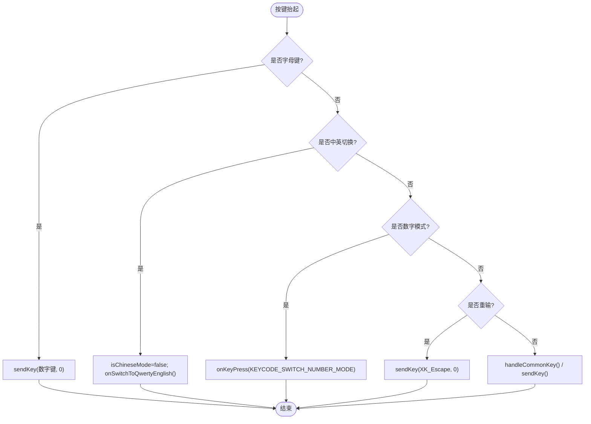
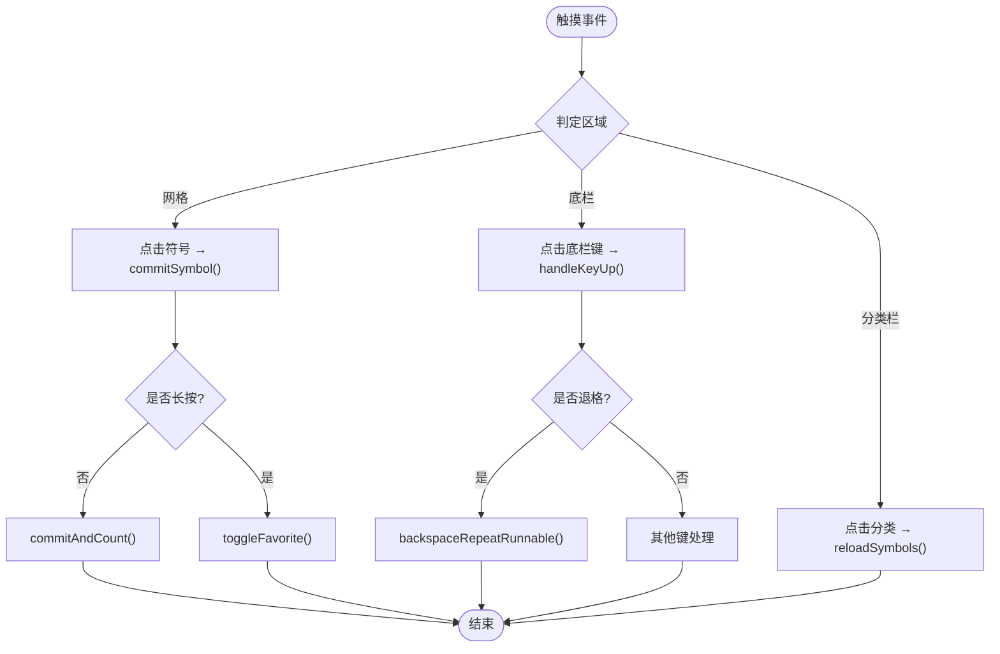
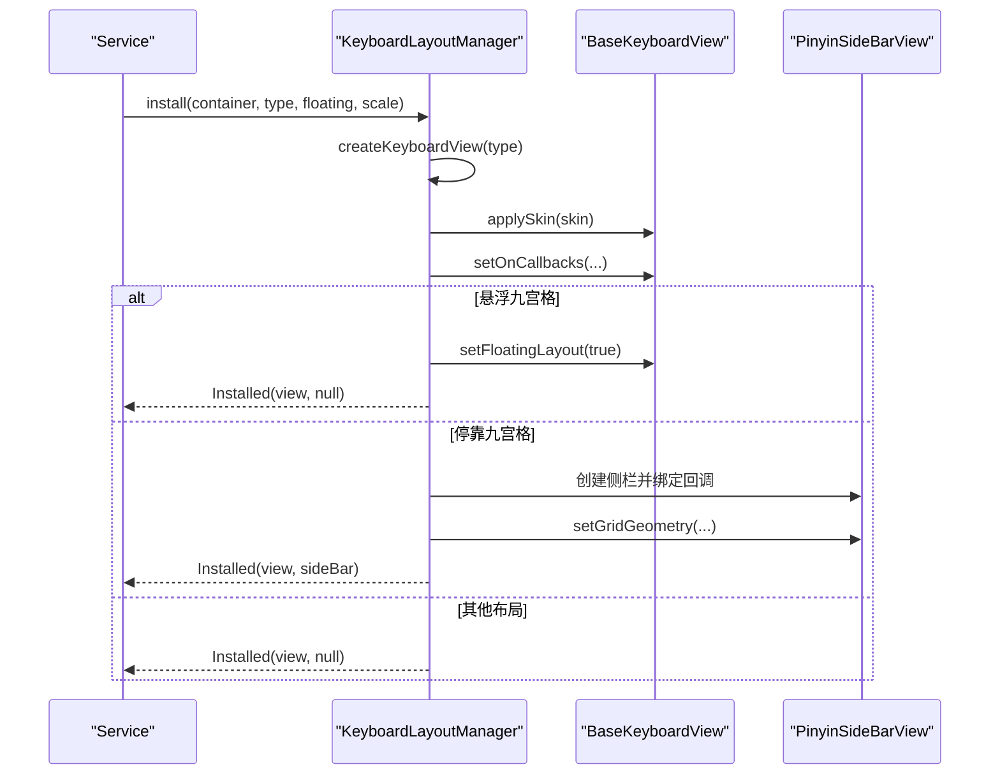
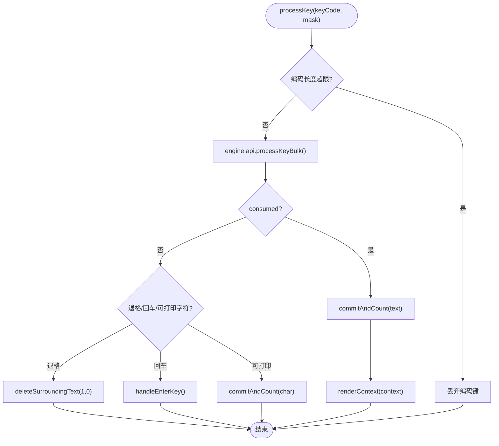
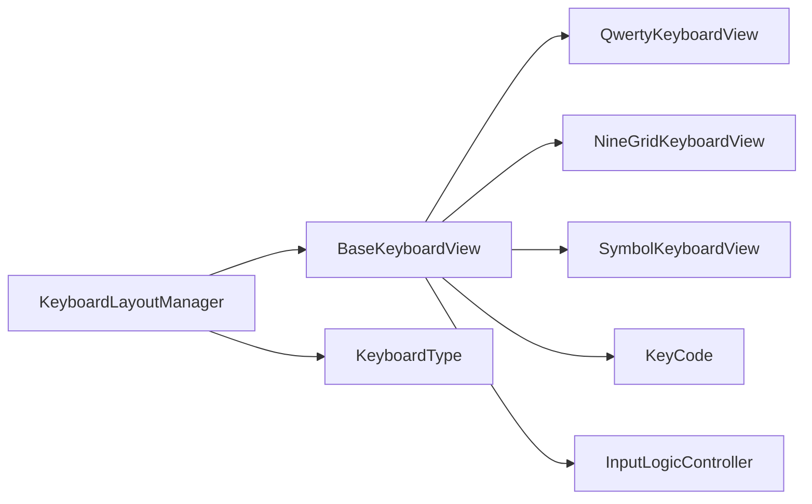

# 添加新键盘布局

<cite>
**本文引用的文件**   
- [BaseKeyboardView.kt](file://app/src/main/java/com/ziyou/ime/ime/BaseKeyboardView.kt)
- [QwertyKeyboardView.kt](file://app/src/main/java/com/ziyou/ime/ime/QwertyKeyboardView.kt)
- [NineGridKeyboardView.kt](file://app/src/main/java/com/ziyou/ime/ime/NineGridKeyboardView.kt)
- [SymbolKeyboardView.kt](file://app/src/main/java/com/ziyou/ime/ime/SymbolKeyboardView.kt)
- [KeyboardLayoutManager.kt](file://app/src/main/java/com/ziyou/ime/ime/KeyboardLayoutManager.kt)
- [KeyboardType.kt](file://app/src/main/java/com/ziyou/ime/ime/KeyboardType.kt)
- [KeyCode.kt](file://app/src/main/java/com/ziyou/ime/ime/KeyCode.kt)
- [InputLogicController.kt](file://app/src/main/java/com/ziyou/ime/ime/InputLogicController.kt)
</cite>

## 目录
1. [简介](#简介)
2. [项目结构](#项目结构)
3. [核心组件](#核心组件)
4. [架构总览](#架构总览)
5. [详细组件分析](#详细组件分析)
6. [依赖关系分析](#依赖关系分析)
7. [性能考量](#性能考量)
8. [故障排查指南](#故障排查指南)
9. [结论](#结论)
10. [附录：新增键盘布局完整步骤与示例路径](#附录新增键盘布局完整步骤与示例路径)

## 简介
本指南面向需要在输入法中新增自定义键盘布局的开发者。你将学习如何继承 BaseKeyboardView 基类、实现触摸事件处理逻辑、定义按键布局与样式、配置键盘参数，并将其集成到 KeyboardLayoutManager。文档同时覆盖尺寸适配、动画效果、主题样式等高级能力，并给出完整的代码级参考路径，帮助你快速落地自定义键盘视图、处理按键点击、管理键盘状态以及与输入逻辑控制器交互。

## 项目结构
本项目采用分层组织方式：
- 视图层：BaseKeyboardView 为所有键盘布局的抽象基类；QwertyKeyboardView、NineGridKeyboardView、SymbolKeyboardView 为具体布局实现。
- 装配层：KeyboardLayoutManager 负责创建、安装和组装键盘视图（含九宫格侧栏组合）。
- 类型与键码：KeyboardType 枚举描述键盘类型；KeyCode 提供 Rime keysym 映射。
- 输入逻辑：InputLogicController 统一处理按键、候选词、上屏与 UI 刷新。

图表来源 
- [BaseKeyboardView.kt](file://app/src/main/java/com/ziyou/ime/ime/BaseKeyboardView.kt)
- [QwertyKeyboardView.kt](file://app/src/main/java/com/ziyou/ime/ime/QwertyKeyboardView.kt)
- [NineGridKeyboardView.kt](file://app/src/main/java/com/ziyou/ime/ime/NineGridKeyboardView.kt)
- [SymbolKeyboardView.kt](file://app/src/main/java/com/ziyou/ime/ime/SymbolKeyboardView.kt)
- [KeyboardLayoutManager.kt](file://app/src/main/java/com/ziyou/ime/ime/KeyboardLayoutManager.kt)
- [KeyboardType.kt](file://app/src/main/java/com/ziyou/ime/ime/KeyboardType.kt)
- [KeyCode.kt](file://app/src/main/java/com/ziyou/ime/ime/KeyCode.kt)
- [InputLogicController.kt](file://app/src/main/java/com/ziyou/ime/ime/InputLogicController.kt)

章节来源
- [BaseKeyboardView.kt](file://app/src/main/java/com/ziyou/ime/ime/BaseKeyboardView.kt)
- [KeyboardLayoutManager.kt](file://app/src/main/java/com/ziyou/ime/ime/KeyboardLayoutManager.kt)
- [KeyboardType.kt](file://app/src/main/java/com/ziyou/ime/ime/KeyboardType.kt)
- [KeyCode.kt](file://app/src/main/java/com/ziyou/ime/ime/KeyCode.kt)
- [InputLogicController.kt](file://app/src/main/java/com/ziyou/ime/ime/InputLogicController.kt)

## 核心组件
- BaseKeyboardView：抽象基类，封装通用绘制、触摸、皮肤、缩放、布局计算与按键回调机制。子类只需提供 rows 布局与 handleKeyUp 逻辑。
- QwertyKeyboardView：标准全键盘，支持 Shift、中英文切换、数字键盘入口。
- NineGridKeyboardView：九宫格布局，智能 T9 输入，支持悬浮/停靠两种形态。
- SymbolKeyboardView：符号面板，分类导航 + 网格滚动，长按收藏、连续删除等。
- KeyboardLayoutManager：根据 KeyboardType 创建并安装键盘视图，绑定回调，组装九宫格侧栏。
- KeyboardType：布局类型枚举，声明强制方案、是否允许自选方案、是否进入选择面板。
- KeyCode：Android KeyEvent 与 Rime keysym 的映射工具。
- InputLogicController：统一按键处理、候选词选择、上屏与 UI 刷新。

章节来源
- [BaseKeyboardView.kt](file://app/src/main/java/com/ziyou/ime/ime/BaseKeyboardView.kt)
- [QwertyKeyboardView.kt](file://app/src/main/java/com/ziyou/ime/ime/QwertyKeyboardView.kt)
- [NineGridKeyboardView.kt](file://app/src/main/java/com/ziyou/ime/ime/NineGridKeyboardView.kt)
- [SymbolKeyboardView.kt](file://app/src/main/java/com/ziyou/ime/ime/SymbolKeyboardView.kt)
- [KeyboardLayoutManager.kt](file://app/src/main/java/com/ziyou/ime/ime/KeyboardLayoutManager.kt)
- [KeyboardType.kt](file://app/src/main/java/com/ziyou/ime/ime/KeyboardType.kt)
- [KeyCode.kt](file://app/src/main/java/com/ziyou/ime/ime/KeyCode.kt)
- [InputLogicController.kt](file://app/src/main/java/com/ziyou/ime/ime/InputLogicController.kt)

## 架构总览
下图展示从用户触摸到最终上屏的关键调用链，以及键盘视图与输入逻辑控制器的协作关系。

图表来源 
- [BaseKeyboardView.kt](file://app/src/main/java/com/ziyou/ime/ime/BaseKeyboardView.kt)
- [KeyboardLayoutManager.kt](file://app/src/main/java/com/ziyou/ime/ime/KeyboardLayoutManager.kt)
- [InputLogicController.kt](file://app/src/main/java/com/ziyou/ime/ime/InputLogicController.kt)

## 详细组件分析

### BaseKeyboardView 基类
- 布局模型：基于「行 × 相对宽度」或启用 gridColumns 的「列网格」模型，自动计算单位宽度与按键矩形。
- 绘制系统：支持填充/描边/无键面三种风格，阴影、圆角、边框、文字均由皮肤驱动。
- 触摸与反馈：ACTION_DOWN/MOVE/UP/CANCEL 处理，按下高亮、触觉反馈、退格长按连续触发。
- 皮肤与缩放：applySkin/onScaleChanged 同步画笔与尺寸；scaleFactor 统一缩放。
- 回调接口：onKeyPress、onSwitchKeyboard、onComposingPreview、onSwitchToQwertyEnglish。
- 扩展点：rows、handleKeyUp、getKeyDisplayText、drawKeyContent、backgroundPaintFor、textPaintFor、rowIndent、rowUnitWidth、gridColumns。

图表来源 
- [BaseKeyboardView.kt](file://app/src/main/java/com/ziyou/ime/ime/BaseKeyboardView.kt)

章节来源
- [BaseKeyboardView.kt](file://app/src/main/java/com/ziyou/ime/ime/BaseKeyboardView.kt)

### QwertyKeyboardView 全键盘
- 布局：10 列网格，第二行半列缩进居中，功能键跨列与 insetGap 分隔。
- 行为：Shift 三态（OFF/ONCE/LOCKED），中英文切换，逗号全角/半角随模式变化。
- 显示文本：Shift 图标、语言切换文案、字母大小写、换行键文案由基类与子类共同决定。
- 按键处理：Shift 切换状态、数字键盘入口、普通字母按 Shift 输出大写。

图表来源 
- [QwertyKeyboardView.kt](file://app/src/main/java/com/ziyou/ime/ime/QwertyKeyboardView.kt)
- [BaseKeyboardView.kt](file://app/src/main/java/com/ziyou/ime/ime/BaseKeyboardView.kt)

章节来源
- [QwertyKeyboardView.kt](file://app/src/main/java/com/ziyou/ime/ime/QwertyKeyboardView.kt)
- [BaseKeyboardView.kt](file://app/src/main/java/com/ziyou/ime/ime/BaseKeyboardView.kt)

### NineGridKeyboardView 九宫格
- 布局：前三行为 3×3 字母键网格 + 右侧功能列，第四行仅占左侧三列，换行键跨第 3~4 行。
- 形态：setFloatingLayout(true/false) 切换悬浮/停靠，底行按钮不同（悬浮自带「符」键）。
- 尺寸：keyHeightMultiplier 略增高度；gridTop/gridRowGap/bottomRowTop 供侧栏对齐。
- 渲染：字母键显示大写字母序列，分词键特殊绘制，底行字号较小。
- 输入：字母键发送对应数字键给 Rime；重输发送 Escape；中英切换强制英文并切 26 键。

图表来源 
- [NineGridKeyboardView.kt](file://app/src/main/java/com/ziyou/ime/ime/NineGridKeyboardView.kt)
- [BaseKeyboardView.kt](file://app/src/main/java/com/ziyou/ime/ime/BaseKeyboardView.kt)

章节来源
- [NineGridKeyboardView.kt](file://app/src/main/java/com/ziyou/ime/ime/NineGridKeyboardView.kt)
- [BaseKeyboardView.kt](file://app/src/main/java/com/ziyou/ime/ime/BaseKeyboardView.kt)

### SymbolKeyboardView 符号面板
- 布局：分类栏（可滚动）+ 符号网格（5 列，竖向滚动）+ 底部功能栏（返回/空格/退格/回车）。
- 交互：点击符号上屏并记入「最近」；长按加入常用或移除；分类点击切换内容；退格长按连续删除。
- 绘制：只绘制可见区域，命中检测通过坐标反算行列，避免缓存大量矩形。
- 主题：字体颜色、选中态、提示文字均随皮肤与缩放更新。

图表来源 
- [SymbolKeyboardView.kt](file://app/src/main/java/com/ziyou/ime/ime/SymbolKeyboardView.kt)
- [BaseKeyboardView.kt](file://app/src/main/java/com/ziyou/ime/ime/BaseKeyboardView.kt)

章节来源
- [SymbolKeyboardView.kt](file://app/src/main/java/com/ziyou/ime/ime/SymbolKeyboardView.kt)
- [BaseKeyboardView.kt](file://app/src/main/java/com/ziyou/ime/ime/BaseKeyboardView.kt)

### KeyboardLayoutManager 装配器
- createKeyboardView：根据 KeyboardType 创建具体键盘视图。
- install：绑定回调、应用皮肤、设置缩放因子、组装九宫格侧栏（停靠形态）或悬浮布局。
- 回调桥接：将键盘视图的 onKeyPress、onSwitchKeyboard、onComposingPreview 等转发至 Service。

图表来源 
- [KeyboardLayoutManager.kt](file://app/src/main/java/com/ziyou/ime/ime/KeyboardLayoutManager.kt)
- [BaseKeyboardView.kt](file://app/src/main/java/com/ziyou/ime/ime/BaseKeyboardView.kt)

章节来源
- [KeyboardLayoutManager.kt](file://app/src/main/java/com/ziyou/ime/ime/KeyboardLayoutManager.kt)

### KeyboardType 与 KeyCode
- KeyboardType：声明布局类型、强制方案、是否允许自选方案、是否进入选择面板。
- KeyCode：Android KeyEvent 与 Rime keysym 的映射，包括修饰掩码与软键盘自定义 keyCode。

章节来源
- [KeyboardType.kt](file://app/src/main/java/com/ziyou/ime/ime/KeyboardType.kt)
- [KeyCode.kt](file://app/src/main/java/com/ziyou/ime/ime/KeyCode.kt)

### InputLogicController 输入逻辑控制器
- processKey：串行化按键处理，processKeyBulk 批量调用引擎，commit 上屏，刷新 UI。
- selectCandidate：选词后提交文本或分段确认，同步九宫格状态机。
- changePage/selectPinyin/restorePinyin/retypeUnconfirmed/deleteUnconfirmedBackward：翻页、拼音替换、退格重打等复杂路径。
- handleEnterKey：回车键按编辑器语义落地（搜索/发送/换行）。
- commitDirectToEditor/commitImageToEditor：绕过面板目标直接上屏文本或图片。

图表来源 
- [InputLogicController.kt](file://app/src/main/java/com/ziyou/ime/ime/InputLogicController.kt)

章节来源
- [InputLogicController.kt](file://app/src/main/java/com/ziyou/ime/ime/InputLogicController.kt)

## 依赖关系分析
- 视图层依赖：BaseKeyboardView 被各具体键盘视图继承；SymbolKeyboardView 完全自绘但复用基类主题与回调。
- 装配层依赖：KeyboardLayoutManager 依赖 KeyboardType 与 SkinManager，创建并安装视图。
- 输入逻辑依赖：InputLogicController 依赖 RimeEngine 与 Callbacks，统一处理按键与上屏。
- 键码映射：KeyCode 贯穿键盘视图与输入逻辑，确保 Android 键值与 Rime keysym 一致。

图表来源 
- [BaseKeyboardView.kt](file://app/src/main/java/com/ziyou/ime/ime/BaseKeyboardView.kt)
- [QwertyKeyboardView.kt](file://app/src/main/java/com/ziyou/ime/ime/QwertyKeyboardView.kt)
- [NineGridKeyboardView.kt](file://app/src/main/java/com/ziyou/ime/ime/NineGridKeyboardView.kt)
- [SymbolKeyboardView.kt](file://app/src/main/java/com/ziyou/ime/ime/SymbolKeyboardView.kt)
- [KeyboardLayoutManager.kt](file://app/src/main/java/com/ziyou/ime/ime/KeyboardLayoutManager.kt)
- [KeyboardType.kt](file://app/src/main/java/com/ziyou/ime/ime/KeyboardType.kt)
- [KeyCode.kt](file://app/src/main/java/com/ziyou/ime/ime/KeyCode.kt)
- [InputLogicController.kt](file://app/src/main/java/com/ziyou/ime/ime/InputLogicController.kt)

章节来源
- [BaseKeyboardView.kt](file://app/src/main/java/com/ziyou/ime/ime/BaseKeyboardView.kt)
- [KeyboardLayoutManager.kt](file://app/src/main/java/com/ziyou/ime/ime/KeyboardLayoutManager.kt)
- [InputLogicController.kt](file://app/src/main/java/com/ziyou/ime/ime/InputLogicController.kt)

## 性能考量
- 布局计算：BaseKeyboardView 在 onSizeChanged 时重新计算按键位置，避免重复计算；SymbolKeyboardView 仅绘制可见区域，降低绘制压力。
- 触摸处理：BaseKeyboardView 使用 actionMasked 处理多指触摸，避免状态残留；长按连续触发使用 postDelayed 调度，避免阻塞主线程。
- 输入路径：InputLogicController 使用 Mutex 串行化按键处理，减少并发导致的上下文错配；processKeyBulk 批量调用引擎减少 JNI 跨界。
- 编码上限：MAX_INPUT_LENGTH 限制编码串长度，防止组句搜索爆炸导致卡顿。

章节来源
- [BaseKeyboardView.kt](file://app/src/main/java/com/ziyou/ime/ime/BaseKeyboardView.kt)
- [SymbolKeyboardView.kt](file://app/src/main/java/com/ziyou/ime/ime/SymbolKeyboardView.kt)
- [InputLogicController.kt](file://app/src/main/java/com/ziyou/ime/ime/InputLogicController.kt)

## 故障排查指南
- 触摸状态残留：检查 onTouchEvent 的 ACTION_UP/CANCEL 分支是否正确清理 pressedKeyIndex 与重复任务；窗口失焦时 onWindowFocusChanged 应清理状态。
- 布局错位：确认 rows 权重总和与 gridColumns 设置正确；九宫格停靠/悬浮形态下 row4 是否正确切换。
- 按键无响应：检查 onKeyPress 回调是否绑定；KeyCode 映射是否正确；InputLogicController 是否被调用。
- 皮肤不生效：确认 applySkin 被调用；onScaleChanged 是否同步自有画笔；dp/sp 换算是否受 scaleFactor 影响。
- 编码超长卡顿：观察 MAX_INPUT_LENGTH 日志；必要时优化输入路径或提示用户清空编码。

章节来源
- [BaseKeyboardView.kt](file://app/src/main/java/com/ziyou/ime/ime/BaseKeyboardView.kt)
- [NineGridKeyboardView.kt](file://app/src/main/java/com/ziyou/ime/ime/NineGridKeyboardView.kt)
- [InputLogicController.kt](file://app/src/main/java/com/ziyou/ime/ime/InputLogicController.kt)

## 结论
通过继承 BaseKeyboardView 并实现必要的布局与按键处理，你可以快速扩展新的键盘布局。结合 KeyboardLayoutManager 的装配能力与 InputLogicController 的统一输入逻辑，能够保证键盘视图与引擎、UI 的高效协作。遵循本文的步骤与最佳实践，可实现尺寸适配、动画效果、主题样式等高级功能，提升用户体验。

## 附录：新增键盘布局完整步骤与示例路径
1. 定义键盘类型
   - 在 KeyboardType 枚举中添加新项，声明 forcedSchemaId、allowsSchemaChoice、pickerLabel。
   - 参考路径：[KeyboardType.kt](file://app/src/main/java/com/ziyou/ime/ime/KeyboardType.kt)

2. 创建键盘视图
   - 新建类继承 BaseKeyboardView，实现 rows、handleKeyUp。
   - 如需自定义绘制或文字，覆写 drawKeyContent、getKeyDisplayText、backgroundPaintFor、textPaintFor。
   - 如需列网格布局，设置 gridColumns 并调整 rowIndent/rowUnitWidth。
   - 参考路径：
     - [BaseKeyboardView.kt](file://app/src/main/java/com/ziyou/ime/ime/BaseKeyboardView.kt)
     - [QwertyKeyboardView.kt](file://app/src/main/java/com/ziyou/ime/ime/QwertyKeyboardView.kt)
     - [NineGridKeyboardView.kt](file://app/src/main/java/com/ziyou/ime/ime/NineGridKeyboardView.kt)
     - [SymbolKeyboardView.kt](file://app/src/main/java/com/ziyou/ime/ime/SymbolKeyboardView.kt)

3. 注册键盘类型
   - 在 KeyboardLayoutManager.createKeyboardView 中登记新类型，返回实例。
   - 参考路径：[KeyboardLayoutManager.kt](file://app/src/main/java/com/ziyou/ime/ime/KeyboardLayoutManager.kt)

4. 绑定回调与集成
   - 在 install 中绑定 onKeyPress、onSwitchKeyboard、onComposingPreview 等回调。
   - 如需特殊行为（如符号/数字键盘直接上屏），在 install 中额外绑定专用回调。
   - 参考路径：[KeyboardLayoutManager.kt](file://app/src/main/java/com/ziyou/ime/ime/KeyboardLayoutManager.kt)

5. 主题与缩放适配
   - 在 applySkin 中同步自有画笔颜色与字体；在 onScaleChanged 中更新文字大小。
   - 使用 dp2px/sp2px 进行单位换算，确保悬浮模式下缩放生效。
   - 参考路径：[BaseKeyboardView.kt](file://app/src/main/java/com/ziyou/ime/ime/BaseKeyboardView.kt)

6. 与输入逻辑控制器交互
   - 通过 sendKey 或 onKeyPress 回调将按键传递给 InputLogicController。
   - 处理回车、退格、选词等复杂逻辑，确保上屏与 UI 刷新一致。
   - 参考路径：[InputLogicController.kt](file://app/src/main/java/com/ziyou/ime/ime/InputLogicController.kt)

7. 测试与调试
   - 验证触摸事件、布局对齐、皮肤应用、缩放效果。
   - 检查按键处理逻辑与输入路径，确保无状态残留与性能问题。
   - 参考路径：[BaseKeyboardView.kt](file://app/src/main/java/com/ziyou/ime/ime/BaseKeyboardView.kt)、[InputLogicController.kt](file://app/src/main/java/com/ziyou/ime/ime/InputLogicController.kt)