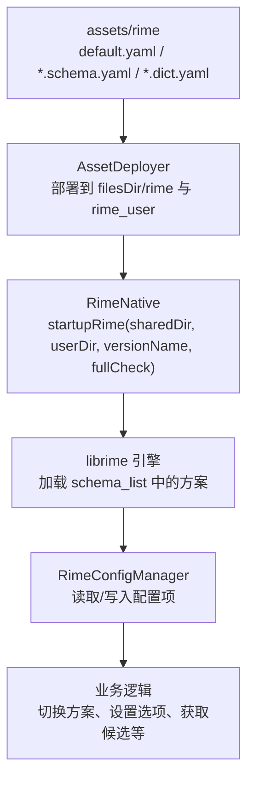
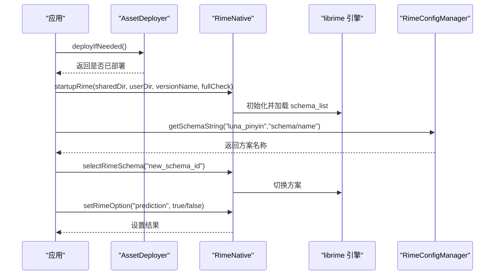
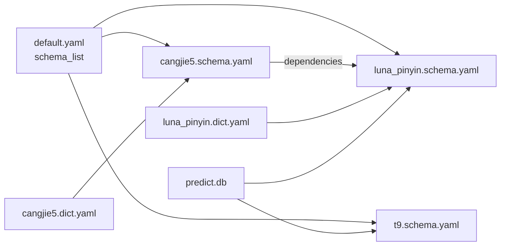

# 集成新输入方案

<cite>
**本文引用的文件**   
- [app/src/main/assets/rime/default.yaml](file://app/src/main/assets/rime/default.yaml)
- [app/src/main/assets/rime/luna_pinyin.schema.yaml](file://app/src/main/assets/rime/luna_pinyin.schema.yaml)
- [app/src/main/assets/rime/cangjie5.schema.yaml](file://app/src/main/assets/rime/cangjie5.schema.yaml)
- [app/src/main/assets/rime/t9.schema.yaml](file://app/src/main/assets/rime/t9.schema.yaml)
- [app/src/main/assets/rime/luna_pinyin.dict.yaml](file://app/src/main/assets/rime/luna_pinyin.dict.yaml)
- [app/src/main/assets/rime/cangjie5.dict.yaml](file://app/src/main/assets/rime/cangjie5.dict.yaml)
- [app/src/main/assets/rime/symbols.yaml](file://app/src/main/assets/rime/symbols.yaml)
- [app/src/main/java/com/ziyou/ime/config/AssetDeployer.kt](file://app/src/main/java/com/ziyou/ime/config/AssetDeployer.kt)
- [app/src/main/java/com/ziyou/ime/config/RimeConfigManager.kt](file://app/src/main/java/com/ziyou/ime/config/RimeConfigManager.kt)
- [app/src/main/java/com/ziyou/ime/core/RimeNative.kt](file://app/src/main/java/com/ziyou/ime/core/RimeNative.kt)
- [app/src/main/java/com/ziyou/ime/core/RimeConfig.kt](file://app/src/main/java/com/ziyou/ime/core/RimeConfig.kt)
- [app/src/main/java/com/ziyou/ime/daemon/RimeDeployStep.kt](file://app/src/main/java/com/ziyou/ime/daemon/RimeDeployStep.kt)
- [librime-prebuilt/librime/data/minimal/default.yaml](file://librime-prebuilt/librime/data/minimal/default.yaml)
</cite>

## 目录
1. [简介](#简介)
2. [项目结构](#项目结构)
3. [核心组件](#核心组件)
4. [架构总览](#架构总览)
5. [详细组件分析](#详细组件分析)
6. [依赖关系分析](#依赖关系分析)
7. [性能考量](#性能考量)
8. [故障排查指南](#故障排查指南)
9. [结论](#结论)
10. [附录：完整新增方案示例与步骤](#附录完整新增方案示例与步骤)

## 简介
本指南面向需要在当前 Rime 输入法工程中集成“新输入方案”的开发者，覆盖配置语法、方案依赖、词典格式规范、部署流程与测试验证。文档以仓库内现有拼音（luna_pinyin）、仓颉（cangjie5）和九宫格（t9）方案为参考，给出从零创建新方案的端到端流程，并说明如何在 Android 侧完成资源部署、引擎启动与运行时选项控制。

## 项目结构
Rime 相关资源位于 assets/rime 目录，包含默认配置、各方案 schema、词典与符号集；Android 侧通过 AssetDeployer 将资源部署到应用内部存储，并通过 JNI 层调用 librime 引擎进行输入处理。

**图表来源** 
- [app/src/main/assets/rime/default.yaml](file://app/src/main/assets/rime/default.yaml)
- [app/src/main/java/com/ziyou/ime/config/AssetDeployer.kt](file://app/src/main/java/com/ziyou/ime/config/AssetDeployer.kt)
- [app/src/main/java/com/ziyou/ime/core/RimeNative.kt](file://app/src/main/java/com/ziyou/ime/core/RimeNative.kt)
- [app/src/main/java/com/ziyou/ime/config/RimeConfigManager.kt](file://app/src/main/java/com/ziyou/ime/config/RimeConfigManager.kt)

**章节来源**
- [app/src/main/assets/rime/default.yaml](file://app/src/main/assets/rime/default.yaml)
- [app/src/main/java/com/ziyou/ime/config/AssetDeployer.kt](file://app/src/main/java/com/ziyou/ime/config/AssetDeployer.kt)
- [app/src/main/java/com/ziyou/ime/core/RimeNative.kt](file://app/src/main/java/com/ziyou/ime/core/RimeNative.kt)
- [app/src/main/java/com/ziyou/ime/config/RimeConfigManager.kt](file://app/src/main/java/com/ziyou/ime/config/RimeConfigManager.kt)

## 核心组件
- 配置与方案
  - default.yaml：全局默认配置，声明 schema_list、switcher、punctuator、key_binder、recognizer、ascii_composer 等。
  - *.schema.yaml：每个输入方案的定义，包括 schema、engine、speller、translator、filters、predictor、reverse_lookup、punctuator、key_binder、recognizer 等。
  - *.dict.yaml：词库定义，支持 import_tables、use_preset_vocabulary、encoder 等。
- 部署与运行
  - AssetDeployer：将 assets/rime 复制到 filesDir/rime，并将 predict.db 复制到 rime_user。
  - RimeNative：JNI 封装，负责 startupRime、selectRimeSchema、setRimeOption、processRimeKeyBulk 等。
  - RimeConfigManager：Kotlin API 封装，读写系统/用户/方案配置。
  - RimeConfig：底层 JNI 接口声明。
  - RimeDeployStep：部署步骤抽象，供 daemon 层在 startup 前执行。

**章节来源**
- [app/src/main/assets/rime/default.yaml](file://app/src/main/assets/rime/default.yaml)
- [app/src/main/assets/rime/luna_pinyin.schema.yaml](file://app/src/main/assets/rime/luna_pinyin.schema.yaml)
- [app/src/main/assets/rime/cangjie5.schema.yaml](file://app/src/main/assets/rime/cangjie5.schema.yaml)
- [app/src/main/assets/rime/t9.schema.yaml](file://app/src/main/assets/rime/t9.schema.yaml)
- [app/src/main/assets/rime/luna_pinyin.dict.yaml](file://app/src/main/assets/rime/luna_pinyin.dict.yaml)
- [app/src/main/assets/rime/cangjie5.dict.yaml](file://app/src/main/assets/rime/cangjie5.dict.yaml)
- [app/src/main/java/com/ziyou/ime/config/AssetDeployer.kt](file://app/src/main/java/com/ziyou/ime/config/AssetDeployer.kt)
- [app/src/main/java/com/ziyou/ime/core/RimeNative.kt](file://app/src/main/java/com/ziyou/ime/core/RimeNative.kt)
- [app/src/main/java/com/ziyou/ime/config/RimeConfigManager.kt](file://app/src/main/java/com/ziyou/ime/config/RimeConfigManager.kt)
- [app/src/main/java/com/ziyou/ime/core/RimeConfig.kt](file://app/src/main/java/com/ziyou/ime/core/RimeConfig.kt)
- [app/src/main/java/com/ziyou/ime/daemon/RimeDeployStep.kt](file://app/src/main/java/com/ziyou/ime/daemon/RimeDeployStep.kt)

## 架构总览
下图展示从资源部署到引擎运行的关键路径，以及配置读取与方案切换的流程。

**图表来源** 
- [app/src/main/java/com/ziyou/ime/config/AssetDeployer.kt](file://app/src/main/java/com/ziyou/ime/config/AssetDeployer.kt)
- [app/src/main/java/com/ziyou/ime/core/RimeNative.kt](file://app/src/main/java/com/ziyou/ime/core/RimeNative.kt)
- [app/src/main/java/com/ziyou/ime/config/RimeConfigManager.kt](file://app/src/main/java/com/ziyou/ime/config/RimeConfigManager.kt)
- [app/src/main/assets/rime/default.yaml](file://app/src/main/assets/rime/default.yaml)

## 详细组件分析

### 默认配置 default.yaml
- schema_list：列出可用方案 ID，如 luna_pinyin、t9、cangjie5。新增方案需在此添加。
- switcher：菜单标题、保存的选项列表（full_shape、ascii_punct、simplification、extended_charset）。
- punctuator：全角/半角标点映射。
- key_binder：按键绑定（翻页、热键切换等）。
- recognizer：识别模式正则（email、uppercase、url）。
- ascii_composer：Shift/Ctrl 行为。

**章节来源**
- [app/src/main/assets/rime/default.yaml](file://app/src/main/assets/rime/default.yaml)

### 方案文件 schema.yaml（以 luna_pinyin 为例）
- schema：schema_id、name、version、author、description。
- switches：开关定义（ascii_mode、full_shape、simplification、ascii_punct、prediction）。
- engine：processors、segmentors、translators、filters 流水线。
- speller：字母表、分隔符、algebra 派生规则。
- translator：dictionary、preedit_format、comment_format、enable_user_dict 等。
- predictor：预测库路径与参数（predict.db）。
- reverse_lookup：反向查找（如仓颉→拼音）。
- punctuator/key_binder/recognizer：可 import_preset 或覆写。

**章节来源**
- [app/src/main/assets/rime/luna_pinyin.schema.yaml](file://app/src/main/assets/rime/luna_pinyin.schema.yaml)

### 仓颉方案 cangjie5.schema.yaml
- dependencies：依赖 luna_pinyin（用于反向查找）。
- engine：处理器与翻译器，使用 table_translator 与 reverse_lookup_translator。
- speller：字母表与分隔符。
- translator：dictionary 指向 cangjie5，启用编码器和句子模式。
- reverse_lookup：字典指向 luna_pinyin，提供拼音注释。

**章节来源**
- [app/src/main/assets/rime/cangjie5.schema.yaml](file://app/src/main/assets/rime/cangjie5.schema.yaml)

### 九宫格方案 t9.schema.yaml
- 复用 luna_pinyin 词库，通过 algebra 派生数字键映射实现智能消歧。
- spelling_hints：候选携带真实拼音读音，便于客户端展示。
- key_binder：覆写逗号/句号行为，确保标点键输出标点。

**章节来源**
- [app/src/main/assets/rime/t9.schema.yaml](file://app/src/main/assets/rime/t9.schema.yaml)

### 词典文件 dict.yaml（以 luna_pinyin 为例）
- name/version/sort：词库元数据与排序策略。
- import_tables：引入多个子词典（字表、基础词库、扩展词库、大词库、杂项）。
- 自定义条目：如大写英文字母、数字参与造词。

**章节来源**
- [app/src/main/assets/rime/luna_pinyin.dict.yaml](file://app/src/main/assets/rime/luna_pinyin.dict.yaml)

### 仓颉词典 cangjie5.dict.yaml
- use_preset_vocabulary：启用预设词汇。
- encoder：编码规则（长度匹配、公式、尾锚点）。
- columns：列定义（text、code、stem）。

**章节来源**
- [app/src/main/assets/rime/cangjie5.dict.yaml](file://app/src/main/assets/rime/cangjie5.dict.yaml)

### 符号集 symbols.yaml
- 提供丰富的符号集合（数学、希腊、日期、货币等），通过特定触发序列插入。

**章节来源**
- [app/src/main/assets/rime/symbols.yaml](file://app/src/main/assets/rime/symbols.yaml)

### 部署与运行（AssetDeployer 与 RimeNative）
- AssetDeployer.deployIfNeeded：比较版本码，决定是否复制 assets/rime 到 filesDir/rime，并将 predict.db 复制到 rime_user。
- RimeNative.startupRime：传入 sharedDir（filesDir/rime）与 userDir（filesDir/rime_user），fullCheck 控制是否执行完整维护（编译新方案）。
- RimeConfigManager：提供便捷方法读取/写入配置项（系统、用户、方案）。

**章节来源**
- [app/src/main/java/com/ziyou/ime/config/AssetDeployer.kt](file://app/src/main/java/com/ziyou/ime/config/AssetDeployer.kt)
- [app/src/main/java/com/ziyou/ime/core/RimeNative.kt](file://app/src/main/java/com/ziyou/ime/core/RimeNative.kt)
- [app/src/main/java/com/ziyou/ime/config/RimeConfigManager.kt](file://app/src/main/java/com/ziyou/ime/config/RimeConfigManager.kt)

### 部署步骤抽象（RimeDeployStep）
- beforeStartup(context)：在引擎 startup 之前执行，适合部署资源、重生成主词库等 IO 操作。
- 由组合根装配注入，保证 daemon 层单向向下依赖。

**章节来源**
- [app/src/main/java/com/ziyou/ime/daemon/RimeDeployStep.kt](file://app/src/main/java/com/ziyou/ime/daemon/RimeDeployStep.kt)

## 依赖关系分析
- default.yaml 中的 schema_list 决定引擎加载哪些方案。
- 方案之间可通过 dependencies 声明依赖（如 cangjie5 依赖 luna_pinyin）。
- 词典通过 import_tables 引用其他词典文件，形成词库组合。
- predictor 依赖 predict.db（由 AssetDeployer 部署到用户目录）。

**图表来源** 
- [app/src/main/assets/rime/default.yaml](file://app/src/main/assets/rime/default.yaml)
- [app/src/main/assets/rime/luna_pinyin.schema.yaml](file://app/src/main/assets/rime/luna_pinyin.schema.yaml)
- [app/src/main/assets/rime/cangjie5.schema.yaml](file://app/src/main/assets/rime/cangjie5.schema.yaml)
- [app/src/main/assets/rime/t9.schema.yaml](file://app/src/main/assets/rime/t9.schema.yaml)
- [app/src/main/assets/rime/luna_pinyin.dict.yaml](file://app/src/main/assets/rime/luna_pinyin.dict.yaml)
- [app/src/main/assets/rime/cangjie5.dict.yaml](file://app/src/main/assets/rime/cangjie5.dict.yaml)

**章节来源**
- [app/src/main/assets/rime/default.yaml](file://app/src/main/assets/rime/default.yaml)
- [app/src/main/assets/rime/luna_pinyin.schema.yaml](file://app/src/main/assets/rime/luna_pinyin.schema.yaml)
- [app/src/main/assets/rime/cangjie5.schema.yaml](file://app/src/main/assets/rime/cangjie5.schema.yaml)
- [app/src/main/assets/rime/t9.schema.yaml](file://app/src/main/assets/rime/t9.schema.yaml)
- [app/src/main/assets/rime/luna_pinyin.dict.yaml](file://app/src/main/assets/rime/luna_pinyin.dict.yaml)
- [app/src/main/assets/rime/cangjie5.dict.yaml](file://app/src/main/assets/rime/cangjie5.dict.yaml)

## 性能考量
- 首次部署与 fullCheck：当检测到版本变化时，AssetDeployer 会重新部署资源；RimeNative.startupRime 的 fullCheck=true 会触发完整维护（编译新方案），耗时较大，建议在后台线程执行。
- 内存释放：RimeNative.trimNativeHeap 可在部署完成后归还 native 堆空闲页，降低常驻占用。
- 候选数量：predictor.max_candidates 应与候选栏容量匹配，避免预测霸屏。
- 词库规模：大词库导入会增加加载时间，建议按需拆分 import_tables。

[本节为通用指导，不直接分析具体文件]

## 故障排查指南
- 无法打开方案配置：检查 default.yaml 中 schema_list 是否包含该方案 ID；确认 assets/rime 下存在对应 *.schema.yaml。
- 部署失败：查看 AssetDeployer 日志，确认目标目录权限与磁盘空间；检查 predict.db 是否存在于 assets 根目录。
- 引擎未加载：确认 ABI 匹配（arm64-v8a）且 .so 文件存在；RimeNative.isLoaded 应为 true。
- 选项无效：通过 RimeConfigManager.getSchemaString 读取开关状态，确认 setRimeOption 调用是否正确。
- 候选为空：检查 translator.dictionary 指向的词库是否存在且已编译；确认 speller.alphabet 与 algebra 派生规则正确。

**章节来源**
- [app/src/main/java/com/ziyou/ime/config/AssetDeployer.kt](file://app/src/main/java/com/ziyou/ime/config/AssetDeployer.kt)
- [app/src/main/java/com/ziyou/ime/core/RimeNative.kt](file://app/src/main/java/com/ziyou/ime/core/RimeNative.kt)
- [app/src/main/java/com/ziyou/ime/config/RimeConfigManager.kt](file://app/src/main/java/com/ziyou/ime/config/RimeConfigManager.kt)

## 结论
通过修改 default.yaml 的 schema_list、创建新的 *.schema.yaml 与 *.dict.yaml、部署 predict.db 并在引擎启动时执行 fullCheck，即可成功集成新输入方案。结合 RimeConfigManager 与 RimeNative 提供的 API，可实现方案切换、选项控制与输入处理。遵循本文档的配置语法与部署流程，可快速扩展更多输入方案（如五笔、注音等）。

[本节为总结性内容，不直接分析具体文件]

## 附录：完整新增方案示例与步骤

### 新增拼音方案（示例：my_pinyin）
1. 创建 my_pinyin.schema.yaml
   - 在 schema 段设置 schema_id=my_pinyin、name、version、author、description。
   - 在 engine 段配置 processors、segmentors、translators、filters（参考 luna_pinyin.schema.yaml）。
   - 在 speller 段定义 alphabet、delimiter、algebra（可复用 luna_pinyin 的派生规则）。
   - 在 translator 段指定 dictionary=my_pinyin，并设置 preedit_format/comment_format。
   - 如需联想，配置 predictor.db 路径与参数。
   - 可选：定义 reverse_lookup（如仓颉→拼音）。

2. 创建 my_pinyin.dict.yaml
   - 设置 name/version/sort。
   - 使用 import_tables 引入多个子词典（字表、基础词库、扩展词库等）。
   - 可追加自定义条目（如大写英文字母、数字）。

3. 修改 default.yaml
   - 在 schema_list 中添加 - schema: my_pinyin。

4. 部署与启动
   - 调用 AssetDeployer.deployIfNeeded() 部署 assets/rime 与 predict.db。
   - 调用 RimeNative.startupRime(sharedDir, userDir, versionName, fullCheck=true)。
   - 使用 RimeNative.selectRimeSchema("my_pinyin") 切换方案。
   - 使用 RimeConfigManager.getSchemaString("my_pinyin","schema/name") 验证加载。

5. 测试验证
   - 发送按键事件，检查 processRimeKeyBulk 返回值与候选列表。
   - 切换 prediction 选项，观察候选变化。
   - 验证 reverse_lookup（如有）与标点映射。

**章节来源**
- [app/src/main/assets/rime/luna_pinyin.schema.yaml](file://app/src/main/assets/rime/luna_pinyin.schema.yaml)
- [app/src/main/assets/rime/luna_pinyin.dict.yaml](file://app/src/main/assets/rime/luna_pinyin.dict.yaml)
- [app/src/main/assets/rime/default.yaml](file://app/src/main/assets/rime/default.yaml)
- [app/src/main/java/com/ziyou/ime/config/AssetDeployer.kt](file://app/src/main/java/com/ziyou/ime/config/AssetDeployer.kt)
- [app/src/main/java/com/ziyou/ime/core/RimeNative.kt](file://app/src/main/java/com/ziyou/ime/core/RimeNative.kt)
- [app/src/main/java/com/ziyou/ime/config/RimeConfigManager.kt](file://app/src/main/java/com/ziyou/ime/config/RimeConfigManager.kt)

### 新增仓颉方案（示例：my_cangjie）
1. 创建 my_cangjie.schema.yaml
   - 在 dependencies 中声明依赖 luna_pinyin（用于反向查找）。
   - 在 engine 段使用 table_translator 与 reverse_lookup_translator。
   - 在 speller 段定义字母表与分隔符。
   - 在 translator 段指定 dictionary=my_cangjie，启用编码器与句子模式。
   - 配置 reverse_lookup 指向 luna_pinyin。

2. 创建 my_cangjie.dict.yaml
   - 设置 use_preset_vocabulary=true。
   - 配置 encoder 规则（长度匹配、公式、尾锚点）。
   - 定义 columns（text、code、stem）。

3. 修改 default.yaml
   - 在 schema_list 中添加 - schema: my_cangjie。

4. 部署与启动
   - 同拼音方案流程。

5. 测试验证
   - 验证仓颉编码输入与拼音反向查找。

**章节来源**
- [app/src/main/assets/rime/cangjie5.schema.yaml](file://app/src/main/assets/rime/cangjie5.schema.yaml)
- [app/src/main/assets/rime/cangjie5.dict.yaml](file://app/src/main/assets/rime/cangjie5.dict.yaml)
- [app/src/main/assets/rime/default.yaml](file://app/src/main/assets/rime/default.yaml)

### 新增九宫格方案（示例：my_t9）
1. 创建 my_t9.schema.yaml
   - 复用 luna_pinyin 词库，通过 algebra 派生数字键映射。
   - 设置 spelling_hints 以便候选显示真实拼音。
   - 覆写 key_binder 确保标点键输出标点。

2. 修改 default.yaml
   - 在 schema_list 中添加 - schema: my_t9。

3. 部署与启动
   - 同拼音方案流程。

4. 测试验证
   - 验证数字键输入与智能消歧。

**章节来源**
- [app/src/main/assets/rime/t9.schema.yaml](file://app/src/main/assets/rime/t9.schema.yaml)
- [app/src/main/assets/rime/default.yaml](file://app/src/main/assets/rime/default.yaml)

### 最小化参考（minimal/default.yaml）
- 可作为精简版默认配置模板，仅包含必要 schema（如 luna_pinyin、cangjie5）与基础设置。

**章节来源**
- [librime-prebuilt/librime/data/minimal/default.yaml](file://librime-prebuilt/librime/data/minimal/default.yaml)