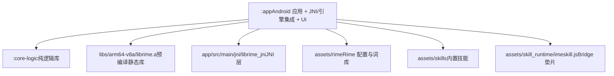
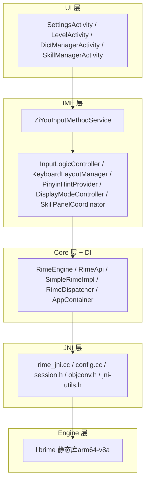
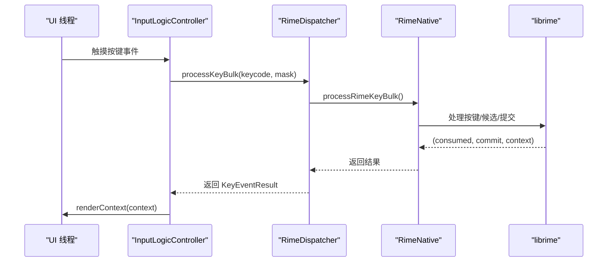
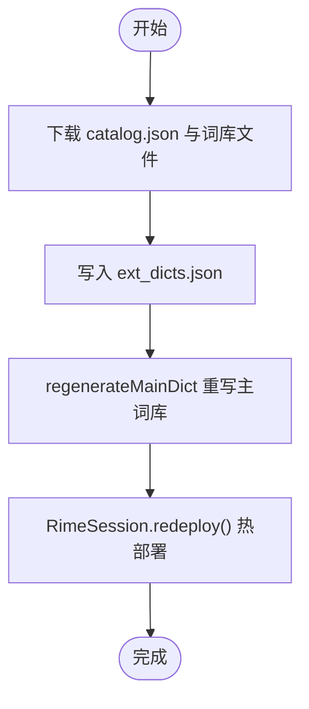
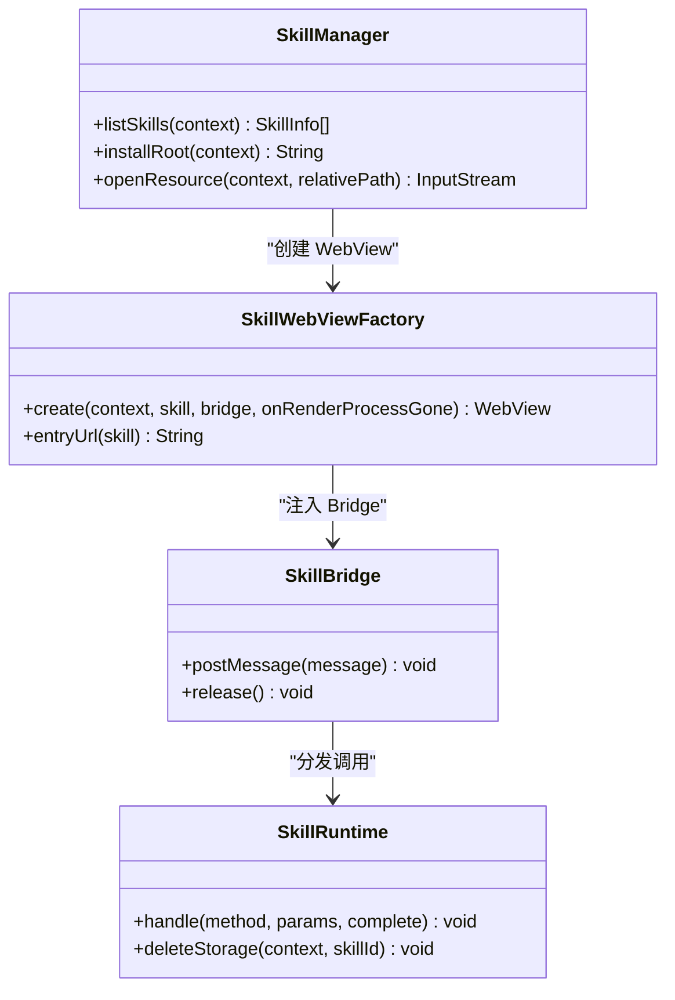
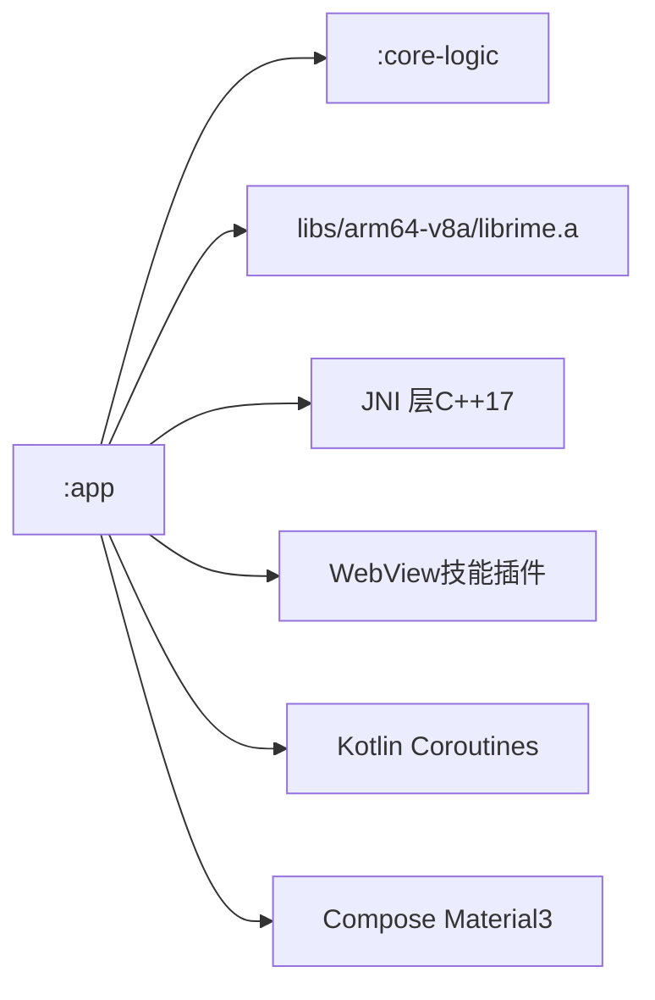

# 开发者指南

<cite>
**本文引用的文件**   
- [README.md](file://README.md)
- [ARCHITECTURE.md](file://ARCHITECTURE.md)
- [AGENTS.md](file://AGENTS.md)
- [app/build.gradle.kts](file://app/build.gradle.kts)
- [build.gradle.kts](file://build.gradle.kts)
- [gradle.properties](file://gradle.properties)
- [settings.gradle.kts](file://settings.gradle.kts)
- [AndroidManifest.xml](file://app/src/main/AndroidManifest.xml)
- [CMakeLists.txt（JNI）](file://app/src/main/jni/librime_jni/CMakeLists.txt)
- [ZiyouApplication.kt](file://app/src/main/java/com/ziyou/ime/ZiyouApplication.kt)
- [core-logic/build.gradle.kts](file://core-logic/build.gradle.kts)
- [技能插件开发指南.md](file://docs/技能插件开发指南.md)
- [calculator manifest.json](file://app/src/main/assets/skills/calculator/manifest.json)
- [imeskill.js](file://app/src/main/assets/skill_runtime/imeskill.js)
</cite>

## 目录
1. [简介](#简介)
2. [项目结构](#项目结构)
3. [核心组件](#核心组件)
4. [架构总览](#架构总览)
5. [详细组件分析](#详细组件分析)
6. [依赖分析](#依赖分析)
7. [性能考虑](#性能考虑)
8. [故障排除指南](#故障排除指南)
9. [结论](#结论)
10. [附录：常见开发任务与规范](#附录常见开发任务与规范)

## 简介
本指南面向参与字由输入法（基于 librime 的 Android 中文输入法）开发的工程师，覆盖环境搭建、工程结构、核心模块、架构设计、技能插件开发流程、贡献与发布流程、常见问题排查与性能调优建议。文档以仓库现有实现为依据，提供可操作的步骤与参考路径，帮助快速上手与高效协作。

## 项目结构
项目采用 Gradle 多模块组织，包含两个主要模块：
- :app：Android 应用层，包含 JNI 集成、IME 服务、UI 与业务域（等级、扩展词库、技能插件等）。
- :core-logic：纯 Kotlin 逻辑库，承载 T9 映射、九宫格状态机、等级计分、技能包校验等可独立单测的纯逻辑。

构建与依赖配置要点：
- AGP 9.x、Kotlin 2.2、Compose BOM 2026.02.01；compileSdk/targetSdk=35，minSdk=24。
- NDK r26+、CMake 3.22.1；默认仅打包 arm64-v8a ABI。
- 根 gradle.properties 固定 Gradle JVM 为 Android Studio JBR（JDK 21），避免自动探测导致构建失败。
- settings.gradle.kts 声明模块 include(":app", ":core-logic")。

图表来源
- [settings.gradle.kts:25-28](file://settings.gradle.kts#L25-L28)
- [app/build.gradle.kts:22-48](file://app/build.gradle.kts#L22-L48)
- [CMakeLists.txt（JNI）:17-25](file://app/src/main/jni/librime_jni/CMakeLists.txt#L17-L25)

章节来源
- [README.md:37-49](file://README.md#L37-L49)
- [AGENTS.md:30-35](file://AGENTS.md#L30-L35)
- [settings.gradle.kts:25-28](file://settings.gradle.kts#L25-L28)
- [app/build.gradle.kts:22-48](file://app/build.gradle.kts#L22-L48)

## 核心组件
- 输入引擎集成：通过 RimeEngine/RimeApi 抽象与 AppContainer 组合根注入，统一经 RimeDispatcher 单线程调度，保证 librime 非线程安全调用顺序。
- IME 服务与视图：ZiYouInputMethodService 负责生命周期与视图装配；InputLogicController、KeyboardLayoutManager、PinyinHintProvider、DisplayModeController、SkillPanelCoordinator 拆分职责。
- 扩展词库：DictManager 管理远程词库安装/启停/更新，重写主词库并热部署。
- 等级体系：LevelRepository/LevelStats/LevelEngine 实现脱敏聚合计数与等级判定。
- 技能插件系统：SkillManager/SkillWebViewFactory/SkillBridge/SkillRuntime 提供 WebView 沙箱能力与 Bridge API。

章节来源
- [ARCHITECTURE.md:109-163](file://ARCHITECTURE.md#L109-L163)
- [ARCHITECTURE.md:235-300](file://ARCHITECTURE.md#L235-L300)
- [ARCHITECTURE.md:324-364](file://ARCHITECTURE.md#L324-L364)
- [ARCHITECTURE.md:365-384](file://ARCHITECTURE.md#L365-L384)

## 架构总览
五层引擎栈（UI → IME → Core → JNI → Engine）与横向业务域（等级、扩展词库、T9、技能插件）构成整体架构。依赖方向单向向下，纯逻辑下沉至 :core-logic。

图表来源
- [ARCHITECTURE.md:10-63](file://ARCHITECTURE.md#L10-L63)
- [ARCHITECTURE.md:164-234](file://ARCHITECTURE.md#L164-L234)
- [CMakeLists.txt（JNI）:52-72](file://app/src/main/jni/librime_jni/CMakeLists.txt#L52-L72)

## 详细组件分析

### 环境搭建与前置条件
- Android Studio：需兼容 AGP 9.x 的较新版本。
- JDK：17（编译选项），Gradle 工具链使用 JDK 21（由 gradle.properties 指定）。
- Android SDK：compileSdk/targetSdk=35，minSdk=24。
- NDK：r26+（推荐 r26c），CMake 3.22.1。
- 预编译 librime：从 librime-prebuilt 生成 libs/arm64-v8a/librime.a 与 libs/include/rime_api.h。
- Git 子模块：若仓库含子模块，首次克隆后执行初始化命令（见仓库说明）。

章节来源
- [README.md:37-49](file://README.md#L37-L49)
- [AGENTS.md:30-35](file://AGENTS.md#L30-L35)
- [app/build.gradle.kts:83-97](file://app/build.gradle.kts#L83-L97)
- [CMakeLists.txt（JNI）:1-10](file://app/src/main/jni/librime_jni/CMakeLists.txt#L1-L10)

### 构建与运行
- 编译 Debug：./gradlew :app:assembleDebug
- 安装到设备：adb install app/build/outputs/apk/debug/app-debug.apk
- 运行单元测试：./gradlew :core-logic:testDebugUnitTest :app:testDebugUnitTest
- Release 构建：./gradlew :app:assembleRelease（启用 R8/ProGuard 混淆）

章节来源
- [README.md:83-102](file://README.md#L83-L102)
- [AGENTS.md:10-28](file://AGENTS.md#L10-L28)
- [app/build.gradle.kts:61-81](file://app/build.gradle.kts#L61-L81)

### 输入引擎与线程模型
- RimeDispatcher：单线程协程调度器，所有 RimeNative 调用经 withContext(dispatcher) 串行执行。
- InputLogicController：对每次按键的多步调用用 Mutex 串行化，避免竞态。
- 消息流：SharedFlow 广播引擎通知（方案切换、选项变更、部署状态）。

图表来源
- [ARCHITECTURE.md:164-234](file://ARCHITECTURE.md#L164-L234)
- [ARCHITECTURE.md:393-430](file://ARCHITECTURE.md#L393-L430)

章节来源
- [ARCHITECTURE.md:70-108](file://ARCHITECTURE.md#L70-L108)
- [ARCHITECTURE.md:393-430](file://ARCHITECTURE.md#L393-L430)

### 键盘与候选视图
- BaseKeyboardView：Canvas 绘制基类，封装行×相对宽度布局、触摸高亮、主题着色与回调。
- QwertyKeyboardView/NineGridKeyboardView：全键盘与九宫格实现，底栏分离为 NineGridBottomBarView。
- PreeditOverlayView/SimpleCandidatesView/PinyinSideBarView：编码区、候选词横条、拼音侧栏。

章节来源
- [ARCHITECTURE.md:277-310](file://ARCHITECTURE.md#L277-L310)

### 扩展词库工作流
- 下载 catalog.json 与词库文件（带进度回调）。
- 安装记录写入 ext_dicts.json。
- 重写 luna_pinyin.dict.yaml 注入已启用词库。
- 触发 RimeSession.redeploy() 热部署生效。

图表来源
- [ARCHITECTURE.md:324-338](file://ARCHITECTURE.md#L324-L338)
- [ARCHITECTURE.md:422-430](file://ARCHITECTURE.md#L422-L430)

章节来源
- [ARCHITECTURE.md:324-338](file://ARCHITECTURE.md#L324-L338)
- [ARCHITECTURE.md:422-430](file://ARCHITECTURE.md#L422-L430)

### 技能插件系统
- 包结构：manifest.json（元数据）、index.html（入口）、script.js（可选）、assets（资源）。
- 安全机制：WebView 资源拦截、CSP 注入、DOM 存储禁用、崩溃隔离、Bridge 异常兜底。
- Bridge API：sendText、getContext、getLocale、haptic、ui.*、storage.*、fetch、clipboard、image、input.*。
- 面板形态：embed/card；needs_input 提升挂载与输入路由；setExpanded 收缩/展开界面。

图表来源
- [ARCHITECTURE.md:365-384](file://ARCHITECTURE.md#L365-L384)
- [技能插件开发指南.md:26-84](file://docs/技能插件开发指南.md#L26-L84)
- [技能插件开发指南.md:86-221](file://docs/技能插件开发指南.md#L86-L221)
- [技能插件开发指南.md:730-800](file://docs/技能插件开发指南.md#L730-L800)

章节来源
- [技能插件开发指南.md:26-84](file://docs/技能插件开发指南.md#L26-L84)
- [技能插件开发指南.md:86-221](file://docs/技能插件开发指南.md#L86-L221)
- [技能插件开发指南.md:730-800](file://docs/技能插件开发指南.md#L730-L800)
- [calculator manifest.json:1-14](file://app/src/main/assets/skills/calculator/manifest.json#L1-L14)
- [imeskill.js:1-164](file://app/src/main/assets/skill_runtime/imeskill.js#L1-L164)

### 等级体系与隐私
- 计分策略：分段递减计分，连续签到奖励，等级门槛指数递增。
- 隐私保护：仅记录脱敏聚合计数，不记录输入内容，数据本地持久化。
- 热路径优化：onCommit 仅 O(1) 内存自增，阈值或生命周期节点异步落盘。

章节来源
- [ARCHITECTURE.md:312-323](file://ARCHITECTURE.md#L312-L323)
- [ARCHITECTURE.md:455-467](file://ARCHITECTURE.md#L455-L467)

## 依赖分析
- 模块依赖方向：:app → :core-logic（单向，编译器强制）。
- 外部依赖：librime 预编译静态库、Kotlin Coroutines、Jetpack Compose (Material3)、AndroidX 组件、WebView。
- 权限：INTERNET（扩展词库下载）。

图表来源
- [settings.gradle.kts:25-28](file://settings.gradle.kts#L25-L28)
- [app/build.gradle.kts:143-191](file://app/build.gradle.kts#L143-L191)
- [AndroidManifest.xml:1-10](file://app/src/main/AndroidManifest.xml#L1-L10)

章节来源
- [settings.gradle.kts:25-28](file://settings.gradle.kts#L25-L28)
- [app/build.gradle.kts:143-191](file://app/build.gradle.kts#L143-L191)
- [AndroidManifest.xml:1-10](file://app/src/main/AndroidManifest.xml#L1-L10)

## 性能考虑
- 单线程 Dispatcher：避免锁竞争与死锁，协程友好。
- 批量 JNI：processKeyBulk 一次跨界返回，减少往返。
- 热路径零 IO：上屏热路径仅内存自增，延迟落盘。
- Canvas 键盘：免 XML inflate，精确控制绘制与交互。
- 链接优化：gc-sections、exclude-libs、16KB 页面对齐。

章节来源
- [ARCHITECTURE.md:70-108](file://ARCHITECTURE.md#L70-L108)
- [CMakeLists.txt（JNI）:55-60](file://app/src/main/jni/librime_jni/CMakeLists.txt#L55-L60)

## 故障排除指南
- 构建失败（NDK/CMake）：确认 NDK r26+、CMake 3.22.1 与 abiFilters 一致；确保 libs/arm64-v8a/librime.a 存在。
- 引擎未启动：检查 RimeSession.initialize(fullCheck) 是否被调用；查看 SharedFlow 部署状态消息。
- 技能加载失败：查看 logcat 中 SkillManager/SkillBridge/SkillRuntime/SkillWebViewFactory/SkillPackageInstaller 日志；校验 manifest 字段与权限。
- WebView 调试：debug 构建开启远程调试，Chrome 访问 chrome://inspect/#devices 定位问题。
- 权限拒绝：技能调用未声明权限会 reject，按错误消息修正 manifest.permissions。

章节来源
- [CMakeLists.txt（JNI）:63-72](file://app/src/main/jni/librime_jni/CMakeLists.txt#L63-L72)
- [技能插件开发指南.md:313-326](file://docs/技能插件开发指南.md#L313-L326)
- [技能插件开发指南.md:763-800](file://docs/技能插件开发指南.md#L763-L800)

## 结论
本指南系统化梳理了字由输入法的工程结构、核心组件与架构设计，提供了环境搭建、构建运行、技能插件开发与调试、贡献与发布流程以及性能与排障建议。遵循“单线程调度、RAII 资源管理、批量 JNI、热路径零 IO”的设计原则，可在保证输入流畅与隐私的前提下，高效扩展输入法能力。

## 附录：常见开发任务与规范

### 环境搭建要求
- Android Studio：与 AGP 9.x 兼容的较新版本。
- JDK：17（编译），Gradle 工具链 JDK 21（gradle.properties 指定）。
- Android SDK：compileSdk/targetSdk=35，minSdk=24。
- NDK：r26+，CMake 3.22.1。
- 预编译 librime：生成 libs/arm64-v8a/librime.a 与 libs/include/rime_api.h。
- Git 子模块：首次克隆后执行初始化命令（如 git submodule update --init --recursive）。

章节来源
- [README.md:37-49](file://README.md#L37-L49)
- [AGENTS.md:30-35](file://AGENTS.md#L30-L35)
- [app/build.gradle.kts:83-97](file://app/build.gradle.kts#L83-L97)
- [CMakeLists.txt（JNI）:1-10](file://app/src/main/jni/librime_jni/CMakeLists.txt#L1-L10)

### 项目开发规范
- Kotlin 代码遵循官方编码规范；C++ 代码遵循 .clang-format（C++17）。
- 所有 Rime 调用必须经 RimeDispatcher 调度；InputLogicController 内按键操作用 Mutex 串行化。
- 提交信息遵循 Conventional Commits。
- 纯逻辑下沉 :core-logic，禁止反向依赖 :app。

章节来源
- [README.md:319-351](file://README.md#L319-L351)
- [AGENTS.md:49-57](file://AGENTS.md#L49-L57)

### 技能插件开发流程
- 包结构：manifest.json、index.html、script.js、assets。
- manifest 字段：id/name/version/min_host_api/entry/panel_mode/permissions/network_domains/needs_input。
- Bridge API：sendText、getContext、getLocale、haptic、ui.*、storage.*、fetch、clipboard、image、input.*。
- 安全配置：WebView 资源拦截、CSP 注入、DOM 存储禁用、崩溃隔离。
- 调试技巧：浏览器 mock 垫片、Chrome DevTools 远程调试、logcat 过滤 tag。

章节来源
- [技能插件开发指南.md:26-84](file://docs/技能插件开发指南.md#L26-L84)
- [技能插件开发指南.md:86-221](file://docs/技能插件开发指南.md#L86-L221)
- [技能插件开发指南.md:313-326](file://docs/技能插件开发指南.md#L313-L326)
- [技能插件开发指南.md:730-800](file://docs/技能插件开发指南.md#L730-L800)
- [calculator manifest.json:1-14](file://app/src/main/assets/skills/calculator/manifest.json#L1-L14)
- [imeskill.js:1-164](file://app/src/main/assets/skill_runtime/imeskill.js#L1-L164)

### 贡献指南
- Fork → 功能分支 → 提交（Conventional Commits）→ Push → PR。
- 运行检查：编译、单元测试、JNI 格式化。
- 文档更新：相关设计文档位于 docs/，必要时同步更新。
- 发布流程：Release 构建启用 R8/ProGuard 混淆与签名（keystore.properties）。

章节来源
- [README.md:319-351](file://README.md#L319-L351)
- [AGENTS.md:10-28](file://AGENTS.md#L10-L28)
- [app/build.gradle.kts:61-81](file://app/build.gradle.kts#L61-L81)

### 常见开发任务步骤
- 添加新键盘布局：在 KeyboardType 枚举追加项，编写 BaseKeyboardView 子类，注册到 KeyboardLayoutManager.createKeyboardView。
- 集成新输入方案：将 .schema.yaml/.dict.yaml 放入 assets/rime/，编辑 default.yaml 的 schema_list，重新部署。
- 扩展 JNI 函数：在 rime_jni.cc 导出 Java_com_ziyou_ime_core_RimeNative_xxx，在 RimeNative.kt 声明 external fun，在 RimeApi.kt 加接口并在 SimpleRimeImpl 中 dispatch 实现。

章节来源
- [ARCHITECTURE.md:504-527](file://ARCHITECTURE.md#L504-L527)
- [README.md:229-243](file://README.md#L229-L243)