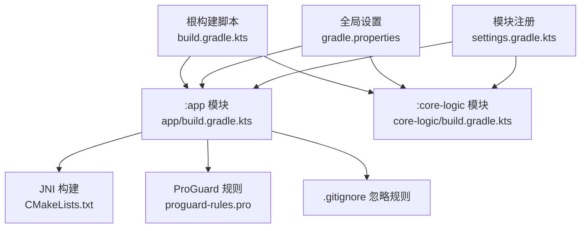
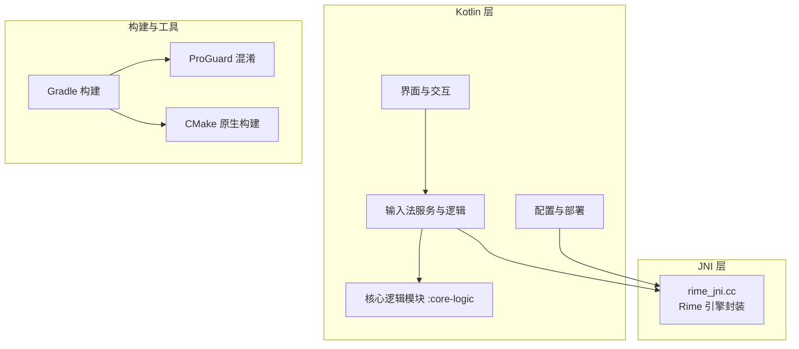
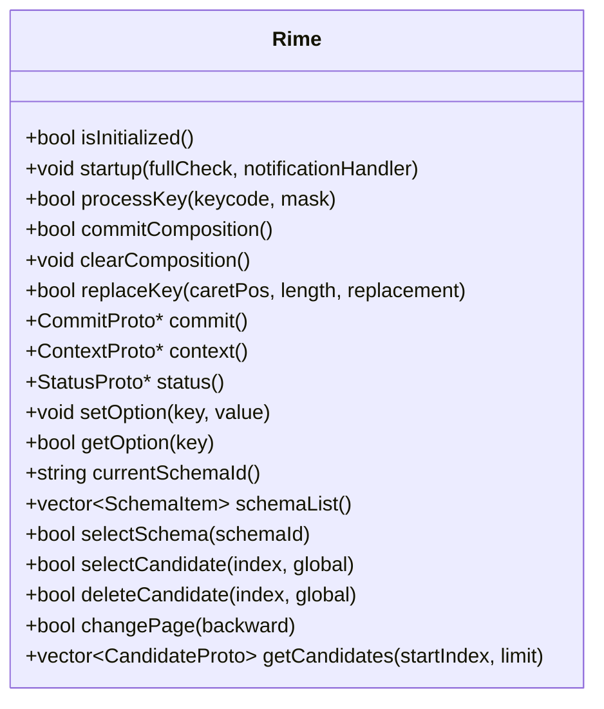
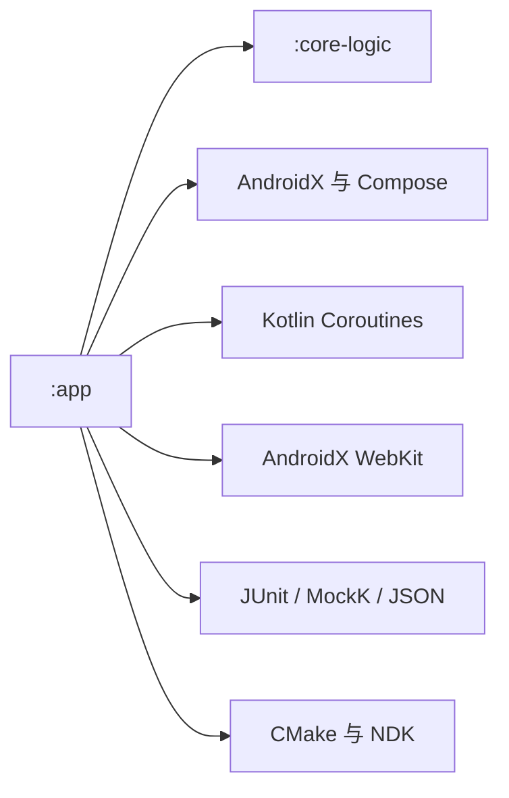

# 开发规范

<cite>
**本文引用的文件**   
- [build.gradle.kts](file://build.gradle.kts)
- [app/build.gradle.kts](file://app/build.gradle.kts)
- [core-logic/build.gradle.kts](file://core-logic/build.gradle.kts)
- [gradle.properties](file://gradle.properties)
- [settings.gradle.kts](file://settings.gradle.kts)
- [ZiyouApplication.kt](file://app/src/main/java/com/ziyou/ime/ZiyouApplication.kt)
- [rime_jni.cc](file://app/src/main/jni/librime_jni/rime_jni.cc)
- [.gitignore](file://.gitignore)
- [proguard-rules.pro](file://app/proguard-rules.pro)
</cite>

## 目录
1. [引言](#引言)
2. [项目结构](#项目结构)
3. [核心组件](#核心组件)
4. [架构总览](#架构总览)
5. [详细组件分析](#详细组件分析)
6. [依赖分析](#依赖分析)
7. [性能考量](#性能考量)
8. [故障排查指南](#故障排查指南)
9. [结论](#结论)
10. [附录](#附录)

## 引言
本规范面向字由输入法项目的 Kotlin 与 JNI 开发，覆盖代码风格、Git 提交规范、分支管理、代码审查标准、测试要求、JNI 层开发规范以及质量检查与自动化流程。目标是在保证输入体验与稳定性的前提下，提升团队协作效率与交付质量。

## 项目结构
- 多模块工程：应用模块 :app 与纯逻辑模块 :core-logic，通过 Gradle 统一构建与依赖管理。
- 构建配置：根级 build.gradle.kts 声明插件；各子模块独立 build.gradle.kts；全局 gradle.properties 设置 Kotlin 代码风格为 official。
- 源码组织：Kotlin 按功能域分包（如 core、ime、config、skill 等），JNI 位于 app/src/main/jni/librime_jni。
- 资源与文档：assets 下包含 Rime 配置与技能插件资源；docs 存放开发指南，构建时同步至 assets 供 App 内展示。

**图表来源** 
- [build.gradle.kts:1-7](file://build.gradle.kts#L1-L7)
- [app/build.gradle.kts:1-111](file://app/build.gradle.kts#L1-L111)
- [core-logic/build.gradle.kts:1-29](file://core-logic/build.gradle.kts#L1-L29)
- [gradle.properties:1-24](file://gradle.properties#L1-L24)
- [settings.gradle.kts:1-28](file://settings.gradle.kts#L1-L28)

**章节来源**
- [build.gradle.kts:1-7](file://build.gradle.kts#L1-L7)
- [app/build.gradle.kts:1-111](file://app/build.gradle.kts#L1-L111)
- [core-logic/build.gradle.kts:1-29](file://core-logic/build.gradle.kts#L1-L29)
- [gradle.properties:1-24](file://gradle.properties#L1-L24)
- [settings.gradle.kts:1-28](file://settings.gradle.kts#L1-L28)

## 核心组件
- 应用入口 ZiyouApplication：负责 Application 生命周期初始化，日志输出与全局实例持有。
- JNI 核心 rime_jni.cc：封装 librime 引擎单例、会话管理、键值处理、候选项操作、上下文与状态获取等。
- ProGuard 规则：保留 core 包反射与 native 方法签名，确保混淆后仍可正确调用。
- 构建与打包：启用 Compose、NDK 构建、ABI 过滤、调试与发布类型差异化配置。

**章节来源**
- [ZiyouApplication.kt:1-26](file://app/src/main/java/com/ziyou/ime/ZiyouApplication.kt#L1-L26)
- [rime_jni.cc:1-200](file://app/src/main/jni/librime_jni/rime_jni.cc#L1-L200)
- [proguard-rules.pro:1-6](file://app/proguard-rules.pro#L1-L6)
- [app/build.gradle.kts:1-111](file://app/build.gradle.kts#L1-L111)

## 架构总览
整体采用“上层 Kotlin + 下层 JNI”的分层架构：
- Kotlin 层：业务逻辑、UI、IME 服务、技能系统、配置管理等。
- JNI 层：Rime 引擎封装，提供稳定的 C++ API 给 Kotlin 调用。
- 构建层：Gradle 统一管理依赖、编译、混淆与产物打包。

**图表来源** 
- [app/build.gradle.kts:1-111](file://app/build.gradle.kts#L1-L111)
- [rime_jni.cc:1-200](file://app/src/main/jni/librime_jni/rime_jni.cc#L1-L200)

## 详细组件分析

### Kotlin 代码风格与命名约定
- 代码风格：全局启用官方 Kotlin 代码风格（kotlin.code.style=official）。
- 命名约定：类名使用大驼峰，方法与属性小驼峰；常量使用全大写加下划线；包名全小写且以公司域名倒序开头。
- 文件结构：每个文件对应一个主要类或一组紧密相关的扩展函数；避免单文件过大，合理拆分职责。
- 注释规范：类与公共 API 需添加 KDoc；复杂逻辑行内注释说明意图而非重复实现；错误路径与边界条件需明确标注。
- 导入顺序：AndroidX/第三方库分组导入，按字母排序，避免通配符导入。

**章节来源**
- [gradle.properties:18-19](file://gradle.properties#L18-L19)

### Git 提交信息规范（Conventional Commits）
- 类型前缀：feat、fix、docs、style、refactor、perf、test、build、ci、chore、revert。
- 格式：type(scope): subject
- 示例：feat(ime): 支持九宫格拼音消歧；fix(core): 修复候选项分页越界问题。
- 提交消息应简洁明了，必要时在正文补充动机与影响范围。

### 分支管理策略
- 主分支保护：main/master 受保护，禁止直接推送；仅允许通过合并请求（MR/PR）合并。
- 功能分支：feature/<描述>，bugfix/<描述>，hotfix/<描述>，release/<版本>。
- 合并流程：本地分支开发 → 提交 PR/MR → 代码审查 → CI 通过 → 合并到主分支 → 打标签发布。

### 代码审查标准
- 技术要点：接口契约清晰、异常处理完备、线程安全、资源释放、内存泄漏风险、并发访问控制。
- 性能考量：避免主线程阻塞、减少对象分配与 GC 压力、合理使用缓存、I/O 异步化。
- 安全问题：敏感数据不落地、权限最小化、WebView 安全加固、输入校验与白名单。
- 可维护性：模块化设计、单一职责、可测试性、清晰的日志与错误码。

### 测试要求
- 单元测试覆盖率目标：核心逻辑模块（:core-logic）建议达到 80% 以上；关键路径与算法优先覆盖。
- 测试用例编写规范：用例命名清晰（should_场景_期望结果）、断言明确、边界与异常路径覆盖。
- 基线维护原则：新增功能必须配套测试；失败用例需及时修复；覆盖率报告纳入 CI 门禁。

### JNI 层开发规范
- RAII 资源管理：使用 std::unique_ptr、RAII 包装器管理 C++ 对象与原生资源，避免手动释放遗漏。
- 异常处理：JNI 层捕获并转换为 Java 异常；避免 C++ 异常跨边界传播；对空指针与非法参数进行防御性检查。
- 内存安全：严格遵循 JNI 字符串与数组生命周期；避免悬挂引用；谨慎使用局部引用与全局引用。
- 日志与调试：使用 Android logcat 输出关键路径；提供开关控制日志级别；避免泄露敏感信息。
- 符号与反射：保持 native 方法签名稳定；ProGuard 规则中保留必要类与方法。

**图表来源** 
- [rime_jni.cc:46-200](file://app/src/main/jni/librime_jni/rime_jni.cc#L46-L200)

**章节来源**
- [rime_jni.cc:1-200](file://app/src/main/jni/librime_jni/rime_jni.cc#L1-L200)

### 构建与发布配置
- NDK 与 ABI：通过 -Pziyou.abis 指定 ABI 列表；默认 arm64-v8a；需先构建 librime.a。
- 外部构建：CMake 路径与版本固定；可选模块（WITH_PREDICT）需与预编译库一致。
- 混淆与优化：Release 开启 minify，关闭激进优化以避免破坏 JNI 符号；ProGuard 规则保留 core 包与 native 方法。
- 资源同步：构建时将 docs/技能插件开发指南.md 同步至 assets 供 App 内展示。

**章节来源**
- [app/build.gradle.kts:16-48](file://app/build.gradle.kts#L16-L48)
- [app/build.gradle.kts:61-81](file://app/build.gradle.kts#L61-L81)
- [app/build.gradle.kts:92-103](file://app/build.gradle.kts#L92-L103)
- [app/build.gradle.kts:115-141](file://app/build.gradle.kts#L115-L141)
- [proguard-rules.pro:1-6](file://app/proguard-rules.pro#L1-L6)

## 依赖分析
- 模块依赖方向：:app → :core-logic（单向，编译器强制边界）。
- 外部依赖：AndroidX、Compose、Coroutines、Preferences、WebView、无障碍库、JUnit、MockK、JSON。
- 构建依赖：AGP、Kotlin、CMake、NDK；Gradle 配置缓存与并行构建以提升速度。

**图表来源** 
- [app/build.gradle.kts:143-191](file://app/build.gradle.kts#L143-L191)
- [core-logic/build.gradle.kts:1-29](file://core-logic/build.gradle.kts#L1-L29)

**章节来源**
- [app/build.gradle.kts:143-191](file://app/build.gradle.kts#L143-L191)
- [core-logic/build.gradle.kts:1-29](file://core-logic/build.gradle.kts#L1-L29)

## 性能考量
- 主线程保护：避免 I/O 与重型计算在主线程执行；使用协程与后台线程。
- 内存管理：减少临时对象创建；复用数据结构；避免不必要的字符串拼接。
- JNI 调用开销：批量处理与缓存结果；减少频繁跨边界调用。
- 构建与运行期优化：启用配置缓存与并行构建；按需启用特性与依赖。

## 故障排查指南
- 启动崩溃：检查 Application 初始化顺序与日志；确认 Rime 引擎初始化成功。
- JNI 调用失败：核对 native 方法签名与 ProGuard 规则；检查参数合法性与生命周期。
- 构建失败：确认 ABI 与 WITH_PREDICT 配置一致；清理 .cxx 与 externalNativeBuild 产物。
- 混淆问题：查看映射文件与堆栈；确保保留必要的类与方法。

**章节来源**
- [ZiyouApplication.kt:19-24](file://app/src/main/java/com/ziyou/ime/ZiyouApplication.kt#L19-L24)
- [proguard-rules.pro:1-6](file://app/proguard-rules.pro#L1-L6)
- [app/build.gradle.kts:61-81](file://app/build.gradle.kts#L61-L81)

## 结论
本规范从代码风格、提交与分支管理、代码审查、测试、JNI 开发与构建发布等方面提供了系统化指导。遵循这些规范有助于提升代码质量、降低协作成本、保障输入法的稳定性与性能。建议在团队内推广并持续迭代完善。

## 附录
- 忽略规则：.gitignore 排除构建产物、密钥与归档，确保仓库整洁与安全。
- 版本与兼容性：compileSdk/targetSdk/minSdk 与 JavaVersion 保持一致；Compose BOM 统一管理依赖版本。

**章节来源**
- [.gitignore:1-26](file://.gitignore#L1-L26)
- [app/build.gradle.kts:22-33](file://app/build.gradle.kts#L22-L33)
- [app/build.gradle.kts:83-90](file://app/build.gradle.kts#L83-L90)