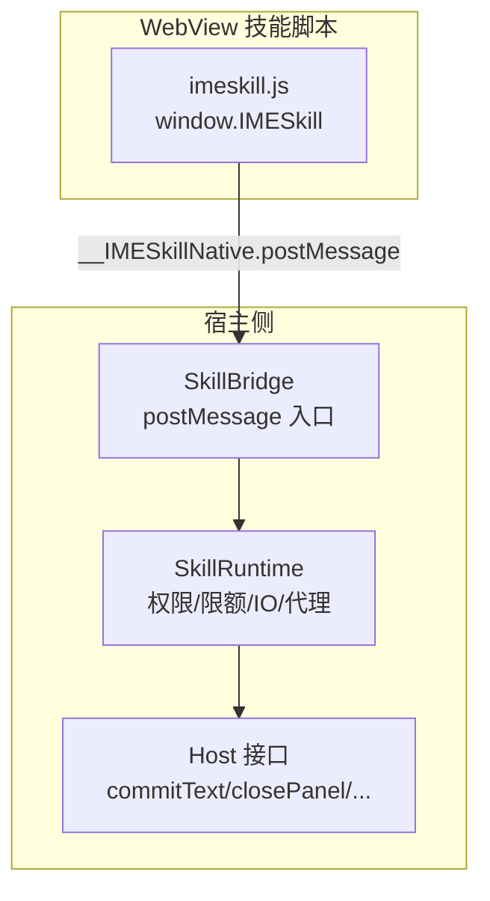
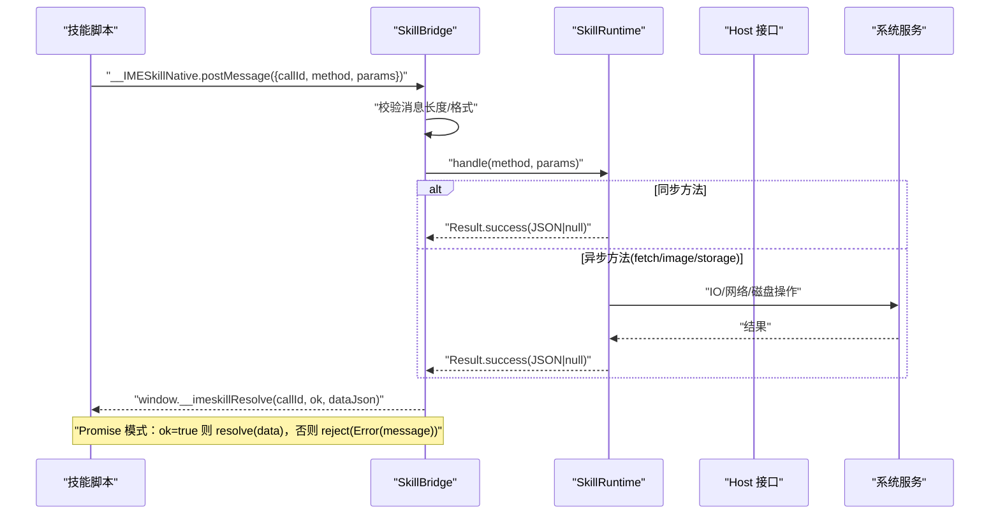
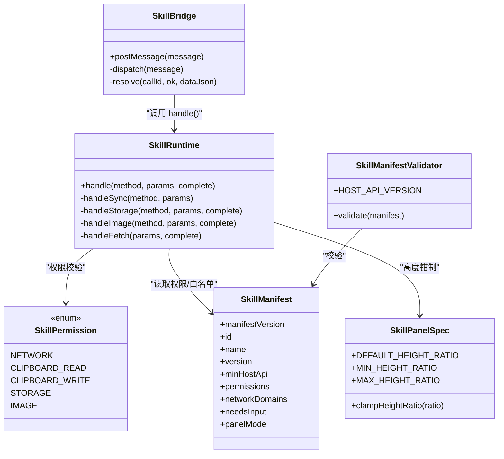

# API 参考

<cite>
**本文引用的文件**   
- [app/src/main/assets/skill_runtime/imeskill.js](file://app/src/main/assets/skill_runtime/imeskill.js)
- [app/src/main/java/com/ziyou/ime/skill/SkillBridge.kt](file://app/src/main/java/com/ziyou/ime/skill/SkillBridge.kt)
- [app/src/main/java/com/ziyou/ime/skill/SkillRuntime.kt](file://app/src/main/java/com/ziyou/ime/skill/SkillRuntime.kt)
- [core-logic/src/main/java/com/ziyou/ime/core/skill/SkillPermission.kt](file://core-logic/src/main/java/com/ziyou/ime/core/skill/SkillPermission.kt)
- [core-logic/src/main/java/com/ziyou/ime/core/skill/SkillManifest.kt](file://core-logic/src/main/java/com/ziyou/ime/core/skill/SkillManifest.kt)
- [core-logic/src/main/java/com/ziyou/ime/core/skill/SkillManifestValidator.kt](file://core-logic/src/main/java/com/ziyou/ime/core/skill/SkillManifestValidator.kt)
- [core-logic/src/main/java/com/ziyou/ime/core/skill/SkillPanelSpec.kt](file://core-logic/src/main/java/com/ziyou/ime/core/skill/SkillPanelSpec.kt)
- [app/src/main/assets/skills/calculator/index.html](file://app/src/main/assets/skills/calculator/index.html)
- [app/src/main/assets/skills/calculator/manifest.json](file://app/src/main/assets/skills/calculator/manifest.json)
- [skills-dev/com.user.constellation/script.js](file://skills-dev/com.user.constellation/script.js)
</cite>

## 目录
1. [简介](#简介)
2. [项目结构](#项目结构)
3. [核心组件](#核心组件)
4. [架构总览](#架构总览)
5. [详细组件分析](#详细组件分析)
6. [依赖关系分析](#依赖关系分析)
7. [性能考量](#性能考量)
8. [故障排查指南](#故障排查指南)
9. [结论](#结论)
10. [附录：API 方法速查与示例](#附录api-方法速查与示例)

## 简介
本文件为 IMESkill Bridge API 的完整参考，面向技能开发者。内容覆盖所有可用 API（sendText、getContext、getLocale、haptic、ui.*、storage.*、input.*、image.*、fetch 等）的参数、返回值、权限与安全限制、错误处理机制、版本兼容策略、性能优化建议与最佳实践，并提供来自仓库内真实技能的用法示例路径。

## 项目结构
- 运行时桥接层
  - JS 垫片：注入到 WebView，统一封装 window.IMESkill，并通过 __IMESkillNative.postMessage 单入口与宿主通信。
  - 宿主桥接：SkillBridge 接收 postMessage，校验并分发到 SkillRuntime。
  - 运行时实现：SkillRuntime 承载权限检查、限额控制、IO 异步、剪贴板、图片输出、网络代理等能力。
- 元数据与权限模型
  - SkillManifest：技能包 manifest 解析结果（id、name、version、minHostApi、permissions、networkDomains、needsInput 等）。
  - SkillPermission：权限枚举（network、clipboard_read、clipboard_write、storage、image）。
  - SkillManifestValidator：manifest 合法性校验与 HOST_API_VERSION 协商。
  - SkillPanelSpec：面板高度规格与钳制规则。
- 示例技能
  - 计算器：展示 sendText、haptic 的基础用法。
  - 星座查询：展示 input.requestFocus/releaseFocus、ui.setExpanded、storage、sendText 的组合使用。

图表来源
- [app/src/main/assets/skill_runtime/imeskill.js:1-164](file://app/src/main/assets/skill_runtime/imeskill.js#L1-L164)
- [app/src/main/java/com/ziyou/ime/skill/SkillBridge.kt:1-99](file://app/src/main/java/com/ziyou/ime/skill/SkillBridge.kt#L1-L99)
- [app/src/main/java/com/ziyou/ime/skill/SkillRuntime.kt:1-521](file://app/src/main/java/com/ziyou/ime/skill/SkillRuntime.kt#L1-L521)

章节来源
- [app/src/main/assets/skill_runtime/imeskill.js:1-164](file://app/src/main/assets/skill_runtime/imeskill.js#L1-L164)
- [app/src/main/java/com/ziyou/ime/skill/SkillBridge.kt:1-99](file://app/src/main/java/com/ziyou/ime/skill/SkillBridge.kt#L1-L99)
- [app/src/main/java/com/ziyou/ime/skill/SkillRuntime.kt:1-521](file://app/src/main/java/com/ziyou/ime/skill/SkillRuntime.kt#L1-L521)

## 核心组件
- SkillBridge
  - 职责：JS 原生桥接单入口，消息长度限制（512KB），主线程分发，异常兜底，释放后拒绝调用。
  - 关键行为：evaluateJavascript 回传 __imeskillResolve(callId, ok, dataJson)。
- SkillRuntime
  - 职责：全部业务逻辑（权限校验、限额、存储、图片、网络代理、输入路由、UI 控制）。
  - 关键常量：STORAGE_LIMIT_BYTES=1MB、MAX_COMMIT_LENGTH=5000、FETCH_TIMEOUT_MS=10s、FETCH_MAX_RESPONSE_BYTES=1MB、FETCH_MAX_PER_MINUTE=30、FETCH_MAX_CONCURRENT=2。
  - 关键能力：handle(method, params, complete) 分派；同步方法立即完成；异步方法通过协程在 IO 执行后回调。
- SkillPermission
  - 权限枚举：network、clipboard_read、clipboard_write、storage、image。
- SkillManifest / SkillManifestValidator / SkillPanelSpec
  - manifest_version、id、name、version、min_host_api、permissions、networkDomains、needsInput、panel_mode。
  - HOST_API_VERSION=4，v1~v4 能力演进。
  - 面板高度比例钳制范围 [0.4, 1.2]，默认 0.6。

章节来源
- [app/src/main/java/com/ziyou/ime/skill/SkillBridge.kt:1-99](file://app/src/main/java/com/ziyou/ime/skill/SkillBridge.kt#L1-L99)
- [app/src/main/java/com/ziyou/ime/skill/SkillRuntime.kt:1-521](file://app/src/main/java/com/ziyou/ime/skill/SkillRuntime.kt#L1-L521)
- [core-logic/src/main/java/com/ziyou/ime/core/skill/SkillPermission.kt:1-27](file://core-logic/src/main/java/com/ziyou/ime/core/skill/SkillPermission.kt#L1-L27)
- [core-logic/src/main/java/com/ziyou/ime/core/skill/SkillManifest.kt:1-51](file://core-logic/src/main/java/com/ziyou/ime/core/skill/SkillManifest.kt#L1-L51)
- [core-logic/src/main/java/com/ziyou/ime/core/skill/SkillManifestValidator.kt:1-78](file://core-logic/src/main/java/com/ziyou/ime/core/skill/SkillManifestValidator.kt#L1-L78)
- [core-logic/src/main/java/com/ziyou/ime/core/skill/SkillPanelSpec.kt:1-30](file://core-logic/src/main/java/com/ziyou/ime/core/skill/SkillPanelSpec.kt#L1-L30)

## 架构总览

图表来源
- [app/src/main/assets/skill_runtime/imeskill.js:1-164](file://app/src/main/assets/skill_runtime/imeskill.js#L1-L164)
- [app/src/main/java/com/ziyou/ime/skill/SkillBridge.kt:1-99](file://app/src/main/java/com/ziyou/ime/skill/SkillBridge.kt#L1-L99)
- [app/src/main/java/com/ziyou/ime/skill/SkillRuntime.kt:1-521](file://app/src/main/java/com/ziyou/ime/skill/SkillRuntime.kt#L1-L521)

## 详细组件分析

### 全局对象与版本
- window.IMESkill.apiVersion
  - 值：3（由宿主覆写协商，实际以 SkillManifestValidator.HOST_API_VERSION 为准）。
  - 用途：manifest.min_host_api 协商。
- 版本演进
  - v1：sendText、getContext、getLocale、haptic、ui.setTitle/ui.close、storage.get/set/remove。
  - v2：fetch 代理、clipboard.read/write、input.requestFocus/releaseFocus、ui.setExpanded。
  - v3：image.send/saveToGallery。
  - v4：ui.setPanelHeight。

章节来源
- [app/src/main/assets/skill_runtime/imeskill.js:73-78](file://app/src/main/assets/skill_runtime/imeskill.js#L73-L78)
- [core-logic/src/main/java/com/ziyou/ime/core/skill/SkillManifestValidator.kt:11-16](file://core-logic/src/main/java/com/ziyou/ime/core/skill/SkillManifestValidator.kt#L11-L16)

### sendText(text)
- 功能：将文本直接上屏至当前应用输入框，并关闭技能面板。
- 参数
  - text: string，非空且不超过上限（5000 字符）。
- 返回：Promise，成功无返回值。
- 安全与限制
  - 长度上限 5000 字符，超限抛出“文本超长”错误。
  - 若存在激活的输入路由（input.requestFocus），会先复位路由再上屏。
- 常见错误
  - text 为空：reject("text 不能为空")。
  - 文本超长：reject("文本超长（上限 5000 字符）")。
- 示例
  - 计算器发送计算结果：[calculator/index.html:173-176](file://app/src/main/assets/skills/calculator/index.html#L173-L176)

章节来源
- [app/src/main/java/com/ziyou/ime/skill/SkillRuntime.kt:160-170](file://app/src/main/java/com/ziyou/ime/skill/SkillRuntime.kt#L160-L170)
- [app/src/main/assets/skills/calculator/index.html:173-176](file://app/src/main/assets/skills/calculator/index.html#L173-L176)

### getContext()
- 功能：获取宿主环境信息。
- 返回：Promise<{packageName: string, inputType: string}>。
- 示例
  - 星座查询中用于判断上下文（未直接调用，但字段定义明确）。

章节来源
- [app/src/main/java/com/ziyou/ime/skill/SkillRuntime.kt:172-175](file://app/src/main/java/com/ziyou/ime/skill/SkillRuntime.kt#L172-L175)

### getLocale()
- 功能：获取系统语言标签（BCP 47，如 zh-CN）。
- 返回：Promise<string>。

章节来源
- [app/src/main/java/com/ziyou/ime/skill/SkillRuntime.kt:177](file://app/src/main/java/com/ziyou/ime/skill/SkillRuntime.kt#L177)

### haptic()
- 功能：触发震动反馈。
- 返回：Promise，成功无返回值。

章节来源
- [app/src/main/java/com/ziyou/ime/skill/SkillRuntime.kt:179-182](file://app/src/main/java/com/ziyou/ime/skill/SkillRuntime.kt#L179-L182)

### ui.*
- ui.setTitle(title)
  - 参数：title: string，长度上限 20。
  - 返回：Promise。
- ui.close()
  - 返回：Promise。
- ui.setExpanded(expanded)
  - 参数：expanded: boolean，缺省 true。
  - 说明：仅 needs_input 技能有效；false 收缩整个输入法界面（键盘/编码区/候选区缩回），true 恢复。
  - 返回：Promise。
- ui.setPanelHeight(ratio)
  - 参数：ratio: number，被钳制到 [0.4, 1.2]，默认 0.6。
  - 说明：仅 needs_input 技能有效；退出技能时自动复位。
  - 返回：Promise。
- 示例
  - 星座查询收缩/恢复界面：[script.js:145-149](file://skills-dev/com.user.constellation/script.js#L145-L149)

章节来源
- [app/src/main/java/com/ziyou/ime/skill/SkillRuntime.kt:184-208](file://app/src/main/java/com/ziyou/ime/skill/SkillRuntime.kt#L184-L208)
- [core-logic/src/main/java/com/ziyou/ime/core/skill/SkillPanelSpec.kt:10-29](file://core-logic/src/main/java/com/ziyou/ime/core/skill/SkillPanelSpec.kt#L10-L29)
- [skills-dev/com.user.constellation/script.js:145-149](file://skills-dev/com.user.constellation/script.js#L145-L149)

### storage.*
- storage.get(key)
  - 参数：key: string，非空。
  - 返回：Promise<string|null>，值为 JSON 字符串或 null。
- storage.set(key, value)
  - 参数：key: string，value: string。
  - 返回：Promise。
- storage.remove(key)
  - 参数：key: string。
  - 返回：Promise。
- 权限：需要 storage 权限。
- 限额：每技能独立存储空间，序列化后最大 1MB。
- 并发：串行 IO，保证 set/remove 顺序。
- 示例
  - 星座查询历史持久化：[script.js:200-216](file://skills-dev/com.user.constellation/script.js#L200-L216)

章节来源
- [app/src/main/java/com/ziyou/ime/skill/SkillRuntime.kt:250-284](file://app/src/main/java/com/ziyou/ime/skill/SkillRuntime.kt#L250-L284)
- [skills-dev/com.user.constellation/script.js:200-216](file://skills-dev/com.user.constellation/script.js#L200-L216)

### clipboard.*
- clipboard.read()
  - 权限：clipboard_read。
  - 返回：Promise<string|null>。
- clipboard.write(text)
  - 权限：clipboard_write。
  - 参数：text: string。
  - 返回：Promise。
- 示例
  - 未在当前示例技能中使用，但 API 已实现。

章节来源
- [app/src/main/java/com/ziyou/ime/skill/SkillRuntime.kt:210-224](file://app/src/main/java/com/ziyou/ime/skill/SkillRuntime.kt#L210-L224)

### input.*
- input.requestFocus(fieldId)
  - 权限：需 manifest 声明 needs_input。
  - 参数：fieldId: string，DOM 元素 id。
  - 行为：激活输入路由，后续键盘上屏文本注入指定 input/textarea。
  - 返回：Promise。
- input.releaseFocus()
  - 行为：关闭输入路由，恢复直达宿主编辑框。
  - 返回：Promise。
- 示例
  - 星座查询点击输入框启用路由：[script.js:90-96](file://skills-dev/com.user.constellation/script.js#L90-L96)

章节来源
- [app/src/main/java/com/ziyou/ime/skill/SkillRuntime.kt:227-238](file://app/src/main/java/com/ziyou/ime/skill/SkillRuntime.kt#L227-L238)
- [skills-dev/com.user.constellation/script.js:90-96](file://skills-dev/com.user.constellation/script.js#L90-L96)

### image.*
- image.send(base64)
  - 权限：image。
  - 参数：base64: string，仅支持 PNG（可带 data URL 前缀）。
  - 行为：经 commitContent 发送到当前输入框（需编辑器接受 image/*）。
  - 返回：Promise。
- image.saveToGallery(base64)
  - 权限：image。
  - 参数：base64: string，仅支持 PNG。
  - 行为：保存到系统相册（Android 10+）。
  - 返回：Promise。
- 限制
  - 仅 PNG（文件头魔数校验）。
  - 单条消息上限 512KB（Bridge 层限制）。
  - 超大图建议先降分辨率重绘。
- 示例
  - 未在当前示例技能中使用，但 API 已实现。

章节来源
- [app/src/main/java/com/ziyou/ime/skill/SkillRuntime.kt:293-332](file://app/src/main/java/com/ziyou/ime/skill/SkillRuntime.kt#L293-L332)
- [app/src/main/java/com/ziyou/ime/skill/SkillBridge.kt:30-32](file://app/src/main/java/com/ziyou/ime/skill/SkillBridge.kt#L30-L32)

### fetch(url, options)
- 权限：network + network_domains 白名单。
- 参数
  - url: string，必须 HTTPS。
  - options: object，可选 {method:'POST', body, contentType}。
- 返回：Promise<{status: number, body: string}>。
- 安全与限制
  - 强制 HTTPS。
  - 域名白名单精确匹配（IDN/punycode 归一化小写）。
  - 超时 10s，响应体 ≤1MB。
  - 频控 30 次/分钟，并发 ≤2。
  - 禁止跟随重定向（防白名单逃逸）。
- 示例
  - 未在当前示例技能中使用，但 API 已实现。

章节来源
- [app/src/main/java/com/ziyou/ime/skill/SkillRuntime.kt:374-427](file://app/src/main/java/com/ziyou/ime/skill/SkillRuntime.kt#L374-L427)

## 依赖关系分析

图表来源
- [app/src/main/java/com/ziyou/ime/skill/SkillBridge.kt:1-99](file://app/src/main/java/com/ziyou/ime/skill/SkillBridge.kt#L1-L99)
- [app/src/main/java/com/ziyou/ime/skill/SkillRuntime.kt:1-521](file://app/src/main/java/com/ziyou/ime/skill/SkillRuntime.kt#L1-L521)
- [core-logic/src/main/java/com/ziyou/ime/core/skill/SkillPermission.kt:1-27](file://core-logic/src/main/java/com/ziyou/ime/core/skill/SkillPermission.kt#L1-L27)
- [core-logic/src/main/java/com/ziyou/ime/core/skill/SkillManifest.kt:1-51](file://core-logic/src/main/java/com/ziyou/ime/core/skill/SkillManifest.kt#L1-L51)
- [core-logic/src/main/java/com/ziyou/ime/core/skill/SkillManifestValidator.kt:1-78](file://core-logic/src/main/java/com/ziyou/ime/core/skill/SkillManifestValidator.kt#L1-L78)
- [core-logic/src/main/java/com/ziyou/ime/core/skill/SkillPanelSpec.kt:1-30](file://core-logic/src/main/java/com/ziyou/ime/core/skill/SkillPanelSpec.kt#L1-L30)

章节来源
- [app/src/main/java/com/ziyou/ime/skill/SkillBridge.kt:1-99](file://app/src/main/java/com/ziyou/ime/skill/SkillBridge.kt#L1-L99)
- [app/src/main/java/com/ziyou/ime/skill/SkillRuntime.kt:1-521](file://app/src/main/java/com/ziyou/ime/skill/SkillRuntime.kt#L1-L521)

## 性能考量
- 消息大小限制
  - Bridge 单条消息上限 512KB，避免拖垮主线程。
- 存储 I/O
  - storage 使用单并发 IO 调度器，保证提交顺序，避免竞争。
- 网络请求
  - 超时 10s，响应体 ≤1MB，频控 30 次/分钟，并发 ≤2，禁重定向。
- 文本上屏
  - 单次上限 5000 字符，防止注入超长文本。
- 图片处理
  - base64 解码与写盘在 IO 线程执行；commitContent 在主线程执行。
- UI 更新
  - setTitle 标题长度上限 20，减少频繁重绘。

章节来源
- [app/src/main/java/com/ziyou/ime/skill/SkillBridge.kt:30-32](file://app/src/main/java/com/ziyou/ime/skill/SkillBridge.kt#L30-L32)
- [app/src/main/java/com/ziyou/ime/skill/SkillRuntime.kt:48-66](file://app/src/main/java/com/ziyou/ime/skill/SkillRuntime.kt#L48-L66)
- [app/src/main/java/com/ziyou/ime/skill/SkillRuntime.kt:119-121](file://app/src/main/java/com/ziyou/ime/skill/SkillRuntime.kt#L119-L121)
- [app/src/main/java/com/ziyou/ime/skill/SkillRuntime.kt:374-427](file://app/src/main/java/com/ziyou/ime/skill/SkillRuntime.kt#L374-L427)

## 故障排查指南
- 权限拒绝
  - 现象：reject("权限拒绝：manifest 未声明 <permission>")。
  - 原因：技能 manifest 未声明所需权限。
  - 解决：在 manifest.json 的 permissions 中添加对应权限。
- 未知方法
  - 现象：reject("未知方法: <method>")。
  - 原因：调用了未实现的 API。
  - 解决：核对 API 列表与版本兼容性。
- 非法 URL
  - 现象：reject("非法 URL" 或 "仅允许 HTTPS 请求" 或 "域名不在白名单: <host>")。
  - 原因：URL 不合法、非 HTTPS 或域名不在白名单。
  - 解决：修正 URL，确保 HTTPS，并在 manifest.networkDomains 添加域名。
- 请求过于频繁/并发超限
  - 现象：reject("请求过于频繁（上限 30 次/分钟）" 或 "并发请求超限（上限 2）")。
  - 原因：超过频控或并发限制。
  - 解决：降低请求频率，合并请求或使用队列。
- 存储超限
  - 现象：reject("存储超限（上限 1MB）")。
  - 原因：序列化后的 JSON 超过 1MB。
  - 解决：精简存储数据或清理历史。
- 图片无效/不支持
  - 现象：reject("图片数据无效" 或 "仅支持 PNG 图片" 或 "当前输入框不支持接收图片" 或 "保存到相册需要 Android 10 及以上系统")。
  - 原因：非 PNG、编辑器不接受图片、系统版本过低。
  - 解决：转换为 PNG，确认编辑器支持，升级系统。
- 输入路由不可用
  - 现象：reject("manifest 未声明 needs_input，无法使用面板输入")。
  - 原因：技能未声明 needs_input。
  - 解决：在 manifest 中设置 needsInput=true。

章节来源
- [app/src/main/java/com/ziyou/ime/skill/SkillRuntime.kt:485-495](file://app/src/main/java/com/ziyou/ime/skill/SkillRuntime.kt#L485-L495)
- [app/src/main/java/com/ziyou/ime/skill/SkillRuntime.kt:374-427](file://app/src/main/java/com/ziyou/ime/skill/SkillRuntime.kt#L374-L427)
- [app/src/main/java/com/ziyou/ime/skill/SkillRuntime.kt:293-332](file://app/src/main/java/com/ziyou/ime/skill/SkillRuntime.kt#L293-L332)
- [app/src/main/java/com/ziyou/ime/skill/SkillRuntime.kt:227-238](file://app/src/main/java/com/ziyou/ime/skill/SkillRuntime.kt#L227-L238)

## 结论
IMESkill Bridge API 通过统一的 Promise 模型与单入口桥接，提供安全的跨进程通信。权限模型严格、限额与频控完善，适合构建轻量、可控的技能生态。开发者应遵循权限声明、白名单配置、限额约束与版本兼容策略，以获得稳定可靠的体验。

## 附录：API 方法速查与示例

- sendText(text)
  - 参数：text(string)
  - 返回：Promise<void>
  - 示例：[calculator/index.html:173-176](file://app/src/main/assets/skills/calculator/index.html#L173-L176)

- getContext()
  - 返回：Promise<{packageName:string, inputType:string}>

- getLocale()
  - 返回：Promise<string>

- haptic()
  - 返回：Promise<void>

- ui.setTitle(title)
  - 参数：title(string, ≤20)
  - 返回：Promise<void>

- ui.close()
  - 返回：Promise<void>

- ui.setExpanded(expanded)
  - 参数：expanded(boolean, 默认 true)
  - 返回：Promise<void>
  - 示例：[script.js:145-149](file://skills-dev/com.user.constellation/script.js#L145-L149)

- ui.setPanelHeight(ratio)
  - 参数：ratio(number, 钳制 [0.4, 1.2])
  - 返回：Promise<void>

- storage.get(key)
  - 参数：key(string)
  - 返回：Promise<string|null>
  - 示例：[script.js:209-216](file://skills-dev/com.user.constellation/script.js#L209-L216)

- storage.set(key, value)
  - 参数：key(string), value(string)
  - 返回：Promise<void>

- storage.remove(key)
  - 参数：key(string)
  - 返回：Promise<void>

- clipboard.read()
  - 返回：Promise<string|null>

- clipboard.write(text)
  - 参数：text(string)
  - 返回：Promise<void>

- input.requestFocus(fieldId)
  - 参数：fieldId(string)
  - 返回：Promise<void>
  - 示例：[script.js:90-96](file://skills-dev/com.user.constellation/script.js#L90-L96)

- input.releaseFocus()
  - 返回：Promise<void>

- image.send(base64)
  - 参数：base64(string, PNG)
  - 返回：Promise<void>

- image.saveToGallery(base64)
  - 参数：base64(string, PNG)
  - 返回：Promise<void>

- fetch(url, options)
  - 参数：url(string, HTTPS), options(object)
  - 返回：Promise<{status:number, body:string}>

章节来源
- [app/src/main/assets/skill_runtime/imeskill.js:73-162](file://app/src/main/assets/skill_runtime/imeskill.js#L73-L162)
- [app/src/main/java/com/ziyou/ime/skill/SkillRuntime.kt:159-241](file://app/src/main/java/com/ziyou/ime/skill/SkillRuntime.kt#L159-L241)
- [app/src/main/java/com/ziyou/ime/skill/SkillRuntime.kt:250-332](file://app/src/main/java/com/ziyou/ime/skill/SkillRuntime.kt#L250-L332)
- [app/src/main/java/com/ziyou/ime/skill/SkillRuntime.kt:374-427](file://app/src/main/java/com/ziyou/ime/skill/SkillRuntime.kt#L374-L427)
- [skills-dev/com.user.constellation/script.js:90-96](file://skills-dev/com.user.constellation/script.js#L90-L96)
- [skills-dev/com.user.constellation/script.js:145-149](file://skills-dev/com.user.constellation/script.js#L145-L149)
- [skills-dev/com.user.constellation/script.js:200-216](file://skills-dev/com.user.constellation/script.js#L200-L216)
- [app/src/main/assets/skills/calculator/index.html:173-176](file://app/src/main/assets/skills/calculator/index.html#L173-L176)